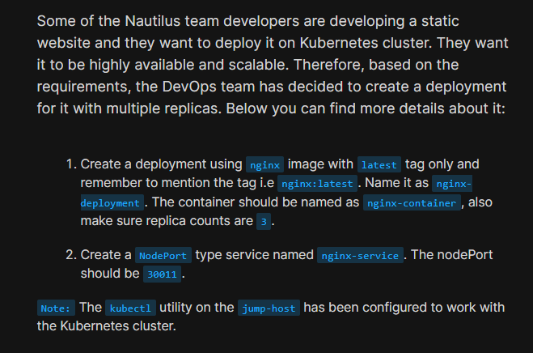
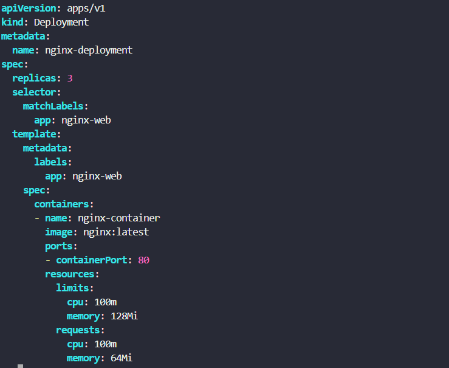
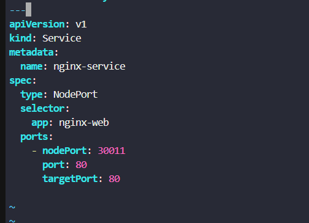
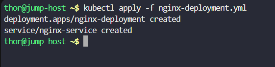
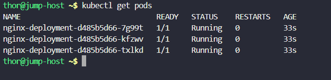
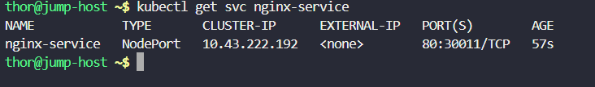
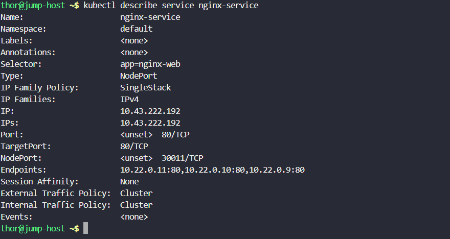

# Day 56: Deploy Nginx Web Server on Kubernetes Cluster

<div style="border:1px solid #ccc; padding:10px; border-radius:10px; box-shadow:2px 2px 8px rgba(0,0,0,0.2); display:inline-block;">
  
</div>

### Content:

>Today I worked on deploying an **Nginx web server on a Kubernetes cluster** using a **Deployment** and a **NodePort Service**. This task helped me understand how Kubernetes manages scalable applications using Deployments, how multiple replicas provide high availability, and how Services expose applications to network traffic.

---

## 🔹 What I Learned

* How to create a Kubernetes **Deployment** using a YAML manifest
* Understanding **replicas** for high availability and scalability
* Difference between a **Pod** and a **Deployment**
* Creating a **NodePort Service** to expose applications
* Using labels and selectors for communication between resources
* Deploying and validating resources using `kubectl`

---

## 🔹 Task Requirement

<div style="border:1px solid #ccc; padding:10px; border-radius:10px; box-shadow:2px 2px 8px rgba(0,0,0,0.2); display:inline-block;">
  
</div>

As per the Nautilus DevOps team requirements, I needed to:

Create a Deployment and Service with the following details:

| Requirement     | Value            |
| --------------- | ---------------- |
| Deployment Name | nginx-deployment |
| Image           | nginx:latest     |
| Container Name  | nginx-container  |
| Replica Count   | 3                |
| Service Name    | nginx-service    |
| Service Type    | NodePort         |
| NodePort        | 30011            |

The application needed to be deployed successfully in the Kubernetes cluster and exposed through a NodePort service.

---

## 🔹 Steps I Followed

### 1. Connected to the Jump Host

Logged into the jump host where **kubectl** was already configured for Kubernetes cluster access.

Observed:

* Kubernetes cluster access was preconfigured
* Ready to create Deployment and Service resources

---

### 2. Created Deployment and Service Manifest File

Executed:

```bash
vi nginx-deployment.yml
```
<div style="border:1px solid #ccc; padding:10px; border-radius:10px; box-shadow:2px 2px 8px rgba(0,0,0,0.2); display:inline-block;">
  
</div>

Added the following YAML configuration:

```yaml
apiVersion: apps/v1
kind: Deployment
metadata:
  name: nginx-deployment

spec:
  replicas: 3
  selector:
    matchLabels:
      app: nginx-web

  template:
    metadata:
      labels:
        app: nginx-web

    spec:
      containers:
      - name: nginx-container
        image: nginx:latest
        ports:
        - containerPort: 80

        resources:
          limits:
            cpu: 100m
            memory: 128Mi
          requests:
            cpu: 100m
            memory: 64Mi

---
apiVersion: v1
kind: Service
metadata:
  name: nginx-service

spec:
  type: NodePort

  selector:
    app: nginx-web

  ports:
    - nodePort: 30011
      port: 80
      targetPort: 80
```

---

## 🔹 Simple Explanation of the YAML File

<div style="border:1px solid #ccc; padding:10px; border-radius:10px; box-shadow:2px 2px 8px rgba(0,0,0,0.2); display:inline-block;">
  
</div>

### Deployment API Version

```yaml
apiVersion: apps/v1
```

Specifies the Kubernetes API version for Deployment resources.

---

### Resource Type

```yaml
kind: Deployment
```

Defines that Kubernetes should create a **Deployment**.

A Deployment manages Pods automatically and ensures the desired number of replicas are running.

---

### Metadata Section

```yaml
metadata:
  name: nginx-deployment
```

Defines the Deployment name.

---

### Deployment Specification

```yaml
spec:
  replicas: 3
```

Tells Kubernetes to maintain **3 running Pod replicas**.

This provides:

* High availability
* Scalability
* Fault tolerance

---

### Label Selector

```yaml
selector:
  matchLabels:
    app: nginx-web
```

Used by the Deployment to identify which Pods it manages.

---

### Pod Template

```yaml
template:
```

Defines the configuration for Pods created by the Deployment.

---

### Container Configuration

```yaml
containers:
  - name: nginx-container
    image: nginx:latest
```

Creates a container:

* Name → `nginx-container`
* Image → `nginx:latest`

---

### Container Port

```yaml
ports:
  - containerPort: 80
```

Exposes port **80** inside the Nginx container.

---

### Resource Requests and Limits

```yaml
resources:
```

Defines CPU and memory allocation.

**Requests:**

Minimum resources Kubernetes guarantees.

**Limits:**

Maximum resources the container can consume.

Configured values:

| Resource | Request | Limit |
| -------- | ------- | ----- |
| CPU      | 100m    | 100m  |
| Memory   | 64Mi    | 128Mi |

---

### Service Configuration

<div style="border:1px solid #ccc; padding:10px; border-radius:10px; box-shadow:2px 2px 8px rgba(0,0,0,0.2); display:inline-block;">
  
</div>

```yaml
kind: Service
```

Creates a Kubernetes Service.

---

### NodePort Service

```yaml
type: NodePort
```

Exposes the application externally using a NodePort.

---

### Service Selector

```yaml
selector:
  app: nginx-web
```

Connects the Service to Pods having the label:

```yaml
app: nginx-web
```

---

### Port Mapping

```yaml
ports:
  - nodePort: 30011
    port: 80
    targetPort: 80
```

Defines:

* **Port 80** → Service Port
* **TargetPort 80** → Container Port
* **NodePort 30011** → External access port

---

👉 In simple terms:

This YAML file tells Kubernetes to:

* Create an **Nginx Deployment**
* Maintain **3 running replicas**
* Run containers using **nginx:latest**
* Expose the application externally through a **NodePort Service on port 30011**

---

### 3. Applied the Deployment Configuration

Executed:

```bash
kubectl apply -f nginx-deployment.yml
```
<div style="border:1px solid #ccc; padding:10px; border-radius:10px; box-shadow:2px 2px 8px rgba(0,0,0,0.2); display:inline-block;">
  
</div>

Observed:

```bash
deployment.apps/nginx-deployment created
service/nginx-service created
```

This confirmed:

* Deployment was created successfully
* Service was created successfully

---

### 4. Verified Pod Status

Executed:

```bash
kubectl get pods
```
<div style="border:1px solid #ccc; padding:10px; border-radius:10px; box-shadow:2px 2px 8px rgba(0,0,0,0.2); display:inline-block;">
  
</div>

Observed:

```bash
NAME                               READY   STATUS    RESTARTS   AGE
nginx-deployment-d485b5d66-7g99t   1/1     Running   0          33s
nginx-deployment-d485b5d66-kfzwv   1/1     Running   0          33s
nginx-deployment-d485b5d66-txlkd   1/1     Running   0          33s
```

This confirmed:

* 3 replicas were created
* All containers were running successfully
* Deployment achieved the desired state

---

### 5. Verified Service Creation

Executed:

```bash
kubectl get svc nginx-service
```
<div style="border:1px solid #ccc; padding:10px; border-radius:10px; box-shadow:2px 2px 8px rgba(0,0,0,0.2); display:inline-block;">
  
</div>

Observed:

```bash
NAME            TYPE       CLUSTER-IP      EXTERNAL-IP   PORT(S)        AGE
nginx-service   NodePort   10.43.222.192   <none>        80:30011/TCP   57s
```

This confirmed:

* Service type = NodePort
* NodePort = 30011
* Service was active

---

### 6. Inspected Service Details

Executed:

```bash
kubectl describe service nginx-service
```
<div style="border:1px solid #ccc; padding:10px; border-radius:10px; box-shadow:2px 2px 8px rgba(0,0,0,0.2); display:inline-block;">
  
</div>

Observed:

```bash
Selector:      app=nginx-web
Type:          NodePort
TargetPort:    80/TCP
NodePort:      30011/TCP
Endpoints:     10.22.0.11:80,10.22.0.10:80,10.22.0.9:80
```

This confirmed:

* Service correctly selected Deployment Pods
* Traffic routing was functioning properly
* All three Pods were registered as endpoints

---

## 🔹 My Understanding

This task strengthened my understanding of Kubernetes **Deployments** and **Services**. I learned how Deployments manage multiple Pods automatically and how Services expose workloads for network access.

I also understood how labels and selectors connect Kubernetes resources together.

---

## 🔹 What I Found Interesting

I found it interesting how Kubernetes can automatically maintain multiple running replicas without manual intervention. Even more interesting was how a Service can dynamically discover Pods using labels and expose the application externally using a simple NodePort configuration.

* * *

### Topics Covered

- ***kubernetes***
- ***kubernetes-deployment***
- ***kubernetes-service***
- ***kubectl***


**Previous Task**: [Day 55: Kubernetes Sidecar Containers ](../Day_55/day_55.md)

**Next Task**: [Day 57: Print Environment Variables](../Day_57/day_57.md)

