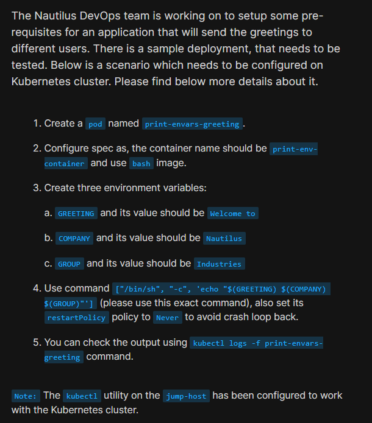
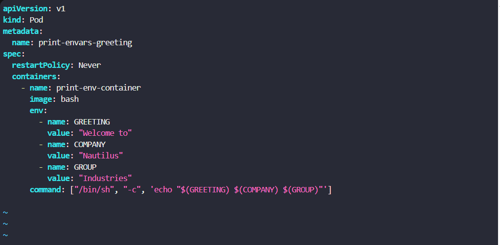
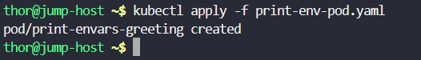
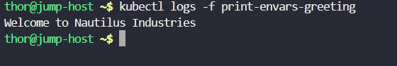

# Day 57: Print Environment Variables

<div style="border:1px solid #ccc; padding:10px; border-radius:10px; box-shadow:2px 2px 8px rgba(0,0,0,0.2); display:inline-block;">
  
</div>

## Content:

> Today I worked on creating a Kubernetes Pod that prints environment variable values using a container command. This task helped me understand how Kubernetes environment variables are configured inside containers, how commands can access those variables, and how restart policies control Pod behavior.

* * *

## 🔹 What I Learned

    
*   Configuring environment variables inside a container
    
*   Using the `env` section in Kubernetes manifests
    
*   Executing custom container commands using `command`
    
*   Understanding container environment variable usage
    
*   Using `restartPolicy: Never` to avoid CrashLoopBackOff behavior
    
    

* * *

## 🔹 Task Requirement

<div style="border:1px solid #ccc; padding:10px; border-radius:10px; box-shadow:2px 2px 8px rgba(0,0,0,0.2); display:inline-block;">
  
</div>

As per the Nautilus DevOps team requirements, I needed to:

Create a Kubernetes Pod with the following specifications:

| Requirement | Value |
| --- | --- |
| Pod Name | print-envars-greeting |
| Container Name | print-env-container |
| Image | bash |
| Environment Variable 1 | GREETING = Welcome to |
| Environment Variable 2 | COMPANY = Nautilus |
| Environment Variable 3 | GROUP = Industries |
| Command | `["/bin/sh","-c",'echo "$(GREETING) $(COMPANY) $(GROUP)"']` |
| Restart Policy | Never |

The Pod needed to print the configured environment variable values successfully.

* * *

## 🔹 Steps I Followed

### 1\. Connected to the Jump Host

Logged into the jump host where `kubectl` was already configured for Kubernetes cluster access.

* * *

### 2\. Created Pod Manifest File

Executed:

```bash
vi print-env-pod.yaml
```
<div style="border:1px solid #ccc; padding:10px; border-radius:10px; box-shadow:2px 2px 8px rgba(0,0,0,0.2); display:inline-block;">
  
</div>

Added the following YAML configuration:

```yaml
apiVersion: v1
kind: Pod
metadata:
  name: print-envars-greeting

spec:
  restartPolicy: Never

  containers:
    - name: print-env-container
      image: bash

      env:
        - name: GREETING
          value: "Welcome to"

        - name: COMPANY
          value: "Nautilus"

        - name: GROUP
          value: "Industries"

      command: ["/bin/sh", "-c", 'echo "$(GREETING) $(COMPANY) $(GROUP)"']
```

* * *

## 🔹 Simple Explanation of the YAML File

<div style="border:1px solid #ccc; padding:10px; border-radius:10px; box-shadow:2px 2px 8px rgba(0,0,0,0.2); display:inline-block;">
  
</div>

### API Version

```yaml
apiVersion: v1
```

Specifies the Kubernetes API version used for core resources such as Pods.

* * *

### Resource Type

```yaml
kind: Pod
```

Defines that Kubernetes should create a **Pod**.

A Pod is the smallest deployable unit in Kubernetes.

* * *

### Metadata Section

```yaml
metadata:
  name: print-envars-greeting
```

Defines the Pod name.

* * *

### Pod Specification

```yaml
spec:
```

Contains the Pod configuration.

* * *

### Restart Policy

```yaml
restartPolicy: Never
```

Instructs Kubernetes **not to restart the container** after completion or failure.

This prevents:

*   Crash loop behavior
    
*   Continuous container restarts
    

* * *

### Container Configuration

```yaml
containers:
```

Defines the container configuration inside the Pod.

* * *

### Container Name and Image

```yaml
- name: print-env-container
  image: bash
```

Creates a container:

*   Name → `print-env-container`
    
*   Image → `bash`
    

* * *

### Environment Variables

```yaml
env:
```

Used to define environment variables inside the container.

Configured values:

| Variable | Value |
| --- | --- |
| GREETING | Welcome to |
| COMPANY | Nautilus |
| GROUP | Industries |

These variables become available inside the container runtime environment.

* * *

### Command Configuration

```yaml
command: ["/bin/sh", "-c", 'echo "$(GREETING) $(COMPANY) $(GROUP)"']
```

Runs a shell command inside the container.

The command prints:

*   GREETING value
    
*   COMPANY value
    
*   GROUP value
    

Combined output:

```text
Welcome to Nautilus Industries
```

👉 In simple terms:

This YAML file tells Kubernetes to:

*   Create a Pod named `print-envars-greeting`
    
*   Run a container using the `bash` image
    
*   Configure three environment variables
    
*   Execute a shell command to print their values
    
*   Avoid restarting the container after execution
    

* * *

### 3\. Applied the Pod Configuration

Executed:

```bash
kubectl apply -f print-env-pod.yaml
```
<div style="border:1px solid #ccc; padding:10px; border-radius:10px; box-shadow:2px 2px 8px rgba(0,0,0,0.2); display:inline-block;">
  
</div>

Observed:

```text
pod/print-envars-greeting created
```

This confirmed:

*   Pod was created successfully
    

* * *

### 4\. Verified Container Output

Executed:

```bash
kubectl logs -f print-envars-greeting
```
<div style="border:1px solid #ccc; padding:10px; border-radius:10px; box-shadow:2px 2px 8px rgba(0,0,0,0.2); display:inline-block;">
  
</div>

Observed:

```text
Welcome to Nautilus Industries
```

This confirmed:

*   Environment variables were configured correctly
    
*   Command executed successfully
    
*   Pod produced the expected output
    

* * *

## 🔹 My Understanding

This task strengthened my understanding of Kubernetes Pods, environment variables, and container commands. I learned how environment variables can be injected into containers using the `env` section and how commands inside containers can use those values dynamically.

I also understood why `restartPolicy: Never` is useful for one-time execution tasks.

* * *

## 🔹 What I Found Interesting

I found it interesting how Kubernetes makes it easy to inject configuration into containers using environment variables. Instead of hardcoding values inside an application, Kubernetes allows dynamic configuration directly from the Pod manifest.

I also found it useful that logs can immediately validate container execution and output using a simple `kubectl logs` command.


* * *

### Topics Covered

- ***kubernetes***
- ***kubernetes-deployment***
- ***kubernetes-service***
- ***kubectl***


**Previous Task**: [Day 56: Deploy Nginx Web Server on Kubernetes Cluster ](../Day_56/day_56.md)

**Next Task**: [Day 58: Deploy Grafana on Kubernetes Cluster](../Day_58/day_58.md)
