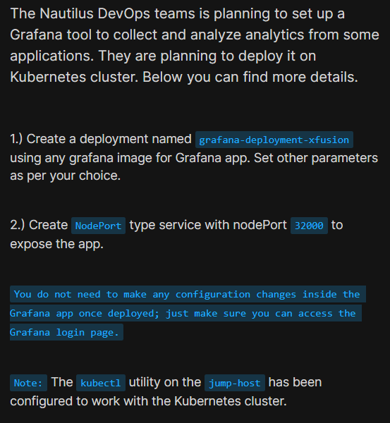
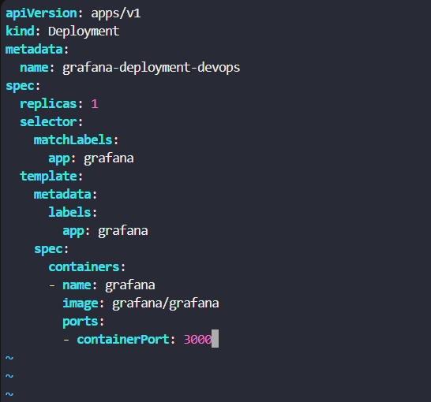
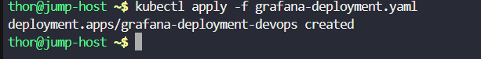
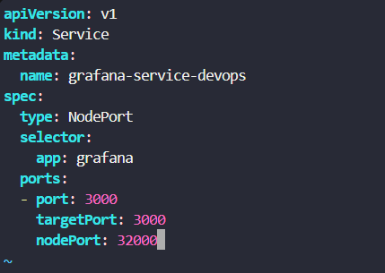
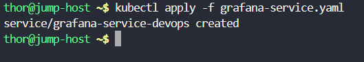
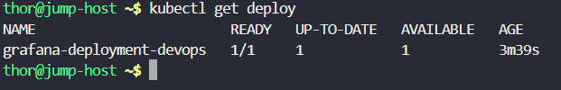
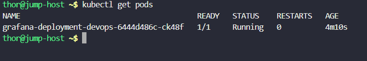
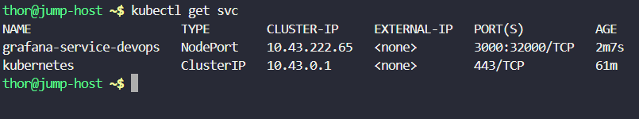
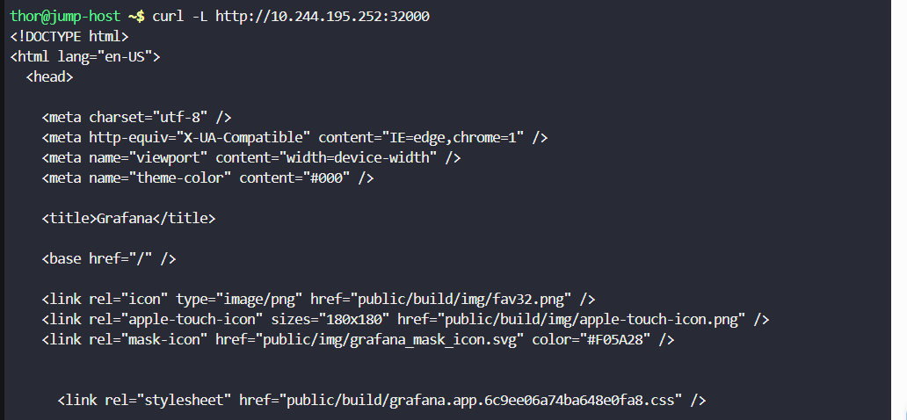

# Day 58: Deploy Grafana on Kubernetes Cluster

<div style="border:1px solid #ccc; padding:10px; border-radius:10px; box-shadow:2px 2px 8px rgba(0,0,0,0.2); display:inline-block;">
  
</div>

## Content:

> Today I worked on deploying **Grafana on a Kubernetes cluster** and exposing it using a **NodePort Service**. This task helped me understand how Kubernetes Deployments manage application containers, how Services expose applications externally, and how to verify application accessibility inside a cluster.

* * *

## 🔹 What I Learned

*   Creating Kubernetes **Deployments**
    
*   Deploying applications using container images
    
*   Using **labels and selectors** for pod-service communication
    
*   Creating a **NodePort Service** to expose applications
    
*   Understanding container port vs service port vs nodePort
    
*   Verifying Kubernetes resources using `kubectl`
    
*   Testing application accessibility using `curl`
    

* * *

## 🔹 Task Requirement
<div style="border:1px solid #ccc; padding:10px; border-radius:10px; box-shadow:2px 2px 8px rgba(0,0,0,0.2); display:inline-block;">
  
</div>

As per the Nautilus DevOps team requirements, I needed to:

Deploy **Grafana** on the Kubernetes cluster with the following specifications:

| Requirement | Value |
| --- | --- |
| Deployment Name | grafana-deployment-devops |
| Application | Grafana |
| Image | Any Grafana image |
| Service Type | NodePort |
| NodePort | 32000 |

The application needed to expose the **Grafana login page successfully**.

* * *

## 🔹 Steps I Followed

### 1\. Connected to the Jump Host

Logged into the jump host where **kubectl** was already configured for Kubernetes cluster access.

* * *

### 2\. Created Deployment Manifest File

Executed:

```bash
vi grafana-deployment.yaml
```
<div style="border:1px solid #ccc; padding:10px; border-radius:10px; box-shadow:2px 2px 8px rgba(0,0,0,0.2); display:inline-block;">
  
</div>

Added the following YAML configuration:

```yaml
apiVersion: apps/v1
kind: Deployment
metadata:
  name: grafana-deployment-devops

spec:
  replicas: 1

  selector:
    matchLabels:
      app: grafana

  template:
    metadata:
      labels:
        app: grafana

    spec:
      containers:
      - name: grafana
        image: grafana/grafana

        ports:
        - containerPort: 3000
```

* * *

## 🔹 Simple Explanation of the Deployment YAML File

<div style="border:1px solid #ccc; padding:10px; border-radius:10px; box-shadow:2px 2px 8px rgba(0,0,0,0.2); display:inline-block;">
  
</div>

### API Version

```yaml
apiVersion: apps/v1
```

Specifies the Kubernetes API version used for **Deployments**.

* * *

### Resource Type

```yaml
kind: Deployment
```

Defines that Kubernetes should create a **Deployment** resource.

A Deployment manages:

*   Pod creation
    
*   Scaling
    
*   Updates
    
*   Availability
    

* * *

### Metadata Section

```yaml
metadata:
  name: grafana-deployment-devops
```

Defines the deployment name.

* * *

### Pod Specification

```yaml
spec:
```

Contains deployment configuration.

* * *

### Replica Configuration

```yaml
replicas: 1
```

Instructs Kubernetes to maintain **one running pod**.

* * *

### Selector Configuration

```yaml
selector:
  matchLabels:
    app: grafana
```

Used by Kubernetes to identify which Pods belong to this Deployment.

* * *

### Pod Template

```yaml
template:
```

Defines the Pod blueprint that Kubernetes will create.

* * *

### Labels

```yaml
labels:
  app: grafana
```

Assigns labels to Pods.

These labels are later used by the Service selector.

* * *

### Container Configuration

```yaml
containers:
```

Defines the container configuration inside the Pod.

* * *

### Container Name and Image

```yaml
- name: grafana
  image: grafana/grafana
```

Creates a container:

*   Name → grafana
    
*   Image → grafana/grafana
    

* * *

### Container Port

```yaml
ports:
- containerPort: 3000
```

Exposes Grafana's internal application port.

Grafana runs by default on **port 3000**.

* * *

### 👉 In simple terms:

This YAML file tells Kubernetes to:

*   Create a Deployment named **grafana-deployment-devops**
    
*   Run a Grafana container
    
*   Maintain one running replica
    
*   Assign labels to Pods
    
*   Expose container port **3000**
    

* * *

### 3\. Applied the Deployment Configuration

Executed:

```bash
kubectl apply -f grafana-deployment.yaml
```
<div style="border:1px solid #ccc; padding:10px; border-radius:10px; box-shadow:2px 2px 8px rgba(0,0,0,0.2); display:inline-block;">
  
</div>

Observed:

```bash
deployment.apps/grafana-deployment-devops created
```

This confirmed:

*   Deployment created successfully
    

* * *

### 4\. Created Service Manifest File

Executed:

```bash
vi grafana-service.yaml
```
<div style="border:1px solid #ccc; padding:10px; border-radius:10px; box-shadow:2px 2px 8px rgba(0,0,0,0.2); display:inline-block;">
  
</div>

Added the following YAML configuration:

```yaml
apiVersion: v1
kind: Service
metadata:
  name: grafana-service-devops

spec:
  type: NodePort

  selector:
    app: grafana

  ports:
  - port: 3000
    targetPort: 3000
    nodePort: 32000
```

* * *

## 🔹 Simple Explanation of the Service YAML File

<div style="border:1px solid #ccc; padding:10px; border-radius:10px; box-shadow:2px 2px 8px rgba(0,0,0,0.2); display:inline-block;">
  
</div>

### API Version

```yaml
apiVersion: v1
```

Specifies the Kubernetes API version for core resources like Services.

* * *

### Resource Type

```yaml
kind: Service
```

Defines that Kubernetes should create a **Service** resource.

* * *

### Service Name

```yaml
metadata:
  name: grafana-service-devops
```

Defines the service name.

* * *

### Service Type

```yaml
type: NodePort
```

Exposes the application externally through a node port.

* * *

### Selector Configuration

```yaml
selector:
  app: grafana
```

Matches Pods having:

```yaml
app: grafana
```

This connects the Service to Grafana Pods.

* * *

### Port Configuration

```yaml
ports:
- port: 3000
  targetPort: 3000
  nodePort: 32000
```

Defines:

| Field | Purpose |
| --- | --- |
| port | Service internal port |
| targetPort | Container application port |
| nodePort | External node access port |

Traffic flow:

```text
NodeIP:32000 → Service:3000 → Container:3000
```

* * *

### 👉 In simple terms:

This YAML file tells Kubernetes to:

*   Create a Service named **grafana-service-devops**
    
*   Use **NodePort** exposure
    
*   Forward traffic to Grafana Pods
    
*   Expose Grafana externally on **port 32000**
    

* * *

### 5\. Applied the Service Configuration

Executed:

```bash
kubectl apply -f grafana-service.yaml
```
<div style="border:1px solid #ccc; padding:10px; border-radius:10px; box-shadow:2px 2px 8px rgba(0,0,0,0.2); display:inline-block;">
  
</div>

Observed:

```bash
service/grafana-service-devops created
```

This confirmed:

*   Service created successfully
    

* * *

### 6\. Verified Deployment Status

Executed:

```bash
kubectl get deploy
```
<div style="border:1px solid #ccc; padding:10px; border-radius:10px; box-shadow:2px 2px 8px rgba(0,0,0,0.2); display:inline-block;">
  
</div>

Observed:

```bash
NAME                        READY   UP-TO-DATE   AVAILABLE   AGE
grafana-deployment-devops   1/1     1            1           3m39s
```

This confirmed:

*   Deployment available
    
*   Desired replica running successfully
    

* * *

### 7\. Verified Pod Status

Executed:

```bash
kubectl get pods
```
<div style="border:1px solid #ccc; padding:10px; border-radius:10px; box-shadow:2px 2px 8px rgba(0,0,0,0.2); display:inline-block;">
  
</div>

Observed:

```bash
NAME                                        READY   STATUS    RESTARTS   AGE
grafana-deployment-devops-6444d486c-ck48f   1/1     Running   0          4m10s
```

This confirmed:

*   Pod created successfully
    
*   Pod status = Running
    

* * *

### 8\. Verified Service Configuration

Executed:

```bash
kubectl get svc
```
<div style="border:1px solid #ccc; padding:10px; border-radius:10px; box-shadow:2px 2px 8px rgba(0,0,0,0.2); display:inline-block;">
  
</div>

Observed:

```bash
NAME                     TYPE        CLUSTER-IP     EXTERNAL-IP   PORT(S)
grafana-service-devops   NodePort    10.43.222.65   <none>        3000:32000/TCP
```

This confirmed:

*   Service type = NodePort
    
*   NodePort = 32000
    
*   Port mapping configured correctly
    

* * *

### 9\. Retrieved Node IP Information

Executed:

```bash
kubectl get nodes -o wide
```

Observed:

```bash
NAME        STATUS   ROLES           INTERNAL-IP
jump-host   Ready    control-plane   10.244.195.252
```

This provided the node IP required to access Grafana externally.

* * *

### 10\. Tested Grafana Accessibility

Executed:

```bash
curl -L http://10.244.195.252:32000
```
<div style="border:1px solid #ccc; padding:10px; border-radius:10px; box-shadow:2px 2px 8px rgba(0,0,0,0.2); display:inline-block;">
  
</div>

Observed:

```html
<title>Grafana</title>
```

This confirmed:

*   Grafana application accessible successfully
    
*   Login page loading correctly
    
*   NodePort exposure working properly
    

* * *

## 🔹 My Understanding

This task strengthened my understanding of **Kubernetes Deployments and Services**. I learned how Deployments manage application Pods and how Services provide stable networking and external access to applications.

I also understood how **NodePort Services** expose applications outside the cluster using a node IP and dedicated port.

* * *

## 🔹 What I Found Interesting

I found it interesting how Kubernetes cleanly separates **application deployment** and **network exposure**.

The Deployment handled the application lifecycle, while the Service handled communication and external access.

* * *

### Topics Covered

- ***kubernetes***
- ***kubernetes-Grafana***
- ***kubernetes-deployment***
- ***kubernetes-service***
- ***kubectl***


**Previous Task**: [Day 57: Print Environment Variables ](../Day_57/day_57.md)

**Next Task**: [Day 59: Troubleshoot Deployment issues in Kubernetes](../Day_59/day_59.md)