# Day 59: Troubleshoot Deployment issues in Kubernetes

<div style="border:1px solid #ccc; padding:10px; border-radius:10px; box-shadow:2px 2px 8px rgba(0,0,0,0.2); display:inline-block;">
  
</div>

## Content:

>Today I worked on troubleshooting and fixing a broken Kubernetes Deployment for a Redis application. The deployment was previously working correctly, but due to configuration mistakes introduced during changes, the application went down.

>This task helped me understand how to diagnose Kubernetes deployment failures, inspect pods and deployment configurations, identify resource configuration mistakes, and restore application availability.

---

## 🔹 What I Learned

* Troubleshooting Kubernetes Deployments
* Inspecting Deployments using `kubectl describe`
* Diagnosing Pod failures using `kubectl describe pod`
* Understanding ConfigMap volume mounting
* Identifying YAML configuration mistakes
* Understanding image naming issues in container deployments
* Editing live Kubernetes Deployments

---

## 🔹 Task Requirement

<div style="border:1px solid #ccc; padding:10px; border-radius:10px; box-shadow:2px 2px 8px rgba(0,0,0,0.2); display:inline-block;">
  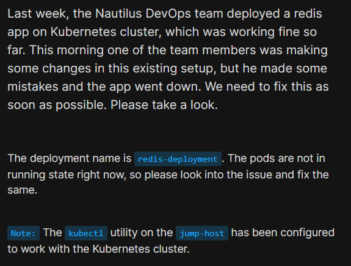
</div>

As per the Nautilus DevOps team requirement:

A Redis deployment named:

| Requirement     | Value            |
| --------------- | ---------------- |
| Deployment Name | redis-deployment |
| Application     | Redis            |

The deployment was not running properly.

My task was to:

* Investigate the issue
* Identify configuration mistakes
* Fix the deployment
* Ensure the application becomes healthy again

---

## 🔹 Steps I Followed

### 1. Connected to the Jump Host

Logged into the jump host where `kubectl` was already configured for Kubernetes cluster access.

---

### 2. Verified Deployment Status

Executed:

```bash
kubectl get deployments
```
<div style="border:1px solid #ccc; padding:10px; border-radius:10px; box-shadow:2px 2px 8px rgba(0,0,0,0.2); display:inline-block;">
  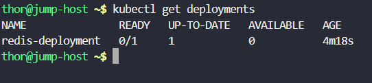
</div>

Observed:

```bash
NAME               READY   UP-TO-DATE   AVAILABLE   AGE
redis-deployment   0/1     1            0           4m18s
```

This confirmed:

* Deployment exists
* Desired replica = 1
* No available pod running

---

### 3. Inspected Deployment Configuration

Executed:

```bash
kubectl describe deployment redis-deployment
```
<div style="border:1px solid #ccc; padding:10px; border-radius:10px; box-shadow:2px 2px 8px rgba(0,0,0,0.2); display:inline-block;">
  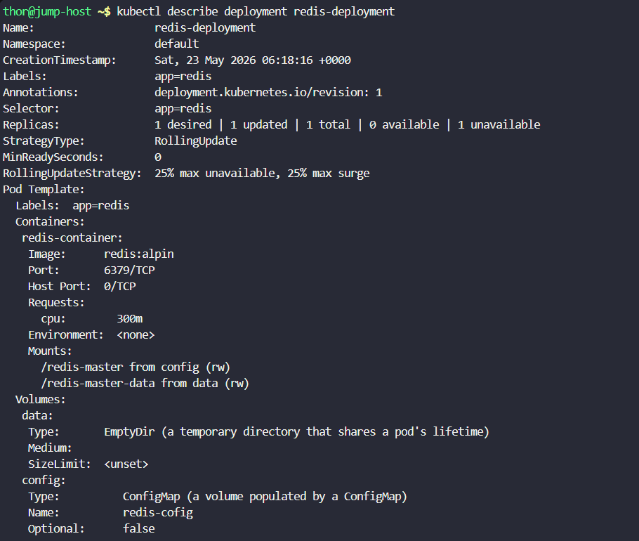
</div>

Observed important details:

```yaml
Containers:
 redis-container:
  Image: redis:alpin
```

and

```yaml
Volumes:
 config:
   Type: ConfigMap
   Name: redis-cofig
```

Immediately noticed two suspicious configuration values:

* `redis:alpin`
* `redis-cofig`

These looked like spelling mistakes.

---

## 🔹 Simple Explanation of the Deployment Issues

### Issue 1 — Incorrect Redis Image Name

Observed:

```yaml
image: redis:alpin
```

Correct image:

```yaml
image: redis:alpine
```

Problem:

The Redis image tag was misspelled.

Kubernetes would fail to pull a non-existent image.

---

### Issue 2 — Incorrect ConfigMap Name

Observed:

```yaml
name: redis-cofig
```

Correct value:

```yaml
name: redis-config
```

Problem:

The deployment was attempting to mount a ConfigMap that did not exist.

Because of this:

Pod startup failed.

---

### 4. Checked Pod Status

Executed:

```bash
kubectl get pods -l app=redis
```
<div style="border:1px solid #ccc; padding:10px; border-radius:10px; box-shadow:2px 2px 8px rgba(0,0,0,0.2); display:inline-block;">
  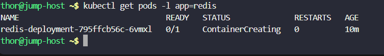
</div>

Observed:

```bash
NAME                                READY   STATUS
redis-deployment-795ffcb56c-6vmxl   0/1     ContainerCreating
```

This confirmed:

Pod was created but unable to initialize properly.

---

### 5. Investigated Pod Failure

Executed:

```bash
kubectl describe pod redis-deployment-795ffcb56c-6vmxl
```
<div style="border:1px solid #ccc; padding:10px; border-radius:10px; box-shadow:2px 2px 8px rgba(0,0,0,0.2); display:inline-block;">
  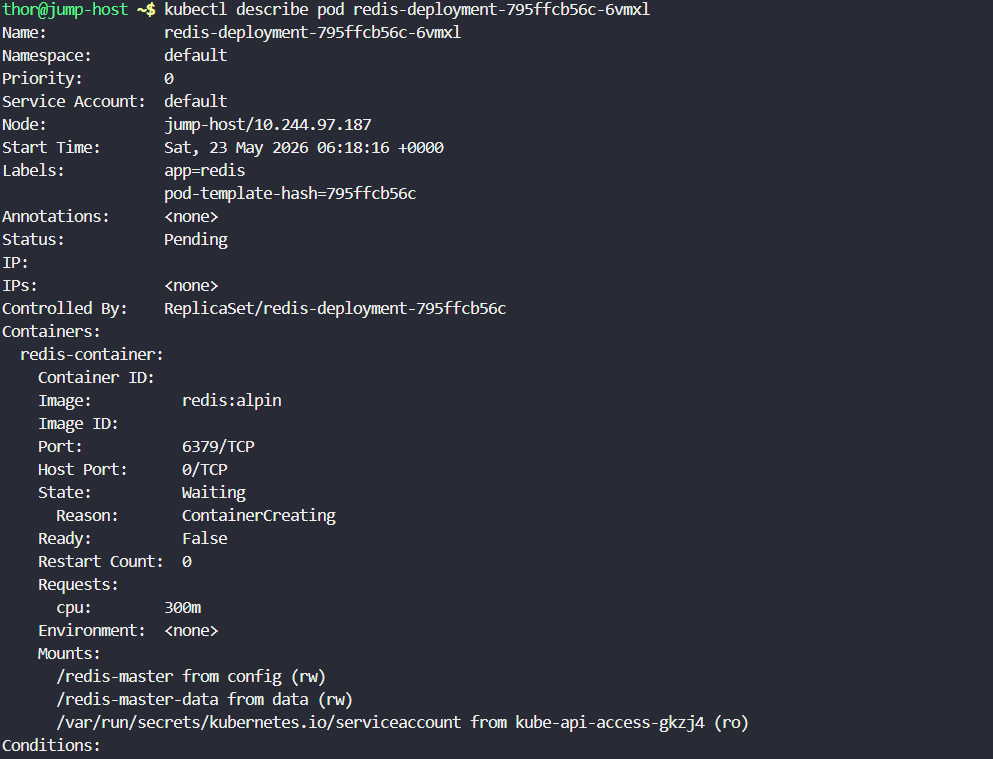
</div>

Observed the critical error:

```bash
FailedMount:
MountVolume.SetUp failed for volume "config":
configmap "redis-cofig" not found
```

This clearly confirmed:

The pod could not start because Kubernetes could not locate the specified ConfigMap.

---

### 6. Verified Available ConfigMaps

Executed:

```bash
kubectl get configmap
```
<div style="border:1px solid #ccc; padding:10px; border-radius:10px; box-shadow:2px 2px 8px rgba(0,0,0,0.2); display:inline-block;">
  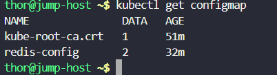
</div>

<div style="border:1px solid #ccc; padding:10px; border-radius:10px; box-shadow:2px 2px 8px rgba(0,0,0,0.2); display:inline-block;">
  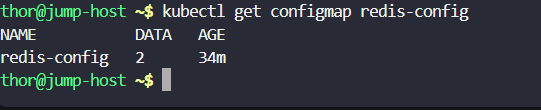
</div>

Observed:

```bash
NAME
kube-root-ca.crt
redis-config
```

This confirmed:

The correct ConfigMap already existed:

```bash
redis-config
```

The deployment configuration simply contained a typo.

---

### 7. Edited the Deployment

Executed:

```bash
kubectl edit deployment redis-deployment
```
<div style="border:1px solid #ccc; padding:10px; border-radius:10px; box-shadow:2px 2px 8px rgba(0,0,0,0.2); display:inline-block;">
  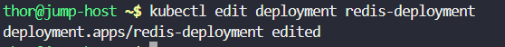
</div>

Performed two fixes.

---

### Fix #1 — Corrected Redis Image

Changed:

```diff
- redis:alpin
+ redis:alpine
```

---

### Fix #2 — Corrected ConfigMap Name

Changed:

```diff
- redis-cofig
+ redis-config
```

Saved and exited the editor.

<div style="border:1px solid #ccc; padding:10px; border-radius:10px; box-shadow:2px 2px 8px rgba(0,0,0,0.2); display:inline-block;">
  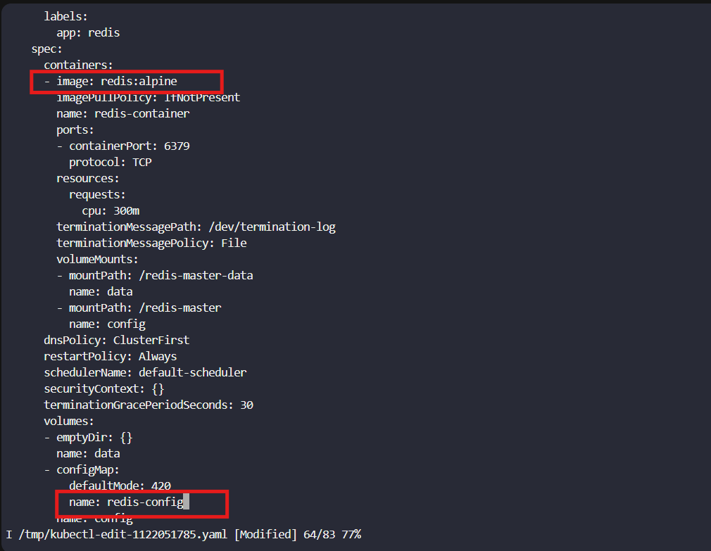
</div>

Kubernetes automatically updated the deployment.

---

### 8. Verified Updated Deployment Configuration

Executed:

```bash
kubectl get deployment redis-deployment -o yaml
```
<div style="border:1px solid #ccc; padding:10px; border-radius:10px; box-shadow:2px 2px 8px rgba(0,0,0,0.2); display:inline-block;">
  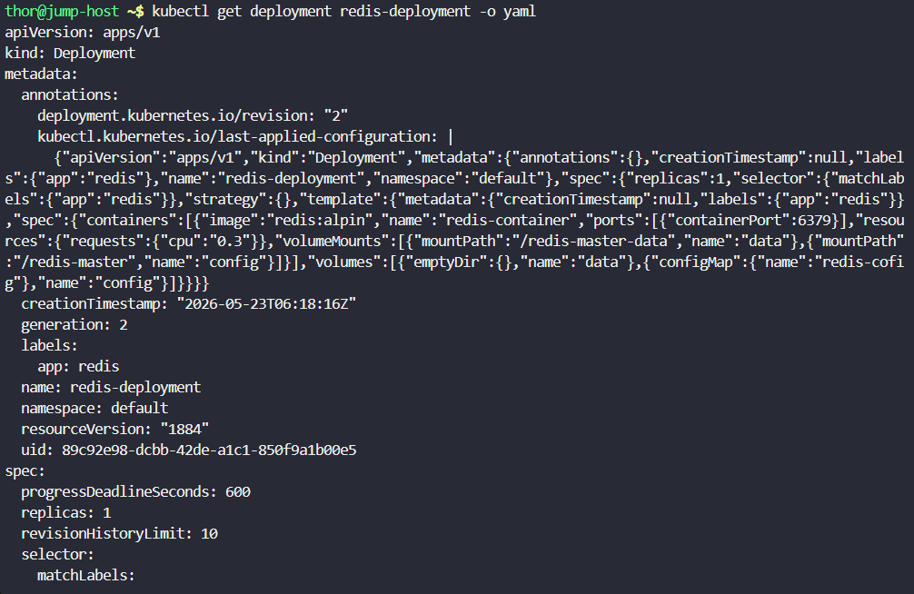
</div>
<div style="border:1px solid #ccc; padding:10px; border-radius:10px; box-shadow:2px 2px 8px rgba(0,0,0,0.2); display:inline-block;">
  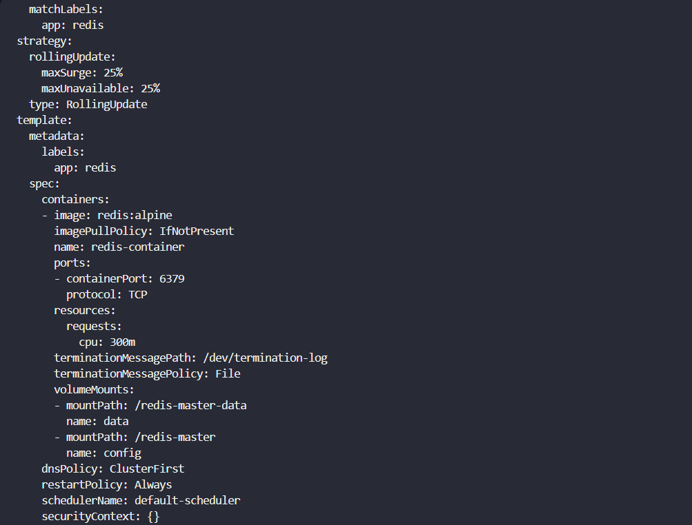
</div>
<div style="border:1px solid #ccc; padding:10px; border-radius:10px; box-shadow:2px 2px 8px rgba(0,0,0,0.2); display:inline-block;">
  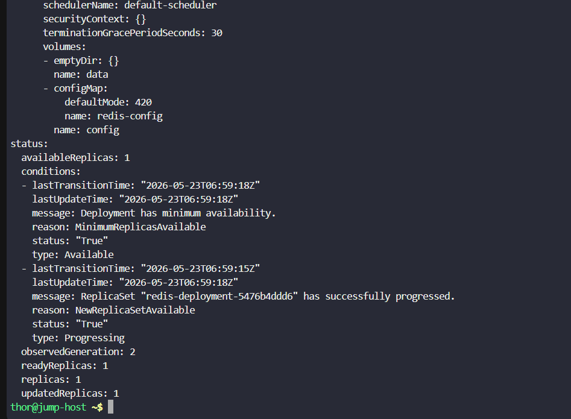
</div>

Confirmed corrections:

Correct image:

```yaml
image: redis:alpine
```

Correct ConfigMap:

```yaml
configMap:
  name: redis-config
```

Deployment status now showed:

```yaml
availableReplicas: 1
readyReplicas: 1
updatedReplicas: 1
```

This confirmed:

Deployment recovery successful.

---

### 9. Verified Final Deployment Health

Executed:

```bash
kubectl get deployments
```
<div style="border:1px solid #ccc; padding:10px; border-radius:10px; box-shadow:2px 2px 8px rgba(0,0,0,0.2); display:inline-block;">
  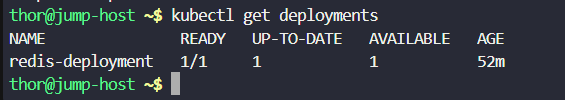
</div>

Observed:

```bash
NAME               READY   UP-TO-DATE   AVAILABLE   AGE
redis-deployment   1/1     1            1           52m
```

This confirmed:

* Deployment healthy
* Replica running successfully
* Application restored

---

## 🔹 My Understanding

This task strengthened my troubleshooting skills in Kubernetes.

I learned how to systematically diagnose deployment failures by checking:

* Deployment status
* Deployment configuration
* Pod status
* Pod events
* Resource dependencies like ConfigMaps

I also learned how small configuration mistakes such as typos in image tags or resource names can completely prevent an application from running.

---

## 🔹 What I Found Interesting

I found it interesting how Kubernetes provides multiple debugging layers for troubleshooting.

Using:

* `kubectl get`
* `kubectl describe deployment`
* `kubectl describe pod`

made it possible to quickly trace the exact root cause.

I also liked how editing a Deployment automatically triggered Kubernetes reconciliation and restored the application without manually recreating resources.

---

## 🔹 Commands Used During Troubleshooting

```bash
kubectl get deployments

kubectl describe deployment redis-deployment

kubectl get pods -l app=redis

kubectl describe pod <pod-name>

kubectl get configmap

kubectl edit deployment redis-deployment

kubectl get deployment redis-deployment -o yaml
```

---

* * *

### Topics Covered

- ***kubernetes-images***
- ***kubernetes-configmap&secrets***
- ***kubernetes-deployment***
- ***kubernetes-issues***
- ***kubectl***


**Previous Task**: [Day 58: Deploy Grafana on Kubernetes Cluster ](../Day_58/day_58.md)

**Next Task**: [Day 60: Persistent Volumes in Kubernetes](../Day_60/day_60.md)