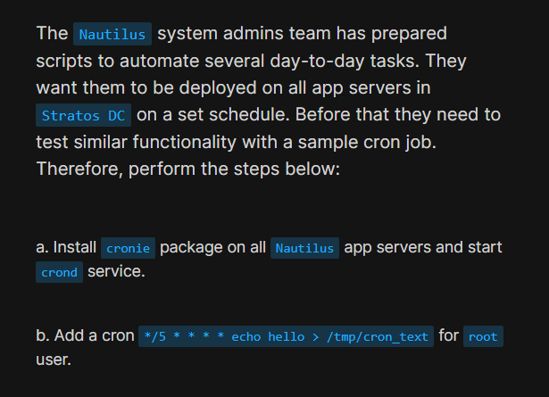
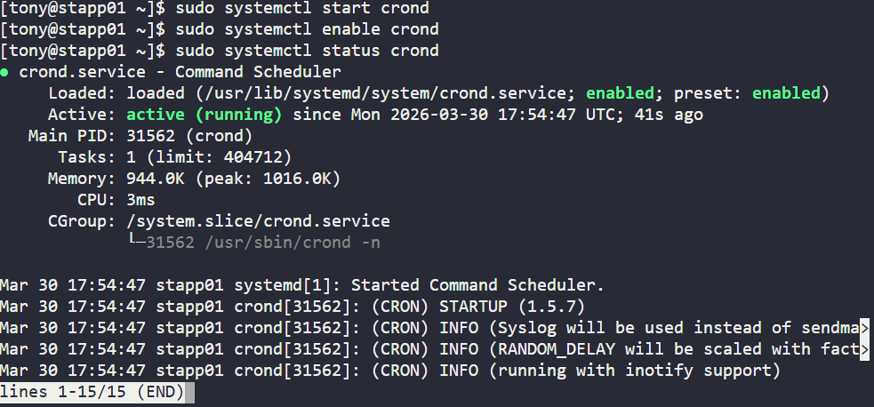
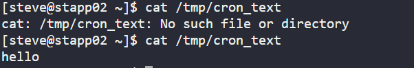
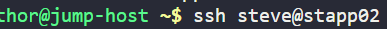
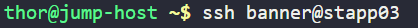

# Day 6: Create a Cron Job

<div style="border:1px solid #ccc; padding:10px; border-radius:10px; box-shadow:2px 2px 8px rgba(0,0,0,0.2); display:inline-block;">
  
</div>


## **Content:**

> Today I worked on setting up a scheduled task using a cron job on application servers as part of my DevOps practice.
> 
> This task focused on automating a simple command execution at regular intervals, which is a fundamental concept in system administration and production environments.

* * *

## **What I Learned**

Through this exercise, I learned how task scheduling works in Linux using cron. Specifically:

*   How to install and manage the cron service (`cronie`)
    
*   How to start and enable system services using `systemctl`
    
*   How to create cron jobs for specific users
    
*   How cron timing syntax works (like `*/5 * * * *`)
    
*   The importance of verifying scheduled jobs
    

* * *
<div style="border:1px solid #ccc; padding:10px; border-radius:10px; box-shadow:2px 2px 8px rgba(0,0,0,0.2); display:inline-block;">
  
</div>

## **Steps I Followed :**

### **1\. Connect to App Servers**

From the jump host, I connected to each application server:

```plaintext
ssh user@server-name
```
<div style="border:1px solid #ccc; padding:10px; border-radius:10px; box-shadow:2px 2px 8px rgba(0,0,0,0.2); display:inline-block;">
  
</div>

* * *

### **2\. Check the Operating System**

```plaintext
cat /etc/os-release
```

Output confirmed the server was running:

```plaintext
CentOS
```
<div style="border:1px solid #ccc; padding:10px; border-radius:10px; box-shadow:2px 2px 8px rgba(0,0,0,0.2); display:inline-block;">
  
</div>
* * *

### **3\. Update the System**

```plaintext
sudo yum update -y
```
<div style="border:1px solid #ccc; padding:10px; border-radius:10px; box-shadow:2px 2px 8px rgba(0,0,0,0.2); display:inline-block;">
  
</div>

* * *

### **4\. Install Cronie Package**

```plaintext
sudo yum install cronie -y
```
<div style="border:1px solid #ccc; padding:10px; border-radius:10px; box-shadow:2px 2px 8px rgba(0,0,0,0.2); display:inline-block;">
  
</div>

* * *

### **5\. Start the Cron Service**

```plaintext
sudo systemctl start crond
```

* * *

### **6\. Enable Cron Service at Boot**

```plaintext
sudo systemctl enable crond
```

* * *

### **7\. Verify Service Status**

```plaintext
sudo systemctl status crond
```

Expected output should show:

```plaintext
active (running)
```
<div style="border:1px solid #ccc; padding:10px; border-radius:10px; box-shadow:2px 2px 8px rgba(0,0,0,0.2); display:inline-block;">
  
</div>


* * *

### **8\. Add Cron Job for Root User**

```plaintext
sudo crontab -e
```

Then added the following line:

```plaintext
*/5 * * * * echo hello > /tmp/cron_text
```
<div style="border:1px solid #ccc; padding:10px; border-radius:10px; box-shadow:2px 2px 8px rgba(0,0,0,0.2); display:inline-block;">
  
</div>

<div style="border:1px solid #ccc; padding:10px; border-radius:10px; box-shadow:2px 2px 8px rgba(0,0,0,0.2); display:inline-block;">
  
</div>
* * *

### **9\. Verify Cron Entry**

```plaintext
sudo crontab -l
```
<div style="border:1px solid #ccc; padding:10px; border-radius:10px; box-shadow:2px 2px 8px rgba(0,0,0,0.2); display:inline-block;">
  
</div>

* * *

### **10\. Validate the Cron Job**

After waiting for 5 minutes:

```plaintext
cat /tmp/cron_text
```

Expected output:

```plaintext
hello
```
<div style="border:1px solid #ccc; padding:10px; border-radius:10px; box-shadow:2px 2px 8px rgba(0,0,0,0.2); display:inline-block;">
  
</div>

* * *

### **11\. Repeat on Remaining App Servers**

I repeated the same procedure on the other two application servers to ensure consistency across all systems in the environment.

<div style="border:1px solid #ccc; padding:10px; border-radius:10px; box-shadow:2px 2px 8px rgba(0,0,0,0.2); display:inline-block;">
  
</div>

<div style="border:1px solid #ccc; padding:10px; border-radius:10px; box-shadow:2px 2px 8px rgba(0,0,0,0.2); display:inline-block;">
  
</div>

* * *

## **My Understanding**

Cron is a time-based job scheduler in Linux that allows tasks to run automatically at specified intervals.

The cron format consists of five fields:

```plaintext
* * * * *
│ │ │ │ │
│ │ │ │ └── Day of week
│ │ │ └──── Month
│ │ └────── Day of month
│ └──────── Hour
└────────── Minute
```

In this task:

*   `*/5` → every 5 minutes
    
*   `* * * *` → every hour, day, month, and weekday
    

So the command runs every 5 minutes.

I also understood that:

*   Cron jobs for root are managed using `sudo crontab -e`
    
*   The `crond` service must be running for jobs to execute
    
*   Output redirection (`>`) overwrites the file each time
    

* * *

## **What I Found Interesting**

What stood out to me was how **automation can be achieved with just a single line in crontab**. Instead of manually running commands, the system handles it in the background.

I also found it interesting that **cron runs with a limited environment**, which means using full command paths is often a best practice in real-world scenarios.

This exercise gave me a clearer understanding of how scheduled jobs are used in tasks like:

*   Backups
    
*   Log rotation
    
*   Monitoring scripts
    

Overall, it showed how powerful and essential cron jobs are in DevOps and system administration.

### Topics Covered

- ***cronie package***
- ***cron job setup***

**Previous Task**: [Day 5: SElinux Installation and Configuration](../Day_5/day_5.md)

**Next Task**: [Day 7: SElinux Installation and Configuration](../Day_7/day_7.md)