# Day 60: Persistent Volumes in Kubernetes

<div style="border:1px solid #ccc; padding:10px; border-radius:10px; box-shadow:2px 2px 8px rgba(0,0,0,0.2); display:inline-block;">
  
</div>

## Content:

>Today I worked on creating and configuring **Persistent Storage in Kubernetes** using **PersistentVolumes (PV)**, **PersistentVolumeClaims (PVC)**, a **Pod**, and a **NodePort Service** for an Apache web application.

>This task helped me understand how Kubernetes manages persistent storage independently from pods, how applications can claim storage resources dynamically, and how to expose applications externally using services.

---

## 🔹 What I Learned

* Creating PersistentVolumes in Kubernetes
* Understanding `hostPath` storage type
* Configuring PersistentVolumeClaims (PVC)
* Binding PVs and PVCs
* Mounting Persistent Storage inside Pods
* Creating NodePort Services


---

## 🔹 Task Requirement

<div style="border:1px solid #ccc; padding:10px; border-radius:10px; box-shadow:2px 2px 8px rgba(0,0,0,0.2); display:inline-block;">
  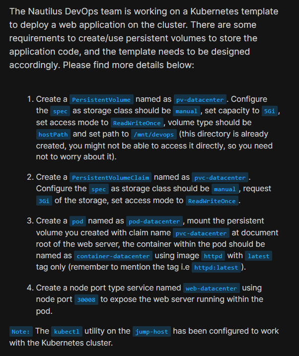
</div>

As per the Nautilus DevOps team requirement:

### Create a PersistentVolume

| Requirement   | Value           |
| ------------- | --------------- |
| Name          | `pv-datacenter` |
| Storage Class | `manual`        |
| Capacity      | `5Gi`           |
| Access Mode   | `ReadWriteOnce` |
| Volume Type   | `hostPath`      |
| Path          | `/mnt/devops`   |

### Create a PersistentVolumeClaim

| Requirement       | Value            |
| ----------------- | ---------------- |
| Name              | `pvc-datacenter` |
| Storage Class     | `manual`         |
| Requested Storage | `3Gi`            |
| Access Mode       | `ReadWriteOnce`  |

### Create a Pod

| Requirement    | Value                             |
| -------------- | --------------------------------- |
| Pod Name       | `pod-datacenter`                  |
| Container Name | `container-datacenter`            |
| Image          | `httpd:latest`                    |
| Volume Mount   | PVC mount at Apache document root |

### Create a Service

| Requirement  | Value            |
| ------------ | ---------------- |
| Service Name | `web-datacenter` |
| Type         | `NodePort`       |
| NodePort     | `30008`          |

---

## 🔹 Steps I Followed

### 1. Connected to the Jump Host

Logged into the jump host where `kubectl` was already configured for cluster access.

Verified node availability:

```bash
kubectl get nodes
```
<div style="border:1px solid #ccc; padding:10px; border-radius:10px; box-shadow:2px 2px 8px rgba(0,0,0,0.2); display:inline-block;">
  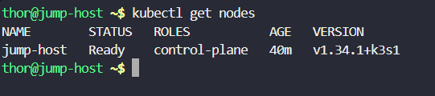
</div>

Observed:

```bash
NAME        STATUS   ROLES           AGE   VERSION
jump-host   Ready    control-plane   40m   v1.34.1+k3s1
```

This confirmed:

* Kubernetes cluster accessible
* Control plane node healthy

---

### 2. Created PersistentVolume

Created the PV manifest.

File:

```bash
vi pv.yaml
```
<div style="border:1px solid #ccc; padding:10px; border-radius:10px; box-shadow:2px 2px 8px rgba(0,0,0,0.2); display:inline-block;">
  
</div>

<div style="border:1px solid #ccc; padding:10px; border-radius:10px; box-shadow:2px 2px 8px rgba(0,0,0,0.2); display:inline-block;">
  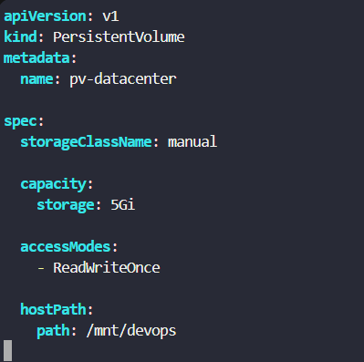
</div>

YAML configuration:

```yaml
apiVersion: v1
kind: PersistentVolume
metadata:
  name: pv-datacenter

spec:
  storageClassName: manual

  capacity:
    storage: 5Gi

  accessModes:
    - ReadWriteOnce

  hostPath:
    path: /mnt/devops
```

Applied configuration:

```bash
kubectl apply -f pv.yaml
```
<div style="border:1px solid #ccc; padding:10px; border-radius:10px; box-shadow:2px 2px 8px rgba(0,0,0,0.2); display:inline-block;">
  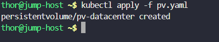
</div>

Observed:

```bash
persistentvolume/pv-datacenter created
```

Verified PV status:

```bash
kubectl get pv
```
<div style="border:1px solid #ccc; padding:10px; border-radius:10px; box-shadow:2px 2px 8px rgba(0,0,0,0.2); display:inline-block;">
  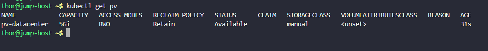
</div>

Observed:

```bash
NAME            CAPACITY   ACCESS MODES   RECLAIM POLICY   STATUS      CLAIM   STORAGECLASS
pv-datacenter   5Gi        RWO            Retain           Available           manual
```

This confirmed:

* PersistentVolume created successfully
* Storage class configured correctly
* Volume available for claims

---

### 🔹 Simple Explanation — What is a PersistentVolume?

A **PersistentVolume (PV)** is a storage resource created in the Kubernetes cluster.

Think of it as:

> A dedicated storage disk made available for applications.

In this task:

```yaml
hostPath:
  path: /mnt/devops
```

means Kubernetes uses the node directory:

```bash
/mnt/devops
```

as persistent storage.

Even if the pod restarts, the data can still remain available.

---

### 3. Created PersistentVolumeClaim

Created PVC manifest.

File:

```bash
vi pvc.yaml
```
<div style="border:1px solid #ccc; padding:10px; border-radius:10px; box-shadow:2px 2px 8px rgba(0,0,0,0.2); display:inline-block;">
  
</div>

<div style="border:1px solid #ccc; padding:10px; border-radius:10px; box-shadow:2px 2px 8px rgba(0,0,0,0.2); display:inline-block;">
  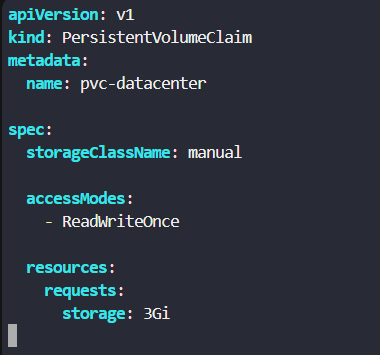
</div>

YAML configuration:

```yaml
apiVersion: v1
kind: PersistentVolumeClaim
metadata:
  name: pvc-datacenter

spec:
  storageClassName: manual

  accessModes:
    - ReadWriteOnce

  resources:
    requests:
      storage: 3Gi
```

Applied configuration:

```bash
kubectl apply -f pvc.yaml
```
<div style="border:1px solid #ccc; padding:10px; border-radius:10px; box-shadow:2px 2px 8px rgba(0,0,0,0.2); display:inline-block;">
  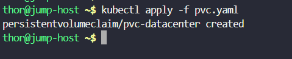
</div>

Observed:

```bash
persistentvolumeclaim/pvc-datacenter created
```

Verified PVC:

```bash
kubectl get pvc
```
<div style="border:1px solid #ccc; padding:10px; border-radius:10px; box-shadow:2px 2px 8px rgba(0,0,0,0.2); display:inline-block;">
  
</div>

Observed:

```bash
NAME             STATUS   VOLUME          CAPACITY   ACCESS MODES   STORAGECLASS
pvc-datacenter   Bound    pv-datacenter   5Gi        RWO            manual
```

This confirmed:

* PVC successfully created
* Claim bound to the correct PV

---

### 🔹 Simple Explanation — PV & PVC Binding

A **PersistentVolumeClaim (PVC)** is how applications request storage.

In this task:

PVC requested:

```yaml
storage: 3Gi
```

Available PV:

```yaml
storage: 5Gi
```

Since:

* StorageClass matched (`manual`)
* AccessMode matched (`ReadWriteOnce`)
* PV had enough capacity

Kubernetes automatically bound:

```bash
pvc-datacenter → pv-datacenter
```

---

### 4. Created the Pod

Created pod manifest.

File:

```bash
vi pod.yaml
```
<div style="border:1px solid #ccc; padding:10px; border-radius:10px; box-shadow:2px 2px 8px rgba(0,0,0,0.2); display:inline-block;">
  
</div>

<div style="border:1px solid #ccc; padding:10px; border-radius:10px; box-shadow:2px 2px 8px rgba(0,0,0,0.2); display:inline-block;">
  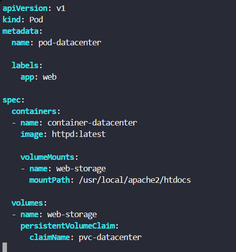
</div>

YAML configuration:

```yaml
apiVersion: v1
kind: Pod
metadata:
  name: pod-datacenter

  labels:
    app: web

spec:
  containers:
  - name: container-datacenter
    image: httpd:latest

    volumeMounts:
    - name: web-storage
      mountPath: /usr/local/apache2/htdocs

  volumes:
  - name: web-storage
    persistentVolumeClaim:
      claimName: pvc-datacenter
```

Applied configuration:

```bash
kubectl apply -f pod.yaml
```
<div style="border:1px solid #ccc; padding:10px; border-radius:10px; box-shadow:2px 2px 8px rgba(0,0,0,0.2); display:inline-block;">
  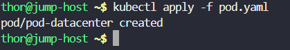
</div>

Observed:

```bash
pod/pod-datacenter created
```

Verified pod status:

```bash
kubectl get pods
```
<div style="border:1px solid #ccc; padding:10px; border-radius:10px; box-shadow:2px 2px 8px rgba(0,0,0,0.2); display:inline-block;">
  
</div>

Observed:

```bash
NAME             READY   STATUS    RESTARTS   AGE
pod-datacenter   1/1     Running   0          3m21s
```

This confirmed:

* Pod created successfully
* Container healthy
* Persistent volume mounted correctly

---

### 🔹 Simple Explanation — Volume Mounting

Inside the Apache container:

```yaml
mountPath: /usr/local/apache2/htdocs
```

This is Apache’s default document root.

By mounting the PVC here:

Kubernetes stores website files inside persistent storage instead of container-local storage.

Benefit:

If the pod gets deleted or recreated, the application data can still persist.

---

### 5. Created NodePort Service

Created service manifest.

File:

```bash
vi service.yaml
```
<div style="border:1px solid #ccc; padding:10px; border-radius:10px; box-shadow:2px 2px 8px rgba(0,0,0,0.2); display:inline-block;">
  
</div>

<div style="border:1px solid #ccc; padding:10px; border-radius:10px; box-shadow:2px 2px 8px rgba(0,0,0,0.2); display:inline-block;">
  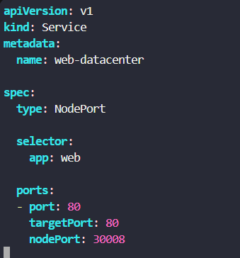
</div>

YAML configuration:

```yaml
apiVersion: v1
kind: Service
metadata:
  name: web-datacenter

spec:
  type: NodePort

  selector:
    app: web

  ports:
  - port: 80
    targetPort: 80
    nodePort: 30008
```

Applied configuration:

```bash
kubectl apply -f service.yaml
```
<div style="border:1px solid #ccc; padding:10px; border-radius:10px; box-shadow:2px 2px 8px rgba(0,0,0,0.2); display:inline-block;">
  
</div>

Observed:

```bash
service/web-datacenter created
```

Verified service:

```bash
kubectl get svc
```
<div style="border:1px solid #ccc; padding:10px; border-radius:10px; box-shadow:2px 2px 8px rgba(0,0,0,0.2); display:inline-block;">
  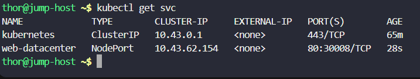
</div>

Observed:

```bash
NAME             TYPE        CLUSTER-IP     EXTERNAL-IP   PORT(S)
kubernetes       ClusterIP   10.43.0.1      <none>        443/TCP
web-datacenter   NodePort    10.43.62.154   <none>        80:30008/TCP
```

This confirmed:

* Service created successfully
* NodePort exposed on port `30008`

---

### 🔹 Simple Explanation — Why Use NodePort?

A **NodePort Service** exposes an application externally.

Traffic flow:

```text
User Request
     ↓
NodeIP:30008
     ↓
Kubernetes Service
     ↓
Apache Pod
```

This allowed access to the web server outside the cluster.

---

### 6. Verified Node Details

Executed:

```bash
kubectl get nodes -o wide
```
<div style="border:1px solid #ccc; padding:10px; border-radius:10px; box-shadow:2px 2px 8px rgba(0,0,0,0.2); display:inline-block;">
  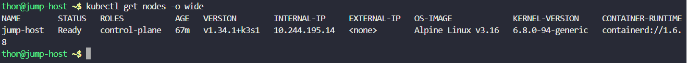
</div>

Observed:

```bash
NAME        STATUS   ROLES           AGE   VERSION        INTERNAL-IP
jump-host   Ready    control-plane   67m   v1.34.1+k3s1   10.244.195.14
```

Captured node internal IP for testing.

---

### 7. Verified Web Application Accessibility

Executed:

```bash
curl 10.244.195.14:30008
```
<div style="border:1px solid #ccc; padding:10px; border-radius:10px; box-shadow:2px 2px 8px rgba(0,0,0,0.2); display:inline-block;">
  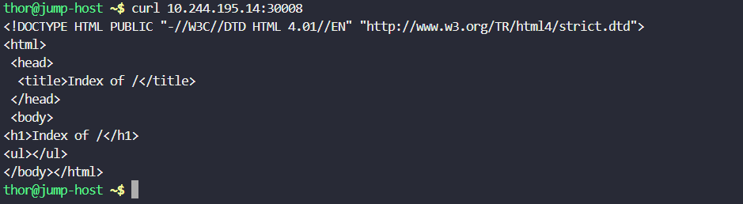
</div>

Observed:

```html
<!DOCTYPE HTML PUBLIC "-//W3C//DTD HTML 4.01//EN" "http://www.w3.org/TR/html4/strict.dtd">
<html>
 <head>
  <title>Index of /</title>
 </head>
 <body>
<h1>Index of /</h1>
<ul></ul>
</body>
</html>
```

This confirmed:

* NodePort service functioning properly
* Apache server reachable
* Persistent volume successfully mounted to document root

---

## 🔹 My Understanding

This task strengthened my understanding of **Kubernetes persistent storage architecture**.

I learned how Kubernetes separates:

* Storage resources (**PersistentVolume**)
* Storage requests (**PersistentVolumeClaim**)
* Application consumption (**Pod Volume Mounts**)

I also learned how services can expose applications externally using **NodePort networking**.

---

## 🔹 What I Found Interesting

I found it interesting how Kubernetes handles storage abstraction.

Instead of directly attaching storage inside containers, Kubernetes uses:

```text
PersistentVolume
      ↓
PersistentVolumeClaim
      ↓
Pod Volume Mount
```

This makes storage reusable, portable, and independent of pod lifecycle.

I also liked seeing how mounting a PVC directly into Apache’s document root instantly changed the web server’s backing storage without modifying the container image.

* * *

### Topics Covered

- ***kubernetes-images***
- ***kubernetes-Persistent-Volumes***
- ***kubernetes-deployment***
- ***kubernetes-pod***
- ***kubectl***


**Previous Task**: [Day 59: Troubleshoot Deployment issues in Kubernetes](../Day_58/day_58.md)

**Next Task**: [Day 61: Init Containers in Kubernetes](../Day_61/day_61.md)