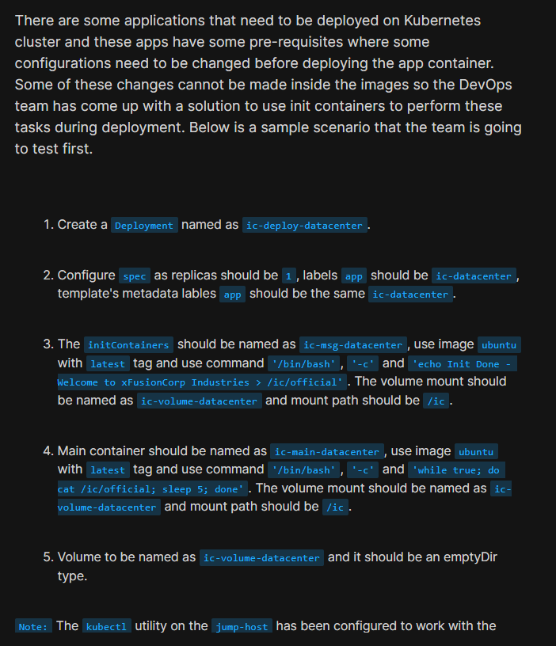
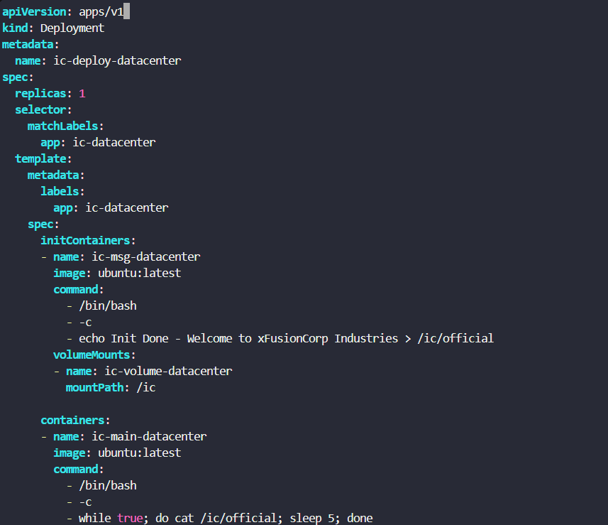
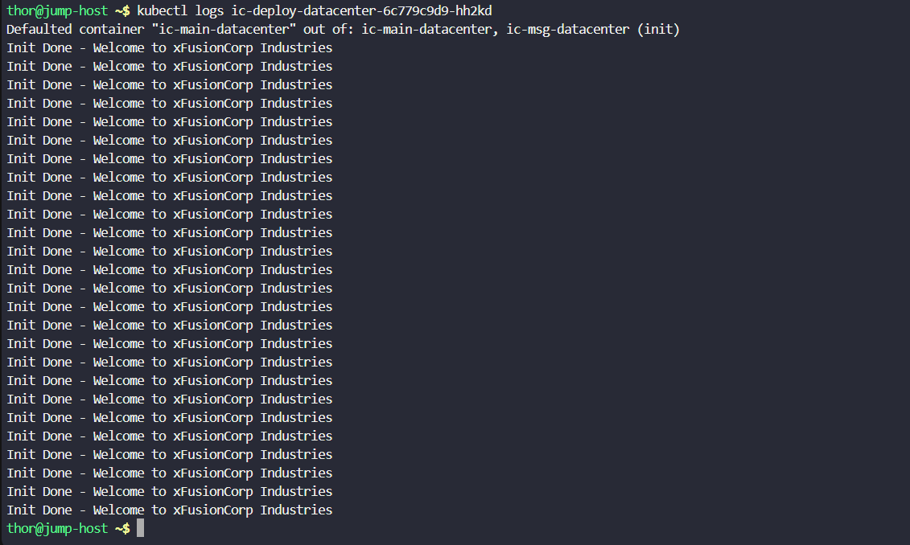

# Day 61: Init Containers in Kubernetes

<div style="border:1px solid #ccc; padding:10px; border-radius:10px; box-shadow:2px 2px 8px rgba(0,0,0,0.2); display:inline-block;">
  
</div>

## Content:

>Today I worked on implementing **Init Containers in Kubernetes** using a Deployment, shared volumes, and Ubuntu containers.

>This task helped me understand how Kubernetes can run **pre-deployment initialization tasks** before the main application container starts. I learned how **Init Containers** can prepare configuration files, dependencies, or environment setup for applications without modifying container images.

---

## 🔹 What I Learned

* Understanding Init Containers
* Using shared volumes between containers
* Configuring `emptyDir` volumes
* Running initialization commands before application startup
* Verifying container logs and deployment status

---

## 🔹 Task Requirement

<div style="border:1px solid #ccc; padding:10px; border-radius:10px; box-shadow:2px 2px 8px rgba(0,0,0,0.2); display:inline-block;">
  
</div>

As per the Nautilus DevOps team requirement:

### Create a Deployment

| Requirement     | Value                  |
| --------------- | ---------------------- |
| Deployment Name | `ic-deploy-datacenter` |
| Replicas        | `1`                    |
| Label           | `app: ic-datacenter`   |

### Configure Init Container

| Requirement | Value                      |
| ----------- | -------------------------- |
| Name        | `ic-msg-datacenter`        |
| Image       | `ubuntu:latest`            |
| Command     | Create initialization file |
| Mount Path  | `/ic`                      |

### Configure Main Container

| Requirement | Value                         |
| ----------- | ----------------------------- |
| Name        | `ic-main-datacenter`          |
| Image       | `ubuntu:latest`               |
| Command     | Continuously read shared file |
| Mount Path  | `/ic`                         |

### Configure Shared Volume

| Requirement | Value                  |
| ----------- | ---------------------- |
| Volume Name | `ic-volume-datacenter` |
| Type        | `emptyDir`             |

---

## 🔹 Steps I Followed

### 1. Connected to the Jump Host

Logged into the jump host where **kubectl** was already configured for Kubernetes cluster access.

Verified deployment availability:

```bash
kubectl get deployments
```

This ensured:

* Cluster access working properly
* Kubernetes environment ready for deployment creation

---

### 2. Created the Deployment Manifest

Created deployment YAML file.

File:

```bash
vi ic-deploy.yaml
```
<div style="border:1px solid #ccc; padding:10px; border-radius:10px; box-shadow:2px 2px 8px rgba(0,0,0,0.2); display:inline-block;">
  
</div>

<div style="border:1px solid #ccc; padding:10px; border-radius:10px; box-shadow:2px 2px 8px rgba(0,0,0,0.2); display:inline-block;">
  
</div>

YAML configuration:

```yaml
apiVersion: apps/v1
kind: Deployment
metadata:
  name: ic-deploy-datacenter

spec:
  replicas: 1

  selector:
    matchLabels:
      app: ic-datacenter

  template:
    metadata:
      labels:
        app: ic-datacenter

    spec:

      initContainers:
      - name: ic-msg-datacenter
        image: ubuntu:latest

        command:
        - /bin/bash
        - -c
        - echo Init Done - Welcome to xFusionCorp Industries > /ic/official

        volumeMounts:
        - name: ic-volume-datacenter
          mountPath: /ic

      containers:
      - name: ic-main-datacenter
        image: ubuntu:latest

        command:
        - /bin/bash
        - -c
        - while true; do cat /ic/official; sleep 5; done

        volumeMounts:
        - name: ic-volume-datacenter
          mountPath: /ic

      volumes:
      - name: ic-volume-datacenter
        emptyDir: {}
```

Applied configuration:

```bash
kubectl apply -f ic-deploy.yaml
```
<div style="border:1px solid #ccc; padding:10px; border-radius:10px; box-shadow:2px 2px 8px rgba(0,0,0,0.2); display:inline-block;">
  
</div>

Observed:

```bash
deployment.apps/ic-deploy-datacenter created
```

---

### 🔹 Simple Explanation — What is an Init Container?

An **Init Container** is a special container that runs **before the main application container** starts.

Think of it as:

> A preparation step that configures the environment before the actual application launches.

In this task:

The init container executed:

```bash
echo Init Done - Welcome to xFusionCorp Industries > /ic/official
```

This created a file:

```bash
/ic/official
```

before the main container started.

---

### 3. Verified Deployment Status

Executed:

```bash
kubectl get deployments
```
<div style="border:1px solid #ccc; padding:10px; border-radius:10px; box-shadow:2px 2px 8px rgba(0,0,0,0.2); display:inline-block;">
  
</div>

Observed:

```bash
NAME                   READY   UP-TO-DATE   AVAILABLE   AGE
ic-deploy-datacenter   1/1     1            1           75s
```

This confirmed:

* Deployment created successfully
* Replica available
* Application running properly

---

### 4. Verified Pod Status

Executed:

```bash
kubectl get pods
```
<div style="border:1px solid #ccc; padding:10px; border-radius:10px; box-shadow:2px 2px 8px rgba(0,0,0,0.2); display:inline-block;">
  
</div>

Observed:

```bash
NAME                                   READY   STATUS    RESTARTS   AGE
ic-deploy-datacenter-6c779c9d9-hh2kd   1/1     Running   0          100s
```

This confirmed:

* Pod created successfully
* Init container completed successfully
* Main container running healthy

---

### 🔹 Simple Explanation — How Init Containers Work

Container startup sequence:

```text
Init Container
      ↓
Performs setup task
      ↓
Creates required file
      ↓
Exits successfully
      ↓
Main Container Starts
```

Kubernetes will **not start the main container** until all init containers complete successfully.

That is why init containers are useful for:

* Pre-configuration
* Dependency checks
* Environment setup
* Configuration generation

---

### 5. Understanding the Shared Volume

In the deployment:

```yaml
volumes:
- name: ic-volume-datacenter
  emptyDir: {}
```

Both containers mounted:

```yaml
mountPath: /ic
```

This allowed the init container and main container to share data.

### 🔹 Simple Explanation — What is `emptyDir`?

An `emptyDir` volume is temporary storage created when a pod starts.

Think of it as:

> A shared folder available to all containers inside the same pod.

In this task:

Init container wrote:

```bash
/ic/official
```

Main container read:

```bash
cat /ic/official
```

Because both containers used the same shared volume, the file became accessible across containers.

---

### 6. Verified Application Logs

Executed:

```bash
kubectl logs ic-deploy-datacenter-6c779c9d9-hh2kd
```
<div style="border:1px solid #ccc; padding:10px; border-radius:10px; box-shadow:2px 2px 8px rgba(0,0,0,0.2); display:inline-block;">
  
</div>

Observed:

```bash
Defaulted container "ic-main-datacenter" out of: ic-main-datacenter, ic-msg-datacenter (init)

Init Done - Welcome to xFusionCorp Industries
Init Done - Welcome to xFusionCorp Industries
Init Done - Welcome to xFusionCorp Industries
Init Done - Welcome to xFusionCorp Industries
...
```

This confirmed:

* Init container created the file successfully
* Main container continuously read the file
* Shared volume functioning properly

---

## 🔹 My Understanding

This task strengthened my understanding of **container initialization workflows in Kubernetes**.

I learned how Kubernetes separates:

```text
Initialization Tasks
        ↓
Init Container
        ↓
Shared Volume
        ↓
Main Application Container
```

I also learned how **Init Containers allow environment preparation without changing application images**.

This makes deployments more flexible and easier to manage.

---

## 🔹 What I Found Interesting

I found it interesting how Kubernetes enforces **container startup ordering**.

Instead of putting setup logic directly inside the application container, Kubernetes allows us to use:

```text
Init Container
      ↓
Shared Volume
      ↓
Main Container
```

This keeps the application container clean and focused only on running the application.

I also liked seeing how an `emptyDir` volume enabled **simple communication between containers** inside the same pod.

The init container generated the file once, and the main container kept consuming it continuously without modifying the container image.


* * *

### Topics Covered

- ***kubernetes-init-containers***
- ***kubernetes-volume***
- ***kubernetes-deployment***
- ***kubernetes-pod***
- ***kubectl***


**Previous Task**: [Day 60: Persistent Volumes in Kubernetes](../Day_60/day_60.md)

**Next Task**: [Day 62: Manage Secrets in Kubernetes](../Day_62/day_62.md)