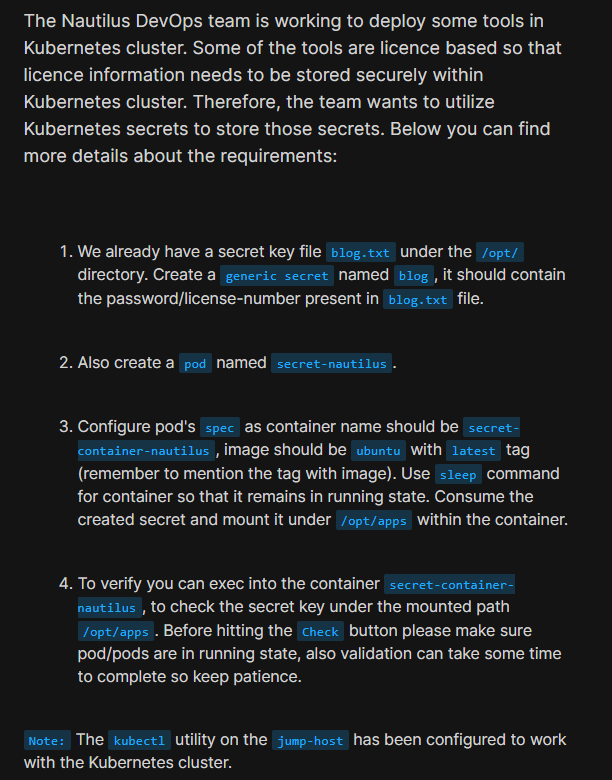
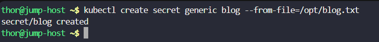
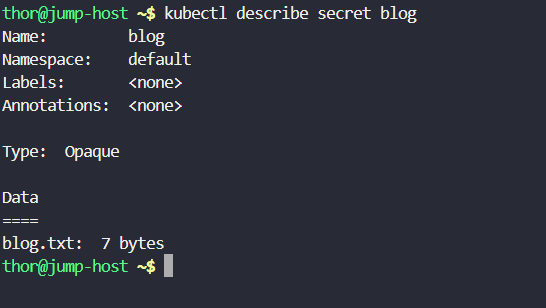
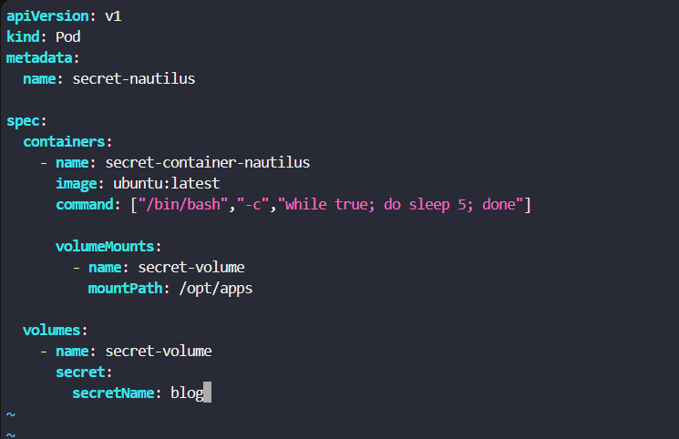
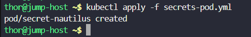
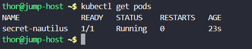
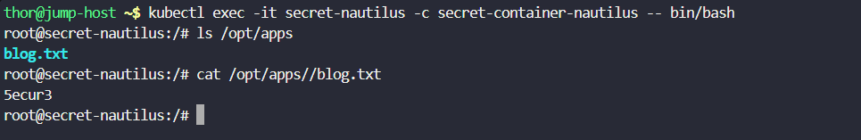

# Day 62: Manage Secrets in Kubernetes

<div style="border:1px solid #ccc; padding:10px; border-radius:10px; box-shadow:2px 2px 8px rgba(0,0,0,0.2); display:inline-block;">
  
</div>

## Content:
>Today I worked on implementing **Kubernetes Secrets** to securely manage sensitive information inside a Kubernetes cluster.

>This task helped me understand how Kubernetes stores confidential data like passwords, API keys, license keys, and configuration values without hardcoding them into container images or deployment files.

---

## 🔹 What I Learned

* Understanding Kubernetes Secrets
* Creating generic secrets from files
* Verifying secret creation
* Mounting secrets inside containers
* Verifying mounted secrets inside running containers

---

## 🔹 Task Requirement

<div style="border:1px solid #ccc; padding:10px; border-radius:10px; box-shadow:2px 2px 8px rgba(0,0,0,0.2); display:inline-block;">
  
</div>


As per the Nautilus DevOps team requirement:

### Create Kubernetes Secret

| Requirement | Value          |
| ----------- | -------------- |
| Secret Name | blog           |
| Secret Type | Generic Secret |
| Source File | /opt/blog.txt  |

---

### Configure Pod

| Requirement       | Value                                |
| ----------------- | ------------------------------------ |
| Pod Name          | secret-nautilus                      |
| Container Name    | secret-container-nautilus            |
| Image             | ubuntu:latest                        |
| Command           | Sleep loop to keep container running |
| Secret Mount Path | /opt/apps                            |

---

## 🔹 Steps I Followed

### 1. Connected to the Jump Host

Logged into the jump host where **kubectl** was already configured for Kubernetes cluster access.

Created the Kubernetes secret using the provided file.

Executed:

```bash
kubectl create secret generic blog --from-file=/opt/blog.txt
```
<div style="border:1px solid #ccc; padding:10px; border-radius:10px; box-shadow:2px 2px 8px rgba(0,0,0,0.2); display:inline-block;">
  
</div>

Observed:

```bash
secret/blog created
```

This confirmed:

* Kubernetes secret created successfully
* Data imported from `/opt/blog.txt`
* Secret available inside the cluster

---

### 2. Verified Secret Creation

Executed:

```bash
kubectl describe secret blog
```
<div style="border:1px solid #ccc; padding:10px; border-radius:10px; box-shadow:2px 2px 8px rgba(0,0,0,0.2); display:inline-block;">
  
</div>

Observed:

```bash
Name:         blog
Namespace:    default
Type:         Opaque

Data
====
blog.txt:  7 bytes
```

This confirmed:

* Secret exists in Kubernetes
* Secret type is **Opaque**
* File data stored correctly

---

## 🔹 Simple Explanation — What is a Kubernetes Secret?

A **Kubernetes Secret** is an object used to securely store sensitive information.

Think of it as:

**A protected storage mechanism for confidential application data.**

Instead of storing secrets directly inside:

* container images
* deployment YAML files
* environment variables in plain text

Kubernetes allows us to use **Secrets**.

Common use cases:

* Passwords
* API tokens
* Database credentials
* License keys
* Certificates

In this task:

The file:

```bash
/opt/blog.txt
```

contained the secret value.

Kubernetes stored it securely inside the secret named:

```bash
blog
```

---

### 3. Created the Pod Manifest

Created YAML configuration file.

File:

```bash
vi secrets-pod.yml
```
<div style="border:1px solid #ccc; padding:10px; border-radius:10px; box-shadow:2px 2px 8px rgba(0,0,0,0.2); display:inline-block;">
  
</div>

<div style="border:1px solid #ccc; padding:10px; border-radius:10px; box-shadow:2px 2px 8px rgba(0,0,0,0.2); display:inline-block;">
  
</div>

YAML configuration:

```yaml
apiVersion: v1
kind: Pod
metadata:
  name: secret-nautilus

spec:
  containers:
    - name: secret-container-nautilus
      image: ubuntu:latest

      command:
      - /bin/bash
      - -c
      - while true; do sleep 5; done

      volumeMounts:
      - name: secret-volume
        mountPath: /opt/apps

  volumes:
  - name: secret-volume
    secret:
      secretName: blog
```

Applied configuration:

```bash
kubectl apply -f secrets-pod.yml
```
<div style="border:1px solid #ccc; padding:10px; border-radius:10px; box-shadow:2px 2px 8px rgba(0,0,0,0.2); display:inline-block;">
  
</div>

Observed:

```bash
pod/secret-nautilus created
```

---

## 🔹 Simple Explanation — How Secret Mounting Works

In Kubernetes, secrets can be consumed in multiple ways:

* Environment Variables
* Mounted Volumes
* Command Arguments

In this task we used:

**Secret Volume Mounting**

Flow:

```text
Secret Created
      ↓
Kubernetes Secret Object
      ↓
Secret Volume
      ↓
Mounted Inside Container
      ↓
Application Reads Secret File
```

The secret named:

```text
blog
```

was mounted at:

```text
/opt/apps
```

inside the container.

---

### 4. Verified Pod Status

Executed:

```bash
kubectl get pods
```
<div style="border:1px solid #ccc; padding:10px; border-radius:10px; box-shadow:2px 2px 8px rgba(0,0,0,0.2); display:inline-block;">
  
</div>


Observed:

```bash
NAME              READY   STATUS    RESTARTS   AGE
secret-nautilus   1/1     Running   0          23s
```

This confirmed:

* Pod created successfully
* Container running properly
* Secret volume attached successfully

---

### 5. Verified Secret Consumption Inside Container

Accessed the running container.

Executed:

```bash
kubectl exec -it secret-nautilus -c secret-container-nautilus -- /bin/bash
```

Checked mounted files:

```bash
ls /opt/apps
```

Observed:

```bash
blog.txt
```

Read the secret content:

```bash
cat /opt/apps/blog.txt
```

<div style="border:1px solid #ccc; padding:10px; border-radius:10px; box-shadow:2px 2px 8px rgba(0,0,0,0.2); display:inline-block;">
  
</div>


Observed:

```bash
5ecur3
```

This confirmed:

* Secret mounted successfully
* Secret file accessible inside container
* Sensitive data available to application

---

## 🔹 Simple Explanation — Why Use Secrets Instead of Hardcoding?

Without Kubernetes Secrets:

```text
Password inside YAML
      ↓
Visible in configuration files
      ↓
Higher security risk
```

With Kubernetes Secrets:

```text
Sensitive File
      ↓
Kubernetes Secret
      ↓
Secure Volume Mount
      ↓
Application Accesses Secret Safely
```

This improves:

* Security
* Maintainability
* Separation of configuration from application images

---

### 6. Understanding the Secret Volume

In the pod configuration:

```yaml
volumes:
- name: secret-volume
  secret:
    secretName: blog
```

The secret became a volume.

Mounted using:

```yaml
volumeMounts:
- name: secret-volume
  mountPath: /opt/apps
```

This caused Kubernetes to automatically create:

```text
/opt/apps/blog.txt
```

inside the container.

The file content came directly from the Kubernetes secret.

---

## 🔹 My Understanding

This task strengthened my understanding of **secure configuration management in Kubernetes**.

I learned how Kubernetes separates:

```text
Sensitive Data
      ↓
Kubernetes Secret
      ↓
Secret Volume
      ↓
Running Container
```

I also learned how applications can consume secrets without modifying container images.

This makes Kubernetes deployments:

* more secure
* easier to manage
* cleaner to maintain

---

## 🔹 What I Found Interesting

I found it interesting how Kubernetes automatically converts secret data into files inside a mounted directory.

Instead of manually copying files into containers, Kubernetes handles:

```text
Secret Storage
      ↓
Volume Creation
      ↓
Automatic Mounting
      ↓
Application Access
```

I also liked seeing how easy it was to securely inject sensitive data into a running container without rebuilding the image.

The secret existed independently from the container image, which keeps applications cleaner and improves security practices.


* * *

### Topics Covered

- ***kubernetes-secrets***
- ***kubernetes-volume***
- ***kubernetes-pod***
- ***kubectl***


**Previous Task**: [Day 61: Init Containers in Kubernetes](../Day_61/day_61.md)

**Next Task**: [Day 63: Deploy Iron Gallery App on Kubernetes](../Day_62/day_62.md)