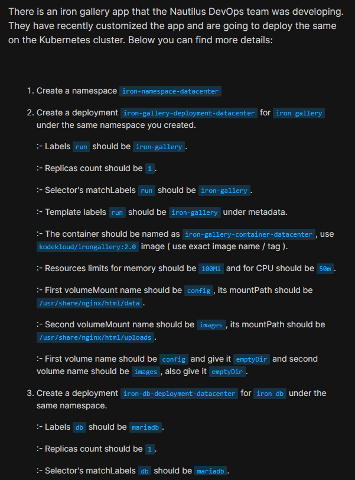
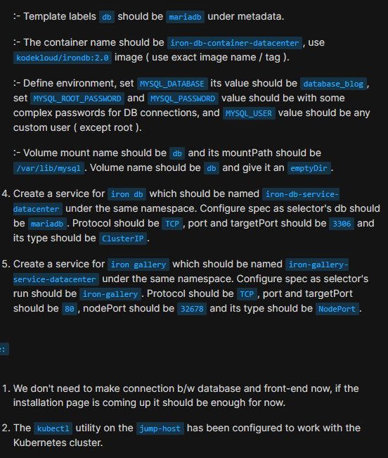
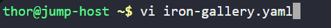
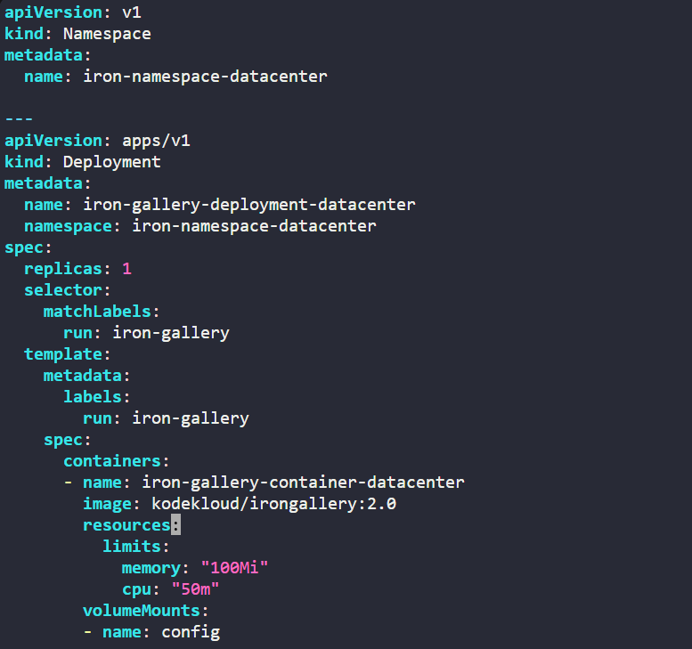
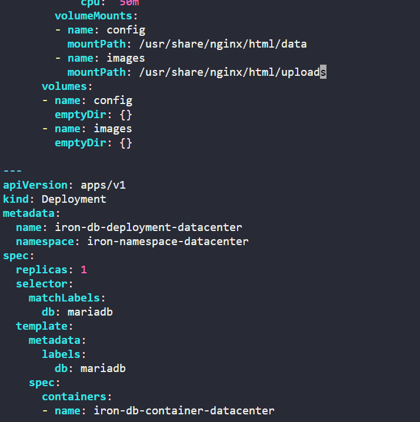
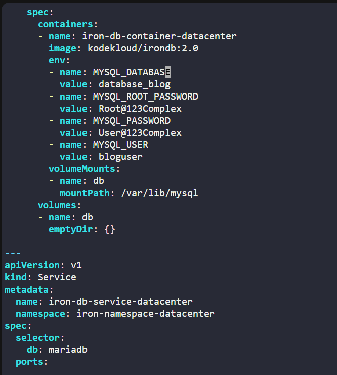
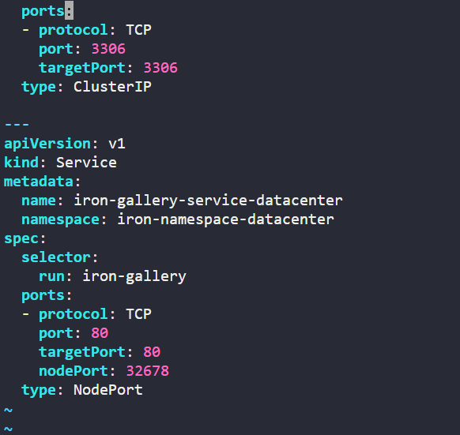
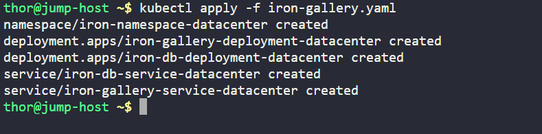
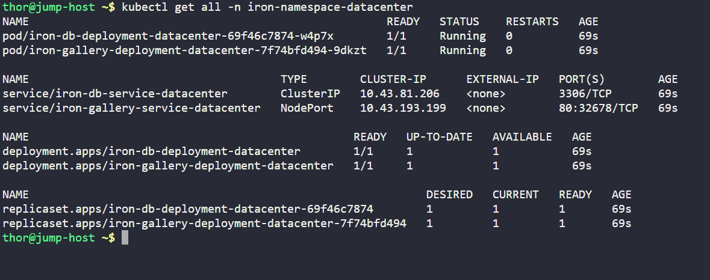
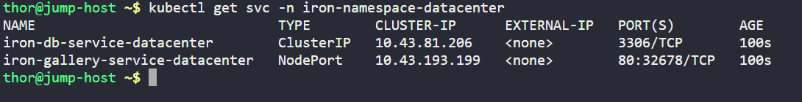

# Day 63: Deploy Iron Gallery App on Kubernetes

<div style="border:1px solid #ccc; padding:10px; border-radius:10px; box-shadow:2px 2px 8px rgba(0,0,0,0.2); display:inline-block;">
  
</div>

## Content:

>Today I worked on deploying the **Iron Gallery application** along with its **MariaDB backend** on a Kubernetes cluster. This task helped me strengthen my understanding of Kubernetes **Namespaces, Deployments, Services, Labels, Selectors, Resource Limits, Environment Variables, and Volumes**.

---

## 🔹 What I Learned

* Creating Kubernetes **Namespaces** for logical isolation
* Creating multiple **Deployments** inside a namespace
* Using **labels and selectors** for pod identification
* Configuring container **resource limits**
* Using **environment variables** inside Kubernetes Deployments
* Working with **volume mounts** and **emptyDir volumes**
* Creating **ClusterIP Services** for internal communication
* Creating **NodePort Services** for external access

---

## 🔹 Task Requirement

<div style="border:1px solid #ccc; padding:10px; border-radius:10px; box-shadow:2px 2px 8px rgba(0,0,0,0.2); display:inline-block;">
  
</div>

<div style="border:1px solid #ccc; padding:10px; border-radius:10px; box-shadow:2px 2px 8px rgba(0,0,0,0.2); display:inline-block;">
  
</div>

As per the Nautilus DevOps team requirements, I needed to:

Deploy **Iron Gallery** and **Iron DB** on the Kubernetes cluster with the following specifications.

### Namespace Requirement

| Resource  | Value                     |
| --------- | ------------------------- |
| Namespace | iron-namespace-datacenter |

### Iron Gallery Deployment

| Requirement     | Value                              |
| --------------- | ---------------------------------- |
| Deployment Name | iron-gallery-deployment-datacenter |
| Label           | run=iron-gallery                   |
| Image           | kodekloud/irongallery:2.0          |
| Replica Count   | 1                                  |
| Container Name  | iron-gallery-container-datacenter  |
| Memory Limit    | 100Mi                              |
| CPU Limit       | 50m                                |

Volume configuration:

| Volume Name | Mount Path                    |
| ----------- | ----------------------------- |
| config      | /usr/share/nginx/html/data    |
| images      | /usr/share/nginx/html/uploads |

---

### Iron DB Deployment

| Requirement     | Value                         |
| --------------- | ----------------------------- |
| Deployment Name | iron-db-deployment-datacenter |
| Label           | db=mariadb                    |
| Image           | kodekloud/irondb:2.0          |
| Replica Count   | 1                             |
| Container Name  | iron-db-container-datacenter  |

Environment variables:

| Variable            | Value            |
| ------------------- | ---------------- |
| MYSQL_DATABASE      | database_blog    |
| MYSQL_ROOT_PASSWORD | Complex Password |
| MYSQL_PASSWORD      | Complex Password |
| MYSQL_USER          | Custom User      |

Volume configuration:

| Volume Name | Mount Path     |
| ----------- | -------------- |
| db          | /var/lib/mysql |

---

### Service Requirements

#### Iron DB Service

| Setting      | Value                      |
| ------------ | -------------------------- |
| Service Name | iron-db-service-datacenter |
| Type         | ClusterIP                  |
| Port         | 3306                       |

#### Iron Gallery Service

| Setting      | Value                           |
| ------------ | ------------------------------- |
| Service Name | iron-gallery-service-datacenter |
| Type         | NodePort                        |
| Port         | 80                              |
| NodePort     | 32678                           |

---

## 🔹 Steps I Followed

### 1. Connected to the Jump Host

Logged into the **jump host** where `kubectl` was already configured for Kubernetes cluster access.

---

### 2. Created Kubernetes Manifest File

Executed:

```bash
vi iron-gallery.yaml
```
<div style="border:1px solid #ccc; padding:10px; border-radius:10px; box-shadow:2px 2px 8px rgba(0,0,0,0.2); display:inline-block;">
  
</div>

<div style="border:1px solid #ccc; padding:10px; border-radius:10px; box-shadow:2px 2px 8px rgba(0,0,0,0.2); display:inline-block;">
  
</div>

<div style="border:1px solid #ccc; padding:10px; border-radius:10px; box-shadow:2px 2px 8px rgba(0,0,0,0.2); display:inline-block;">
  
</div>

<div style="border:1px solid #ccc; padding:10px; border-radius:10px; box-shadow:2px 2px 8px rgba(0,0,0,0.2); display:inline-block;">
  
</div>

<div style="border:1px solid #ccc; padding:10px; border-radius:10px; box-shadow:2px 2px 8px rgba(0,0,0,0.2); display:inline-block;">
  
</div>

Added the following YAML configuration:

```yaml
apiVersion: v1
kind: Namespace
metadata:
  name: iron-namespace-datacenter

---
apiVersion: apps/v1
kind: Deployment
metadata:
  name: iron-gallery-deployment-datacenter
  namespace: iron-namespace-datacenter

spec:
  replicas: 1

  selector:
    matchLabels:
      run: iron-gallery

  template:
    metadata:
      labels:
        run: iron-gallery

    spec:
      containers:
      - name: iron-gallery-container-datacenter
        image: kodekloud/irongallery:2.0

        resources:
          limits:
            memory: "100Mi"
            cpu: "50m"

        volumeMounts:
        - name: config
          mountPath: /usr/share/nginx/html/data

        - name: images
          mountPath: /usr/share/nginx/html/uploads

      volumes:
      - name: config
        emptyDir: {}

      - name: images
        emptyDir: {}

---
apiVersion: apps/v1
kind: Deployment
metadata:
  name: iron-db-deployment-datacenter
  namespace: iron-namespace-datacenter

spec:
  replicas: 1

  selector:
    matchLabels:
      db: mariadb

  template:
    metadata:
      labels:
        db: mariadb

    spec:
      containers:
      - name: iron-db-container-datacenter
        image: kodekloud/irondb:2.0

        env:
        - name: MYSQL_DATABASE
          value: database_blog

        - name: MYSQL_ROOT_PASSWORD
          value: Root@123Complex

        - name: MYSQL_PASSWORD
          value: User@123Complex

        - name: MYSQL_USER
          value: bloguser

        volumeMounts:
        - name: db
          mountPath: /var/lib/mysql

      volumes:
      - name: db
        emptyDir: {}

---
apiVersion: v1
kind: Service
metadata:
  name: iron-db-service-datacenter
  namespace: iron-namespace-datacenter

spec:
  selector:
    db: mariadb

  ports:
  - protocol: TCP
    port: 3306
    targetPort: 3306

  type: ClusterIP

---
apiVersion: v1
kind: Service
metadata:
  name: iron-gallery-service-datacenter
  namespace: iron-namespace-datacenter

spec:
  selector:
    run: iron-gallery

  ports:
  - protocol: TCP
    port: 80
    targetPort: 80
    nodePort: 32678

  type: NodePort
```

---

## 🔹 Simple Explanation of the Kubernetes YAML File

## Namespace Configuration

### API Version

```yaml
apiVersion: v1
```

Defines the Kubernetes API version for core resources.

### Resource Type

```yaml
kind: Namespace
```

Creates a Kubernetes Namespace.

### Namespace Name

```yaml
metadata:
  name: iron-namespace-datacenter
```

Creates a dedicated workspace to isolate all project resources.

---

## Iron Gallery Deployment Explanation

### Resource Type

```yaml
kind: Deployment
```

Creates a Kubernetes Deployment resource.

A Deployment manages:

* Pod creation
* Updates
* Scaling
* Availability

---

### Deployment Name

```yaml
metadata:
  name: iron-gallery-deployment-datacenter
```

Defines the deployment name.

---

### Replica Configuration

```yaml
replicas: 1
```

Kubernetes maintains **one running pod**.

---

### Label Selector

```yaml
selector:
  matchLabels:
    run: iron-gallery
```

Used by Kubernetes to identify Pods belonging to this deployment.

---

### Pod Template Labels

```yaml
labels:
  run: iron-gallery
```

Assigns labels to Pods.

These labels are later used by Services.

---

### Container Configuration

```yaml
containers:
```

Defines container specifications.

Container configuration:

```yaml
name: iron-gallery-container-datacenter
image: kodekloud/irongallery:2.0
```

Creates:

* Container name → iron-gallery-container-datacenter
* Image → kodekloud/irongallery:2.0

---

### Resource Limits

```yaml
resources:
  limits:
```

Restricts container resource consumption.

Memory:

```yaml
100Mi
```

CPU:

```yaml
50m
```

This prevents excessive resource usage.

---

### Volume Mount Configuration

```yaml
volumeMounts:
```

Mounts storage inside the container.

Config mount:

```yaml
/usr/share/nginx/html/data
```

Images mount:

```yaml
/ usr/share/nginx/html/uploads
```

---

### Volume Definition

```yaml
emptyDir: {}
```

Creates temporary storage attached to the Pod lifecycle.

---

## Iron DB Deployment Explanation

### Deployment Name

```yaml
iron-db-deployment-datacenter
```

Creates the database deployment.

---

### Labels

```yaml
db: mariadb
```

Used for deployment and service matching.

---

### Container Configuration

```yaml
name: iron-db-container-datacenter
image: kodekloud/irondb:2.0
```

Creates MariaDB container.

---

### Environment Variables

```yaml
env:
```

Configures database initialization.

Database name:

```yaml
MYSQL_DATABASE=database_blog
```

Root password:

```yaml
MYSQL_ROOT_PASSWORD
```

User password:

```yaml
MYSQL_PASSWORD
```

Custom user:

```yaml
MYSQL_USER=bloguser
```

These values configure database authentication and database creation.

---

### Database Storage Mount

```yaml
mountPath: /var/lib/mysql
```

Stores database files inside the container storage path.

---

## Service Configuration Explanation

### Iron DB Service

Resource Type:

```yaml
kind: Service
```

Creates Kubernetes networking service.

Configuration:

```yaml
type: ClusterIP
```

ClusterIP exposes the application **internally inside the cluster only**.

Port mapping:

```yaml
3306 → 3306
```

Used for database communication.

---

### Iron Gallery Service

Configuration:

```yaml
type: NodePort
```

Exposes the frontend externally.

Port configuration:

```yaml
port: 80
targetPort: 80
nodePort: 32678
```

Traffic Flow:

```text
NodeIP:32678 → Service:80 → Container:80
```

---

👉 In simple terms:

This YAML file tells Kubernetes to:

* Create a dedicated namespace
* Deploy Iron Gallery frontend
* Deploy MariaDB backend
* Configure resources and environment variables
* Mount storage volumes
* Create internal database networking
* Expose frontend using NodePort

---

### 3. Applied the Configuration

Executed:

```bash
kubectl apply -f iron-gallery.yaml
```
<div style="border:1px solid #ccc; padding:10px; border-radius:10px; box-shadow:2px 2px 8px rgba(0,0,0,0.2); display:inline-block;">
  
</div>

Observed:

```text
namespace/iron-namespace-datacenter created
deployment.apps/iron-gallery-deployment-datacenter created
deployment.apps/iron-db-deployment-datacenter created
service/iron-db-service-datacenter created
service/iron-gallery-service-datacenter created
```

This confirmed:

* Namespace created successfully
* Deployments created successfully
* Services created successfully

---

### 4. Verified Kubernetes Resources

Executed:

```bash
kubectl get all -n iron-namespace-datacenter
```
<div style="border:1px solid #ccc; padding:10px; border-radius:10px; box-shadow:2px 2px 8px rgba(0,0,0,0.2); display:inline-block;">
  
</div>

Observed:

```text
NAME                                                      READY   STATUS
pod/iron-db-deployment-datacenter-69f46c7874-w4p7x        1/1     Running
pod/iron-gallery-deployment-datacenter-7f74bfd494-9dkzt   1/1     Running
```

Deployment status:

```text
deployment.apps/iron-db-deployment-datacenter        1/1
deployment.apps/iron-gallery-deployment-datacenter   1/1
```

This confirmed:

* Pods created successfully
* Pod status = Running
* Deployments healthy

---

### 5. Verified Services

Executed:

```bash
kubectl get svc -n iron-namespace-datacenter
```
<div style="border:1px solid #ccc; padding:10px; border-radius:10px; box-shadow:2px 2px 8px rgba(0,0,0,0.2); display:inline-block;">
  
</div>

Observed:

```text
NAME                              TYPE        PORT(S)
iron-db-service-datacenter        ClusterIP   3306/TCP
iron-gallery-service-datacenter   NodePort    80:32678/TCP
```

This confirmed:

* ClusterIP configured correctly for database
* NodePort configured correctly for frontend
* Port mappings working as expected

---

## 🔹 My Understanding

This task strengthened my understanding of how Kubernetes manages **multi-tier applications** using separate Deployments and Services.

I learned how **Namespaces** help organize resources, how **Deployments** manage application containers, and how **Services** control internal and external communication.

I also gained practical experience with **resource limits, environment variables, and volume management** in Kubernetes.

---

## 🔹 What I Found Interesting

I found it interesting how Kubernetes cleanly separates responsibilities between frontend and backend deployments.

The **frontend application** could be exposed externally using a **NodePort Service**, while the **database remained protected internally using ClusterIP**.

I also found it useful to see how **labels and selectors connect Deployments and Services together**, making Kubernetes networking flexible and organized.

* * *

### Topics Covered

- ***kubernetes-Namespaces***
- ***kubernetes-Deployments***
- ***kubernetes-Services***
- ***kubernetes-Selectors***
- ***kubernetes-Labels***
- ***kubernetes-Resource Limits***
- ***kubernetes-Environment Variables***
- ***kubernetes-volume***
- ***kubernetes-pod***
- ***kubectl***


**Previous Task**: [Day 62: Manage Secrets in Kubernetes](../Day_62/day_62.md)

**Next Task**: [Day 64: Fix Python App Deployed on Kubernetes Cluster](../Day_64/day_64.md)