# Day 64: Fix Python App Deployed on Kubernetes Cluster

<div style="border:1px solid #ccc; padding:10px; border-radius:10px; box-shadow:2px 2px 8px rgba(0,0,0,0.2); display:inline-block;">
  
</div>

## Content:

>Today I worked on troubleshooting and fixing a Python Flask application deployment on a Kubernetes cluster.

>This task helped me strengthen my understanding of Kubernetes Deployments, Pods, Services, NodePort networking, image troubleshooting, port mapping, and debugging Kubernetes workloads using kubectl commands.

* * *

## 🔹 What I Learned

*   Troubleshooting Kubernetes Deployments using `kubectl describe`
    
*   Understanding `ImagePullBackOff` errors
    
*   Identifying incorrect container image configurations
    
*   Working with Kubernetes Services
    
*   Understanding Service port, targetPort, and nodePort
    

* * *

## 🔹 Task Requirement

<div style="border:1px solid #ccc; padding:10px; border-radius:10px; box-shadow:2px 2px 8px rgba(0,0,0,0.2); display:inline-block;">
  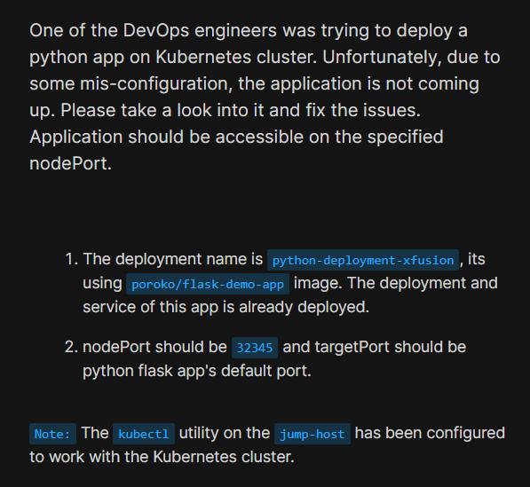
</div>

One of the DevOps engineers attempted to deploy a Python application on a Kubernetes cluster, but due to misconfigurations, the application failed to start.

My objective was to troubleshoot and fix the deployment.

Requirements:

### Deployment Requirement

| Setting | Value |
| --- | --- |
| Deployment Name | python-deployment-xfusion |
| Image | poroko/flask-demo-app |
| Container Port | Flask default port |

### Service Requirement

| Setting | Value |
| --- | --- |
| Service Name | python-service-xfusion |
| Type | NodePort |
| NodePort | 32345 |
| TargetPort | Flask default port (5000) |

* * *

## 🔹 Steps I Followed

### 1\. Checked Deployment Status

First, I verified the deployment status.

Executed:

```bash
kubectl get deployments
```
<div style="border:1px solid #ccc; padding:10px; border-radius:10px; box-shadow:2px 2px 8px rgba(0,0,0,0.2); display:inline-block;">
  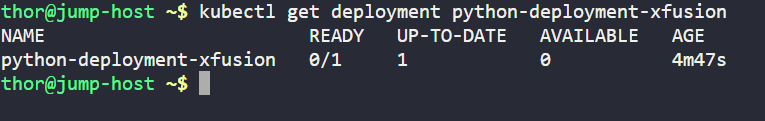
</div>

Observed:

```bash
NAME                        READY   UP-TO-DATE   AVAILABLE
python-deployment-xfusion   0/1     1            0
```

This indicated that:

*   Deployment existed
    
*   Desired replica was created
    
*   Application was not available
    

Since deployment readiness was failing, further investigation was required.

* * *

### 2\. Inspected Deployment Configuration

Executed:

```bash
kubectl describe deployment python-deployment-xfusion
```
<div style="border:1px solid #ccc; padding:10px; border-radius:10px; box-shadow:2px 2px 8px rgba(0,0,0,0.2); display:inline-block;">
  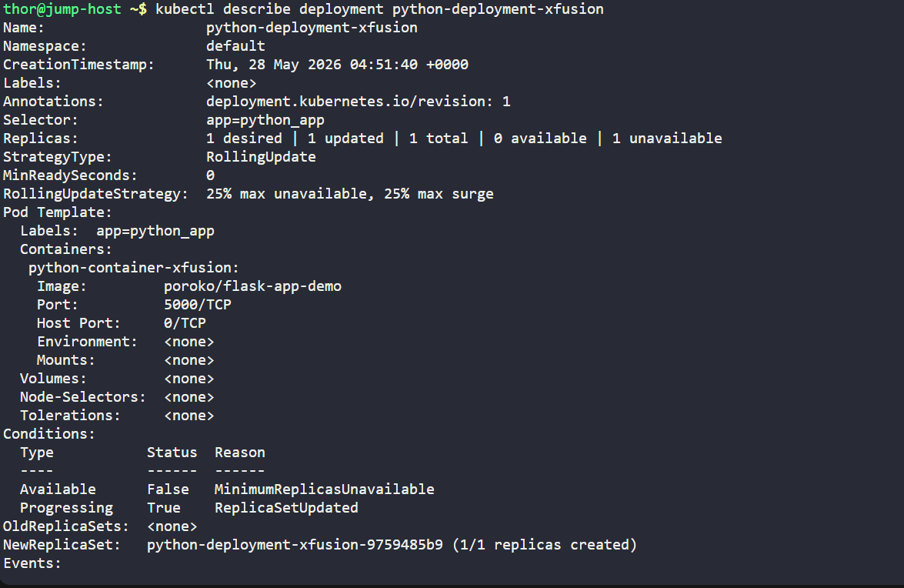
</div>


Observed:

```bash
Container:
python-container-xfusion

Image:
poroko/flask-app-demo

Port:
5000/TCP
```

The deployment configuration looked mostly correct at first glance.

However, the deployment still had no available replicas.

The next step was to inspect the pod.

* * *

### 3\. Investigated Pod Failure

First, I checked running pods.

Executed:

```bash
kubectl get pods
```
<div style="border:1px solid #ccc; padding:10px; border-radius:10px; box-shadow:2px 2px 8px rgba(0,0,0,0.2); display:inline-block;">
  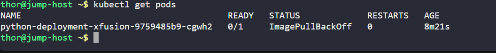
</div>

Then inspected the failing pod.

Executed:

```bash
kubectl describe pod <pod-name>
```
<div style="border:1px solid #ccc; padding:10px; border-radius:10px; box-shadow:2px 2px 8px rgba(0,0,0,0.2); display:inline-block;">
  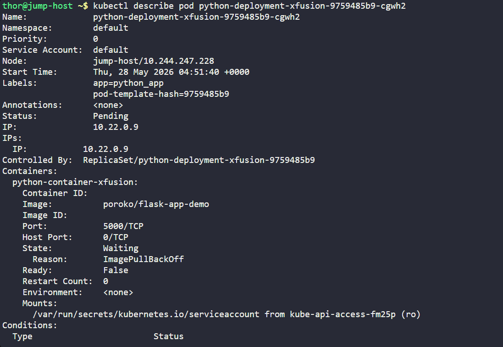
</div>
<div style="border:1px solid #ccc; padding:10px; border-radius:10px; box-shadow:2px 2px 8px rgba(0,0,0,0.2); display:inline-block;">
  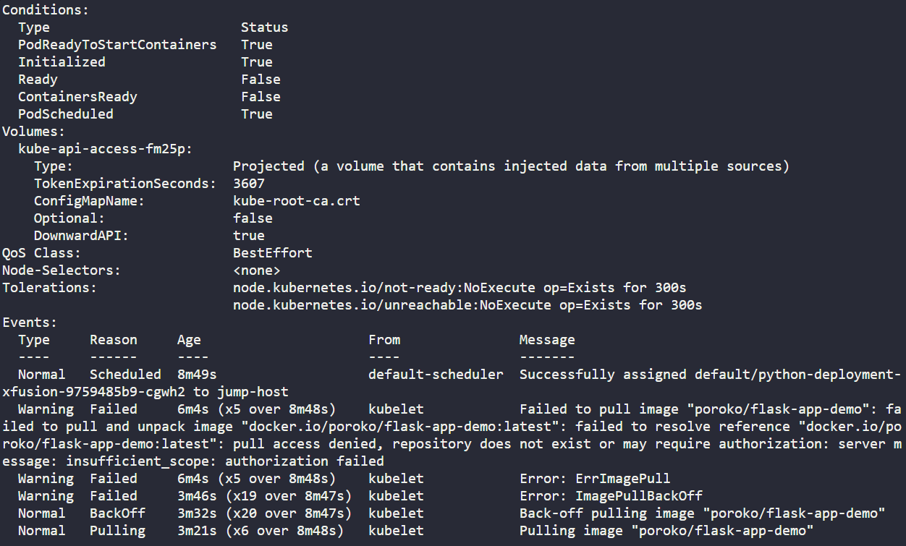
</div>

Observed:

```bash
Status: Pending

Reason:
ImagePullBackOff
```

Important error message:

```bash
Failed to pull image "poroko/flask-app-demo"

pull access denied
repository does not exist
```

This clearly indicated that Kubernetes was unable to download the container image.

* * *

## 🔹 Root Cause Analysis — Deployment Issue

The container image name was incorrect.

Incorrect image:

```text
poroko/flask-app-demo
```

Correct image:

```text
poroko/flask-demo-app
```

Because the repository name was wrong, Kubernetes could not pull the image from Docker Hub.

This caused:

*   ErrImagePull
    
*   ImagePullBackOff
    
*   Pod remaining in Pending state
    
*   Deployment unavailable
    

* * *

### 4\. Fixed Deployment Image

To fix the issue, I edited the deployment.

Executed:

```bash
kubectl edit deployment python-deployment-xfusion
```
<div style="border:1px solid #ccc; padding:10px; border-radius:10px; box-shadow:2px 2px 8px rgba(0,0,0,0.2); display:inline-block;">
  
</div>

<div style="border:1px solid #ccc; padding:10px; border-radius:10px; box-shadow:2px 2px 8px rgba(0,0,0,0.2); display:inline-block;">
  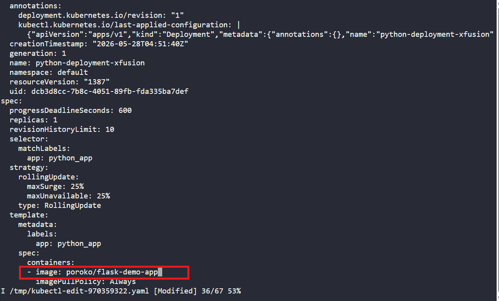
</div>

Modified:

From:

```yaml
image: poroko/flask-app-demo
```

To:

```yaml
image: poroko/flask-demo-app
```

Saved and exited the editor.

* * *

### 5\. Verified Deployment Rollout

After correcting the image, I verified deployment rollout status.

Executed:

```bash
kubectl rollout status deployment python-deployment-xfusion
```
<div style="border:1px solid #ccc; padding:10px; border-radius:10px; box-shadow:2px 2px 8px rgba(0,0,0,0.2); display:inline-block;">
  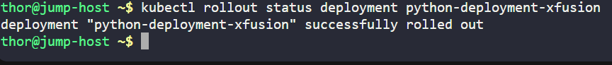
</div>

Observed:

```bash
deployment "python-deployment-xfusion" successfully rolled out
```

This confirmed that Kubernetes successfully recreated the deployment using the corrected image.

* * *

### 6\. Verified Pod Status

Executed:

```bash
kubectl get pods
```
<div style="border:1px solid #ccc; padding:10px; border-radius:10px; box-shadow:2px 2px 8px rgba(0,0,0,0.2); display:inline-block;">
  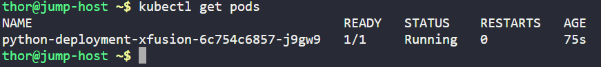
</div>

Observed:

```bash
python-deployment-xfusion-xxxxxx   1/1 Running
```

This confirmed:

*   Image successfully pulled
    
*   Pod created successfully
    
*   Container started successfully
    
*   Deployment healthy
    

Deployment issue resolved.

* * *

### 7\. Checked Service Configuration

Next, I inspected the Kubernetes service.

Executed:

```bash
kubectl get svc
```
<div style="border:1px solid #ccc; padding:10px; border-radius:10px; box-shadow:2px 2px 8px rgba(0,0,0,0.2); display:inline-block;">
  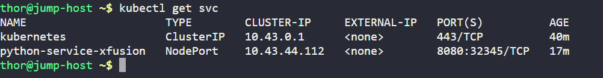
</div>

Observed:

```bash
python-service-xfusion
NodePort
8080:32345/TCP
```

Then inspected service details.

Executed:

```bash
kubectl describe svc python-service-xfusion
```
<div style="border:1px solid #ccc; padding:10px; border-radius:10px; box-shadow:2px 2px 8px rgba(0,0,0,0.2); display:inline-block;">
  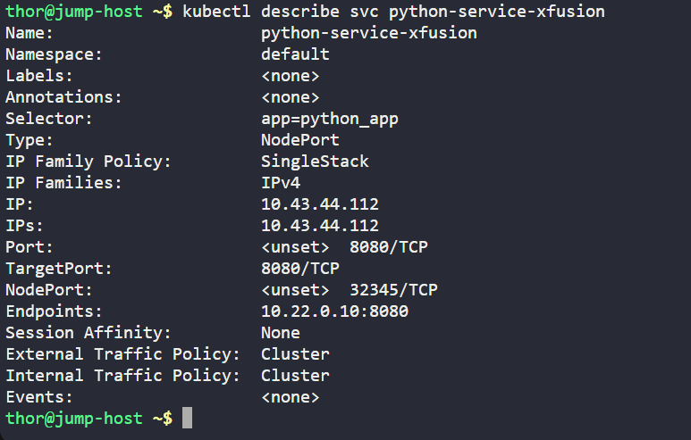
</div>

Observed:

```bash
Port: 8080/TCP
TargetPort: 8080/TCP
NodePort: 32345/TCP
Endpoints: 10.x.x.x:8080
```

The service existed and NodePort was configured correctly.

However, the targetPort looked suspicious.

* * *

## 🔹 Root Cause Analysis — Service Issue

Python Flask applications use port **5000** by default.

The service configuration incorrectly used:

```text
TargetPort = 8080
```

The application container was listening on:

```text
5000
```

This created a port mismatch.

Traffic flow failure:

```text
NodePort → Service → Wrong TargetPort → Application unreachable
```

Correct targetPort should be:

```text
5000
```

* * *

### 8\. Fixed Service TargetPort

To correct the service configuration, I edited the service.

Executed:

```bash
kubectl edit svc python-service-xfusion
```
<div style="border:1px solid #ccc; padding:10px; border-radius:10px; box-shadow:2px 2px 8px rgba(0,0,0,0.2); display:inline-block;">
  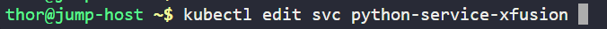
</div>

<div style="border:1px solid #ccc; padding:10px; border-radius:10px; box-shadow:2px 2px 8px rgba(0,0,0,0.2); display:inline-block;">
  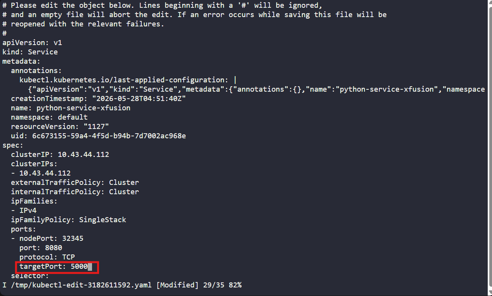
</div>


Modified:

From:

```yaml
ports:
- nodePort: 32345
  port: 8080
  targetPort: 8080
```

To:

```yaml
ports:
- nodePort: 32345
  port: 8080
  targetPort: 5000
```

Saved changes.

* * *

### 9\. Verified Service Configuration

Executed:

```bash
kubectl describe svc python-service-xfusion
```
<div style="border:1px solid #ccc; padding:10px; border-radius:10px; box-shadow:2px 2px 8px rgba(0,0,0,0.2); display:inline-block;">
  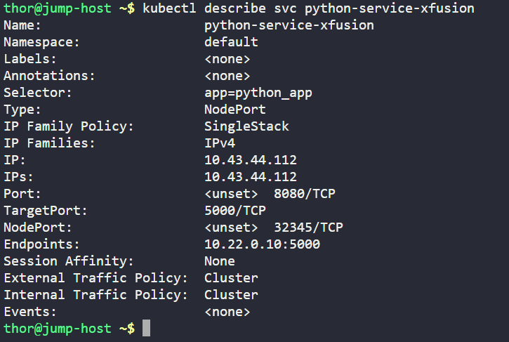
</div>

Observed:

```bash
TargetPort: 5000/TCP
NodePort: 32345/TCP
Endpoints: 10.x.x.x:5000
```

This confirmed that traffic was now correctly mapped to the Flask application container.

* * *

### 10\. Retrieved Kubernetes Node IP

To test external connectivity, I retrieved the node IP.

Executed:

```bash
kubectl get nodes -o wide
```
<div style="border:1px solid #ccc; padding:10px; border-radius:10px; box-shadow:2px 2px 8px rgba(0,0,0,0.2); display:inline-block;">
  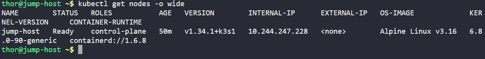
</div>

Observed:

```bash
INTERNAL-IP
10.244.247.228
```

* * *

### 11\. Performed Final Validation

Finally, I tested the application through the configured NodePort.

Executed:

```bash
curl http://10.244.247.228:32345
```
<div style="border:1px solid #ccc; padding:10px; border-radius:10px; box-shadow:2px 2px 8px rgba(0,0,0,0.2); display:inline-block;">
  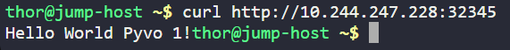
</div>

Observed:

```bash
Hello World Pyvo 1!
```

This confirmed:

*   Deployment fixed successfully
    
*   Service configured correctly
    
*   NodePort working properly
    
*   Application accessible externally
    

Task completed successfully.

* * *

## 🔹 Simple Explanation of the Kubernetes Configuration

### Deployment Explanation

A Kubernetes Deployment manages:

*   Pod creation
    
*   Application updates
    
*   Scaling
    
*   Availability
    

Deployment configuration included:

Container:

```yaml
image: poroko/flask-demo-app
```

This defines the container image Kubernetes should run.

Container Port:

```yaml
containerPort: 5000
```

This exposes the Flask application’s listening port inside the container.

* * *

### Service Explanation

The application used a NodePort service.

Configuration:

```yaml
type: NodePort
```

NodePort exposes the application externally using:

```text
NodeIP:NodePort
```

Port configuration:

```yaml
port: 8080
targetPort: 5000
nodePort: 32345
```

Traffic flow:

```text
External Request
        ↓
NodeIP:32345
        ↓
Service Port:8080
        ↓
TargetPort:5000
        ↓
Container Application
```

This allows users to access the application from outside the cluster.

* * *

## 🔹 My Understanding

This task strengthened my understanding of Kubernetes troubleshooting workflows.

I learned how deployment issues can often be traced by moving layer by layer:

Deployment → Pod → Container → Service → Networking.


* * *

## 🔹 What I Found Interesting

I found it interesting how Kubernetes provides detailed debugging information using `kubectl describe`.

The error messages clearly identified the image pull failure, making it easier to locate the root cause.

I also found it useful to observe how Services act as traffic routing layers, where even a small targetPort mismatch can prevent a healthy application from being reachable.

* * *

### Topics Covered

- ***kubernetes-Deployments***
- ***kubernetes-Services***
- ***kubernetes-image***
- ***kubernetes-pod***
- ***kubectl***


**Previous Task**: [Day 63: Deploy Iron Gallery App on Kubernetes](../Day_63/day_63.md)

**Next Task**: [Day 65: Deploy Redis Deployment on Kubernetes](../Day_65/day_65.md)