# Day 65: Deploy Redis Deployment on Kubernetes

<div style="border:1px solid #ccc; padding:10px; border-radius:10px; box-shadow:2px 2px 8px rgba(0,0,0,0.2); display:inline-block;">
  
</div>

## Content:

>Today I worked on deploying a Redis instance on a Kubernetes cluster for testing purposes. The Nautilus application team identified performance issues in one of their applications and decided to introduce Redis as an in-memory caching layer for database optimization.

---

## 🔹 What I Learned

* Creating Kubernetes **ConfigMaps**
* Using **Deployments** to manage applications
* Configuring **container resource requests**
* Working with **ConfigMap volumes**
* Working with **emptyDir volumes**
---

## 🔹 Task Requirement

<div style="border:1px solid #ccc; padding:10px; border-radius:10px; box-shadow:2px 2px 8px rgba(0,0,0,0.2); display:inline-block;">
  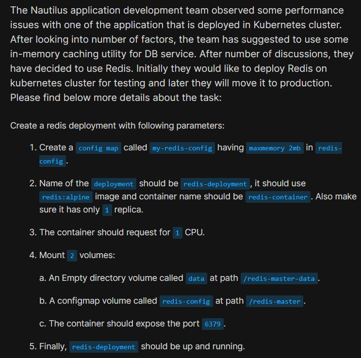
</div>


As per the Nautilus DevOps team requirements, I needed to deploy Redis on the Kubernetes cluster using the following specifications.

### ConfigMap Requirement

| Resource       | Value           |
| -------------- | --------------- |
| ConfigMap Name | my-redis-config |
| Key            | redis-config    |
| Value          | maxmemory 2mb   |

### Redis Deployment Requirement

| Requirement     | Value            |
| --------------- | ---------------- |
| Deployment Name | redis-deployment |
| Image           | redis:alpine     |
| Replica Count   | 1                |
| Container Name  | redis-container  |
| CPU Request     | 1 CPU            |
| Container Port  | 6379             |

### Volume Configuration

| Volume Name  | Type      | Mount Path         |
| ------------ | --------- | ------------------ |
| data         | emptyDir  | /redis-master-data |
| redis-config | ConfigMap | /redis-master      |

---

## 🔹 Steps I Followed

### 1. Connected to the Jump Host

Logged into the jump host where **kubectl** was already configured to communicate with the Kubernetes cluster.

---

### 2. Created the ConfigMap

Executed:

```bash
kubectl create configmap my-redis-config \
  --from-literal=redis-config='maxmemory 2mb'
```
<div style="border:1px solid #ccc; padding:10px; border-radius:10px; box-shadow:2px 2px 8px rgba(0,0,0,0.2); display:inline-block;">
  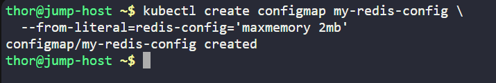
</div>

Observed:

```bash
configmap/my-redis-config created
```

This confirmed that the Redis configuration ConfigMap was created successfully.

---

### 3. Created Kubernetes Deployment Manifest

Executed:

```bash
vi redis-deployment.yaml
```
<div style="border:1px solid #ccc; padding:10px; border-radius:10px; box-shadow:2px 2px 8px rgba(0,0,0,0.2); display:inline-block;">
  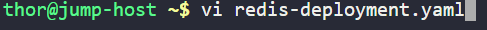
</div>

<div style="border:1px solid #ccc; padding:10px; border-radius:10px; box-shadow:2px 2px 8px rgba(0,0,0,0.2); display:inline-block;">
  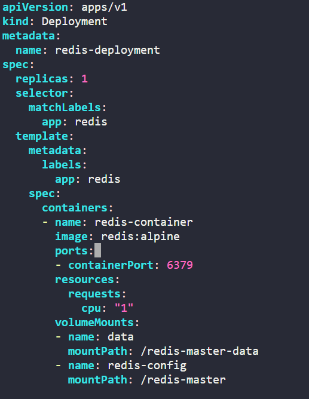
</div>

<div style="border:1px solid #ccc; padding:10px; border-radius:10px; box-shadow:2px 2px 8px rgba(0,0,0,0.2); display:inline-block;">
  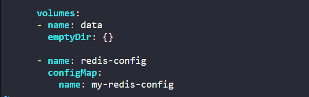
</div>

Added the following YAML configuration:

```yaml
apiVersion: apps/v1
kind: Deployment

metadata:
  name: redis-deployment

spec:
  replicas: 1

  selector:
    matchLabels:
      app: redis

  template:
    metadata:
      labels:
        app: redis

    spec:
      containers:
      - name: redis-container
        image: redis:alpine

        ports:
        - containerPort: 6379

        resources:
          requests:
            cpu: "1"

        volumeMounts:
        - name: data
          mountPath: /redis-master-data

        - name: redis-config
          mountPath: /redis-master

      volumes:
      - name: data
        emptyDir: {}

      - name: redis-config
        configMap:
          name: my-redis-config
```

---

## 🔹 Simple Explanation of the Kubernetes YAML File

### API Version

```yaml
apiVersion: apps/v1
```

Defines the Kubernetes API version used for Deployment resources.

---

### Resource Type

```yaml
kind: Deployment
```

Creates a Kubernetes Deployment resource.

A Deployment manages:

* Pod creation
* Updates
* Scaling
* Application availability

---

### Deployment Name

```yaml
metadata:
  name: redis-deployment
```

Defines the deployment name.

---

### Replica Configuration

```yaml
replicas: 1
```

Kubernetes maintains exactly one running Redis Pod.

---

### Label Selector

```yaml
selector:
  matchLabels:
    app: redis
```

Used by Kubernetes to identify which Pods belong to this deployment.

---

### Pod Labels

```yaml
labels:
  app: redis
```

Assigns labels to the Pod template.

These labels help Kubernetes associate Pods with the Deployment.

---

### Container Configuration

```yaml
containers:
```

Defines container specifications.

Container configuration:

```yaml
name: redis-container
image: redis:alpine
```

Creates:

* Container name → **redis-container**
* Image → **redis:alpine**

---

### Port Configuration

```yaml
ports:
- containerPort: 6379
```

Exposes Redis default application port.

Redis communicates through:

**6379/TCP**

---

### Resource Request Configuration

```yaml
resources:
  requests:
    cpu: "1"
```

Requests **1 CPU** for the container.

This ensures Kubernetes reserves CPU resources for Redis scheduling and execution.

---

### Volume Mount Configuration

```yaml
volumeMounts:
```

Mounts storage resources inside the container.

#### Data Volume Mount

```yaml
mountPath: /redis-master-data
```

Mounts temporary application storage.

#### ConfigMap Volume Mount

```yaml
mountPath: /redis-master
```

Mounts Redis configuration data from ConfigMap.

---

### Volume Definition

#### EmptyDir Volume

```yaml
emptyDir: {}
```

Creates temporary storage tied to the Pod lifecycle.

Data persists as long as the Pod exists.

---

#### ConfigMap Volume

```yaml
configMap:
  name: my-redis-config
```

Loads configuration data from the Kubernetes ConfigMap.

This allows configuration values to be managed independently from the container image.

---

### 👉 In simple terms:

This YAML file tells Kubernetes to:

* Deploy a Redis application
* Run exactly one Redis Pod
* Use the Redis Alpine image
* Reserve CPU resources
* Expose Redis on port 6379
* Create temporary application storage
* Mount Redis configuration from a ConfigMap

---

### 4. Applied the Configuration

Executed:

```bash
kubectl apply -f redis-deployment.yaml
```
<div style="border:1px solid #ccc; padding:10px; border-radius:10px; box-shadow:2px 2px 8px rgba(0,0,0,0.2); display:inline-block;">
  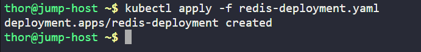
</div>

Observed:

```bash
deployment.apps/redis-deployment created
```

This confirmed the deployment was created successfully.

---

### 5. Verified Deployment Status

Executed:

```bash
kubectl get deploy
```
<div style="border:1px solid #ccc; padding:10px; border-radius:10px; box-shadow:2px 2px 8px rgba(0,0,0,0.2); display:inline-block;">
  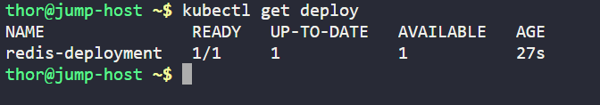
</div>

Observed:

```bash
NAME               READY   UP-TO-DATE   AVAILABLE
redis-deployment   1/1     1            1
```

This confirmed:

* Deployment created successfully
* Replica available
* Application healthy

---

### 6. Verified Pod Status

Executed:

```bash
kubectl get pods
```
<div style="border:1px solid #ccc; padding:10px; border-radius:10px; box-shadow:2px 2px 8px rgba(0,0,0,0.2); display:inline-block;">
  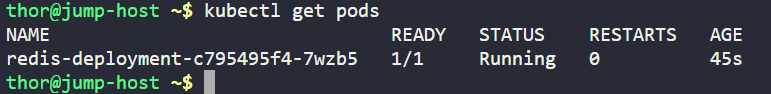
</div>

Observed:

```bash
NAME                               READY   STATUS
redis-deployment-c795495f4-7wzb5   1/1     Running
```

This confirmed:

* Pod created successfully
* Pod status = Running
* Container healthy

---

### 7. Verified Pod Configuration

Executed:

```bash
kubectl describe pod <pod-name>
```
<div style="border:1px solid #ccc; padding:10px; border-radius:10px; box-shadow:2px 2px 8px rgba(0,0,0,0.2); display:inline-block;">
  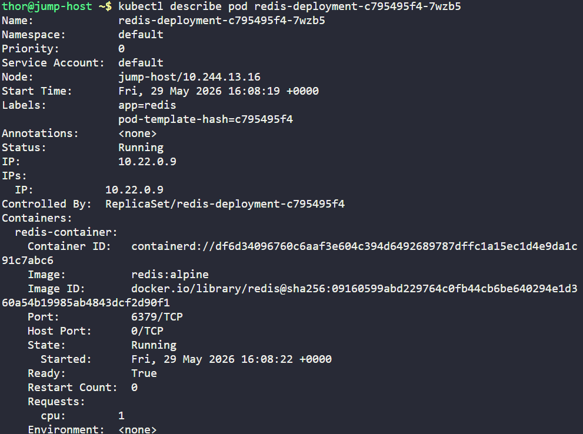
</div>

<div style="border:1px solid #ccc; padding:10px; border-radius:10px; box-shadow:2px 2px 8px rgba(0,0,0,0.2); display:inline-block;">
  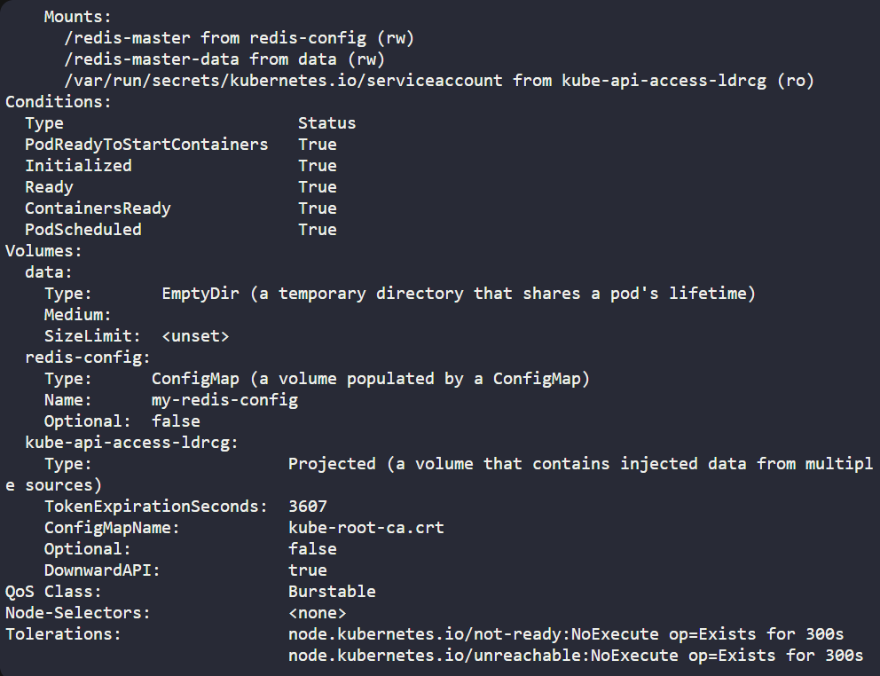
</div>

<div style="border:1px solid #ccc; padding:10px; border-radius:10px; box-shadow:2px 2px 8px rgba(0,0,0,0.2); display:inline-block;">
  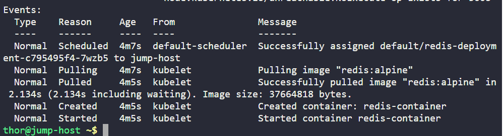
</div>

Verified:

* Container image → redis:alpine
* Port → 6379/TCP
* CPU request → 1
* Volume mounts configured correctly
* ConfigMap mounted successfully
* EmptyDir mounted successfully

---

### 8. Verified Deployment Details

Executed:

```bash
kubectl describe deployment redis-deployment
```
<div style="border:1px solid #ccc; padding:10px; border-radius:10px; box-shadow:2px 2px 8px rgba(0,0,0,0.2); display:inline-block;">
  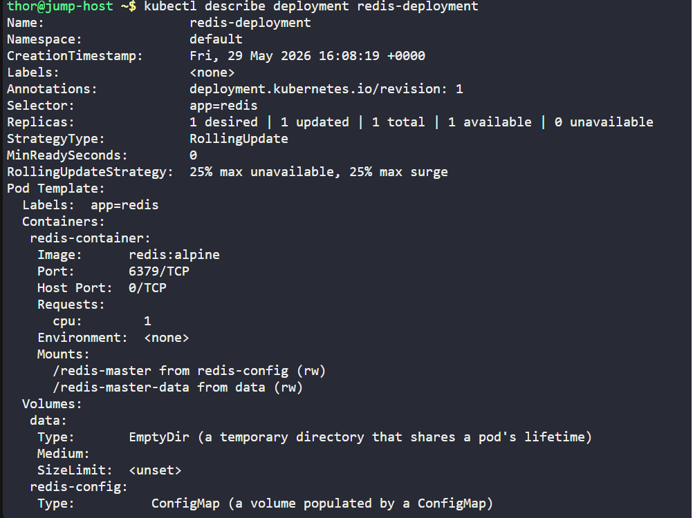
</div>

<div style="border:1px solid #ccc; padding:10px; border-radius:10px; box-shadow:2px 2px 8px rgba(0,0,0,0.2); display:inline-block;">
  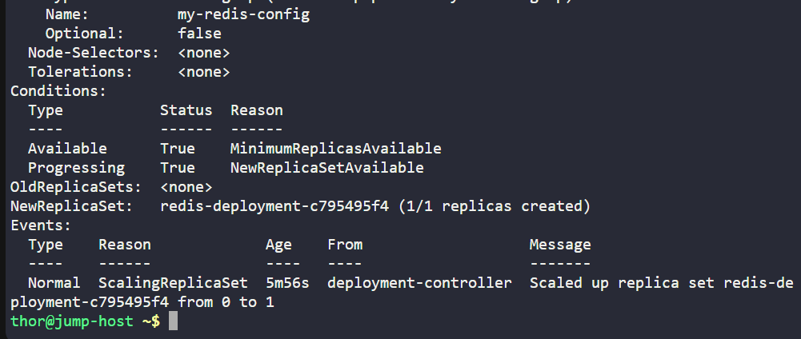
</div>

Verified:

* Replica count = 1
* Container configuration correct
* Volume definitions correct
* Deployment status healthy

---

## 🔹 My Understanding

This task strengthened my understanding of how Kubernetes Deployments can be combined with ConfigMaps and Volumes to manage application configuration cleanly.

---

## 🔹 What I Found Interesting

I found it interesting how Kubernetes allows application configuration to be managed externally using ConfigMaps rather than hardcoding values inside container images.

### Topics Covered

- ***kubernetes-Deployments***
- ***kubernetes-redis***
- ***kubernetes-image***
- ***kubernetes-pod***
- ***kubectl***


**Previous Task**: [Day 64: Fix Python App Deployed on Kubernetes Cluster](../Day_64/day_64.md)

**Next Task**: [Day 66: Deploy MySQL on Kubernetes](../Day_66/day_66.md)