# Day 66: Deploy MySQL on Kubernetes

<div style="border:1px solid #ccc; padding:10px; border-radius:10px; box-shadow:2px 2px 8px rgba(0,0,0,0.2); display:inline-block;">
  
</div>

## Content:

>Today I worked on deploying a MySQL database server on a Kubernetes cluster. The Nautilus DevOps team required a persistent MySQL deployment that uses Kubernetes storage resources, secrets, environment variables, and a NodePort service for connectivity.

* * *

## 🔹 What I Learned

* Creating PersistentVolumes (PV)

* Creating PersistentVolumeClaims (PVC)
 
* Managing Kubernetes Secrets

* Using environment variables with secretKeyRef

* Deploying MySQL using Kubernetes Deployments

* Using persistent storage with volumeMounts

* Creating NodePort Services for external access

## 🔹 Task Requirement

<div style="border:1px solid #ccc; padding:10px; border-radius:10px; box-shadow:2px 2px 8px rgba(0,0,0,0.2); display:inline-block;">
  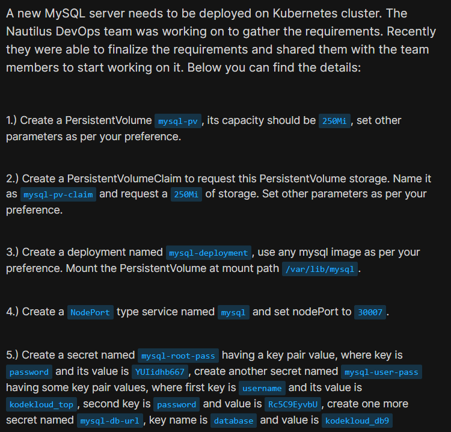
</div>

<div style="border:1px solid #ccc; padding:10px; border-radius:10px; box-shadow:2px 2px 8px rgba(0,0,0,0.2); display:inline-block;">
  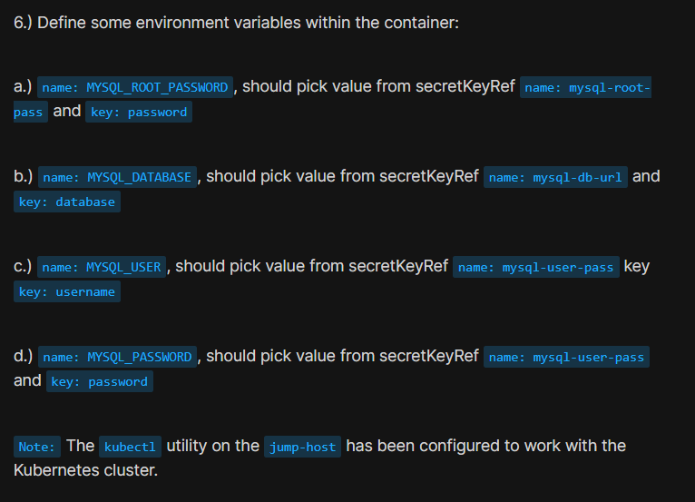
</div>

As per the Nautilus DevOps team requirements, I needed to deploy MySQL on the Kubernetes cluster using the following specifications.

#### PersistentVolume Requirement

| Resource      | Value         |
| ------------- | ------------- |
| PV Name       | mysql-pv      |
| Capacity      | 250Mi         |
| Storage Class | manual        |
| Access Mode   | ReadWriteOnce |

#### PersistentVolumeClaim Requirement

| Resource          | Value          |
| ----------------- | -------------- |
| PVC Name          | mysql-pv-claim |
| Requested Storage | 250Mi          |
| Storage Class     | manual         |

#### Secrets Requirement

| Secret Name     | Key      | Value         |
| --------------- | -------- | ------------- |
| mysql-root-pass | password | YUIidhb667    |
| mysql-user-pass | username | kodekloud_top |
| mysql-user-pass | password | Rc5C9EyvbU    |
| mysql-db-url    | database | kodekloud_db9 |

#### Deployment Requirement

| Resource        | Value            |
| --------------- | ---------------- |
| Deployment Name | mysql-deployment |
| Image           | mysql:8.0        |
| Replica Count   | 1                |
| Mount Path      | /var/lib/mysql   |

#### Service Requirement

| Resource     | Value    |
| ------------ | -------- |
| Service Name | mysql    |
| Service Type | NodePort |
| NodePort     | 30007    |

* * *

## 🔹 Steps I Followed

### 1. Connected to the Jump Host

Logged into the jump host where kubectl was already configured to communicate with the Kubernetes cluster.

* * *

### 2. Created the PersistentVolume

Executed:

```bash
vi mysql.yaml
```
<div style="border:1px solid #ccc; padding:10px; border-radius:10px; box-shadow:2px 2px 8px rgba(0,0,0,0.2); display:inline-block;">
  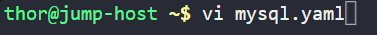
</div>

Added:

<div style="border:1px solid #ccc; padding:10px; border-radius:10px; box-shadow:2px 2px 8px rgba(0,0,0,0.2); display:inline-block;">
  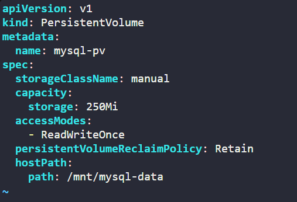
</div>

```yaml
apiVersion: v1
kind: PersistentVolume

metadata:
  name: mysql-pv

spec:
  storageClassName: manual

  capacity:
    storage: 250Mi

  accessModes:
    - ReadWriteOnce

  persistentVolumeReclaimPolicy: Retain

  hostPath:
    path: /mnt/mysql-data
```

Applied:

```bash
kubectl apply -f mysql.yaml
```
<div style="border:1px solid #ccc; padding:10px; border-radius:10px; box-shadow:2px 2px 8px rgba(0,0,0,0.2); display:inline-block;">
  
</div>

Observed:

```plaintext
persistentvolume/mysql-pv created
```

Verified:

```bash
kubectl get pv
```
<div style="border:1px solid #ccc; padding:10px; border-radius:10px; box-shadow:2px 2px 8px rgba(0,0,0,0.2); display:inline-block;">
  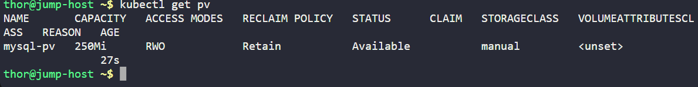
</div>

Observed:

```plaintext
mysql-pv   250Mi   RWO   Available
```

This confirmed that the PersistentVolume was created successfully.

* * *

### 3. Created the PersistentVolumeClaim

Executed:

```bash
vi mysql-pvc.yml
```

<div style="border:1px solid #ccc; padding:10px; border-radius:10px; box-shadow:2px 2px 8px rgba(0,0,0,0.2); display:inline-block;">
  
</div>

Added:

<div style="border:1px solid #ccc; padding:10px; border-radius:10px; box-shadow:2px 2px 8px rgba(0,0,0,0.2); display:inline-block;">
  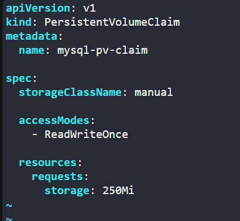
</div>


```yaml
apiVersion: v1
kind: PersistentVolumeClaim

metadata:
  name: mysql-pv-claim

spec:
  storageClassName: manual

  accessModes:
    - ReadWriteOnce

  resources:
    requests:
      storage: 250Mi
```

Applied:

```bash
kubectl apply -f mysql-pvc.yml
```
<div style="border:1px solid #ccc; padding:10px; border-radius:10px; box-shadow:2px 2px 8px rgba(0,0,0,0.2); display:inline-block;">
  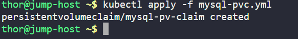
</div>

Verified:

```bash
kubectl get pvc
```
<div style="border:1px solid #ccc; padding:10px; border-radius:10px; box-shadow:2px 2px 8px rgba(0,0,0,0.2); display:inline-block;">
  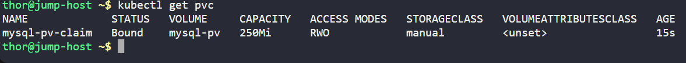
</div>

<div style="border:1px solid #ccc; padding:10px; border-radius:10px; box-shadow:2px 2px 8px rgba(0,0,0,0.2); display:inline-block;">
  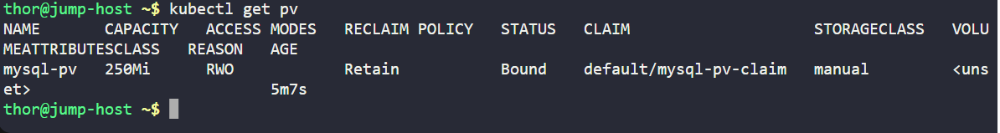
</div>

Observed:

```bash 
mysql-pv-claim   Bound
```

This confirmed that Kubernetes successfully matched the PVC with the PV.

* * *

### 4. Created Kubernetes Secrets

Executed:
```bash
vi mysql-secret.yml
```
<div style="border:1px solid #ccc; padding:10px; border-radius:10px; box-shadow:2px 2px 8px rgba(0,0,0,0.2); display:inline-block;">
  
</div>

Added:

<div style="border:1px solid #ccc; padding:10px; border-radius:10px; box-shadow:2px 2px 8px rgba(0,0,0,0.2); display:inline-block;">
  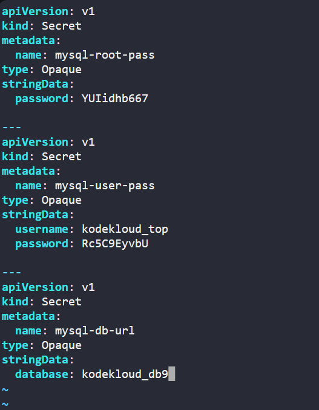
</div>

```yaml
apiVersion: v1
kind: Secret

metadata:
  name: mysql-root-pass

type: Opaque

stringData:
  password: YUIidhb667

---
apiVersion: v1
kind: Secret

metadata:
  name: mysql-user-pass

type: Opaque

stringData:
  username: kodekloud_top
  password: Rc5C9EyvbU

---
apiVersion: v1
kind: Secret

metadata:
  name: mysql-db-url

type: Opaque

stringData:
  database: kodekloud_db9
```

Applied:

```bash
kubectl apply -f mysql-secret.yml
```
<div style="border:1px solid #ccc; padding:10px; border-radius:10px; box-shadow:2px 2px 8px rgba(0,0,0,0.2); display:inline-block;">
  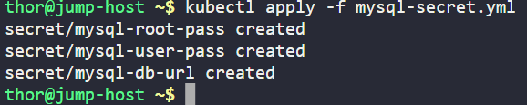
</div>

Observed:

```plaintext
secret/mysql-root-pass created
secret/mysql-user-pass created
secret/mysql-db-url created
```

Verified:

```bash
kubectl get secrets
```
<div style="border:1px solid #ccc; padding:10px; border-radius:10px; box-shadow:2px 2px 8px rgba(0,0,0,0.2); display:inline-block;">
  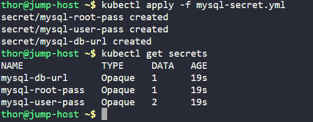
</div>

This confirmed that all required secrets were created successfully.

* * *

### 5. Created Kubernetes Deployment Manifest

Executed:

```bash
vi mysql-deploy.yml
```
<div style="border:1px solid #ccc; padding:10px; border-radius:10px; box-shadow:2px 2px 8px rgba(0,0,0,0.2); display:inline-block;">
  
</div>

Added:

<div style="border:1px solid #ccc; padding:10px; border-radius:10px; box-shadow:2px 2px 8px rgba(0,0,0,0.2); display:inline-block;">
  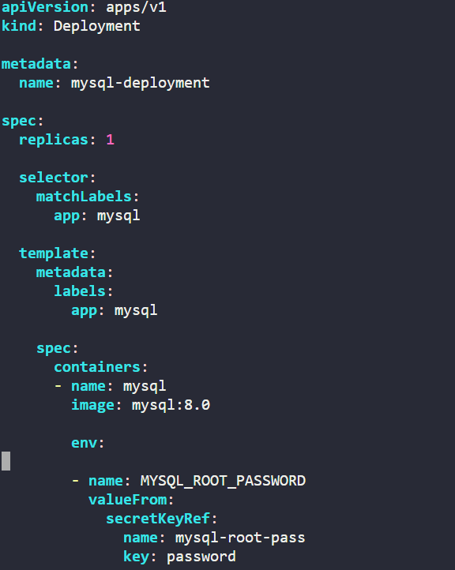
</div>

<div style="border:1px solid #ccc; padding:10px; border-radius:10px; box-shadow:2px 2px 8px rgba(0,0,0,0.2); display:inline-block;">
  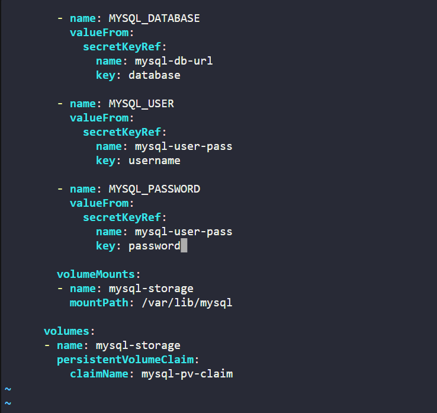
</div>

```yaml
apiVersion: apps/v1
kind: Deployment

metadata:
  name: mysql-deployment

spec:
  replicas: 1

  selector:
    matchLabels:
      app: mysql

  template:
    metadata:
      labels:
        app: mysql

    spec:
      containers:
      - name: mysql
        image: mysql:8.0

        env:

        - name: MYSQL_ROOT_PASSWORD
          valueFrom:
            secretKeyRef:
              name: mysql-root-pass
              key: password

        - name: MYSQL_DATABASE
          valueFrom:
            secretKeyRef:
              name: mysql-db-url
              key: database

        - name: MYSQL_USER
          valueFrom:
            secretKeyRef:
              name: mysql-user-pass
              key: username

        - name: MYSQL_PASSWORD
          valueFrom:
            secretKeyRef:
              name: mysql-user-pass
              key: password

        volumeMounts:
        - name: mysql-storage
          mountPath: /var/lib/mysql

      volumes:
      - name: mysql-storage
        persistentVolumeClaim:
          claimName: mysql-pv-claim
```

### 🔹 Simple Explanation of the Kubernetes YAML File

API Version

```yaml
apiVersion: apps/v1
```

Defines the Kubernetes API version used for Deployment resources.

Resource Type

```yaml
kind: Deployment
```

Creates a Deployment resource.

#### A Deployment manages:

* Pod creation

* Application availability

* Automatic recovery

* Updates and scaling

#### Deployment Name

```yaml
metadata:
  name: mysql-deployment
```

#### Defines the deployment name.

Replica Configuration

```yaml
replicas: 1
```

Kubernetes maintains exactly one running MySQL Pod.

#### Label Selector

```yaml
selector:
  matchLabels:
    app: mysql
```

Used by Kubernetes to identify Pods belonging to this deployment.

#### Container Configuration

```yaml
image: mysql:8.0
```

Uses the official MySQL container image.

#### Environment Variable Configuration

```yaml
env:
```

Loads sensitive database configuration using Kubernetes Secrets.

Injected variables:

* MYSQL_ROOT_PASSWORD

* MYSQL_DATABASE

* MYSQL_USER

* MYSQL_PASSWORD

* Storage Configuration

```yaml
volumeMounts:
```

Mounts persistent storage inside the container.

#### Mount Path:

```plaintext
/var/lib/mysql
```

This is the default MySQL data directory.

#### PVC Configuration

```yaml
persistentVolumeClaim:
  claimName: mysql-pv-claim
```

Connects the Deployment to persistent storage.

👉 In simple terms:

This YAML file tells Kubernetes to:

Deploy a MySQL application

Run one MySQL Pod

Use Kubernetes Secrets for credentials

Attach persistent storage

Store MySQL database files safely

Automatically recover failed Pods

* * *

### 6. Applied the Deployment Configuration

Executed:

```bash
kubectl apply -f mysql-deploy.yml
```
<div style="border:1px solid #ccc; padding:10px; border-radius:10px; box-shadow:2px 2px 8px rgba(0,0,0,0.2); display:inline-block;">
  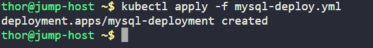
</div>

Observed:

```plaintext
deployment.apps/mysql-deployment created
```

Verified:

```bash
kubectl get deploy
```

Observed:

```plaintext
mysql-deployment   1/1   1   1
```

Verified Pod status:

```bash
kubectl get pods
```
<div style="border:1px solid #ccc; padding:10px; border-radius:10px; box-shadow:2px 2px 8px rgba(0,0,0,0.2); display:inline-block;">
  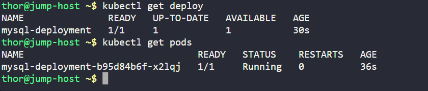
</div>

Observed:

```plaintext
mysql-deployment-b95d84b6f-x2lqj   Running
```

This confirmed:

Deployment healthy

Pod running successfully

Secrets loaded correctly

Storage mounted successfully

* * *

### 7. Created NodePort Service

Executed:

```bash
vi mysql-service.yml
```
<div style="border:1px solid #ccc; padding:10px; border-radius:10px; box-shadow:2px 2px 8px rgba(0,0,0,0.2); display:inline-block;">
  
</div>

Added:

<div style="border:1px solid #ccc; padding:10px; border-radius:10px; box-shadow:2px 2px 8px rgba(0,0,0,0.2); display:inline-block;">
  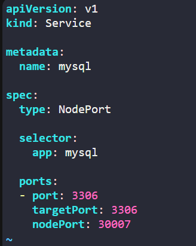
</div>

```yaml
apiVersion: v1
kind: Service

metadata:
  name: mysql

spec:
  type: NodePort

  selector:
    app: mysql

  ports:
  - port: 3306
    targetPort: 3306
    nodePort: 30007
```

Applied:

```bash
kubectl apply -f mysql-service.yml
```
<div style="border:1px solid #ccc; padding:10px; border-radius:10px; box-shadow:2px 2px 8px rgba(0,0,0,0.2); display:inline-block;">
  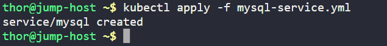
</div>

Verified:

```bash
kubectl get svc
```
<div style="border:1px solid #ccc; padding:10px; border-radius:10px; box-shadow:2px 2px 8px rgba(0,0,0,0.2); display:inline-block;">
  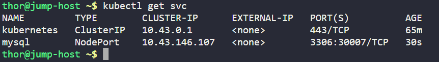
</div>

Observed:

```plaintext
mysql   NodePort   3306:30007/TCP
```

Verified Service details:

```bash
kubectl describe svc mysql
```

Verified Endpoints:

```bash
kubectl get endpoints
```

Observed:

```plaintext
mysql   10.x.x.x:3306
```
<div style="border:1px solid #ccc; padding:10px; border-radius:10px; box-shadow:2px 2px 8px rgba(0,0,0,0.2); display:inline-block;">
  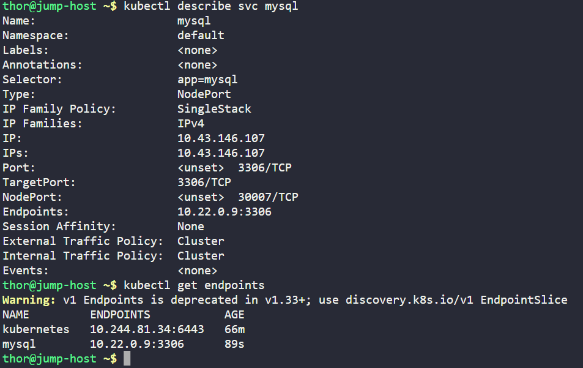
</div>

This confirmed:

Service created successfully

NodePort configured correctly

Traffic routing to MySQL Pod working

* * *

### 🔹 My Understanding

This task strengthened my understanding of how Kubernetes storage, secrets, deployments, and services work together to deploy stateful applications like MySQL.

I learned how PersistentVolumes and PersistentVolumeClaims provide persistent storage and how Kubernetes Secrets can securely inject sensitive values into containers.

* * *

### 🔹 What I Found Interesting

I found it interesting how Kubernetes separates application logic, storage, and configuration into independent resources.

Using Secrets for environment variables and PersistentVolumes for database storage makes deployments more secure, reusable, and production-ready.

* * *

### Topics Covered

- ***kubernetes-Deployments***
- ***kubernetes-persistentVolumes***
- ***kubernetes-PersistentVolumeClaims***
- ***kubernetes-mysql***
- ***kubernetes-image***
- ***kubernetes-pod***
- ***kubernetes-secrets***
- ***kubernetes-env***
- ***kubectl***


**Previous Task**: [Day 65: Deploy Redis Deployment on Kubernetes](../Day_65/day_65.md)

**Next Task**: [Day 67: Deploy Guest Book App on Kubernetes](../Day_67/day_67.md)