# Day 67: Deploy Guest Book App on Kubernetes

<div style="border:1px solid #ccc; padding:10px; border-radius:10px; box-shadow:2px 2px 8px rgba(0,0,0,0.2); display:inline-block;">
  
</div>

## Content:

> Today I worked on deploying a complete **Guestbook application** on a Kubernetes cluster. The Nautilus application team completed development of their application and finalized the Kubernetes infrastructure for deployment.

> The application consisted of a **backend tier** using Redis Master and Redis Slave components, along with a **frontend tier** serving the Guestbook web application.

---

## 🔹 What I Learned

* Creating Kubernetes **Deployments**

* Creating **ClusterIP Services**

* Creating **NodePort Services**

* Using **Labels and Selectors**

* Configuring **container resource requests**

* Working with **environment variables**

* Deploying **multi-tier applications on Kubernetes**

---

## 🔹 Task Requirement

<div style="border:1px solid #ccc; padding:10px; border-radius:10px; box-shadow:2px 2px 8px rgba(0,0,0,0.2); display:inline-block;">
  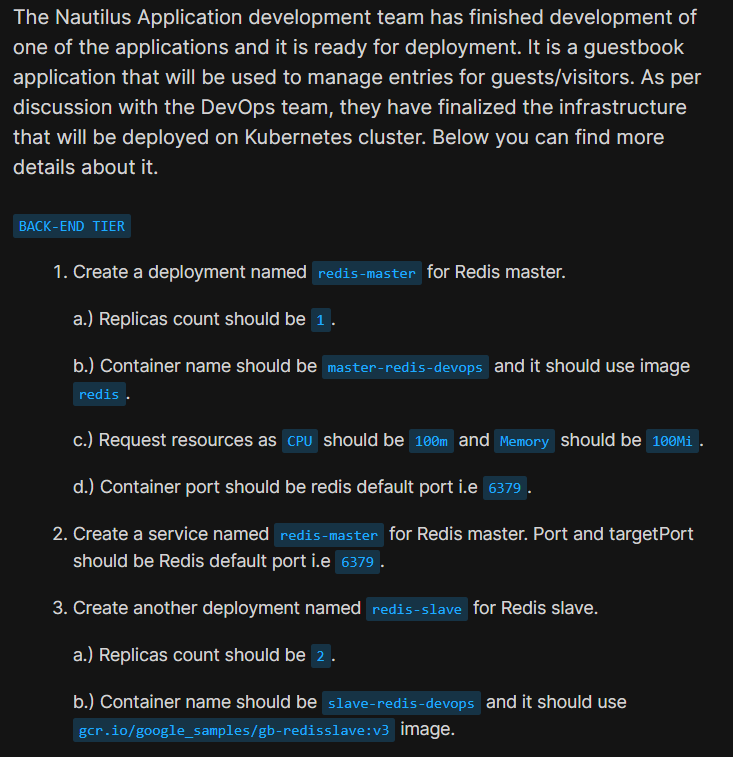
</div>

<div style="border:1px solid #ccc; padding:10px; border-radius:10px; box-shadow:2px 2px 8px rgba(0,0,0,0.2); display:inline-block;">
  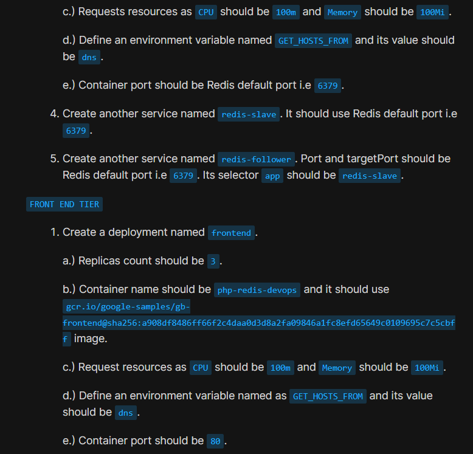
</div>

<div style="border:1px solid #ccc; padding:10px; border-radius:10px; box-shadow:2px 2px 8px rgba(0,0,0,0.2); display:inline-block;">
  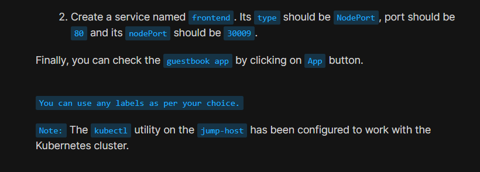
</div>

The Nautilus DevOps team required deployment of a complete Guestbook application.

### Redis Master Requirement

| Requirement     | Value               |
| --------------- | ------------------- |
| Deployment Name | redis-master        |
| Replica Count   | 1                   |
| Container Name  | master-redis-devops |
| Image           | redis               |
| CPU Request     | 100m                |
| Memory Request  | 100Mi               |
| Container Port  | 6379                |

### Redis Slave Requirement

| Requirement          | Value                                  |
| -------------------- | -------------------------------------- |
| Deployment Name      | redis-slave                            |
| Replica Count        | 2                                      |
| Container Name       | slave-redis-devops                     |
| Image                | gcr.io/google_samples/gb-redisslave:v3 |
| CPU Request          | 100m                                   |
| Memory Request       | 100Mi                                  |
| Environment Variable | GET_HOSTS_FROM=dns                     |
| Container Port       | 6379                                   |

### Frontend Requirement

| Requirement          | Value                                                                                                     |
| -------------------- | --------------------------------------------------------------------------------------------------------- |
| Deployment Name      | frontend                                                                                                  |
| Replica Count        | 3                                                                                                         |
| Container Name       | php-redis-devops                                                                                          |
| Image                | gcr.io/google-samples/gb-frontend@sha256:a908df8486ff66f2c4daa0d3d8a2fa09846a1fc8efd65649c0109695c7c5cbff |
| CPU Request          | 100m                                                                                                      |
| Memory Request       | 100Mi                                                                                                     |
| Environment Variable | GET_HOSTS_FROM=dns                                                                                        |
| Container Port       | 80                                                                                                        |

### Service Requirement

| Service        | Type      | Port       |
| -------------- | --------- | ---------- |
| redis-master   | ClusterIP | 6379       |
| redis-slave    | ClusterIP | 6379       |
| redis-follower | ClusterIP | 6379       |
| frontend       | NodePort  | 80 → 30009 |

---

## 🔹 Steps I Followed

### 1. Connected to the Jump Host

Logged into the jump host where **kubectl** was already configured to communicate with the Kubernetes cluster.

---

### 2. Created Redis Master Deployment and Service

Executed:

```bash
vi redis-master.yaml
```
<div style="border:1px solid #ccc; padding:10px; border-radius:10px; box-shadow:2px 2px 8px rgba(0,0,0,0.2); display:inline-block;">
  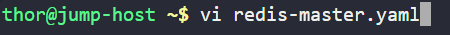
</div>

<div style="border:1px solid #ccc; padding:10px; border-radius:10px; box-shadow:2px 2px 8px rgba(0,0,0,0.2); display:inline-block;">
  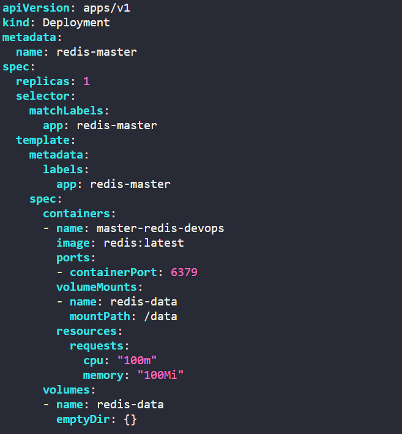
</div>

<div style="border:1px solid #ccc; padding:10px; border-radius:10px; box-shadow:2px 2px 8px rgba(0,0,0,0.2); display:inline-block;">
  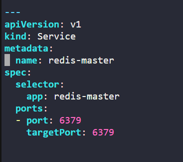
</div>

Added:

```yaml
apiVersion: apps/v1
kind: Deployment

metadata:
  name: redis-master

spec:
  replicas: 1

  selector:
    matchLabels:
      app: redis-master

  template:
    metadata:
      labels:
        app: redis-master

    spec:
      containers:
      - name: master-redis-devops
        image: redis

        ports:
        - containerPort: 6379

        resources:
          requests:
            cpu: "100m"
            memory: "100Mi"

---
apiVersion: v1
kind: Service

metadata:
  name: redis-master

spec:
  selector:
    app: redis-master

  ports:
  - port: 6379
    targetPort: 6379
```

Applied configuration:

```bash
kubectl apply -f redis-master.yaml
```
<div style="border:1px solid #ccc; padding:10px; border-radius:10px; box-shadow:2px 2px 8px rgba(0,0,0,0.2); display:inline-block;">
  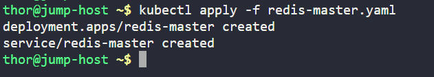
</div>

Observed:

```bash
deployment.apps/redis-master created
service/redis-master created
```
<div style="border:1px solid #ccc; padding:10px; border-radius:10px; box-shadow:2px 2px 8px rgba(0,0,0,0.2); display:inline-block;">
  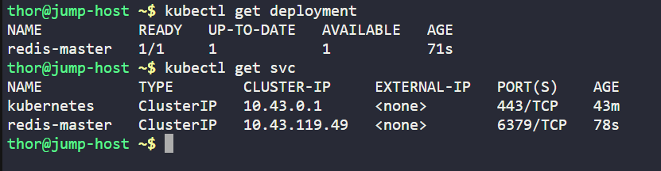
</div>

---

### 3. Created Redis Slave Deployment and Services

Executed:

```bash
vi redis-slave.yaml
```
<div style="border:1px solid #ccc; padding:10px; border-radius:10px; box-shadow:2px 2px 8px rgba(0,0,0,0.2); display:inline-block;">
  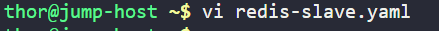
</div>

<div style="border:1px solid #ccc; padding:10px; border-radius:10px; box-shadow:2px 2px 8px rgba(0,0,0,0.2); display:inline-block;">
  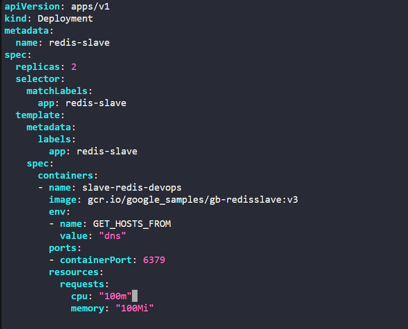
</div>

<div style="border:1px solid #ccc; padding:10px; border-radius:10px; box-shadow:2px 2px 8px rgba(0,0,0,0.2); display:inline-block;">
  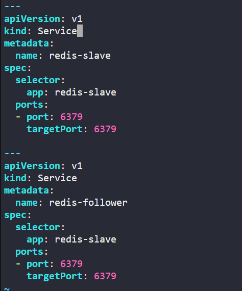
</div>


Added:

```yaml
apiVersion: apps/v1
kind: Deployment

metadata:
  name: redis-slave

spec:
  replicas: 2

  selector:
    matchLabels:
      app: redis-slave

  template:
    metadata:
      labels:
        app: redis-slave

    spec:
      containers:
      - name: slave-redis-devops
        image: gcr.io/google_samples/gb-redisslave:v3

        env:
        - name: GET_HOSTS_FROM
          value: "dns"

        ports:
        - containerPort: 6379

        resources:
          requests:
            cpu: "100m"
            memory: "100Mi"

---
apiVersion: v1
kind: Service

metadata:
  name: redis-slave

spec:
  selector:
    app: redis-slave

  ports:
  - port: 6379
    targetPort: 6379

---
apiVersion: v1
kind: Service

metadata:
  name: redis-follower

spec:
  selector:
    app: redis-slave

  ports:
  - port: 6379
    targetPort: 6379
```

Applied configuration:

```bash
kubectl apply -f redis-slave.yaml
```
<div style="border:1px solid #ccc; padding:10px; border-radius:10px; box-shadow:2px 2px 8px rgba(0,0,0,0.2); display:inline-block;">
  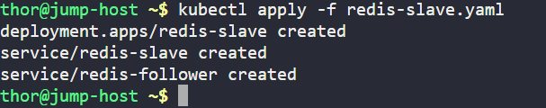
</div>

Observed:

```bash
deployment.apps/redis-slave created
service/redis-slave created
service/redis-follower created
```

<div style="border:1px solid #ccc; padding:10px; border-radius:10px; box-shadow:2px 2px 8px rgba(0,0,0,0.2); display:inline-block;">
  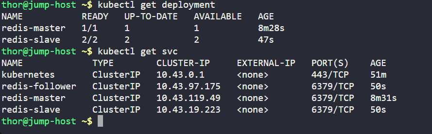
</div>

---

### 4. Created Frontend Deployment and Service

Executed:

```bash
vi frontend.yaml
```
<div style="border:1px solid #ccc; padding:10px; border-radius:10px; box-shadow:2px 2px 8px rgba(0,0,0,0.2); display:inline-block;">
  
</div>

<div style="border:1px solid #ccc; padding:10px; border-radius:10px; box-shadow:2px 2px 8px rgba(0,0,0,0.2); display:inline-block;">
  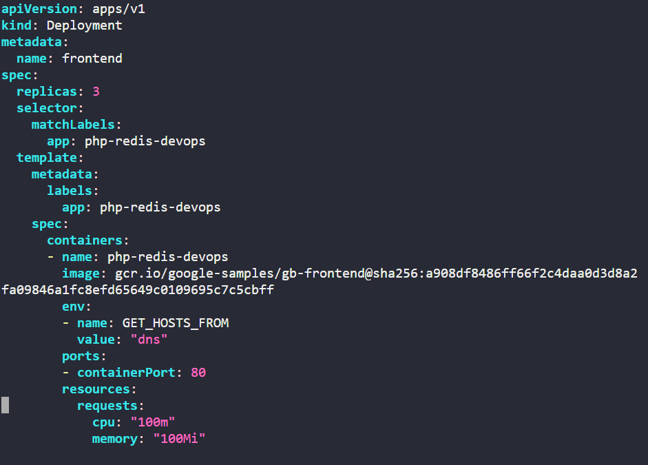
</div>

<div style="border:1px solid #ccc; padding:10px; border-radius:10px; box-shadow:2px 2px 8px rgba(0,0,0,0.2); display:inline-block;">
  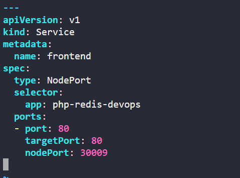
</div>

Added:

```yaml
apiVersion: apps/v1
kind: Deployment

metadata:
  name: frontend

spec:
  replicas: 3

  selector:
    matchLabels:
      app: php-redis-devops

  template:
    metadata:
      labels:
        app: php-redis-devops

    spec:
      containers:
      - name: php-redis-devops

        image: gcr.io/google-samples/gb-frontend@sha256:a908df8486ff66f2c4daa0d3d8a2fa09846a1fc8efd65649c0109695c7c5cbff

        env:
        - name: GET_HOSTS_FROM
          value: "dns"

        ports:
        - containerPort: 80

        resources:
          requests:
            cpu: "100m"
            memory: "100Mi"

---
apiVersion: v1
kind: Service

metadata:
  name: frontend

spec:
  type: NodePort

  selector:
    app: php-redis-devops

  ports:
  - port: 80
    targetPort: 80
    nodePort: 30009
```

Applied configuration:

```bash
kubectl apply -f frontend.yaml
```
<div style="border:1px solid #ccc; padding:10px; border-radius:10px; box-shadow:2px 2px 8px rgba(0,0,0,0.2); display:inline-block;">
  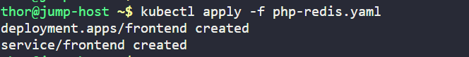
</div>

Observed:

```bash
deployment.apps/frontend created
service/frontend created
```

---

## 🔹 Simple Explanation of the Kubernetes YAML Files

### Deployment Resource

```yaml
kind: Deployment
```

Creates a Kubernetes Deployment resource.

A Deployment manages:

* Pod creation

* Replica scaling

* Rolling updates

* Application availability

---

### Service Resource

```yaml
kind: Service
```

Creates a Kubernetes Service resource.

Services provide:

* Stable networking

* Service discovery

* Internal communication

* External exposure (NodePort)

---

### Replica Configuration

```yaml
replicas: 1
replicas: 2
replicas: 3
```

Controls how many Pod replicas Kubernetes maintains.

Examples:

* Redis Master → 1 replica

* Redis Slave → 2 replicas

* Frontend → 3 replicas

---

### Label Selectors

```yaml
selector:
  matchLabels:
    app: redis-master
```

Used by Kubernetes to associate Deployments with Pods.

Services also use selectors to identify target Pods.

---

### Container Configuration

```yaml
containers:
```

Defines application container specifications.

Examples:

```yaml
name: master-redis-devops
image: redis
```

```yaml
name: slave-redis-devops
image: gcr.io/google_samples/gb-redisslave:v3
```

```yaml
name: php-redis-devops
```

Each deployment defines its own container image and runtime configuration.

---

### Resource Request Configuration

```yaml
resources:
  requests:
    cpu: "100m"
    memory: "100Mi"
```

Requests compute resources for containers.

This ensures Kubernetes reserves:

* 100m CPU

* 100Mi Memory

before scheduling the Pod.

---

### Environment Variable Configuration

```yaml
env:
- name: GET_HOSTS_FROM
  value: "dns"
```

Defines environment variables inside containers.

This tells the application to retrieve backend host information using **DNS-based discovery**.

---

### Port Configuration

```yaml
containerPort: 6379
```

Redis applications use:

**6379/TCP**

Frontend application uses:

```yaml
containerPort: 80
```

HTTP communication occurs through **80/TCP**.

---

### NodePort Service Configuration

```yaml
type: NodePort
```

Exposes the frontend application externally.

```yaml
nodePort: 30009
```

Allows access through:

```txt
<Node-IP>:30009
```

---

### 👉 In simple terms:

This Kubernetes setup tells the cluster to:

* Deploy a Redis master instance

* Deploy Redis slave replicas

* Deploy a scalable frontend application

* Configure internal networking using Services

* Use DNS-based backend discovery

* Reserve CPU and memory resources

* Expose the frontend externally using NodePort

---

### 5. Verified Deployment Status

<div style="border:1px solid #ccc; padding:10px; border-radius:10px; box-shadow:2px 2px 8px rgba(0,0,0,0.2); display:inline-block;">
  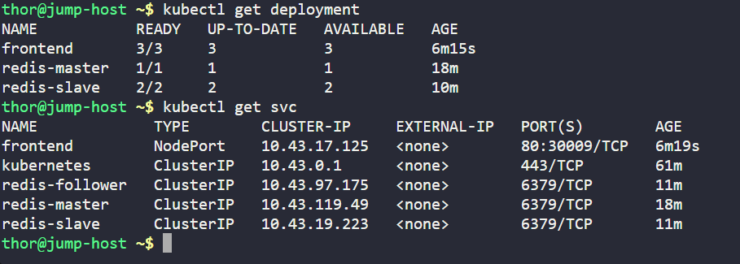
</div>


Executed:

```bash
kubectl get deployment
```

Observed:

```bash
NAME           READY   UP-TO-DATE   AVAILABLE
frontend       3/3     3            3
redis-master   1/1     1            1
redis-slave    2/2     2            2
```

This confirmed:

* Deployments created successfully

* Required replicas available

* Applications healthy

---

### 6. Verified Services

Executed:

```bash
kubectl get svc
```

Observed:

```bash
NAME             TYPE        PORT(S)

frontend         NodePort    80:30009/TCP
redis-master     ClusterIP   6379/TCP
redis-slave      ClusterIP   6379/TCP
redis-follower   ClusterIP   6379/TCP
```

This confirmed all required services were created successfully.

---

### 7. Tested the Guestbook Application

Used the provided **App button / NodePort endpoint**.

<div style="border:1px solid #ccc; padding:10px; border-radius:10px; box-shadow:2px 2px 8px rgba(0,0,0,0.2); display:inline-block;">
  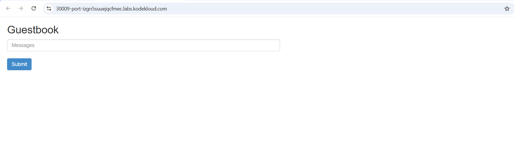
</div>


Observed:

Guestbook application loaded successfully in the browser.

This confirmed:

* Frontend accessible

* Redis backend functioning correctly

* Multi-tier deployment successful

---

## 🔹 My Understanding

This task strengthened my understanding of how Kubernetes Deployments and Services can work together to deploy a **multi-tier application architecture**.


---

## 🔹 What I Found Interesting

I found it interesting how Kubernetes allows multiple application components to communicate internally using **Services, Labels, and DNS**, without requiring hardcoded IP addresses.

Using **NodePort** to expose only the frontend while keeping backend services internal was also a useful real-world deployment pattern.

* * *

### Topics Covered

- ***kubernetes-Deployments***
- ***kubernetes-redis***
- ***kubernetes-image***
- ***kubernetes-pod***
- ***kubernetes-ports***
- ***kubernetes-env***
- ***kubectl***


**Previous Task**: [Day 66: Deploy MySQL on Kubernetes](../Day_66/day_66.md)

**Next Task**: [Day 68: Set Up Jenkins Server](../Day_68/day_68.md)
