# Day 68: Set Up Jenkins Server

<div style="border:1px solid #ccc; padding:10px; border-radius:10px; box-shadow:2px 2px 8px rgba(0,0,0,0.2); display:inline-block;">
  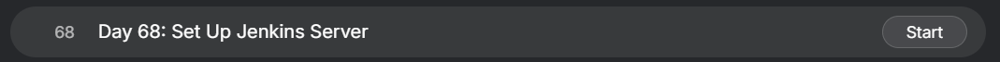
</div>

## Content:

>Today I worked on setting up a complete **Jenkins CI/CD server** for the xFusionCorp DevOps team.

>The objective was to install Jenkins on an Ubuntu server using **APT package management**, properly start the Jenkins service, and complete the initial web-based configuration by creating the required administrator account.

* * *

## 🔹 What I Learned

*   Installing Jenkins on Ubuntu using apt
    
*   Installing Java runtime prerequisites
    
*   Managing Linux services using `service`
    
*   Troubleshooting Jenkins startup issues
    
*   Unlocking Jenkins using initial admin password
    
*   Creating Jenkins administrator accounts
    
*   Performing Jenkins initial configuration
    

* * *

## 🔹 Task Requirement

<div style="border:1px solid #ccc; padding:10px; border-radius:10px; box-shadow:2px 2px 8px rgba(0,0,0,0.2); display:inline-block;">
  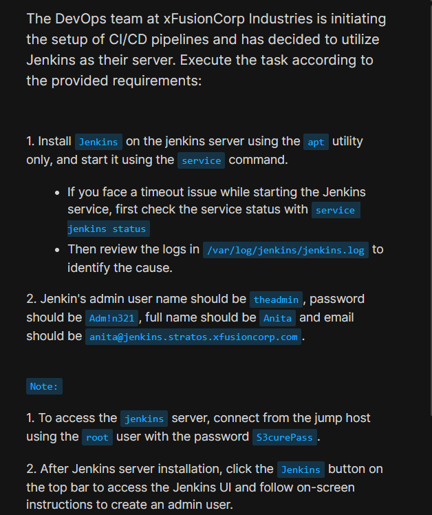
</div>


The xFusionCorp Industries DevOps team required Jenkins server setup with the following specifications.

### Jenkins Installation Requirement

| Requirement | Value |
| --- | --- |
| Server | jenkins |
| Installation Method | apt utility only |
| Service Startup Method | service command |
| Operating System | Ubuntu 24.04 |

### Jenkins Admin User Requirement

| Requirement | Value |
| --- | --- |
| Username | theadmin |
| Password | Adm!n321 |
| Full Name | Anita |
| Email | [anita@jenkins.stratos.xfusioncorp.com](mailto:anita@jenkins.stratos.xfusioncorp.com) |

* * *

## 🔹 Steps I Followed

### 1\. Connected to the Jenkins Server

Connected from the jump host to the Jenkins server.

Executed:

```bash
ssh root@jenkins
```
<div style="border:1px solid #ccc; padding:10px; border-radius:10px; box-shadow:2px 2px 8px rgba(0,0,0,0.2); display:inline-block;">
  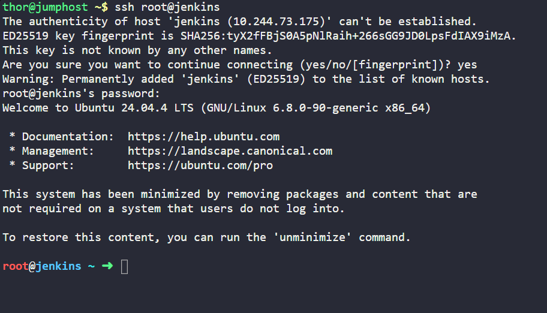
</div>

Accepted the SSH fingerprint:

```text
Are you sure you want to continue connecting (yes/no/[fingerprint])? yes
```

Entered password:

```text
S3curePass
```

Successfully logged in.

* * *

### 2\. Verified Operating System

Executed:

```bash
cat /etc/os-release
```
<div style="border:1px solid #ccc; padding:10px; border-radius:10px; box-shadow:2px 2px 8px rgba(0,0,0,0.2); display:inline-block;">
  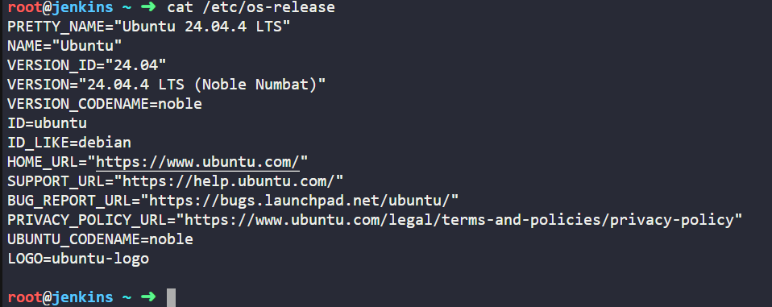
</div>

Observed:

```text
PRETTY_NAME="Ubuntu 24.04.4 LTS"
VERSION_CODENAME=noble
```

This confirmed the Jenkins server was running Ubuntu 24.04.

* * *

### 3\. Updated Package Repository Information

Executed:

```bash
sudo apt update
```
<div style="border:1px solid #ccc; padding:10px; border-radius:10px; box-shadow:2px 2px 8px rgba(0,0,0,0.2); display:inline-block;">
  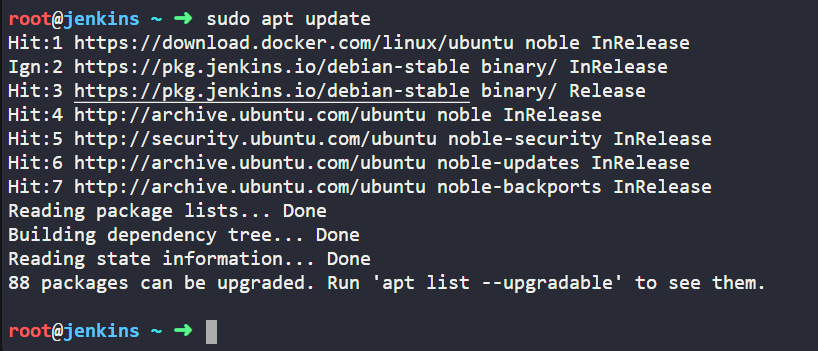
</div>

This refreshed the apt package index before installing dependencies.

* * *

### 4\. Installed Java Prerequisites

Since Jenkins requires Java to run, installed OpenJDK 21.

Executed:

```bash
sudo apt install fontconfig openjdk-21-jre
```
<div style="border:1px solid #ccc; padding:10px; border-radius:10px; box-shadow:2px 2px 8px rgba(0,0,0,0.2); display:inline-block;">
  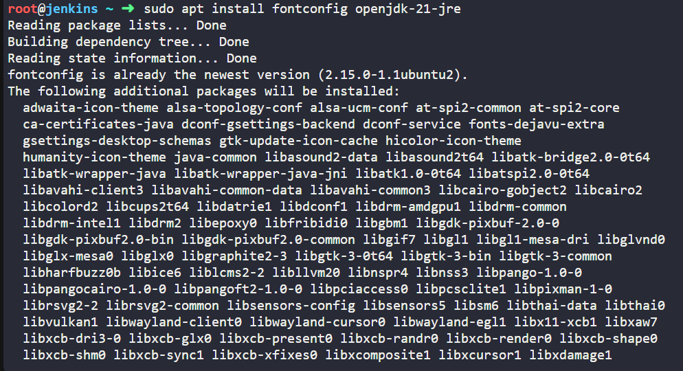
</div>

After installation, verified Java.

Executed:

```bash
java -version
```
<div style="border:1px solid #ccc; padding:10px; border-radius:10px; box-shadow:2px 2px 8px rgba(0,0,0,0.2); display:inline-block;">
  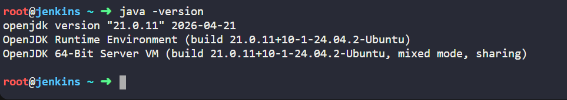
</div>

Observed:

```text
openjdk version "21.0.11"
OpenJDK Runtime Environment
OpenJDK 64-Bit Server VM
```

This confirmed Java was installed successfully.

* * *

### 5\. Added Jenkins Repository Key

Downloaded the Jenkins repository signing key.

Executed:

```bash
sudo wget -O /etc/apt/keyrings/jenkins-keyring.asc \
https://pkg.jenkins.io/debian-stable/jenkins.io-2026.key
```
<div style="border:1px solid #ccc; padding:10px; border-radius:10px; box-shadow:2px 2px 8px rgba(0,0,0,0.2); display:inline-block;">
  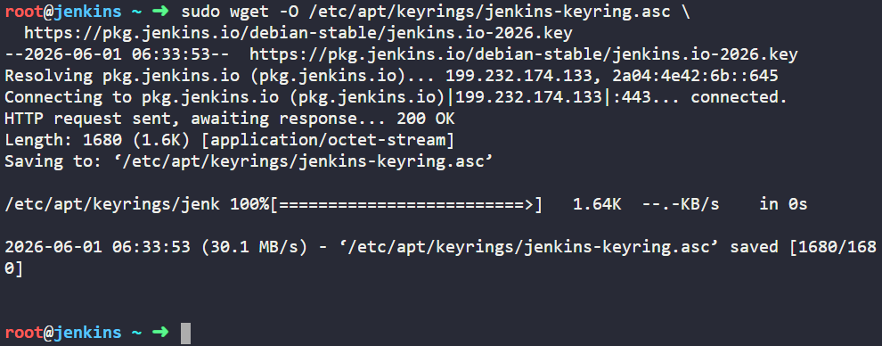
</div>

This added the repository authentication key used by apt.

* * *

### 6\. Added Jenkins Repository

Configured Jenkins apt repository.

Executed:

```bash
echo "deb [signed-by=/etc/apt/keyrings/jenkins-keyring.asc]" \
https://pkg.jenkins.io/debian-stable binary/ | sudo tee \
/etc/apt/sources.list.d/jenkins.list > /dev/null
```
<div style="border:1px solid #ccc; padding:10px; border-radius:10px; box-shadow:2px 2px 8px rgba(0,0,0,0.2); display:inline-block;">
  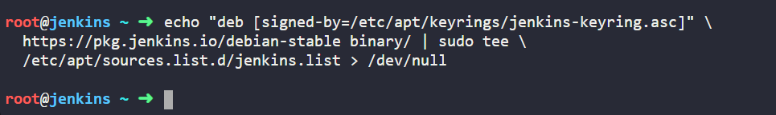
</div>

Updated repositories again.

Executed:

```bash
sudo apt update
```
<div style="border:1px solid #ccc; padding:10px; border-radius:10px; box-shadow:2px 2px 8px rgba(0,0,0,0.2); display:inline-block;">
  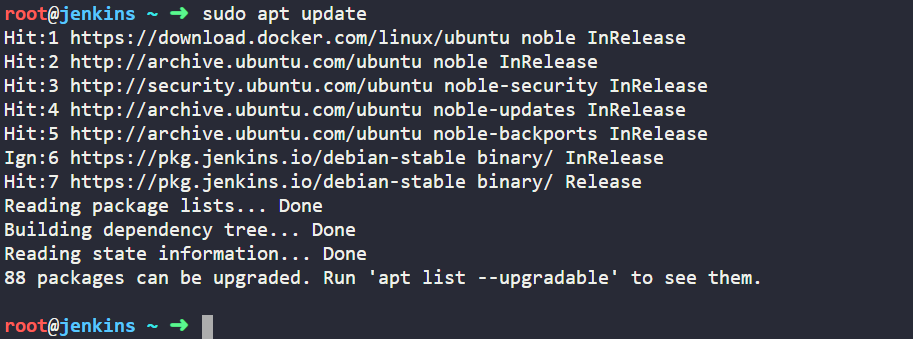
</div>

This allowed apt to detect Jenkins packages.

* * *

### 7\. Installed Jenkins Using apt

Installed Jenkins according to task requirements.

Executed:

```bash
sudo apt install jenkins
```
<div style="border:1px solid #ccc; padding:10px; border-radius:10px; box-shadow:2px 2px 8px rgba(0,0,0,0.2); display:inline-block;">
  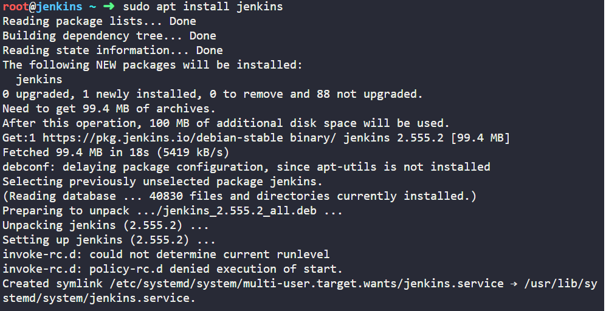
</div>

Observed:

```text
Setting up jenkins (2.555.2)
```

During installation:

```text
policy-rc.d denied execution of start
```

This indicated Jenkins installed successfully but did not automatically start.

* * *

### 8\. Attempted Jenkins Startup

Initially attempted:

```bash
sudo systemctl start jenkins
```
<div style="border:1px solid #ccc; padding:10px; border-radius:10px; box-shadow:2px 2px 8px rgba(0,0,0,0.2); display:inline-block;">
  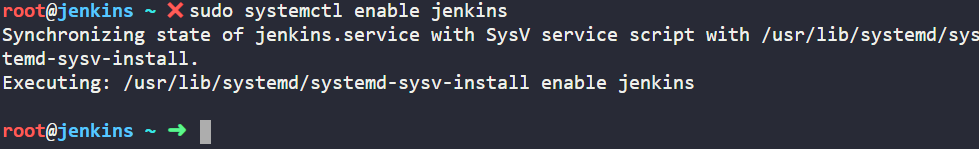
</div>

Observed:

```text
System has not been booted with systemd as init system
Failed to connect to bus
```

This environment did not use systemd.

* * *

### 9\. Verified Jenkins Service Status

Following task instructions, checked Jenkins status.

Executed:

```bash
service jenkins status
```
<div style="border:1px solid #ccc; padding:10px; border-radius:10px; box-shadow:2px 2px 8px rgba(0,0,0,0.2); display:inline-block;">
  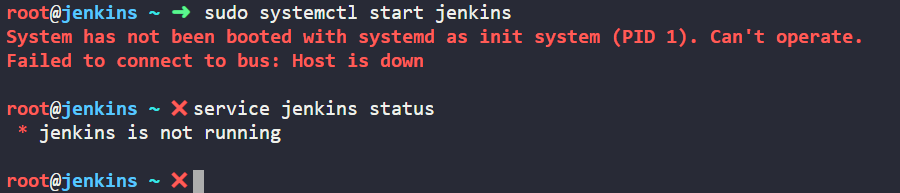
</div>

Observed:

```text
* jenkins is not running
```

* * *

### 10\. Checked Jenkins Logs

Executed:

```bash
cat /var/log/jenkins/jenkins.log
```
<div style="border:1px solid #ccc; padding:10px; border-radius:10px; box-shadow:2px 2px 8px rgba(0,0,0,0.2); display:inline-block;">
  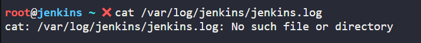
</div>

Observed:

```text
No such file or directory
```

The log file had not yet been created because Jenkins had not started.

* * *

### 11\. Started Jenkins Using Service Command

Started Jenkins using the required service command.

<div style="border:1px solid #ccc; padding:10px; border-radius:10px; box-shadow:2px 2px 8px rgba(0,0,0,0.2); display:inline-block;">
  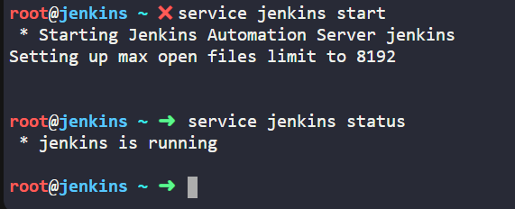
</div>

Executed:

```bash
service jenkins start
```

Observed:

```text
* Starting Jenkins Automation Server jenkins
[ OK ]
```

Verified status again.

Executed:

```bash
service jenkins status
```

Observed:

```text
* jenkins is running
```

This confirmed Jenkins was successfully running.

* * *

### 12\. Reviewed Jenkins Startup Logs

Executed:

```bash
tail -50 /var/log/jenkins/jenkins.log
```
<div style="border:1px solid #ccc; padding:10px; border-radius:10px; box-shadow:2px 2px 8px rgba(0,0,0,0.2); display:inline-block;">
  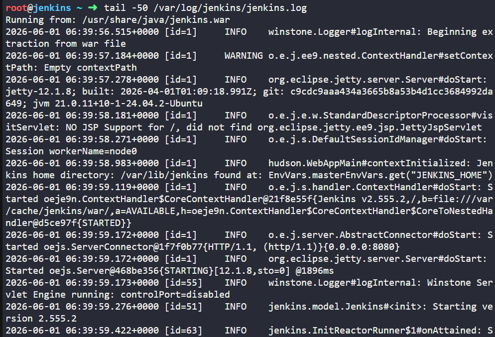
</div>

Observed important startup information:

*   Jenkins WAR extracted
    
*   Jetty server started
    
*   Jenkins listening on port 8080
    
*   Initialization completed successfully
    

The logs also displayed the initial admin unlock password location.

* * *

### 13\. Retrieved Initial Jenkins Password

Executed:

```bash
cat /var/lib/jenkins/secrets/initialAdminPassword
```
<div style="border:1px solid #ccc; padding:10px; border-radius:10px; box-shadow:2px 2px 8px rgba(0,0,0,0.2); display:inline-block;">
  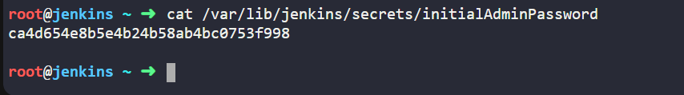
</div>

Observed:

```text
ca4d654e8b5e4b24b58ab4bc0753f998
```

This password is required to unlock Jenkins during first-time setup.

* * *

### 14\. Accessed Jenkins Web Interface

Clicked the **Jenkins** button from the lab interface.

Reached:

```text
Unlock Jenkins
```
<div style="border:1px solid #ccc; padding:10px; border-radius:10px; box-shadow:2px 2px 8px rgba(0,0,0,0.2); display:inline-block;">
  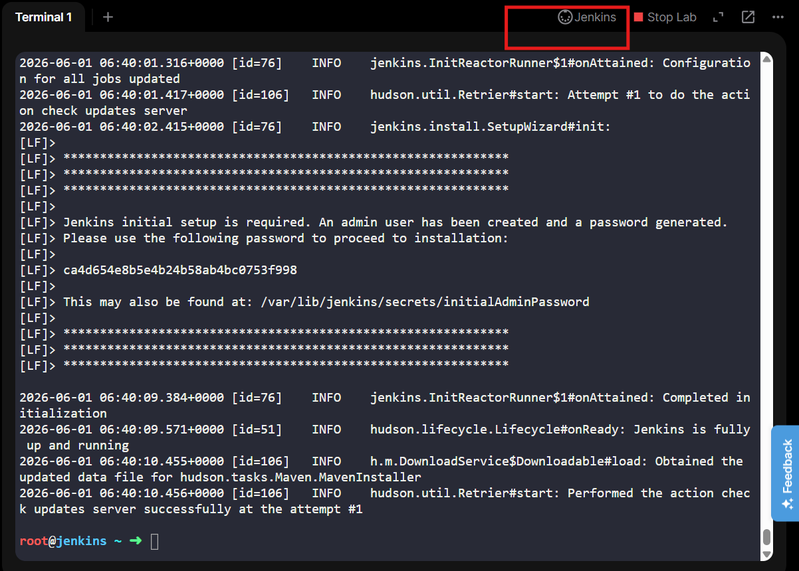
</div>

<div style="border:1px solid #ccc; padding:10px; border-radius:10px; box-shadow:2px 2px 8px rgba(0,0,0,0.2); display:inline-block;">
  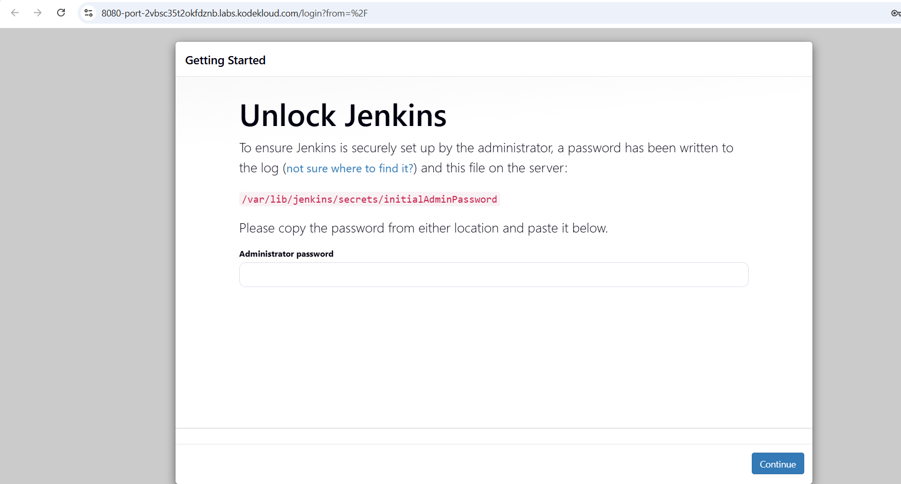
</div>

<div style="border:1px solid #ccc; padding:10px; border-radius:10px; box-shadow:2px 2px 8px rgba(0,0,0,0.2); display:inline-block;">
  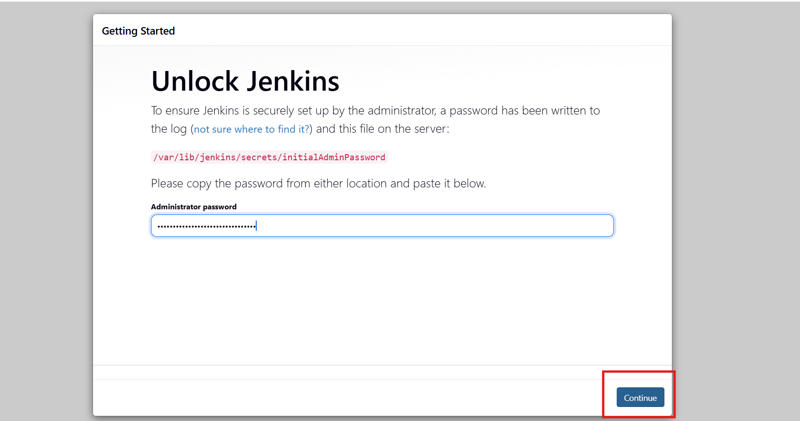
</div>
Entered the retrieved administrator password.

Selected:

```text
Install suggested plugins
```

<div style="border:1px solid #ccc; padding:10px; border-radius:10px; box-shadow:2px 2px 8px rgba(0,0,0,0.2); display:inline-block;">
  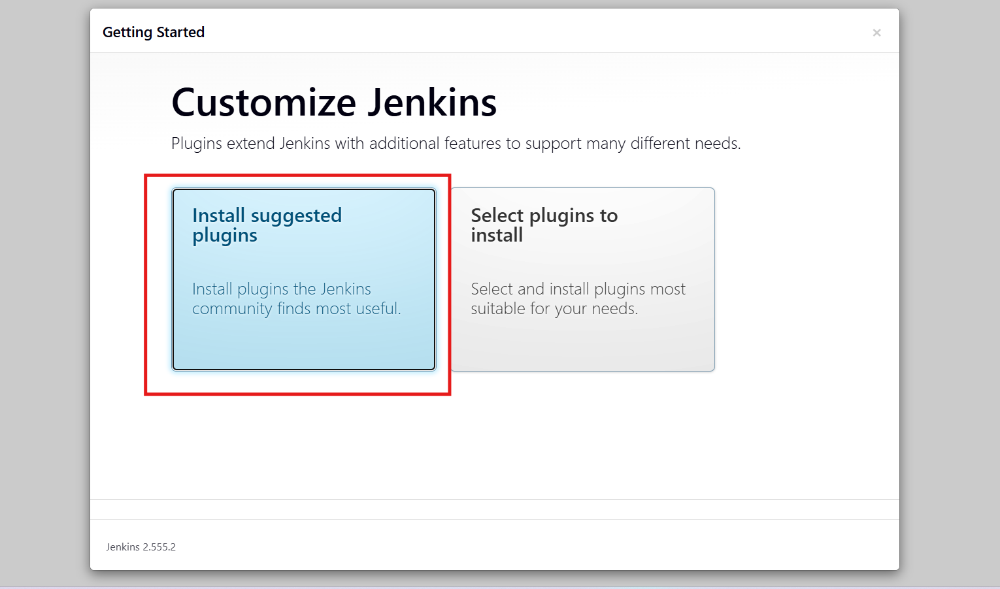
</div>

<div style="border:1px solid #ccc; padding:10px; border-radius:10px; box-shadow:2px 2px 8px rgba(0,0,0,0.2); display:inline-block;">
  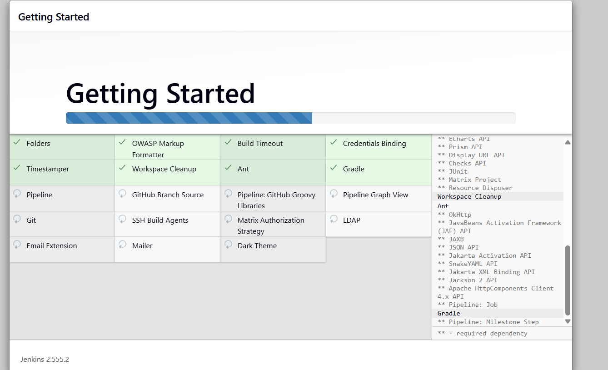
</div>

Jenkins automatically installed the default plugin set.

* * *

### 15\. Created Jenkins Admin User

<div style="border:1px solid #ccc; padding:10px; border-radius:10px; box-shadow:2px 2px 8px rgba(0,0,0,0.2); display:inline-block;">
  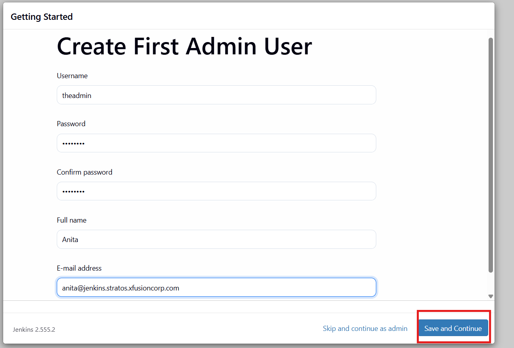
</div>

Created the administrator account according to task requirements.

Entered:

Username:

```text
theadmin
```

Password:

```text
Adm!n321
```

Full Name:

```text
Anita
```

Email:

```text
anita@jenkins.stratos.xfusioncorp.com
```

Saved configuration and completed setup.
<div style="border:1px solid #ccc; padding:10px; border-radius:10px; box-shadow:2px 2px 8px rgba(0,0,0,0.2); display:inline-block;">
  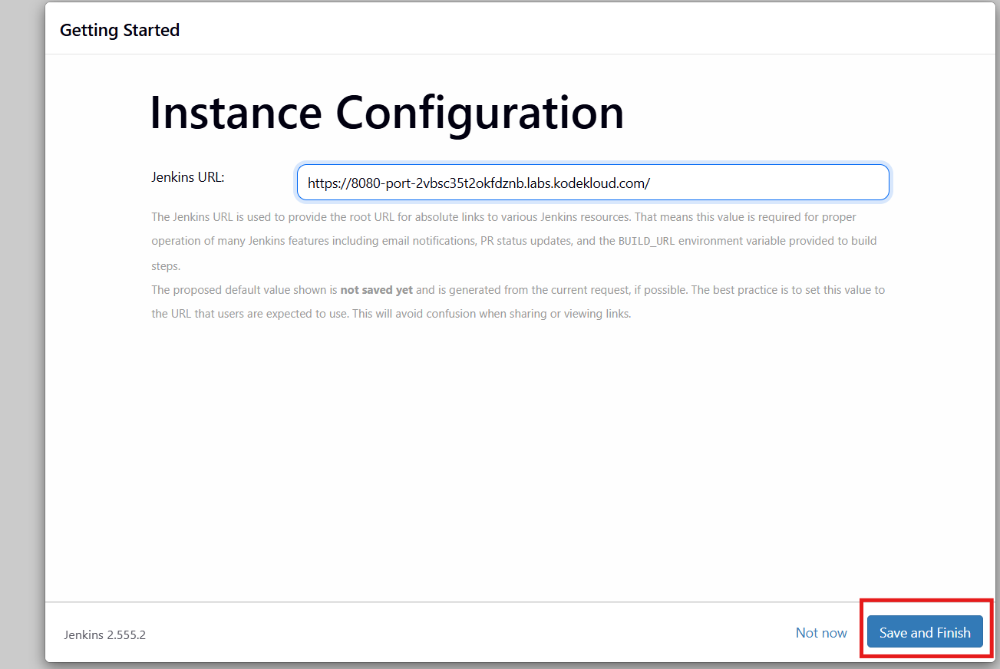
</div>

* * *

### 16\. Completed Jenkins Configuration

Reached the Jenkins dashboard successfully.

<div style="border:1px solid #ccc; padding:10px; border-radius:10px; box-shadow:2px 2px 8px rgba(0,0,0,0.2); display:inline-block;">
  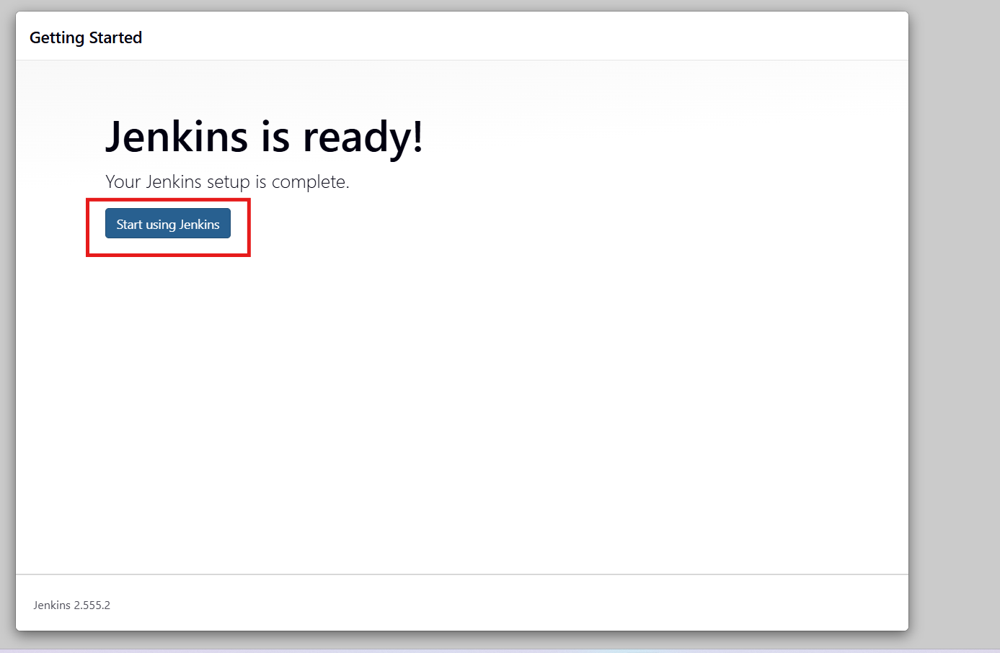
</div>

<div style="border:1px solid #ccc; padding:10px; border-radius:10px; box-shadow:2px 2px 8px rgba(0,0,0,0.2); display:inline-block;">
  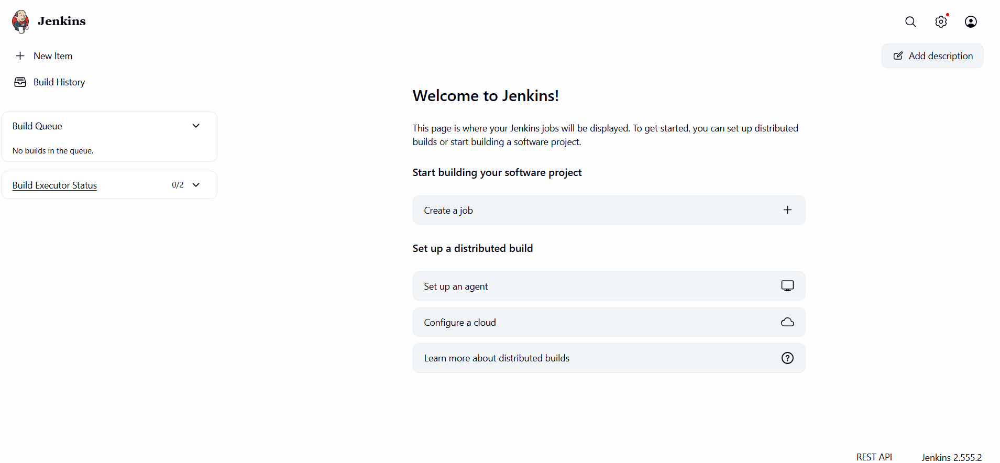
</div>

Observed:

```text
Manage Jenkins
Anita
New Item
Build History
Build Queue
Jenkins 2.555.2
```

This confirmed:

*   Jenkins installed successfully
    
*   Jenkins service running
    
*   Plugins installed
    
*   Admin user created successfully
    
*   Jenkins web interface operational
    

* * *

## 🔹 Simple Explanation of the Jenkins Setup Process

### Java Installation

```bash
sudo apt install openjdk-21-jre
```

Jenkins is a Java application.

Therefore, Java Runtime Environment (JRE) must be installed before Jenkins can run.

* * *

### Repository Key Configuration

```bash
wget -O /etc/apt/keyrings/jenkins-keyring.asc
```

APT repositories use GPG keys to verify package authenticity.

Adding the Jenkins key allows Ubuntu to trust Jenkins packages.

* * *

### Repository Configuration

```bash
/etc/apt/sources.list.d/jenkins.list
```

This file tells apt where Jenkins packages are hosted.

Without this step, Ubuntu would not know how to download Jenkins.

* * *

### Jenkins Installation

```bash
sudo apt install jenkins
```

This installs:

*   Jenkins application
    
*   Jenkins service files
    
*   Jenkins runtime configuration
    

* * *

### Service Management

```bash
service jenkins start
```

Linux services run background applications.

The `service` command was used because the environment did not support systemd.

* * *

### Log Inspection

```bash
/var/log/jenkins/jenkins.log
```

Jenkins logs help diagnose:

*   startup failures
    
*   plugin issues
    
*   port conflicts
    
*   configuration errors
    

* * *

### Initial Admin Password

```bash
/var/lib/jenkins/secrets/initialAdminPassword
```

For security, Jenkins generates a temporary unlock password during first startup.

This password must be entered before accessing the UI.

* * *

### Plugin Installation

```text
Install suggested plugins
```

Jenkins plugins extend functionality such as:

*   Pipeline support
    
*   Git integration
    
*   Build tools
    
*   Notifications
    
*   Authentication
    

* * *

### Administrator Account Creation

Creating a dedicated admin account allows secure Jenkins management.

Configured account:

*   Username: theadmin
    
*   Password: Adm!n321
    
*   Full Name: Anita
    
*   Email: [anita@jenkins.stratos.xfusioncorp.com](mailto:anita@jenkins.stratos.xfusioncorp.com)
    

* * *

👉 In simple terms:

This setup process tells Ubuntu to:

*   Install Java runtime
    
*   Configure Jenkins repositories
    
*   Install Jenkins using apt
    
*   Start Jenkins as a Linux service
    
*   Verify server logs
    
*   Unlock Jenkins securely
    
*   Install required plugins
    
*   Create an administrator account
    
*   Prepare Jenkins for CI/CD operations
    

* * *

## 5\. Verified Jenkins Service Status

Executed:

```bash
service jenkins status
```

Observed:

```text
* jenkins is running
```

This confirmed Jenkins service availability.

* * *

## 6\. Verified Jenkins Dashboard

Opened Jenkins UI after setup.

Observed:

```text
Welcome to Jenkins!
```

This confirmed:

*   Web interface accessible
    
*   Authentication configured
    
*   Jenkins fully operational
    

* * *

## 🔹 My Understanding

This task strengthened my understanding of Jenkins installation and initial server configuration on Linux environments.

I learned how Jenkins depends on Java, how external repositories are configured in Ubuntu, and how service management and log inspection help troubleshoot server startup issues.

* * *

## 🔹 What I Found Interesting

I found it interesting how Jenkins uses a temporary unlock mechanism through the **initialAdminPassword** file to secure first-time setup.

I also found it useful to troubleshoot startup behavior by checking service status and logs before retrying service startup.


* * *

### Topics Covered

- ***Jenkins***
- ***Jenkins-server***
- ***Jenkins-installation***
- ***java***


**Previous Task**: [Day 67: Deploy Guest Book App on Kubernetes](../Day_67/day_67.md)

**Next Task**: [Day 69: Install Jenkins Plugins](../Day_69/day_69.md)
