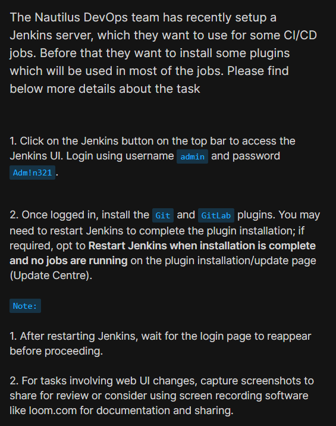
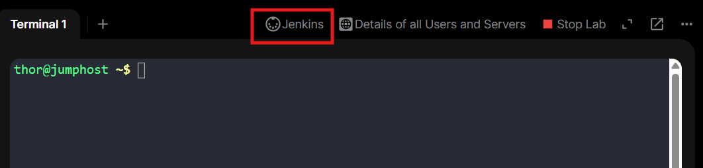
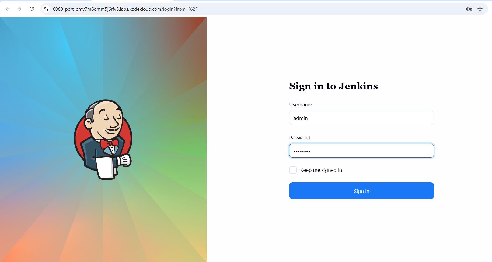
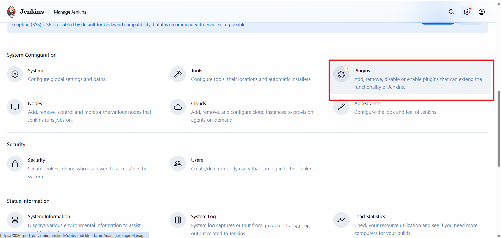
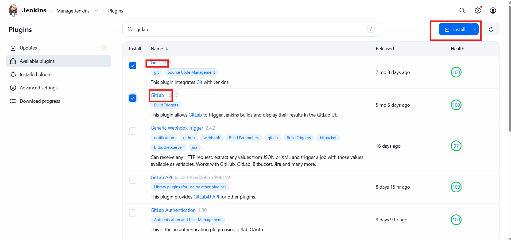
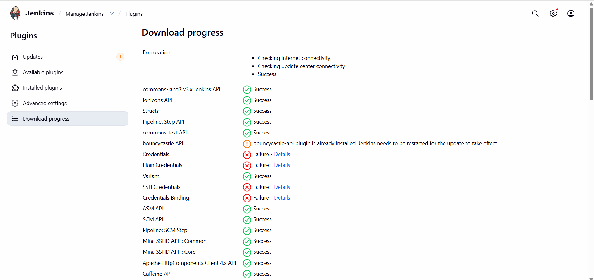
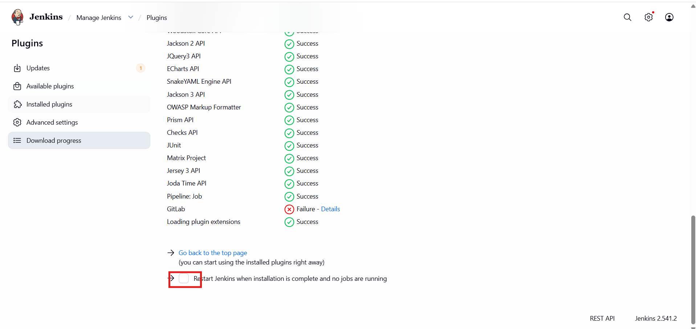
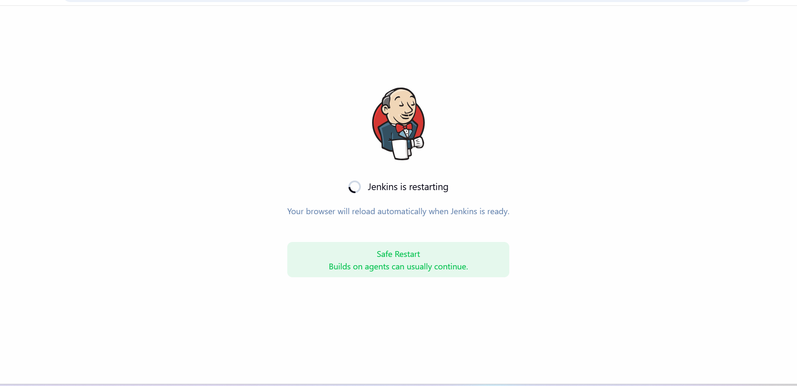
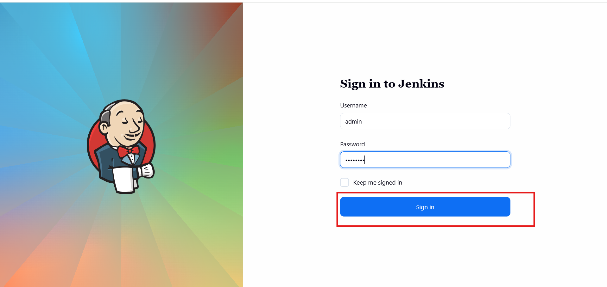
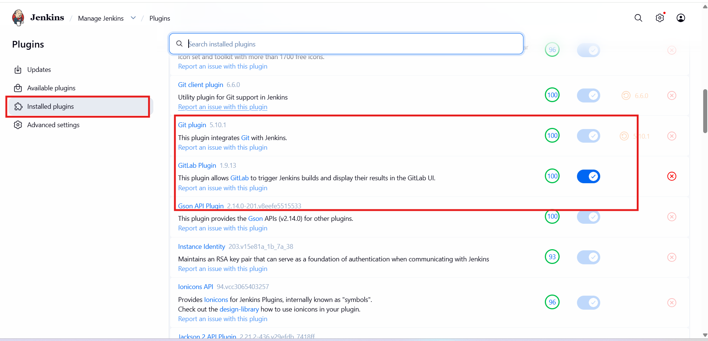

# Day 69: Install Jenkins Plugins

<div style="border:1px solid #ccc; padding:10px; border-radius:10px; box-shadow:2px 2px 8px rgba(0,0,0,0.2); display:inline-block;">
  
</div>

## Content:

> Today I worked on installing required **Jenkins plugins** for the Nautilus DevOps team.

> The objective was to access the Jenkins web interface, authenticate using administrator credentials, install the **Git** and **GitLab** plugins, and verify successful plugin installation after restarting Jenkins.

* * *

## 🔹 What I Learned

*   Installing plugins from Jenkins Update Center
    
*   Managing Jenkins plugins through the web UI
    
*   Understanding plugin dependencies
    
*   Handling plugin installation warnings/failures
    
*   Restarting Jenkins after plugin installation
    
*   Verifying installed plugins
    
*   Extending Jenkins functionality using plugins
    

* * *

## 🔹 Task Requirement

<div style="border:1px solid #ccc; padding:10px; border-radius:10px; box-shadow:2px 2px 8px rgba(0,0,0,0.2); display:inline-block;">
  
</div>

The Nautilus DevOps team required installation of Jenkins plugins with the following specifications.

### Jenkins Access Requirement

| Requirement | Value |
| --- | --- |
| Username | admin |
| Password | Adm!n321 |
| Access Method | Jenkins Web UI |

### Plugin Installation Requirement

| Plugin | Purpose |
| --- | --- |
| Git | Git repository integration |
| GitLab | GitLab integration with Jenkins |

* * *

## 🔹 Steps I Followed

### 1\. Accessed Jenkins Web Interface

Clicked the **Jenkins** button from the lab top navigation bar.

Reached the Jenkins login page successfully.

<div style="border:1px solid #ccc; padding:10px; border-radius:10px; box-shadow:2px 2px 8px rgba(0,0,0,0.2); display:inline-block;">
  
</div>

* * *

### 2\. Logged into Jenkins

Entered administrator credentials.

<div style="border:1px solid #ccc; padding:10px; border-radius:10px; box-shadow:2px 2px 8px rgba(0,0,0,0.2); display:inline-block;">
  
</div>

Username:

```text
admin
```

Password:

```text
Adm!n321
```

Successfully logged into the Jenkins dashboard.

Observed:

```text
Manage Jenkins
Dashboard
Build Queue
Build History
```

* * *

### 3\. Opened Plugin Management Section

Navigated to:

```text
Manage Jenkins → Plugins
```
<div style="border:1px solid #ccc; padding:10px; border-radius:10px; box-shadow:2px 2px 8px rgba(0,0,0,0.2); display:inline-block;">
  
</div>

(Depending on Jenkins version, this may appear as **Manage Plugins**.)

Reached the Jenkins plugin management interface.

<div style="border:1px solid #ccc; padding:10px; border-radius:10px; box-shadow:2px 2px 8px rgba(0,0,0,0.2); display:inline-block;">
  
</div>

Observed plugin tabs such as:

```text
Updates
Available plugins
Installed
Advanced settings
```

* * *

### 4\. Searched for Git Plugin

Opened the **Available plugins** tab.

Used the search bar and searched:

```text
Git
```

Located the **Git plugin** from the plugin catalog.

Selected the plugin for installation.

* * *

### 5\. Searched for GitLab Plugin

Searched for:

```text
GitLab
```

Located the **GitLab plugin**.

Selected it for installation.

Jenkins automatically prepared dependency installation if required.

<div style="border:1px solid #ccc; padding:10px; border-radius:10px; box-shadow:2px 2px 8px rgba(0,0,0,0.2); display:inline-block;">
  
</div>

* * *

### 6\. Started Plugin Installation

Clicked:

```text
Install
```

(or **Install without restart**, depending on interface version).

Observed Jenkins downloading and installing required plugin files.

During installation, some warnings/failure messages appeared related to plugin processing/dependencies.

<div style="border:1px solid #ccc; padding:10px; border-radius:10px; box-shadow:2px 2px 8px rgba(0,0,0,0.2); display:inline-block;">
  
</div>

However, installation continued.

* * *

### 7\. Restarted Jenkins

Since plugin installation required restart, selected:

```text
Restart Jenkins when installation is complete and no jobs are running
```

<div style="border:1px solid #ccc; padding:10px; border-radius:10px; box-shadow:2px 2px 8px rgba(0,0,0,0.2); display:inline-block;">
  
</div>

Jenkins initiated restart.

Waited for Jenkins shutdown and startup cycle to complete.

* * *

### 8\. Waited for Jenkins Login Page

After restart, waited until the Jenkins login page became available again.

<div style="border:1px solid #ccc; padding:10px; border-radius:10px; box-shadow:2px 2px 8px rgba(0,0,0,0.2); display:inline-block;">
  
</div>

This confirmed Jenkins services had restarted successfully.

* * *

### 9\. Logged in Again After Restart

Used administrator credentials again.

Username:

```text
admin
```

Password:

```text
Adm!n321
```

Successfully accessed the Jenkins dashboard.

<div style="border:1px solid #ccc; padding:10px; border-radius:10px; box-shadow:2px 2px 8px rgba(0,0,0,0.2); display:inline-block;">
  
</div>

* * *

### 10\. Verified Installed Plugins

Navigated to:

```text
Manage Jenkins → Plugins → Installed
```

Searched for:

```text
Git
GitLab
```

<div style="border:1px solid #ccc; padding:10px; border-radius:10px; box-shadow:2px 2px 8px rgba(0,0,0,0.2); display:inline-block;">
  
</div>

Observed both plugins listed under installed plugins.

This confirmed:

*   Git plugin installed successfully
    
*   GitLab plugin installed successfully
    
*   Jenkins restart completed successfully
    
*   Plugin functionality available for future CI/CD jobs
    

* * *

## 🔹 Simple Explanation of the Plugin Installation Process

### Jenkins Plugin Management

```text
Manage Jenkins → Plugins
```

Jenkins uses a plugin system to extend core functionality.

Plugins allow Jenkins to support:

*   source control systems
    
*   build tools
    
*   notifications
    
*   authentication providers
    
*   deployment integrations
    

* * *

### Git Plugin

```text
Git Plugin
```

The Git plugin allows Jenkins to:

*   clone repositories
    
*   pull source code
    
*   manage branches
    
*   trigger builds from Git repositories
    

Without this plugin, Jenkins cannot easily integrate with Git-based workflows.

* * *

### GitLab Plugin

```text
GitLab Plugin
```

The GitLab plugin enables Jenkins integration with GitLab environments.

It provides features such as:

*   GitLab webhook triggers
    
*   merge request integration
    
*   build status updates
    
*   CI/CD workflow support
    

* * *

### Plugin Dependencies

Some plugins depend on other supporting plugins.

During installation, Jenkins may automatically download:

```text
dependency plugins
```

This is normal behavior.

Temporary warnings or failures can appear during dependency resolution.

* * *

### Jenkins Restart

```text
Restart Jenkins when installation is complete
```

Some plugins require Jenkins restart to:

*   load new components
    
*   initialize integrations
    
*   activate plugin functionality
    

After restart, Jenkins reloads installed plugins.

* * *

### Plugin Verification

```text
Installed Plugins
```

The final verification step ensures plugins are:

*   installed
    
*   enabled
    
*   recognized by Jenkins
    
*   ready for use
    

* * *

👉 In simple terms:

This task tells Jenkins to:

*   authenticate administrator access
    
*   open plugin management
    
*   install Git support
    
*   install GitLab support
    
*   process plugin dependencies
    
*   restart Jenkins
    
*   reload plugin configurations
    
*   verify successful installation
    

* * *

## 🔹 My Understanding

This task strengthened my understanding of how Jenkins functionality is extended using plugins.

I learned how plugins are installed through the Jenkins Update Center, how dependencies are managed automatically, and why Jenkins sometimes requires a restart after plugin installation.


* * *

## 🔹 What I Found Interesting

I found it interesting how Jenkins uses a modular plugin architecture where core functionality can be extended without modifying the main server installation.

I also found it useful to observe that plugin dependencies and restart behavior play an important role in activating newly installed Jenkins features.

* * *

### Topics Covered

- ***Jenkins***
- ***Jenkins-server***
- ***Jenkins-plugins***


**Previous Task**: [Day 68: Set Up Jenkins Server](../Day_68/day_68.md)

**Next Task**: [Day 70: Configure Jenkins User Access](../Day_70/day_70.md)
