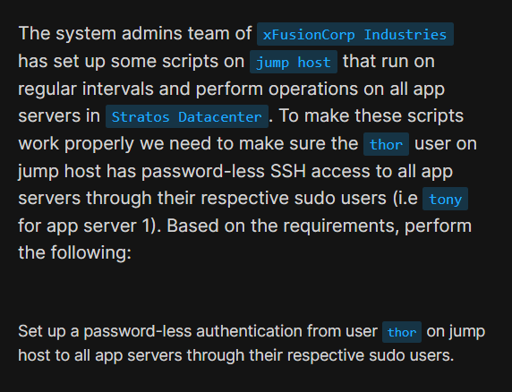
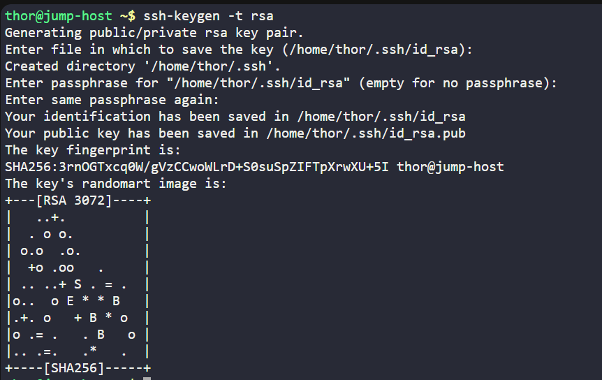
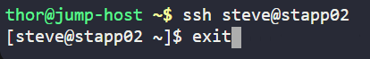
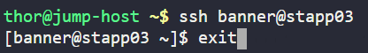

# Day 7: Linux SSH Authentication

<div style="border:1px solid #ccc; padding:10px; border-radius:10px; box-shadow:2px 2px 8px rgba(0,0,0,0.2); display:inline-block;">
  
</div>

## **Content:**

> Today I worked on setting up password-less SSH authentication between a jump host and multiple application servers as part of my DevOps journey.
>
> This is a crucial setup for automation, allowing scripts to run across servers without manual password entry—something widely used in real-world DevOps environments.

---

## **What I Learned**

Through this task, I gained hands-on experience with SSH authentication and understood:

* How SSH key-based authentication works
* The difference between private and public keys
* How to generate SSH keys using `ssh-keygen`
* How to securely copy keys using `ssh-copy-id`
* Why password-less SSH is important for automation

---

<div style="border:1px solid #ccc; padding:10px; border-radius:10px; box-shadow:2px 2px 8px rgba(0,0,0,0.2); display:inline-block;">
  
</div>

## **Steps I Followed :**

### **1. Generated SSH key pair**

```plaintext
ssh-keygen -t rsa
```
<div style="border:1px solid #ccc; padding:10px; border-radius:10px; box-shadow:2px 2px 8px rgba(0,0,0,0.2); display:inline-block;">
  
</div>

* Pressed Enter for default file location
* Left passphrase empty for automation

This created:

* Private key → `~/.ssh/id_rsa`
* Public key → `~/.ssh/id_rsa.pub`

---

### **3. Copied public key to App Server**

```plaintext
ssh-copy-id tony@app-server-1
```
<div style="border:1px solid #ccc; padding:10px; border-radius:10px; box-shadow:2px 2px 8px rgba(0,0,0,0.2); display:inline-block;">
  
</div>


* Entered password once
* Public key was added to:

```plaintext
/home/tony/.ssh/authorized_keys
```

---

### **4. Tested password-less SSH login**

```plaintext
ssh tony@app-server-1
```
<div style="border:1px solid #ccc; padding:10px; border-radius:10px; box-shadow:2px 2px 8px rgba(0,0,0,0.2); display:inline-block;">
  
</div>

Login was successful without asking for a password.

---

### **5. Repeated for all app servers**

Performed the same steps for other servers using their respective sudo users.

<div style="border:1px solid #ccc; padding:10px; border-radius:10px; box-shadow:2px 2px 8px rgba(0,0,0,0.2); display:inline-block;">
  
</div>

<div style="border:1px solid #ccc; padding:10px; border-radius:10px; box-shadow:2px 2px 8px rgba(0,0,0,0.2); display:inline-block;">
  
</div>

<div style="border:1px solid #ccc; padding:10px; border-radius:10px; box-shadow:2px 2px 8px rgba(0,0,0,0.2); display:inline-block;">
  
</div>

<div style="border:1px solid #ccc; padding:10px; border-radius:10px; box-shadow:2px 2px 8px rgba(0,0,0,0.2); display:inline-block;">
  
</div>


---

## **My Understanding**

SSH key-based authentication works using a pair of cryptographic keys:

* **Private Key** (kept securely on the client/jump host)
* **Public Key** (shared with remote servers)

When connecting:

1. The server checks the public key in `authorized_keys`
2. It verifies the matching private key from the client
3. If matched, access is granted without a password

This method is more secure and efficient than password-based login.

---

## **What I Found Interesting**

What I found most interesting was how **authentication can happen without passwords**, yet still remain secure using cryptography.

It was also fascinating to see how this setup enables **automation across multiple servers**, which is essential in DevOps for tasks like deployments, monitoring, and backups.

A simple setup like this can eliminate repetitive manual work and make systems much more scalable and efficient 


### Topics Covered

- ***SSH key-based authentication***
- ***Password-less SSH setup***

**Previous Task**: [# Day 6: Create a Cron Job](../Day_6/day_6.md)

**Next Task**: [Day 8: Install Ansible](../Day_8/day_8.md)
