# Day 71: Configure Jenkins Job for Package Installation

<div style="border:1px solid #ccc; padding:10px; border-radius:10px; box-shadow:2px 2px 8px rgba(0,0,0,0.2); display:inline-block;">
  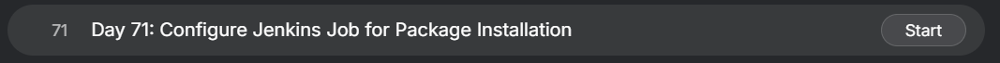
</div>

## Content

>Today I worked on creating and configuring a Jenkins job that automates package installation on a remote server using SSH.

>The objective was to create a parameterized Jenkins job that accepts a package name as input and installs that package on the Nautilus Storage Server. This task demonstrated how Jenkins can be used to automate server administration tasks and execute commands remotely through SSH.

---

## 🔹 What I Learned

* Creating Jenkins Freestyle Jobs
* Using Build Parameters in Jenkins
* Configuring SSH-based remote execution
* Managing Jenkins Credentials securely
* Installing and configuring Jenkins plugins
* Executing commands on remote Linux servers
* Automating package installation using Jenkins

---

## 🔹 Task Requirement

<div style="border:1px solid #ccc; padding:10px; border-radius:10px; box-shadow:2px 2px 8px rgba(0,0,0,0.2); display:inline-block;">
  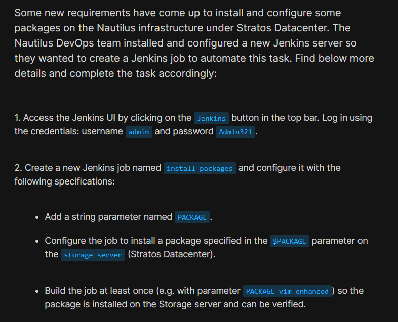
</div>

<div style="border:1px solid #ccc; padding:10px; border-radius:10px; box-shadow:2px 2px 8px rgba(0,0,0,0.2); display:inline-block;">
  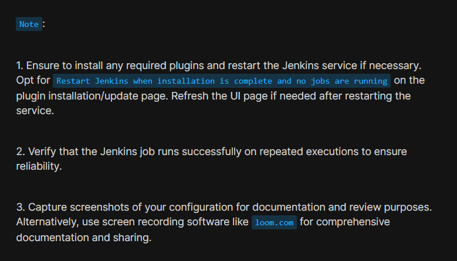
</div>

The Nautilus DevOps team installed a new Jenkins server and wanted to automate package installation on the Storage Server.

### Jenkins Access Details

| Field    | Value    |
| -------- | -------- |
| Username | admin    |
| Password | Adm!n321 |

### Job Requirement

| Requirement    | Value                                          |
| -------------- | ---------------------------------------------- |
| Job Name       | install-packages                               |
| Parameter Type | String Parameter                               |
| Parameter Name | PACKAGE                                        |
| Target Server  | Storage Server (ststor01)                      |
| Purpose        | Install package specified in PACKAGE parameter |

### Storage Server Details

| Server         | Hostname | Username | Password |
| -------------- | -------- | -------- | -------- |
| Storage Server | ststor01 | natasha  | Bl@kW    |

---

## 🔹 Steps I Followed

### 1. Accessed Jenkins Web Interface

Clicked the Jenkins button available in the lab's top navigation bar.

Successfully reached the Jenkins login page.
<div style="border:1px solid #ccc; padding:10px; border-radius:10px; box-shadow:2px 2px 8px rgba(0,0,0,0.2); display:inline-block;">
  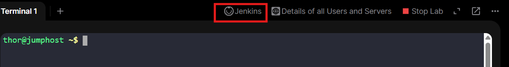
</div>

---

### 2. Logged into Jenkins

Entered administrator credentials.

**Username:**

```text
admin
```

**Password:**

```text
Adm!n321
```
<div style="border:1px solid #ccc; padding:10px; border-radius:10px; box-shadow:2px 2px 8px rgba(0,0,0,0.2); display:inline-block;">
  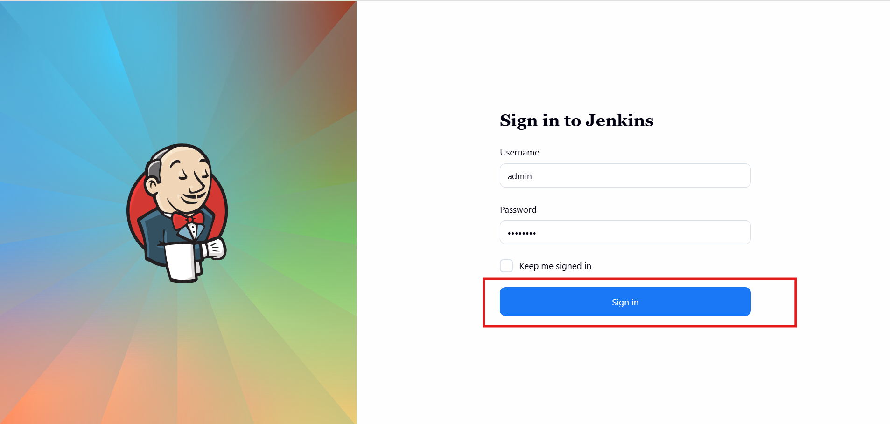
</div>


Successfully logged into the Jenkins Dashboard.

---

### 3. Installed Required Plugins

Navigated to:

```text
Manage Jenkins → Plugins → Available Plugins
```

Installed the following plugins:

* SSH
* SSH Credentials
* SSH Build Agent

<div style="border:1px solid #ccc; padding:10px; border-radius:10px; box-shadow:2px 2px 8px rgba(0,0,0,0.2); display:inline-block;">
  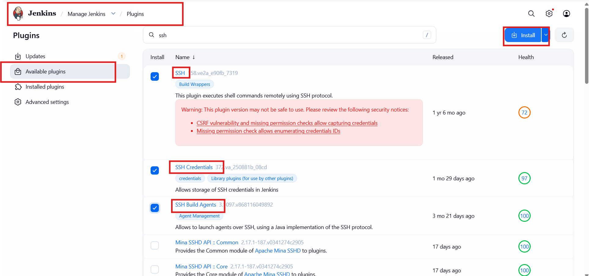
</div>

<div style="border:1px solid #ccc; padding:10px; border-radius:10px; box-shadow:2px 2px 8px rgba(0,0,0,0.2); display:inline-block;">
  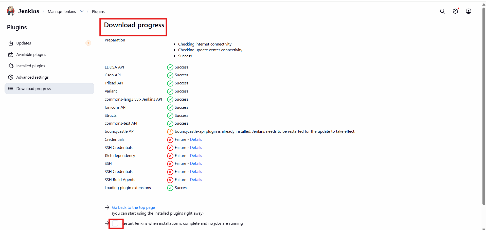
</div>


After installation:

* Selected **Restart Jenkins when installation is complete and no jobs are running**
* Waited for Jenkins to restart

<div style="border:1px solid #ccc; padding:10px; border-radius:10px; box-shadow:2px 2px 8px rgba(0,0,0,0.2); display:inline-block;">
  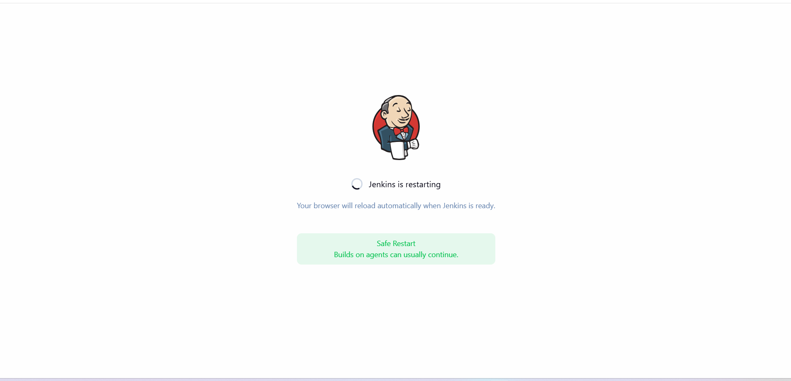
</div>

* Logged in again using administrator credentials

<div style="border:1px solid #ccc; padding:10px; border-radius:10px; box-shadow:2px 2px 8px rgba(0,0,0,0.2); display:inline-block;">
  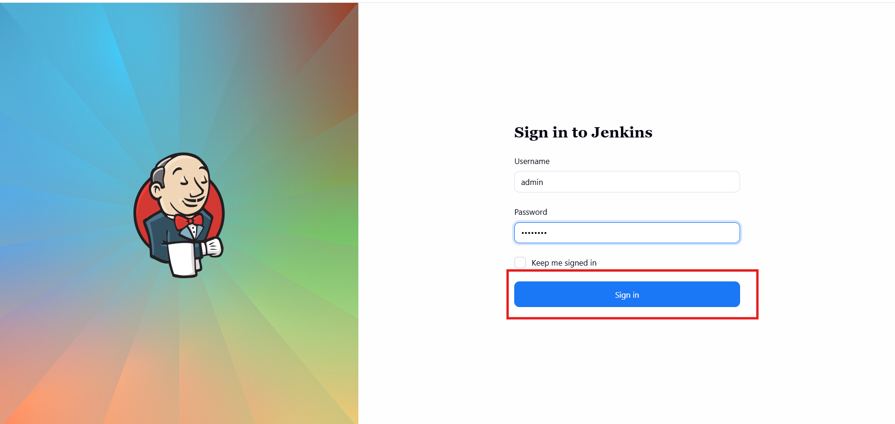
</div>


These plugins enable Jenkins to connect and execute commands on remote servers through SSH.

---

### 4. Identified Storage Server Details

Opened the lab details page and located the Storage Server information.

Found:

```text
Hostname: ststor01
Username: natasha
Password: Bl@kW
```
<div style="border:1px solid #ccc; padding:10px; border-radius:10px; box-shadow:2px 2px 8px rgba(0,0,0,0.2); display:inline-block;">
  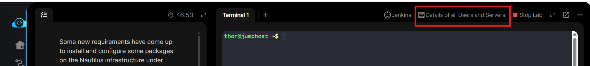
</div>

---

### 5. Verified SSH Connectivity

From the Jumphost, tested connectivity to the Storage Server.

```bash
ssh natasha@ststor01
```

Entered the password:

```text
Bl@kW
```

Successfully connected to the server.

<div style="border:1px solid #ccc; padding:10px; border-radius:10px; box-shadow:2px 2px 8px rgba(0,0,0,0.2); display:inline-block;">
  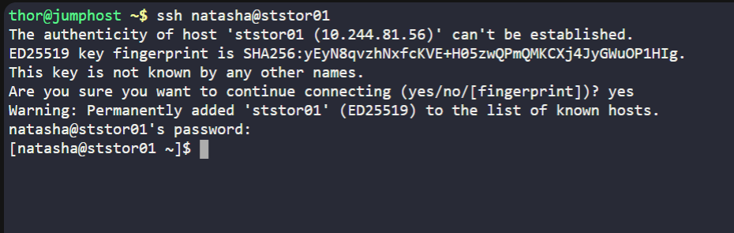
</div>


This confirmed that the server was reachable and credentials were valid.

---

### 6. Added SSH Credentials in Jenkins

Navigated to:

```text
Manage Jenkins
→ Credentials
→ System
→ Global Credentials
→ Add Credentials
```
<div style="border:1px solid #ccc; padding:10px; border-radius:10px; box-shadow:2px 2px 8px rgba(0,0,0,0.2); display:inline-block;">
  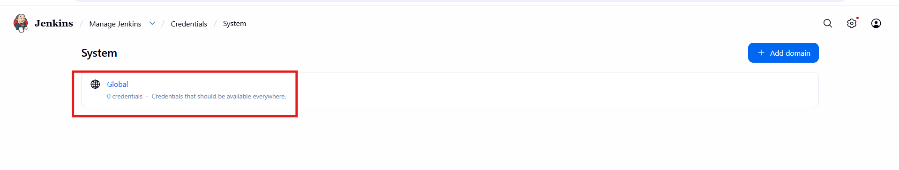
</div>

<div style="border:1px solid #ccc; padding:10px; border-radius:10px; box-shadow:2px 2px 8px rgba(0,0,0,0.2); display:inline-block;">
  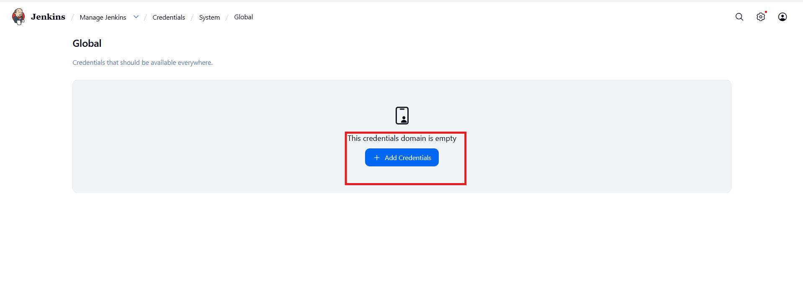
</div>


Selected:

```text
Username with password
```

Configured:

```text
Username: natasha
Password: Bl@kW
```
<div style="border:1px solid #ccc; padding:10px; border-radius:10px; box-shadow:2px 2px 8px rgba(0,0,0,0.2); display:inline-block;">
  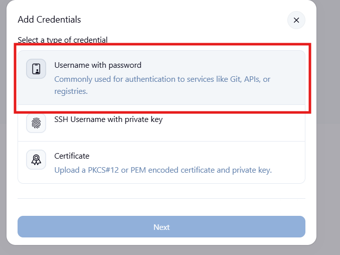
</div>

<div style="border:1px solid #ccc; padding:10px; border-radius:10px; box-shadow:2px 2px 8px rgba(0,0,0,0.2); display:inline-block;">
  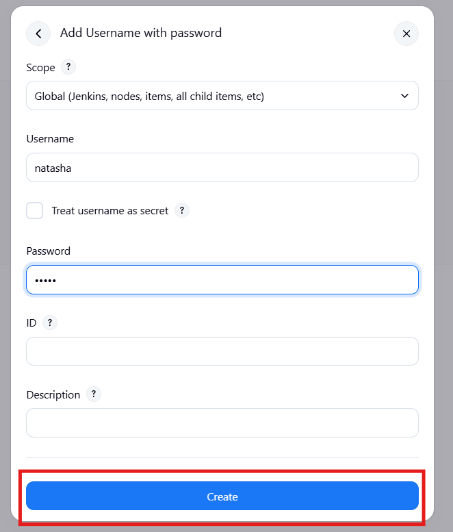
</div>

Saved the credential successfully.

---

### 7. Configured SSH Remote Host

Navigated to:

```text
Manage Jenkins
→ System
```

Located:

```text
SSH Remote Hosts
```

Configured:

```text
Hostname: ststor01
Port: 22
Credentials: natasha
```

Clicked:

```text
Check Connection
```

Connection test succeeded.

Clicked:

```text
Apply
Save
```
<div style="border:1px solid #ccc; padding:10px; border-radius:10px; box-shadow:2px 2px 8px rgba(0,0,0,0.2); display:inline-block;">
  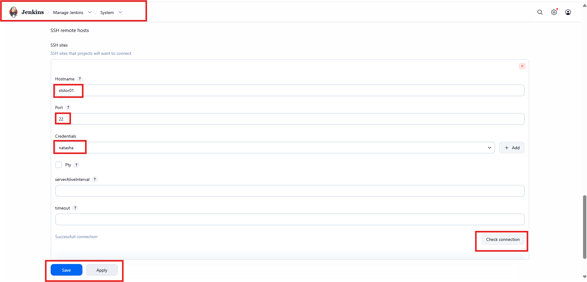
</div>

This allowed Jenkins to establish SSH connections to the Storage Server.

---

### 8. Created Jenkins Job

From the Jenkins Dashboard:

```text
New Item
```
<div style="border:1px solid #ccc; padding:10px; border-radius:10px; box-shadow:2px 2px 8px rgba(0,0,0,0.2); display:inline-block;">
  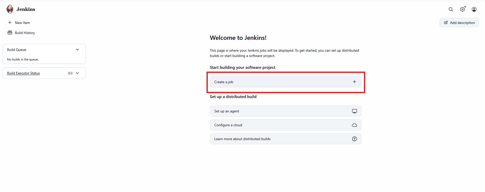
</div>

Entered:

```text
install-packages
```

Selected:

```text
Freestyle Project
```
<div style="border:1px solid #ccc; padding:10px; border-radius:10px; box-shadow:2px 2px 8px rgba(0,0,0,0.2); display:inline-block;">
  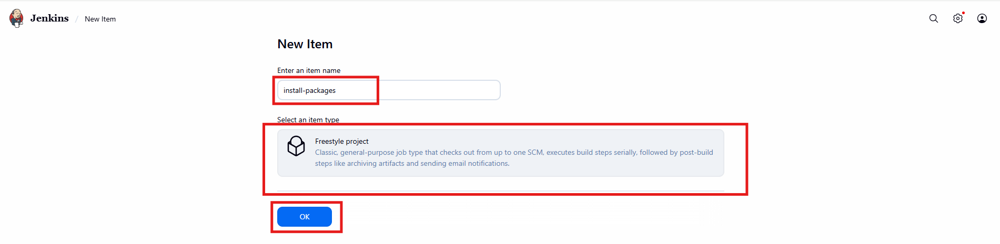
</div>

Clicked:

```text
OK
```


---

### 9. Added Build Parameter

Enabled:

```text
This project is parameterized
```

Added:

```text
String Parameter
```

<div style="border:1px solid #ccc; padding:10px; border-radius:10px; box-shadow:2px 2px 8px rgba(0,0,0,0.2); display:inline-block;">
  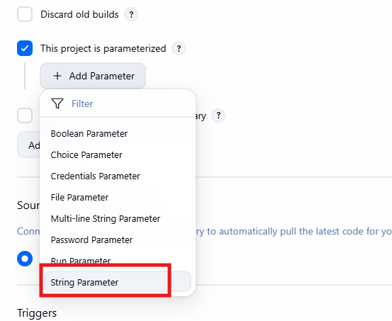
</div>


Configured:

```text
Name: PACKAGE
Default Value: package name
Description: Enter the package name
```
<div style="border:1px solid #ccc; padding:10px; border-radius:10px; box-shadow:2px 2px 8px rgba(0,0,0,0.2); display:inline-block;">
  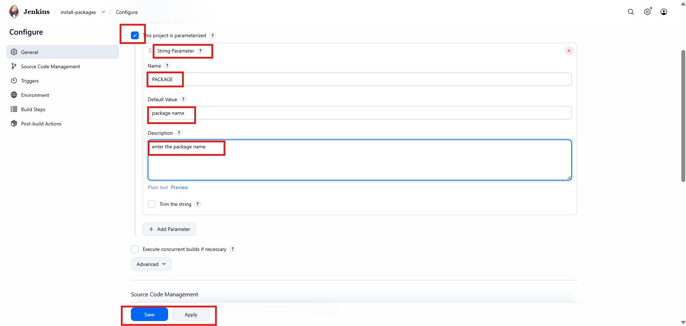
</div>

This allows users to specify which package should be installed during job execution.

---

### 10. Configured Remote Build Step

Under:

```text
Build Steps
```

Selected:

```text
Execute shell script on remote host using SSH
```
<div style="border:1px solid #ccc; padding:10px; border-radius:10px; box-shadow:2px 2px 8px rgba(0,0,0,0.2); display:inline-block;">
  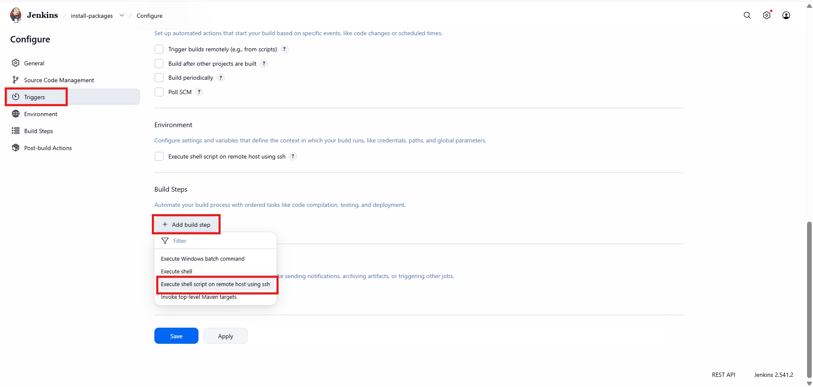
</div>

The configured SSH site was automatically available.

Added the following command:

```bash
echo 'Bl@kW' | sudo -S yum install -y $PACKAGE
```

Explanation:

* `sudo -S` accepts password input from standard input.
* `$PACKAGE` references the Jenkins parameter.
* `yum install -y` installs the specified package automatically.

<div style="border:1px solid #ccc; padding:10px; border-radius:10px; box-shadow:2px 2px 8px rgba(0,0,0,0.2); display:inline-block;">
  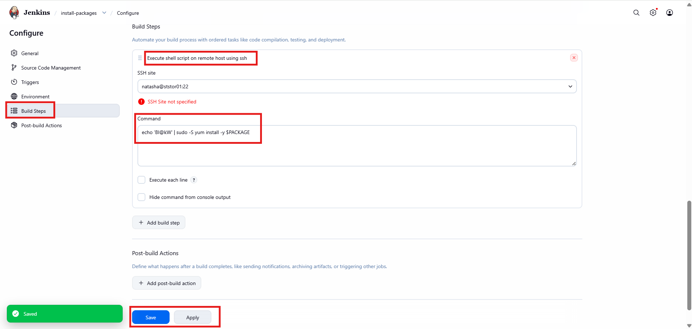
</div>

Saved the job configuration.

---

### 11. Executed the Job

Opened:

```text
Dashboard
→ install-packages
→ Build with Parameters
```
<div style="border:1px solid #ccc; padding:10px; border-radius:10px; box-shadow:2px 2px 8px rgba(0,0,0,0.2); display:inline-block;">
  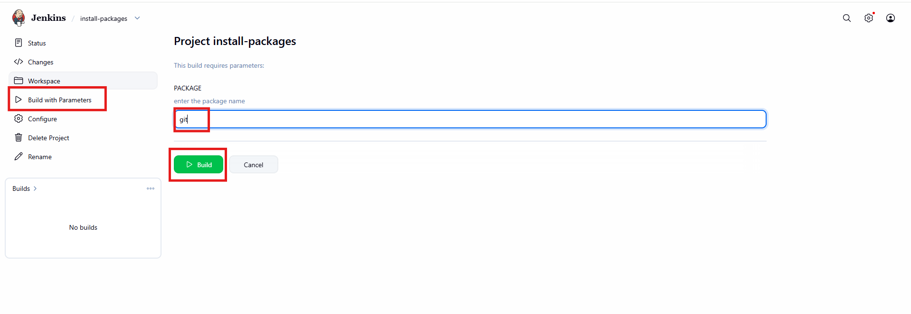
</div>

Provided:

```text
PACKAGE=git
```

Clicked:

```text
Build
```

The job executed successfully.

Build output showed:

<div style="border:1px solid #ccc; padding:10px; border-radius:10px; box-shadow:2px 2px 8px rgba(0,0,0,0.2); display:inline-block;">
  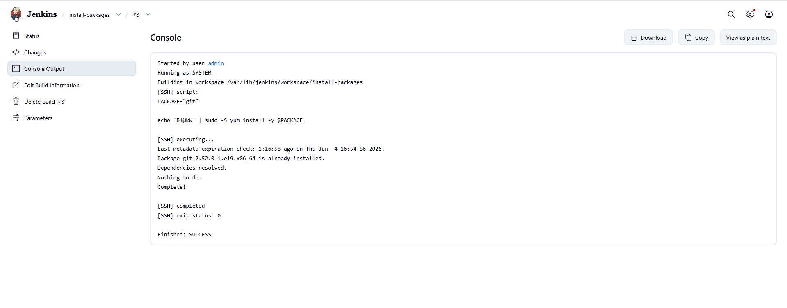
</div>

```text
Package git-2.52.0-1.el9.x86_64 is already installed.
Dependencies resolved.
Nothing to do.
Complete!
Finished: SUCCESS
```

This confirmed successful remote command execution.

---

### 12. Verified Package Installation

Connected to the Storage Server again.

```bash
ssh natasha@ststor01
```

Verified package installation:

```bash
git
```

Output displayed Git help information:

```text
usage: git [options] <command>
...
```

<div style="border:1px solid #ccc; padding:10px; border-radius:10px; box-shadow:2px 2px 8px rgba(0,0,0,0.2); display:inline-block;">
  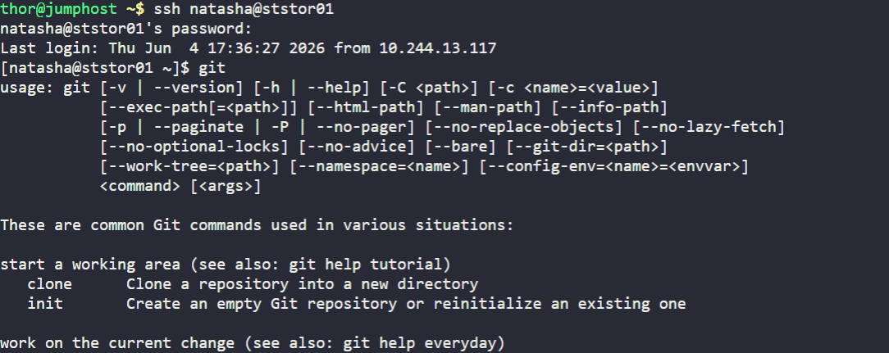
</div>

This confirmed that the package was available on the server.

---

## 🔹 Simple Explanation of Jenkins Components Used

### Jenkins Parameters

```text
String Parameter
```

Parameters allow users to provide dynamic input when triggering a build.

In this task:

```text
PACKAGE
```

determines which package Jenkins installs.

Examples:

```text
git
vim-enhanced
wget
curl
```

---

### Jenkins Credentials

```text
Manage Jenkins → Credentials
```

Credentials provide secure storage of usernames and passwords.

Instead of exposing credentials in jobs, Jenkins can securely reference them when connecting to remote systems.

---

### SSH Remote Host Configuration

```text
Manage Jenkins → System
```

SSH host configuration allows Jenkins to:

* Connect to Linux servers
* Execute commands remotely
* Automate infrastructure operations

without requiring manual login.

---

### Execute Shell Script on Remote Host

This build step allows Jenkins to:

* Open an SSH connection
* Execute shell commands remotely
* Return command output to Jenkins

It is commonly used for:

* Package installation
* Service management
* Deployment automation
* Server maintenance

---

### Yum Package Manager

```bash
yum install -y package-name
```

YUM is a package manager used in Red Hat-based Linux distributions.

The `-y` option automatically accepts prompts and enables unattended installations.

---

### Jenkins as an Automation Tool

This task demonstrates how Jenkins can automate operational activities beyond CI/CD pipelines.

Examples include:

* Installing software
* Managing services
* Running maintenance tasks
* Server administration
* Infrastructure automation

---

## 🔹 My Understanding

This task helped me understand how Jenkins can be used not only for software builds and deployments but also for infrastructure automation.

I learned how to configure SSH connectivity, manage credentials securely, create parameterized jobs, and execute commands remotely. By using Jenkins parameters, the same job can install any package without modifying the job configuration, making it highly reusable and efficient.

---

## 🔹 What I Found Interesting

I found it interesting how a simple Jenkins job can act as a lightweight automation platform for server administration.

Instead of manually logging into servers and installing packages, administrators can trigger a Jenkins build, provide the package name, and let Jenkins perform the installation automatically. This approach reduces manual effort, improves consistency, and demonstrates the power of Infrastructure Automation using Jenkins.


* * *

### Topics Covered

- ***Jenkins***
- ***JParameterized Builds***
- ***Jenkins Credentials***
- ***SSH Plugin***
- ***Package Installation***
- ***Infrastructure Automation***


**Previous Task**: [Day 70: Configure Jenkins User Access](../Day_70/day_70.md)

**Next Task**: [Day 72: Jenkins Parameterized Builds](../Day_72/day_72.md)