# Day 72: Jenkins Parameterized Builds

<div style="border:1px solid #ccc; padding:10px; border-radius:10px; box-shadow:2px 2px 8px rgba(0,0,0,0.2); display:inline-block;">
  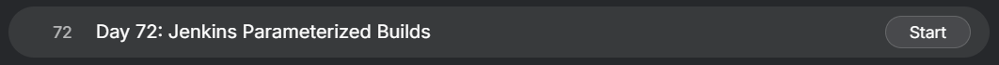
</div>


## Content

>Today I worked on creating and testing a Jenkins Parameterized Build. The objective was to understand how Jenkins parameters can be used to make jobs dynamic and reusable by accepting user input at build time.

---

## 🔹 What I Learned

* Creating Jenkins Freestyle Jobs
* Configuring Parameterized Builds
* Using String Parameters in Jenkins
* Using Choice Parameters in Jenkins
* Referencing Build Parameters inside Shell Scripts
* Executing Shell Commands in Jenkins
* Running Builds with Custom Input Values
* Verifying Build Results through Console Output

---

## 🔹 Task Requirement

<div style="border:1px solid #ccc; padding:10px; border-radius:10px; box-shadow:2px 2px 8px rgba(0,0,0,0.2); display:inline-block;">
  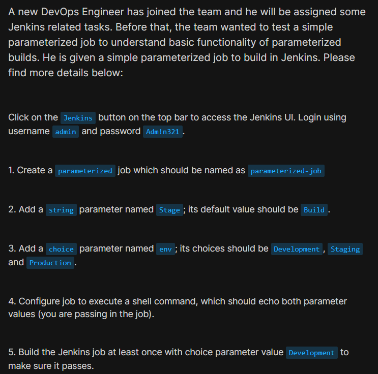
</div>

<div style="border:1px solid #ccc; padding:10px; border-radius:10px; box-shadow:2px 2px 8px rgba(0,0,0,0.2); display:inline-block;">
  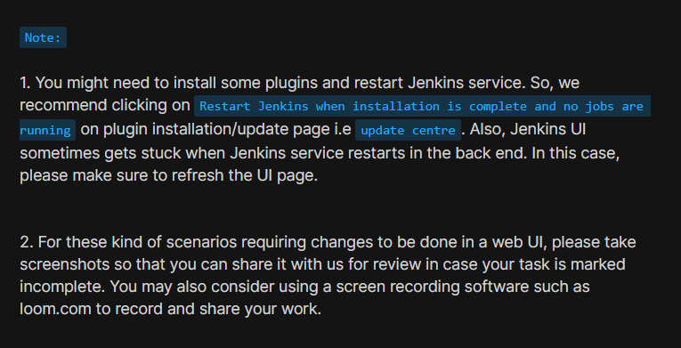
</div>


The DevOps team wanted to test a simple parameterized Jenkins job before assigning more advanced Jenkins-related tasks to a new team member.

### Jenkins Access Details

| Field    | Value    |
| -------- | -------- |
| Username | admin    |
| Password | Adm!n321 |

### Job Requirements

| Requirement      | Value                             |
| ---------------- | --------------------------------- |
| Job Name         | parameterized-job                 |
| String Parameter | Stage                             |
| Default Value    | Build                             |
| Choice Parameter | env                               |
| Choices          | Development, Staging, Production  |
| Build Step       | Execute Shell                     |
| Purpose          | Display selected parameter values |

---

## 🔹 Steps I Followed

### 1. Accessed Jenkins Web Interface

Clicked the **Jenkins** button available on the lab's top navigation bar.

This opened the Jenkins login page.

<div style="border:1px solid #ccc; padding:10px; border-radius:10px; box-shadow:2px 2px 8px rgba(0,0,0,0.2); display:inline-block;">
  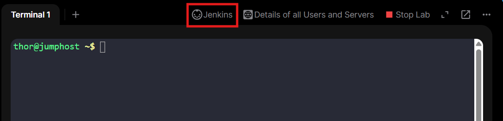
</div>

---

### 2. Logged into Jenkins

Entered the administrator credentials:

**Username**

```text
admin
```

**Password**

```text
Adm!n321
```
<div style="border:1px solid #ccc; padding:10px; border-radius:10px; box-shadow:2px 2px 8px rgba(0,0,0,0.2); display:inline-block;">
  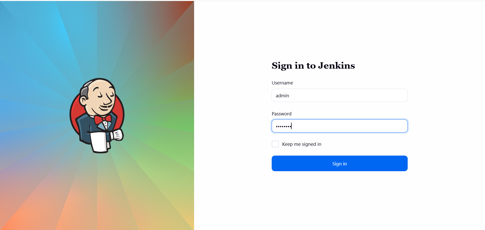
</div>


Successfully logged into the Jenkins Dashboard.

---

### 3. Created a New Jenkins Job

From the Jenkins Dashboard:

```text
New Item
```

Entered the job name:

```text
parameterized-job
```

Selected:

```text
Freestyle Project
```

Clicked:

```text
OK
```

<div style="border:1px solid #ccc; padding:10px; border-radius:10px; box-shadow:2px 2px 8px rgba(0,0,0,0.2); display:inline-block;">
  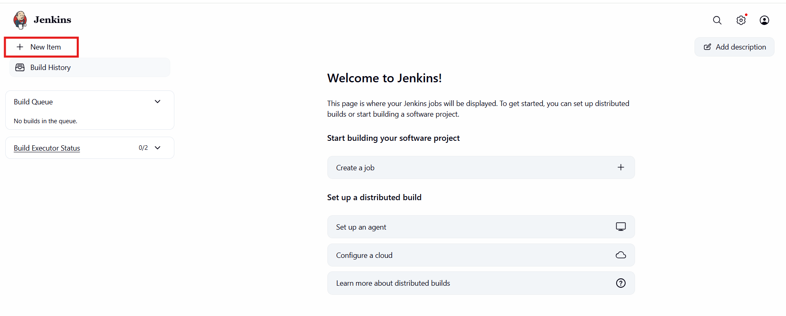
</div>

<div style="border:1px solid #ccc; padding:10px; border-radius:10px; box-shadow:2px 2px 8px rgba(0,0,0,0.2); display:inline-block;">
  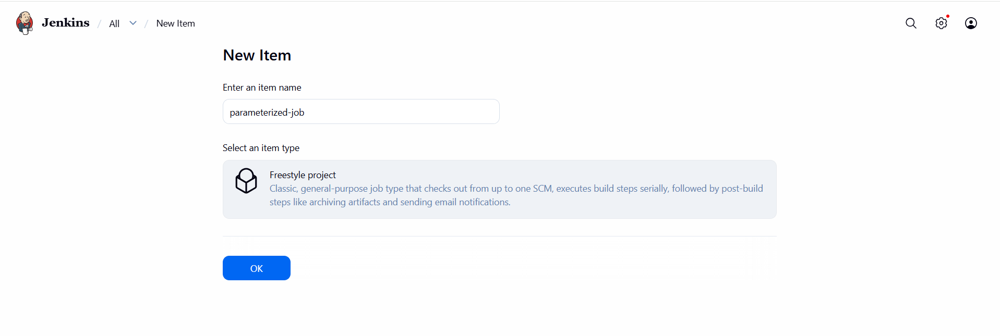
</div>


The new job configuration page opened.

---

### 4. Enabled Parameterized Build

Under the **General** section:

Checked:

```text
This project is parameterized
```

This allows the job to accept user input during build execution.

---

### 5. Added String Parameter

Clicked:

```text
Add Parameter
→ String Parameter
```

Configured:

| Field         | Value |
| ------------- | ----- |
| Name          | Stage |
| Default Value | Build |

This parameter allows users to specify the current pipeline stage.

<div style="border:1px solid #ccc; padding:10px; border-radius:10px; box-shadow:2px 2px 8px rgba(0,0,0,0.2); display:inline-block;">
  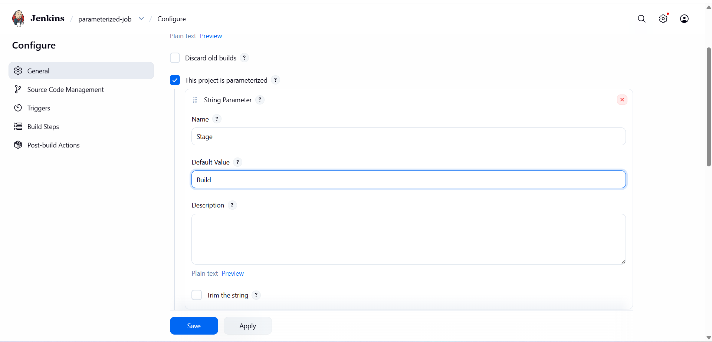
</div>

---

### 6. Added Choice Parameter

Clicked:

```text
Add Parameter
→ Choice Parameter
```

Configured:

| Field | Value |
| ----- | ----- |
| Name  | env   |

Choices:

```text
Development
Staging
Production
```

<div style="border:1px solid #ccc; padding:10px; border-radius:10px; box-shadow:2px 2px 8px rgba(0,0,0,0.2); display:inline-block;">
  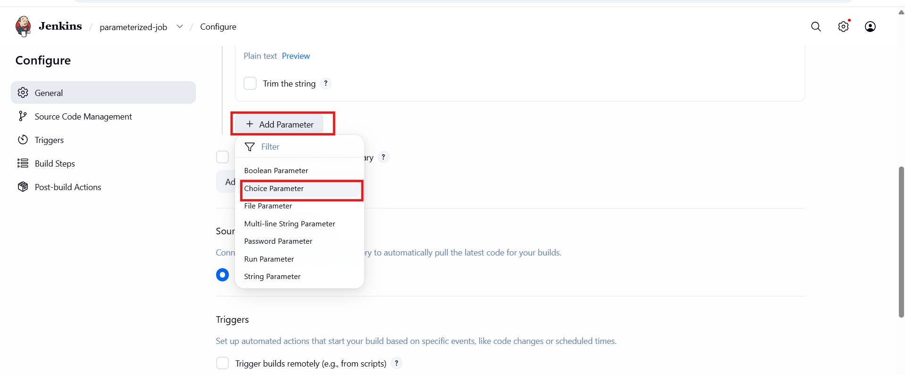
</div>


<div style="border:1px solid #ccc; padding:10px; border-radius:10px; box-shadow:2px 2px 8px rgba(0,0,0,0.2); display:inline-block;">
  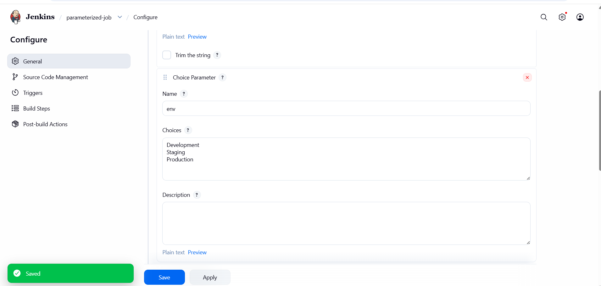
</div>

This parameter allows users to select the target environment.

---

### 7. Configured Build Step

Scrolled to:

```text
Build
```

Clicked:

```text
Add Build Step
→ Execute Shell
```

Added the following shell commands:

```bash
echo $Stage
echo $env
```

<div style="border:1px solid #ccc; padding:10px; border-radius:10px; box-shadow:2px 2px 8px rgba(0,0,0,0.2); display:inline-block;">
  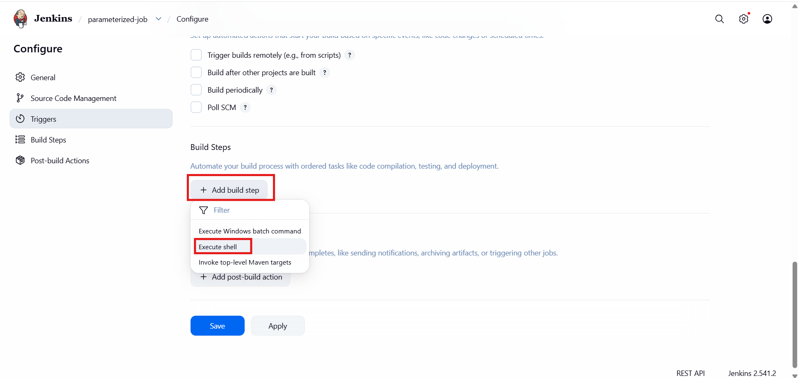
</div>

Explanation:

* `$Stage` displays the value entered in the String Parameter.
* `$env` displays the selected Choice Parameter value.


---

### 8. Saved the Job

Clicked:

```text
Apply
```

Then:

```text
Save
```

<div style="border:1px solid #ccc; padding:10px; border-radius:10px; box-shadow:2px 2px 8px rgba(0,0,0,0.2); display:inline-block;">
  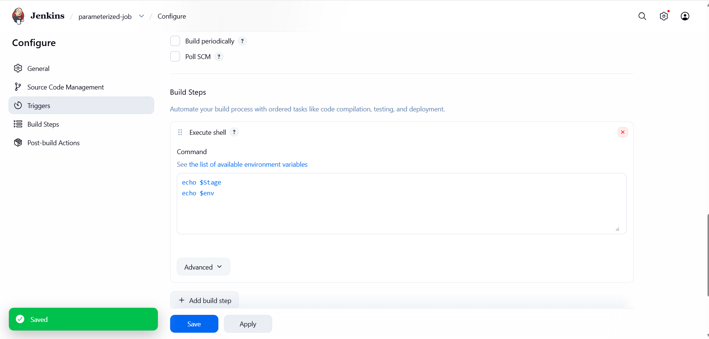
</div>

The job configuration was saved successfully.

---

### 9. Executed the Parameterized Job

Opened:

```text
parameterized-job
→ Build with Parameters
```

Provided:

| Parameter | Value       |
| --------- | ----------- |
| Stage     | Build       |
| env       | Development |

Clicked:

```text
Build
```

<div style="border:1px solid #ccc; padding:10px; border-radius:10px; box-shadow:2px 2px 8px rgba(0,0,0,0.2); display:inline-block;">
  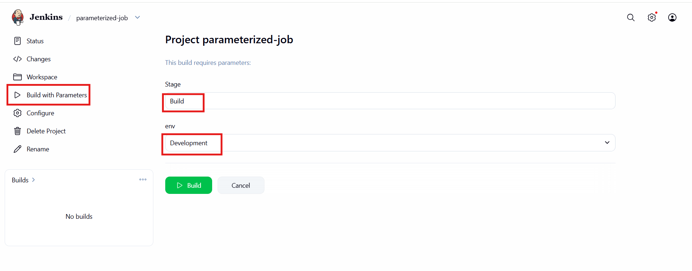
</div>

Jenkins started executing the job.

---

### 10. Verified Build Success

The build completed successfully.

Opened:

```text
Build History
→ Latest Build
→ Console Output
```


<div style="border:1px solid #ccc; padding:10px; border-radius:10px; box-shadow:2px 2px 8px rgba(0,0,0,0.2); display:inline-block;">
  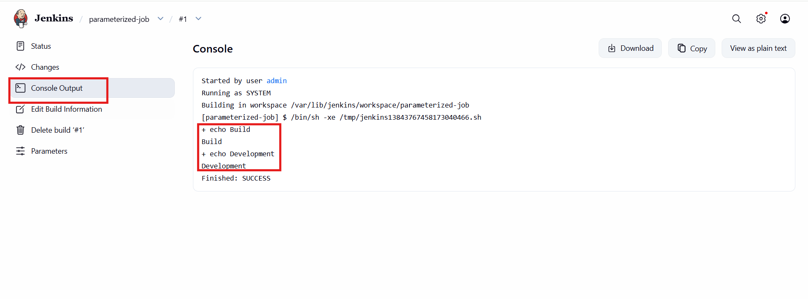
</div>

Observed the following output:

```text
Started by user admin
Running as SYSTEM
Building in workspace /var/lib/jenkins/workspace/parameterized-job
[parameterized-job] $ /bin/sh -xe /tmp/jenkins13843767458173040466.sh
+ echo Build
Build
+ echo Development
Development
Finished: SUCCESS
```

This confirmed that Jenkins correctly received and processed both parameter values.

---

## 🔹 Simple Explanation of Jenkins Components Used

### Parameterized Builds

Parameterized builds allow Jenkins jobs to accept input values when a build is triggered.

Instead of hardcoding values inside the job configuration, users can provide values dynamically.

Examples:

```text
Build
Test
Deploy
```

or

```text
Development
Staging
Production
```

---

### String Parameter

A String Parameter accepts free-form text input.

In this task:

```text
Stage
```

Default value:

```text
Build
```

Users can modify this value before running the build.

---

### Choice Parameter

A Choice Parameter provides predefined options for users to select.

In this task:

```text
env
```

Available choices:

```text
Development
Staging
Production
```

This helps prevent invalid input and standardizes environment selection.

---

### Execute Shell Build Step

The Execute Shell build step allows Jenkins to run Linux shell commands during a build.

Example:

```bash
echo $Stage
echo $env
```

Jenkins replaces these variables with the values provided during build execution.

---

### Jenkins Environment Variables

Build parameters automatically become environment variables during execution.

For example:

```bash
$Stage
```

contains:

```text
Build
```

and

```bash
$env
```

contains:

```text
Development
```

These variables can be used in scripts, deployments, testing workflows, and automation pipelines.

---

## 🔹 My Understanding

This task helped me understand the fundamentals of Jenkins Parameterized Builds. I learned how Jenkins can accept user input at runtime and pass those values directly into shell scripts.

---

## 🔹 What I Found Interesting

With just a few clicks, a static Jenkins job can become dynamic and interactive, allowing users to control build behavior without modifying the job configuration itself. This capability forms the foundation for more advanced CI/CD pipelines where environments, versions, deployment targets, and other settings are selected at build time.


* * *

### Topics Covered

- ***Jenkins***
- ***JParameterized Builds***
- ***Jenkins Credentials***
- ***execute shell commands***


**Previous Task**: [Day 71: Configure Jenkins Job for Package Installation](../Day_71/day_71.md)

**Next Task**: [Day 73: Jenkins Scheduled Jobs](../Day_73/day_73.md)