# Day 73: Jenkins Scheduled Jobs

<div style="border:1px solid #ccc; padding:10px; border-radius:10px; box-shadow:2px 2px 8px rgba(0,0,0,0.2); display:inline-block;">
  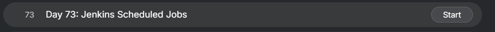
</div>

## Content

>Today I worked on creating and configuring a **Jenkins Scheduled Job** to automate the collection of Apache server logs. The objective was to gather logs from an application server at regular intervals and store them centrally on a storage server for troubleshooting and analysis.

---

## 🔹 What I Learned

* Creating Jenkins Freestyle Jobs
* Installing and Managing Jenkins Plugins
* Configuring SSH-based Remote Execution
* Managing Jenkins Credentials
* Setting Up Scheduled Builds Using Cron Expressions
* Using Publish Over SSH Plugin
* Executing Commands on Remote Servers
* Copying Files Between Linux Servers Using SCP
* Using `sshpass` for Automated Authentication
* Centralized Log Collection Concepts

---

## 🔹 Task Requirement

<div style="border:1px solid #ccc; padding:10px; border-radius:10px; box-shadow:2px 2px 8px rgba(0,0,0,0.2); display:inline-block;">
  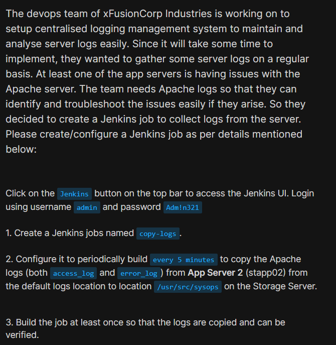
</div>

<div style="border:1px solid #ccc; padding:10px; border-radius:10px; box-shadow:2px 2px 8px rgba(0,0,0,0.2); display:inline-block;">
  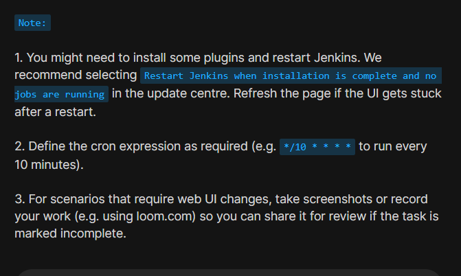
</div>

The DevOps team at xFusionCorp Industries wanted to collect Apache logs from an application server regularly until a centralized logging solution could be implemented.

### Jenkins Access Details

| Field    | Value    |
| -------- | -------- |
| Username | admin    |
| Password | Adm!n321 |

### Job Requirements

| Requirement        | Value                     |
| ------------------ | ------------------------- |
| Job Name           | copy-logs                 |
| Schedule           | Every 5 Minutes           |
| Source Server      | stapp02                   |
| Source Logs        | /var/log/httpd/access_log |
| Source Logs        | /var/log/httpd/error_log  |
| Destination Server | ststor01                  |
| Destination Path   | /usr/src/sysops           |

---

## 🔹 Steps I Followed

### 1. Accessed Jenkins Web Interface

Clicked the **Jenkins** button available on the lab's top navigation bar.

This opened the Jenkins login page.

<div style="border:1px solid #ccc; padding:10px; border-radius:10px; box-shadow:2px 2px 8px rgba(0,0,0,0.2); display:inline-block;">
  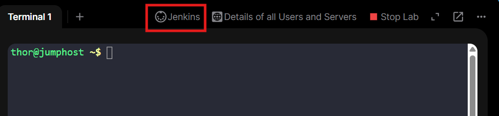
</div>


---

### 2. Logged into Jenkins

Entered the administrator credentials:

**Username**

```text
admin
```

**Password**

```text
Adm!n321
```

Successfully logged into the Jenkins Dashboard.

<div style="border:1px solid #ccc; padding:10px; border-radius:10px; box-shadow:2px 2px 8px rgba(0,0,0,0.2); display:inline-block;">
  
</div>

---

### 3. Installed Required Plugins

Navigated to:

```text
Manage Jenkins
→ Plugins
```

Installed the following plugins:

* SSH
* SSH Credentials
* Publish Over SSH

After installation:

* Restarted Jenkins
* Logged in again using admin credentials

<div style="border:1px solid #ccc; padding:10px; border-radius:10px; box-shadow:2px 2px 8px rgba(0,0,0,0.2); display:inline-block;">
  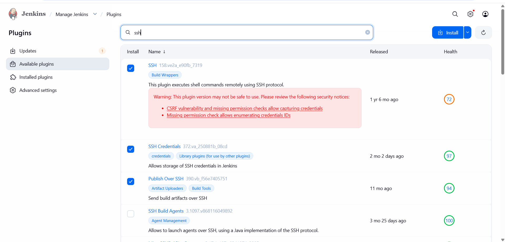
</div>
<div style="border:1px solid #ccc; padding:10px; border-radius:10px; box-shadow:2px 2px 8px rgba(0,0,0,0.2); display:inline-block;">
  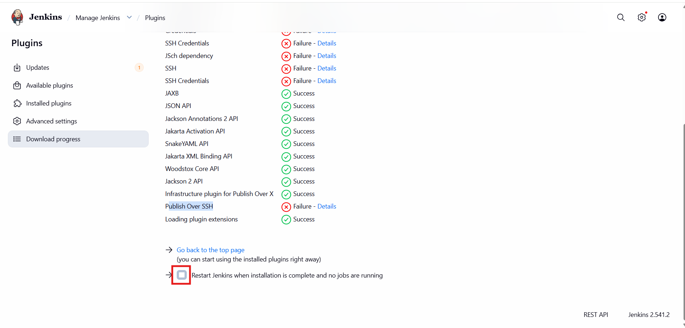
</div>
<div style="border:1px solid #ccc; padding:10px; border-radius:10px; box-shadow:2px 2px 8px rgba(0,0,0,0.2); display:inline-block;">
  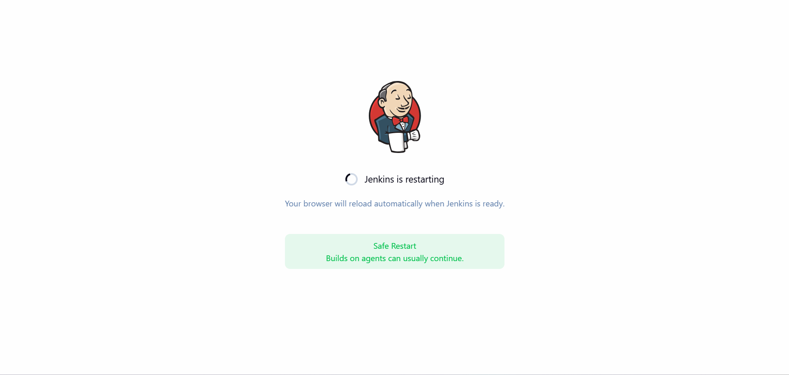
</div>
<div style="border:1px solid #ccc; padding:10px; border-radius:10px; box-shadow:2px 2px 8px rgba(0,0,0,0.2); display:inline-block;">
  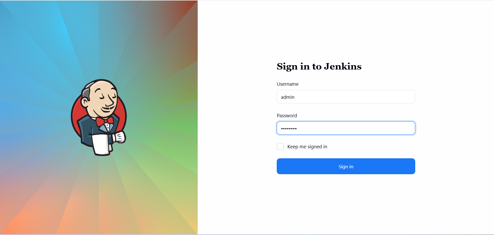
</div>

---

### 4. Reviewed Server Details

The lab provided the following server credentials:

<div style="border:1px solid #ccc; padding:10px; border-radius:10px; box-shadow:2px 2px 8px rgba(0,0,0,0.2); display:inline-block;">
  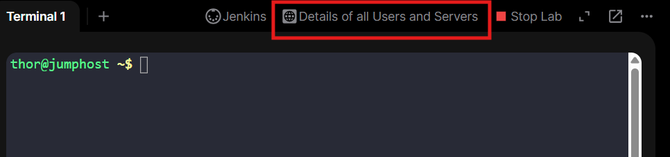
</div>

<div style="border:1px solid #ccc; padding:10px; border-radius:10px; box-shadow:2px 2px 8px rgba(0,0,0,0.2); display:inline-block;">
  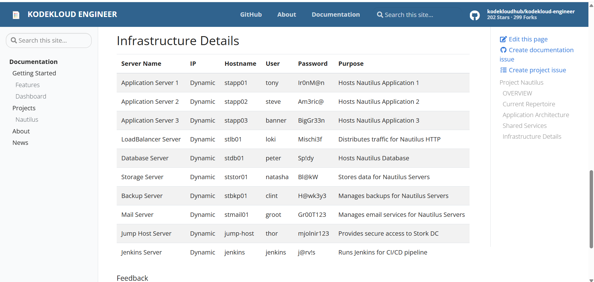
</div>

<div style="border:1px solid #ccc; padding:10px; border-radius:10px; box-shadow:2px 2px 8px rgba(0,0,0,0.2); display:inline-block;">
  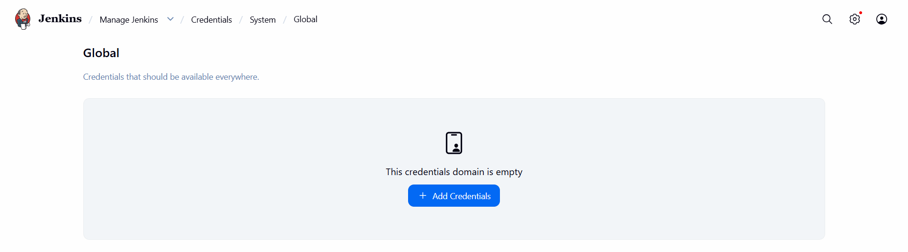
</div>

### Application Server 2

| Host    | User  | Password |
| ------- | ----- | -------- |
| stapp02 | steve | Am3ric@  |


### Storage Server

| Host     | User    | Password |
| -------- | ------- | -------- |
| ststor01 | natasha | Bl@kW    |


---

### 5. Added Jenkins Credentials

Navigated to:

```text
Manage Jenkins
→ Credentials
→ System
→ Global Credentials
→ Add Credentials
```

Added credentials for:

#### App Server

```text
Username: steve
Password: Am3ric@
```
<div style="border:1px solid #ccc; padding:10px; border-radius:10px; box-shadow:2px 2px 8px rgba(0,0,0,0.2); display:inline-block;">
  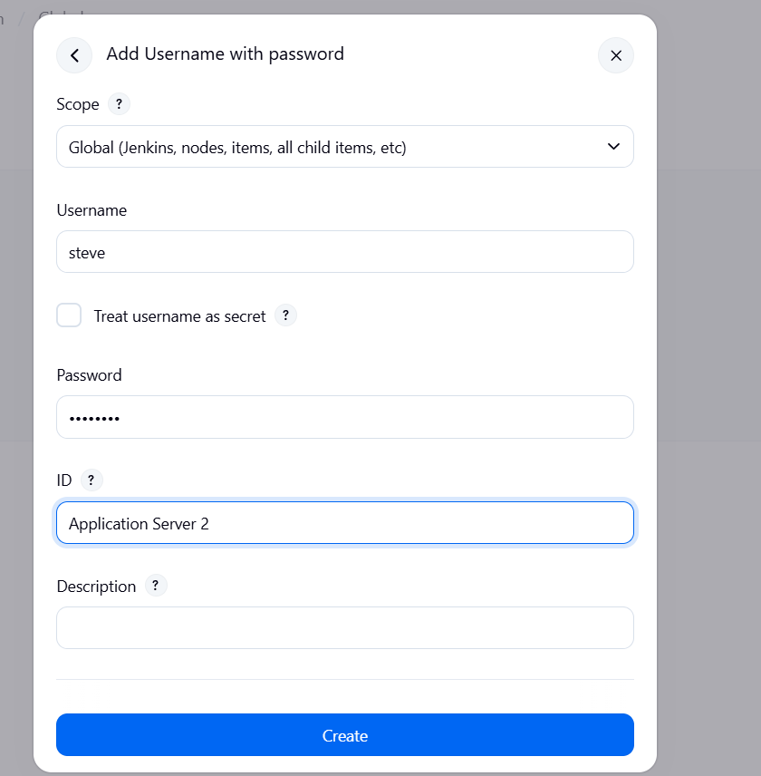
</div>

#### Storage Server

```text
Username: natasha
Password: Bl@kW
```
<div style="border:1px solid #ccc; padding:10px; border-radius:10px; box-shadow:2px 2px 8px rgba(0,0,0,0.2); display:inline-block;">
  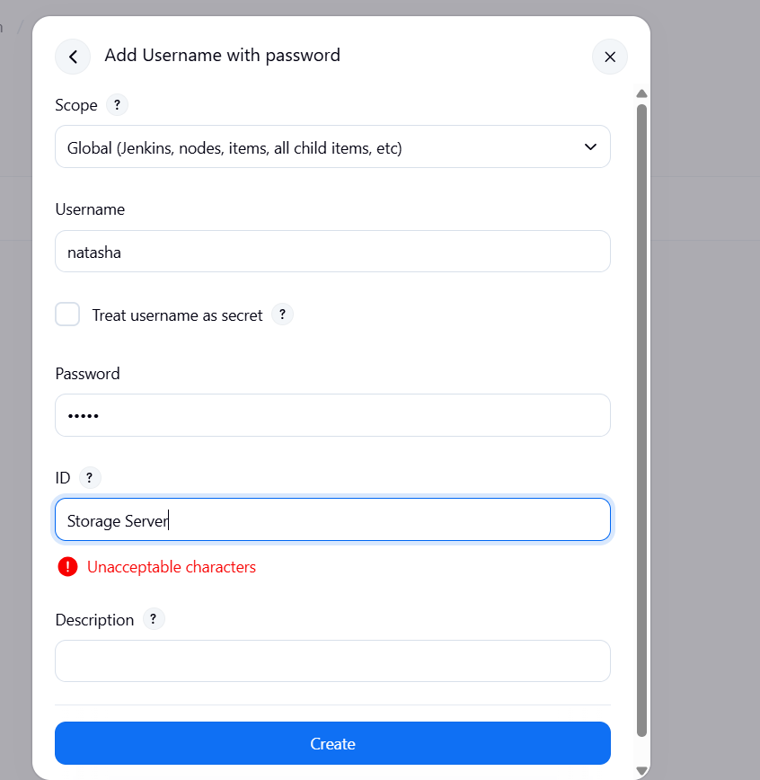
</div>

---

### 6. Configured SSH Site

Navigated to:

```text
Manage Jenkins
→ System
→ SSH Sites
```

Configured:

| Field       | Value   |
| ----------- | ------- |
| Hostname    | stapp02 |
| Port        | 22      |
| Credentials | steve   |

This allows Jenkins to execute commands remotely on the application server.

<div style="border:1px solid #ccc; padding:10px; border-radius:10px; box-shadow:2px 2px 8px rgba(0,0,0,0.2); display:inline-block;">
  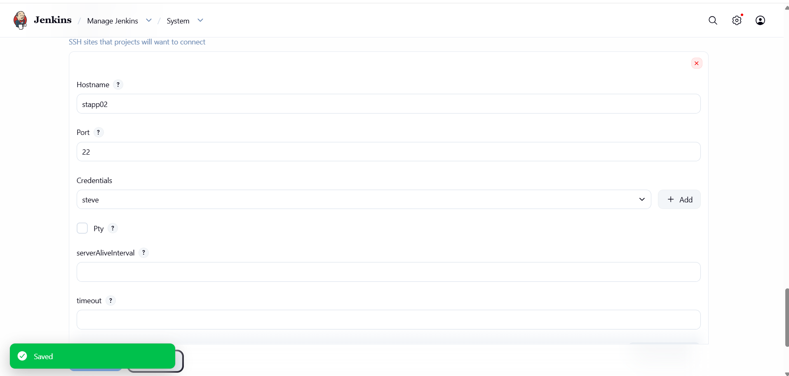
</div>


---

### 7. Prepared Destination Directory

Connected to the storage server from the jump host:

```bash
ssh natasha@ststor01
```

Checked if the destination directory existed:

```bash
ls -l /usr/src/sysops
```

Output:

```text
ls: cannot access '/usr/src/sysops': No such file or directory
```

Created the directory:

```bash
mkdir /usr/src/sysops
```

Verified:

```bash
cd /usr/src/sysops
ls
```

Directory was successfully created.

<div style="border:1px solid #ccc; padding:10px; border-radius:10px; box-shadow:2px 2px 8px rgba(0,0,0,0.2); display:inline-block;">
  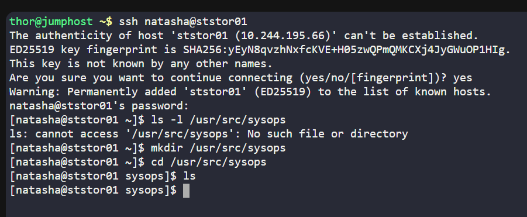
</div>

---

### 8. Created a New Jenkins Job

From the Jenkins Dashboard:

```text
New Item
```

Entered:

```text
copy-logs
```

Selected:

```text
Freestyle Project
```

Clicked:

```text
OK
```

The job configuration page opened.
<div style="border:1px solid #ccc; padding:10px; border-radius:10px; box-shadow:2px 2px 8px rgba(0,0,0,0.2); display:inline-block;">
  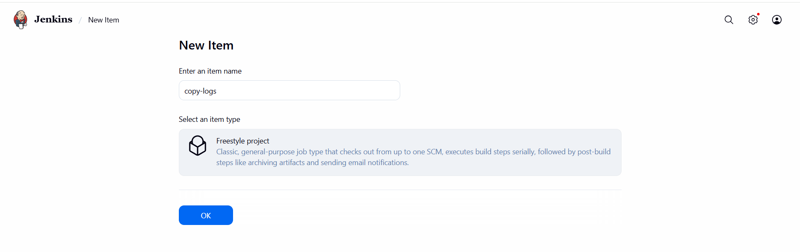
</div>


---

### 9. Configured Scheduled Build

Under:

```text
Build Triggers
```

Checked:

```text
Build periodically
```

Configured the cron schedule:

```text
*/5 * * * *
```

### Meaning

| Expression | Meaning           |
| ---------- | ----------------- |
| */5        | Every 5 minutes   |
| *          | Every hour        |
| *          | Every day         |
| *          | Every month       |
| *          | Every day of week |

This ensures the job automatically runs every five minutes.

<div style="border:1px solid #ccc; padding:10px; border-radius:10px; box-shadow:2px 2px 8px rgba(0,0,0,0.2); display:inline-block;">
  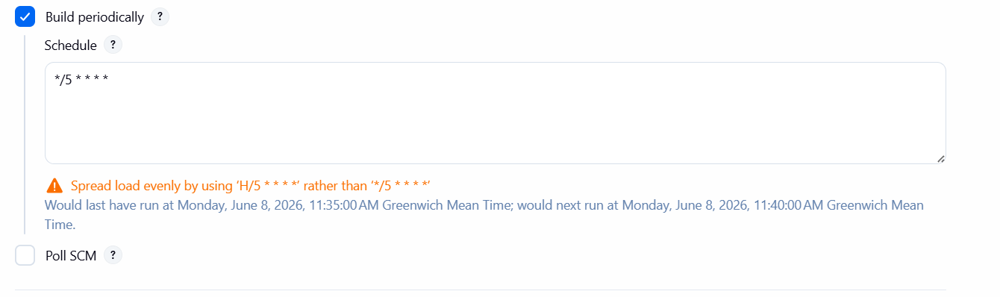
</div>

---

### 10. Added Remote Build Step

Scrolled to:

```text
Build
```

Selected:

```text
Add Build Step
→ Execute shell script on remote host using ssh
```


Selected remote host:

```text
steve@stapp02:22
```

Added the following commands:

```bash
echo 'Am3ric@' | sudo -S yum install -y sshpass

sshpass -p 'Bl@kW' scp -p -o StrictHostKeyChecking=no \
/var/log/httpd/access_log \
natasha@ststor01:/usr/src/sysops/

sshpass -p 'Bl@kW' scp -p -o StrictHostKeyChecking=no \
/var/log/httpd/error_log \
natasha@ststor01:/usr/src/sysops/
```
<div style="border:1px solid #ccc; padding:10px; border-radius:10px; box-shadow:2px 2px 8px rgba(0,0,0,0.2); display:inline-block;">
  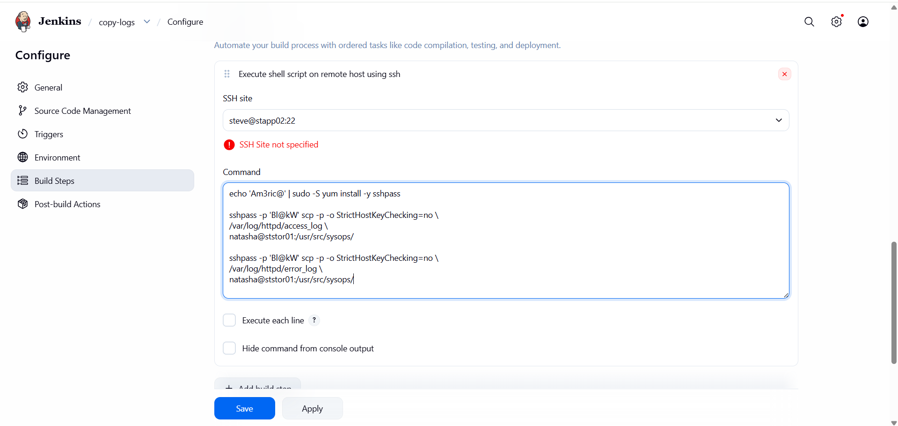
</div>

### What This Script Does

1. Installs `sshpass` on the application server.
2. Copies Apache `access_log`.
3. Copies Apache `error_log`.
4. Transfers both files to the storage server.
5. Stores them in:

```text
/usr/src/sysops
```

---

### 11. Saved the Job

Clicked:

```text
Apply
```

Then:

```text
Save
```

The job configuration was saved successfully.

---

### 12. Triggered the Build

Opened:

```text
copy-logs
→ Build Now
```

Jenkins immediately started executing the job.

---

### 13. Verified Build Success

Opened:

```text
Build History
→ Latest Build
→ Console Output
```

Observed output similar to:

```text
Installing:
sshpass-1.09-4.el9.x86_64

Complete!

Warning: Permanently added 'ststor01' (ED25519) to the list of known hosts.

[SSH] completed
[SSH] exit-status: 0

Finished: SUCCESS
```

<div style="border:1px solid #ccc; padding:10px; border-radius:10px; box-shadow:2px 2px 8px rgba(0,0,0,0.2); display:inline-block;">
  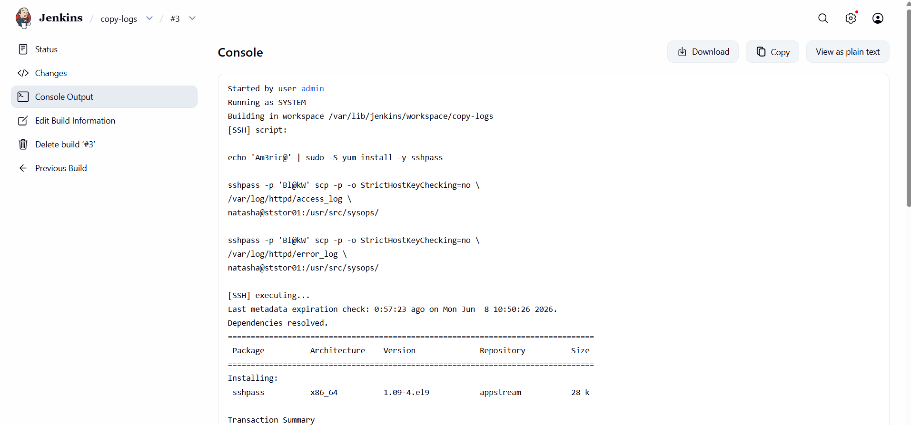
</div>

This confirmed successful execution.

---

### 14. Verified Log Files on Storage Server

Connected to:

```bash
ssh natasha@ststor01
```

Checked destination directory:

```bash
cd /usr/src/sysops
ls
```

Output:

```text
access_log
error_log
```

<div style="border:1px solid #ccc; padding:10px; border-radius:10px; box-shadow:2px 2px 8px rgba(0,0,0,0.2); display:inline-block;">
  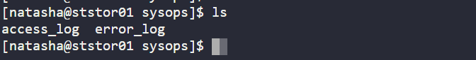
</div>

Both Apache log files were successfully copied.

---

## 🔹 Simple Explanation of Jenkins Components Used

### Build Periodically

The **Build Periodically** trigger allows Jenkins to run jobs automatically according to a schedule.

Example:

```text
*/5 * * * *
```

Runs every five minutes.

This eliminates the need for manual execution.

---

### Cron Expressions

Jenkins uses Linux-style cron syntax.

Example:

```text
*/5 * * * *
```

Means:

```text
Every 5 Minutes
```

Other examples:

```text
*/10 * * * *
```

Every 10 minutes

```text
0 * * * *
```

Every hour

---

### Publish Over SSH

The Publish Over SSH plugin enables Jenkins to:

* Connect to remote servers
* Execute shell commands
* Transfer files
* Automate administrative tasks

without logging in manually.

---

### SCP (Secure Copy)

SCP securely copies files between Linux servers.

Example:

```bash
scp file.txt user@server:/path
```

In this task it was used to transfer Apache logs from the application server to the storage server.

---

### sshpass

`sshpass` allows password-based SSH and SCP operations to run non-interactively.

Example:

```bash
sshpass -p 'password' scp file user@host:/path
```

This makes automation possible without manual password entry.

---

### Apache Logs

Apache stores important server activity logs in:

```text
/var/log/httpd/
```

Common log files:

```text
access_log
error_log
```

#### access_log

Records:

* User requests
* URLs accessed
* Response codes
* Client IP addresses

#### error_log

Records:

* Application errors
* Apache errors
* Service failures
* Troubleshooting information

---

## 🔹 My Understanding

This task helped me understand how Jenkins can be used not only for CI/CD pipelines but also for routine system administration and monitoring activities. By combining scheduled builds, SSH connectivity, and file transfer utilities, Jenkins can automate repetitive operational tasks efficiently.

---

## 🔹 What I Found Interesting

I found it interesting that Jenkins can function as a lightweight automation platform for infrastructure management. With a simple scheduled job and a few SSH commands, it was possible to create an automated log collection process that runs continuously without manual intervention. This demonstrates how Jenkins can be leveraged beyond software builds and deployments to support everyday DevOps operations.

* * *

### Topics Covered

- ***Jenkins***
- ***Jenkins Scheduled Jobs***
- ***Automation with Jenkins***
- ***SCP (Secure Copy)***
- ***Remote Command Execution***
- ***Cron Expressions***
- ***Jenkins Credentials***
- ***execute shell commands***


**Previous Task**: [Day 72: Jenkins Parameterized Builds](../Day_72/day_72.md)

**Next Task**: [Day 74: Jenkins Database Backup Job](../Day_74/day_74.md)