# Day 74: Jenkins Database Backup Job
<div style="border:1px solid #ccc; padding:10px; border-radius:10px; box-shadow:2px 2px 8px rgba(0,0,0,0.2); display:inline-block;">
  
</div>

## Content

>Today I worked on creating an automated Jenkins job to perform periodic database backups. The objective was to automate the backup of a MySQL database hosted on an application server and securely transfer the backup file to a dedicated storage server using Jenkins and SSH-based automation.

---

## 🔹 What I Learned

* Creating Jenkins Freestyle Jobs
* Installing and Managing Jenkins Plugins
* Configuring Jenkins Credentials
* Setting Up SSH Remote Hosts in Jenkins
* Generating SSH Key Pairs on Linux Servers
* Configuring Passwordless SSH Authentication
* Using `mysqldump` for MySQL Database Backups
* Copying Files Securely Using SCP
* Scheduling Jenkins Jobs Using Cron Expressions
* Executing Remote Commands Through Jenkins
* Verifying Backup Files on Remote Servers

---

## 🔹 Task Requirement

<div style="border:1px solid #ccc; padding:10px; border-radius:10px; box-shadow:2px 2px 8px rgba(0,0,0,0.2); display:inline-block;">
  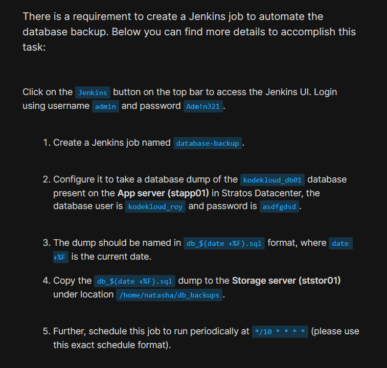
</div>

<div style="border:1px solid #ccc; padding:10px; border-radius:10px; box-shadow:2px 2px 8px rgba(0,0,0,0.2); display:inline-block;">
  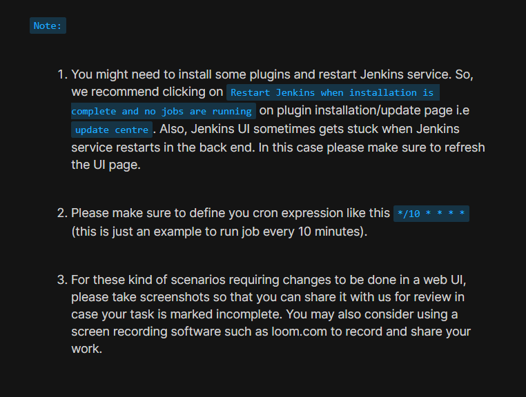
</div>

The DevOps team wanted to automate database backups using Jenkins. The backup should be generated on the application server and copied to the storage server automatically every 10 minutes.

### Jenkins Access Details

| Field    | Value    |
| -------- | -------- |
| Username | admin    |
| Password | Adm!n321 |

### Server Details

| Server               | Hostname | User    | Purpose                        |
| -------------------- | -------- | ------- | ------------------------------ |
| Application Server 1 | stapp01  | tony    | Hosts Application and Database |
| Storage Server       | ststor01 | natasha | Stores Backup Files            |

### Database Details

| Field             | Value          |
| ----------------- | -------------- |
| Database Name     | kodekloud_db01 |
| Database User     | kodekloud_roy  |
| Database Password | asdfgdsd       |

### Job Requirements

| Requirement        | Value                    |
| ------------------ | ------------------------ |
| Job Name           | database-backup          |
| Backup File Format | db_$(date +%F).sql       |
| Backup Location    | /home/natasha/db_backups |
| Schedule           | */10 * * * *             |


<div style="border:1px solid #ccc; padding:10px; border-radius:10px; box-shadow:2px 2px 8px rgba(0,0,0,0.2); display:inline-block;">
  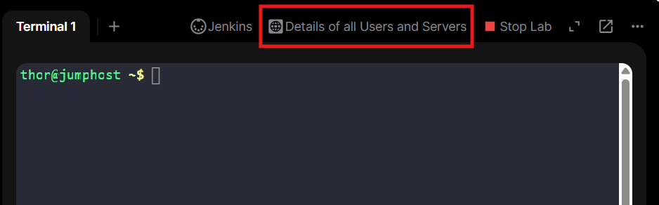
</div>

<div style="border:1px solid #ccc; padding:10px; border-radius:10px; box-shadow:2px 2px 8px rgba(0,0,0,0.2); display:inline-block;">
  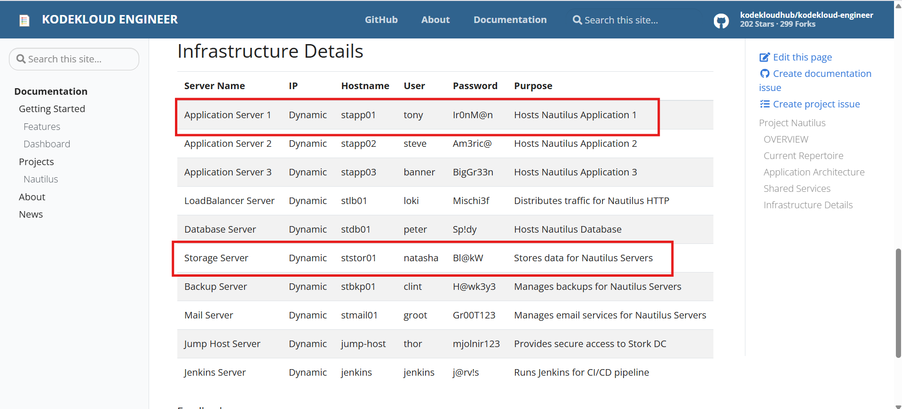
</div>
---

## 🔹 Steps I Followed

### 1. Connected to the Application Server

From the jumphost, I connected to the application server:

```bash
ssh tony@stapp01
```

Entered the password:

```text
Ir0nM@n
```

Successfully logged into the application server.


<div style="border:1px solid #ccc; padding:10px; border-radius:10px; box-shadow:2px 2px 8px rgba(0,0,0,0.2); display:inline-block;">
  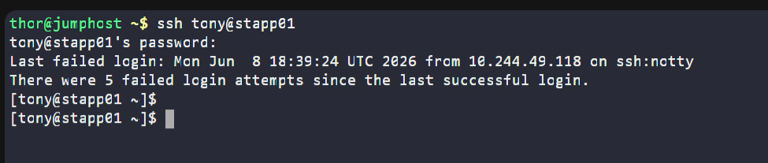
</div>

---

### 2. Generated SSH Key Pair

To enable passwordless file transfer between servers, I generated an SSH key pair:

<div style="border:1px solid #ccc; padding:10px; border-radius:10px; box-shadow:2px 2px 8px rgba(0,0,0,0.2); display:inline-block;">
  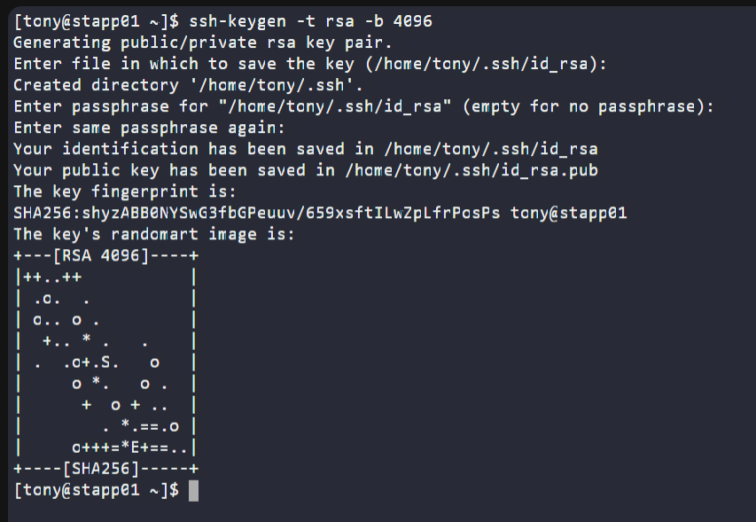
</div>


```bash
ssh-keygen -t rsa -b 4096
```

Accepted the default location and left the passphrase empty.

SSH keys were generated in:

```text
/home/tony/.ssh/id_rsa
/home/tony/.ssh/id_rsa.pub
```

---

### 3. Configured Passwordless SSH Access

Copied the public key to the storage server:

<div style="border:1px solid #ccc; padding:10px; border-radius:10px; box-shadow:2px 2px 8px rgba(0,0,0,0.2); display:inline-block;">
  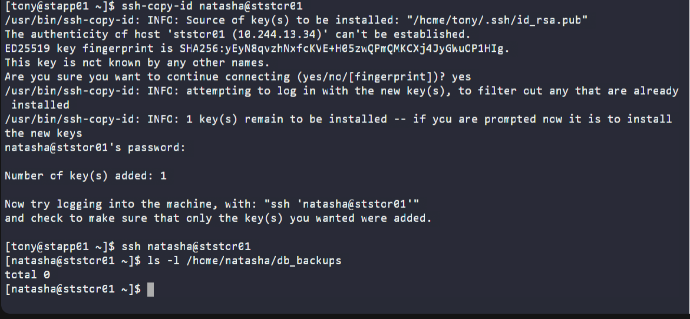
</div>


```bash
ssh-copy-id natasha@ststor01
```

Provided the password:

```text
Bl@kW
```

After the key was copied successfully, I verified passwordless login:

```bash
ssh natasha@ststor01
```

Login worked without prompting for a password.

---

### 4. Verified Backup Directory

Checked the backup directory on the storage server:

```bash
ls -l /home/natasha/db_backups
```

Output:

```text
total 0
```

This confirmed that no backups existed before running the Jenkins job.


---

### 5. Accessed Jenkins

Clicked the Jenkins button from the lab navigation bar.

This opened the Jenkins login page.

<div style="border:1px solid #ccc; padding:10px; border-radius:10px; box-shadow:2px 2px 8px rgba(0,0,0,0.2); display:inline-block;">
  
</div>


---

### 6. Logged into Jenkins

Entered the administrator credentials:

**Username**

```text
admin
```

**Password**

```text
Adm!n321
```

Successfully logged into the Jenkins Dashboard.

<div style="border:1px solid #ccc; padding:10px; border-radius:10px; box-shadow:2px 2px 8px rgba(0,0,0,0.2); display:inline-block;">
  
</div>


---

### 7. Installed Required Plugins

Navigated to:

```text
Manage Jenkins
→ Manage Plugins
```

Installed the following plugins:

* SSH
* SSH Credentials
* SSH Build Agents

After installation completed, Jenkins was restarted.

<div style="border:1px solid #ccc; padding:10px; border-radius:10px; box-shadow:2px 2px 8px rgba(0,0,0,0.2); display:inline-block;">
  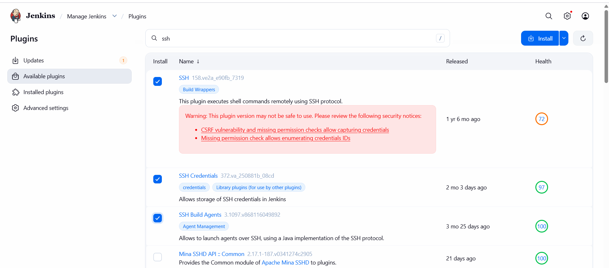
</div>

<div style="border:1px solid #ccc; padding:10px; border-radius:10px; box-shadow:2px 2px 8px rgba(0,0,0,0.2); display:inline-block;">
  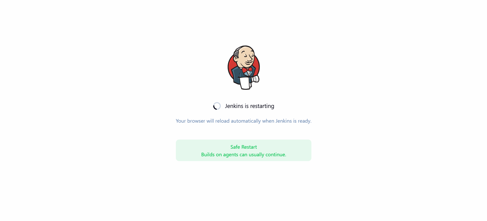
</div>

<div style="border:1px solid #ccc; padding:10px; border-radius:10px; box-shadow:2px 2px 8px rgba(0,0,0,0.2); display:inline-block;">
  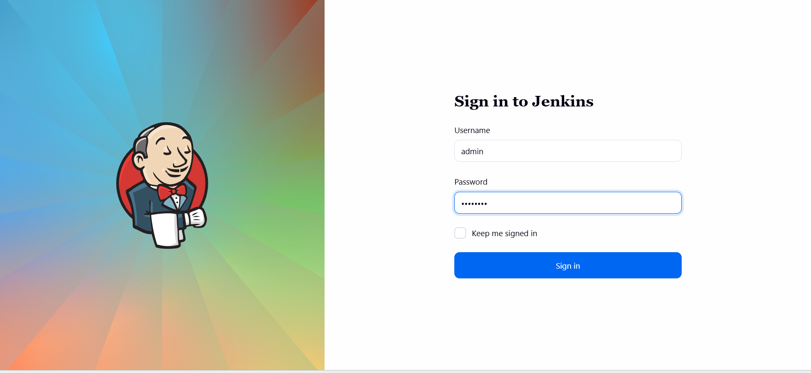
</div>

---

### 8. Created Jenkins Credentials

Navigated to:

```text
Manage Jenkins
→ Credentials
→ System
→ Global Credentials (unrestricted)
```

Created a new credential with the following values:

| Field    | Value    |
| -------- | -------- |
| Username | tony     |
| Password | Ir0nM@n  |
| ID       | database |

Clicked **Save**.

<div style="border:1px solid #ccc; padding:10px; border-radius:10px; box-shadow:2px 2px 8px rgba(0,0,0,0.2); display:inline-block;">
  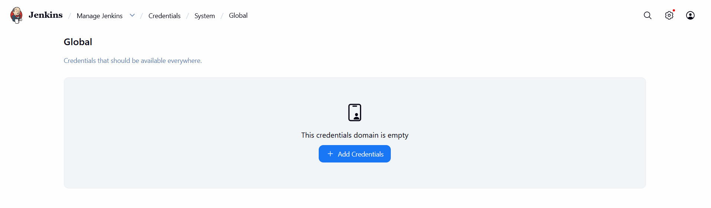
</div>

<div style="border:1px solid #ccc; padding:10px; border-radius:10px; box-shadow:2px 2px 8px rgba(0,0,0,0.2); display:inline-block;">
  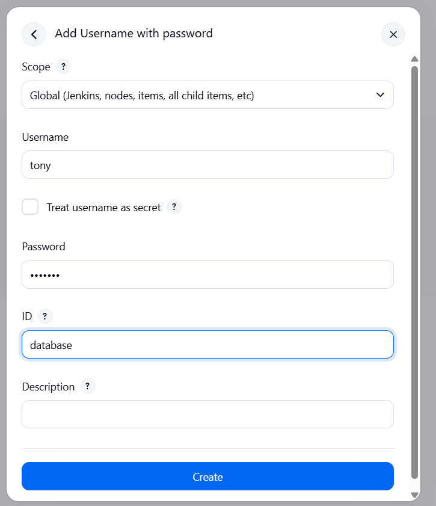
</div>

---

### 9. Configured SSH Remote Host

Navigated to:

```text
Manage Jenkins
→ Configure System
```

Scrolled to:

```text
SSH Remote Hosts
```

Configured:

| Field       | Value   |
| ----------- | ------- |
| Hostname    | stapp01 |
| Port        | 22      |
| Credentials | tony    |

Clicked:

```text
Check Connection
```

Received:

```text
Successful connection
```

Saved the configuration.

<div style="border:1px solid #ccc; padding:10px; border-radius:10px; box-shadow:2px 2px 8px rgba(0,0,0,0.2); display:inline-block;">
  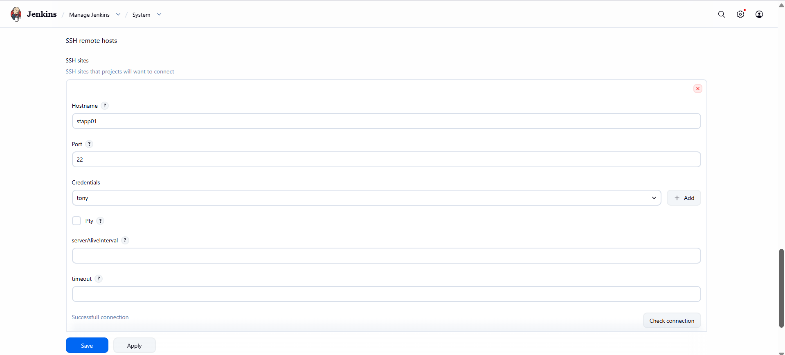
</div>

---

### 10. Created the Jenkins Job

From the Jenkins Dashboard:

```text
New Item
```

Entered the job name:

```text
database-backup
```

Selected:

```text
Freestyle Project
```

Clicked:

```text
OK
```

The job configuration page opened.

<div style="border:1px solid #ccc; padding:10px; border-radius:10px; box-shadow:2px 2px 8px rgba(0,0,0,0.2); display:inline-block;">
  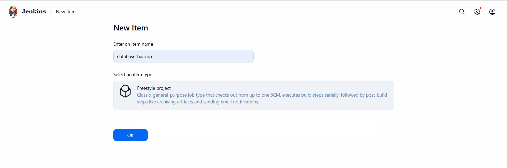
</div>

---

### 11. Configured Build Schedule

Under:

```text
Build Triggers
```

Enabled:

```text
Build periodically
```

Configured the schedule exactly as required:

```text
*/10 * * * *
```

This ensures the backup job runs every 10 minutes.

<div style="border:1px solid #ccc; padding:10px; border-radius:10px; box-shadow:2px 2px 8px rgba(0,0,0,0.2); display:inline-block;">
  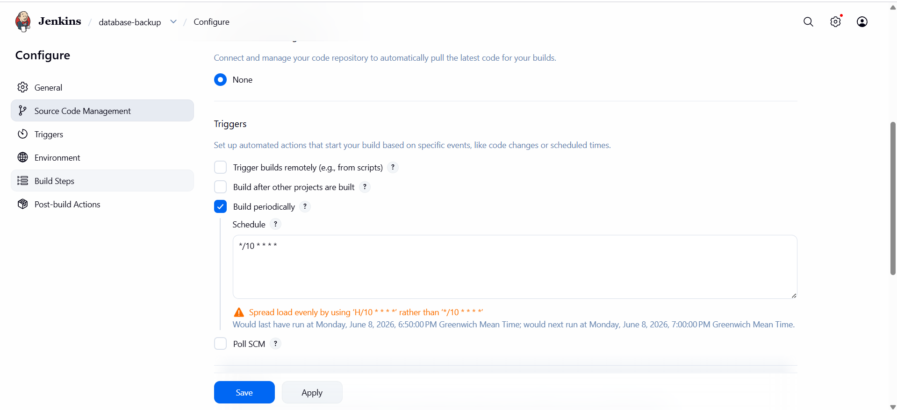
</div>

---

### 12. Added Build Step

Under:

```text
Build
```

Clicked:

```text
Add Build Step
→ Execute shell script on remote host using ssh
```
<div style="border:1px solid #ccc; padding:10px; border-radius:10px; box-shadow:2px 2px 8px rgba(0,0,0,0.2); display:inline-block;">
  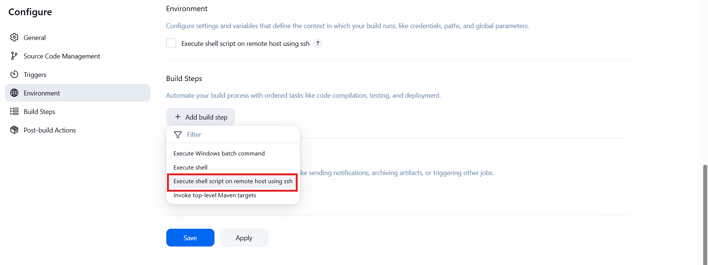
</div>

Selected the configured SSH host:

```text
tony@stapp01:22
```

Added the following commands:

```bash
mysqldump -u kodekloud_roy -pasdfgdsd kodekloud_db01 > db_$(date +%F).sql

scp -o StrictHostKeyChecking=no db_$(date +%F).sql natasha@ststor01:/home/natasha/db_backups
```
<div style="border:1px solid #ccc; padding:10px; border-radius:10px; box-shadow:2px 2px 8px rgba(0,0,0,0.2); display:inline-block;">
  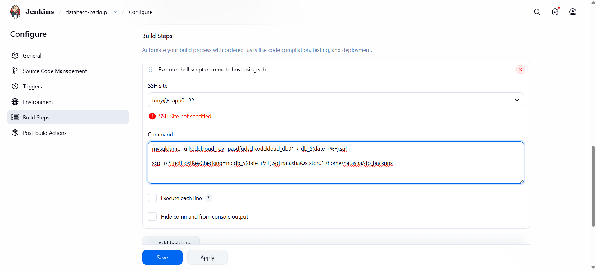
</div>


### Explanation

#### Database Backup Command

```bash
mysqldump -u kodekloud_roy -pasdfgdsd kodekloud_db01 > db_$(date +%F).sql
```

This command:

* Connects to MySQL
* Creates a dump of the database
* Saves the backup using the current date

Example:

```text
db_2026-06-08.sql
```

#### File Transfer Command

```bash
scp -o StrictHostKeyChecking=no db_$(date +%F).sql natasha@ststor01:/home/natasha/db_backups
```

This command:

* Securely copies the backup file
* Transfers it to the storage server
* Stores it in the backup directory

---

### 13. Saved the Job

Clicked:

```text
Apply
```

Then:

```text
Save
```

The Jenkins job was saved successfully.

---

### 14. Triggered a Manual Build

Opened:

```text
database-backup
→ Build Now
```

Jenkins started executing the backup process.

<div style="border:1px solid #ccc; padding:10px; border-radius:10px; box-shadow:2px 2px 8px rgba(0,0,0,0.2); display:inline-block;">
  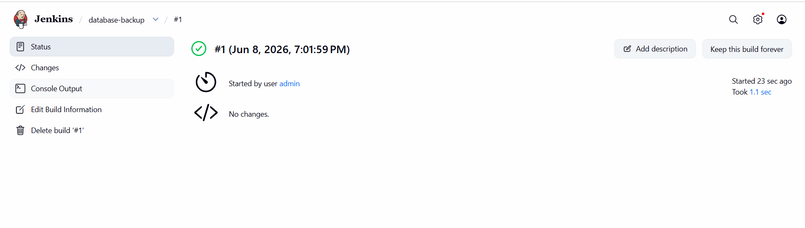
</div>
---

### 15. Verified Build Success

Opened:

```text
Build History
→ Latest Build
→ Console Output
```

Observed:

<div style="border:1px solid #ccc; padding:10px; border-radius:10px; box-shadow:2px 2px 8px rgba(0,0,0,0.2); display:inline-block;">
  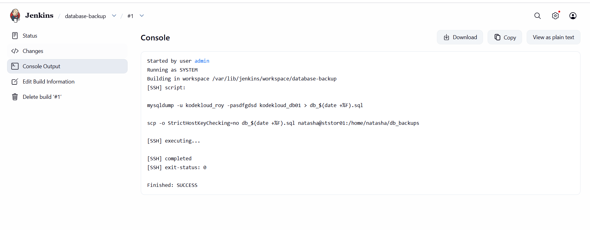
</div>

```text
Started by user admin
Running as SYSTEM
Building in workspace /var/lib/jenkins/workspace/database-backup

[SSH] script:

mysqldump -u kodekloud_roy -pasdfgdsd kodekloud_db01 > db_$(date +%F).sql

scp -o StrictHostKeyChecking=no db_$(date +%F).sql natasha@ststor01:/home/natasha/db_backups

[SSH] executing...

[SSH] completed
[SSH] exit-status: 0

Finished: SUCCESS
```

This confirmed that Jenkins successfully created and transferred the backup.

---

### 16. Verified Backup on Storage Server

Connected to the storage server:

```bash
ssh natasha@ststor01
```

Checked the backup directory:

```bash
ls -l /home/natasha/db_backups
```

<div style="border:1px solid #ccc; padding:10px; border-radius:10px; box-shadow:2px 2px 8px rgba(0,0,0,0.2); display:inline-block;">
  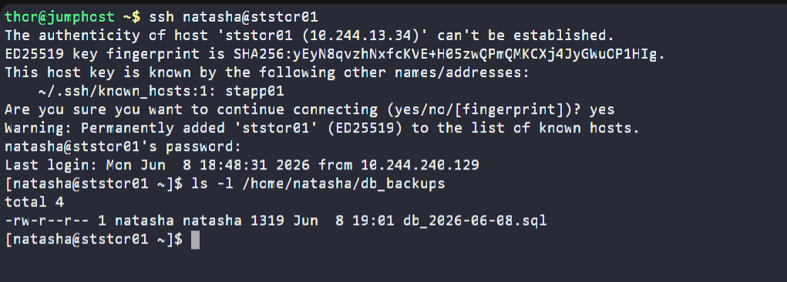
</div>

Output:

```text
total 4
-rw-r--r-- 1 natasha natasha 1319 Jun  8 19:01 db_2026-06-08.sql
```

This confirmed that the database backup file was successfully transferred to the storage server.

---

## 🔹 Simple Explanation of Jenkins Components Used

### Jenkins Credentials

Jenkins Credentials provide a secure way to store usernames, passwords, SSH keys, and secrets.

In this task:

```text
Username: tony
Password: Ir0nM@n
```

were stored securely and reused for SSH connections.

---

### SSH Remote Hosts

The SSH plugin allows Jenkins to connect and execute commands on remote servers.

In this task:

```text
stapp01
```

was configured as the remote host.

This allowed Jenkins to run database backup commands directly on the application server.

---

### mysqldump

`mysqldump` is a MySQL utility used to export database contents into a SQL file.

Example:

```bash
mysqldump -u user -ppassword database_name > backup.sql
```

The generated SQL file can later be used to restore the database if needed.

---

### SCP (Secure Copy)

SCP securely transfers files between Linux servers over SSH.

Example:

```bash
scp backup.sql user@server:/backup/location
```

In this task, SCP was used to move the backup file to the storage server.

---

### Build Periodically Trigger

The Build Periodically trigger allows Jenkins jobs to run automatically based on a cron schedule.

Configured schedule:

```text
*/10 * * * *
```

Meaning:

```text
Every 10 minutes
```

This ensures backups are performed automatically without manual intervention.

---

## 🔹 My Understanding

This task helped me understand how Jenkins can be used for infrastructure automation beyond application builds and deployments. I learned how to combine SSH connectivity, database utilities, file transfers, and scheduling mechanisms to create a fully automated database backup solution.

---

## 🔹 What I Found Interesting

What I found most interesting was how Jenkins can act as a centralized automation platform for server administration tasks. By combining a few plugins, SSH authentication, and simple shell commands, I was able to build a reliable automated backup workflow that periodically creates database dumps and stores them safely on a separate server. This demonstrates how Jenkins can be used not only for CI/CD pipelines but also for routine operational and maintenance activities in real-world DevOps environments.

* * *

### Topics Covered

- ***Jenkins***
- ***database-backup***
- ***Jenkins Scheduled Jobs***
- ***Automation with Jenkins***
- ***SCP (Secure Copy)***
- ***Remote Command Execution***
- ***Cron Expressions***
- ***Jenkins Credentials***
- ***execute shell commands***


**Previous Task**: [Day 73: Jenkins Scheduled Jobs](../Day_73/day_73.md)

**Next Task**: [Day 75: Jenkins Slave Nodes](../Day_75/day_75.md)