# Day 75: Jenkins Slave Nodes

<div style="border:1px solid #ccc; padding:10px; border-radius:10px; box-shadow:2px 2px 8px rgba(0,0,0,0.2); display:inline-block;">
  
</div>

## Content

>Today I worked on configuring Jenkins SSH build agents (slave nodes) for all application servers in the environment. The goal was to allow Jenkins to execute jobs directly on the application servers through SSH connections. During the process, I also encountered and resolved a Java version compatibility issue between the Jenkins controller and the remote agents.

---

## 🔹 What I Learned

* Jenkins Controller and Agent Communication
* Installing and Managing Jenkins Plugins
* Creating Jenkins Credentials
* Configuring SSH Build Agents
* Managing Labels and Node Restrictions
* Troubleshooting Jenkins Agent Connection Issues
* Understanding Java Version Compatibility
* Running Jobs on Specific Jenkins Agents
* Verifying Agent Connectivity and Functionality

---

## 🔹 Task Requirement
<div style="border:1px solid #ccc; padding:10px; border-radius:10px; box-shadow:2px 2px 8px rgba(0,0,0,0.2); display:inline-block;">
  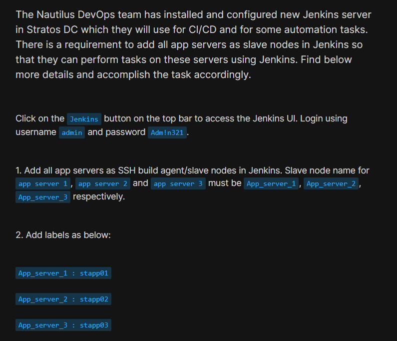
</div>

<div style="border:1px solid #ccc; padding:10px; border-radius:10px; box-shadow:2px 2px 8px rgba(0,0,0,0.2); display:inline-block;">
  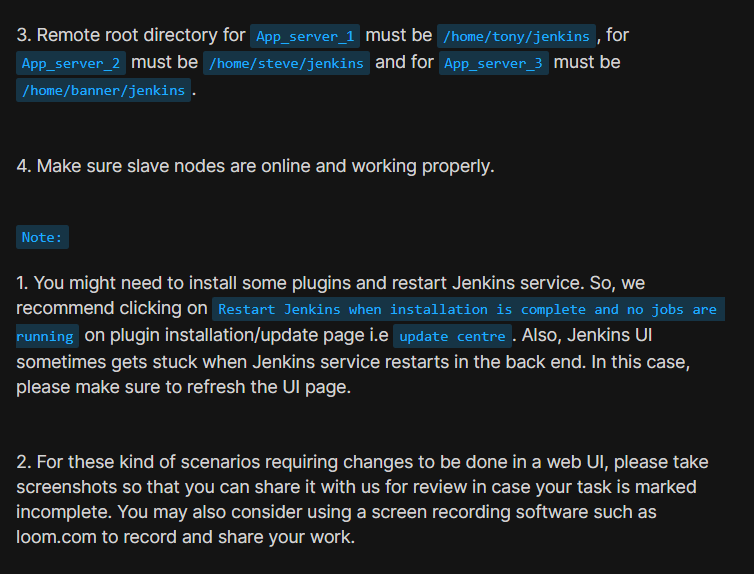
</div>

The Nautilus DevOps team required all application servers to be configured as Jenkins SSH build agents so that Jenkins could execute jobs directly on those servers.

### Jenkins Access Details

| Field    | Value    |
| -------- | -------- |
| Username | admin    |
| Password | Adm!n321 |

### Application Server Details

| Server               | Hostname | User   | Password |
| -------------------- | -------- | ------ | -------- |
| Application Server 1 | stapp01  | tony   | Ir0nM@n  |
| Application Server 2 | stapp02  | steve  | Am3ric@  |
| Application Server 3 | stapp03  | banner | BigGr33n |

### Node Configuration Requirements

| Node Name    | Label   | Remote Root Directory |
| ------------ | ------- | --------------------- |
| App_server_1 | stapp01 | /home/tony/jenkins    |
| App_server_2 | stapp02 | /home/steve/jenkins   |
| App_server_3 | stapp03 | /home/banner/jenkins  |

---

## 🔹 Steps I Followed

## 1. Verified Java Installation on All Application Servers

Before configuring Jenkins agents, I connected to each application server and verified whether Java was installed.

### App Server 1

```bash
ssh tony@stapp01
sudo su -
java --version
```

Output:

```text
openjdk 11.0.20.1
```
<div style="border:1px solid #ccc; padding:10px; border-radius:10px; box-shadow:2px 2px 8px rgba(0,0,0,0.2); display:inline-block;">
  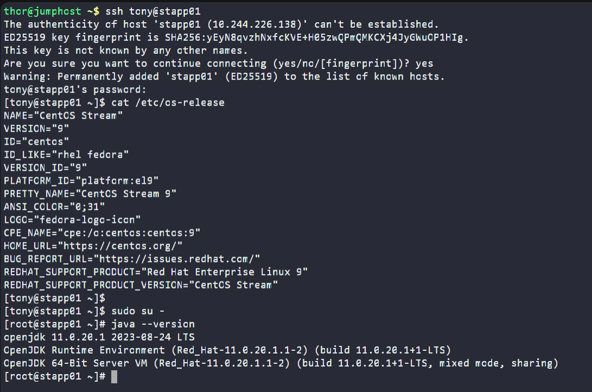
</div>


### App Server 2

```bash
ssh steve@stapp02
java --version
```

Output:

```text
openjdk 11.0.20.1
```
<div style="border:1px solid #ccc; padding:10px; border-radius:10px; box-shadow:2px 2px 8px rgba(0,0,0,0.2); display:inline-block;">
  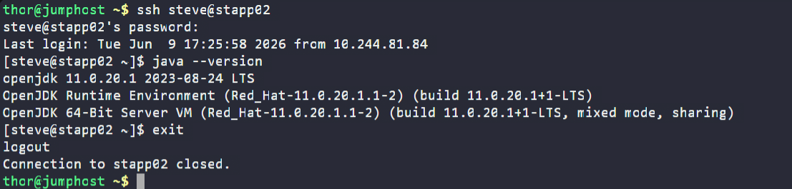
</div>

### App Server 3

```bash
ssh banner@stapp03
java --version
```

Output:

```text
openjdk 11.0.20.1
```
<div style="border:1px solid #ccc; padding:10px; border-radius:10px; box-shadow:2px 2px 8px rgba(0,0,0,0.2); display:inline-block;">
  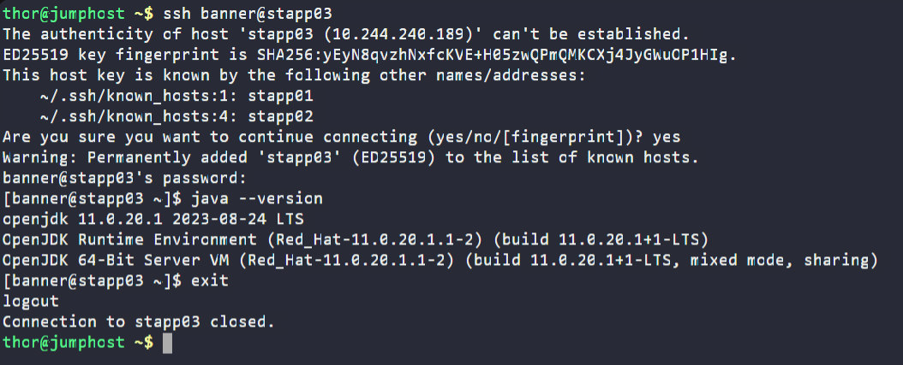
</div>


This confirmed that Java was already installed on all servers.

---

## 2. Accessed Jenkins

Clicked the Jenkins button from the lab navigation bar.

This opened the Jenkins login page.
<div style="border:1px solid #ccc; padding:10px; border-radius:10px; box-shadow:2px 2px 8px rgba(0,0,0,0.2); display:inline-block;">
  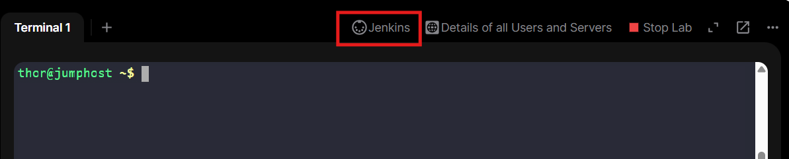
</div>
---

## 3. Logged into Jenkins

Used the administrator credentials:

### Username

```text
admin
```

### Password

```text
Adm!n321
```

Successfully logged into the Jenkins Dashboard.

<div style="border:1px solid #ccc; padding:10px; border-radius:10px; box-shadow:2px 2px 8px rgba(0,0,0,0.2); display:inline-block;">
  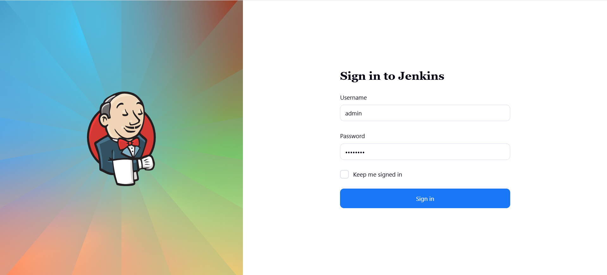
</div>
---

## 4. Installed Required Plugins

Navigated to:

```text
Manage Jenkins
→ Plugins
```

Installed the following plugins:

* SSH
* SSH Credentials
* SSH Build Agents

<div style="border:1px solid #ccc; padding:10px; border-radius:10px; box-shadow:2px 2px 8px rgba(0,0,0,0.2); display:inline-block;">
  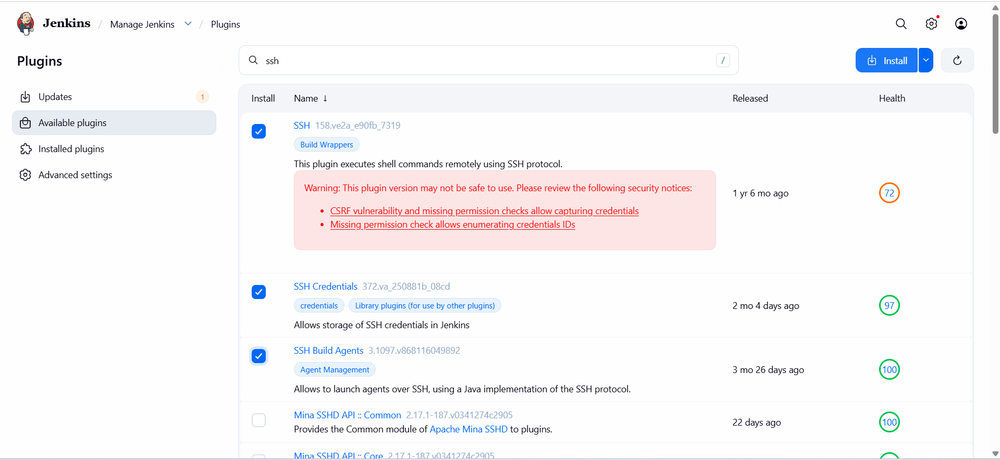
</div>

After installation completed, Jenkins was restarted.

Logged back in using the admin credentials.

<div style="border:1px solid #ccc; padding:10px; border-radius:10px; box-shadow:2px 2px 8px rgba(0,0,0,0.2); display:inline-block;">
  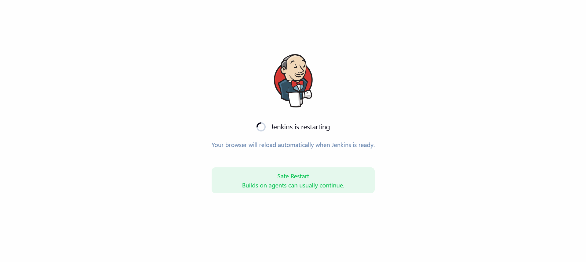
</div>
---

## 5. Created Jenkins Credentials

Navigated to:

```text
Manage Jenkins
→ Credentials
→ System
→ Global Credentials
→ Add Credentials
```
<div style="border:1px solid #ccc; padding:10px; border-radius:10px; box-shadow:2px 2px 8px rgba(0,0,0,0.2); display:inline-block;">
  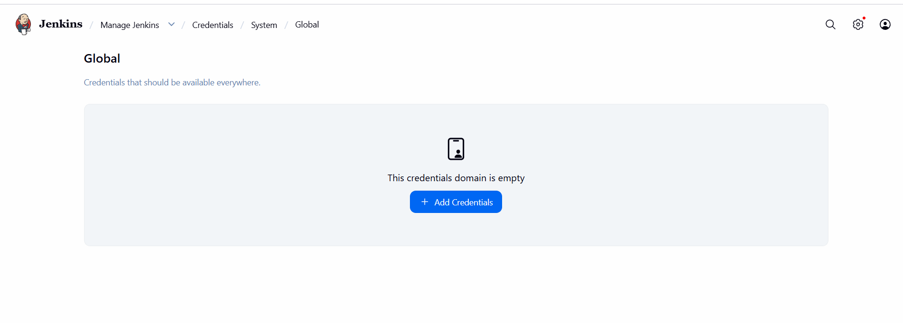
</div>

Credential Type:

```text
Username with Password
```

---

### Credential for App Server 1

| Field    | Value   |
| -------- | ------- |
| Username | tony    |
| Password | Ir0nM@n |
| ID       | stapp01 |

Saved the credential.

<div style="border:1px solid #ccc; padding:10px; border-radius:10px; box-shadow:2px 2px 8px rgba(0,0,0,0.2); display:inline-block;">
  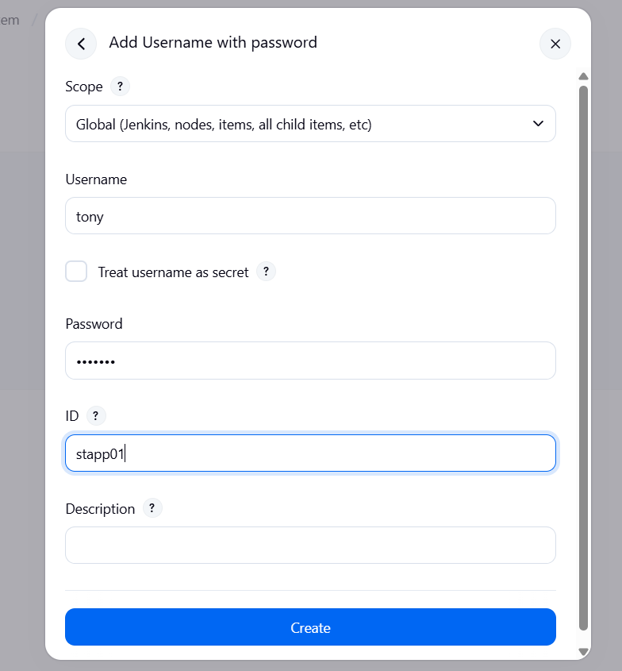
</div>

---

### Credential for App Server 2

| Field    | Value   |
| -------- | ------- |
| Username | steve   |
| Password | Am3ric@ |
| ID       | stapp02 |

Saved the credential.

<div style="border:1px solid #ccc; padding:10px; border-radius:10px; box-shadow:2px 2px 8px rgba(0,0,0,0.2); display:inline-block;">
  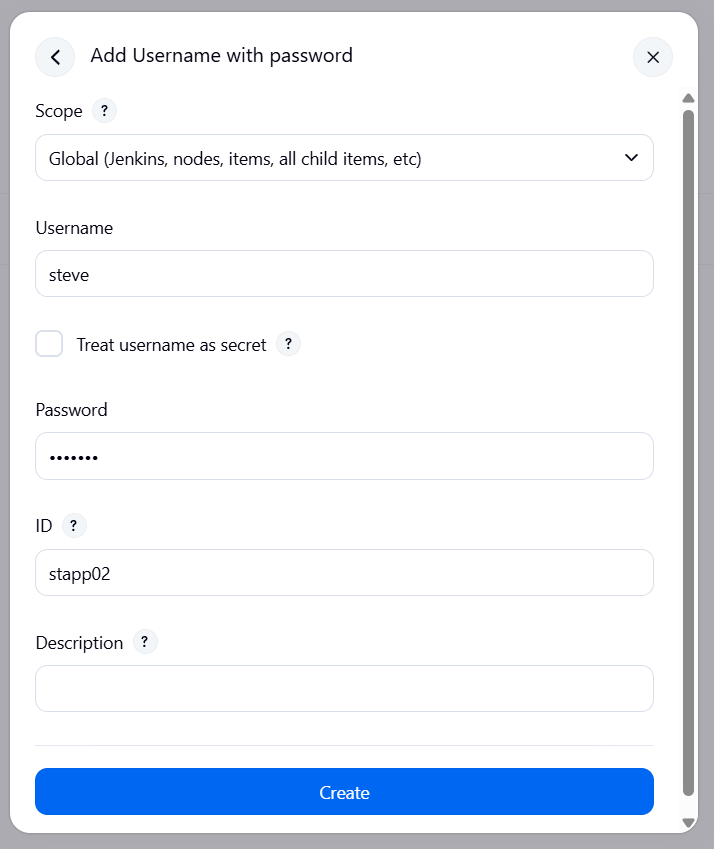
</div>

---

### Credential for App Server 3

| Field    | Value    |
| -------- | -------- |
| Username | banner   |
| Password | BigGr33n |
| ID       | stapp03  |

Saved the credential.
<div style="border:1px solid #ccc; padding:10px; border-radius:10px; box-shadow:2px 2px 8px rgba(0,0,0,0.2); display:inline-block;">
  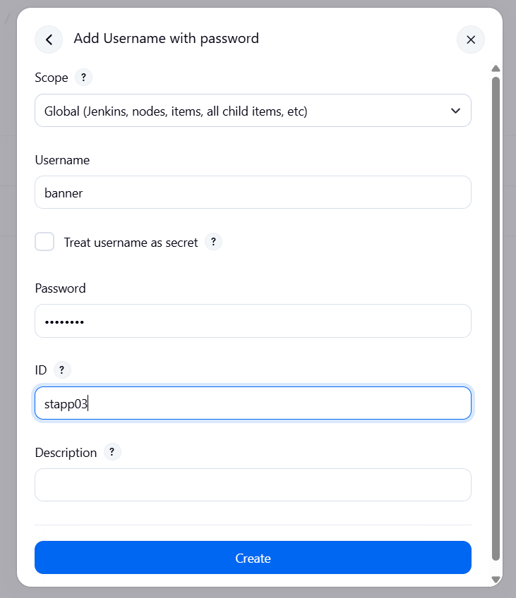
</div>

<div style="border:1px solid #ccc; padding:10px; border-radius:10px; box-shadow:2px 2px 8px rgba(0,0,0,0.2); display:inline-block;">
  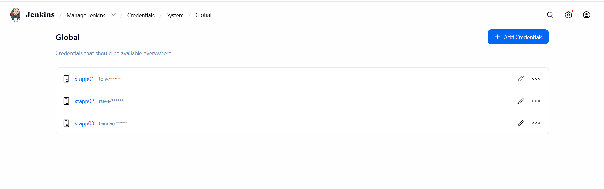
</div>
---

## 6. Created Jenkins Agent Node for App_server_1

Navigated to:

```text
Manage Jenkins
→ Nodes
→ New Node
```
<div style="border:1px solid #ccc; padding:10px; border-radius:10px; box-shadow:2px 2px 8px rgba(0,0,0,0.2); display:inline-block;">
  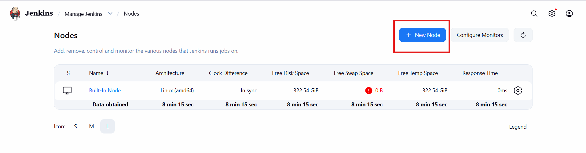
</div>

Entered:

```text
Node Name:
App_server_1
```

Selected:

```text
Permanent Agent
```

Configured:

| Field                 | Value                               |
| --------------------- | ----------------------------------- |
| Remote Root Directory | /home/tony/jenkins                  |
| Labels                | stapp01                             |
| Usage                 | Use this node as much as possible   |
| Launch Method         | Launch agents via SSH               |
| Host                  | stapp01                             |
| Credentials           | stapp01                             |
| Host Key Verification | Non verifying Verification Strategy |

Clicked Save.

<div style="border:1px solid #ccc; padding:10px; border-radius:10px; box-shadow:2px 2px 8px rgba(0,0,0,0.2); display:inline-block;">
  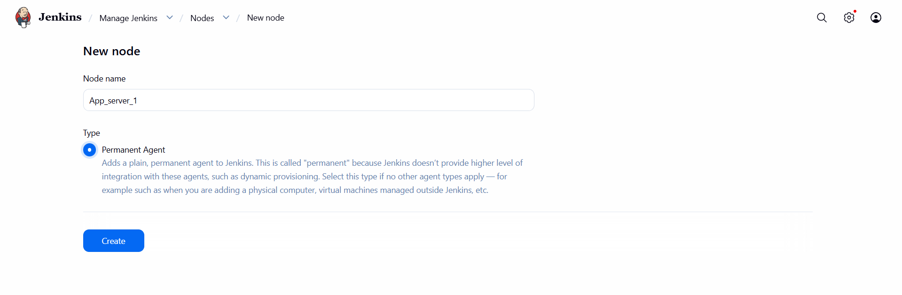
</div>

<div style="border:1px solid #ccc; padding:10px; border-radius:10px; box-shadow:2px 2px 8px rgba(0,0,0,0.2); display:inline-block;">
  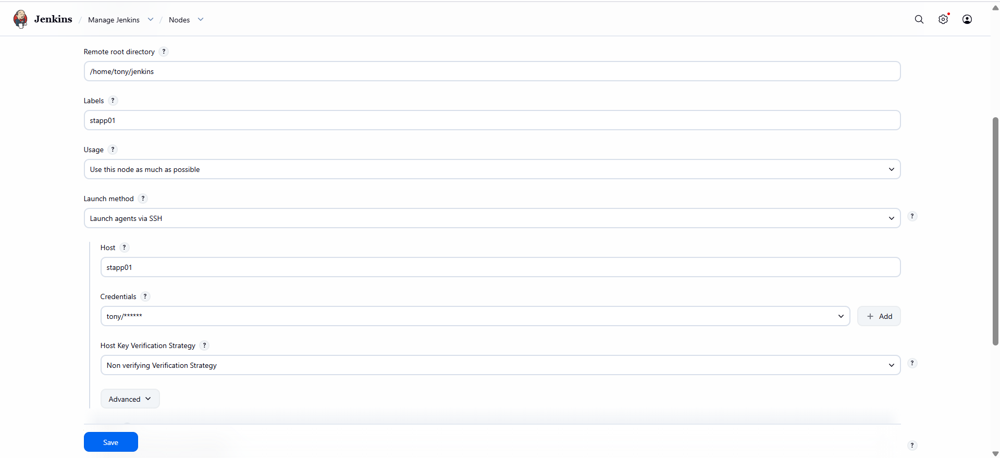
</div>
---

## 7. Created Jenkins Agent Node for App_server_2

Configured:

| Field                 | Value                               |
| --------------------- | ----------------------------------- |
| Node Name             | App_server_2                        |
| Remote Root Directory | /home/steve/jenkins                 |
| Labels                | stapp02                             |
| Launch Method         | Launch agents via SSH               |
| Host                  | stapp02                             |
| Credentials           | stapp02                             |
| Host Key Verification | Non verifying Verification Strategy |

Clicked Save.

<div style="border:1px solid #ccc; padding:10px; border-radius:10px; box-shadow:2px 2px 8px rgba(0,0,0,0.2); display:inline-block;">
  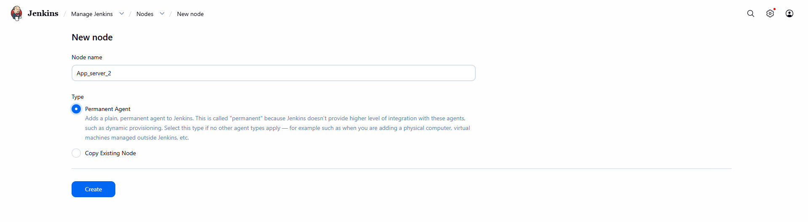
</div>

<div style="border:1px solid #ccc; padding:10px; border-radius:10px; box-shadow:2px 2px 8px rgba(0,0,0,0.2); display:inline-block;">
  
</div>

---

## 8. Created Jenkins Agent Node for App_server_3

Configured:

| Field                 | Value                               |
| --------------------- | ----------------------------------- |
| Node Name             | App_server_3                        |
| Remote Root Directory | /home/banner/jenkins                |
| Labels                | stapp03                             |
| Launch Method         | Launch agents via SSH               |
| Host                  | stapp03                             |
| Credentials           | stapp03                             |
| Host Key Verification | Non verifying Verification Strategy |

Clicked Save.

<div style="border:1px solid #ccc; padding:10px; border-radius:10px; box-shadow:2px 2px 8px rgba(0,0,0,0.2); display:inline-block;">
  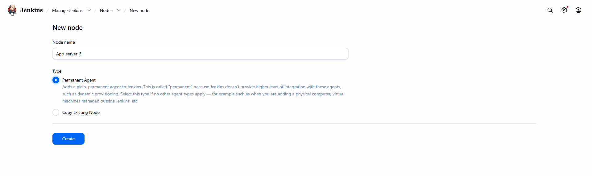
</div>

<div style="border:1px solid #ccc; padding:10px; border-radius:10px; box-shadow:2px 2px 8px rgba(0,0,0,0.2); display:inline-block;">
  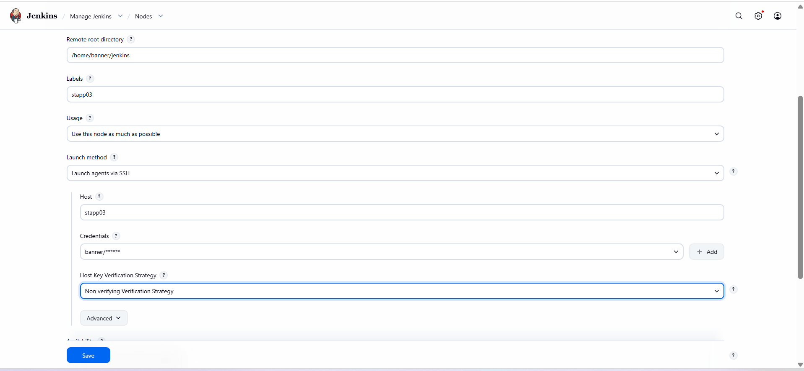
</div>


---

## 9. Encountered Agent Connection Failure

After creating the nodes, Jenkins failed to connect to the agents.

<div style="border:1px solid #ccc; padding:10px; border-radius:10px; box-shadow:2px 2px 8px rgba(0,0,0,0.2); display:inline-block;">
  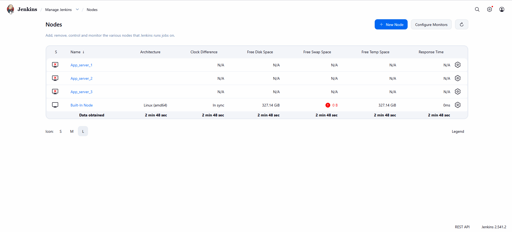
</div>

Error message:

```text
UnsupportedClassVersionError

hudson/remoting/Launcher has been compiled by a more recent version of the Java Runtime (class file version 61.0)

this version of the Java Runtime only recognizes class file versions up to 55.0

```
<div style="border:1px solid #ccc; padding:10px; border-radius:10px; box-shadow:2px 2px 8px rgba(0,0,0,0.2); display:inline-block;">
  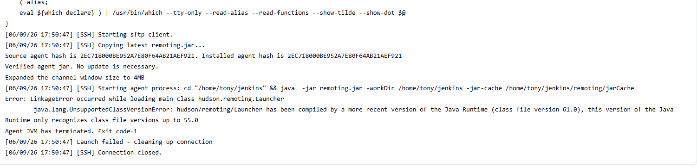
</div>

### Understanding the Error

| Class Version | Java Version |
| ------------- | ------------ |
| 61            | Java 17      |
| 55            | Java 11      |

This indicated that the Jenkins controller was using Java 17 while the remote agents were still running Java 11.

Because Jenkins Remoting requires a compatible Java version, the agents could not start.

---

## 10. Installed Java 17 on App Server 1

Connected to the server:

```bash
ssh tony@stapp01
sudo su -
```

Installed Java 17:

```bash
yum install -y java-17-openjdk
```

Verified:

```bash
java --version
```

Output:

```text
openjdk 17.0.18
```

<div style="border:1px solid #ccc; padding:10px; border-radius:10px; box-shadow:2px 2px 8px rgba(0,0,0,0.2); display:inline-block;">
  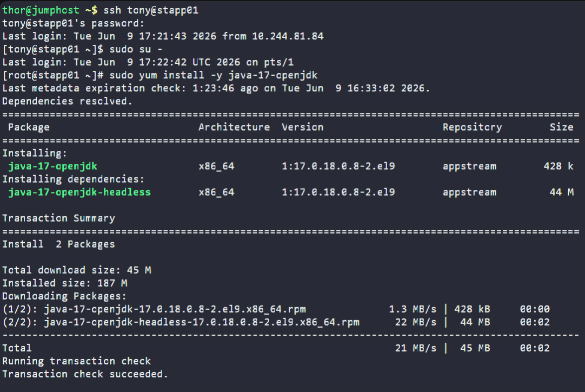
</div>

<div style="border:1px solid #ccc; padding:10px; border-radius:10px; box-shadow:2px 2px 8px rgba(0,0,0,0.2); display:inline-block;">
  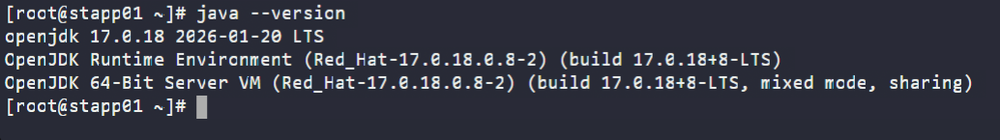
</div>


---

## 11. Installed Java 17 on App Server 2

Connected:

```bash
ssh steve@stapp02
sudo su -
```

Installed Java 17:

```bash
yum install -y java-17-openjdk
```

Verified:

```bash
java --version
```

Output:

```text
openjdk 17.0.18
```

<div style="border:1px solid #ccc; padding:10px; border-radius:10px; box-shadow:2px 2px 8px rgba(0,0,0,0.2); display:inline-block;">
  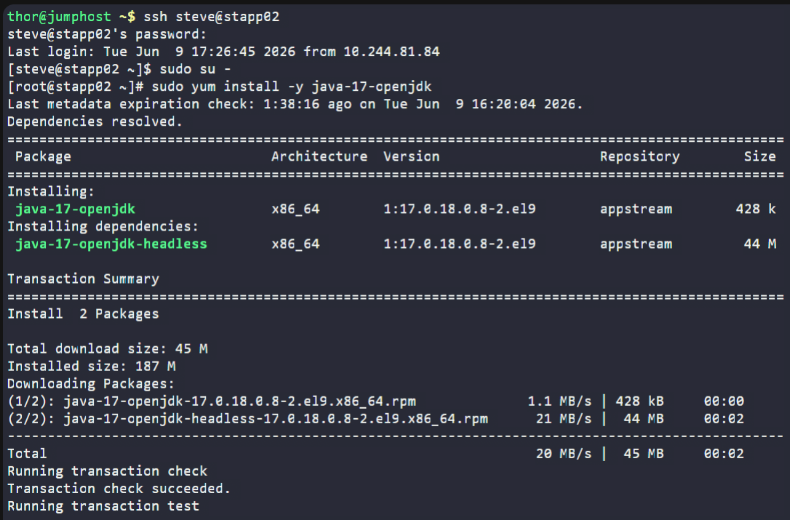
</div>

<div style="border:1px solid #ccc; padding:10px; border-radius:10px; box-shadow:2px 2px 8px rgba(0,0,0,0.2); display:inline-block;">
  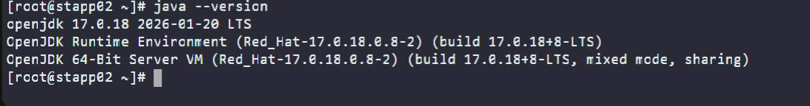
</div>

---

## 12. Installed Java 17 on App Server 3

Connected:

```bash
ssh banner@stapp03
sudo su -
```

Installed Java 17:

```bash
yum install -y java-17-openjdk
```

Verified:

```bash
java --version
```

Output:

```text
openjdk 17.0.18
```
<div style="border:1px solid #ccc; padding:10px; border-radius:10px; box-shadow:2px 2px 8px rgba(0,0,0,0.2); display:inline-block;">
  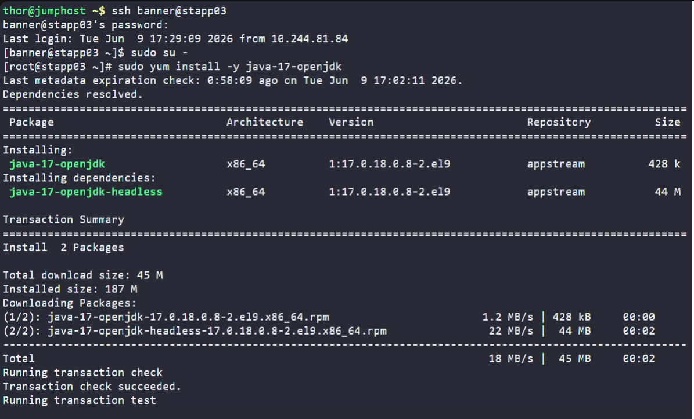
</div>

<div style="border:1px solid #ccc; padding:10px; border-radius:10px; box-shadow:2px 2px 8px rgba(0,0,0,0.2); display:inline-block;">
  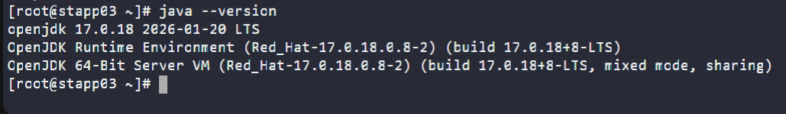
</div>

---

## 13. Verified Jenkins Agent Connectivity

After upgrading Java on all application servers, Jenkins automatically reconnected to the agents.

All nodes displayed:

```text
Online
```

Verified nodes:

```text
App_server_1
App_server_2
App_server_3
```

All agents were successfully connected.

<div style="border:1px solid #ccc; padding:10px; border-radius:10px; box-shadow:2px 2px 8px rgba(0,0,0,0.2); display:inline-block;">
  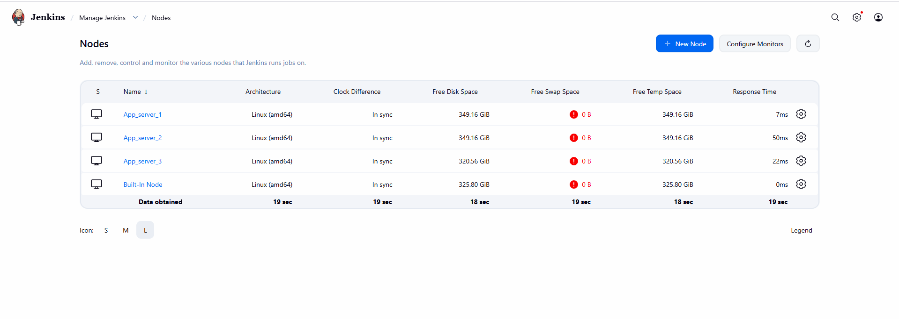
</div>

---

## 14. Created a Test Job

To verify the agent functionality, I created a Freestyle Project.

### Job Name

```text
testingNode
```

Selected:

```text
Freestyle Project
```

<div style="border:1px solid #ccc; padding:10px; border-radius:10px; box-shadow:2px 2px 8px rgba(0,0,0,0.2); display:inline-block;">
  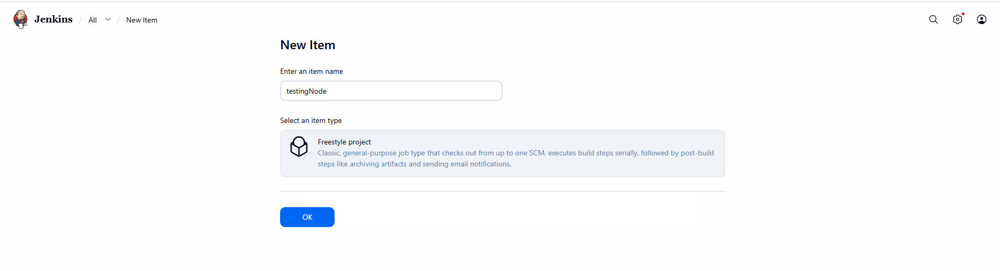
</div>


---

## 15. Restricted Job to App_server_1

Under General:

Enabled:

```text
Restrict where this project can be run
```

Label Expression:

```text
stapp01
```

This ensured the job would execute only on App_server_1.

<div style="border:1px solid #ccc; padding:10px; border-radius:10px; box-shadow:2px 2px 8px rgba(0,0,0,0.2); display:inline-block;">
  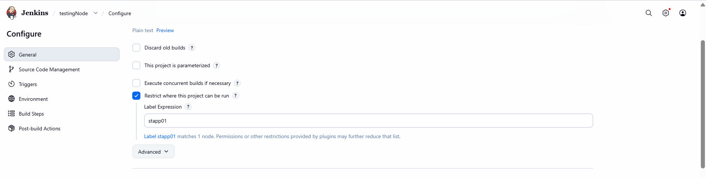
</div>


---

## 16. Added Build Step

Added:

```text
Build
→ Execute Shell
```

Script:

```bash
echo "Testing App_server_1"
hostname
whoami
pwd
java -version
```

Saved the job.

<div style="border:1px solid #ccc; padding:10px; border-radius:10px; box-shadow:2px 2px 8px rgba(0,0,0,0.2); display:inline-block;">
  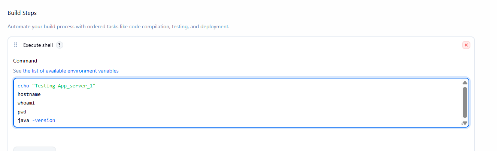
</div>

---

## 17. Triggered the Build

Opened:

```text
testingNode
→ Build Now
```

Jenkins started executing the job on App_server_1.

<div style="border:1px solid #ccc; padding:10px; border-radius:10px; box-shadow:2px 2px 8px rgba(0,0,0,0.2); display:inline-block;">
  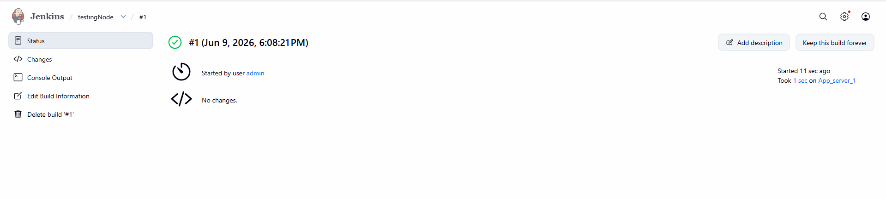
</div>

---

## 18. Verified Build Success

Opened:

```text
Build History
→ #1
→ Console Output
```

Output:

```text
Started by user admin

Running as SYSTEM

Building remotely on App_server_1 (stapp01)

workspace:
/home/tony/jenkins/workspace/testingNode

Testing App_server_1

hostname
stapp01

whoami
tony

pwd
/home/tony/jenkins/workspace/testingNode

java -version

openjdk version "17.0.18"

Finished: SUCCESS
```

This confirmed that Jenkins successfully executed the job on the remote agent.

<div style="border:1px solid #ccc; padding:10px; border-radius:10px; box-shadow:2px 2px 8px rgba(0,0,0,0.2); display:inline-block;">
  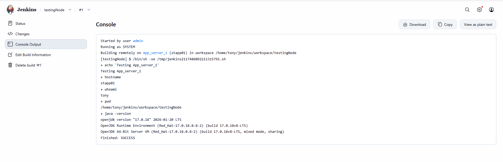
</div>

---

## 🔹 Simple Explanation of Jenkins Components Used

## Jenkins Agents (Slave Nodes)

Jenkins agents are remote machines that execute build jobs on behalf of the Jenkins controller.

Benefits:

* Distribute workloads
* Improve scalability
* Run jobs on specific servers
* Isolate build environments

In this task:

```text
App_server_1
App_server_2
App_server_3
```

were configured as SSH agents.

---

## Jenkins Credentials

Credentials provide a secure way to store authentication details.

In this task:

```text
tony / Ir0nM@n
steve / Am3ric@
banner / BigGr33n
```

were stored securely and used by Jenkins to connect via SSH.

---

## SSH Build Agents Plugin

This plugin enables Jenkins to:

* Connect to remote servers
* Transfer the Jenkins agent files
* Launch agents remotely
* Execute jobs through SSH

Without this plugin, Jenkins cannot manage SSH-based build agents.

---

## Labels

Labels help direct jobs to specific agents.

Examples:

```text
stapp01
stapp02
stapp03
```

A job can be restricted to a particular server by specifying its label.

---

## Remote Root Directory

This is the working directory used by Jenkins on the agent.

Examples:

```text
/home/tony/jenkins
/home/steve/jenkins
/home/banner/jenkins
```

Jenkins stores:

* Workspace files
* Build artifacts
* Temporary build data

inside these directories.

---

## Java Requirement for Jenkins Agents

Jenkins agents require a compatible Java version to run the Jenkins Remoting process.

In this task:

```text
Java 11
```

caused the connection failure because Jenkins was expecting:

```text
Java 17
```

Upgrading the agents to Java 17 resolved the issue.

---

## 🔹 My Understanding

This task gave me practical experience with Jenkins distributed build architecture. I learned how Jenkins controllers communicate with remote agents over SSH, how credentials and labels are used to manage agent execution, and how Java compatibility plays a critical role in Jenkins agent connectivity. 

---

## 🔹 What I Found Interesting

What I found most interesting was how Jenkins automatically deploys and manages its remoting agent on remote servers using SSH. The troubleshooting aspect was particularly valuable because the agent connection initially failed due to a Java version mismatch. By understanding the class version error and upgrading Java from version 11 to version 17 on all application servers, I was able to restore connectivity and successfully execute jobs remotely. This demonstrated how important environment compatibility is when managing distributed Jenkins infrastructure.

* * *

### Topics Covered

- ***Jenkins***
- ***Jenkins Slave Nodes (Agents)***
- ***JSSH Build Agents***
- ***Jenkins Credentials***
- ***Distributed Builds***
- ***Java 17***
- ***Jenkins Node Management***
- ***Jenkins Credentials***
- ***execute shell commands***


**Previous Task**: [Day 74: Jenkins Database Backup Job](../Day_74/day_74.md)

**Next Task**: [Day 76: Jenkins Project Security](../Day_76/day_76.md)