# Day 76: Jenkins Project Security

<div style="border:1px solid #ccc; padding:10px; border-radius:10px; box-shadow:2px 2px 8px rgba(0,0,0,0.2); display:inline-block;">
  
</div>

## Content

>Today I worked on configuring **project-level security in Jenkins** by granting specific permissions to individual users on an existing Jenkins job. The objective was to provide controlled access to a project while ensuring that global Jenkins security settings remained unchanged.

* * *

## 🔹 What I Learned

*   Jenkins Authorization Strategies
    
*   Project-Based Security in Jenkins
    
*   Matrix Authorization Strategy Plugin
    
*   User Permission Management
    
*   Job-Level Access Control
    
*   Jenkins Security Inheritance
      
*   Restricting User Actions on Jenkins Jobs
    
*   Applying Least Privilege Security Principles
    

* * *

## 🔹 Task Requirement

<div style="border:1px solid #ccc; padding:10px; border-radius:10px; box-shadow:2px 2px 8px rgba(0,0,0,0.2); display:inline-block;">
  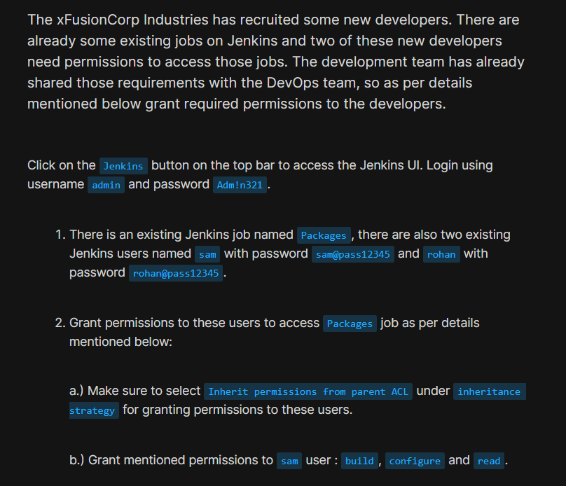
</div>

<div style="border:1px solid #ccc; padding:10px; border-radius:10px; box-shadow:2px 2px 8px rgba(0,0,0,0.2); display:inline-block;">
  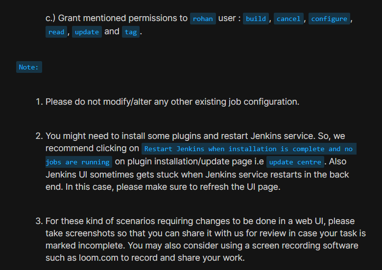
</div>

The xFusionCorp Industries team recruited new developers who needed controlled access to an existing Jenkins job named **Packages**.

The requirement was to grant different permissions to two existing Jenkins users without modifying any other job configurations.

### Jenkins Access Details

| Field | Value |
| --- | --- |
| Username | admin |
| Password | Adm!n321 |

### Existing Jenkins Job

| Job Name |
| --- |
| Packages |

### Existing Users

| User | Password |
| --- | --- |
| sam | sam@pass12345 |
| rohan | rohan@pass12345 |

### Required Permissions

#### User: sam

| Permission |
| --- |
| Read |
| Build |
| Configure |

#### User: rohan

| Permission |
| --- |
| Read |
| Build |
| Cancel |
| Configure |
| Update |
| Tag |

### Additional Requirement

The project must use:

```text
Inherit permissions from parent ACL
```

as the inheritance strategy.

* * *

# 🔹 Steps I Followed

## 1\. Accessed Jenkins

Clicked the Jenkins button from the lab navigation bar.

This opened the Jenkins login page.
<div style="border:1px solid #ccc; padding:10px; border-radius:10px; box-shadow:2px 2px 8px rgba(0,0,0,0.2); display:inline-block;">
  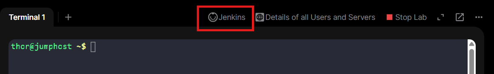
</div>

* * *

## 2\. Logged Into Jenkins

Used the administrator credentials:

### Username

```text
admin
```

### Password

```text
Adm!n321
```

<div style="border:1px solid #ccc; padding:10px; border-radius:10px; box-shadow:2px 2px 8px rgba(0,0,0,0.2); display:inline-block;">
  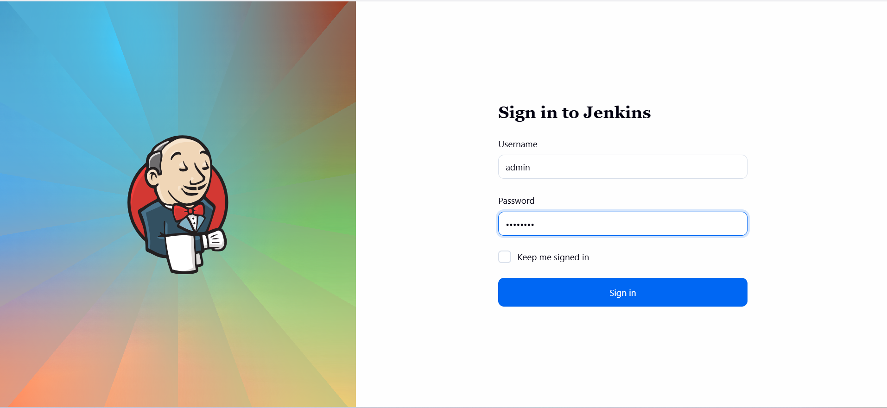
</div>


Successfully logged into the Jenkins Dashboard.

* * *

## 3\. Installed Required Plugin

To enable project-level security management, I navigated to:

```text
Manage Jenkins
→ Plugins
```

Searched for and installed:

```text
Matrix Authorization Strategy
```

This plugin provides fine-grained permission control for Jenkins users and jobs.

<div style="border:1px solid #ccc; padding:10px; border-radius:10px; box-shadow:2px 2px 8px rgba(0,0,0,0.2); display:inline-block;">
  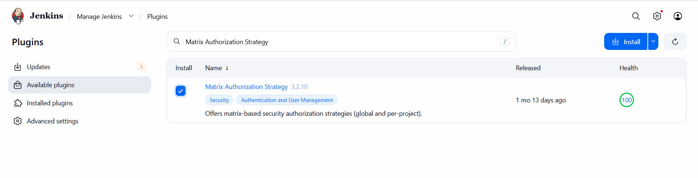
</div>

<div style="border:1px solid #ccc; padding:10px; border-radius:10px; box-shadow:2px 2px 8px rgba(0,0,0,0.2); display:inline-block;">
  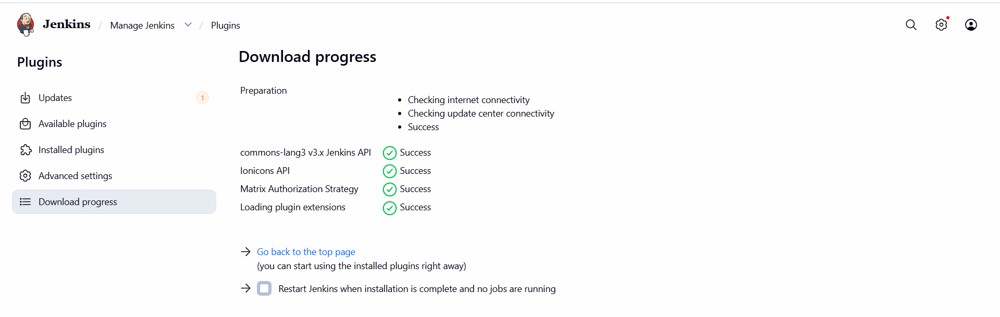
</div>


After installation completed, Jenkins prompted for a restart.

* * *

## 4\. Restarted Jenkins

Navigated to:

```text
Manage Jenkins
→ Restart Jenkins
```
<div style="border:1px solid #ccc; padding:10px; border-radius:10px; box-shadow:2px 2px 8px rgba(0,0,0,0.2); display:inline-block;">
  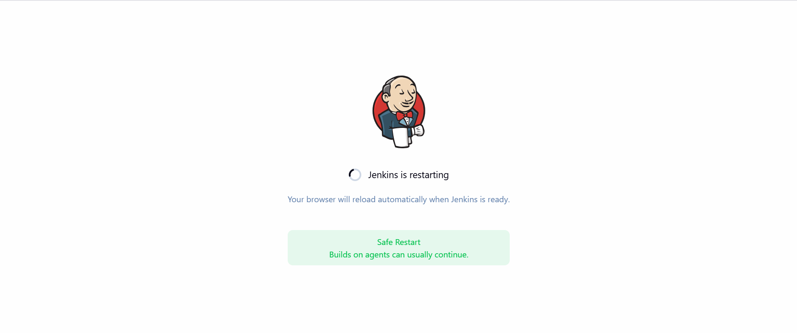
</div>

Waited for Jenkins to restart successfully.

Sometimes the Jenkins UI became temporarily unavailable during restart, so I refreshed the browser page and logged in again.

* * *

## 5\. Logged Back Into Jenkins

Used the same administrator credentials:

```text
Username: admin
Password: Adm!n321
```
<div style="border:1px solid #ccc; padding:10px; border-radius:10px; box-shadow:2px 2px 8px rgba(0,0,0,0.2); display:inline-block;">
  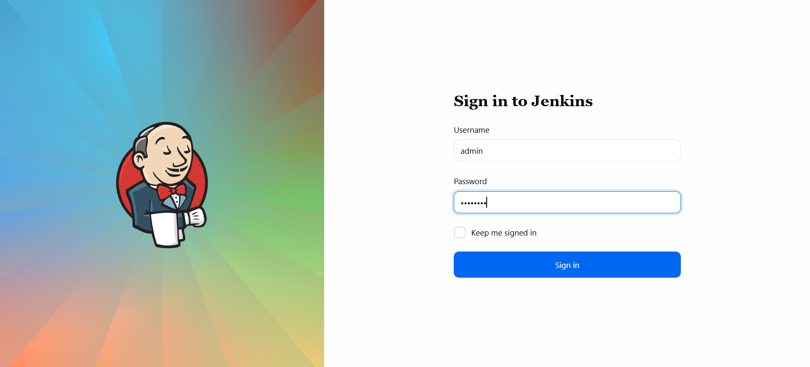
</div>

Successfully accessed the Jenkins Dashboard.

* * *

## 6\. Enabled Project-Based Matrix Authorization

Navigated to:

```text
Manage Jenkins
→ Security
```
<div style="border:1px solid #ccc; padding:10px; border-radius:10px; box-shadow:2px 2px 8px rgba(0,0,0,0.2); display:inline-block;">
  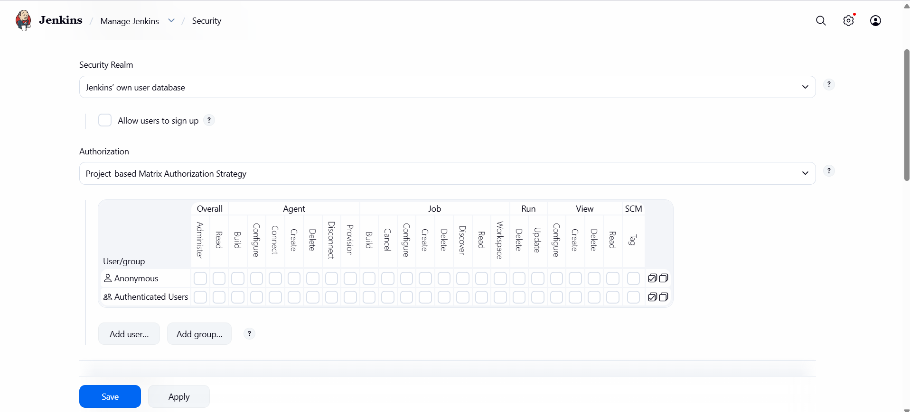
</div>
Under Authorization settings, selected:

```text
Project-based Matrix Authorization Strategy
```
Important observations:

*   Existing permissions for Anonymous users were left unchanged.
    
*   Existing permissions for Authenticated users were left unchanged.
    
*   No global permissions were modified.
    

Clicked:

```text
Apply
Save
```

This enabled project-level permission management without affecting existing Jenkins security settings.

* * *

## 7\. Opened Packages Job Configuration

Navigated to:

```text
Jenkins Dashboard
→ Packages
→ Configure
```
<div style="border:1px solid #ccc; padding:10px; border-radius:10px; box-shadow:2px 2px 8px rgba(0,0,0,0.2); display:inline-block;">
  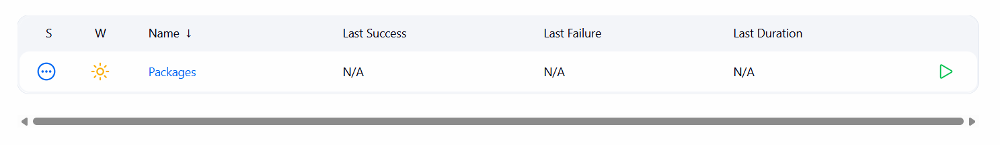
</div>

Opened the configuration page of the existing job.

* * *

## 8\. Enabled Project-Based Security

Inside the General section of the job configuration, enabled:

```text
Enable project-based security
```

This allows permissions to be assigned specifically for this job.

* * *

## 9\. Configured Inheritance Strategy

Under project security settings, selected:

```text
Inherit permissions from parent ACL
```
<div style="border:1px solid #ccc; padding:10px; border-radius:10px; box-shadow:2px 2px 8px rgba(0,0,0,0.2); display:inline-block;">
  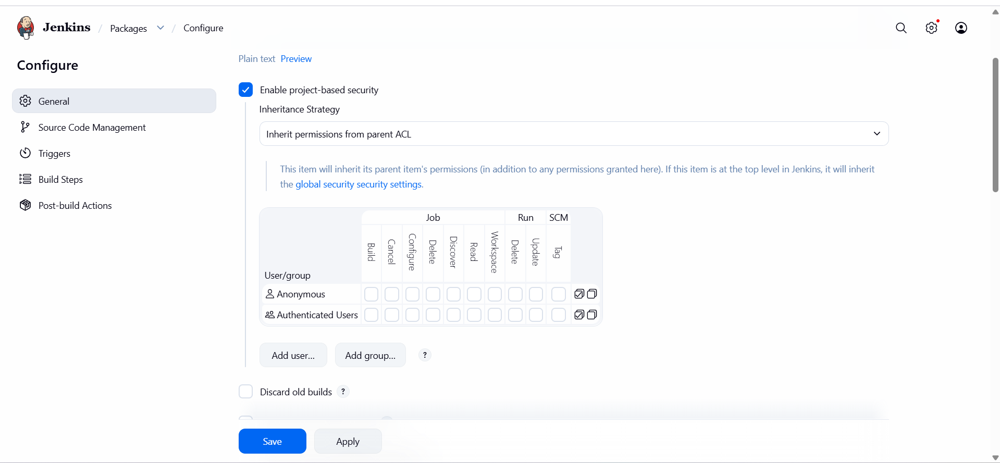
</div>

This ensures the job inherits global Jenkins permissions while allowing additional project-specific permissions to be assigned.

This was a mandatory requirement of the task.

* * *

## 10\. Added Permissions for User sam

Added the existing Jenkins user:

```text
sam
```
<div style="border:1px solid #ccc; padding:10px; border-radius:10px; box-shadow:2px 2px 8px rgba(0,0,0,0.2); display:inline-block;">
  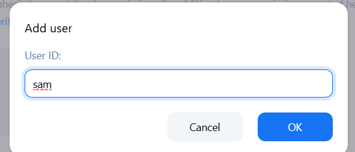
</div>

Granted the following permissions:

| Permission | Granted |
| --- | --- |
| Read | ✓ |
| Build | ✓ |
| Configure | ✓ |

This allows sam to:

*   View the job
    
*   Trigger builds
    
*   Modify job configuration

<div style="border:1px solid #ccc; padding:10px; border-radius:10px; box-shadow:2px 2px 8px rgba(0,0,0,0.2); display:inline-block;">
  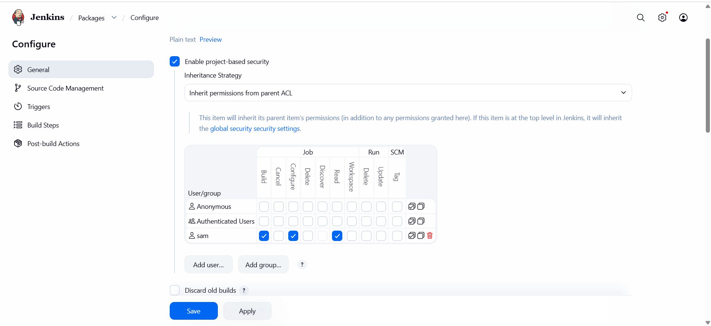
</div>


* * *

## 11\. Added Permissions for User rohan

Added the existing Jenkins user:

```text
rohan
```
<div style="border:1px solid #ccc; padding:10px; border-radius:10px; box-shadow:2px 2px 8px rgba(0,0,0,0.2); display:inline-block;">
  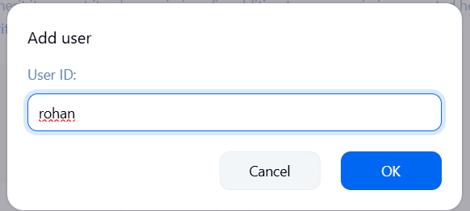
</div>

Granted the following permissions:

| Permission | Granted |
| --- | --- |
| Read | ✓ |
| Build | ✓ |
| Cancel | ✓ |
| Configure | ✓ |
| Update | ✓ |
| Tag | ✓ |

This allows rohan to:

*   View the job
    
*   Trigger builds
    
*   Stop running builds
    
*   Modify job configuration
    
*   Update job metadata
    
*   Create and manage build tags
    
<div style="border:1px solid #ccc; padding:10px; border-radius:10px; box-shadow:2px 2px 8px rgba(0,0,0,0.2); display:inline-block;">
  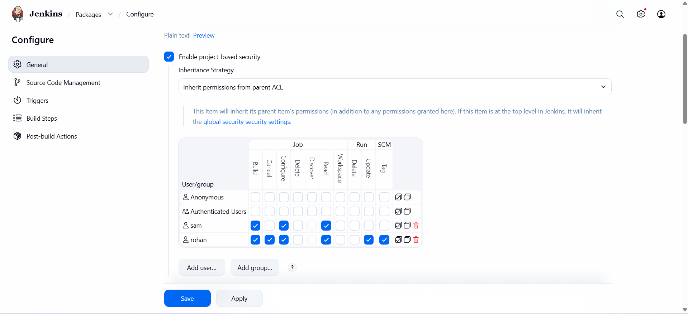
</div>


* * *

## 12\. Saved the Configuration

After verifying all permissions, clicked:

```text
Save
```

The Packages job was updated successfully.

* * *

## 13\. Verified Configuration

Reviewed the project security settings to confirm:

### Inheritance Strategy

```text
Inherit permissions from parent ACL
```

### User sam

```text
Read
Build
Configure
```

### User rohan

```text
Read
Build
Cancel
Configure
Update
Tag
```

All permissions matched the task requirements.

* * *

# 🔹 Final Permission Matrix

| Permission | sam | rohan |
| --- | --- | --- |
| Read | ✓ | ✓ |
| Build | ✓ | ✓ |
| Cancel | ✗ | ✓ |
| Configure | ✓ | ✓ |
| Update | ✗ | ✓ |
| Tag | ✗ | ✓ |

* * *

# 🔹 Simple Explanation of Jenkins Components Used

## Matrix Authorization Strategy

The Matrix Authorization Strategy plugin provides fine-grained access control within Jenkins.

Instead of granting broad administrator permissions, specific actions can be assigned to individual users.

Examples:

*   Read
    
*   Build
    
*   Configure
    
*   Delete
    
*   Cancel
    
*   Tag
    
*   Update
    

This improves security by following the principle of least privilege.

* * *

## Project-Based Security

Project-based security allows permissions to be applied to a specific Jenkins job rather than globally.

Benefits:

*   Better access control
    
*   Improved security
    
*   Team-specific permissions
    
*   Reduced risk of accidental changes
    

In this task, permissions were assigned only to the Packages job.

* * *

## Inheritance Strategy

Inheritance determines how a job receives permissions from Jenkins.

The selected option:

```text
Inherit permissions from parent ACL
```

means:

*   Global permissions remain available.
    
*   Additional job-specific permissions can be granted.
    
*   Existing security configurations remain intact.
    

* * *

## Build Permission

Allows a user to:

*   Start builds manually
    
*   Trigger job execution
    

In this task:

```text
sam
rohan
```

were both granted Build permission.

* * *

## Configure Permission

Allows a user to:

*   Edit job settings
    
*   Modify build steps
    
*   Change job configuration
    

Both users received Configure permission.

* * *

## Cancel Permission

Allows a user to:

*   Stop a running build
    

Only:

```text
rohan
```

received this permission.

* * *

## Update Permission

Allows a user to:

*   Update job-related information
    

Only:

```text
rohan
```

received this permission.

* * *

## Tag Permission

Allows a user to:

*   Create and manage build tags
    

Only:

```text
rohan
```

received this permission.

* * *

# 🔹 My Understanding

This task gave me hands-on experience with Jenkins security management and project-level authorization. I learned how the Matrix Authorization Strategy plugin enables granular access control and how project-based security can be used to grant different permissions to different users on the same job. 

* * *

# 🔹 What I Found Interesting

What I found most interesting was how Jenkins allows security to be managed at both the global and project levels. By enabling Project-based Matrix Authorization, I was able to grant precise permissions to individual developers without affecting other jobs or users. 

* * *

### Topics Covered

- ***Jenkins***
- ***Jenkins Security***
- ***Project-Based Matrix Authorization***
- ***Matrix Authorization Strategy Plugin***
- ***Project-Level Access Control***
- ***User Permission Management***

**Previous Task**: [Day 75: Jenkins Slave Nodes](../Day_75/day_75.md)

**Next Task**: [Day 77: Jenkins Deploy Pipeline](../Day_77/day_77.md)