# Day 77: Jenkins Deploy Pipeline

<div style="border:1px solid #ccc; padding:10px; border-radius:10px; box-shadow:2px 2px 8px rgba(0,0,0,0.2); display:inline-block;">
  
</div>

## Content

> Today I worked on creating a Jenkins Pipeline job to automate the deployment of a static website for xFusionCorp Industries. The objective was to fetch the latest code from a Git repository hosted on Gitea and deploy it automatically to an Apache web server running on an application server.

* * *

## 🔹 What I Learned

*   Installing and Managing Jenkins Plugins
    
*   Configuring Jenkins SSH Agents
    
*   Creating and Managing Jenkins Credentials
    
*   Connecting Jenkins with Remote Linux Servers
    
*   Setting Up Jenkins Pipeline Jobs
    
*   Using Declarative Pipeline Syntax
    
*   Cloning Git Repositories in Jenkins
    
*   Executing Shell Commands Through Jenkins Agents
    
*   Deploying Static Websites to Apache Web Servers
    
*   Understanding Jenkins Agent Labels
    
*   Automating Application Deployment
    

* * *

## 🔹 Task Requirement

The DevOps team at xFusionCorp Industries needed a Jenkins Pipeline to deploy a static website hosted in a Git repository. The latest application code had to be pulled from Gitea and deployed directly to the document root of Apache running on App Server 1.

### Jenkins Access Details

| Field | Value |
| --- | --- |
| Username | admin |
| Password | Adm!n321 |

### Gitea Access Details

| Field | Value |
| --- | --- |
| Username | sarah |
| Password | Sarah\_pass123 |

### Deployment Requirements

| Requirement | Value |
| --- | --- |
| Pipeline Job | devops-webapp-job |
| Agent Label | stapp01 |
| Agent Name | App Server |
| Repository | web\_app |
| Deployment Path | /var/www/html |
| Pipeline Stage | Deploy |

* * *

## 🔹 Steps I Followed

### 1\. Accessed Jenkins Web Interface

Clicked the Jenkins button available in the lab environment.

This opened the Jenkins login page.

* * *

### 2\. Logged into Jenkins

Entered the administrator credentials:

**Username**

```text
admin
```

**Password**

```text
Adm!n321
```

Successfully logged into the Jenkins Dashboard.

<div style="border:1px solid #ccc; padding:10px; border-radius:10px; box-shadow:2px 2px 8px rgba(0,0,0,0.2); display:inline-block;">
  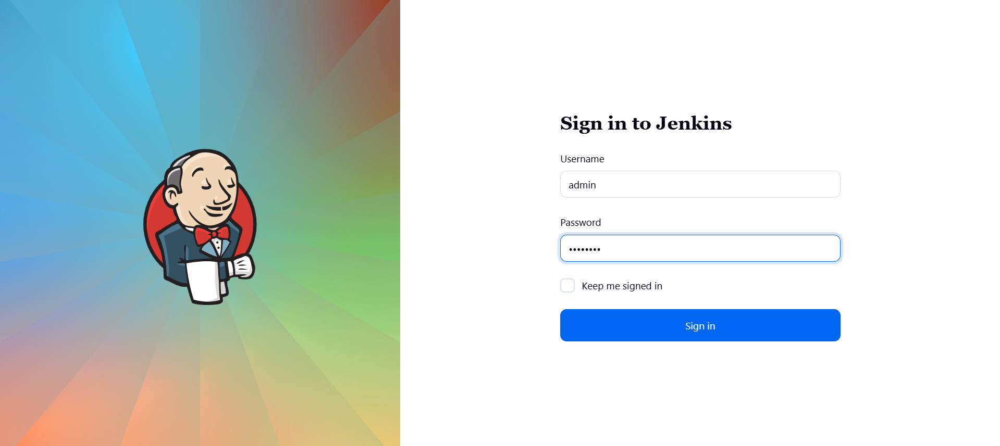
</div>

* * *

### 3\. Installed Required Plugins

Navigated to:

```text
Manage Jenkins
→ Plugins
```

Installed the following plugins:

*   SSH Build Agents
    
*   Pipeline
    

After installation:

*   Restarted Jenkins
    
*   Refreshed the browser
    
*   Logged in again

<div style="border:1px solid #ccc; padding:10px; border-radius:10px; box-shadow:2px 2px 8px rgba(0,0,0,0.2); display:inline-block;">
  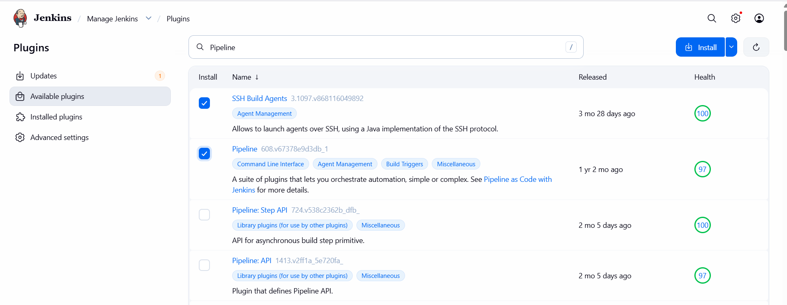
</div>  

<div style="border:1px solid #ccc; padding:10px; border-radius:10px; box-shadow:2px 2px 8px rgba(0,0,0,0.2); display:inline-block;">
  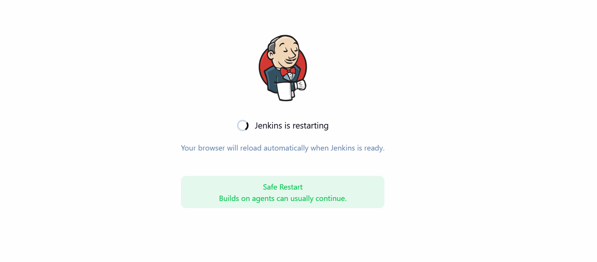
</div>

* * *

### 4\. Added Jenkins Credentials

Navigated to:

```text
Manage Jenkins
→ Credentials
→ System
→ Global Credentials
→ Add Credentials
```
<div style="border:1px solid #ccc; padding:10px; border-radius:10px; box-shadow:2px 2px 8px rgba(0,0,0,0.2); display:inline-block;">
  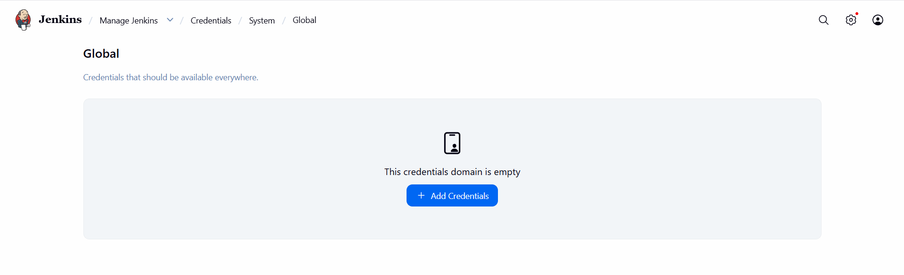
</div>

<div style="border:1px solid #ccc; padding:10px; border-radius:10px; box-shadow:2px 2px 8px rgba(0,0,0,0.2); display:inline-block;">
  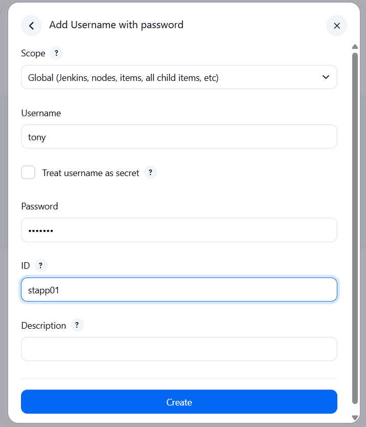
</div>

Configured:

| Field | Value |
| --- | --- |
| Kind | Username with Password |
| Username | tony |
| Password | Ir0nM@n |
| ID | stapp01 |

Saved the credentials.

* * *

### 5\. Connected to App Server 1

From the jump host:

```bash
ssh tony@stapp01
```

Authenticated using:

```text
Ir0nM@n
```
<div style="border:1px solid #ccc; padding:10px; border-radius:10px; box-shadow:2px 2px 8px rgba(0,0,0,0.2); display:inline-block;">
  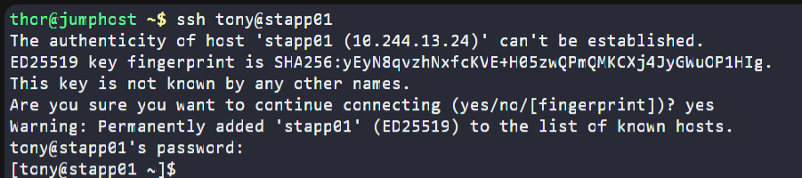
</div>

* * *

### 6\. Installed Java on the Application Server

Since Jenkins agents require Java, I installed OpenJDK 17:

```bash
sudo yum install java-17-openjdk -y
```

Installation completed successfully.

<div style="border:1px solid #ccc; padding:10px; border-radius:10px; box-shadow:2px 2px 8px rgba(0,0,0,0.2); display:inline-block;">
  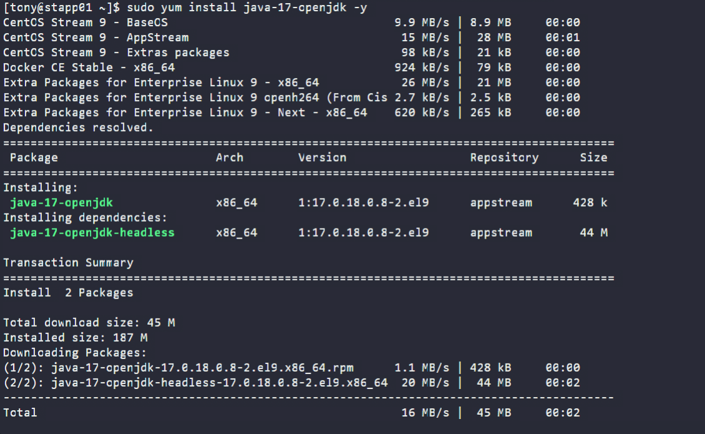
</div>

* * *

### 7\. Fixed Directory Ownership

The repository was already present under:

```text
/var/www/html
```

To prevent Jenkins agent launch failures, I changed ownership of the web directory:

```bash
cd /var/www
sudo chown -R tony html/
```

Verified:

```bash
ls -l
```

Output:

```text
drwxr-xr-x 1 tony sarah 4096 html
```
<div style="border:1px solid #ccc; padding:10px; border-radius:10px; box-shadow:2px 2px 8px rgba(0,0,0,0.2); display:inline-block;">
  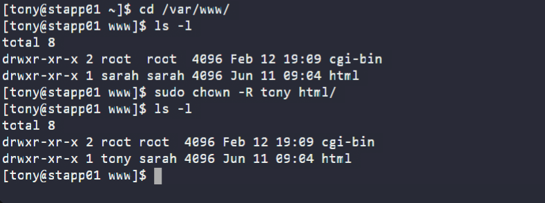
</div>

This ensured Jenkins could access and write files during deployment.

* * *

### 8\. Configured Jenkins Agent

Navigated to:

```text
Manage Jenkins
→ Nodes
→ New Node
```
<div style="border:1px solid #ccc; padding:10px; border-radius:10px; box-shadow:2px 2px 8px rgba(0,0,0,0.2); display:inline-block;">
  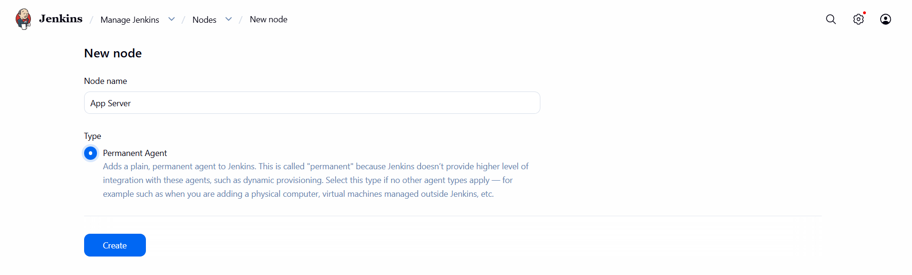
</div>

Configured the agent:

| Field | Value |
| --- | --- |
| Name | App Server |
| Remote Root Directory | /var/www/html |
| Labels | stapp01 |
| Launch Method | Launch agents via SSH |
| Host | stapp01 |
| Credentials | stapp01 |
| Host Key Verification | Non-verifying Verification Strategy |

Saved the configuration.

Jenkins successfully connected to the remote server and launched the agent.


<div style="border:1px solid #ccc; padding:10px; border-radius:10px; box-shadow:2px 2px 8px rgba(0,0,0,0.2); display:inline-block;">
  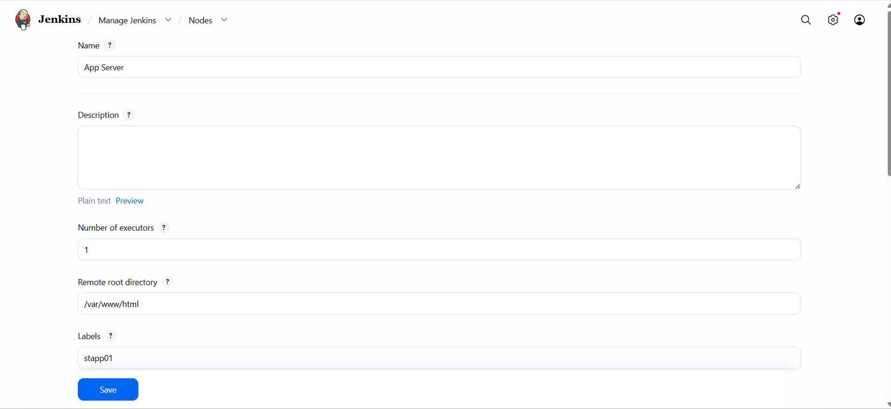
</div>

<div style="border:1px solid #ccc; padding:10px; border-radius:10px; box-shadow:2px 2px 8px rgba(0,0,0,0.2); display:inline-block;">
  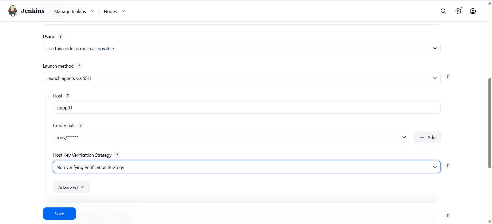
</div>

* * *

### 9\. Retrieved Repository Information from Gitea

Logged into Gitea using:

<div style="border:1px solid #ccc; padding:10px; border-radius:10px; box-shadow:2px 2px 8px rgba(0,0,0,0.2); display:inline-block;">
  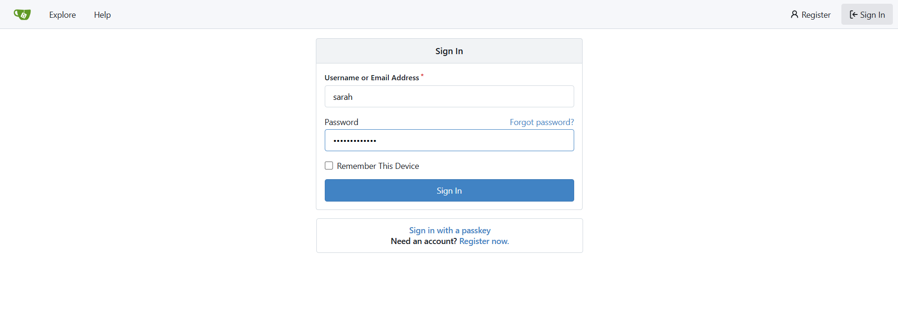
</div>

**Username**

```text
sarah
```

**Password**

```text
Sarah_pass123
```


Located the repository:

```text
web_app
```

Repository URL:

```text
https://3000-port-w7smhgyo6w2z2oy7.labs.kodekloud.com/sarah/web_app.git
```

<div style="border:1px solid #ccc; padding:10px; border-radius:10px; box-shadow:2px 2px 8px rgba(0,0,0,0.2); display:inline-block;">
  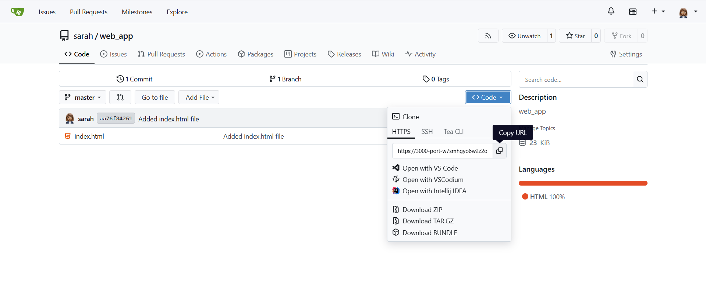
</div>

This URL would be used in the Jenkins Pipeline.

* * *

### 10\. Created Jenkins Pipeline Job

From the Jenkins Dashboard:

<div style="border:1px solid #ccc; padding:10px; border-radius:10px; box-shadow:2px 2px 8px rgba(0,0,0,0.2); display:inline-block;">
  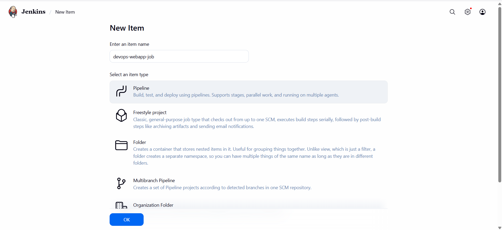
</div>

```text
New Item
```

Entered:

```text
devops-webapp-job
```

Selected:

```text
Pipeline
```

Clicked:

```text
OK
```

The Pipeline configuration page opened.

* * *

### 11\. Added Pipeline Script

Under:

```text
Pipeline
→ Definition
→ Pipeline Script
```

Added the following script:

```groovy
pipeline {
    agent { label 'stapp01' }

    stages {
        stage('Deploy') {
            steps {

                sh 'rm -rf /tmp/web_app'

                sh 'git clone https://3000-port-w7smhgyo6w2z2oy7.labs.kodekloud.com/sarah/web_app.git /tmp/web_app'

                sh 'ls -la /tmp/web_app'

                sh 'echo "Ir0nM@n" | sudo -S cp -r /tmp/web_app/* /var/www/html/'

                sh 'rm -rf /tmp/web_app'
            }
        }
    }
}
```

<div style="border:1px solid #ccc; padding:10px; border-radius:10px; box-shadow:2px 2px 8px rgba(0,0,0,0.2); display:inline-block;">
  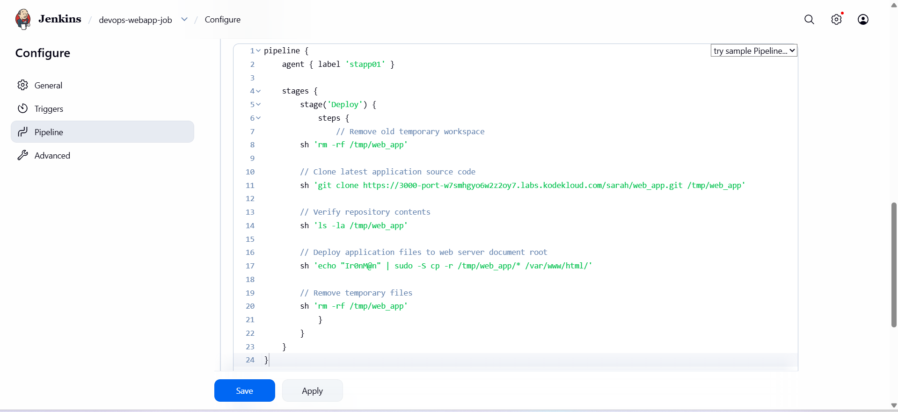
</div>

* * *

### 12\. Understanding the Pipeline

#### Agent Section

```groovy
agent { label 'stapp01' }
```

Ensures the pipeline runs on the configured App Server agent.

* * *

#### Deploy Stage

```groovy
stage('Deploy')
```

Creates the required deployment stage.

The task specifically required the stage name to be:

```text
Deploy
```

(case-sensitive)

* * *

#### Remove Existing Temporary Files

```bash
rm -rf /tmp/web_app
```

Ensures a clean deployment workspace.

* * *

#### Clone Latest Source Code

```bash
git clone <repository-url> /tmp/web_app
```

Downloads the latest application source code.

* * *

#### Verify Repository Content

```bash
ls -la /tmp/web_app
```

Confirms repository files were cloned successfully.

* * *

#### Deploy Website Files

```bash
sudo cp -r /tmp/web_app/* /var/www/html/
```

Copies application files into Apache's document root.

* * *

#### Cleanup

```bash
rm -rf /tmp/web_app
```

Removes temporary deployment files.

* * *

### 13\. Saved the Job

Clicked:

```text
Apply
```

Then:

```text
Save
```

The Pipeline job was successfully created.

* * *

### 14\. Triggered the Pipeline

Opened:

```text
devops-webapp-job
→ Build Now
```

Jenkins immediately started executing the deployment.

<div style="border:1px solid #ccc; padding:10px; border-radius:10px; box-shadow:2px 2px 8px rgba(0,0,0,0.2); display:inline-block;">
  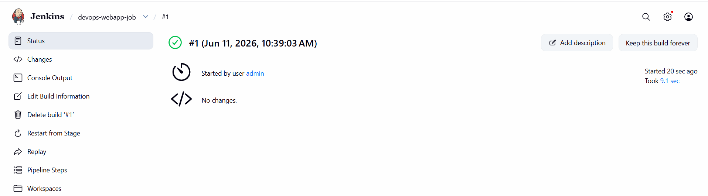
</div>

* * *

### 15\. Verified Build Success

Opened:

```text
Build History
→ Latest Build
→ Console Output
```

Observed output similar to:

```text
Cloning into '/tmp/web_app'...

+ ls -la /tmp/web_app

index.html

+ sudo cp -r /tmp/web_app/* /var/www/html/

Finished: SUCCESS
```

This confirmed the deployment completed successfully.

<div style="border:1px solid #ccc; padding:10px; border-radius:10px; box-shadow:2px 2px 8px rgba(0,0,0,0.2); display:inline-block;">
  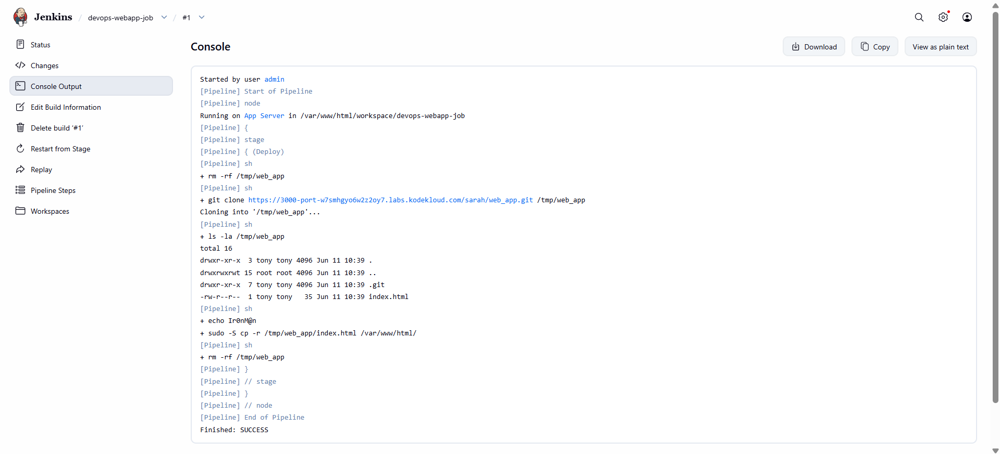
</div>

* * *

### 16\. Verified Application Deployment

Clicked the:

```text
App
```

button available in the lab environment.

The application loaded successfully.

Output:

```text
Welcome to xFusionCorp Industries!
```

This confirmed that the website was being served directly from:

```text
/var/www/html
```
<div style="border:1px solid #ccc; padding:10px; border-radius:10px; box-shadow:2px 2px 8px rgba(0,0,0,0.2); display:inline-block;">
  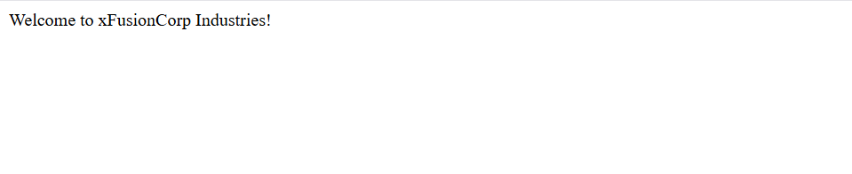
</div>

and not from a subdirectory.

* * *

## 🔹 Simple Explanation of Jenkins Components Used

### Jenkins Agent

A Jenkins Agent is a remote machine that executes build and deployment jobs.

In this task:

```text
App Server 1
```

acted as the Jenkins Agent.

* * *

### Labels

Labels help Jenkins determine where a job should run.

Example:

```groovy
agent {
    label 'stapp01'
}
```

This ensures the pipeline executes only on the specified server.

* * *

### Pipeline

A Pipeline defines the entire CI/CD workflow as code.

Benefits:

*   Version controlled
    
*   Repeatable
    
*   Automated
    
*   Easier to maintain
    

* * *

### Declarative Pipeline

The script used follows Jenkins Declarative Pipeline syntax.

Structure:

```groovy
pipeline {
    agent
    stages
    steps
}
```

This syntax is easier to read and maintain.

* * *

### Git Clone

```bash
git clone repository_url
```

Downloads the latest version of application source code from Git.

This guarantees deployment of the most recent changes.

* * *

### Apache Document Root

Apache serves web pages from:

```text
/var/www/html
```

Any files copied here become accessible through the web server.

* * *

### Continuous Deployment

This pipeline automates deployment by:

1.  Fetching code
    
2.  Copying files to the web server
    
3.  Publishing the latest version
    

without manual intervention.

* * *

## 🔹 My Understanding

This task helped me understand how Jenkins Pipelines can automate application deployments. By combining Git repositories, Jenkins agents, and shell commands, it becomes possible to deploy applications consistently and reliably. Using a dedicated agent also ensures deployment activities are performed directly on the target server.

* * *

## 🔹 What I Found Interesting

I found it interesting that a complete deployment workflow could be implemented with a relatively small Jenkins Pipeline. The ability to define deployment logic as code makes the process reproducible, easy to modify, and suitable for larger CI/CD implementations. It also demonstrated how Jenkins can seamlessly integrate with Git repositories and remote servers to automate application delivery.

* * *

### Topics Covered

- ***Jenkins***
- ***CI/CD Pipelines***
- ***Jenkins Agent Configuration***
- ***Git Repository Integration***
- ***Automated Application Deployment***
- ***Apache Document Root Management***

**Previous Task**: [Day 76: Jenkins Project Security](../Day_76/day_76.md)

**Next Task**: [Day 78: Jenkins Conditional Pipeline](../Day_78/day_78.md)