# Day 78: Jenkins Conditional Pipeline

<div style="border:1px solid #ccc; padding:10px; border-radius:10px; box-shadow:2px 2px 8px rgba(0,0,0,0.2); display:inline-block;">
  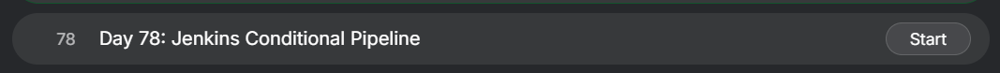
</div>

## Content

>Today I worked on creating a Jenkins Conditional Pipeline for xFusionCorp Industries. The objective was to deploy different branches of a static website repository based on a Jenkins parameter. Instead of cloning the repository during each build, the repository was already available on the target application server, and Jenkins had to switch between branches and deploy the appropriate version of the website.

---

## 🔹 What I Learned

* Jenkins Conditional Pipelines
* Jenkins Pipeline Parameters
* Configuring Jenkins SSH Agents
* Managing Jenkins Credentials
* Using Existing Git Repositories on Remote Servers
* Working with Branch-Based Deployments
* Deploying Applications Based on Runtime Parameters
* Understanding Git Branch Switching in CI/CD Pipelines
* Automating Conditional Deployments

---

## 🔹 Task Requirement

<div style="border:1px solid #ccc; padding:10px; border-radius:10px; box-shadow:2px 2px 8px rgba(0,0,0,0.2); display:inline-block;">
  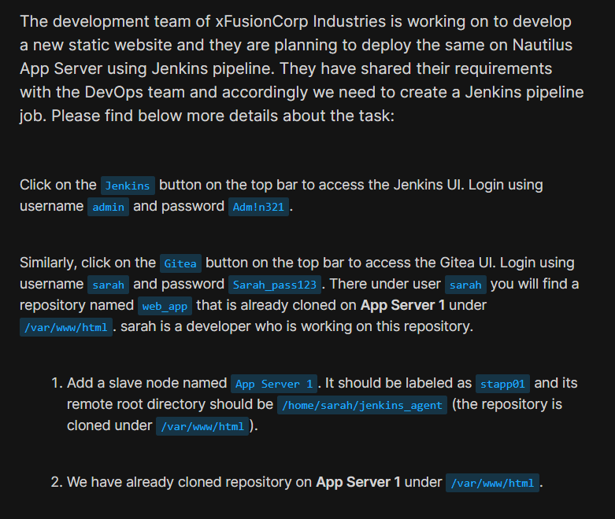
</div>

<div style="border:1px solid #ccc; padding:10px; border-radius:10px; box-shadow:2px 2px 8px rgba(0,0,0,0.2); display:inline-block;">
  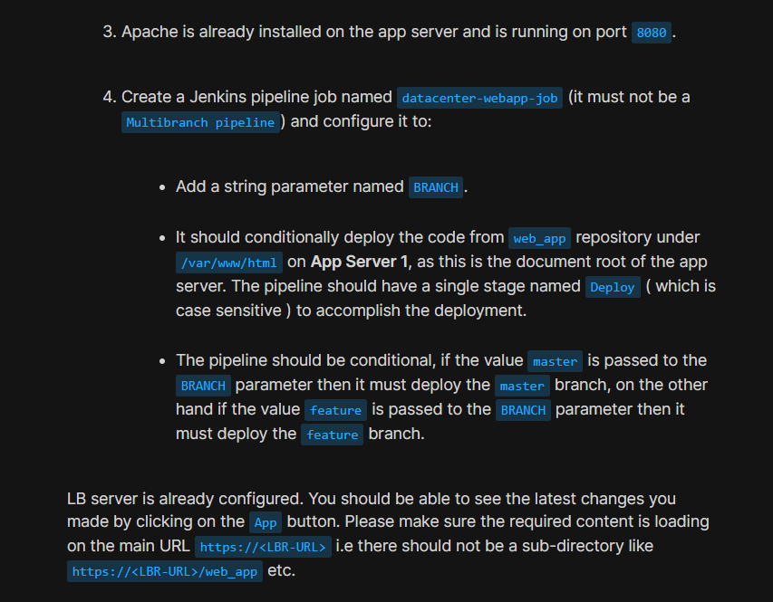
</div>

<div style="border:1px solid #ccc; padding:10px; border-radius:10px; box-shadow:2px 2px 8px rgba(0,0,0,0.2); display:inline-block;">
  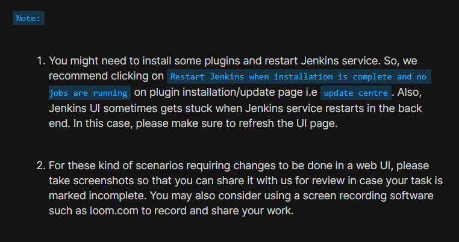
</div>

The development team at xFusionCorp Industries wanted Jenkins to deploy different versions of a static website depending on the branch selected by the user during build execution.

The repository already existed on App Server 1 under:

```bash
/var/www/html
```

The Jenkins Pipeline needed to:

* Accept a parameter named `BRANCH`
* Deploy the `master` branch when `master` is selected
* Deploy the `feature` branch when `feature` is selected
* Use a single stage named `Deploy`
* Execute deployment on App Server 1 through a Jenkins Agent

---

## Jenkins Access Details

| Field    | Value    |
| -------- | -------- |
| Username | admin    |
| Password | Adm!n321 |

---

## Gitea Access Details

| Field    | Value         |
| -------- | ------------- |
| Username | sarah         |
| Password | Sarah_pass123 |

---

## Deployment Requirements

| Requirement                 | Value                     |
| --------------------------- | ------------------------- |
| Pipeline Job                | datacenter-webapp-job     |
| Agent Name                  | App Server 1              |
| Agent Label                 | stapp01                   |
| Repository                  | web_app                   |
| Existing Repository Path    | /var/www/html             |
| Agent Remote Root Directory | /home/sarah/jenkins_agent |
| Pipeline Stage              | Deploy                    |

---

## 🔹 Steps I Followed

### 1. Verified Existing Repository on App Server

Connected to App Server 1:

```bash
ssh sarah@stapp01
```

Authenticated using:

```text
Sarah_pass123
```

Moved to the repository directory:

```bash
cd /var/www/html
```

Verified repository contents:

```bash
ls -la
```

Output:

```text
.git
feature.html
index.html
```

Checked available branches:

```bash
git branch
```

Output:

```text
* feature
  master
```

<div style="border:1px solid #ccc; padding:10px; border-radius:10px; box-shadow:2px 2px 8px rgba(0,0,0,0.2); display:inline-block;">
  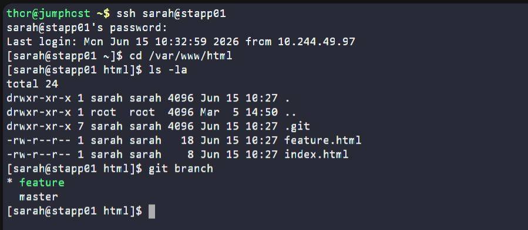
</div>


This confirmed that the repository already existed and contained both required branches.

---

### 2. Installed Java on App Server

Verified Java installation:

```bash
java -version
```

Installed OpenJDK 17:

```bash
sudo yum install -y java-17-openjdk
```

This was required because Jenkins agents need Java to communicate with the Jenkins controller.

<div style="border:1px solid #ccc; padding:10px; border-radius:10px; box-shadow:2px 2px 8px rgba(0,0,0,0.2); display:inline-block;">
  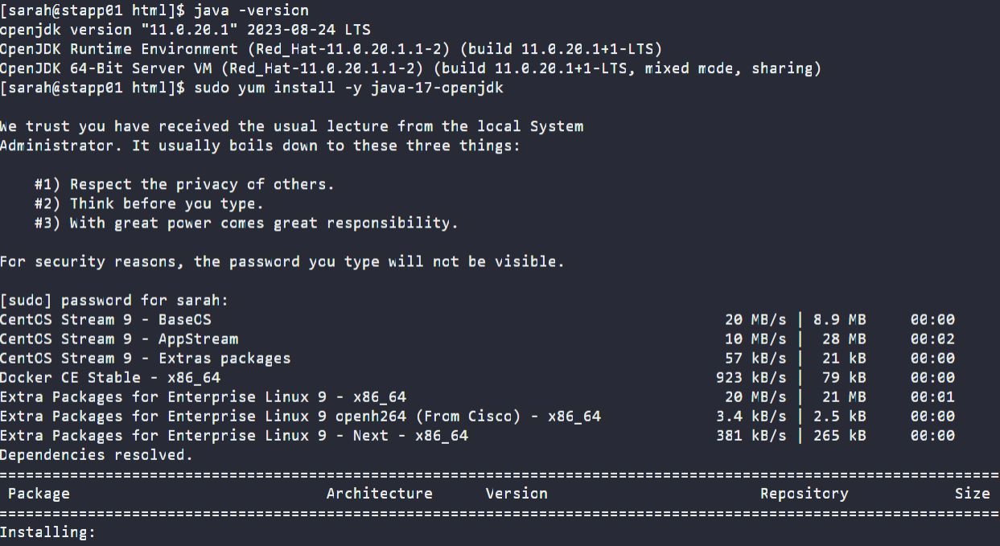
</div>


---

### 3. Created Jenkins Agent Directory

The task required the Jenkins Agent Remote Root Directory to be:

```bash
/home/sarah/jenkins_agent
```

Created the directory:

```bash
sudo mkdir -p /home/sarah/jenkins_agent
```

Assigned permissions:

```bash
sudo chmod 777 /home/sarah/jenkins_agent
```

Verified:

```bash
ls -la /home/sarah/jenkins_agent
```

Output:

```text
drwxrwxrwx ...
```
<div style="border:1px solid #ccc; padding:10px; border-radius:10px; box-shadow:2px 2px 8px rgba(0,0,0,0.2); display:inline-block;">
  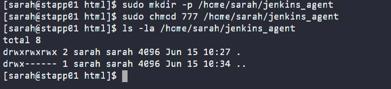
</div>


---

### 4. Accessed Jenkins

Clicked the Jenkins button available in the lab environment.

Logged in using:

```text
Username: admin
Password: Adm!n321
```

Successfully accessed the Jenkins Dashboard.

<div style="border:1px solid #ccc; padding:10px; border-radius:10px; box-shadow:2px 2px 8px rgba(0,0,0,0.2); display:inline-block;">
  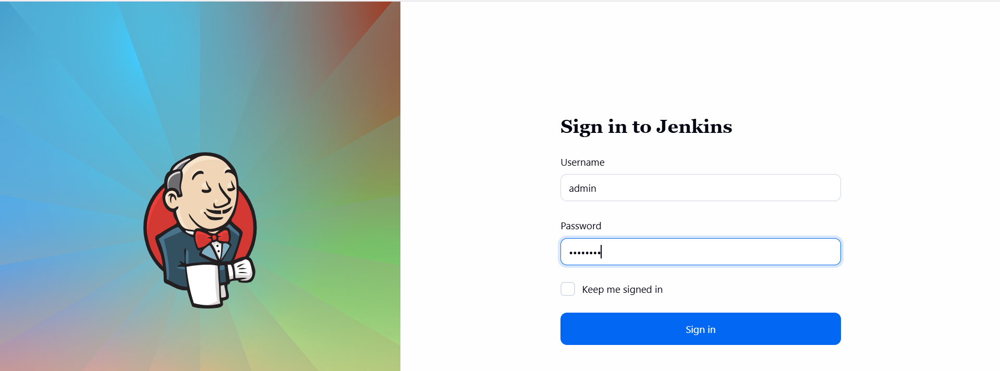
</div>

---

### 5. Installed Required Plugins

Navigated to:

```text
Manage Jenkins
→ Plugins
```

Installed:

* SSH Build Agents
* Pipeline
* Git

After installation:

* Restarted Jenkins
* Refreshed the browser
* Logged in again

<div style="border:1px solid #ccc; padding:10px; border-radius:10px; box-shadow:2px 2px 8px rgba(0,0,0,0.2); display:inline-block;">
  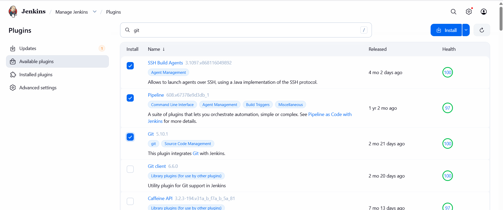
</div>

<div style="border:1px solid #ccc; padding:10px; border-radius:10px; box-shadow:2px 2px 8px rgba(0,0,0,0.2); display:inline-block;">
  
</div>

---

### 6. Added Jenkins Credentials

Navigated to:

```text
Manage Jenkins
→ Credentials
→ System
→ Global Credentials
→ Add Credentials
```

Configured:

| Field    | Value                  |
| -------- | ---------------------- |
| Kind     | Username with Password |
| Username | sarah                  |
| Password | Sarah_pass123          |
| ID       | stapp01                |

Saved the credentials.

<div style="border:1px solid #ccc; padding:10px; border-radius:10px; box-shadow:2px 2px 8px rgba(0,0,0,0.2); display:inline-block;">
  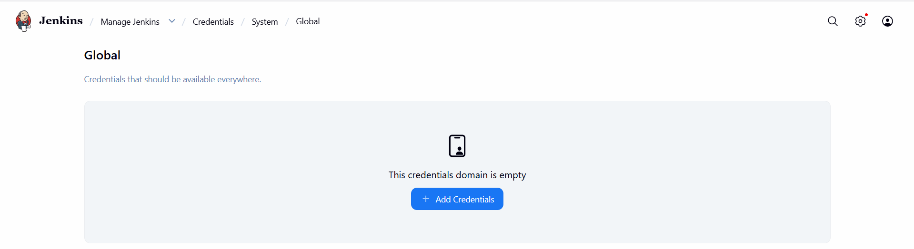
</div>

<div style="border:1px solid #ccc; padding:10px; border-radius:10px; box-shadow:2px 2px 8px rgba(0,0,0,0.2); display:inline-block;">
  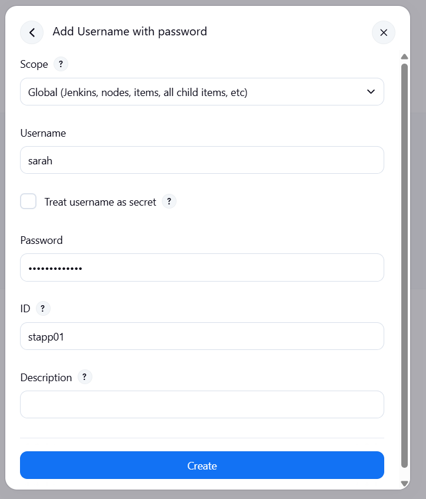
</div>


---

### 7. Configured Jenkins Agent

Navigated to:

```text
Manage Jenkins
→ Nodes
→ New Node
```

Configured:

| Field                 | Value                               |
| --------------------- | ----------------------------------- |
| Name                  | App Server 1                        |
| Remote Root Directory | /home/sarah/jenkins_agent           |
| Labels                | stapp01                             |
| Launch Method         | Launch agents via SSH               |
| Host                  | stapp01                             |
| Credentials           | stapp01                             |
| Host Key Verification | Non-verifying Verification Strategy |

Saved the configuration.

Jenkins successfully connected to the remote server.

Agent status:

```text
Connected
```

<div style="border:1px solid #ccc; padding:10px; border-radius:10px; box-shadow:2px 2px 8px rgba(0,0,0,0.2); display:inline-block;">
  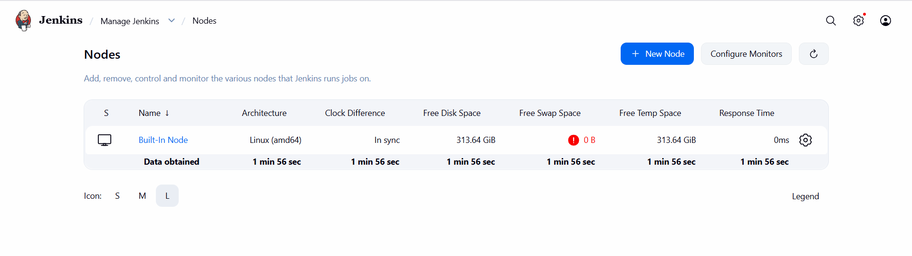
</div>

<div style="border:1px solid #ccc; padding:10px; border-radius:10px; box-shadow:2px 2px 8px rgba(0,0,0,0.2); display:inline-block;">
  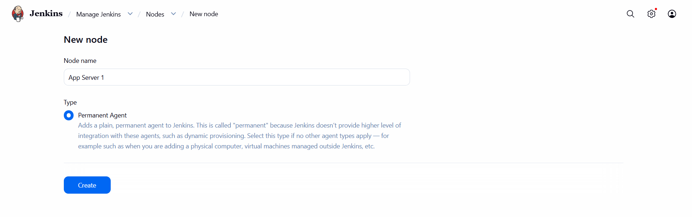
</div>

<div style="border:1px solid #ccc; padding:10px; border-radius:10px; box-shadow:2px 2px 8px rgba(0,0,0,0.2); display:inline-block;">
  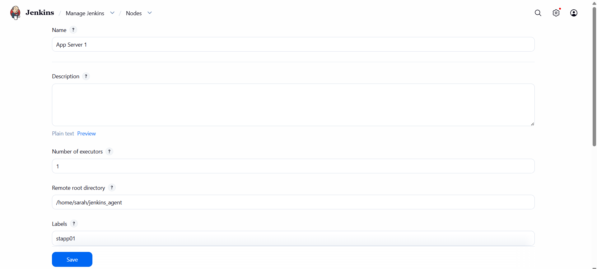
</div>

<div style="border:1px solid #ccc; padding:10px; border-radius:10px; box-shadow:2px 2px 8px rgba(0,0,0,0.2); display:inline-block;">
  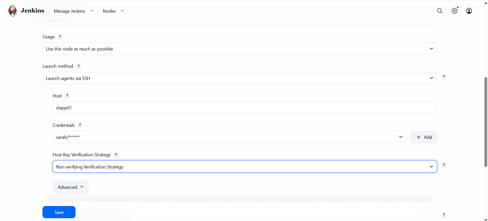
</div>

<div style="border:1px solid #ccc; padding:10px; border-radius:10px; box-shadow:2px 2px 8px rgba(0,0,0,0.2); display:inline-block;">
  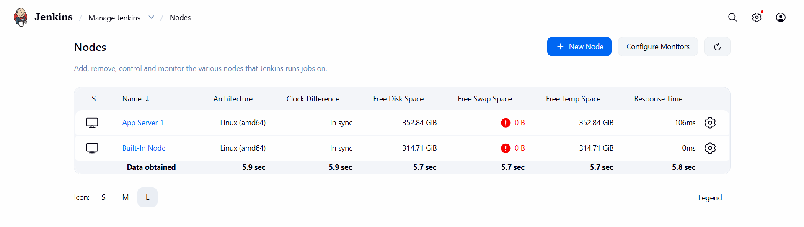
</div>

---

### 8. Created Jenkins Pipeline Job

Navigated to:

```text
New Item
```

Entered:

```text
datacenter-webapp-job
```

Selected:

```text
Pipeline
```

Clicked:

```text
OK
```

<div style="border:1px solid #ccc; padding:10px; border-radius:10px; box-shadow:2px 2px 8px rgba(0,0,0,0.2); display:inline-block;">
  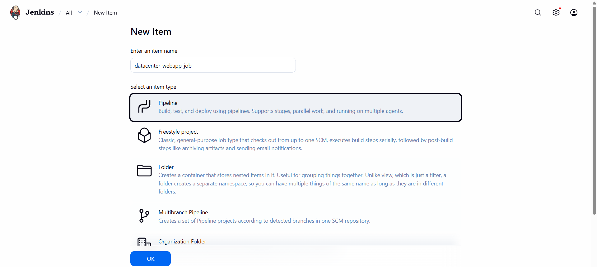
</div>

---

### 9. Added Build Parameter

Enabled:

```text
This project is parameterized
```

Added:

```text
String Parameter
```

Configured:

| Field         | Value  |
| ------------- | ------ |
| Name          | BRANCH |
| Default Value | master |

This parameter would determine which branch gets deployed.

<div style="border:1px solid #ccc; padding:10px; border-radius:10px; box-shadow:2px 2px 8px rgba(0,0,0,0.2); display:inline-block;">
  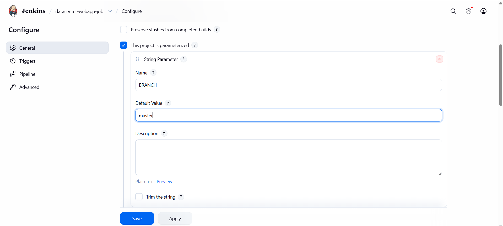
</div>
---

### 10. Added Pipeline Script

Under:

```text
Pipeline
→ Definition
→ Pipeline Script
```

Added:

```groovy
pipeline {
    agent { label 'stapp01' }

    parameters {
        string(
            name: 'BRANCH',
            defaultValue: 'master'
        )
    }

    stages {
        stage('Deploy') {
            steps {
                sh """
                cd /var/www/html

                if [ "${params.BRANCH}" = "master" ]; then
                    git checkout master
                    git pull origin master

                elif [ "${params.BRANCH}" = "feature" ]; then
                    git checkout feature
                    git pull origin feature

                else
                    echo "Invalid branch"
                    exit 1
                fi
                """
            }
        }
    }
}
```

<div style="border:1px solid #ccc; padding:10px; border-radius:10px; box-shadow:2px 2px 8px rgba(0,0,0,0.2); display:inline-block;">
  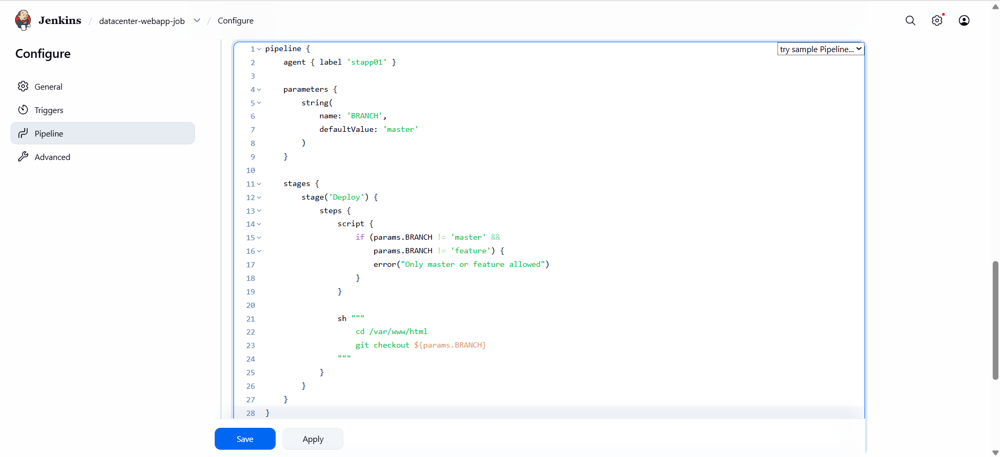
</div>

---

### 11. Understanding the Pipeline

#### Agent Section

```groovy
agent { label 'stapp01' }
```

Ensures the pipeline runs only on the configured Jenkins agent.

---

#### Parameter Section

```groovy
parameters {
    string(name: 'BRANCH')
}
```

Allows users to choose which branch to deploy.

---

#### Deploy Stage

```groovy
stage('Deploy')
```

The task explicitly required a single stage named:

```text
Deploy
```

(case-sensitive)

---

#### Branch-Based Deployment

If the parameter is:

```text
master
```

Pipeline executes:

```bash
git checkout master
git pull origin master
```

If the parameter is:

```text
feature
```

Pipeline executes:

```bash
git checkout feature
git pull origin feature
```

This provides conditional deployment based on user input.

---

### 12. Saved the Job

Clicked:

```text
Apply
```

Then:

```text
Save
```

Pipeline creation completed successfully.

---

### 13. Tested Master Branch Deployment

Opened:

<div style="border:1px solid #ccc; padding:10px; border-radius:10px; box-shadow:2px 2px 8px rgba(0,0,0,0.2); display:inline-block;">
  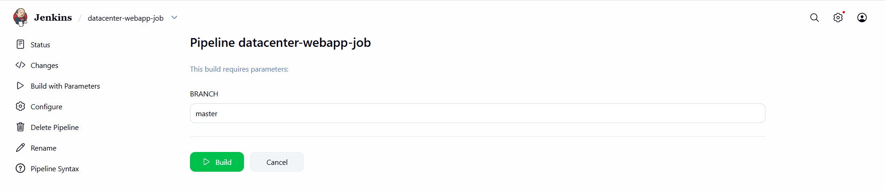
</div>

<div style="border:1px solid #ccc; padding:10px; border-radius:10px; box-shadow:2px 2px 8px rgba(0,0,0,0.2); display:inline-block;">
  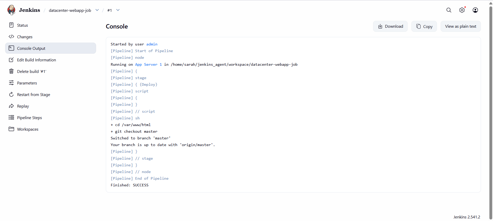
</div>


```text
datacenter-webapp-job
→ Build with Parameters
```

Selected:

```text
BRANCH = master
```

Build completed successfully.

Verified on App Server:

```bash
cd /var/www/html

git branch
```

Output:

```text
  feature
* master
```


<div style="border:1px solid #ccc; padding:10px; border-radius:10px; box-shadow:2px 2px 8px rgba(0,0,0,0.2); display:inline-block;">
  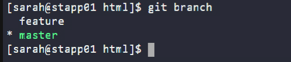
</div>

---

### 14. Tested Feature Branch Deployment

Opened:

```text
datacenter-webapp-job
→ Build with Parameters
```
<div style="border:1px solid #ccc; padding:10px; border-radius:10px; box-shadow:2px 2px 8px rgba(0,0,0,0.2); display:inline-block;">
  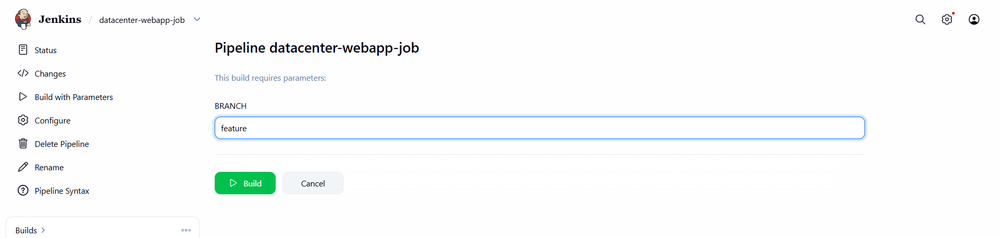
</div>

<div style="border:1px solid #ccc; padding:10px; border-radius:10px; box-shadow:2px 2px 8px rgba(0,0,0,0.2); display:inline-block;">
  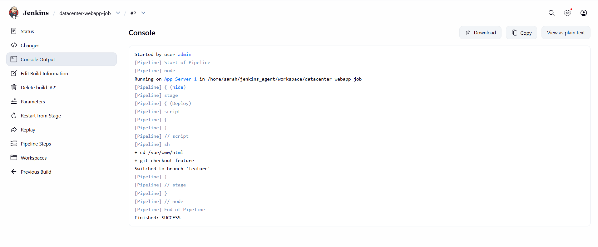
</div>

Selected:

```text
BRANCH = feature
```

Build completed successfully.

Verified:

```bash
cd /var/www/html

git branch
```

Output:

```text
* feature
  master
```
<div style="border:1px solid #ccc; padding:10px; border-radius:10px; box-shadow:2px 2px 8px rgba(0,0,0,0.2); display:inline-block;">
  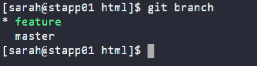
</div>

This confirmed conditional deployment was functioning correctly.

---

### 15. Verified Application

Clicked the:

```text
App
```

button available in the lab environment.

Verified the application loaded successfully from:

```bash
/var/www/html
```

and not from a subdirectory.

---

## 🔹 Simple Explanation of Jenkins Components Used

### Jenkins Agent

A Jenkins Agent is a remote machine that executes build and deployment tasks.

In this task:

```text
App Server 1
```

acted as the Jenkins Agent.

---

### Agent Labels

Labels help Jenkins determine where jobs should run.

Example:

```groovy
agent {
    label 'stapp01'
}
```

This ensures deployment occurs only on App Server 1.

---

### Pipeline Parameters

Pipeline Parameters allow user input during build execution.

Example:

```text
BRANCH = master
```

or

```text
BRANCH = feature
```

This makes deployments dynamic and reusable.

---

### Declarative Pipeline

The Jenkinsfile follows Declarative Pipeline syntax:

```groovy
pipeline {
    agent
    parameters
    stages
}
```

This structure improves readability and maintainability.

---

### Git Branch Switching

Instead of cloning a repository every time, the pipeline operates directly on the existing repository:

```bash
git checkout master
```

or

```bash
git checkout feature
```

This is faster and aligns with the repository layout provided by the task.

---

### Continuous Deployment

The deployment process is fully automated:

1. User selects a branch
2. Jenkins connects to the agent
3. Pipeline switches repository branch
4. Latest code becomes available through Apache
5. Application is immediately updated

---

## 🔹 My Understanding

This task helped me understand how Jenkins can perform conditional deployments using parameters. Instead of maintaining separate jobs for different branches, a single pipeline can dynamically deploy multiple versions of an application based on user input. It also reinforced the importance of understanding whether a repository already exists on the target server before deciding between cloning code or operating directly on an existing Git repository.

---

## 🔹 What I Found Interesting

I found it interesting that the entire deployment logic could be controlled through a single Jenkins parameter. By simply changing the value of `BRANCH`, Jenkins was able to deploy different application versions without requiring multiple jobs. This demonstrated how flexible and powerful Jenkins Pipelines can be when combined with Git branch management and remote agents.


* * *

### Topics Covered

- ***Jenkins***
- ***CI/CD Pipelines***
- ***Conditional Pipeline***
- ***Jenkins Agent Configuration***
- ***Git Branch Management***
- ***Gitea Integration***
- ***Git Repository Integration***
- ***Automated Application Deployment***
- ***Jenkins Pipeline***

**Previous Task**: [Day 77: Jenkins Deploy Pipeline](../Day_77/day_77.md)

**Next Task**: [Day 79: Jenkins Deployment Job](../Day_79/day_79.md)
