# Day 79: Jenkins Deployment Job

<div style="border:1px solid #ccc; padding:10px; border-radius:10px; box-shadow:2px 2px 8px rgba(0,0,0,0.2); display:inline-block;">
  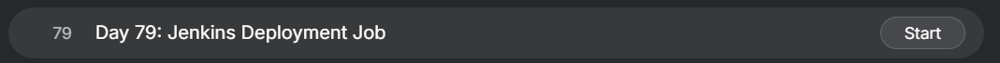
</div>

## Content

>Today I worked on configuring a Jenkins deployment job for xFusionCorp Industries. The objective was to automatically deploy a web application whenever a developer pushed new code to the Git repository hosted on Gitea.

>This task helped me understand how Jenkins can be used as a Continuous Deployment (CD) tool to automate application deployments.

---

## 🔹 What I Learned

* Jenkins Freestyle Projects
* Git Integration with Jenkins
* Jenkins Credentials Management
* Poll SCM Trigger
* SSH Key-Based Authentication
* Secure Remote Deployment
* SCP File Transfer
* Automated Application Deployment
* Apache (httpd) Service Management
* Continuous Deployment Workflow
* Linux File Ownership and Permissions

---

## 🔹 Task Requirement

<div style="border:1px solid #ccc; padding:10px; border-radius:10px; box-shadow:2px 2px 8px rgba(0,0,0,0.2); display:inline-block;">
  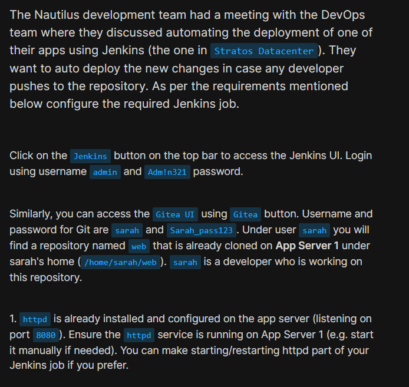
</div>

<div style="border:1px solid #ccc; padding:10px; border-radius:10px; box-shadow:2px 2px 8px rgba(0,0,0,0.2); display:inline-block;">
  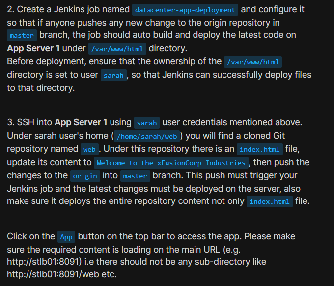
</div>

<div style="border:1px solid #ccc; padding:10px; border-radius:10px; box-shadow:2px 2px 8px rgba(0,0,0,0.2); display:inline-block;">
  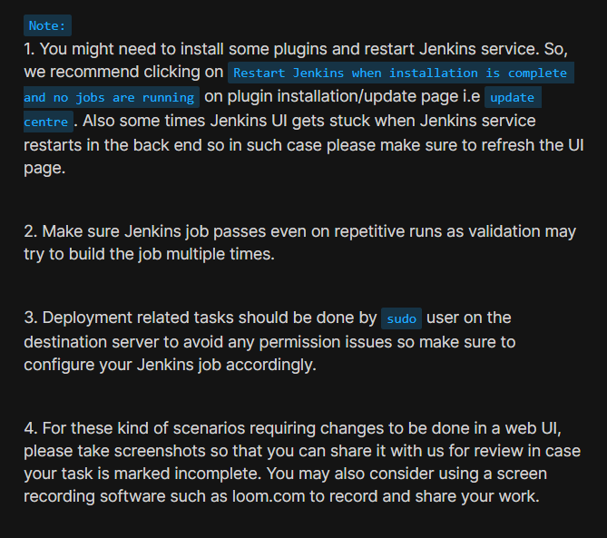
</div>

The Nautilus DevOps team wanted Jenkins to automatically deploy application changes whenever developers pushed updates to the master branch of a Git repository.

The repository was hosted in Gitea and already cloned on App Server 1 under:

```bash
/home/sarah/web
```

The deployment requirements were:

* Create a Jenkins job named:

```text
datacenter-app-deployment
```

* Monitor the master branch.
* Automatically trigger builds after code changes.
* Deploy the latest code to:

```bash
/var/www/html
```

* Ensure ownership of the deployment directory belongs to:

```text
sarah:sarah
```

* Restart Apache after deployment.
* Verify the application through the Load Balancer URL.

---

## Jenkins Access Details

| Field    | Value    |
| -------- | -------- |
| Username | admin    |
| Password | Adm!n321 |

---

## Gitea Access Details

| Field    | Value         |
| -------- | ------------- |
| Username | sarah         |
| Password | Sarah_pass123 |

---

## Application Server Details

| User  | Password      |
| ----- | ------------- |
| tony  | Ir0nM@n       |
| sarah | Sarah_pass123 |

---

## 🔹 Steps I Followed

#### 1. Verified Apache on App Server 1

<div style="border:1px solid #ccc; padding:10px; border-radius:10px; box-shadow:2px 2px 8px rgba(0,0,0,0.2); display:inline-block;">
  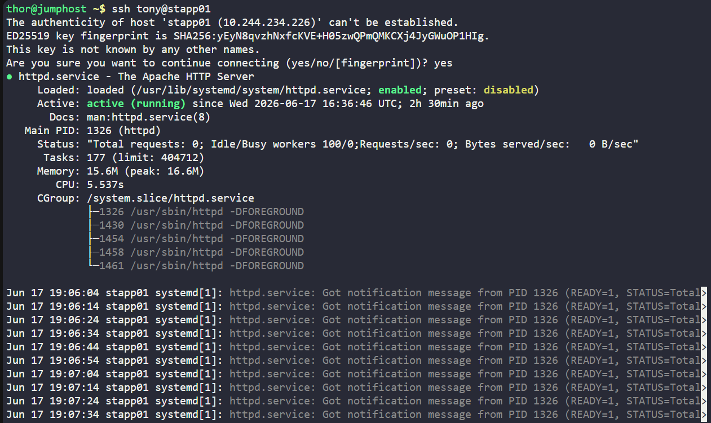
</div>

```bash
ssh tony@stapp01
systemctl status httpd
```

Result:

```bash
Active: active (running)
```

#### 2. Verified Deployment Directory Ownership

<div style="border:1px solid #ccc; padding:10px; border-radius:10px; box-shadow:2px 2px 8px rgba(0,0,0,0.2); display:inline-block;">
  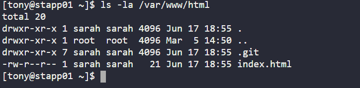
</div>

```bash
ls -la /var/www/html
```

Result:

```bash
drwxr-xr-x 1 sarah sarah ...
```

Ownership already set correctly to:

```text
sarah:sarah
```

---

### 3. Jenkins Preparation

#### Login

```text
Username: admin
Password: Adm!n321
```
<div style="border:1px solid #ccc; padding:10px; border-radius:10px; box-shadow:2px 2px 8px rgba(0,0,0,0.2); display:inline-block;">
  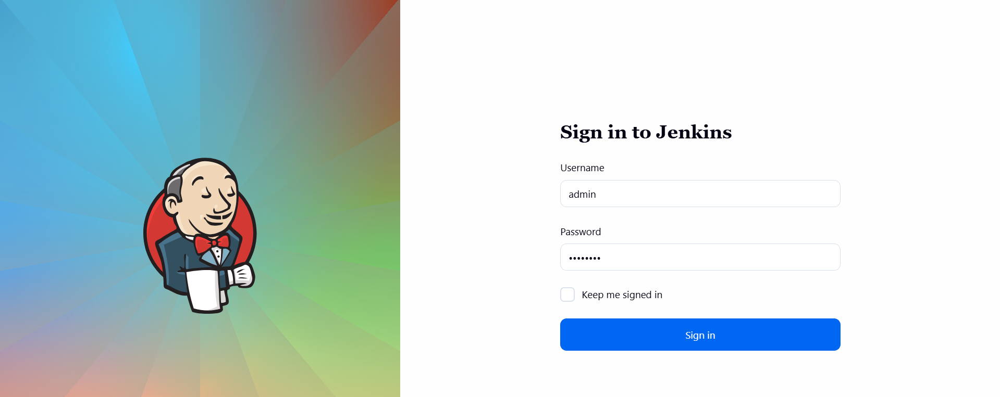
</div>

#### Plugins Installed

* Git Plugin
* Credentials Plugin

<div style="border:1px solid #ccc; padding:10px; border-radius:10px; box-shadow:2px 2px 8px rgba(0,0,0,0.2); display:inline-block;">
  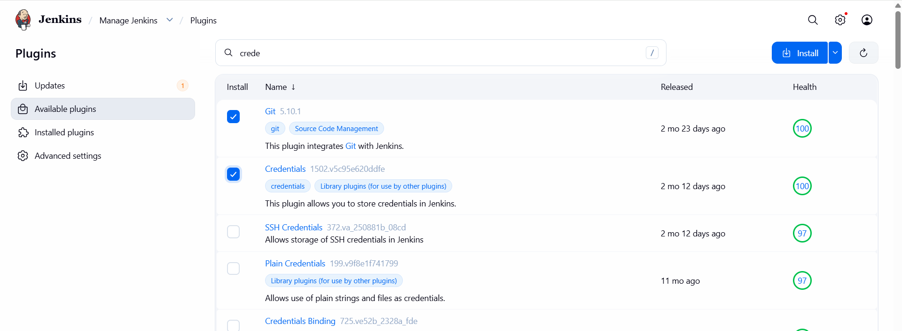
</div>

#### Restart Jenkins

---

### 4. Added Git Credentials

Path:

```text
Manage Jenkins
→ Credentials
→ System
→ Global credentials
→ Add Credentials
```

Configuration:

```text
Kind: Username with password

Username: sarah
Password: Sarah_pass123

ID: sarah-id
```

<div style="border:1px solid #ccc; padding:10px; border-radius:10px; box-shadow:2px 2px 8px rgba(0,0,0,0.2); display:inline-block;">
  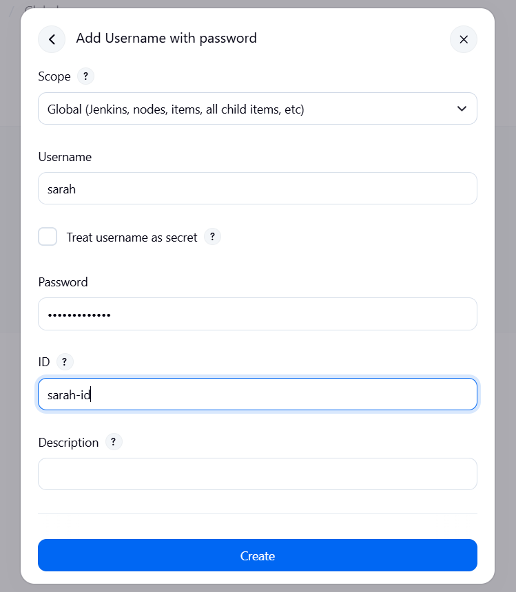
</div>

<div style="border:1px solid #ccc; padding:10px; border-radius:10px; box-shadow:2px 2px 8px rgba(0,0,0,0.2); display:inline-block;">
  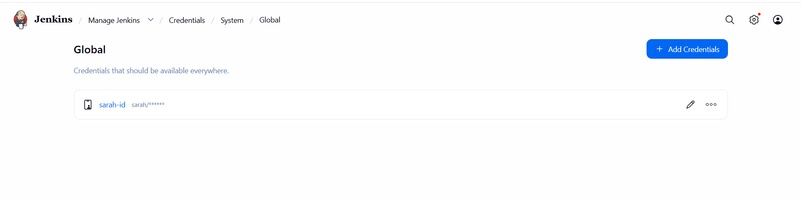
</div>

---

### 5. Jenkins SSH Access to App Server

<div style="border:1px solid #ccc; padding:10px; border-radius:10px; box-shadow:2px 2px 8px rgba(0,0,0,0.2); display:inline-block;">
  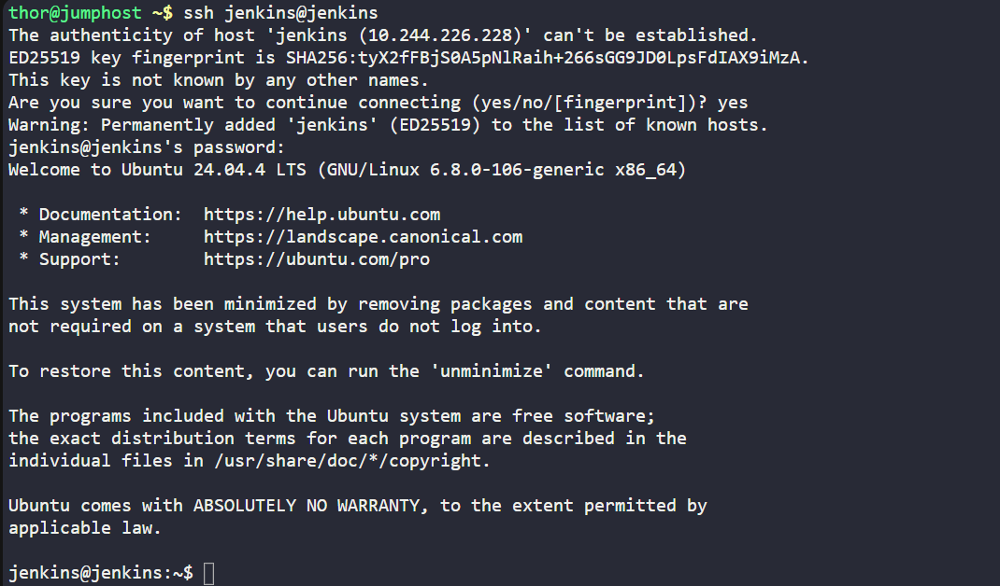
</div>

SSH into Jenkins server:

```bash
ssh jenkins@jenkins
```

Generate key:

```bash
ssh-keygen -t rsa -b 4096
```
<div style="border:1px solid #ccc; padding:10px; border-radius:10px; box-shadow:2px 2px 8px rgba(0,0,0,0.2); display:inline-block;">
  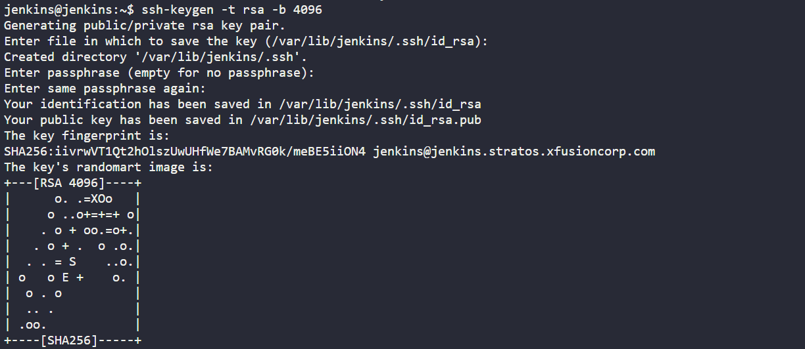
</div>

Copy key to App Server:

<div style="border:1px solid #ccc; padding:10px; border-radius:10px; box-shadow:2px 2px 8px rgba(0,0,0,0.2); display:inline-block;">
  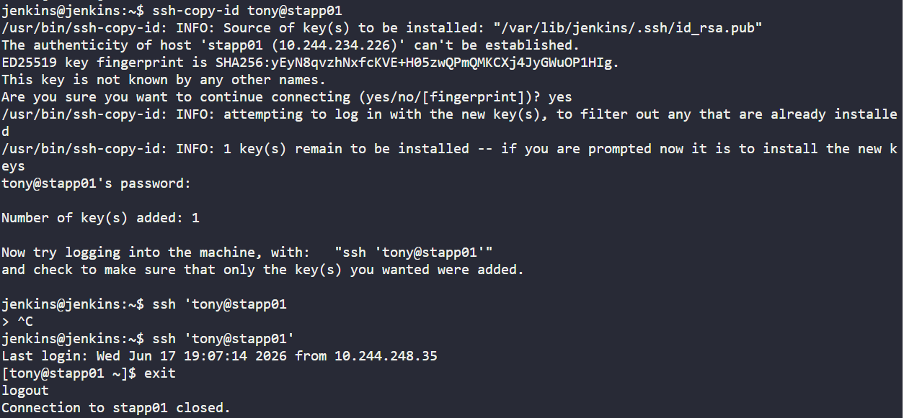
</div>

```bash
ssh-copy-id tony@stapp01
```


Verify passwordless access:

```bash
ssh tony@stapp01
```

Success.

<div style="border:1px solid #ccc; padding:10px; border-radius:10px; box-shadow:2px 2px 8px rgba(0,0,0,0.2); display:inline-block;">
  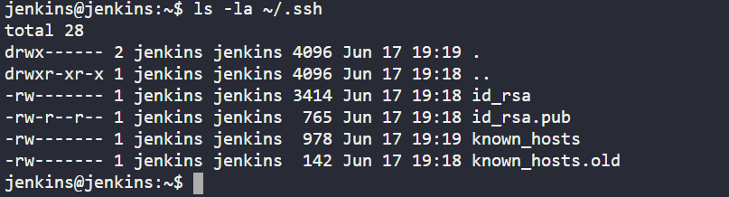
</div>

---

### 6. Gitea Repository Used

Repository URL:

```text
https://3000-port-uwp3i2ptxi3qkrj6.labs.kodekloud.com/sarah/web.git
```
<div style="border:1px solid #ccc; padding:10px; border-radius:10px; box-shadow:2px 2px 8px rgba(0,0,0,0.2); display:inline-block;">
  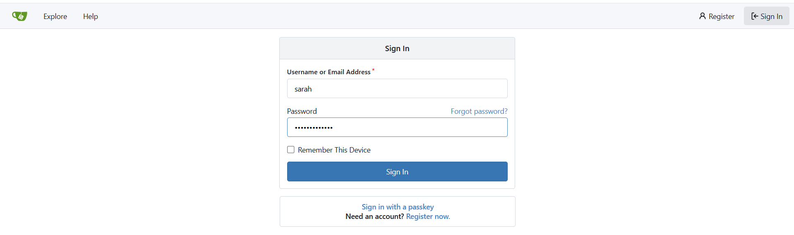
</div>

<div style="border:1px solid #ccc; padding:10px; border-radius:10px; box-shadow:2px 2px 8px rgba(0,0,0,0.2); display:inline-block;">
  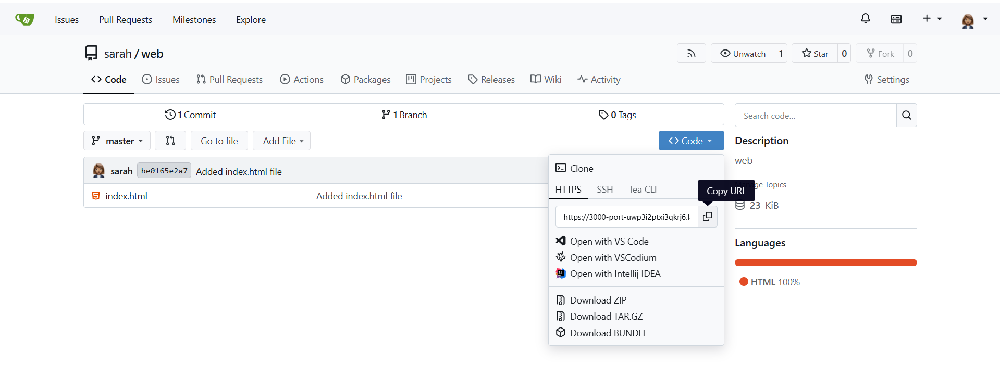
</div>


---

### 7. Jenkins Job Configuration

<div style="border:1px solid #ccc; padding:10px; border-radius:10px; box-shadow:2px 2px 8px rgba(0,0,0,0.2); display:inline-block;">
  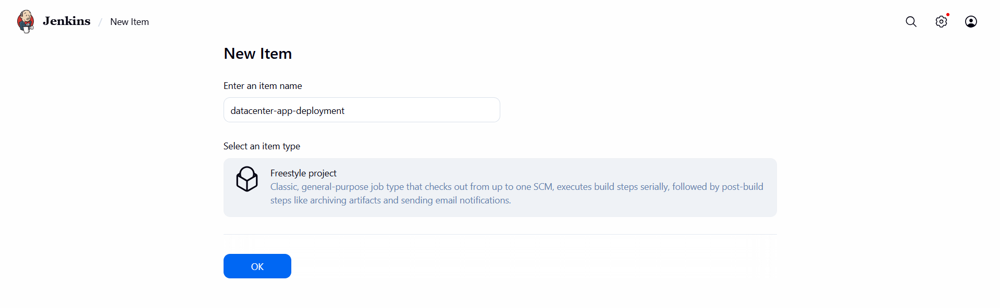
</div>

#### Job Name

```text
datacenter-app-deployment
```

#### Type

```text
Freestyle Project
```

---

### Source Code Management

<div style="border:1px solid #ccc; padding:10px; border-radius:10px; box-shadow:2px 2px 8px rgba(0,0,0,0.2); display:inline-block;">
  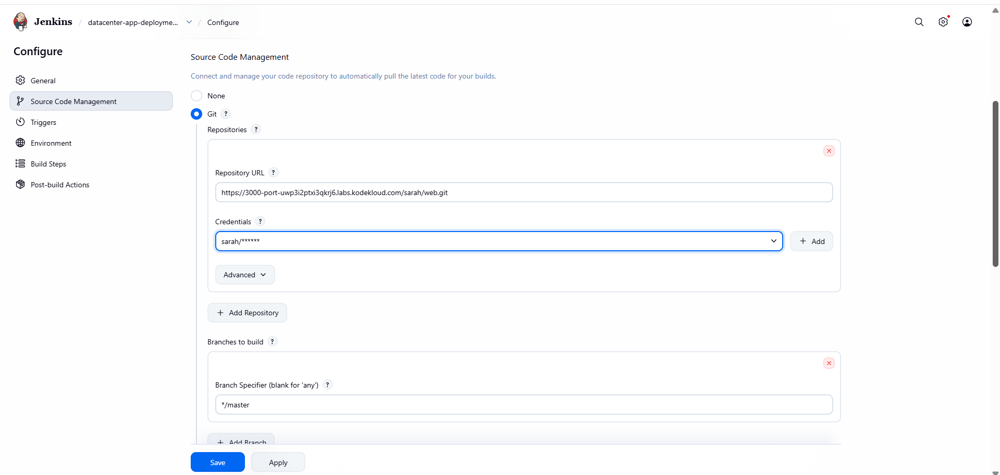
</div>

```text
Git
```

Repository:

```text
https://3000-port-uwp3i2ptxi3qkrj6.labs.kodekloud.com/sarah/web.git
```

Credentials:

```text
sarah-id
```

Branch:

```text
*/master
```

---

### Trigger

<div style="border:1px solid #ccc; padding:10px; border-radius:10px; box-shadow:2px 2px 8px rgba(0,0,0,0.2); display:inline-block;">
  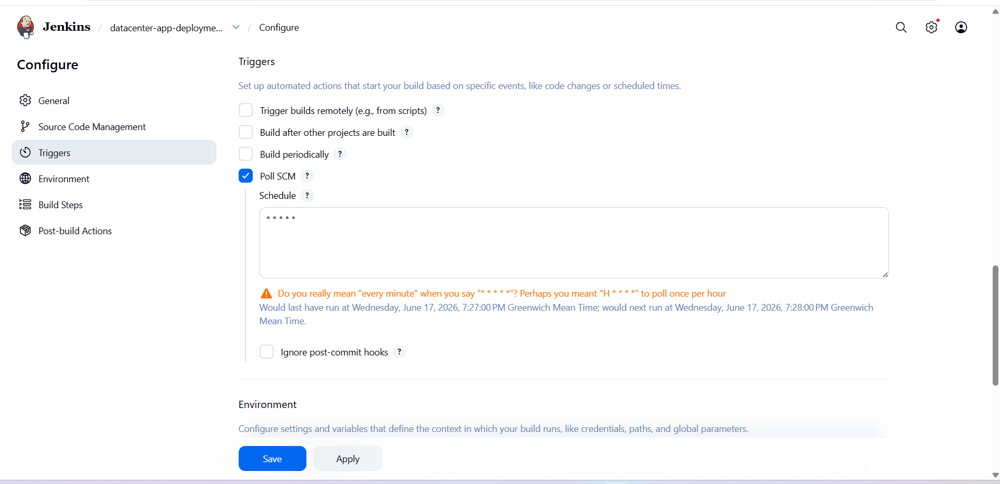
</div>

Enabled:

```text
Poll SCM
```

Schedule:

```text
* * * * *
```

This checks every minute and automatically builds when master receives new commits.

---

### Build Step

Execute Shell

<div style="border:1px solid #ccc; padding:10px; border-radius:10px; box-shadow:2px 2px 8px rgba(0,0,0,0.2); display:inline-block;">
  
</div>

<div style="border:1px solid #ccc; padding:10px; border-radius:10px; box-shadow:2px 2px 8px rgba(0,0,0,0.2); display:inline-block;">
  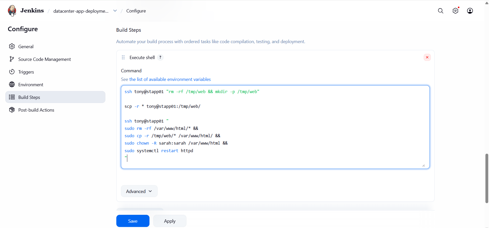
</div>

```bash
ssh tony@stapp01 "rm -rf /tmp/web && mkdir -p /tmp/web"

scp -r * tony@stapp01:/tmp/web/

ssh tony@stapp01 "
sudo rm -rf /var/www/html/* &&
sudo cp -r /tmp/web/* /var/www/html/ &&
sudo chown -R sarah:sarah /var/www/html &&
sudo systemctl restart httpd
"
```

---

### 8. Modify Repository on App Server

<div style="border:1px solid #ccc; padding:10px; border-radius:10px; box-shadow:2px 2px 8px rgba(0,0,0,0.2); display:inline-block;">
  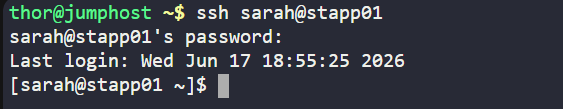
</div>

Login:

```bash
ssh sarah@stapp01
```

<div style="border:1px solid #ccc; padding:10px; border-radius:10px; box-shadow:2px 2px 8px rgba(0,0,0,0.2); display:inline-block;">
  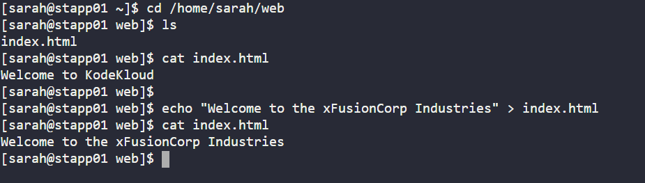
</div>

Navigate:

```bash
cd /home/sarah/web
```

Original:

```text
Welcome to KodeKloud
```

Update:

```bash
echo "Welcome to the xFusionCorp Industries" > index.html
```

Verify:

```bash
cat index.html
```

Output:

```text
Welcome to the xFusionCorp Industries
```

---

### 9. Commit and Push

<div style="border:1px solid #ccc; padding:10px; border-radius:10px; box-shadow:2px 2px 8px rgba(0,0,0,0.2); display:inline-block;">
  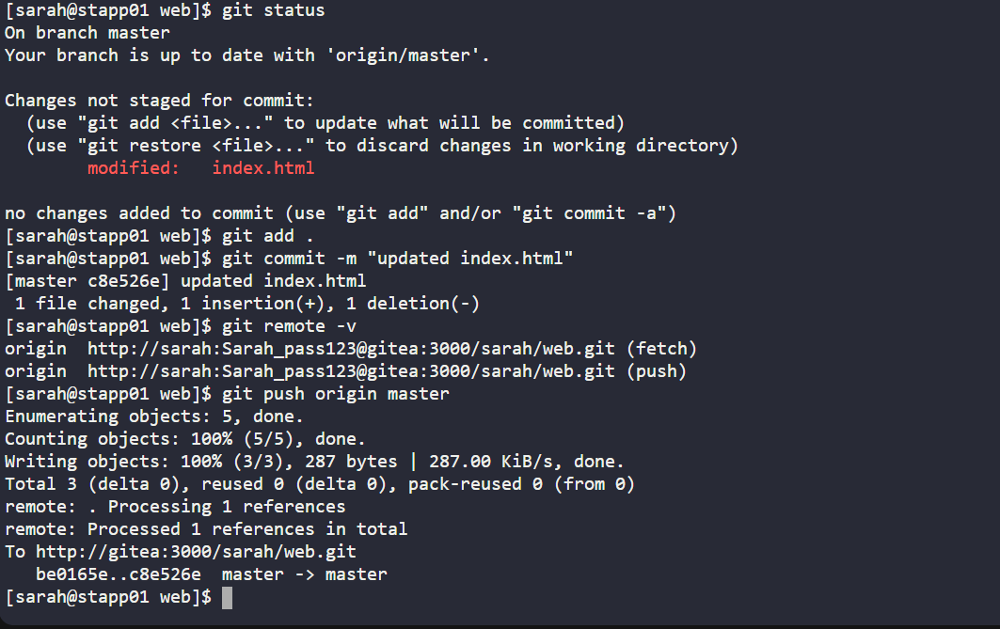
</div>

```bash
git add .
git commit -m "updated index.html"
git push origin master
```

Commit:

```text
c8e526e
```
<div style="border:1px solid #ccc; padding:10px; border-radius:10px; box-shadow:2px 2px 8px rgba(0,0,0,0.2); display:inline-block;">
  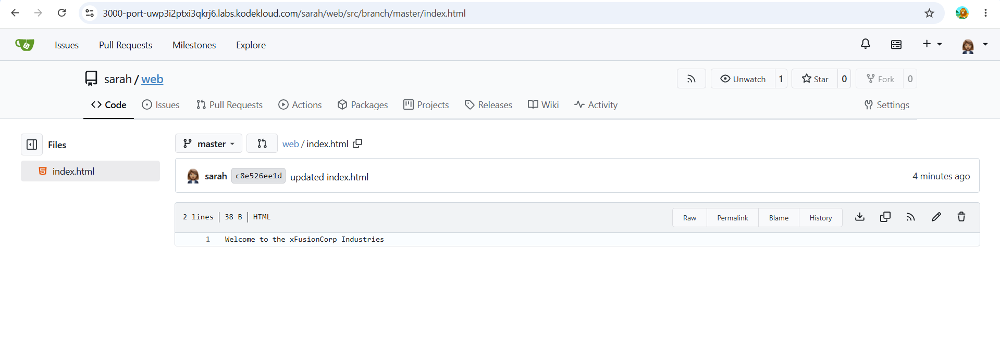
</div>

---

### 10. Auto Trigger Verification

Jenkins automatically started:

```text
Build #4
Started by an SCM change
```
<div style="border:1px solid #ccc; padding:10px; border-radius:10px; box-shadow:2px 2px 8px rgba(0,0,0,0.2); display:inline-block;">
  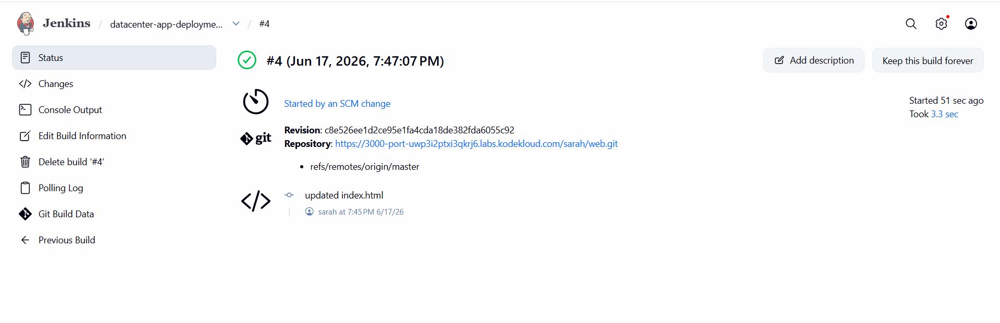
</div>

Console output showed:

```text
Fetching changes from Git
Checking out Revision c8e526e
scp files to stapp01
Deploy to /var/www/html
Restart httpd

Finished: SUCCESS
```
<div style="border:1px solid #ccc; padding:10px; border-radius:10px; box-shadow:2px 2px 8px rgba(0,0,0,0.2); display:inline-block;">
  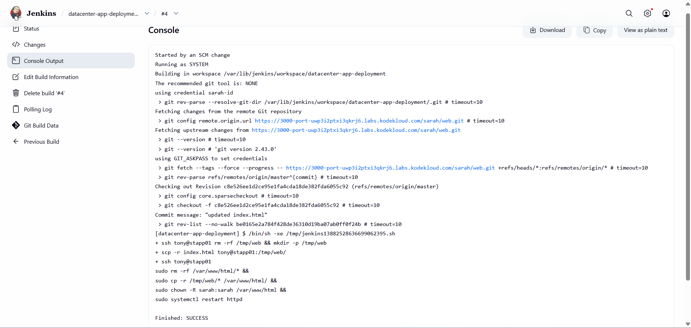
</div>
---

### 11. Application Verification

Before deployment:

<div style="border:1px solid #ccc; padding:10px; border-radius:10px; box-shadow:2px 2px 8px rgba(0,0,0,0.2); display:inline-block;">
  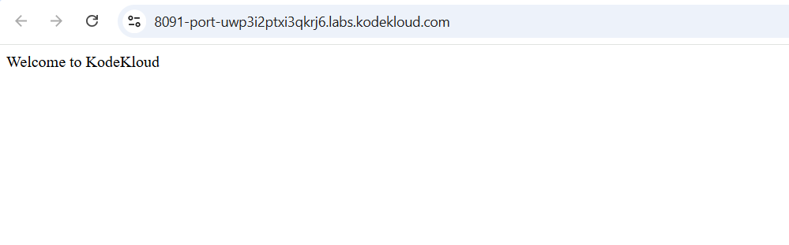
</div>

```text
Welcome to KodeKloud
```

After deployment:

<div style="border:1px solid #ccc; padding:10px; border-radius:10px; box-shadow:2px 2px 8px rgba(0,0,0,0.2); display:inline-block;">
  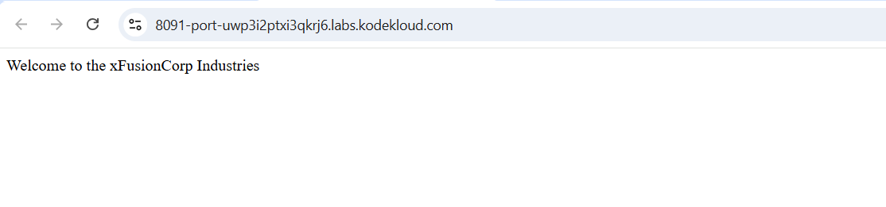
</div>

```text
Welcome to the xFusionCorp Industries
```

URL:

```text
http://stlb01:8091
```

No subdirectory required.

---

### Deployment Flow (Recorded)

```text
Developer (Sarah)
        |
        v
Modify index.html
        |
        v
git add
git commit
git push
        |
        v
Gitea Repository
        |
        v
Poll SCM Trigger
        |
        v
Jenkins Job
        |
        v
Checkout Latest Code
        |
        v
SCP Repository Content
        |
        v
stapp01:/tmp/web
        |
        v
Copy to /var/www/html
        |
        v
Set Ownership
        |
        v
Restart Apache
        |
        v
Website Updated
```

### Important Notes for Similar Future Tasks

* Always install:

  * Git Plugin
  * Credentials Plugin
* Configure Git credentials as `Username with password`.
* Set deployment directory ownership to the developer user if required.
* Configure passwordless SSH from Jenkins server to target server.
* Use Poll SCM (`* * * * *`) if webhook configuration is not requested.
* Deploy the entire repository contents, not just modified files.
* Ensure builds are idempotent and pass on repeated executions.
* Restart the web service after deployment.


### My Understanding

This task demonstrated how Jenkins can automate deployments by continuously monitoring a Git repository and deploying changes to a web server whenever new code is pushed. It covered the complete CI/CD flow, including source control integration, automated builds, secure server access, and application deployment.

### What I Found Interesting

I found it interesting how a simple Git push from the developer side automatically triggered the entire deployment pipeline without any manual intervention. Setting up passwordless SSH between Jenkins and the target server and seeing the website update immediately after the commit helped me understand the practical benefits of CI/CD automation.

* * *

### Topics Covered

- ***Jenkins***
- ***CI/CD Pipelines***
- ***Git & Gitea Integration***
- ***Jenkins Freestyle Jobs***
- ***SSH Key Authentication***
- ***Automated Application Deployment***
- ***Jenkins Pipeline***
- ***Apache (httpd)***

**Previous Task**: [Day 78: Jenkins Conditional Pipeline](../Day_78/day_78.md)

**Next Task**: [Day 80: Jenkins Chained Builds](../Day_80/day_80.md)
