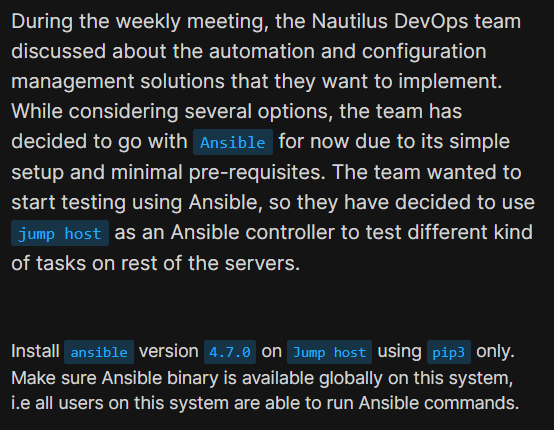
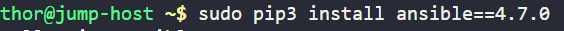
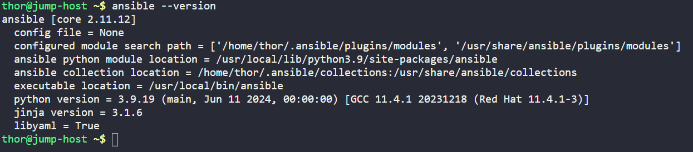

# Day 8: Install Ansible

<div style="border:1px solid #ccc; padding:10px; border-radius:10px; box-shadow:2px 2px 8px rgba(0,0,0,0.2); display:inline-block;">
  
</div>

### **Content:**

>Today I installed **Ansible version 4.7.0** on the jump host using `pip3`. This is an important step for automation, as Ansible is widely used in DevOps to manage multiple servers efficiently.

---

### **What I Learned**

Through this task, I understood:

* What Ansible is used for
* How to install a specific version using `pip3`
* Importance of global installation for all users
* How to verify installation

---
<div style="border:1px solid #ccc; padding:10px; border-radius:10px; box-shadow:2px 2px 8px rgba(0,0,0,0.2); display:inline-block;">
  
</div>

### **Steps I Followed :**

**1. Installed Ansible**

```bash
sudo pip3 install ansible==4.7.0
```
Installed Ansible globally using `sudo`.

<div style="border:1px solid #ccc; padding:10px; border-radius:10px; box-shadow:2px 2px 8px rgba(0,0,0,0.2); display:inline-block;">
  
</div>

---

**2. Verified Installation**

```bash
ansible --version
```
Confirmed Ansible is installed and working.

<div style="border:1px solid #ccc; padding:10px; border-radius:10px; box-shadow:2px 2px 8px rgba(0,0,0,0.2); display:inline-block;">
  
</div>

---

### **My Understanding**
Installing Ansible globally ensures all users can run automation tasks without separate setups. Using a fixed version helps maintain consistency in real-world environments.

---

### **What I Found Interesting**
It was interesting how a single command can install a powerful automation tool like Ansible, which can manage multiple servers efficiently.

---
### Topics Covered

- ***Ansible installation using pip3***
- ***Verifying installations***

**Previous Task**: [Day 7: Linux SSH Authentication](../Day_7/day_7.md)

**Next Task**: [Day 9: MariaDB Troubleshooting](../Day_9/day_9.md)
