# Day 80: Jenkins Chained Builds

<div style="border:1px solid #ccc; padding:10px; border-radius:10px; box-shadow:2px 2px 8px rgba(0,0,0,0.2); display:inline-block;">
  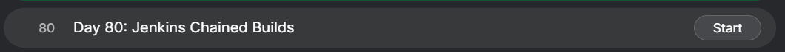
</div>

## Content

> Today I worked on configuring Jenkins Chained Builds for xFusionCorp Industries. The DevOps team wanted a solution where Apache services on application servers would only restart after a successful deployment.

> Instead of placing deployment and service management in a single Jenkins job, the team decided to use Jenkins chained builds (upstream and downstream jobs). This approach separates responsibilities, improves maintainability, and ensures that service-related actions are executed only when deployment is successful.

* * *

## What I Learned

*   Jenkins Chained Builds
    
*   Upstream and Downstream Jobs
    
*   Git Integration with Jenkins
    
*   Jenkins Agent Configuration
    
*   Remote Build Execution
    
*   Service Management Automation
    
*   Continuous Deployment Concepts
    

* * *

## Task Requirement

<div style="border:1px solid #ccc; padding:10px; border-radius:10px; box-shadow:2px 2px 8px rgba(0,0,0,0.2); display:inline-block;">
  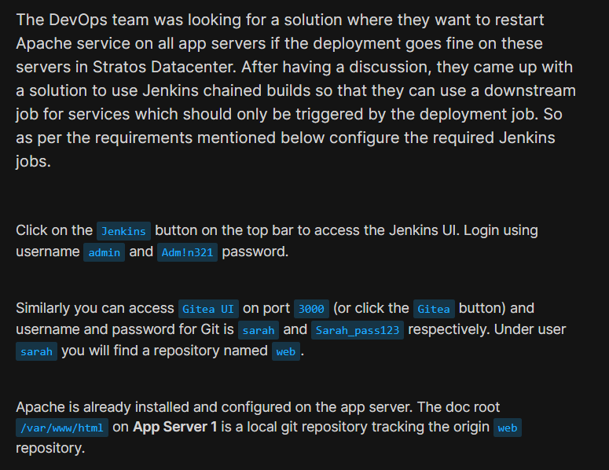
</div>

<div style="border:1px solid #ccc; padding:10px; border-radius:10px; box-shadow:2px 2px 8px rgba(0,0,0,0.2); display:inline-block;">
  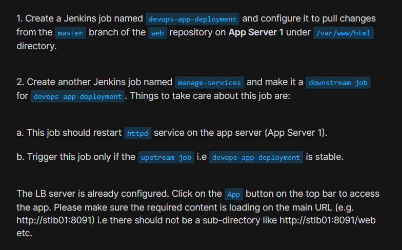
</div>

<div style="border:1px solid #ccc; padding:10px; border-radius:10px; box-shadow:2px 2px 8px rgba(0,0,0,0.2); display:inline-block;">
  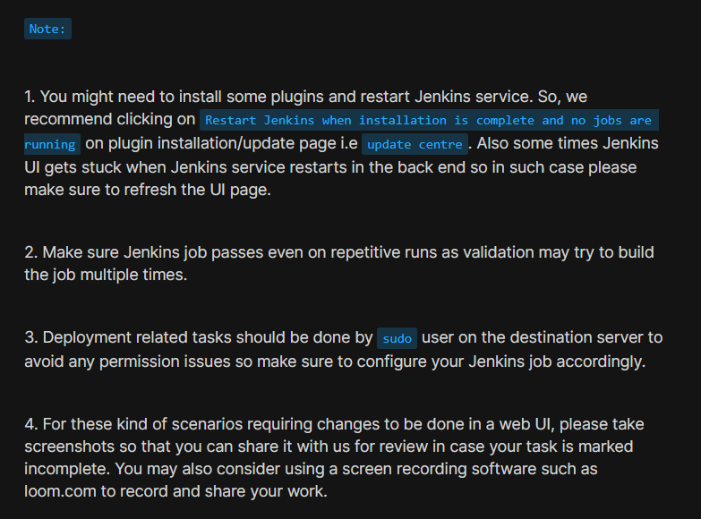
</div>

The Nautilus DevOps team wanted Jenkins to automatically deploy the latest changes from the Git repository and restart Apache only after a successful deployment.

Requirements:

### Deployment Job

Create a Jenkins job:

devops-app-deployment

**Responsibilities:**

*   Pull latest changes from master branch.
    
*   Use repository hosted in Gitea.
    
*   Execute deployment on App Server 1.
    
*   Update application files under:
    

/var/www/html

* * *

### Service Management Job

Create another Jenkins job:

**manage-services**

Responsibilities:

*   Restart Apache service.
    
*   Execute only when deployment succeeds.
    
*   Configure as a downstream job of devops-app-deployment.
    

* * *

## Environment Details

### Jenkins

| Field | Value |
| --- | --- |
| Username | admin |
| Password | Adm!n321 |

### Gitea

| Field | Value |
| --- | --- |
| Username | sarah |
| Password | Sarah\_pass123 |

### Application Server

| User | Password |
| --- | --- |
| sarah | Sarah\_pass123 |

* * *

## Steps I Followed

## 1\. Install Required Jenkins Plugins

Logged into Jenkins:

**Username:**

admin

**Password:**

Adm!n321

<div style="border:1px solid #ccc; padding:10px; border-radius:10px; box-shadow:2px 2px 8px rgba(0,0,0,0.2); display:inline-block;">
  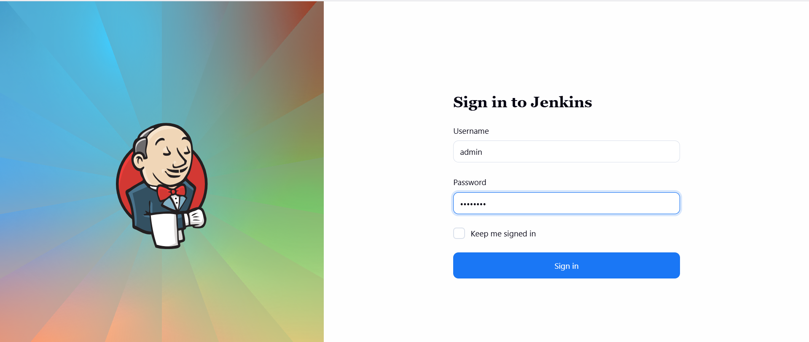
</div>


**Installed:**

*   Git Plugin
    
*   SSH Build Agents Plugin
    
<div style="border:1px solid #ccc; padding:10px; border-radius:10px; box-shadow:2px 2px 8px rgba(0,0,0,0.2); display:inline-block;">
  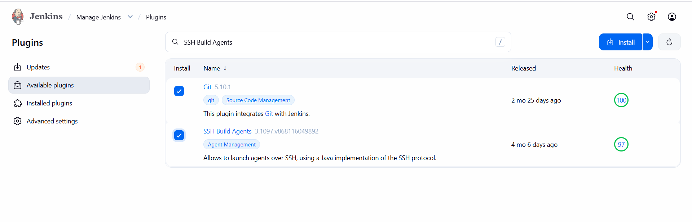
</div>

**Reason:**

*   Git Plugin allows Jenkins to clone and interact with repositories.
    
*   SSH Build Agents Plugin enables Jenkins to execute jobs on remote servers.
    

After installation:

Manage Jenkins → Restart Jenkins


<div style="border:1px solid #ccc; padding:10px; border-radius:10px; box-shadow:2px 2px 8px rgba(0,0,0,0.2); display:inline-block;">
  
</div>


* * *

## 2\. Prepare App Server for Jenkins Agent

Connected to App Server:

```bash
ssh sarah@stapp01
```

Verified Java:

```bash
java -version
```

Java 11 was installed.

Installed Java 17:

```bash
sudo yum install -y java-17-openjdk
```

**Reason:**

Jenkins agents require a compatible Java runtime to establish and maintain agent connections. Java 17 is supported by modern Jenkins versions.

Verified installation:

```bash
java -version
```
<div style="border:1px solid #ccc; padding:10px; border-radius:10px; box-shadow:2px 2px 8px rgba(0,0,0,0.2); display:inline-block;">
  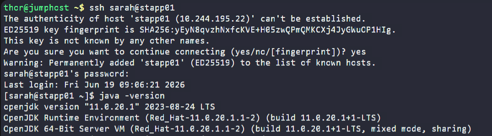
</div>

<div style="border:1px solid #ccc; padding:10px; border-radius:10px; box-shadow:2px 2px 8px rgba(0,0,0,0.2); display:inline-block;">
  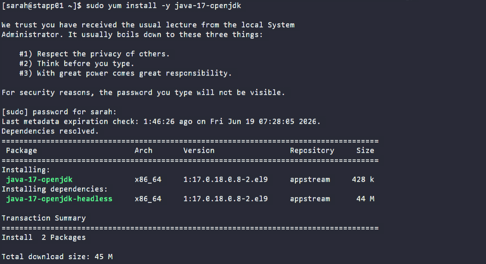
</div>

* * *

## 3\. Create Jenkins Credentials

**Navigate:**

```plaintext
Manage Jenkins → Credentials → System → Global Credentials → Add Credentials
```
<div style="border:1px solid #ccc; padding:10px; border-radius:10px; box-shadow:2px 2px 8px rgba(0,0,0,0.2); display:inline-block;">
  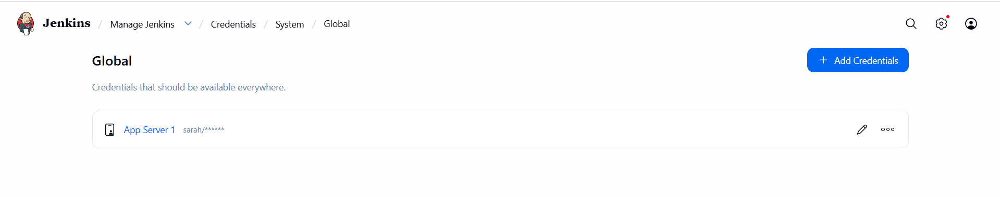
</div>

Configuration:

**Kind:**

Username with password

**Username:**

sarah

**Password:**

Sarah\_pass123

**ID:**

App Server 1

**Reason:**

Jenkins needs secure authentication to connect to App Server 1 and access Git resources without exposing credentials in job configurations.

* * *

## 4\. Configure Jenkins Agent

**Navigate:**

```plaintext
Manage Jenkins → Nodes → New Node
```
<div style="border:1px solid #ccc; padding:10px; border-radius:10px; box-shadow:2px 2px 8px rgba(0,0,0,0.2); display:inline-block;">
  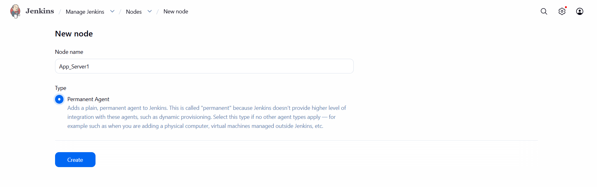
</div>

**Configuration:**

**Name:**

App\_Server1

**Remote Root Directory:**

```bash
/home/sarah
```

**Label:**

```bash
App_Server1
```
<div style="border:1px solid #ccc; padding:10px; border-radius:10px; box-shadow:2px 2px 8px rgba(0,0,0,0.2); display:inline-block;">
  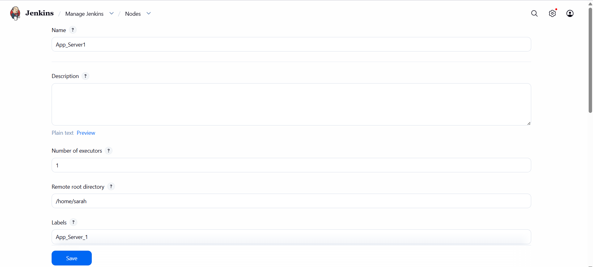
</div>

**Launch Method:**

Launch agents via SSH

**Host:**

```bash
stapp01
```

**Credentials:**

sarah

**Host Key Verification:**

Non Verifying Verification Strategy

<div style="border:1px solid #ccc; padding:10px; border-radius:10px; box-shadow:2px 2px 8px rgba(0,0,0,0.2); display:inline-block;">
  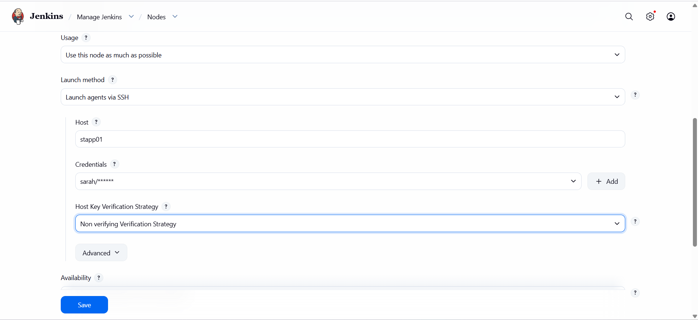
</div>

<div style="border:1px solid #ccc; padding:10px; border-radius:10px; box-shadow:2px 2px 8px rgba(0,0,0,0.2); display:inline-block;">
  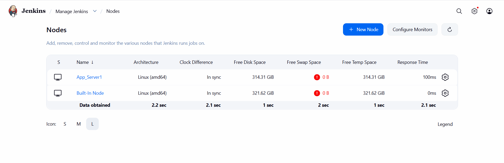
</div>

Reason:

Running deployment jobs directly on the target application server eliminates the need for additional SSH deployment steps and allows Jenkins to execute commands where the application actually resides.

* * *

## 5\. Obtain Git Repository URL

**Logged into Gitea using:**

**Username:**

sarah

**Password:**

Sarah\_pass123

**Repository:**

web

**Git URL:**

```bash
https://3000-port-bq5iztreg3szuocw.labs.kodekloud.com/sarah/web.git
```
<div style="border:1px solid #ccc; padding:10px; border-radius:10px; box-shadow:2px 2px 8px rgba(0,0,0,0.2); display:inline-block;">
  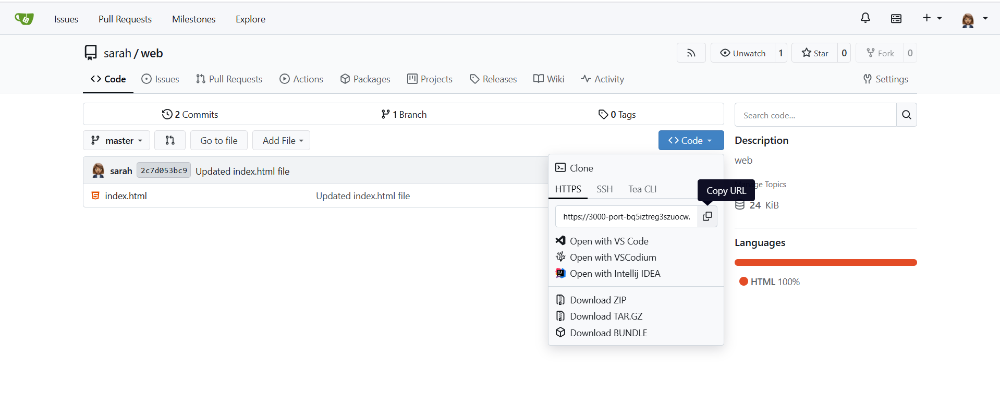
</div>

* * *

## 6\. Create Deployment Job


<div style="border:1px solid #ccc; padding:10px; border-radius:10px; box-shadow:2px 2px 8px rgba(0,0,0,0.2); display:inline-block;">
  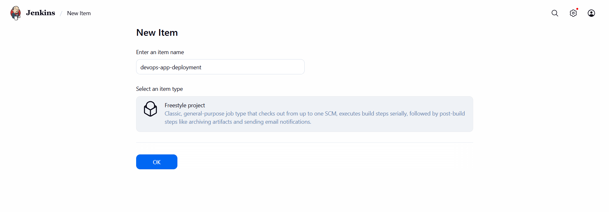
</div>

### Job Name

devops-app-deployment

### Type

Freestyle Project

* * *

<div style="border:1px solid #ccc; padding:10px; border-radius:10px; box-shadow:2px 2px 8px rgba(0,0,0,0.2); display:inline-block;">
  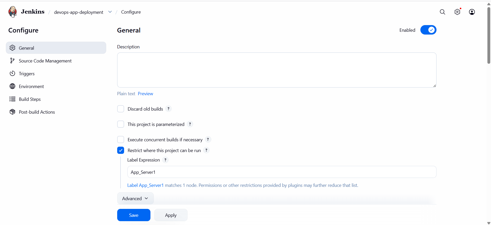
</div>

### Restrict Job to Agent

**Enabled:**

Restrict where this project can be run

**Label:**

```bash
App_Server1
```

**Reason:**

Deployment must execute on App Server 1 because the application files reside there.

* * *

### Configure Git Repository

<div style="border:1px solid #ccc; padding:10px; border-radius:10px; box-shadow:2px 2px 8px rgba(0,0,0,0.2); display:inline-block;">
  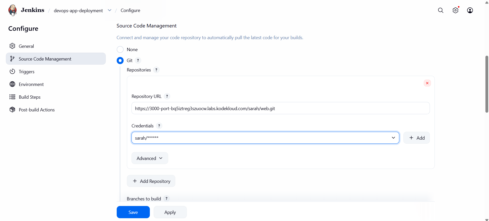
</div>

**Source Code Management:**

Git

Repository:

```bash
https://3000-port-bq5iztreg3szuocw.labs.kodekloud.com/sarah/web.git
```

**Credentials:**

sarah

Branch:

```bash
*/master
```

* * *

### Build Step

<div style="border:1px solid #ccc; padding:10px; border-radius:10px; box-shadow:2px 2px 8px rgba(0,0,0,0.2); display:inline-block;">
  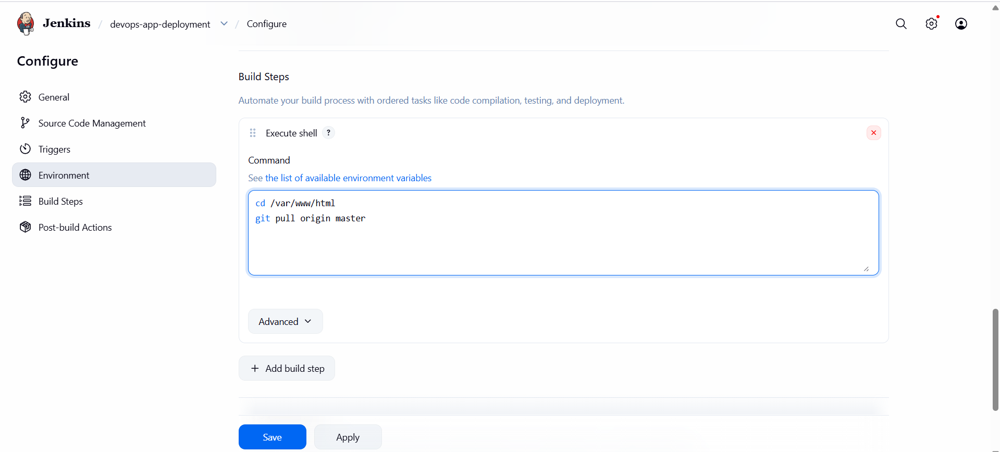
</div>

Execute Shell:

```bash
cd /var/www/html
git pull origin master
```

Reason:

The directory:

```bash
/var/www/html
```

was already configured as a local Git repository tracking the remote repository.

Therefore a simple:

```bash
git pull origin master
```

updates the deployed application to the latest version.

* * *

### Post Build Action

Build Other Projects

<div style="border:1px solid #ccc; padding:10px; border-radius:10px; box-shadow:2px 2px 8px rgba(0,0,0,0.2); display:inline-block;">
  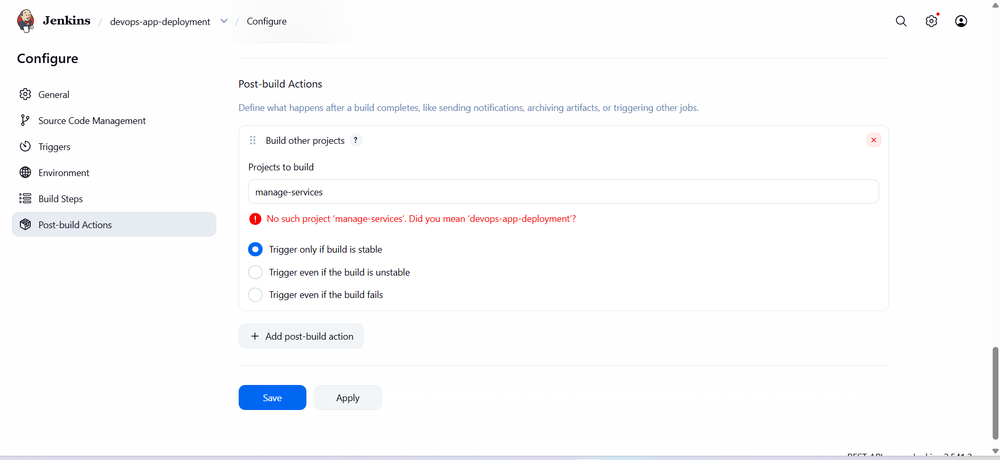
</div>

Project:

```bash
manage-services
```

Enabled:

Trigger only if build is stable

**Reason:**

This creates the upstream/downstream relationship and ensures service restart occurs only after successful deployment.

* * *

## 7\. Create Service Management Job

### Job Name

<div style="border:1px solid #ccc; padding:10px; border-radius:10px; box-shadow:2px 2px 8px rgba(0,0,0,0.2); display:inline-block;">
  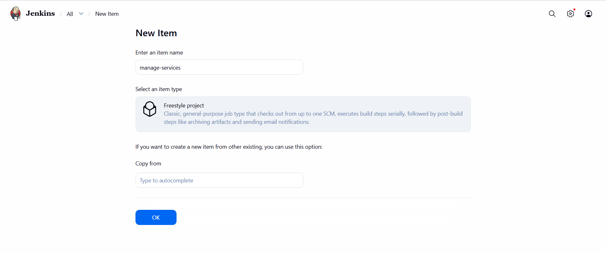
</div>

manage-services

### Type

Freestyle Project

* * *

### Restrict Job to Agent

<div style="border:1px solid #ccc; padding:10px; border-radius:10px; box-shadow:2px 2px 8px rgba(0,0,0,0.2); display:inline-block;">
  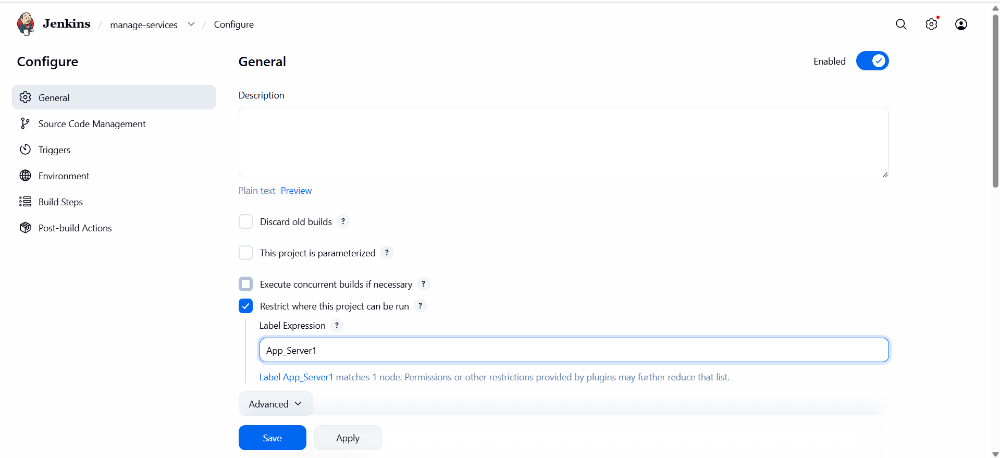
</div>


**Label:**

```bash
App_Server1
```

**Reason:**

Apache service runs on App Server 1.

* * *

### Parameter Configuration

**Enabled:**

`This project is parameterized`

Added:

`Password Parameter`

**Configuration:**

Name:

```bash
Sarah_Pass
```

Default Value:

```bash
Sarah_pass123
```
<div style="border:1px solid #ccc; padding:10px; border-radius:10px; box-shadow:2px 2px 8px rgba(0,0,0,0.2); display:inline-block;">
  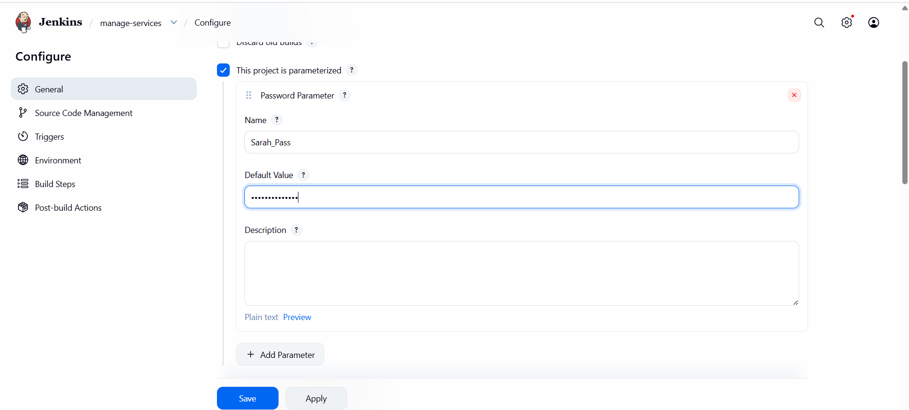
</div>


* * *

### Build Step

<div style="border:1px solid #ccc; padding:10px; border-radius:10px; box-shadow:2px 2px 8px rgba(0,0,0,0.2); display:inline-block;">
  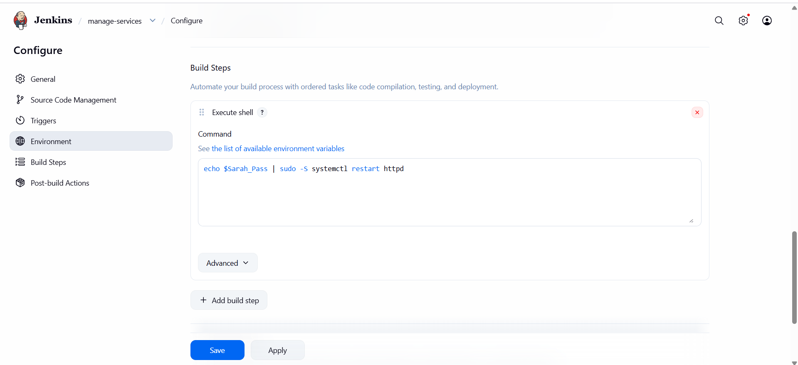
</div>


Execute Shell:

```bash
echo $Sarah_Pass | sudo -S systemctl restart httpd
```

**Reason:**

Task instructions specifically recommended performing deployment-related operations using sudo privileges to avoid permission issues.

This command:

*   Supplies sudo password securely.
    
*   Restarts Apache service.
    
*   Works consistently on repeated executions.
    

* * *

## 8\. Execute Deployment Pipeline

<div style="border:1px solid #ccc; padding:10px; border-radius:10px; box-shadow:2px 2px 8px rgba(0,0,0,0.2); display:inline-block;">
  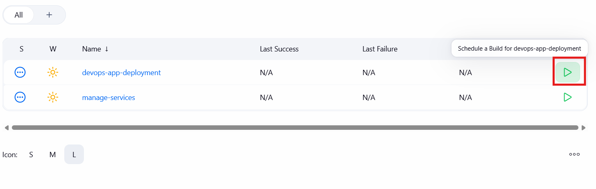
</div>


Triggered:

**Build Now**

for:

devops-app-deployment

**Execution Flow:**

```plaintext
devops-app-deployment
     ↓ 
Successful Build
     ↓ 
manage-services
     ↓
 Restart Apache
```

* * *

## 9\. Build Verification

<div style="border:1px solid #ccc; padding:10px; border-radius:10px; box-shadow:2px 2px 8px rgba(0,0,0,0.2); display:inline-block;">
  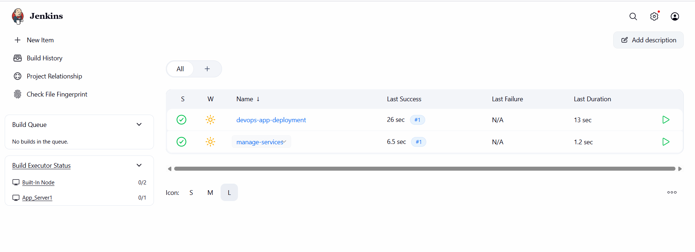
</div>

Observed:

### Deployment Job

Status:

SUCCESS

### Service Management Job

Status:

SUCCESS

**Build History:**

`devops-app-deployment Last Success #1`

`manage-services Last Success #1`

This confirmed that the downstream job was automatically triggered by the successful deployment job.

* * *

## Deployment Flow

```bash
Developer Pushes Code
     ↓
Gitea Repository
     ↓
devops-app-deployment
     ↓
git pull origin master
     ↓
Deployment Successful
     ↓
manage-services
     ↓
systemctl restart httpd
     ↓
Load Balancer
     ↓
Updated Application Available
```

* * *

## Important Notes for Similar Future Tasks

*   Install Git and SSH Build Agents plugins before configuring agents.
    
*   Ensure Java is installed on target agent nodes.
    
*   Use Jenkins credentials instead of hardcoding usernames and passwords.
    
*   Restrict deployment jobs to the correct agent using labels.
    
*   Keep deployment and service management in separate jobs.
    
*   Configure downstream jobs to execute only when upstream jobs are stable.
    
*   Use sudo for deployment-related operations to avoid permission issues.
    
*   Ensure jobs are idempotent and pass on repeated executions.
    

* * *

## My Understanding

This task demonstrated how Jenkins chained builds can be used to separate deployment logic from service management activities. Instead of combining everything into one large job, Jenkins can trigger dependent jobs only after successful execution of previous stages. This approach improves reliability, maintainability, and operational safety in production environments.

* * *

## What I Found Interesting

The most interesting part was seeing how Jenkins can create a simple deployment pipeline using only Freestyle Projects. By linking jobs together, I was able to create a basic workflow where code deployment automatically triggered service management without any manual intervention. It clearly demonstrated how upstream and downstream job relationships can be used to build scalable CI/CD processes.

* * *

### Topics Covered

- ***Jenkins***
- ***Jenkins Chained Builds***
- ***Git & Gitea Integration***
- ***Upstream & Downstream Jobs***
- ***SSH Key Authentication***
- ***Automated Application Deployment***
- ***Jenkins Pipeline***
- ***Apache (httpd)*** 
- ***Continuous Deployment (CD)***

**Previous Task**: [Day 79: Jenkins Deployment Job](../Day_79/day_79.md)

**Next Task**: [Day 81: Jenkins Multistage Pipeline](../Day_81/day_81.md)
