# Day 81: Jenkins Multistage Pipeline

<div style="border:1px solid #ccc; padding:10px; border-radius:10px; box-shadow:2px 2px 8px rgba(0,0,0,0.2); display:inline-block;">
  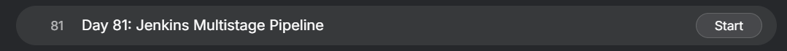
</div>

## Content

>Today I worked on creating a Jenkins Multistage Pipeline for xFusionCorp Industries. The objective was to automate the deployment of a static website hosted in a Gitea repository and deploy it on App Server 1 using Jenkins Pipeline stages. The pipeline was required to run on a Jenkins Agent and validate the deployment by testing the website through the Load Balancer URL.

---

## 🔹 What I Learned

* Jenkins Multistage Pipelines
* Jenkins Pipeline Stages
* Configuring Jenkins SSH Agents
* Automated Git-Based Deployments
* Deploying Applications on Remote Servers
* Validating Deployments with Automated Tests
* Using Jenkins Agents for Distributed Builds


---

## 🔹 Task Requirement

<div style="border:1px solid #ccc; padding:10px; border-radius:10px; box-shadow:2px 2px 8px rgba(0,0,0,0.2); display:inline-block;">
  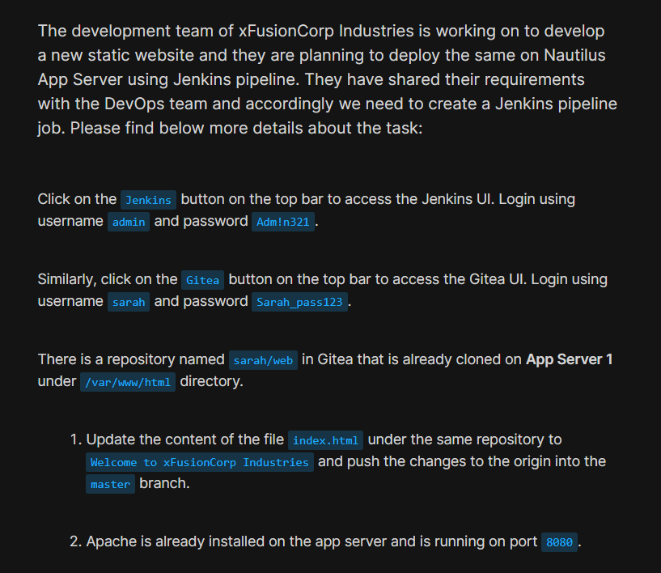
</div>

<div style="border:1px solid #ccc; padding:10px; border-radius:10px; box-shadow:2px 2px 8px rgba(0,0,0,0.2); display:inline-block;">
  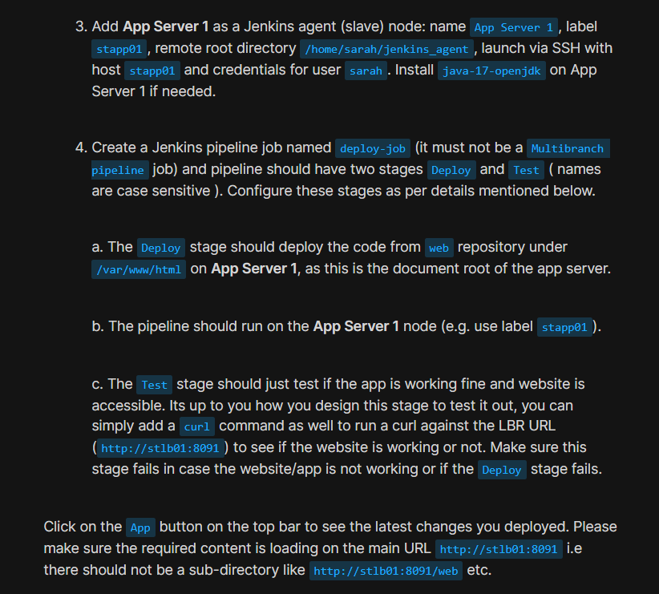
</div>

<div style="border:1px solid #ccc; padding:10px; border-radius:10px; box-shadow:2px 2px 8px rgba(0,0,0,0.2); display:inline-block;">
  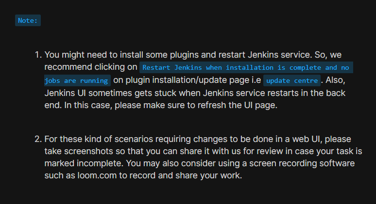
</div>

The development team at xFusionCorp Industries was developing a new static website and wanted Jenkins to automate its deployment.

The repository was already cloned on App Server 1 under:

```bash
/var/www/html
```

The Jenkins Pipeline needed to:

* Update the website content in the Gitea repository
* Deploy the latest code from the repository
* Execute deployment on App Server 1 through a Jenkins Agent
* Include two stages named:

  * Deploy
  * Test
* Validate website accessibility through the Load Balancer URL

---

## Jenkins Access Details

| Field    | Value    |
| -------- | -------- |
| Username | admin    |
| Password | Adm!n321 |

---

## Gitea Access Details

| Field    | Value         |
| -------- | ------------- |
| Username | sarah         |
| Password | Sarah_pass123 |

---

## Deployment Requirements

| Requirement                 | Value                                    |
| --------------------------- | ---------------------------------------- |
| Pipeline Job                | deploy-job                               |
| Agent Name                  | App Server 1                             |
| Agent Label                 | stapp01                                  |
| Repository                  | web                                      |
| Repository Location         | /var/www/html                            |
| Agent Remote Root Directory | /home/sarah/jenkins_agent                |
| Pipeline Stages             | Deploy, Test                             |
| Validation URL              | [http://stlb01:8091](http://stlb01:8091) |

---

## 🔹 Steps I Followed

## 1. Connected to App Server 1

Logged into App Server 1:

```bash
ssh sarah@stapp01
```

Authenticated using:

```text
Sarah_pass123
```

Successfully connected to the server.

<div style="border:1px solid #ccc; padding:10px; border-radius:10px; box-shadow:2px 2px 8px rgba(0,0,0,0.2); display:inline-block;">
  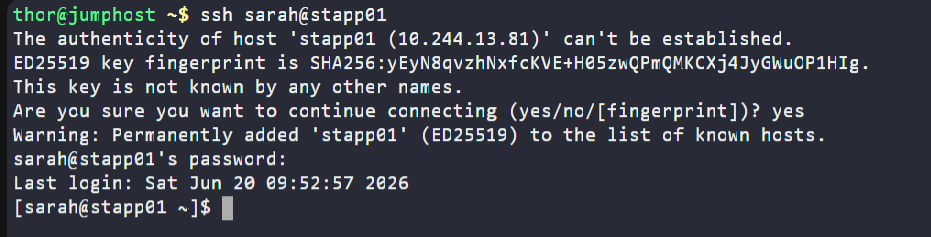
</div>

---

## 2. Verified Existing Website Content

Moved to the website directory:

```bash
cd /var/www/html
```

Verified contents:

```bash
ls
cat index.html
```

Output:

```text
Welcome
```

This confirmed the existing website content before deployment.

<div style="border:1px solid #ccc; padding:10px; border-radius:10px; box-shadow:2px 2px 8px rgba(0,0,0,0.2); display:inline-block;">
  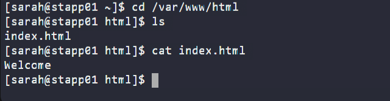
</div>

---

## 3. Installed Java 17 on App Server 1

Verified the existing Java version:

```bash
java -version
```

Output:

```text
openjdk version "11.0.20.1"
```

Installed OpenJDK 17:

```bash
sudo yum install -y java-17-openjdk
```

Authenticated using:

```text
Sarah_pass123
```

Installation completed successfully.

Java is required for Jenkins agents to communicate with the Jenkins controller.

<div style="border:1px solid #ccc; padding:10px; border-radius:10px; box-shadow:2px 2px 8px rgba(0,0,0,0.2); display:inline-block;">
  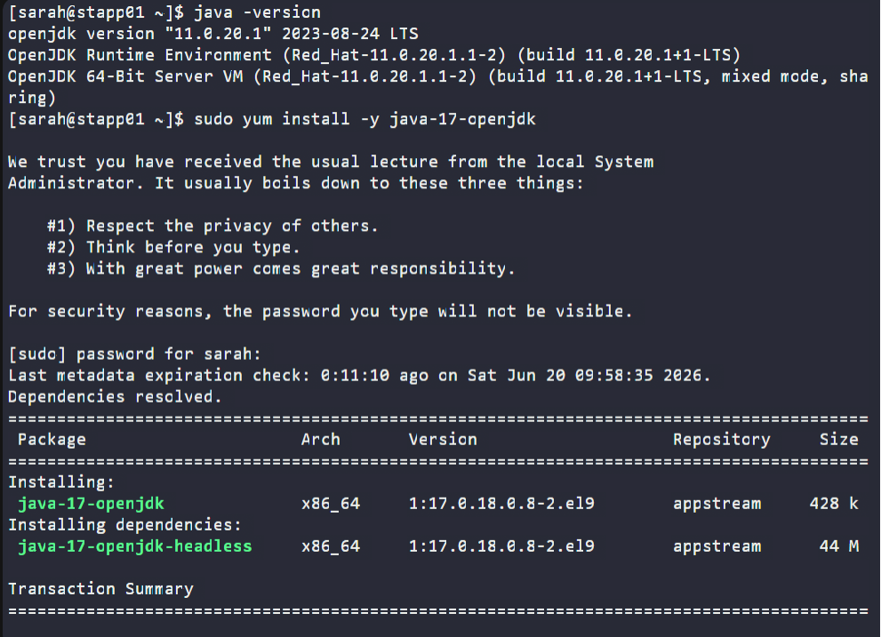
</div>

---

## 4. Accessed Jenkins

Clicked the Jenkins button available in the lab environment.

Logged in using:

```text
Username: admin
Password: Adm!n321
```

Successfully accessed the Jenkins Dashboard.

<div style="border:1px solid #ccc; padding:10px; border-radius:10px; box-shadow:2px 2px 8px rgba(0,0,0,0.2); display:inline-block;">
  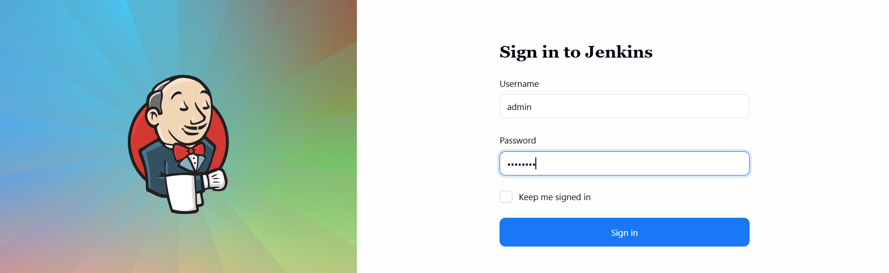
</div>

---

## 5. Installed Required Jenkins Plugins

<div style="border:1px solid #ccc; padding:10px; border-radius:10px; box-shadow:2px 2px 8px rgba(0,0,0,0.2); display:inline-block;">
  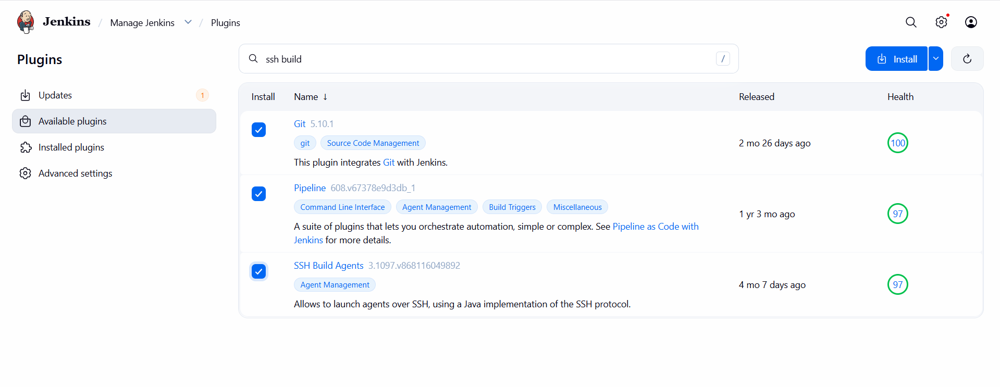
</div>

Navigated to:

```text
Manage Jenkins
→ Plugins
```

Installed:

* Git
* Pipeline
* SSH Build Agents

After installation:

* Restarted Jenkins
* Refreshed the browser
* Logged in again

---

## 6. Added Jenkins Credentials

<div style="border:1px solid #ccc; padding:10px; border-radius:10px; box-shadow:2px 2px 8px rgba(0,0,0,0.2); display:inline-block;">
  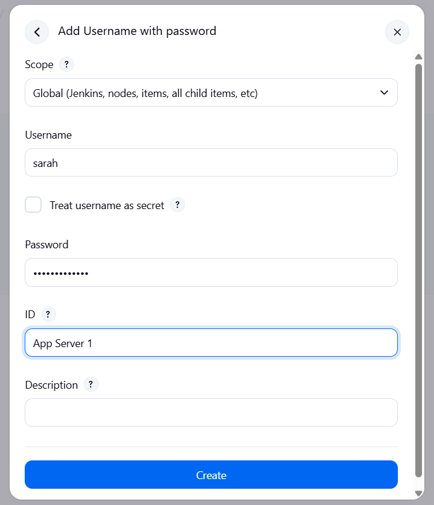
</div>

Navigated to:

```text
Manage Jenkins
→ Credentials
→ System
→ Global Credentials
→ Add Credentials
```

Configured:

| Field    | Value                  |
| -------- | ---------------------- |
| Kind     | Username with Password |
| Username | sarah                  |
| Password | Sarah_pass123          |
| ID       | App Server 1           |

Saved the credentials.

<div style="border:1px solid #ccc; padding:10px; border-radius:10px; box-shadow:2px 2px 8px rgba(0,0,0,0.2); display:inline-block;">
  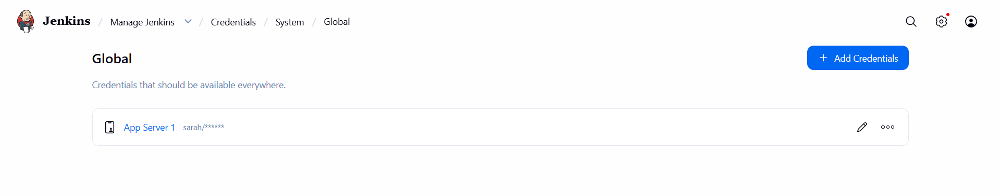
</div>
---

## 7. Configured Jenkins Agent

Navigated to:

```text
Manage Jenkins
→ Nodes
→ New Node
```

Configured:

| Field                 | Value                               |
| --------------------- | ----------------------------------- |
| Name                  | App Server 1                        |
| Remote Root Directory | /home/sarah/jenkins_agent           |
| Labels                | stapp01                             |
| Launch Method         | Launch agents via SSH               |
| Host                  | stapp01                             |
| Credentials           | sarah                               |
| Host Key Verification | Non-verifying Verification Strategy |

Saved the configuration.

Jenkins successfully connected to the remote server.

Agent Status:

```text
Connected
```
<div style="border:1px solid #ccc; padding:10px; border-radius:10px; box-shadow:2px 2px 8px rgba(0,0,0,0.2); display:inline-block;">
  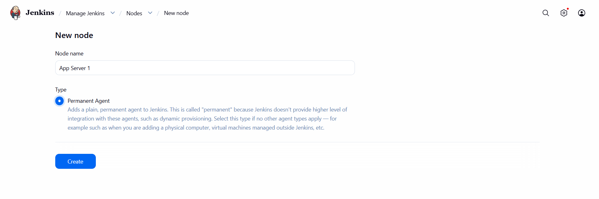
</div>

<div style="border:1px solid #ccc; padding:10px; border-radius:10px; box-shadow:2px 2px 8px rgba(0,0,0,0.2); display:inline-block;">
  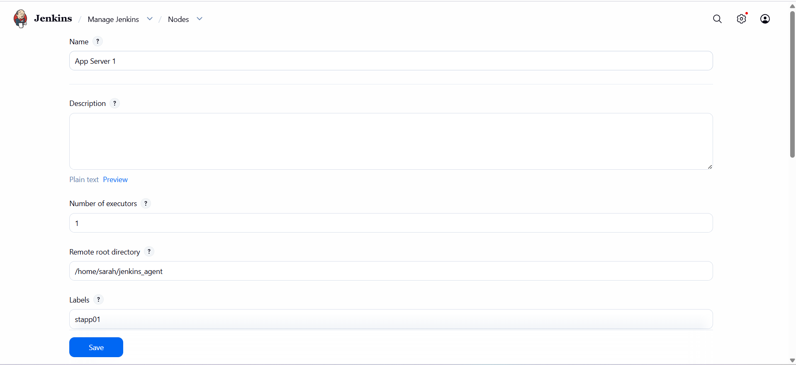
</div>

<div style="border:1px solid #ccc; padding:10px; border-radius:10px; box-shadow:2px 2px 8px rgba(0,0,0,0.2); display:inline-block;">
  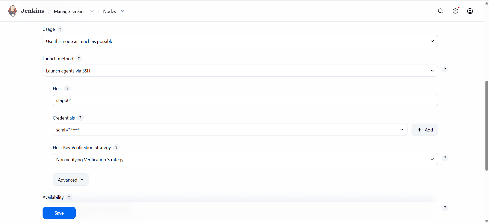
</div>

<div style="border:1px solid #ccc; padding:10px; border-radius:10px; box-shadow:2px 2px 8px rgba(0,0,0,0.2); display:inline-block;">
  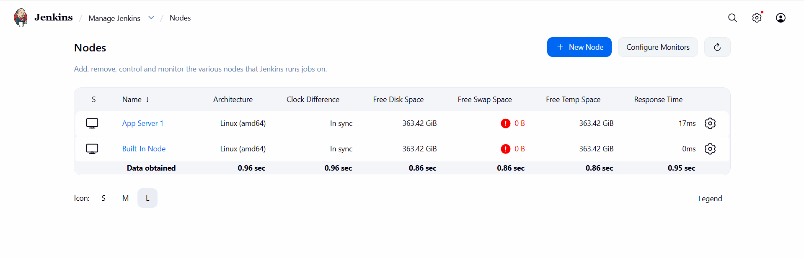
</div>

---

## 8. Created Jenkins Pipeline Job

Navigated to:

```text
New Item
```

Entered:

```text
deploy-job
```

Selected:

```text
Pipeline
```

Clicked:

```text
OK
```
<div style="border:1px solid #ccc; padding:10px; border-radius:10px; box-shadow:2px 2px 8px rgba(0,0,0,0.2); display:inline-block;">
  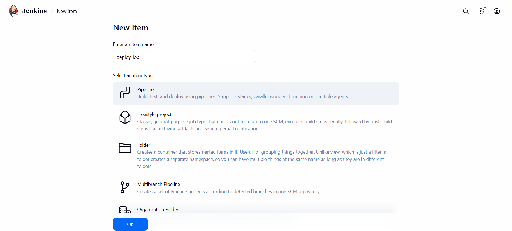
</div>

---

## 9. Added Pipeline Script

Under:

```text
Pipeline
→ Definition
→ Pipeline Script
```

Added:

```groovy
pipeline {
    agent { label 'stapp01' }

    stages {

        stage('Deploy') {
            steps {
                sh '''
                cd /var/www/html
                git pull origin master
                '''
            }
        }

        stage('Test') {
            steps {
                sh '''
                curl -f http://stlb01:8091
                '''
            }
        }

    }
}
```

<div style="border:1px solid #ccc; padding:10px; border-radius:10px; box-shadow:2px 2px 8px rgba(0,0,0,0.2); display:inline-block;">
  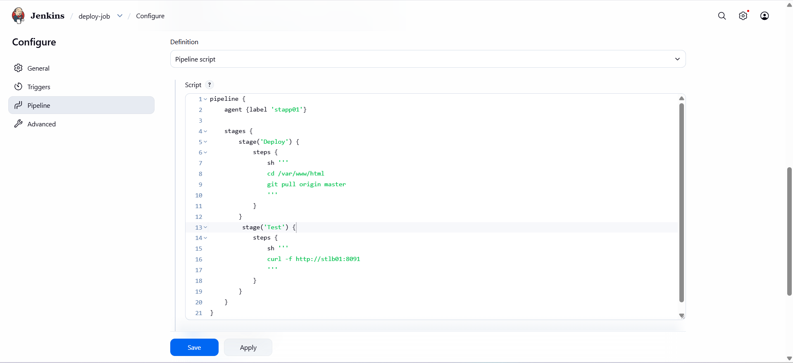
</div>

---

## 10. Understanding the Pipeline

### Agent Section

```groovy
agent { label 'stapp01' }
```

Ensures the pipeline runs only on the Jenkins Agent configured on App Server 1.

---

### Deploy Stage

```groovy
stage('Deploy')
```

The task explicitly required a stage named:

```text
Deploy
```

This stage:

* Moves to the existing repository
* Pulls the latest code from Gitea
* Updates the deployed website

Command executed:

```bash
cd /var/www/html
git pull origin master
```

---

### Test Stage

```groovy
stage('Test')
```

The task explicitly required a stage named:

```text
Test
```

This stage validates that the application is working correctly after deployment.

Command executed:

```bash
curl -f http://stlb01:8091
```

The `-f` option ensures the build fails if the website is inaccessible or returns an error status.

---

## 11. Updated Website Content in Gitea

Clicked the Gitea button and logged in using:

```text
Username: sarah
Password: Sarah_pass123
```
<div style="border:1px solid #ccc; padding:10px; border-radius:10px; box-shadow:2px 2px 8px rgba(0,0,0,0.2); display:inline-block;">
  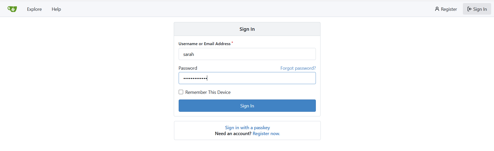
</div>

Opened repository:

```text
sarah/web
```

Edited:

```text
index.html
```

<div style="border:1px solid #ccc; padding:10px; border-radius:10px; box-shadow:2px 2px 8px rgba(0,0,0,0.2); display:inline-block;">
  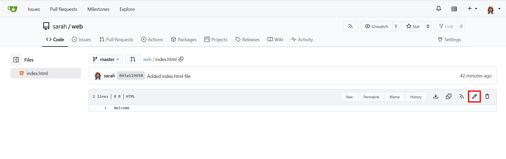
</div>

Changed content from:

```text
Welcome
```

to:

```text
Welcome to xFusionCorp Industries
```
<div style="border:1px solid #ccc; padding:10px; border-radius:10px; box-shadow:2px 2px 8px rgba(0,0,0,0.2); display:inline-block;">
  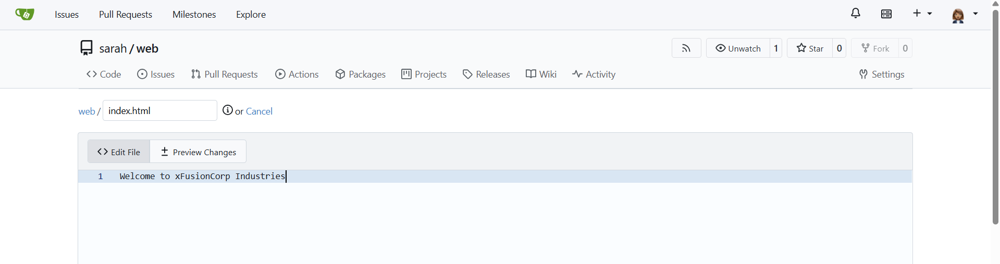
</div>

Committed the changes to the:

```text
master
```
branch.

<div style="border:1px solid #ccc; padding:10px; border-radius:10px; box-shadow:2px 2px 8px rgba(0,0,0,0.2); display:inline-block;">
  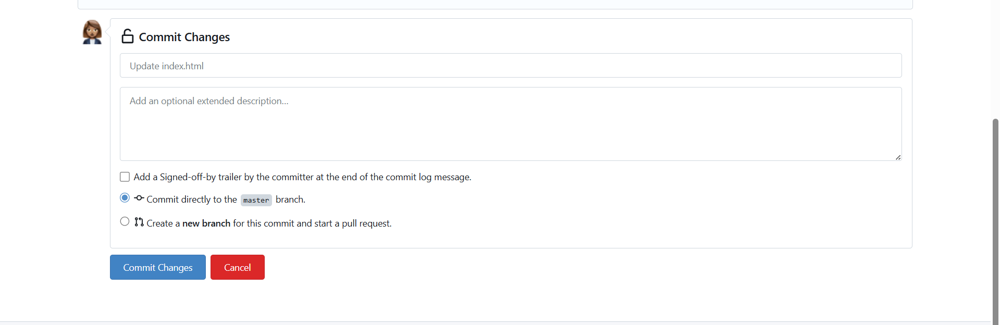
</div>

<div style="border:1px solid #ccc; padding:10px; border-radius:10px; box-shadow:2px 2px 8px rgba(0,0,0,0.2); display:inline-block;">
  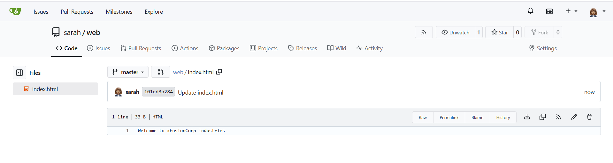
</div>

---

## 12. Verified Website Before Deployment

Clicked the:

```text
App
```

button.

Output:

```text
Welcome
```

The old content was still displayed because deployment had not yet occurred.

<div style="border:1px solid #ccc; padding:10px; border-radius:10px; box-shadow:2px 2px 8px rgba(0,0,0,0.2); display:inline-block;">
  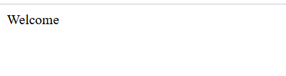
</div>
---

## 13. Triggered Jenkins Build

Opened:

```text
deploy-job
→ Build Now
```

Build Status:

```text
SUCCESS
```
<div style="border:1px solid #ccc; padding:10px; border-radius:10px; box-shadow:2px 2px 8px rgba(0,0,0,0.2); display:inline-block;">
  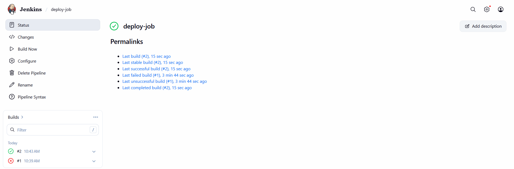
</div>
---

## 14. Verified Deploy Stage Output

Console Output:

```bash
git pull origin master
```

Output:

```text
Updating 043a119..101ed3a
Fast-forward
index.html updated
```

This confirmed that Jenkins successfully pulled the latest changes from Gitea.
<div style="border:1px solid #ccc; padding:10px; border-radius:10px; box-shadow:2px 2px 8px rgba(0,0,0,0.2); display:inline-block;">
  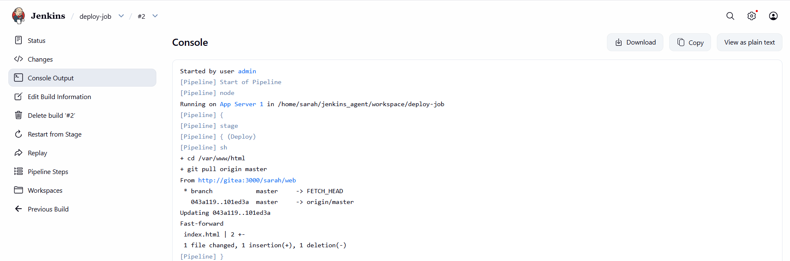
</div>

---

## 15. Verified Test Stage Output

Pipeline executed:

```bash
curl -f http://stlb01:8091
```

Output:

```text
Welcome to xFusionCorp Industries
```

This confirmed that the application was accessible and serving the updated content.

<div style="border:1px solid #ccc; padding:10px; border-radius:10px; box-shadow:2px 2px 8px rgba(0,0,0,0.2); display:inline-block;">
  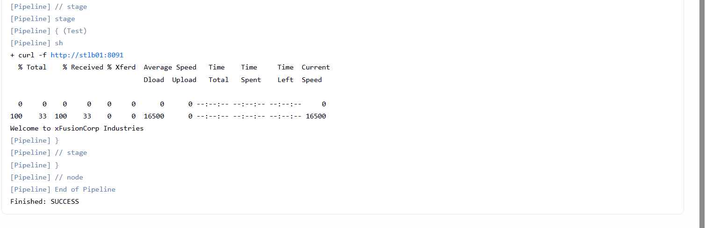
</div>

---

## 16. Verified Build Result

Jenkins reported:

```text
Last build (#2) SUCCESS
Last stable build (#2) SUCCESS
Last successful build (#2) SUCCESS
```

Pipeline execution completed successfully.

---

## 17. Verified Application

Clicked the:

```text
App
```

button available in the lab environment.

Verified output:

```text
Welcome to xFusionCorp Industries
```

Confirmed that the application was loading directly from:

```text
http://stlb01:8091
```

and not from a subdirectory such as:

```text
http://stlb01:8091/web
```
<div style="border:1px solid #ccc; padding:10px; border-radius:10px; box-shadow:2px 2px 8px rgba(0,0,0,0.2); display:inline-block;">
  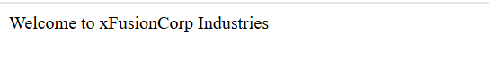
</div>
---

## 18. Verified Deployment on App Server

Connected to App Server 1:

```bash
cd /var/www/html
cat index.html
```

Output:

```text
Welcome to xFusionCorp Industries
```
<div style="border:1px solid #ccc; padding:10px; border-radius:10px; box-shadow:2px 2px 8px rgba(0,0,0,0.2); display:inline-block;">
  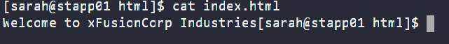
</div>

This confirmed the deployed content on the server matched the latest repository version.

---

## 🔹 Simple Explanation of Jenkins Components Used

## Jenkins Agent

A Jenkins Agent is a remote machine that executes build and deployment tasks.

In this task:

```text
App Server 1
```

acted as the Jenkins Agent.

---

## Agent Labels

Labels help Jenkins determine where jobs should run.

Example:

```groovy
agent {
    label 'stapp01'
}
```

This ensures deployment occurs only on App Server 1.

---

## Pipeline Stages

Stages divide a pipeline into logical sections.

In this task:

```text
Deploy
Test
```

Deploy updated the application.

Test verified the application was accessible after deployment.

---

## Git-Based Deployment

Instead of cloning a repository during every build, the pipeline operated directly on the existing repository:

```bash
git pull origin master
```

This is faster and aligns with the repository structure provided by the task.

---

## Deployment Validation

The Test stage used:

```bash
curl -f http://stlb01:8091
```

to ensure the application was reachable.

If the website returned an error or was unavailable, Jenkins would automatically fail the build.

---

## Continuous Deployment

The deployment process was fully automated:

1. Developer updates code in Gitea
2. Jenkins runs on the remote agent
3. Latest code is pulled from Git
4. Website is deployed
5. Application is tested automatically
6. Deployment succeeds only if validation passes

---

## 🔹 My Understanding

This task helped me understand how Jenkins Multistage Pipelines can automate both deployment and validation in a single workflow. Instead of only deploying code, the pipeline also verified application availability before reporting success. 
---

## 🔹 What I Found Interesting

I found it interesting that Jenkins could perform deployment and validation as separate stages within the same pipeline. The Deploy stage handled the application update, while the Test stage acted as a quality gate by verifying the website through the Load Balancer URL. 

* * *

### Topics Covered

- ***Jenkins***
- ***Multistage Pipeline***
- ***Git & Gitea Integration***
- ***Jenkins Agents***
- ***Automated Application Deployment***
- ***Jenkins stages***
- ***Deployment Testing*** 
- ***Continuous Deployment (CD)***

**Previous Task**: [ Day 80: Jenkins Chained Builds](../Day_80/day_80.md)

**Next Task**: [Day 81: Jenkins Multistage Pipeline](../Day_82day_82.md)
