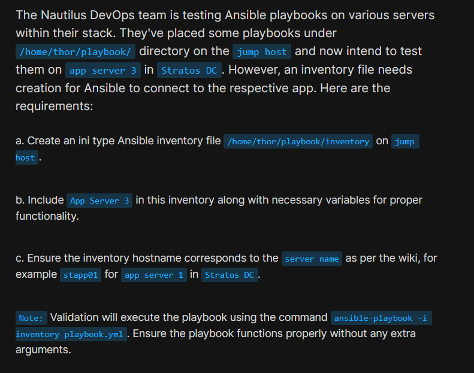
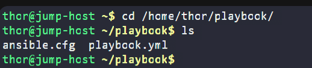
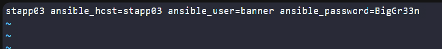
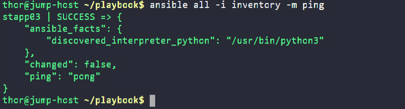

# Day 82: Create Ansible Inventory for App Server Testing
<div style="border:1px solid #ccc; padding:10px; border-radius:10px; box-shadow:2px 2px 8px rgba(0,0,0,0.2); display:inline-block;">
  
</div>

## Content

>Today I worked on creating an Ansible inventory file for testing playbooks on a remote application server. This task helped me understand how Ansible inventories define target hosts, how connection variables are configured, and how Ansible uses inventory information to connect to remote systems without requiring additional command-line arguments.

---

## 🔹 What I Learned

* Understanding the purpose of an Ansible Inventory
* Difference between Inventory and Playbook
* Configuring remote host connection variables
* Using inventory hostnames and host variables
* Testing Ansible connectivity using the ping module
* Running ad-hoc Ansible commands against specific hosts

---

## 🔹 Task Requirement

<div style="border:1px solid #ccc; padding:10px; border-radius:10px; box-shadow:2px 2px 8px rgba(0,0,0,0.2); display:inline-block;">
  
</div>

As per the Nautilus DevOps team requirements, I needed to:

Create an Ansible inventory file with the following specifications:

| Requirement        | Value                                      |
| ------------------ | ------------------------------------------ |
| Inventory Type     | INI                                        |
| Inventory Location | /home/thor/playbook/inventory              |
| Target Server      | App Server 3                               |
| Inventory Hostname | stapp03                                    |
| User               | banner                                     |
| Password           | BigGr33n                                   |
| Validation Command | ansible-playbook -i inventory playbook.yml |

The inventory needed to allow Ansible to connect successfully to App Server 3 without passing any additional arguments.

---

## 🔹 Steps I Followed

### 1. Connected to the Jump Host

Logged into the jump host where the Ansible playbook was already available.

Executed:

```bash
cd /home/thor/playbook
```

Verified the existing files:

```bash
ls
```

Output:

```bash
ansible.cfg  playbook.yml
```
<div style="border:1px solid #ccc; padding:10px; border-radius:10px; box-shadow:2px 2px 8px rgba(0,0,0,0.2); display:inline-block;">
  
</div>

---

### 2. Reviewed the Existing Playbook

Executed:

```bash
cat playbook.yml
```

Observed:

```yaml
---
- hosts: all
  become: yes
  become_user: root

  tasks:
    - name: Install httpd package
      yum:
        name: httpd
        state: installed

    - name: Start service httpd
      service:
        name: httpd
        state: started
```

This playbook installs and starts the Apache HTTP server on all hosts provided by the inventory.

---

### 3. Created the Inventory File

Created the inventory file:

```bash
vi inventory
```
<div style="border:1px solid #ccc; padding:10px; border-radius:10px; box-shadow:2px 2px 8px rgba(0,0,0,0.2); display:inline-block;">
  
</div>

Added the following host entry:

```ini
stapp03 ansible_host=stapp03 ansible_user=banner ansible_password=BigGr33n
```
<div style="border:1px solid #ccc; padding:10px; border-radius:10px; box-shadow:2px 2px 8px rgba(0,0,0,0.2); display:inline-block;">
  
</div>

Saved and exited the file.


---

## 🔹 Simple Explanation of the Inventory Entry

### Inventory Hostname

```ini
stapp03
```

This is the inventory hostname.

The task specifically required using the hostname corresponding to App Server 3.

---

### Host Connection Address

```ini
ansible_host=stapp03
```

Specifies the address Ansible should connect to.

In this environment, the hostname itself was resolvable.

---

### SSH User

```ini
ansible_user=banner
```

Defines the remote user Ansible uses for authentication.

---

### SSH Password

```ini
ansible_password=BigGr33n
```

Provides the password required for remote login.

---

### Complete Inventory Entry

```ini
stapp03 ansible_host=stapp03 ansible_user=banner ansible_password=BigGr33n
```

👉 In simple terms:

This inventory entry tells Ansible:

* Which server to manage
* How to connect to that server
* Which user account to use
* What password to authenticate with

---

### 4. Verified Inventory Connectivity

Executed:

```bash
ansible all -i inventory -m ping
```
<div style="border:1px solid #ccc; padding:10px; border-radius:10px; box-shadow:2px 2px 8px rgba(0,0,0,0.2); display:inline-block;">
  
</div>


Observed:

```json
stapp03 | SUCCESS => {
    "changed": false,
    "ping": "pong"
}
```

This confirmed:

* Inventory file was valid
* Hostname resolution worked
* Authentication was successful
* Ansible could communicate with App Server 3

---

### 5. Additional Validation

Executed:

```bash
ansible stapp03 -i inventory -m ping
```

This targeted only App Server 3 and confirmed connectivity.

Executed:

```bash
ansible stapp03 -i inventory -m command -a "hostname"
```

This executed a remote command and verified that Ansible was connecting to the correct server.

---

## 🔹 Understanding Inventory vs Playbook

One important concept I learned during this task is the difference between Inventory and Playbook.

### Inventory

Defines:

* Where tasks run
* Hostnames
* Connection details
* Authentication variables

Example:

```ini
stapp03 ansible_host=stapp03 ansible_user=banner ansible_password=BigGr33n
```

### Playbook

Defines:

* What tasks should be executed

Example:

```yaml
hosts: all
```

Since the inventory contained only one host, `all` referred only to App Server 3.

---

## 🔹 My Understanding

This task strengthened my understanding of how Ansible separates infrastructure information from automation logic.

The inventory tells Ansible where to connect, while the playbook defines what actions should be performed on the target systems.

---

## 🔹 What I Found Interesting

I found it interesting that the playbook never explicitly mentioned App Server 3. Instead, Ansible dynamically determined the target host from the inventory file.

* * *

### Topics Covered

- ***Ansible***
- ***Ansible Inventory***
- ***Host Configuration***
- ***Remote Server Management***
- ***Ad-hoc Commands***
- ***Playbook Execution***

**Previous Task**: [ Day 81: Jenkins Multistage Pipeline](../Day_81/day_81.md)

**Next Task**: [Day 83: Troubleshoot and Create Ansible Playbook](../Day_83/day_83.md)


