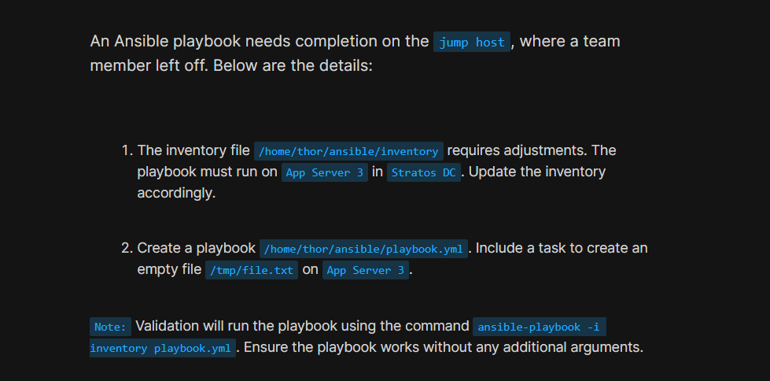
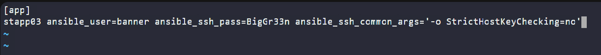
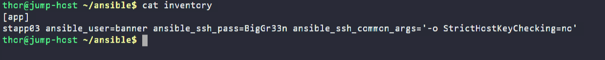
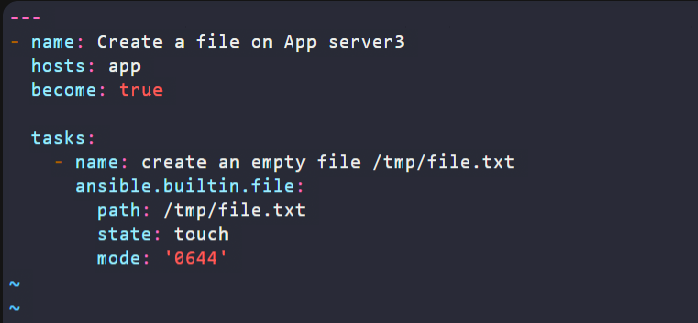
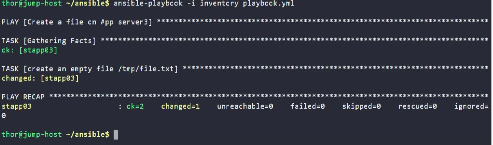

# Day 83: Troubleshoot and Create Ansible Playbook

<div style="border:1px solid #ccc; padding:10px; border-radius:10px; box-shadow:2px 2px 8px rgba(0,0,0,0.2); display:inline-block;">
  
</div>

## Content

>Today I worked on troubleshooting an existing Ansible configuration and creating a playbook to perform a simple file management task on a remote application server. This task helped me understand how inventories are structured, how Ansible groups hosts, and how playbooks can be used to create files on remote systems.

---

## 🔹 What I Learned

* Troubleshooting Ansible inventory files
* Creating inventory groups
* Configuring host authentication variables
* Using the `file` module to manage files remotely
* Creating files using `state: touch`
* Running and validating Ansible playbooks

---

## 🔹 Task Requirement
<div style="border:1px solid #ccc; padding:10px; border-radius:10px; box-shadow:2px 2px 8px rgba(0,0,0,0.2); display:inline-block;">
  
</div>

As per the Nautilus DevOps team requirements, I needed to:

1. Review and fix the inventory file located at:

```bash
/home/thor/ansible/inventory
```

2. Ensure the playbook runs on **App Server 3** in the Stratos Datacenter.

3. Create a playbook:

```bash
/home/thor/ansible/playbook.yml
```

4. Add a task to create an empty file:

```bash
/tmp/file.txt
```

on App Server 3.

5. Ensure the solution works using:

```bash
ansible-playbook -i inventory playbook.yml
```

without requiring any additional arguments.

---

## 🔹 Steps I Followed

### 1. Connected to the Working Directory

Moved into the Ansible project directory:

```bash
cd /home/thor/ansible/
```

Verified available files:

```bash
ls
```

Output:

```bash
inventory
```

---

### 2. Reviewed the Existing Inventory

Checked the current inventory file:

```bash
cat inventory
```

Output:

```ini
stapp03 ansible_user=banner ansible_ssh_pass=$pwd ansible_ssh_common_args='-o StrictHostKeyChecking=no'
```

I noticed two issues:

* The password variable `$pwd` was not a valid password value.
* No inventory group was defined.

Since the playbook would target a host group, I needed to organize the server into an inventory group.

---

### 3. Updated the Inventory File

Edited the inventory:

```bash
vi inventory
```
<div style="border:1px solid #ccc; padding:10px; border-radius:10px; box-shadow:2px 2px 8px rgba(0,0,0,0.2); display:inline-block;">
  
</div>

Updated content:

```ini
[app]
stapp03 ansible_user=banner ansible_ssh_pass=BigGr33n ansible_ssh_common_args='-o StrictHostKeyChecking=no'
```
<div style="border:1px solid #ccc; padding:10px; border-radius:10px; box-shadow:2px 2px 8px rgba(0,0,0,0.2); display:inline-block;">
  
</div>

Saved and verified:

```bash
cat inventory
```
<div style="border:1px solid #ccc; padding:10px; border-radius:10px; box-shadow:2px 2px 8px rgba(0,0,0,0.2); display:inline-block;">
  
</div>

Output:

```ini
[app]
stapp03 ansible_user=banner ansible_ssh_pass=BigGr33n ansible_ssh_common_args='-o StrictHostKeyChecking=no'
```

---

## 🔹 Simple Explanation of the Inventory Entry

### Inventory Group

```ini
[app]
```

Defines a host group named **app**.

Playbooks can target this group instead of individual hosts.

---

### Inventory Host

```ini
stapp03
```

Represents App Server 3.

This is the server Ansible will manage.

---

### SSH User

```ini
ansible_user=banner
```

Specifies the remote user account used for authentication.

---

### SSH Password

```ini
ansible_ssh_pass=BigGr33n
```

Provides the password used to connect to the server.

---

### SSH Argument

```ini
ansible_ssh_common_args='-o StrictHostKeyChecking=no'
```

Disables SSH host key verification prompts.

This prevents Ansible from stopping for manual confirmation when connecting to a host for the first time.

---

### Complete Inventory Entry

```ini
[app]
stapp03 ansible_user=banner ansible_ssh_pass=BigGr33n ansible_ssh_common_args='-o StrictHostKeyChecking=no'
```

👉 In simple terms:

This inventory tells Ansible:

* Which server to manage
* Which user account to use
* What password to authenticate with
* To skip SSH host key confirmation prompts

---

### 4. Created the Playbook

Created the playbook file:

```bash
vi /home/thor/ansible/playbook.yml
```
<div style="border:1px solid #ccc; padding:10px; border-radius:10px; box-shadow:2px 2px 8px rgba(0,0,0,0.2); display:inline-block;">
  
</div>

Added the following content:

```yaml
---
- name: Create a file on App server3
  hosts: app
  become: true

  tasks:
    - name: create an empty file /tmp/file.txt
      ansible.builtin.file:
        path: /tmp/file.txt
        state: touch
        mode: '0644'
```

<div style="border:1px solid #ccc; padding:10px; border-radius:10px; box-shadow:2px 2px 8px rgba(0,0,0,0.2); display:inline-block;">
  
</div>
Saved the file.

---

## 🔹 Understanding the Playbook

### Target Hosts

```yaml
hosts: app
```

The playbook targets all hosts within the **app** inventory group.

Since only App Server 3 exists in this group, the task runs only on that server.

---

### Privilege Escalation

```yaml
become: true
```

Allows Ansible to execute tasks with elevated privileges.

---

### File Module

```yaml
ansible.builtin.file
```

The file module is used to manage files and directories on remote systems.

---

### Creating an Empty File

```yaml
state: touch
```

Works similarly to the Linux `touch` command.

If the file does not exist, it is created.

If it already exists, only its timestamp is updated.

---

### File Permissions

```yaml
mode: '0644'
```

Sets the file permissions to:

* Owner: Read + Write
* Group: Read
* Others: Read

---

### 5. Executed the Playbook

Ran the playbook:

```bash
ansible-playbook -i inventory playbook.yml
```
<div style="border:1px solid #ccc; padding:10px; border-radius:10px; box-shadow:2px 2px 8px rgba(0,0,0,0.2); display:inline-block;">
  
</div>

Output:

```text
PLAY [Create a file on App server3]

TASK [Gathering Facts]
ok: [stapp03]

TASK [create an empty file /tmp/file.txt]
changed: [stapp03]

PLAY RECAP
stapp03 : ok=2 changed=1 unreachable=0 failed=0 skipped=0 rescued=0 ignored=0
```

---

## 🔹 Understanding the Output

### Gathering Facts

```text
TASK [Gathering Facts]
```

Ansible collects system information from the target host before executing tasks.

Examples include:

* Hostname
* Operating system
* Network information
* Memory details

---

### File Creation Task

```text
changed: [stapp03]
```

Indicates the task successfully created the file.

---

### Play Recap

```text
ok=2
changed=1
failed=0
```

Meaning:

* Two tasks completed successfully
* One task modified the system
* No failures occurred

---

## 🔹 Inventory vs Playbook

One important concept reinforced during this task was the separation between inventory and playbook responsibilities.

### Inventory

Defines:

* Which systems to manage
* Authentication details
* Connection settings
* Host groups

Example:

```ini
[app]
stapp03 ansible_user=banner ansible_ssh_pass=BigGr33n
```

---

### Playbook

Defines:

* What actions should be performed
* Which modules should be used
* Which host groups should receive the tasks

Example:

```yaml
hosts: app
```

and

```yaml
state: touch
```

---

## 🔹 My Understanding

This task strengthened my understanding of how Ansible inventories and playbooks work together.

The inventory defines the infrastructure and connection details, while the playbook contains the automation logic. By organizing hosts into groups, playbooks become reusable and easier to manage across multiple servers.

---

## 🔹 What I Found Interesting

I found it interesting that a simple file creation task required proper inventory configuration before the playbook could run successfully. This reinforced the idea that in Ansible, connectivity and inventory management are just as important as the automation tasks themselves.

I also learned how the `file` module can mimic common Linux commands like `touch`, making infrastructure automation both readable and efficient.


* * *

### Topics Covered

- ***Ansible***
- ***Ansible Inventory***
- ***Host Configuration***
- ***Remote Server Management***
- ***Ad-hoc Commands***
- ***Playbook Execution***

**Previous Task**: [ Day 82: Create Ansible Inventory for App Server Testing](../Day_82/day_82.md)

**Next Task**: [Day 84: Copy Data to App Servers using Ansible](../Day_84/day_84.md)
