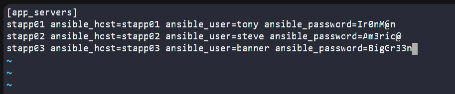
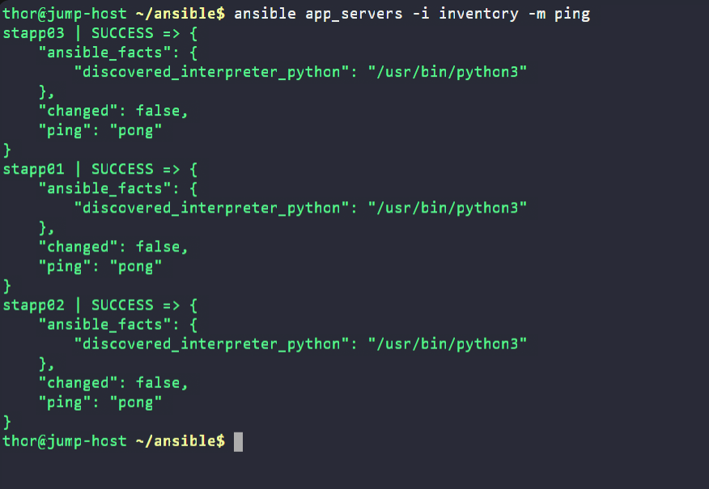
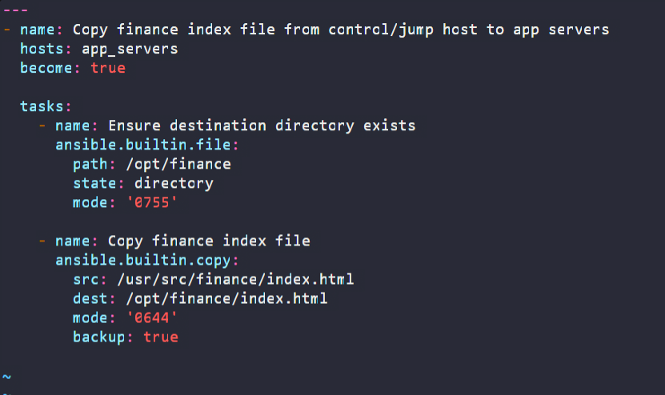
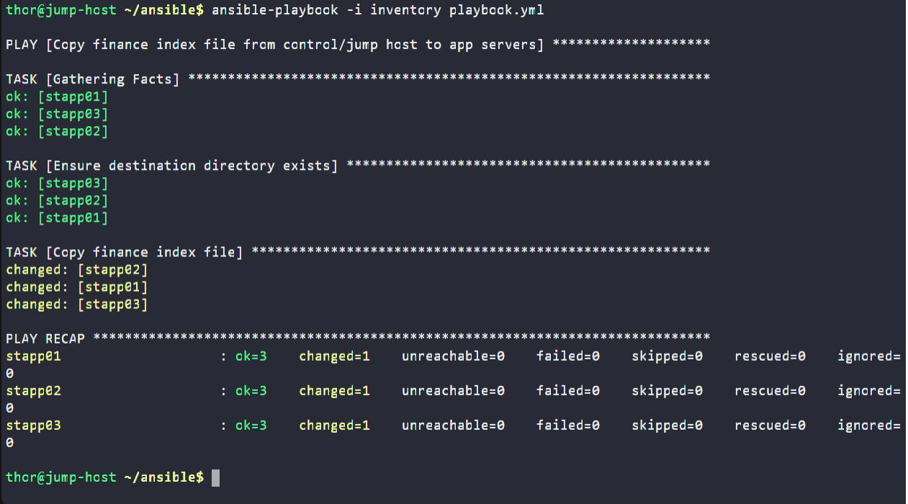
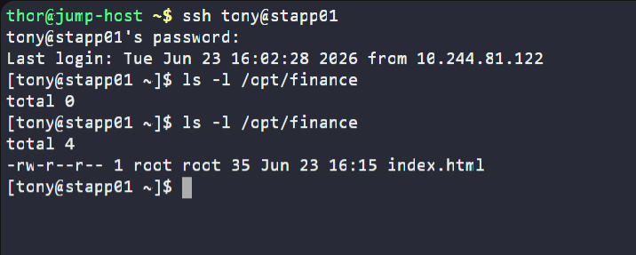

# Day 84: Copy Data to App Servers using Ansible

<div style="border:1px solid #ccc; padding:10px; border-radius:10px; box-shadow:2px 2px 8px rgba(0,0,0,0.2); display:inline-block;">
  
</div>

## Content

>Today I worked on an Ansible automation task that involved copying a file from the jump host to multiple application servers in the Stratos Datacenter. This exercise helped me understand how Ansible manages file transfers, works with inventories containing multiple hosts, and ensures idempotent operations across servers.

---

## 🔹 What I Learned

* Creating and managing Ansible inventory files
* Defining multiple managed nodes in an inventory group
* Using the `copy` module to transfer files to remote servers
* Managing directories using the `file` module
* Understanding Ansible's idempotent behavior
* Validating file deployment on remote systems

---

## 🔹 Task Requirement

As per the Nautilus DevOps team requirements, I needed to:

1. Create an inventory file:

```bash
/home/thor/ansible/inventory
```

and add all application servers as managed nodes.

2. Create a playbook:

```bash
/home/thor/ansible/playbook.yml
```

to copy the following file from the jump host:

```bash
/usr/src/finance/index.html
```

to all application servers under:

```bash
/opt/finance
```

3. Ensure the solution works using:

```bash
ansible-playbook -i inventory playbook.yml
```

without requiring any additional arguments.

---

## 🔹 Steps I Followed

### 1. Navigated to the Ansible Working Directory

<div style="border:1px solid #ccc; padding:10px; border-radius:10px; box-shadow:2px 2px 8px rgba(0,0,0,0.2); display:inline-block;">
  
</div>

```bash
cd /home/thor/ansible
```

Checked the directory contents:

```bash
ls
```

---

### 2. Created the Inventory File

Opened the inventory file:

```bash
vi inventory
```
<div style="border:1px solid #ccc; padding:10px; border-radius:10px; box-shadow:2px 2px 8px rgba(0,0,0,0.2); display:inline-block;">
  
</div>

Added the following content:

```ini
[app_servers]
stapp01 ansible_host=stapp01 ansible_user=tony ansible_password=Ir0nM@n
stapp02 ansible_host=stapp02 ansible_user=steve ansible_password=Am3ric@
stapp03 ansible_host=stapp03 ansible_user=banner ansible_password=BigGr33n
```
<div style="border:1px solid #ccc; padding:10px; border-radius:10px; box-shadow:2px 2px 8px rgba(0,0,0,0.2); display:inline-block;">
  
</div>

Saved the file.

---

## 🔹 Understanding the Inventory

### Inventory Group

```ini
[app_servers]
```

Creates a host group named `app_servers`.

This allows the playbook to target all application servers at once.

---

### Managed Hosts

```ini
stapp01
stapp02
stapp03
```

These are the application servers that Ansible will manage.

---

### Authentication Variables

Example:

```ini
ansible_user=tony
ansible_password=Ir0nM@n
```

These values tell Ansible:

* Which user account to use
* Which password to authenticate with

during SSH connections.

---

### Complete Inventory Entry

```ini
[app_servers]
stapp01 ansible_host=stapp01 ansible_user=tony ansible_password=Ir0nM@n
stapp02 ansible_host=stapp02 ansible_user=steve ansible_password=Am3ric@
stapp03 ansible_host=stapp03 ansible_user=banner ansible_password=BigGr33n
```

👉 In simple terms:

This inventory tells Ansible:

* Which servers to manage
* Which users to connect with
* Which passwords to use
* Which hosts belong to the application server group

---

### 3. Verified Connectivity

Before creating the playbook, I tested connectivity:

```bash
ansible app_servers -i inventory -m ping
```
<div style="border:1px solid #ccc; padding:10px; border-radius:10px; box-shadow:2px 2px 8px rgba(0,0,0,0.2); display:inline-block;">
  
</div>

Output:

```text
stapp01 | SUCCESS => pong
stapp02 | SUCCESS => pong
stapp03 | SUCCESS => pong
```

---

## 🔹 Why This Step Is Important

This confirms:

* Inventory is configured correctly
* SSH authentication works
* Ansible can reach all target servers
* Python is available on remote hosts

Performing this validation helps prevent troubleshooting later.

---

### 4. Verified the Initial State

Before running any automation, I connected to one application server.

```bash
ssh tony@stapp01
```

Checked the target directory:

```bash
ls -l /opt/finance
```

Output:

```text
total 0
```

Observation:

The directory existed but no files were present.

This served as the baseline state before deployment.

---

### 5. Created the Playbook

Opened the playbook file:

```bash
vi playbook.yml
```
<div style="border:1px solid #ccc; padding:10px; border-radius:10px; box-shadow:2px 2px 8px rgba(0,0,0,0.2); display:inline-block;">
  
</div>

Added the following content:

```yaml
---
- name: Copy finance index file from control/jump host to app servers
  hosts: app_servers
  become: true

  tasks:
    - name: Ensure destination directory exists
      ansible.builtin.file:
        path: /opt/finance
        state: directory
        mode: '0755'

    - name: Copy finance index file
      ansible.builtin.copy:
        src: /usr/src/finance/index.html
        dest: /opt/finance/index.html
        mode: '0644'
        backup: true
```

<div style="border:1px solid #ccc; padding:10px; border-radius:10px; box-shadow:2px 2px 8px rgba(0,0,0,0.2); display:inline-block;">
  
</div>

Saved the file.

---

## 🔹 Understanding the Playbook

### Target Hosts

```yaml
hosts: app_servers
```

The playbook runs on every host inside the `app_servers` inventory group.

In this case:

* stapp01
* stapp02
* stapp03

---

### Privilege Escalation

```yaml
become: true
```

Allows Ansible to execute tasks using elevated privileges.

This is required because the destination path is under:

```bash
/opt
```

which typically requires root permissions.

---

### File Module

```yaml
ansible.builtin.file
```

Used to manage files and directories on remote systems.

---

### Ensuring the Directory Exists

```yaml
state: directory
```

Functions similarly to:

```bash
mkdir -p /opt/finance
```

If the directory already exists, Ansible leaves it unchanged.

---

### Directory Permissions

```yaml
mode: '0755'
```

Sets permissions as:

```text
Owner  : Read Write Execute
Group  : Read Execute
Others : Read Execute
```

Equivalent Linux command:

```bash
chmod 755 /opt/finance
```

---

### Copy Module

```yaml
ansible.builtin.copy
```

Transfers files from the Ansible control node (jump host) to remote systems.

---

### Source File

```yaml
src: /usr/src/finance/index.html
```

The file located on the jump host.

---

### Destination File

```yaml
dest: /opt/finance/index.html
```

The location where the file will be copied on each application server.

---

### File Permissions

```yaml
mode: '0644'
```

Sets:

```text
Owner  : Read Write
Group  : Read
Others : Read
```

Equivalent Linux command:

```bash
chmod 644 /opt/finance/index.html
```

---

### Backup Option

```yaml
backup: true
```

If the destination file already exists, Ansible creates a backup before replacing it.

This provides a simple rollback mechanism.

---

### 6. Executed the Playbook

Ran:

```bash
ansible-playbook -i inventory playbook.yml
```
<div style="border:1px solid #ccc; padding:10px; border-radius:10px; box-shadow:2px 2px 8px rgba(0,0,0,0.2); display:inline-block;">
  
</div>

Output:

```text
PLAY [Copy finance index file from control/jump host to app servers]

TASK [Gathering Facts]
ok: [stapp01]
ok: [stapp02]
ok: [stapp03]

TASK [Ensure destination directory exists]
ok: [stapp01]
ok: [stapp02]
ok: [stapp03]

TASK [Copy finance index file]
changed: [stapp01]
changed: [stapp02]
changed: [stapp03]

PLAY RECAP
stapp01 : ok=3 changed=1 failed=0
stapp02 : ok=3 changed=1 failed=0
stapp03 : ok=3 changed=1 failed=0
```

---

## 🔹 Understanding the Output

### Gathering Facts

```text
TASK [Gathering Facts]
```

Ansible collects system information before running tasks.

Examples include:

* Hostname
* OS details
* Network information
* Memory information
* Python interpreter location

---

### Directory Task

```text
ok
```

The directory already existed, so no changes were needed.

---

### Copy Task

```text
changed
```

The file was copied successfully.

Since the file did not previously exist, Ansible modified the system state.

---

### Play Recap

```text
ok=3
changed=1
failed=0
```

Meaning:

* Three tasks completed successfully
* One task modified the server
* No failures occurred

---

### 7. Validated the Deployment

Connected back to App Server 1:

```bash
ssh tony@stapp01
```

Checked the directory:

```bash
ls -l /opt/finance
```
<div style="border:1px solid #ccc; padding:10px; border-radius:10px; box-shadow:2px 2px 8px rgba(0,0,0,0.2); display:inline-block;">
  
</div>

Output:

```text
-rw-r--r-- 1 root root 35 Jun 23 16:15 index.html
```

Verification:

* File exists
* Correct permissions applied
* Deployment completed successfully

---

## 🔹 Why the File Owner Is root

The file appeared as:

```text
root root
```

because the playbook was executed with:

```yaml
become: true
```

and no explicit owner or group was specified.

As a result, the file was created by the root user.

---

## 🔹 Inventory vs Playbook

One key concept reinforced during this task was the separation between infrastructure definition and automation logic.

### Inventory

Defines:

* Which servers to manage
* Authentication details
* Host groups
* Connection settings

Example:

```ini
[app_servers]
stapp01
stapp02
stapp03
```

---

### Playbook

Defines:

* What actions to perform
* Which modules to use
* Which host groups receive the tasks

Example:

```yaml
hosts: app_servers
```

and

```yaml
ansible.builtin.copy
```

---

## 🔹 My Understanding

This task strengthened my understanding of how Ansible manages file deployment across multiple servers. I learned that the inventory defines the infrastructure and connection details, while the playbook contains the automation logic.

---

## 🔹 What I Found Interesting

I found it interesting that Ansible automatically checks whether a file already exists and compares checksums before copying it. This prevents unnecessary file transfers and ensures that only actual changes are applied.

* * *

### Topics Covered

- ***Ansible***
- ***Ansible Inventory***
- ***Host Configuration***
- ***File Management***
- ***Ansible Copy Module***
- ***Ad-hoc Commands***
- ***Playbook Execution***
- ***File Transfer Automation***

**Previous Task**: [ Day 83: Troubleshoot and Create Ansible Playbook](../Day_83/day_83.md)

**Next Task**: [Day 85: Create Files on App Servers using Ansible](../Day_85/day_85.md)

