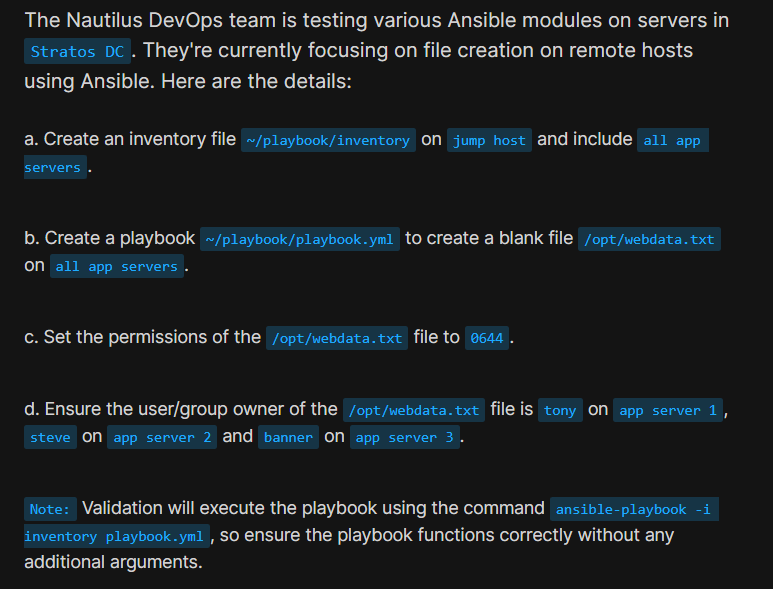
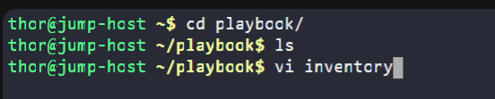
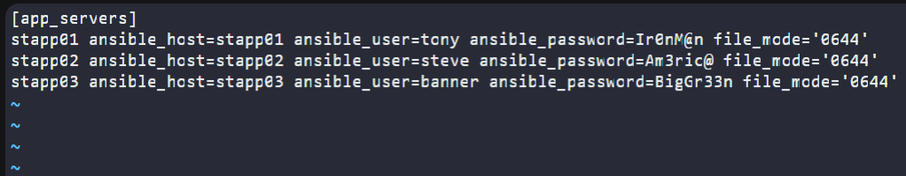
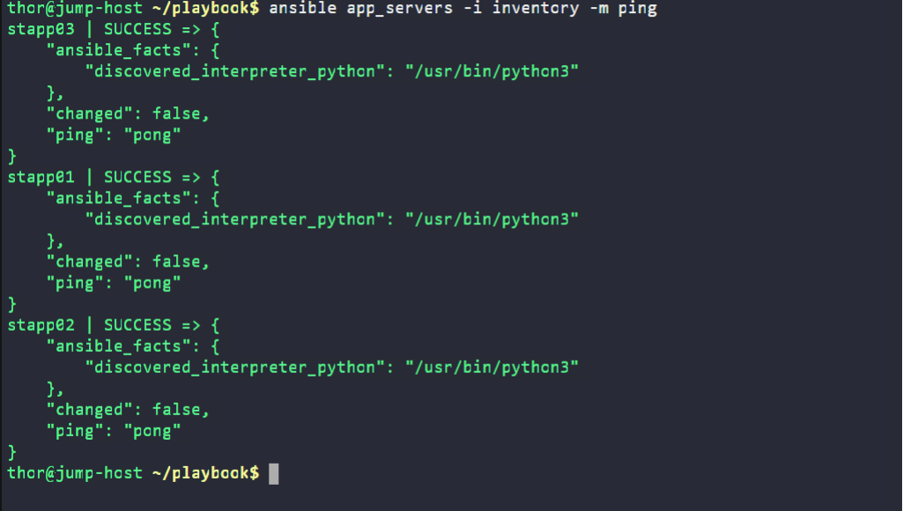
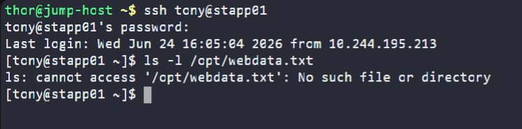
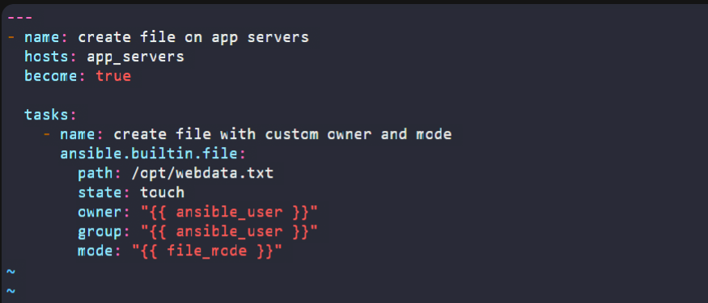
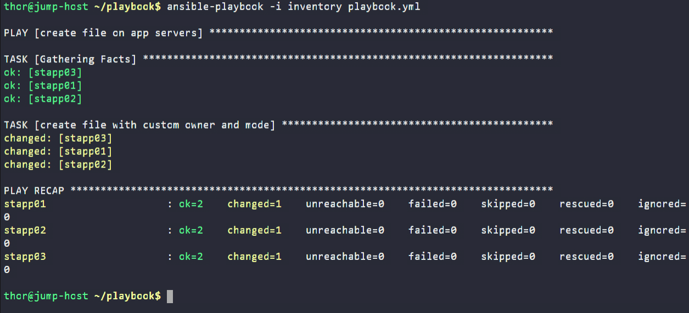
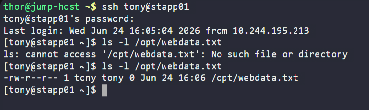

# Day 85: Create Files on App Servers using Ansible

<div style="border:1px solid #ccc; padding:10px; border-radius:10px; box-shadow:2px 2px 8px rgba(0,0,0,0.2); display:inline-block;">
  
</div>

## Content

>Today I worked on an Ansible automation task that involved creating a file on multiple application servers in the Stratos Datacenter. This exercise helped me understand how Ansible manages files on remote systems, uses inventory variables dynamically, applies permissions and ownership settings, and performs idempotent operations across multiple hosts.

---

## 🔹 What I Learned

* Creating and managing Ansible inventory files
* Using host-specific variables within an inventory
* Creating files on remote servers using the Ansible file module
* Managing file ownership and permissions
* Understanding Ansible's idempotent behavior
* Validating file creation across multiple servers

---

## 🔹 Task Requirement

<div style="border:1px solid #ccc; padding:10px; border-radius:10px; box-shadow:2px 2px 8px rgba(0,0,0,0.2); display:inline-block;">
  
</div>

As per the Nautilus DevOps team requirements, I needed to:

Create an inventory file:

```bash
~/playbook/inventory
```

and add all application servers as managed nodes.

Create a playbook:

```bash
~/playbook/playbook.yml
```

to create a blank file:

```bash
/opt/webdata.txt
```

on all application servers.

Ensure:

* File permissions are set to `0644`
* Owner and group are:

  * `tony` on stapp01
  * `steve` on stapp02
  * `banner` on stapp03

The solution must work using:

```bash
ansible-playbook -i inventory playbook.yml
```

without requiring any additional arguments.

---

## 🔹 Steps I Followed

### 1. Navigated to the Working Directory

```bash
cd ~/playbook
```

Checked the directory contents:

```bash
ls
```

---

### 2. Created the Inventory File

Opened the inventory file:

```bash
vi inventory
```
<div style="border:1px solid #ccc; padding:10px; border-radius:10px; box-shadow:2px 2px 8px rgba(0,0,0,0.2); display:inline-block;">
  
</div>

<div style="border:1px solid #ccc; padding:10px; border-radius:10px; box-shadow:2px 2px 8px rgba(0,0,0,0.2); display:inline-block;">
  
</div>

Added the following content:

```ini
[app_servers]
stapp01 ansible_host=stapp01 ansible_user=tony ansible_password=Ir0nM@n file_mode='0644'
stapp02 ansible_host=stapp02 ansible_user=steve ansible_password=Am3ric@ file_mode='0644'
stapp03 ansible_host=stapp03 ansible_user=banner ansible_password=BigGr33n file_mode='0644'
```

Saved the file.

---

## 🔹 Understanding the Inventory

### Inventory Group

```ini
[app_servers]
```

Creates a host group named:

```bash
app_servers
```

This allows the playbook to target all application servers at once.

---

### Managed Hosts

```bash
stapp01
stapp02
stapp03
```

These are the servers Ansible will manage.

---

### Authentication Variables

Example:

```ini
ansible_user=tony
ansible_password=Ir0nM@n
```

These values tell Ansible:

* Which user account to use
* Which password to authenticate with

during SSH connections.

---

### Custom Host Variable

Each host also contains:

```ini
file_mode='0644'
```

This variable can be referenced directly within the playbook.

---

### Complete Inventory

```ini
[app_servers]
stapp01 ansible_host=stapp01 ansible_user=tony ansible_password=Ir0nM@n file_mode='0644'
stapp02 ansible_host=stapp02 ansible_user=steve ansible_password=Am3ric@ file_mode='0644'
stapp03 ansible_host=stapp03 ansible_user=banner ansible_password=BigGr33n file_mode='0644'
```

👉 In simple terms:

This inventory tells Ansible:

* Which servers to manage
* Which users to connect with
* Which passwords to use
* Which hosts belong to the application server group
* Which file permission should be applied

---

### 3. Verified Connectivity

Before creating the playbook, I tested connectivity:

```bash
ansible app_servers -i inventory -m ping
```
<div style="border:1px solid #ccc; padding:10px; border-radius:10px; box-shadow:2px 2px 8px rgba(0,0,0,0.2); display:inline-block;">
  
</div>

Output:

```text
stapp01 | SUCCESS => pong
stapp02 | SUCCESS => pong
stapp03 | SUCCESS => pong
```

---

## 🔹 Why This Step Is Important

This confirms:

* Inventory is configured correctly
* SSH authentication works
* Ansible can reach all target servers
* Python is available on remote hosts

Performing this validation helps prevent troubleshooting later.

---

### 4. Verified the Initial State

Before running any automation, I connected to one application server.

```bash
ssh tony@stapp01
```

Checked whether the target file existed:

```bash
ls -l /opt/webdata.txt
```
<div style="border:1px solid #ccc; padding:10px; border-radius:10px; box-shadow:2px 2px 8px rgba(0,0,0,0.2); display:inline-block;">
  
</div>

Output:

```text
ls: cannot access '/opt/webdata.txt': No such file or directory
```

Observation:

The file did not exist before deployment.

This served as the baseline state before running the playbook.

---

### 5. Created the Playbook

Opened the playbook file:

```bash
vi playbook.yml
```
<div style="border:1px solid #ccc; padding:10px; border-radius:10px; box-shadow:2px 2px 8px rgba(0,0,0,0.2); display:inline-block;">
  
</div>

<div style="border:1px solid #ccc; padding:10px; border-radius:10px; box-shadow:2px 2px 8px rgba(0,0,0,0.2); display:inline-block;">
  
</div>

Added the following content:

```yaml
---
- name: create file on app servers
  hosts: app_servers
  become: true

  tasks:
    - name: create file with custom owner and mode
      ansible.builtin.file:
        path: /opt/webdata.txt
        state: touch
        owner: "{{ ansible_user }}"
        group: "{{ ansible_user }}"
        mode: "{{ file_mode }}"
```

Saved the file.

---

## 🔹 Understanding the Playbook

### Target Hosts

```yaml
hosts: app_servers
```

The playbook runs on every host inside the app_servers inventory group.

In this case:

* stapp01
* stapp02
* stapp03

---

### Privilege Escalation

```yaml
become: true
```

Allows Ansible to execute tasks using elevated privileges.

This is required because the destination location is:

```bash
/opt
```

which typically requires root permissions.

---

### File Module

```yaml
ansible.builtin.file
```

Used to manage files, directories, ownership, and permissions on remote systems.

---

### Creating the File

```yaml
state: touch
```

Functions similarly to:

```bash
touch /opt/webdata.txt
```

If the file does not exist, it is created.

If it already exists, Ansible updates its timestamp without recreating it.

---

### Dynamic Ownership Assignment

```yaml
owner: "{{ ansible_user }}"
group: "{{ ansible_user }}"
```

Ansible automatically uses the username defined in the inventory for each host.

Result:

| Host    | Owner  | Group  |
| ------- | ------ | ------ |
| stapp01 | tony   | tony   |
| stapp02 | steve  | steve  |
| stapp03 | banner | banner |

This eliminates the need for separate tasks for each server.

---

### File Permissions

```yaml
mode: "{{ file_mode }}"
```

The permission value comes directly from the inventory.

Inventory:

```ini
file_mode='0644'
```

Equivalent Linux command:

```bash
chmod 644 /opt/webdata.txt
```

Permission breakdown:

| User Type | Permission  |
| --------- | ----------- |
| Owner     | Read, Write |
| Group     | Read        |
| Others    | Read        |

---

### 6. Executed the Playbook

Ran:

```bash
ansible-playbook -i inventory playbook.yml
```
<div style="border:1px solid #ccc; padding:10px; border-radius:10px; box-shadow:2px 2px 8px rgba(0,0,0,0.2); display:inline-block;">
  
</div>

Output:

```text
PLAY [create file on app servers]

TASK [Gathering Facts]
ok: [stapp01]
ok: [stapp02]
ok: [stapp03]

TASK [create file with custom owner and mode]
changed: [stapp01]
changed: [stapp02]
changed: [stapp03]

PLAY RECAP
stapp01 : ok=2 changed=1 failed=0
stapp02 : ok=2 changed=1 failed=0
stapp03 : ok=2 changed=1 failed=0
```

---

## 🔹 Understanding the Output

### Gathering Facts

```text
TASK [Gathering Facts]
```

Ansible collects system information before running tasks.

Examples include:

* Hostname
* Operating system details
* Network information
* Python interpreter location

---

### File Creation Task

```text
changed
```

This indicates that Ansible modified the server state.

Since the file did not previously exist, Ansible created it successfully.

---

### Play Recap

```text
ok=2
changed=1
failed=0
```

Meaning:

* Two tasks completed successfully
* One task modified the server
* No failures occurred

---

### 7. Validated the Deployment

Connected back to App Server 1:

```bash
ssh tony@stapp01
```

Checked the file:

```bash
ls -l /opt/webdata.txt
```

<div style="border:1px solid #ccc; padding:10px; border-radius:10px; box-shadow:2px 2px 8px rgba(0,0,0,0.2); display:inline-block;">
  
</div>

Output:

```text
-rw-r--r-- 1 tony tony 0 Jun 24 16:06 /opt/webdata.txt
```

Verification:

✅ File exists

✅ Correct permissions applied

✅ Correct owner assigned

✅ Correct group assigned

✅ File size is 0 bytes (blank file)

---

## 🔹 Why Dynamic Variables Are Useful

One of the most useful concepts reinforced during this task was the use of inventory variables inside the playbook.

Instead of hardcoding:

```yaml
owner: tony
```

for every server, I used:

```yaml
owner: "{{ ansible_user }}"
```

This allowed Ansible to automatically assign the correct owner based on each host's inventory definition.

Benefits:

* Less code
* Easier maintenance
* Better scalability
* Reduced duplication

---

## 🔹 My Understanding

This task strengthened my understanding of how Ansible can create and manage files across multiple servers while dynamically applying different ownership settings based on inventory variables. I learned how inventories can store host-specific data and how playbooks can reuse that information to build flexible and scalable automation.

---

## 🔹 What I Found Interesting

I found it interesting that a single task was able to create the file, assign permissions, and set the correct ownership on three different servers without requiring separate configurations for each host. Using inventory variables together with Jinja2 expressions made the playbook clean, reusable, and easy to manage.


* * *

### Topics Covered

- ***Ansible***
- ***Ansible Inventory***
- ***Ansible File Module***
- ***Ansible Playbooks***
- ***File Creation Automation***
- ***Inventory Variables***
- ***File Ownership & Permissions***
- ***Playbook Execution***

**Previous Task**: [ Day 84: Copy Data to App Servers using Ansible](../Day_84/day_84.md)

**Next Task**: [Day 86: Ansible Ping Module Usage](../Day_86/day_86.md)

