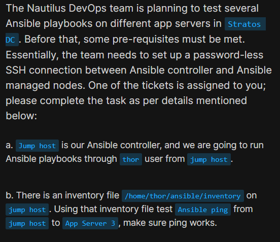
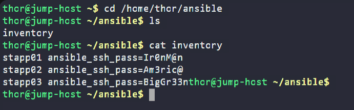
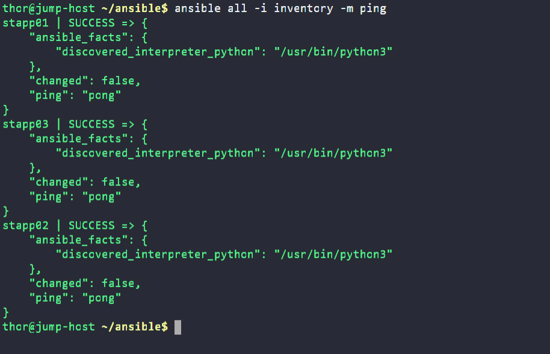

# Day 86: Ansible Ping Module Usage
<div style="border:1px solid #ccc; padding:10px; border-radius:10px; box-shadow:2px 2px 8px rgba(0,0,0,0.2); display:inline-block;">
  
</div>

## Content

>Today I worked on validating connectivity between an Ansible controller and managed nodes using the Ansible Ping module. Before running any playbooks in a production-like environment, it is important to ensure that Ansible can successfully communicate with the target servers.

* * *

## 🔹 What I Learned

*   Understanding Ansible inventory files
    
*   Configuring managed hosts in inventory
    
*   Disabling SSH host key checking
    
*   Testing connectivity with the Ansible Ping module
    
*   Verifying communication between controller and managed nodes
    

* * *

## 🔹 Task Requirement

<div style="border:1px solid #ccc; padding:10px; border-radius:10px; box-shadow:2px 2px 8px rgba(0,0,0,0.2); display:inline-block;">
  
</div>

As per the Nautilus DevOps team requirements, I needed to:

*   Use the existing inventory file located at:
    

```bash
/home/thor/ansible/inventory
```

*   Configure the inventory with the correct connection details for the application servers.
    
*   Ensure password-based SSH connectivity works from the Ansible controller (Jump Host).
    
*   Test Ansible connectivity using the Ping module.
    
*   Verify successful communication with App Server 3.
    

* * *

## 🔹 Steps I Followed

### 1\. Connected to the Working Directory

Moved into the Ansible project directory:

```bash
cd /home/thor/ansible
```

Verified available files:

```bash
ls
```

Output:

```bash
inventory
```

* * *

### 2\. Reviewed the Existing Inventory

Checked the current inventory file:

```bash
cat inventory
```
<div style="border:1px solid #ccc; padding:10px; border-radius:10px; box-shadow:2px 2px 8px rgba(0,0,0,0.2); display:inline-block;">
  
</div>

Output:

```ini
stapp01 ansible_ssh_pass=Ir0nM@n
stapp02 ansible_ssh_pass=Am3ric@
stapp03 ansible_ssh_pass=BigGr33n
```

I noticed that only passwords were defined.

For Ansible to connect successfully, it is a good practice to explicitly define:

*   Hostname
    
*   SSH user
    
*   SSH password
    

I also needed to ensure SSH host key verification would not interrupt automation.

* * *

### 3\. Updated the Inventory File

Edited the inventory:

```bash
vi inventory
```
<div style="border:1px solid #ccc; padding:10px; border-radius:10px; box-shadow:2px 2px 8px rgba(0,0,0,0.2); display:inline-block;">
  
</div>
<div style="border:1px solid #ccc; padding:10px; border-radius:10px; box-shadow:2px 2px 8px rgba(0,0,0,0.2); display:inline-block;">
  
</div>

Updated content:

```ini
stapp01 ansible_host=stapp01 ansible_user=tony ansible_ssh_pass=Ir0nM@n
stapp02 ansible_host=stapp02 ansible_user=steve ansible_ssh_pass=Am3ric@
stapp03 ansible_host=stapp03 ansible_user=banner ansible_ssh_pass=BigGr33n

[all:vars]
ansible_ssh_common_args='-o StrictHostKeyChecking=no'
```

Saved the file and verified:

```bash
cat inventory
```

* * *

## 🔹 Simple Explanation of the Inventory Entries

### Host Definition

```ini
stapp01 ansible_host=stapp01
```

Defines the hostname that Ansible will connect to.

* * *

### SSH User

```ini
ansible_user=tony
```

Specifies the user account Ansible will use when connecting to the remote server.

Examples:

```ini
stapp01 → tony
stapp02 → steve
stapp03 → banner
```

* * *

### SSH Password

```ini
ansible_ssh_pass=Ir0nM@n
```

Provides the password used for SSH authentication.

Each server has its own password configured.

* * *

### Global Variables Section

```ini
[all:vars]
```

Applies variables to every host in the inventory.

* * *

### Disable Host Key Checking

```ini
ansible_ssh_common_args='-o StrictHostKeyChecking=no'
```

Disables SSH host key verification prompts.

This prevents Ansible from stopping and asking for confirmation when connecting to a server for the first time.

* * *

### Complete Inventory

```ini
stapp01 ansible_host=stapp01 ansible_user=tony ansible_ssh_pass=Ir0nM@n
stapp02 ansible_host=stapp02 ansible_user=steve ansible_ssh_pass=Am3ric@
stapp03 ansible_host=stapp03 ansible_user=banner ansible_ssh_pass=BigGr33n

[all:vars]
ansible_ssh_common_args='-o StrictHostKeyChecking=no'
```

👉 In simple terms:

This inventory tells Ansible:

*   Which servers to manage
    
*   Which usernames to use
    
*   Which passwords to authenticate with
    
*   To skip SSH host key confirmation prompts
    

* * *

## 🔹 4. Tested Connectivity Using the Ansible Ping Module

Executed the following command:

```bash
ansible all -i inventory -m ping
```

* * *

## 🔹 Understanding the Command

### Ansible

```bash
ansible
```

Runs an ad-hoc Ansible command.

* * *

### Target Hosts

```bash
all
```

Targets every host defined in the inventory.

In this case:

*   stapp01
    
*   stapp02
    
*   stapp03
    

* * *

### Inventory File

```bash
-i inventory
```

Specifies the inventory file to use.

* * *

### Ping Module

```bash
-m ping
```

Uses Ansible's built-in Ping module.

This module does not send an ICMP ping like the Linux ping command.

Instead, it:

*   Establishes an SSH connection
    
*   Executes Python on the remote host
    
*   Returns a response if communication succeeds
    

* * *

## 🔹 5. Verified Successful Connectivity

<div style="border:1px solid #ccc; padding:10px; border-radius:10px; box-shadow:2px 2px 8px rgba(0,0,0,0.2); display:inline-block;">
  
</div>

Output:

```json
stapp01 | SUCCESS => {
    "changed": false,
    "ping": "pong"
}

stapp02 | SUCCESS => {
    "changed": false,
    "ping": "pong"
}

stapp03 | SUCCESS => {
    "changed": false,
    "ping": "pong"
}
```

* * *

## 🔹 Understanding the Output

### SUCCESS

```json
"SUCCESS"
```

Indicates Ansible successfully connected to the remote server.

* * *

### Python Interpreter Discovery

```json
"discovered_interpreter_python": "/usr/bin/python3"
```

Ansible automatically detected the Python interpreter available on the remote host.

Python is required for most Ansible modules to execute.

* * *

### No Changes Made

```json
"changed": false
```

The Ping module only verifies connectivity.

It does not modify the remote server.

Therefore, the status remains false.

* * *

### Pong Response

```json
"ping": "pong"
```

This confirms:

*   SSH authentication succeeded
    
*   Ansible communication succeeded
    
*   The target server is reachable and manageable
    

* * *

## 🔹 Final Verification

All three application servers responded successfully:

*   stapp01 ✅
    
*   stapp02 ✅
    
*   stapp03 ✅
    

This confirmed that the Ansible controller can communicate with all managed nodes and is ready to execute playbooks.

* * *

## 🔹 My Understanding

This task helped me understand the importance of inventory configuration in Ansible.

Before any automation can run, Ansible must be able to authenticate and communicate with the target hosts. The Ping module provides a quick and reliable way to validate connectivity before executing playbooks.

* * *

## 🔹 What I Found Interesting

I found it interesting that the Ansible Ping module does not perform a traditional network ping. Instead, it validates the complete Ansible communication workflow by establishing an SSH session and executing code on the remote machine.

* * *

### Topics Covered

- ***Ansible***
- ***Ansible Inventory***
- ***Ansible Playbooks***
- ***ping***
- ***Inventory Variables***
- ***Playbook Execution***

**Previous Task**: [ Day 85: Create Files on App Servers using Ansible](../Day_85/day_85.md)

**Next Task**: [Day 87: Ansible Install Package](../Day_87/day_87.md)
