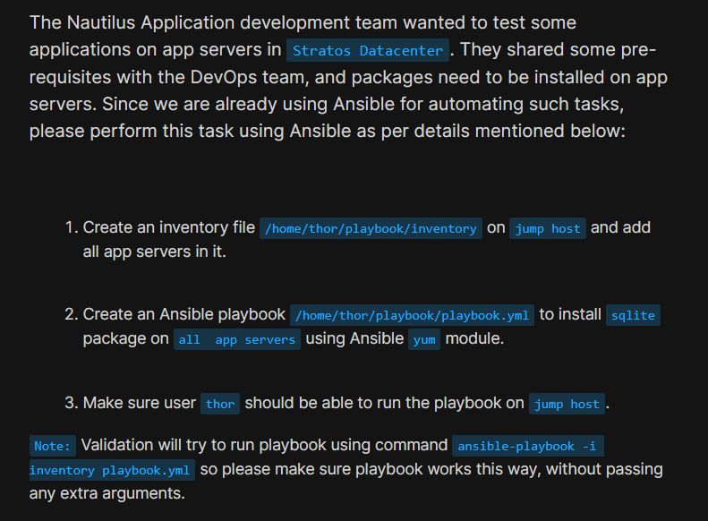
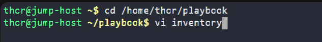
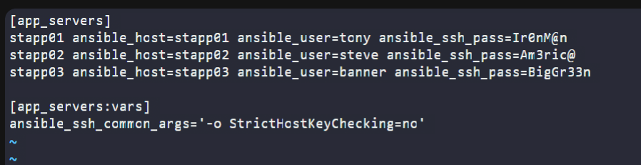
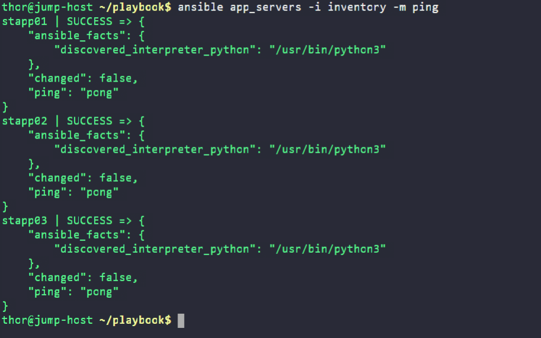
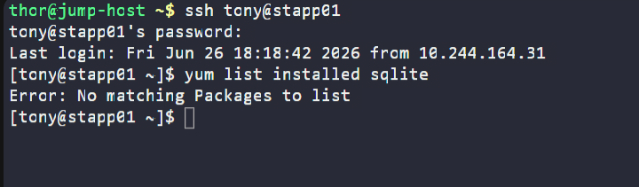
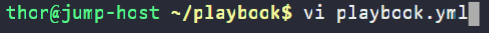
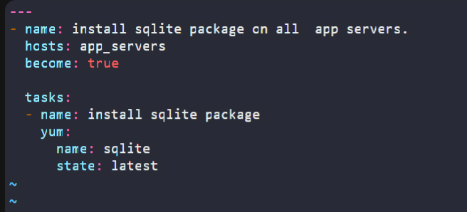
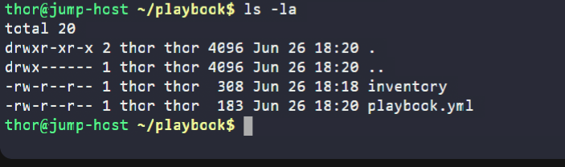
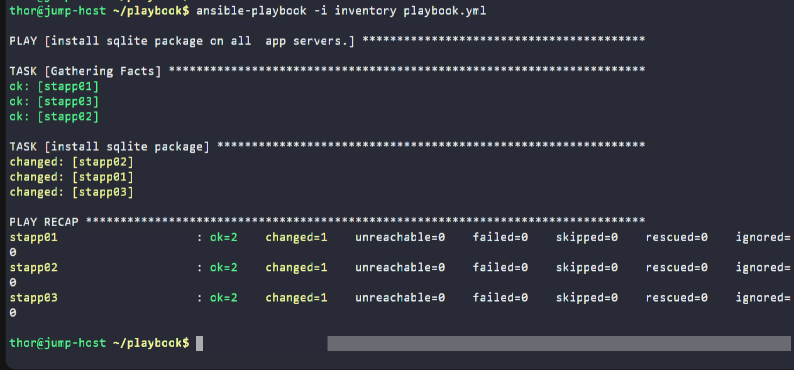
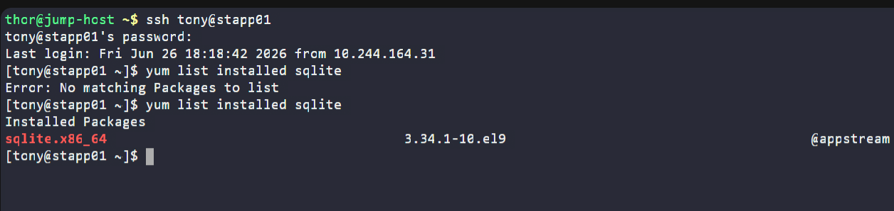

# Day 87: Ansible Install Package

<div style="border:1px solid #ccc; padding:10px; border-radius:10px; box-shadow:2px 2px 8px rgba(0,0,0,0.2); display:inline-block;">
  
</div>

## Content

>Today I worked on an Ansible automation task that involved installing a software package on multiple application servers in the Stratos Datacenter. This exercise helped me understand how Ansible automates package management across multiple remote hosts using the **yum** module, how inventories simplify server management, and how playbooks can consistently install packages with a single command.

---

## 🔹 What I Learned

* Creating and configuring an Ansible inventory file
* Managing multiple remote servers using inventory groups
* Installing software packages using the Ansible **yum** module
* Executing Ansible playbooks across multiple servers
* Validating package installation after automation


---

## 🔹 Task Requirement

<div style="border:1px solid #ccc; padding:10px; border-radius:10px; box-shadow:2px 2px 8px rgba(0,0,0,0.2); display:inline-block;">
  
</div>

As per the Nautilus DevOps team requirements, I needed to:

* Create an inventory file:

```text
/home/thor/playbook/inventory
```

and add all application servers as managed nodes.

* Create an Ansible playbook:

```text
/home/thor/playbook/playbook.yml
```

to install the **sqlite** package on all application servers using the **yum** module.

* Ensure the **thor** user can successfully run the playbook on the jump host.

The solution must work using:

```bash
ansible-playbook -i inventory playbook.yml
```

without requiring any additional arguments.

---

## 🔹 Steps I Followed

### 1. Navigated to the Working Directory

I first moved to the Ansible working directory on the jump host.

```bash
cd /home/thor/playbook
```

This directory would contain both the inventory file and the playbook.

---

### 2. Created the Inventory File

Opened the inventory file:

```bash
vi inventory
```
<div style="border:1px solid #ccc; padding:10px; border-radius:10px; box-shadow:2px 2px 8px rgba(0,0,0,0.2); display:inline-block;">
  
</div>

Added the following configuration:

<div style="border:1px solid #ccc; padding:10px; border-radius:10px; box-shadow:2px 2px 8px rgba(0,0,0,0.2); display:inline-block;">
  
</div>

```ini
[app_servers]
stapp01 ansible_host=stapp01 ansible_user=tony ansible_ssh_pass=Ir0nM@n
stapp02 ansible_host=stapp02 ansible_user=steve ansible_ssh_pass=Am3ric@
stapp03 ansible_host=stapp03 ansible_user=banner ansible_ssh_pass=BigGr33n

[app_servers:vars]
ansible_ssh_common_args='-o StrictHostKeyChecking=no'
```

Saved the file.

---

## 🔹 Understanding the Inventory

### Inventory Group

```ini
[app_servers]
```

Creates a group named **app_servers**.

Instead of targeting each server individually, Ansible can execute the playbook on every server in this group.

---

### Managed Hosts

```text
stapp01
stapp02
stapp03
```

These are the three application servers managed by Ansible.

---

### Authentication Variables

Example:

```text
ansible_user=tony
ansible_ssh_pass=Ir0nM@n
```

These variables tell Ansible:

* Which user account to connect with
* Which password to use for SSH authentication

---

### Group Variables

```text
ansible_ssh_common_args='-o StrictHostKeyChecking=no'
```

Normally, SSH asks for confirmation before connecting to a host for the first time.

This option disables that prompt so Ansible can connect automatically during automation.

---

### Complete Inventory

```ini
[app_servers]
stapp01 ansible_host=stapp01 ansible_user=tony ansible_ssh_pass=Ir0nM@n
stapp02 ansible_host=stapp02 ansible_user=steve ansible_ssh_pass=Am3ric@
stapp03 ansible_host=stapp03 ansible_user=banner ansible_ssh_pass=BigGr33n

[app_servers:vars]
ansible_ssh_common_args='-o StrictHostKeyChecking=no'
```

👉 In simple terms, this inventory tells Ansible:

* Which servers to manage
* Which user to log in as on each server
* Which password to use
* Which hosts belong to the **app_servers** group
* To automatically accept SSH host keys

---

### 3. Verified Connectivity

Before creating the playbook, I tested connectivity to all application servers.

```bash
ansible app_servers -i inventory -m ping
```
<div style="border:1px solid #ccc; padding:10px; border-radius:10px; box-shadow:2px 2px 8px rgba(0,0,0,0.2); display:inline-block;">
  
</div>

Output:

```text
stapp01 | SUCCESS => {
    "ping": "pong"
}

stapp02 | SUCCESS => {
    "ping": "pong"
}

stapp03 | SUCCESS => {
    "ping": "pong"
}
```

---

## 🔹 Why This Step Is Important

Running the **ping** module confirms that:

* The inventory is configured correctly
* SSH authentication works
* All servers are reachable
* Python is installed on the remote systems

Verifying connectivity first helps avoid troubleshooting during playbook execution.

---

### 4. Verified the Initial State

Before installing SQLite, I connected to one application server to confirm that the package was not already installed.

```bash
ssh tony@stapp01
```

Checked the package:

```bash
yum list installed sqlite
```

Output:

```text
Error: No matching Packages to list
```
<div style="border:1px solid #ccc; padding:10px; border-radius:10px; box-shadow:2px 2px 8px rgba(0,0,0,0.2); display:inline-block;">
  
</div>

### Observation

SQLite was not installed initially.

This established the baseline before running the automation.

After checking, I returned to the jump host.

---

### 5. Created the Playbook

Opened the playbook:

```bash
vi playbook.yml
```
<div style="border:1px solid #ccc; padding:10px; border-radius:10px; box-shadow:2px 2px 8px rgba(0,0,0,0.2); display:inline-block;">
  
</div>

Added the following content:

<div style="border:1px solid #ccc; padding:10px; border-radius:10px; box-shadow:2px 2px 8px rgba(0,0,0,0.2); display:inline-block;">
  
</div>

```yaml
---
- name: install sqlite package on all app servers.
  hosts: app_servers
  become: true

  tasks:
    - name: install sqlite package
      yum:
        name: sqlite
        state: latest
```

Saved the file.

---

## 🔹 Understanding the Playbook

### Target Hosts

```yaml
hosts: app_servers
```

The playbook executes on every host inside the **app_servers** inventory group.

These include:

* stapp01
* stapp02
* stapp03

---

### Privilege Escalation

```yaml
become: true
```

Installing packages requires administrative privileges.

`become: true` allows Ansible to execute the task with elevated permissions, similar to using `sudo`.

---

### Yum Module

```yaml
yum:
```

The **yum** module manages software packages on RPM-based Linux distributions.

It can install, remove, or update packages automatically.

---

### Package Name

```yaml
name: sqlite
```

Specifies the package to install.

---

### Package State

```yaml
state: latest
```

This tells Ansible to ensure the latest available version of SQLite is installed.

If the package is:

* Missing → Install it
* Outdated → Upgrade it
* Already up to date → Do nothing

This demonstrates Ansible's **idempotent** behavior.

---

### 6. Verified File Ownership and Permissions

Before running the playbook, I verified that the required files existed and were owned by the **thor** user.

Executed:

```bash
ls -la
```
<div style="border:1px solid #ccc; padding:10px; border-radius:10px; box-shadow:2px 2px 8px rgba(0,0,0,0.2); display:inline-block;">
  
</div>

Output:

```text
total 20
drwxr-xr-x 2 thor thor 4096 Jun 26 18:20 .
drwx------ 1 thor thor 4096 Jun 26 18:20 ..
-rw-r--r-- 1 thor thor  308 Jun 26 18:18 inventory
-rw-r--r-- 1 thor thor  183 Jun 26 18:20 playbook.yml
```

---

## 🔹 Why This Step Is Important

The task specifically states:

> **"Make sure user thor should be able to run the playbook on jump host."**

This verification confirms that:

* Both **inventory** and **playbook.yml** exist.
* They are owned by the **thor** user.
* The files have appropriate read permissions.
* The **thor** user can execute the playbook without requiring additional permission changes.

Although the files were created by **thor** and therefore already owned by that user, verifying ownership and permissions ensures the task requirement is satisfied before execution.

---

### 7. Executed the Playbook

Ran:

```bash
ansible-playbook -i inventory playbook.yml
```
<div style="border:1px solid #ccc; padding:10px; border-radius:10px; box-shadow:2px 2px 8px rgba(0,0,0,0.2); display:inline-block;">
  
</div>

Output:

```text
PLAY [install sqlite package on all app servers.]

TASK [Gathering Facts]
ok: [stapp01]
ok: [stapp02]
ok: [stapp03]

TASK [install sqlite package]
changed: [stapp01]
changed: [stapp02]
changed: [stapp03]

PLAY RECAP
stapp01 : ok=2 changed=1 failed=0
stapp02 : ok=2 changed=1 failed=0
stapp03 : ok=2 changed=1 failed=0
```

---

## 🔹 Understanding the Output

### Gathering Facts

```text
TASK [Gathering Facts]
```

Before executing any tasks, Ansible collects system information such as:

* Hostname
* Operating system
* Network configuration
* Python interpreter
* Architecture

This information helps Ansible execute tasks appropriately on each host.

---

### Package Installation Task

```text
changed
```

The **changed** status indicates that Ansible successfully modified each server by installing the SQLite package.

---

### Play Recap

```text
ok=2
changed=1
failed=0
```

Meaning:

* Two tasks completed successfully
* One task modified the system
* No failures occurred

All three servers completed successfully.

---

### 8. Validated the Installation

After the playbook completed, I connected back to one application server.

```bash
ssh tony@stapp01
```

Verified the package installation:

```bash
yum list installed sqlite
```

Output:

```text
Installed Packages
sqlite.x86_64    3.34.1-10.el9    @appstream
```
<div style="border:1px solid #ccc; padding:10px; border-radius:10px; box-shadow:2px 2px 8px rgba(0,0,0,0.2); display:inline-block;">
  
</div>

---

## 🔹 Verification

✅ SQLite package successfully installed

✅ Package available through the system package manager

✅ Playbook executed successfully on all application servers

✅ Task requirement fulfilled

---

## 🔹 My Understanding

This task helped me understand how Ansible automates software installation across multiple servers using the yum module. I also learned the importance of configuring the inventory correctly, verifying connectivity before deployment, and ensuring the playbook can be executed by the required user.

---

## 🔹 What I Found Interesting

I found it interesting that a single Ansible playbook was able to install the sqlite package on all three application servers simultaneously. With just one command, Ansible handled remote connections, privilege escalation, and package installation consistently across every server.

* * *

### Topics Covered

- ***Ansible***
- ***Ansible Inventory***
- ***Ansible Playbooks***
- ***ping***
- ***Inventory Variables***
- ***Yum***
- ***Package installation***
- ***Playbook Execution***

**Previous Task**: [ Day 86: Ansible Ping Module Usage](../Day_86/day_86.md)

**Next Task**: [Day 88: Ansible Blockinfile Module](../Day_88/day_88.md)
