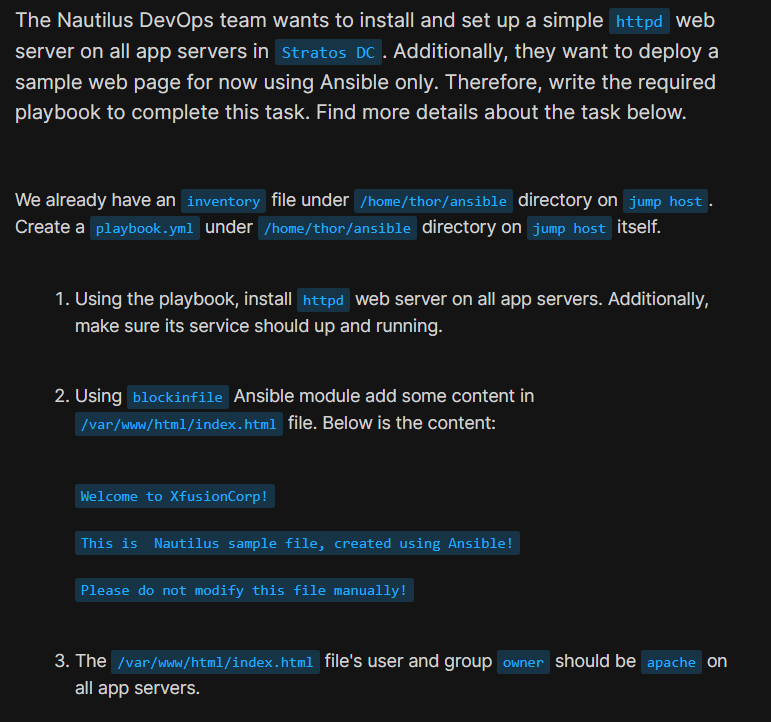
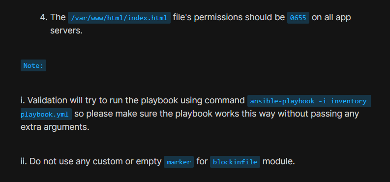
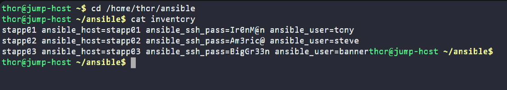
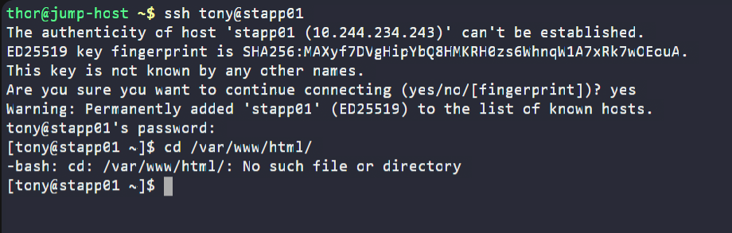
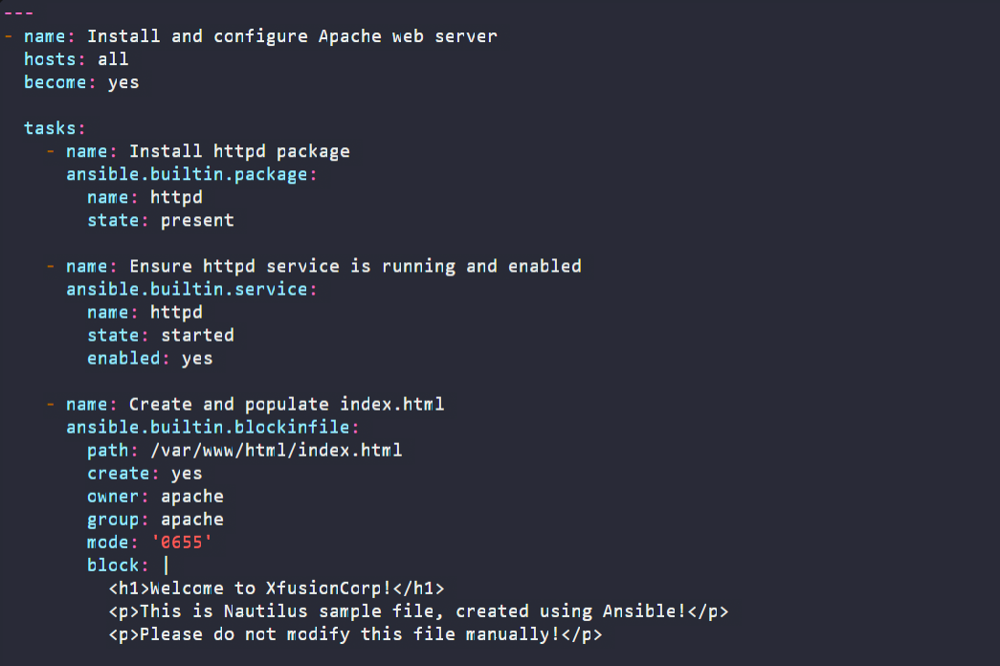
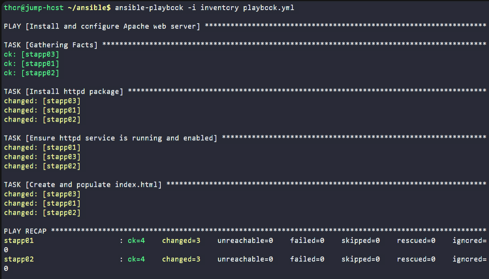
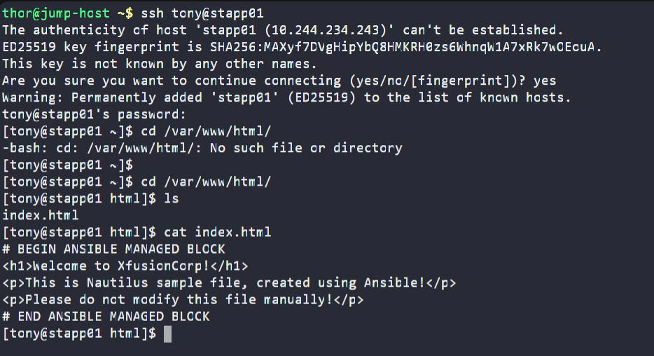
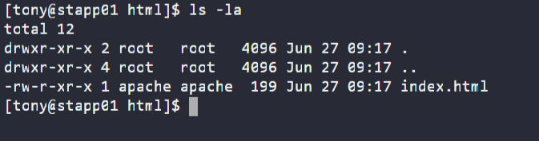
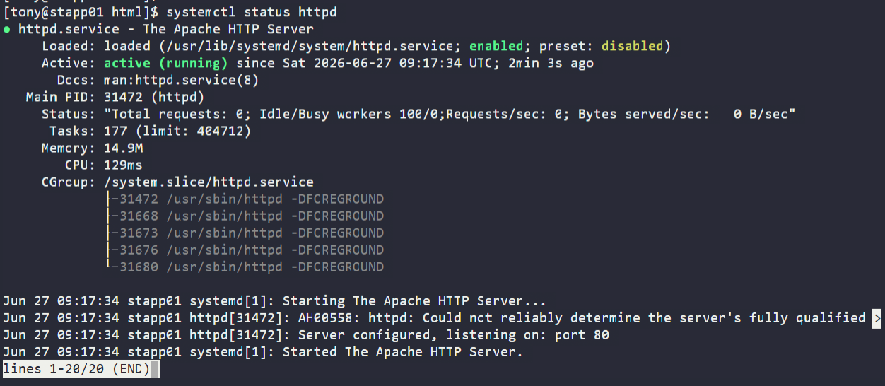

# Day 88: Ansible Blockinfile Module

<div style="border:1px solid #ccc; padding:10px; border-radius:10px; box-shadow:2px 2px 8px rgba(0,0,0,0.2); display:inline-block;">
  
</div>

## Content

> Today I worked on an Ansible automation task that involved installing and configuring the Apache HTTP server on multiple application servers in the Stratos Datacenter. I also learned how to use Ansible's **blockinfile** module to create and manage file content while ensuring the correct ownership and permissions.

* * *

## 🔹 What I Learned

*   Installing packages using Ansible
    
*   Managing services with the **service** module
    
*   Creating files using the **blockinfile** module
    
*   Automatically creating files that do not already exist
    
*   Setting file ownership and permissions using Ansible  

* * *

## 🔹 Task Requirement

<div style="border:1px solid #ccc; padding:10px; border-radius:10px; box-shadow:2px 2px 8px rgba(0,0,0,0.2); display:inline-block;">
  
</div>
<div style="border:1px solid #ccc; padding:10px; border-radius:10px; box-shadow:2px 2px 8px rgba(0,0,0,0.2); display:inline-block;">
  
</div>

As per the Nautilus DevOps team requirements, I needed to:

*   Create an Ansible playbook:
    

```text
/home/thor/ansible/playbook.yml
```

using the existing inventory file:

```text
/home/thor/ansible/inventory
```

*   Install the **httpd** package on all application servers.
    
*   Ensure the **httpd** service is started and enabled.
    
*   Create the following file if it does not exist:
    

```text
/var/www/html/index.html
```

using the **blockinfile** module.

The file should contain:

```text
Welcome to XfusionCorp!

This is Nautilus sample file, created using Ansible!

Please do not modify this file manually!
```

*   Set the ownership of the file to:
    

```text
Owner : apache
Group : apache
```

*   Set the file permissions to:
    

```text
0655
```

The playbook must execute successfully using:

```bash
ansible-playbook -i inventory playbook.yml
```

without passing any additional arguments.

* * *

## 🔹 Steps I Followed

### 1\. Navigated to the Working Directory

I first moved to the Ansible working directory on the jump host.

```bash
cd /home/thor/ansible
```

This directory already contained the inventory file provided for the task.

* * *

### 2\. Verified the Inventory

I checked the existing inventory.

<div style="border:1px solid #ccc; padding:10px; border-radius:10px; box-shadow:2px 2px 8px rgba(0,0,0,0.2); display:inline-block;">
  
</div>

```bash
cat inventory
```

Output:

```ini
stapp01 ansible_host=stapp01 ansible_ssh_pass=Ir0nM@n ansible_user=tony
stapp02 ansible_host=stapp02 ansible_ssh_pass=Am3ric@ ansible_user=steve
stapp03 ansible_host=stapp03 ansible_ssh_pass=BigGr33n ansible_user=banner
```

This inventory defines the three application servers and the SSH credentials Ansible uses to connect to them.

* * *

### 3\. Verified the Initial State

Before creating the playbook, I connected to one application server to verify whether Apache was already installed.

<div style="border:1px solid #ccc; padding:10px; border-radius:10px; box-shadow:2px 2px 8px rgba(0,0,0,0.2); display:inline-block;">
  
</div>

```bash
ssh tony@stapp01
```

Then attempted to access Apache's default document root.

```bash
cd /var/www/html
```

Output:

```text
-bash: cd: /var/www/html/: No such file or directory
```

### Observation

Since the **httpd** package had not yet been installed, the default web root directory did not exist.

This confirmed that the playbook would need to install Apache before creating the web page.

After verifying this, I returned to the jump host.

* * *

### 4\. Created the Playbook

I created the playbook.

```bash
vi playbook.yml
```
<div style="border:1px solid #ccc; padding:10px; border-radius:10px; box-shadow:2px 2px 8px rgba(0,0,0,0.2); display:inline-block;">
  
</div>

Added the following content:

<div style="border:1px solid #ccc; padding:10px; border-radius:10px; box-shadow:2px 2px 8px rgba(0,0,0,0.2); display:inline-block;">
  
</div>

```yaml
---
- name: Install and configure Apache web server
  hosts: all
  become: yes

  tasks:
    - name: Install httpd package
      ansible.builtin.package:
        name: httpd
        state: present

    - name: Ensure httpd service is running and enabled
      ansible.builtin.service:
        name: httpd
        state: started
        enabled: yes

    - name: Create and populate index.html
      ansible.builtin.blockinfile:
        path: /var/www/html/index.html
        create: yes
        owner: apache
        group: apache
        mode: '0655'
        block: |
          Welcome to XfusionCorp!

          This is Nautilus sample file, created using Ansible!

          Please do not modify this file manually!
```

Saved the file.

* * *

## 🔹 Understanding the Playbook

### Target Hosts

```yaml
hosts: all
```

The playbook runs on every server defined in the inventory.

* * *

### Privilege Escalation

```yaml
become: yes
```

Installing packages, managing services, and modifying files under `/var/www` require administrative privileges.

Using `become: yes` allows Ansible to execute these tasks as the root user.

* * *

### Package Module

```yaml
package:
```

The **package** module provides a generic interface for package management.

It automatically uses the appropriate package manager on the target system (such as `yum` or `dnf`).

* * *

### Service Module

```yaml
service:
```

The **service** module manages system services.

In this task it ensures that:

*   Apache is running.
    
*   Apache starts automatically after system reboot.
    

* * *

### Blockinfile Module

```yaml
blockinfile:
```

The **blockinfile** module inserts, updates, or manages a block of text inside a file.

If the file does not exist, setting:

```yaml
create: yes
```

allows Ansible to create it automatically.

* * *

### Ownership

```yaml
owner: apache
group: apache
```

These options ensure that the created file belongs to the Apache service account.

* * *

### File Permissions

```yaml
mode: '0655'
```

This sets the file permissions to:

```text
-rw-r-xr-x
```

meaning:

*   Owner: read and write
    
*   Group: read and execute
    
*   Others: read and execute
    

* * *

### Default Block Markers

The task specified not to use custom or empty markers.

Therefore, Ansible automatically inserts its default markers:

```text
# BEGIN ANSIBLE MANAGED BLOCK
...
# END ANSIBLE MANAGED BLOCK
```

These markers help Ansible identify and update the managed block during future playbook runs.

* * *

### 5\. Executed the Playbook

Ran:

```bash
ansible-playbook -i inventory playbook.yml
```
<div style="border:1px solid #ccc; padding:10px; border-radius:10px; box-shadow:2px 2px 8px rgba(0,0,0,0.2); display:inline-block;">
  
</div>

Output:

```text
PLAY [Install and configure Apache web server]

TASK [Gathering Facts]
ok: [stapp01]
ok: [stapp02]
ok: [stapp03]

TASK [Install httpd package]
changed: [stapp01]
changed: [stapp02]
changed: [stapp03]

TASK [Ensure httpd service is running and enabled]
changed: [stapp01]
changed: [stapp02]
changed: [stapp03]

TASK [Create and populate index.html]
changed: [stapp01]
changed: [stapp02]
changed: [stapp03]

PLAY RECAP
stapp01 : ok=4 changed=3 failed=0
stapp02 : ok=4 changed=3 failed=0
stapp03 : ok=4 changed=3 failed=0
```

* * *

## 🔹 Understanding the Output

### Gathering Facts

Before executing any tasks, Ansible collected system information from every managed node.

* * *

### Package Installation

```text
changed
```

The **changed** status indicates that Apache was successfully installed.

* * *

### Service Configuration

The **service** task started Apache and enabled it to start automatically after boot.

* * *

### Blockinfile Task

The **blockinfile** module created the file and inserted the required content.

* * *

### Play Recap

```text
ok=4
changed=3
failed=0
```

Meaning:

*   Four tasks completed successfully.
    
*   Three tasks modified each server.
    
*   No failures occurred.
    

* * *

### 6\. Validated the Configuration

After the playbook completed, I connected to one application server.

```bash
ssh tony@stapp01
```

Verified that the document root now existed.

```bash
cd /var/www/html
ls
```

Output:

```text
index.html
```

* * *

### Verified File Content

```bash
cat /var/www/html/index.html
```
<div style="border:1px solid #ccc; padding:10px; border-radius:10px; box-shadow:2px 2px 8px rgba(0,0,0,0.2); display:inline-block;">
  
</div>

Output:

```text
# BEGIN ANSIBLE MANAGED BLOCK
Welcome to XfusionCorp!

This is Nautilus sample file, created using Ansible!

Please do not modify this file manually!
# END ANSIBLE MANAGED BLOCK
```

This confirms that **blockinfile** inserted the required content along with its default markers.

* * *

### Verified Ownership and Permissions

Executed:

```bash
ls -la /var/www/html
```
<div style="border:1px solid #ccc; padding:10px; border-radius:10px; box-shadow:2px 2px 8px rgba(0,0,0,0.2); display:inline-block;">
  
</div>

Output:

```text
-rw-r-xr-x 1 apache apache ...
```

This confirmed:

*   Owner: apache
    
*   Group: apache
    
*   Permissions: 0655
    

* * *

### Verified Apache Service

Checked the service status.

```bash
systemctl status httpd
```
<div style="border:1px solid #ccc; padding:10px; border-radius:10px; box-shadow:2px 2px 8px rgba(0,0,0,0.2); display:inline-block;">
  
</div>


Output showed:

```text
Active: active (running)
```

This confirmed that the web server was running successfully.

* * *

## 🔹 Verification

✅ Apache installed successfully

✅ Apache service started and enabled

✅ `index.html` created automatically

✅ Required content added using **blockinfile**

✅ File owned by `apache:apache`

✅ File permissions set to `0655`

✅ Playbook executed successfully on all application servers

* * *

## 🔹 My Understanding

This task helped me understand that Ansible is not only useful for installing software but also for managing configuration files. The **blockinfile** module makes it easy to insert and maintain blocks of text while preserving the rest of the file. 
* * *

## 🔹 What I Found Interesting

I found it interesting that with a single playbook, Ansible installed Apache, started the service, created a missing file, managed its content, and applied the correct ownership and permissions across all three application servers. 

* * *

### Topics Covered

- ***Ansible***
- ***Ansible Inventory***
- ***Ansible Playbooks***
- ***Blockinfile Module***
- ***Service Management***
- ***Apache HTTP Server (httpd)***
- ***Package installation***
- ***Playbook Execution***

**Previous Task**: [ Day 87: Ansible Install Package](../Day_87/day_87.md)

**Next Task**: [Day 89: Ansible Manage Services](../Day_89/day_89.md)
