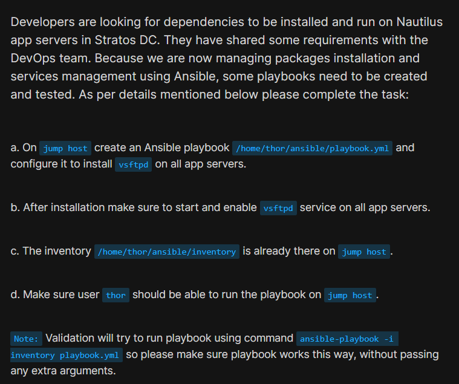
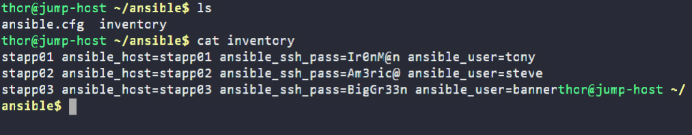
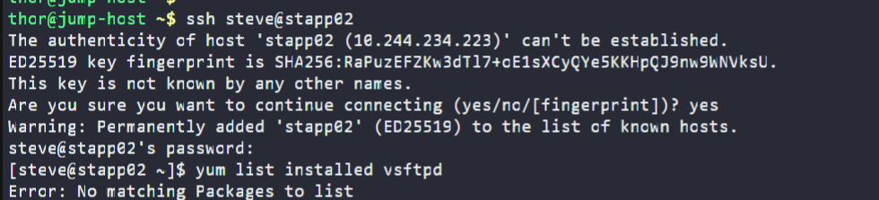
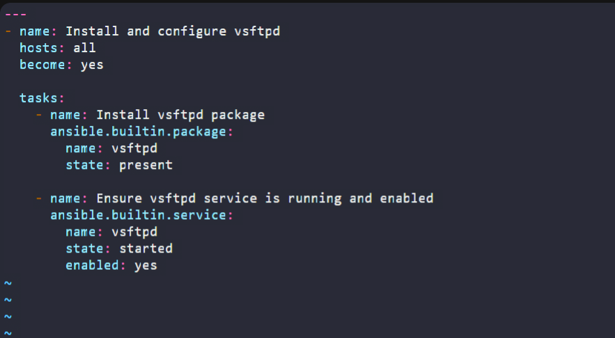
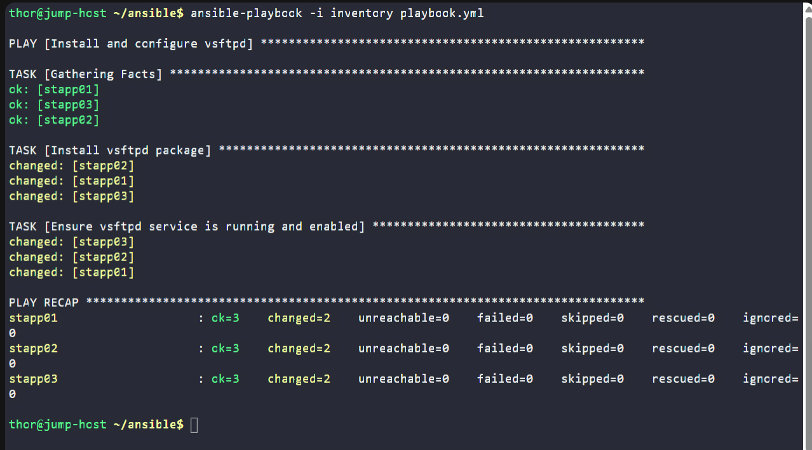
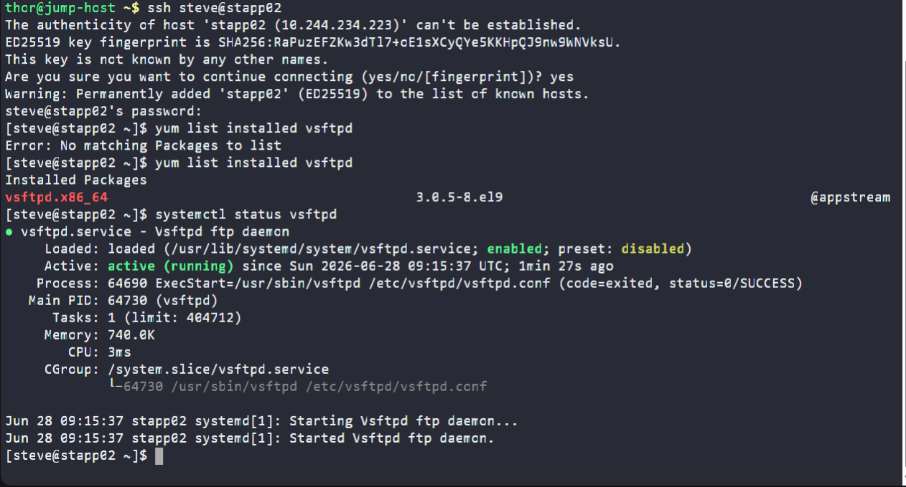

# Day 89: Ansible Manage Services

<div style="border:1px solid #ccc; padding:10px; border-radius:10px; box-shadow:2px 2px 8px rgba(0,0,0,0.2); display:inline-block;">
  
</div>

## Content

> Today I worked on an Ansible automation task that involved installing and managing the **vsftpd** service on multiple application servers in the Stratos Datacenter. This task helped me understand how Ansible can automate package installation and service management across multiple servers using a single playbook.

* * *

## 🔹 What I Learned

*   Installing software packages using Ansible
    
*   Managing Linux services using the **service** module
    
*   Using the **package** module for platform-independent package management
    
*   Enabling services to start automatically after system reboot
    
*   Executing Ansible playbooks against multiple managed hosts
    

* * *

## 🔹 Task Requirement

<div style="border:1px solid #ccc; padding:10px; border-radius:10px; box-shadow:2px 2px 8px rgba(0,0,0,0.2); display:inline-block;">
  
</div>

As per the Nautilus DevOps team requirements, I needed to:

*   Create an Ansible playbook:
    

```text
/home/thor/ansible/playbook.yml
```

using the existing inventory file:

```text
/home/thor/ansible/inventory
```

*   Install the **vsftpd** package on all application servers.
    
*   Ensure the **vsftpd** service is started.
    
*   Enable the **vsftpd** service to start automatically after system boot.
    

The playbook must execute successfully using:

```bash
ansible-playbook -i inventory playbook.yml
```

without passing any additional arguments.

* * *

## 🔹 Steps I Followed

### 1\. Navigated to the Working Directory

I first moved to the Ansible working directory on the jump host.

```bash
cd /home/thor/ansible
```

This directory already contained the required inventory file.

* * *

### 2\. Verified the Inventory

I checked the existing inventory.

```bash
cat inventory
```
<div style="border:1px solid #ccc; padding:10px; border-radius:10px; box-shadow:2px 2px 8px rgba(0,0,0,0.2); display:inline-block;">
  
</div>

Output:

```ini
stapp01 ansible_host=stapp01 ansible_ssh_pass=Ir0nM@n ansible_user=tony
stapp02 ansible_host=stapp02 ansible_ssh_pass=Am3ric@ ansible_user=steve
stapp03 ansible_host=stapp03 ansible_ssh_pass=BigGr33n ansible_user=banner
```

This inventory contains the SSH connection details for all three application servers.

* * *

### 3\. Verified the Initial State

Before creating the playbook, I connected to one of the application servers to verify whether **vsftpd** was already installed.

```bash
ssh steve@stapp02
```

Then checked the installed packages.

```bash
yum list installed vsftpd
```

Output:

```text
Error: No matching Packages to list
```
<div style="border:1px solid #ccc; padding:10px; border-radius:10px; box-shadow:2px 2px 8px rgba(0,0,0,0.2); display:inline-block;">
  
</div>

### Observation

This confirmed that **vsftpd** was not installed on the server.

After verifying this, I returned to the jump host to create the playbook.

* * *

### 4\. Created the Playbook

I created the playbook.

```bash
vi playbook.yml
```
<div style="border:1px solid #ccc; padding:10px; border-radius:10px; box-shadow:2px 2px 8px rgba(0,0,0,0.2); display:inline-block;">
  
</div>

Added the following content:

<div style="border:1px solid #ccc; padding:10px; border-radius:10px; box-shadow:2px 2px 8px rgba(0,0,0,0.2); display:inline-block;">
  
</div>

```yaml
---
- name: Install and configure vsftpd
  hosts: all
  become: yes

  tasks:
    - name: Install vsftpd package
      ansible.builtin.package:
        name: vsftpd
        state: present

    - name: Ensure vsftpd service is running and enabled
      ansible.builtin.service:
        name: vsftpd
        state: started
        enabled: yes
```

Saved the file.

* * *

## 🔹 Understanding the Playbook

### Target Hosts

```yaml
hosts: all
```

The playbook targets every host defined in the inventory file.

* * *

### Privilege Escalation

```yaml
become: yes
```

Installing packages and managing system services require administrative privileges.

Using `become: yes` allows Ansible to execute these tasks with root privileges.

* * *

### Package Module

```yaml
package:
```

The **package** module provides a generic interface for package management.

Instead of using distribution-specific modules like `yum` or `dnf`, the **package** module automatically selects the appropriate package manager for the target system.

The following task installs **vsftpd** if it is not already present.

```yaml
state: present
```

This ensures idempotency—running the playbook multiple times will not reinstall the package if it already exists.

* * *

### Service Module

```yaml
service:
```

The **service** module manages Linux services.

In this task it performs two actions:

```yaml
state: started
```

Starts the **vsftpd** service if it is not already running.

```yaml
enabled: yes
```

Configures the service to start automatically whenever the system boots.

This ensures the FTP service remains available even after a reboot.

* * *

### 5\. Executed the Playbook

Ran:

```bash
ansible-playbook -i inventory playbook.yml
```
<div style="border:1px solid #ccc; padding:10px; border-radius:10px; box-shadow:2px 2px 8px rgba(0,0,0,0.2); display:inline-block;">
  
</div>

Output:

```text
PLAY [Install and configure vsftpd]

TASK [Gathering Facts]
ok: [stapp01]
ok: [stapp02]
ok: [stapp03]

TASK [Install vsftpd package]
changed: [stapp01]
changed: [stapp02]
changed: [stapp03]

TASK [Ensure vsftpd service is running and enabled]
changed: [stapp01]
changed: [stapp02]
changed: [stapp03]

PLAY RECAP

stapp01 : ok=3 changed=2 failed=0
stapp02 : ok=3 changed=2 failed=0
stapp03 : ok=3 changed=2 failed=0
```

* * *

## 🔹 Understanding the Output

### Gathering Facts

Before executing the tasks, Ansible collected system information from each managed node.

* * *

### Package Installation

```text
changed
```

The **changed** status indicates that the **vsftpd** package was successfully installed on each application server.

* * *

### Service Configuration

The **service** task started the **vsftpd** service and enabled it to start automatically during future system boots.

* * *

### Play Recap

```text
ok=3
changed=2
failed=0
```

Meaning:

*   Three tasks completed successfully.
    
*   Two tasks modified each server.
    
*   No failures occurred.
    

* * *

### 6\. Validated the Configuration

After the playbook completed successfully, I connected to one application server.

```bash
ssh steve@stapp02
```

Verified that the package was installed.

```bash
yum list installed vsftpd
```

Output:

```text
Installed Packages
vsftpd.x86_64    3.0.5-8.el9
```

This confirmed that the package had been installed successfully.

* * *

### Verified the Service Status

Checked the service status.

```bash
systemctl status vsftpd
```

Output showed:

```text
Loaded: loaded (...; enabled)
Active: active (running)
```

This confirmed that:

*   The service was running.
    
*   The service was enabled to start automatically after reboot.
    
<div style="border:1px solid #ccc; padding:10px; border-radius:10px; box-shadow:2px 2px 8px rgba(0,0,0,0.2); display:inline-block;">
  
</div>

* * *

## 🔹 Verification

✅ Installed **vsftpd** successfully on all application servers

✅ Started the **vsftpd** service

✅ Enabled the service to start automatically after boot

✅ Playbook executed successfully without errors

✅ Verified installation using `yum list installed`

✅ Verified service status using `systemctl status`

* * *

## 🔹 My Understanding

This task reinforced how Ansible simplifies system administration by automating package installation and service management across multiple servers. Using the **package** and **service** modules makes playbooks portable, idempotent, and easy to maintain while ensuring all managed hosts remain consistently configured.

* * *

## 🔹 What I Found Interesting

I found it interesting that with just two Ansible tasks, I could install **vsftpd**, start the service, enable it to launch automatically after reboot, and apply the same configuration simultaneously across all three application servers. This demonstrates the efficiency and scalability that Ansible brings to infrastructure management.

* * *

### Topics Covered

- ***Ansible***
- ***Ansible Inventory***
- ***Ansible Playbooks***
- ***manage services***
- ***Package installation***
- ***Playbook Execution***

**Previous Task**: [ Day 88: Ansible Blockinfile Module](../Day_88/day_88.md)

**Next Task**: [ Day 90: Managing ACLs Using Ansible](../Day_90/day_90.md)