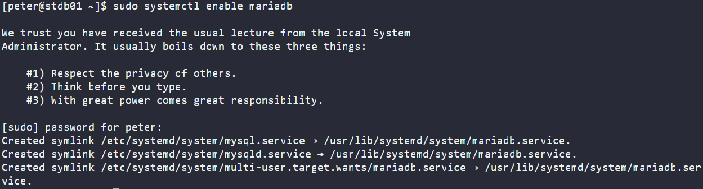
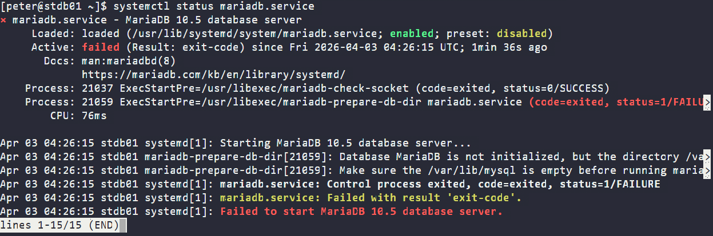
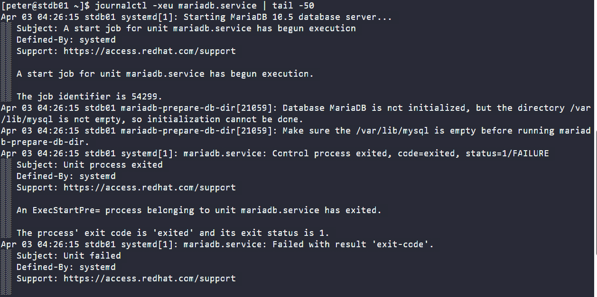
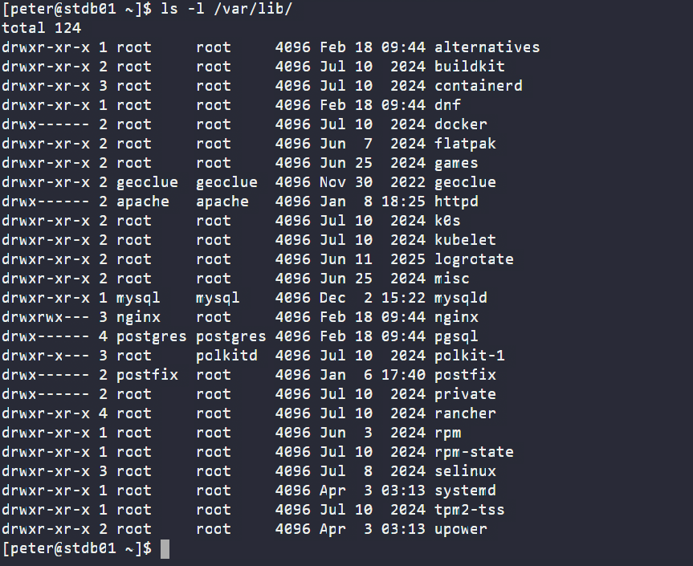
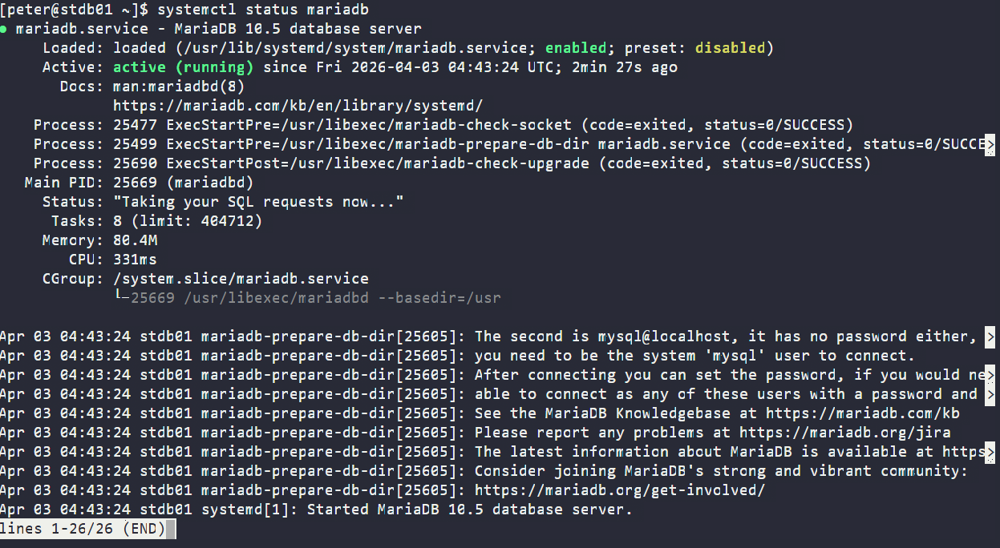

# Day 9: MariaDB Troubleshooting

<div style="border:1px solid #ccc; padding:10px; border-radius:10px; box-shadow:2px 2px 8px rgba(0,0,0,0.2); display:inline-block;">
  
</div>

### **Content:**

>Today I worked on installing and troubleshooting MariaDB (10.5) on a Linux server. Initially, the service failed to start, and I had to debug multiple issues step by step. This task helped me understand how database services behave and how to troubleshoot real-world problems.
---
## **What I Learned**
Through this task, I understood:

* How to manage services using `systemctl`
* Common reasons why MariaDB fails to start
* Importance of correct data directory configuration
* How to read and analyze system logs using `journalctl`
* How to fix initialization issues in MariaDB

---
<div style="border:1px solid #ccc; padding:10px; border-radius:10px; box-shadow:2px 2px 8px rgba(0,0,0,0.2); display:inline-block;">
  
</div>

## **Steps I Followed**

### **1. Checked MariaDB Status**

```bash
systemctl status mariadb
```

### **Output:**

```
Active: inactive (dead)
```
<div style="border:1px solid #ccc; padding:10px; border-radius:10px; box-shadow:2px 2px 8px rgba(0,0,0,0.2); display:inline-block;">
  
</div>
<div style="border:1px solid #ccc; padding:10px; border-radius:10px; box-shadow:2px 2px 8px rgba(0,0,0,0.2); display:inline-block;">
  
</div>

👉 MariaDB was installed but not running.

---

### **2. Enabled MariaDB Service**

```bash
sudo systemctl enable mariadb
```

### **Output:**

```
Created symlink /etc/systemd/system/mariadb.service → /usr/lib/systemd/system/mariadb.service.
```
<div style="border:1px solid #ccc; padding:10px; border-radius:10px; box-shadow:2px 2px 8px rgba(0,0,0,0.2); display:inline-block;">
  
</div>

👉 This ensures MariaDB starts automatically on boot.

---

### **3. Tried to Start MariaDB**

```bash
sudo systemctl start mariadb
```

### **Output:**

```
Job for mariadb.service failed because the control process exited with error code.
```
<div style="border:1px solid #ccc; padding:10px; border-radius:10px; box-shadow:2px 2px 8px rgba(0,0,0,0.2); display:inline-block;">
  
</div>

👉 The service failed to start, so troubleshooting was required.

---

### **4. Checked Detailed Error Logs**

```bash
systemctl status mariadb.service
journalctl -xeu mariadb.service
```

### **Key Error Found:**

```
Database MariaDB is not initialized, but the directory /var/lib/mysql is not empty
```
<div style="border:1px solid #ccc; padding:10px; border-radius:10px; box-shadow:2px 2px 8px rgba(0,0,0,0.2); display:inline-block;">
  
</div>
<div style="border:1px solid #ccc; padding:10px; border-radius:10px; box-shadow:2px 2px 8px rgba(0,0,0,0.2); display:inline-block;">
  
</div>

👉 This indicated a problem with the data directory.

---

### **5. Investigated Data Directory**

```bash
ls -la /var/lib/mysql
```

### **Output:**

```
No such file or directory
```
<div style="border:1px solid #ccc; padding:10px; border-radius:10px; box-shadow:2px 2px 8px rgba(0,0,0,0.2); display:inline-block;">
  
</div>
👉 Surprisingly, the directory didn’t exist.

Then checked:

```bash
ls -l /var/lib/
```

### **Output (important part):**

```
mysqld
```
<div style="border:1px solid #ccc; padding:10px; border-radius:10px; box-shadow:2px 2px 8px rgba(0,0,0,0.2); display:inline-block;">
  
</div>

👉 Found a non-standard directory `/var/lib/mysqld` instead of `/var/lib/mysql`.

---

### **6. Fixed the Issue (Created Correct Directory)**

```bash
sudo mkdir -p /var/lib/mysql
```
<div style="border:1px solid #ccc; padding:10px; border-radius:10px; box-shadow:2px 2px 8px rgba(0,0,0,0.2); display:inline-block;">
  
</div>
---

### **7. Set Proper Permissions**

```bash
sudo chown -R mysql:mysql /var/lib/mysql
sudo chmod 755 /var/lib/mysql
```
<div style="border:1px solid #ccc; padding:10px; border-radius:10px; box-shadow:2px 2px 8px rgba(0,0,0,0.2); display:inline-block;">
  
</div>
<div style="border:1px solid #ccc; padding:10px; border-radius:10px; box-shadow:2px 2px 8px rgba(0,0,0,0.2); display:inline-block;">
  
</div>

👉 Ensured MariaDB has the correct access.

---

### **8. Started MariaDB Again**

```bash
sudo systemctl start mariadb
```
<div style="border:1px solid #ccc; padding:10px; border-radius:10px; box-shadow:2px 2px 8px rgba(0,0,0,0.2); display:inline-block;">
  
</div>
---

### **9. Verified Service Status**

```bash
systemctl status mariadb
```

### **Output:**

```
Active: active (running)
Status: "Taking your SQL requests now..."
```
<div style="border:1px solid #ccc; padding:10px; border-radius:10px; box-shadow:2px 2px 8px rgba(0,0,0,0.2); display:inline-block;">
  
</div>

👉 MariaDB started successfully 🎉

---

## **My Understanding**

This task showed that even small misconfigurations (like a missing directory) can prevent services from starting. Logs are extremely important for identifying the root cause.

Also, MariaDB strictly expects its default data directory (`/var/lib/mysql`). Any deviation can lead to initialization failure.

---

## **What I Found Interesting**

It was interesting how:

* A missing directory caused the entire service to fail
* System logs clearly pointed to the issue
* Fixing it required only a few commands once the root cause was understood

This felt like real-world DevOps troubleshooting rather than just installation.

### Topics Covered

- ***MariaDB installation and troubleshooting***
- ***Systemctl service management***
- ***Log analysis using journalctl***
- ***Linux file permissions and ownership***
- ***Database initialization issues***

**Previous Task**: [Day 8: Install Ansible](../Day_8/day_8.md)

**Next Task**: [Day 10: Linux Bash Scripts](../Day_10/day_10.md)