# Day 90: Managing ACLs Using Ansible

<div style="border:1px solid #ccc; padding:10px; border-radius:10px; box-shadow:2px 2px 8px rgba(0,0,0,0.2); display:inline-block;">
  
</div>

## Content

> Today I worked on an Ansible automation task that involved creating files and configuring **Access Control Lists (ACLs)** on multiple application servers in the Stratos Datacenter. This task helped me understand how Ansible can automate file management while assigning fine-grained permissions to specific users and groups without changing the file ownership.

* * *

## 🔹 What I Learned

*   Creating files using the **Ansible File module**
    
*   Managing Linux Access Control Lists (ACLs) using the **ansible.posix.acl** module
    
*   Assigning permissions to specific users and groups using ACLs
    
*   Understanding how ACLs extend traditional Linux file permissions
    

* * *

## 🔹 Task Requirement

<div style="border:1px solid #ccc; padding:10px; border-radius:10px; box-shadow:2px 2px 8px rgba(0,0,0,0.2); display:inline-block;">
  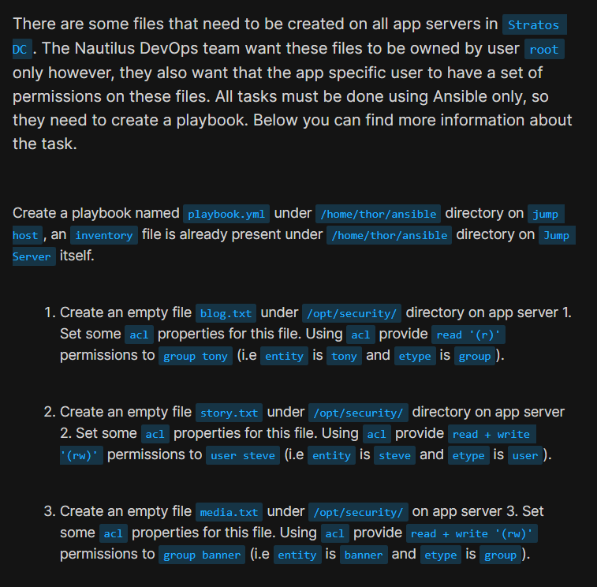
</div>
<div style="border:1px solid #ccc; padding:10px; border-radius:10px; box-shadow:2px 2px 8px rgba(0,0,0,0.2); display:inline-block;">
  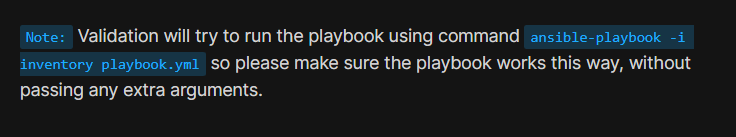
</div>

As per the Nautilus DevOps team requirements, I needed to:

*   Create an Ansible playbook:
    

```text
/home/thor/ansible/playbook.yml
```

using the existing inventory file:

```text
/home/thor/ansible/inventory
```

The playbook should perform the following tasks:

*   On **App Server 1**, create an empty file:
    

```text
/opt/security/blog.txt
```

and grant **read (r)** permission to **group tony** using ACL.

*   On **App Server 2**, create an empty file:
    

```text
/opt/security/story.txt
```

and grant **read and write (rw)** permissions to **user steve** using ACL.

*   On **App Server 3**, create an empty file:
    

```text
/opt/security/media.txt
```

and grant **read and write (rw)** permissions to **group banner** using ACL.

The playbook must execute successfully using:

```bash
ansible-playbook -i inventory playbook.yml
```

without passing any additional arguments.

* * *

## 🔹 Steps I Followed

### 1\. Navigated to the Working Directory

I first moved to the Ansible working directory on the jump host.

```bash
cd /home/thor/ansible
```
<div style="border:1px solid #ccc; padding:10px; border-radius:10px; box-shadow:2px 2px 8px rgba(0,0,0,0.2); display:inline-block;">
  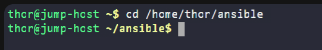
</div>

This directory already contained the required inventory file.

* * *

### 2\. Verified the Inventory

I checked the existing inventory.

```bash
cat inventory
```

<div style="border:1px solid #ccc; padding:10px; border-radius:10px; box-shadow:2px 2px 8px rgba(0,0,0,0.2); display:inline-block;">
  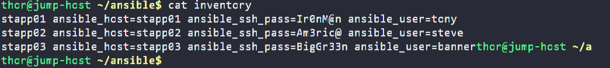
</div>

Output:

```ini
stapp01 ansible_host=stapp01 ansible_ssh_pass=Ir0nM@n ansible_user=tony
stapp02 ansible_host=stapp02 ansible_ssh_pass=Am3ric@ ansible_user=steve
stapp03 ansible_host=stapp03 ansible_ssh_pass=BigGr33n ansible_user=banner
```

This inventory contains the SSH connection details for all three application servers.

Since the inventory does not define any host groups, I used the individual hostnames (`stapp01`, `stapp02`, and `stapp03`) in the playbook.

* * *

### 3\. Verified the Initial State

Before creating the playbook, I connected to one of the application servers to verify that the target file did not already exist.

```bash
ssh steve@stapp02
```

Navigated to the target directory.

```bash
cd /opt/security
```

Checked the contents.

```bash
ls
```
<div style="border:1px solid #ccc; padding:10px; border-radius:10px; box-shadow:2px 2px 8px rgba(0,0,0,0.2); display:inline-block;">
  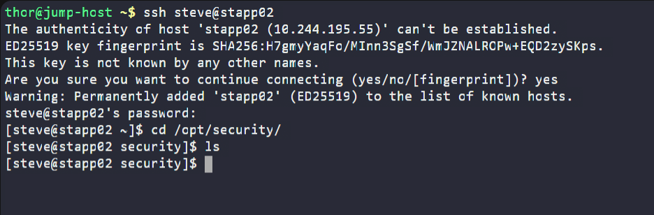
</div>

Output:

```text
(no files)
```

### Observation

This confirmed that the required file had not yet been created.

After verifying the initial state, I returned to the jump host to create the playbook.

* * *

### 4\. Created the Playbook

I created the playbook.

```bash
vi playbook.yml
```
<div style="border:1px solid #ccc; padding:10px; border-radius:10px; box-shadow:2px 2px 8px rgba(0,0,0,0.2); display:inline-block;">
  
</div>

<div style="border:1px solid #ccc; padding:10px; border-radius:10px; box-shadow:2px 2px 8px rgba(0,0,0,0.2); display:inline-block;">
  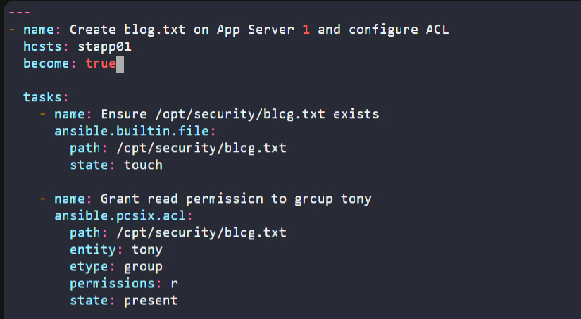
</div>
<div style="border:1px solid #ccc; padding:10px; border-radius:10px; box-shadow:2px 2px 8px rgba(0,0,0,0.2); display:inline-block;">
  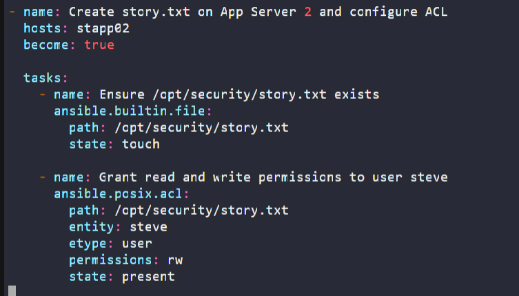
</div>
<div style="border:1px solid #ccc; padding:10px; border-radius:10px; box-shadow:2px 2px 8px rgba(0,0,0,0.2); display:inline-block;">
  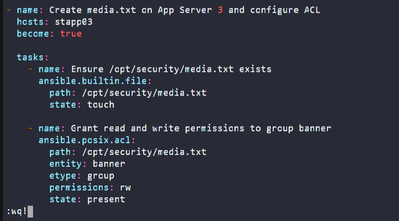
</div>

Added the following content:

```yaml
---
- name: Create blog.txt on App Server 1 and configure ACL
  hosts: stapp01
  become: true

  tasks:
    - name: Ensure /opt/security/blog.txt exists
      ansible.builtin.file:
        path: /opt/security/blog.txt
        state: touch

    - name: Grant read permission to group tony
      ansible.posix.acl:
        path: /opt/security/blog.txt
        entity: tony
        etype: group
        permissions: r
        state: present

- name: Create story.txt on App Server 2 and configure ACL
  hosts: stapp02
  become: true

  tasks:
    - name: Ensure /opt/security/story.txt exists
      ansible.builtin.file:
        path: /opt/security/story.txt
        state: touch

    - name: Grant read and write permissions to user steve
      ansible.posix.acl:
        path: /opt/security/story.txt
        entity: steve
        etype: user
        permissions: rw
        state: present

- name: Create media.txt on App Server 3 and configure ACL
  hosts: stapp03
  become: true

  tasks:
    - name: Ensure /opt/security/media.txt exists
      ansible.builtin.file:
        path: /opt/security/media.txt
        state: touch

    - name: Grant read and write permissions to group banner
      ansible.posix.acl:
        path: /opt/security/media.txt
        entity: banner
        etype: group
        permissions: rw
        state: present
```

Saved the file.

* * *

## 🔹 Understanding the Playbook

### Target Hosts

Each play targets a specific application server.

```yaml
hosts: stapp01
```

Similarly, the remaining plays target `stapp02` and `stapp03`.

Since the inventory contains individual hosts rather than groups, each play is executed on a single server.

* * *

### Privilege Escalation

```yaml
become: true
```

Creating files inside `/opt/security` and modifying ACLs require administrative privileges.

Using `become: true` allows Ansible to execute each task with root privileges.

* * *

### File Module

```yaml
ansible.builtin.file
```

The File module manages files and directories on remote systems.

In this task, it creates an empty file using:

```yaml
state: touch
```

This behaves similarly to the Linux `touch` command.

If the file already exists, Ansible updates its timestamp without recreating it, making the task idempotent.

* * *

### ACL Module

```yaml
ansible.posix.acl
```

The ACL module manages Linux Access Control Lists.

Unlike traditional Linux permissions, ACLs allow permissions to be assigned to individual users or groups without changing the file owner or primary group.

Important parameters used in this task:

```yaml
entity:
```

Specifies the user or group receiving the permission.

```yaml
etype:
```

Defines whether the entity is a `user` or a `group`.

```yaml
permissions:
```

Specifies the permission to assign.

Examples:

```yaml
permissions: r
permissions: rw
```

```yaml
state: present
```

Ensures that the ACL entry exists.

Since Ansible is idempotent, running the playbook multiple times will not create duplicate ACL entries.

* * *

### 5\. Executed the Playbook

Ran:

```bash
ansible-playbook -i inventory playbook.yml
```
<div style="border:1px solid #ccc; padding:10px; border-radius:10px; box-shadow:2px 2px 8px rgba(0,0,0,0.2); display:inline-block;">
  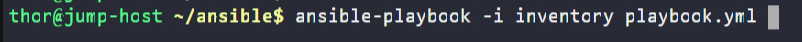
</div>

<div style="border:1px solid #ccc; padding:10px; border-radius:10px; box-shadow:2px 2px 8px rgba(0,0,0,0.2); display:inline-block;">
  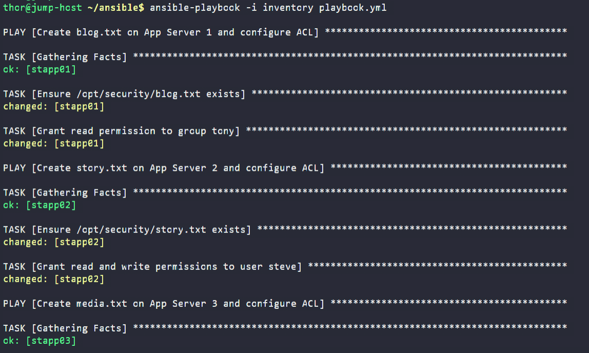
</div>

Output:

```text
PLAY RECAP

stapp01 : ok=3 changed=2 failed=0
stapp02 : ok=3 changed=2 failed=0
stapp03 : ok=3 changed=2 failed=0
```

* * *

## 🔹 Understanding the Output

### Gathering Facts

Before executing any tasks, Ansible collected system information from each managed host.

* * *

### File Creation

The File module successfully created the required files on each application server.

The status:

```text
changed
```

indicates that the files were created successfully.

* * *

### ACL Configuration

The ACL module added the required permissions for the specified users and groups.

Each ACL entry was successfully applied to the corresponding file.

* * *

### Play Recap

```text
ok=3
changed=2
failed=0
```

Meaning:

*   Three tasks completed successfully on each host.
    
*   Two tasks modified each application server.
    
*   No failures occurred during execution.
    

* * *

### 6\. Validated the Configuration

After the playbook completed successfully, I connected to one application server.

```bash
ssh steve@stapp02
```

Navigated to the target directory.

```bash
cd /opt/security
```

Listed the files.

```bash
ls -la
```
<div style="border:1px solid #ccc; padding:10px; border-radius:10px; box-shadow:2px 2px 8px rgba(0,0,0,0.2); display:inline-block;">
  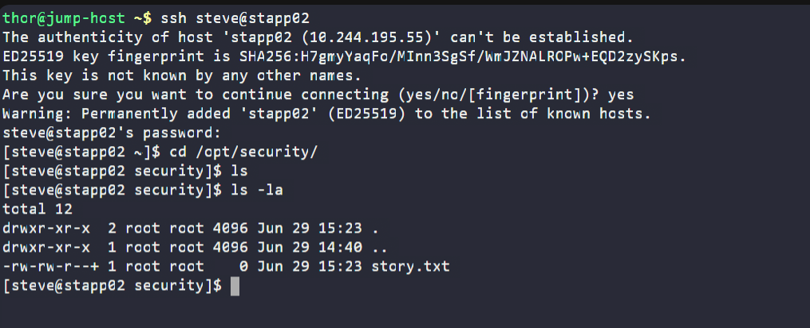
</div>

Output:

```text
-rw-rw-r--+ 1 root root 0 Jun 29 15:23 story.txt
```

### Observation

The file was:

*   Created successfully.
    
*   Owned by the **root** user.
    
*   Displayed a **+** symbol, indicating that extended ACLs were configured.
    

To inspect the ACL entries, I used:

```bash
getfacl story.txt
```

This confirmed that the required ACL permissions had been applied.

* * *

## 🔹 Verification

✅ Created `blog.txt`, `story.txt`, and `media.txt`

✅ Files are owned by the `root` user

✅ Configured ACL permissions for the required users and groups

✅ Successfully executed the playbook on all application servers

✅ Verified file creation using `ls -la`

✅ Verified ACL entries using `getfacl`

* * *

## 🔹 My Understanding

This task helped me understand how Linux Access Control Lists (ACLs) provide more flexible permission management than traditional file permissions. By using the **ansible.posix.acl** module together with the **ansible.builtin.file** module, I was able to automate both file creation and fine-grained permission assignment across multiple servers while keeping the playbook idempotent and easy to maintain.

* * *

## 🔹 What I Found Interesting

I found it interesting that Linux ACLs allow permissions to be granted to specific users or groups without changing the file owner or primary group. Using Ansible, I could create files and configure different ACL permissions on multiple application servers simultaneously with a single playbook, making system administration both efficient and consistent.

* * *

### Topics Covered

- ***Ansible***
- ***Ansible Inventory***
- ***Ansible Playbooks***
- ***Linux ACL (Access Control Lists)***
- ***File Management***
- ***ACL Management***
- ***Privilege Escalation***
- ***Playbook Execution***

**Previous Task**: [ Day 89: Ansible Manage Services](../Day_89/day_89.md)

**Next Task**: [ Day 91: Ansible Lineinfile Module ](../Day_91/day_91.md)

