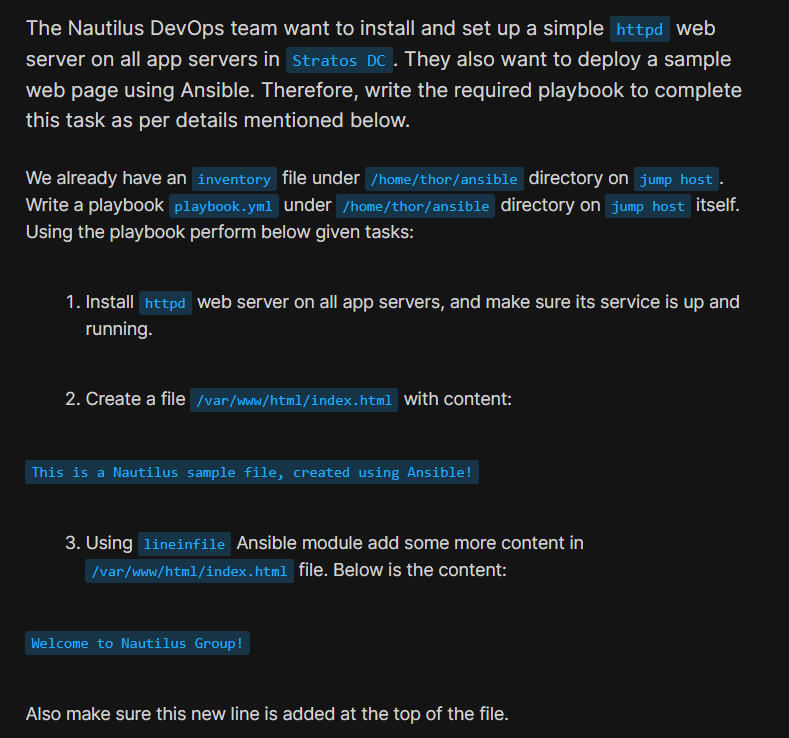
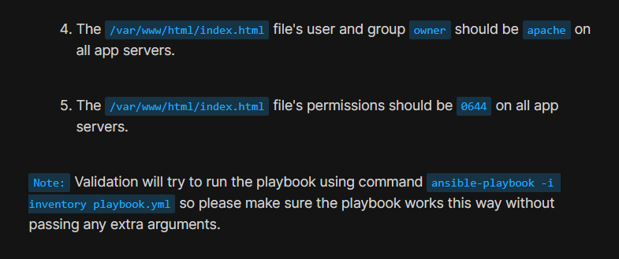
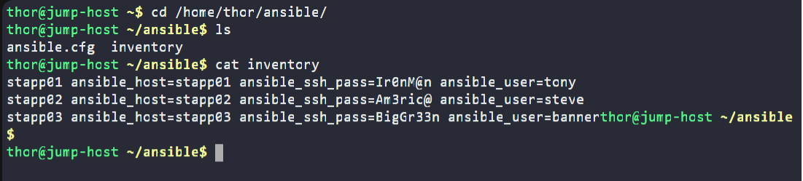
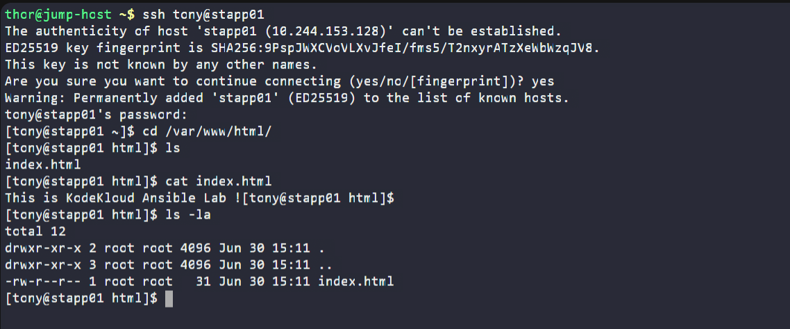
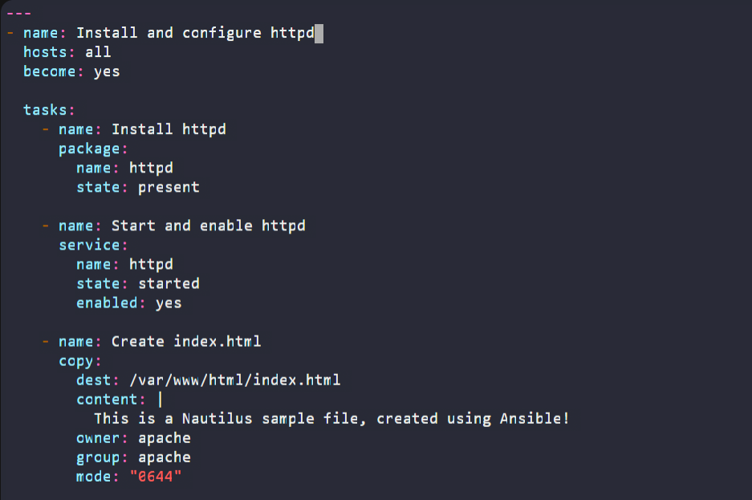
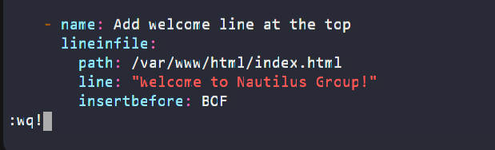
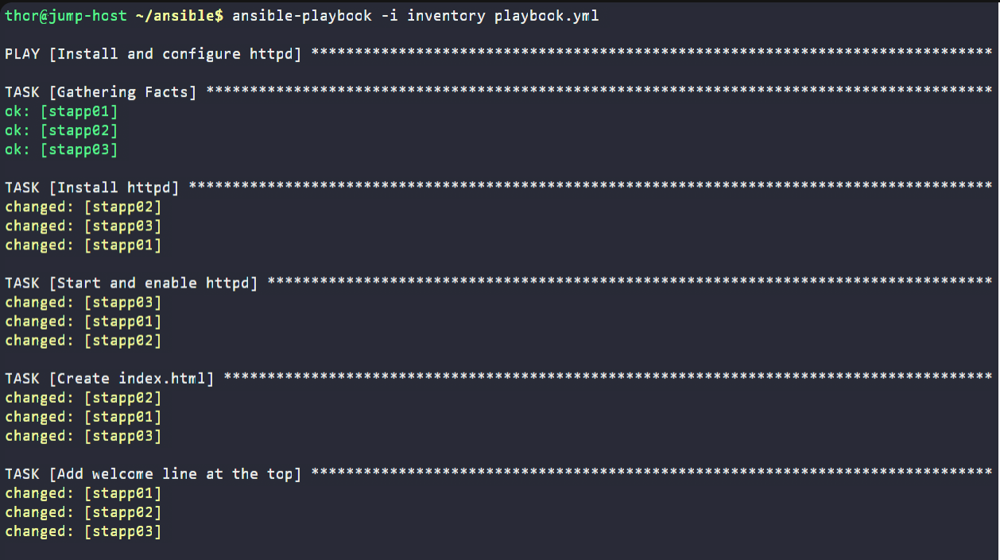
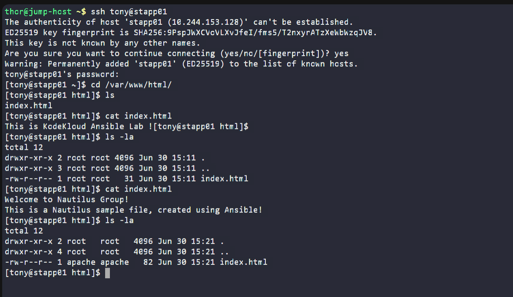
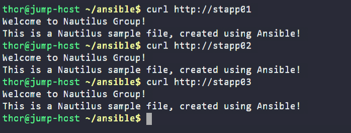

# Day 91: Ansible Lineinfile Module

<div style="border:1px solid #ccc; padding:10px; border-radius:10px; box-shadow:2px 2px 8px rgba(0,0,0,0.2); display:inline-block;">
  
</div>

## Content

> Today I worked on an Ansible automation task that involved installing and configuring the Apache HTTP server on multiple application servers in the Stratos Datacenter. I also learned how to deploy a sample web page, overwrite an existing file using the **Ansible Copy module**, and use the **Ansible Lineinfile module** to insert content at the beginning of a file while maintaining the required ownership and permissions.

* * *

## 🔹 What I Learned

*   Installing packages using the **Ansible Package module**
    
*   Managing Linux services using the **Ansible Service module**
    
*   Creating and overwriting files using the **Ansible Copy module**
    
*   Inserting a line into a file using the **Ansible Lineinfile module**
    
*   Using `insertbefore: BOF` to place content at the top of a file
    

* * *

## 🔹 Task Requirement

<div style="border:1px solid #ccc; padding:10px; border-radius:10px; box-shadow:2px 2px 8px rgba(0,0,0,0.2); display:inline-block;">
  
</div>

<div style="border:1px solid #ccc; padding:10px; border-radius:10px; box-shadow:2px 2px 8px rgba(0,0,0,0.2); display:inline-block;">
  
</div>


As per the Nautilus DevOps team requirements, I needed to:

Create an Ansible playbook:

```text
/home/thor/ansible/playbook.yml
```

using the existing inventory file:

```text
/home/thor/ansible/inventory
```

The playbook should perform the following tasks:

*   Install the **httpd** web server on all application servers.
    
*   Ensure the **httpd** service is started and enabled.
    
*   Create the following file:
    

```text
/var/www/html/index.html
```

with the content:

```text
This is a Nautilus sample file, created using Ansible!
```

*   Using the **lineinfile** module, add the following line:
    

```text
Welcome to Nautilus Group!
```

*   Ensure the new line is inserted at the **top** of the file.
    
*   Set the file owner and group to:
    

```text
apache
```

*   Set the file permissions to:
    

```text
0644
```

The playbook must execute successfully using:

```bash
ansible-playbook -i inventory playbook.yml
```

without passing any additional arguments.

* * *

## 🔹 Steps I Followed

### 1\. Navigated to the Working Directory

I first moved to the Ansible working directory on the jump host.

```bash
cd /home/thor/ansible
```

This directory already contained the required inventory file.

* * *

### 2\. Verified the Inventory

I checked the existing inventory.

```bash
cat inventory
```
<div style="border:1px solid #ccc; padding:10px; border-radius:10px; box-shadow:2px 2px 8px rgba(0,0,0,0.2); display:inline-block;">
  
</div>

Output:

```ini
stapp01 ansible_host=stapp01 ansible_ssh_pass=Ir0nM@n ansible_user=tony
stapp02 ansible_host=stapp02 ansible_ssh_pass=Am3ric@ ansible_user=steve
stapp03 ansible_host=stapp03 ansible_ssh_pass=BigGr33n ansible_user=banner
```

Since the inventory contains all three application servers, I targeted all hosts using:

```yaml
hosts: all
```

* * *

### 3\. Verified the Initial State

Before writing the playbook, I connected to one of the application servers to inspect the existing web page.

```bash
ssh tony@stapp01
```

Navigated to the web root.

```bash
cd /var/www/html
```

Viewed the existing file.

```bash
cat index.html
```

Output:

```text
This is KodeKloud Ansible Lab !
```

Checked its ownership and permissions.

```bash
ls -la
```

Output:

```text
-rw-r--r-- 1 root root 31 Jun 30 15:11 index.html
```

<div style="border:1px solid #ccc; padding:10px; border-radius:10px; box-shadow:2px 2px 8px rgba(0,0,0,0.2); display:inline-block;">
  
</div>

### Observation

The file already existed and contained different content. Therefore, I needed to overwrite the file rather than append to it.

After verifying the initial state, I returned to the jump host to create the playbook.

* * *

### 4\. Created the Playbook

I created the playbook.

```bash
vi playbook.yml
```
<div style="border:1px solid #ccc; padding:10px; border-radius:10px; box-shadow:2px 2px 8px rgba(0,0,0,0.2); display:inline-block;">
  
</div>

Added the following content:

```yaml
---
- name: Install and configure httpd
  hosts: all
  become: yes

  tasks:
    - name: Install httpd
      package:
        name: httpd
        state: present

    - name: Start and enable httpd
      service:
        name: httpd
        state: started
        enabled: yes

    - name: Create index.html
      copy:
        dest: /var/www/html/index.html
        content: |
          This is a Nautilus sample file, created using Ansible!
        owner: apache
        group: apache
        mode: "0644"

    - name: Add welcome line at the top
      lineinfile:
        path: /var/www/html/index.html
        line: "Welcome to Nautilus Group!"
        insertbefore: BOF
```
<div style="border:1px solid #ccc; padding:10px; border-radius:10px; box-shadow:2px 2px 8px rgba(0,0,0,0.2); display:inline-block;">
  
</div>

<div style="border:1px solid #ccc; padding:10px; border-radius:10px; box-shadow:2px 2px 8px rgba(0,0,0,0.2); display:inline-block;">
  
</div>


Saved the file.

* * *

## 🔹 Understanding the Playbook

### Target Hosts

The play targets all application servers.

```yaml
hosts: all
```

This allows the same tasks to be executed on every server defined in the inventory.

* * *

### Privilege Escalation

```yaml
become: yes
```

Installing packages, managing services, and modifying files under `/var/www/html` require administrative privileges.

Using `become: yes` allows Ansible to perform these tasks as the root user.

* * *

### Package Module

```yaml
package:
```

The Package module installs software packages on managed hosts.

```yaml
state: present
```

Ensures that the **httpd** package is installed.

If it is already installed, Ansible makes no changes, keeping the playbook idempotent.

* * *

### Service Module

```yaml
service:
```

The Service module manages system services.

Parameters used:

```yaml
state: started
enabled: yes
```

These ensure that the Apache service is currently running and automatically starts after a reboot.

* * *

### Copy Module

```yaml
copy:
```

The Copy module creates or replaces files on remote hosts.

In this task, it creates:

```text
/var/www/html/index.html
```

with the required content.

It also sets:

```yaml
owner: apache
group: apache
mode: "0644"
```

This ensures the file has the required ownership and permissions immediately after creation.

Unlike the `blockinfile` module, the `copy` module replaces the existing file completely, preventing unwanted content from remaining in the file.

* * *

### Lineinfile Module

```yaml
lineinfile:
```

The Lineinfile module inserts or updates a single line within a file.

The following parameter was used:

```yaml
insertbefore: BOF
```

`BOF` stands for **Beginning Of File**.

This inserts the welcome message as the first line of the file.

Resulting file content:

```text
Welcome to Nautilus Group!
This is a Nautilus sample file, created using Ansible!
```

* * *

### 5\. Executed the Playbook

Ran:

```bash
ansible-playbook -i inventory playbook.yml
```

Output:

```text
PLAY RECAP

stapp01 : ok=5 changed=4 failed=0
stapp02 : ok=5 changed=4 failed=0
stapp03 : ok=5 changed=4 failed=0
```

<div style="border:1px solid #ccc; padding:10px; border-radius:10px; box-shadow:2px 2px 8px rgba(0,0,0,0.2); display:inline-block;">
  
</div>

* * *

## 🔹 Understanding the Output

### Gathering Facts

Ansible first collected system information from all managed hosts before executing the tasks.

* * *

### Package Installation

The Package module installed the Apache HTTP server on each application server.

* * *

### Service Configuration

The Service module started the Apache service and enabled it to start automatically during system boot.

* * *

### File Creation

The Copy module replaced the existing `index.html` file with the required content and applied the specified ownership and permissions.

* * *

### Line Insertion

The Lineinfile module inserted the welcome message at the beginning of the file without affecting the remaining content.

* * *

### Play Recap

```text
ok=5
changed=4
failed=0
```

Meaning:

*   Five tasks completed successfully on each host.
    
*   Four tasks modified each application server.
    
*   No failures occurred during execution.
    

* * *

### 6\. Validated the Configuration

After the playbook completed successfully, I connected to one application server.

```bash
ssh tony@stapp01
```

Navigated to the web root.

```bash
cd /var/www/html
```

Verified the file contents.

```bash
cat index.html
```

Output:

```text
Welcome to Nautilus Group!
This is a Nautilus sample file, created using Ansible!
```

Verified ownership and permissions.

```bash
ls -la
```

Output:

```text
-rw-r--r-- 1 apache apache 82 Jun 30 15:21 index.html
```

<div style="border:1px solid #ccc; padding:10px; border-radius:10px; box-shadow:2px 2px 8px rgba(0,0,0,0.2); display:inline-block;">
  
</div>

Finally, I verified that the web server was serving the page correctly.

```bash
curl http://stapp01
curl http://stapp02
curl http://stapp03
```

Output:

```text
Welcome to Nautilus Group!
This is a Nautilus sample file, created using Ansible!
```

<div style="border:1px solid #ccc; padding:10px; border-radius:10px; box-shadow:2px 2px 8px rgba(0,0,0,0.2); display:inline-block;">
  
</div>

* * *

## 🔹 Verification

✅ Installed the Apache HTTP server on all application servers

✅ Started and enabled the Apache service

✅ Created the required `index.html` file

✅ Inserted the welcome message at the top using the `lineinfile` module

✅ Set the file owner and group to `apache`

✅ Set the file permissions to `0644`

✅ Verified the web page using `curl`

* * *

## 🔹 My Understanding

This task helped me understand how multiple Ansible modules can work together to automate web server configuration. I learned that the **Copy module** is useful for replacing an existing file with the required content, while the **Lineinfile module** is ideal for inserting or updating individual lines. I also learned how `insertbefore: BOF` ensures that new content is placed at the beginning of a file, making it easy to meet specific configuration requirements.

* * *

## 🔹 What I Found Interesting

I found it interesting that even though the target file already existed with different content, the **Copy module** completely replaced it with the required content, ensuring consistency across all servers. Combining the **Copy**, **Lineinfile**, **Package**, and **Service** modules allowed me to automate the complete deployment and configuration of a web server in a simple, idempotent playbook.

* * *

### Topics Covered

- ***Ansible***
- ***Ansible Inventory***
- ***Ansible Playbooks***
- ***Apache HTTP Server (httpd)***
- ***Ansible Copy Module***
- ***Ansible Lineinfile Module***
- ***File Management***
- ***Playbook Execution***

**Previous Task**: [ Day 90: Managing ACLs Using Ansible](../Day_90/day_90.md)

**Next Task**: [Day 92: Managing Jinja2 Templates Using Ansible ](../Day_92/day_92.md)
