# Day 92: Managing Jinja2 Templates Using Ansible

<div style="border:1px solid #ccc; padding:10px; border-radius:10px; box-shadow:2px 2px 8px rgba(0,0,0,0.2); display:inline-block;">
  
</div>

## Content

> Today I enhanced an existing Ansible role by adding a **Jinja2 template** and a task to deploy it. This lab helped me learn how to use the **Ansible Template module**, create reusable templates, and dynamically generate content using the built-in `inventory_hostname` variable instead of hardcoding server names.

* * *

## 🔹 What I Learned

*   Creating reusable **Jinja2 templates**
    
*   Using the **Ansible Template module**
    
*   Using the built-in `inventory_hostname` variable
    
*   Updating an existing Ansible role
    
*   Setting file ownership and permissions while deploying templates
    
*   Executing an Ansible role through a playbook
    

* * *

## 🔹 Task Requirement

<div style="border:1px solid #ccc; padding:10px; border-radius:10px; box-shadow:2px 2px 8px rgba(0,0,0,0.2); display:inline-block;">
  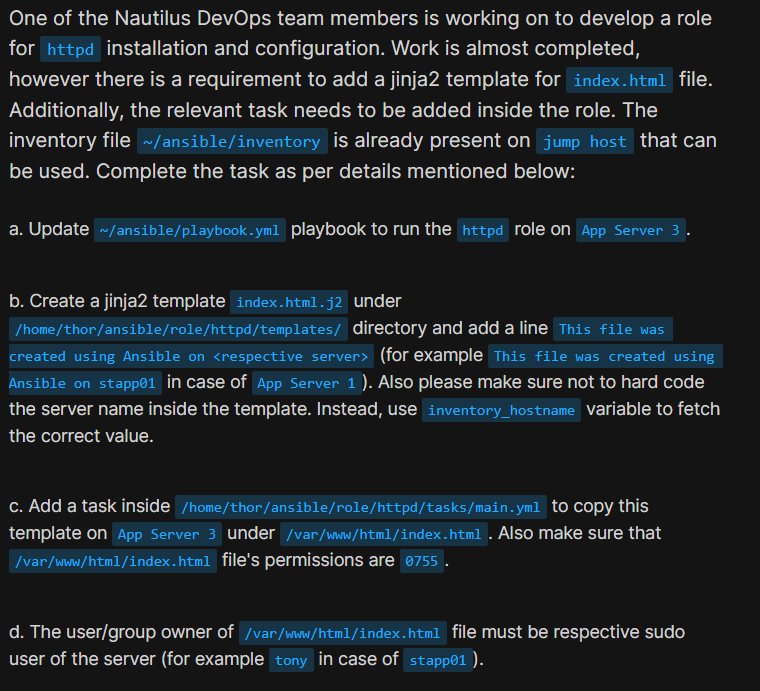
</div>
<div style="border:1px solid #ccc; padding:10px; border-radius:10px; box-shadow:2px 2px 8px rgba(0,0,0,0.2); display:inline-block;">
  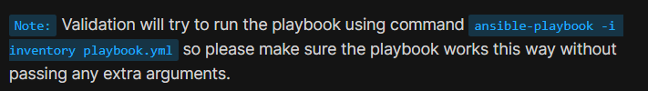
</div>

One of the Nautilus DevOps team members was developing a role for **httpd** installation and configuration. Most of the work had already been completed, but a few tasks were still pending.

I needed to:

*   Update the existing playbook:
    

```text
/home/thor/ansible/playbook.yml
```

to execute the **httpd** role on **App Server 3**.

*   Create the following Jinja2 template:
    

```text
/home/thor/ansible/role/httpd/templates/index.html.j2
```

containing:

```text
This file was created using Ansible on <respective server>
```

without hardcoding the server name. Instead, I had to use:

```jinja2
{{ inventory_hostname }}
```

*   Add a task inside:
    

```text
/home/thor/ansible/role/httpd/tasks/main.yml
```

to deploy the template as:

```text
/var/www/html/index.html
```

with:

*   owner = respective sudo user
    
*   group = respective sudo user
    
*   permissions = `0755`
    

Finally, the playbook had to execute successfully using:

```bash
ansible-playbook -i inventory playbook.yml
```

without any extra arguments.

* * *

# 🔹 Steps I Followed

## 1\. Navigated to the Ansible Working Directory

I first moved to the Ansible project directory on the jump host.

```bash
cd ~/ansible
```

* * *

## 2\. Examined the Existing Inventory

Before making any changes, I checked the inventory file.

```bash
cat inventory
```

Output:

```ini
stapp01 ansible_host=stapp01 ansible_ssh_pass=Ir0nM@n ansible_user=tony
stapp02 ansible_host=stapp02 ansible_ssh_pass=Am3ric@ ansible_user=steve
stapp03 ansible_host=stapp03 ansible_ssh_pass=BigGr33n ansible_user=banner
```
<div style="border:1px solid #ccc; padding:10px; border-radius:10px; box-shadow:2px 2px 8px rgba(0,0,0,0.2); display:inline-block;">
  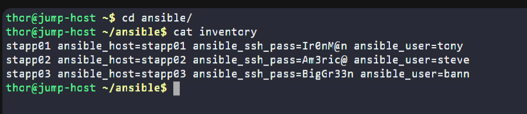
</div>

### Observation

The inventory was already configured for all three application servers.

I also noticed that each server has its own login user defined using:

```ini
ansible_user=
```

For **App Server 3**, the login user is:

```text
banner
```

This meant I could use:

```yaml
owner: "{{ ansible_user }}"
group: "{{ ansible_user }}"
```

instead of hardcoding the username.

* * *

## 3\. Checked the Existing Playbook

Before modifying the playbook, I viewed its contents.

```bash
cat playbook.yml
```

Output:

```yaml
---
- hosts:
  become: yes
  become_user: root

  roles:
    - role/httpd
```
<div style="border:1px solid #ccc; padding:10px; border-radius:10px; box-shadow:2px 2px 8px rgba(0,0,0,0.2); display:inline-block;">
  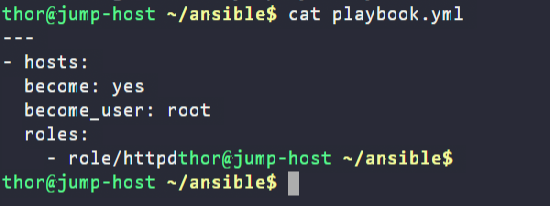
</div>

### Observation

The playbook already existed and was configured to execute the **httpd** role.

However, the **hosts** field was empty.

Since the task required running the role only on **App Server 3**, I needed to update:

```yaml
hosts: stapp03
```

* * *

## 4\. Created the Required Jinja2 Template

The task required creating a template named:

```text
/home/thor/ansible/role/httpd/templates/index.html.j2
```

I created it using:

```bash
vi /home/thor/ansible/role/httpd/templates/index.html.j2
```
<div style="border:1px solid #ccc; padding:10px; border-radius:10px; box-shadow:2px 2px 8px rgba(0,0,0,0.2); display:inline-block;">
  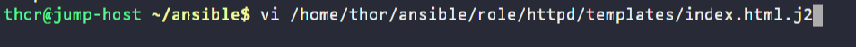
</div>

Added the following line:

```jinja2
This file was created using Ansible on {{ inventory_hostname }}
```
<div style="border:1px solid #ccc; padding:10px; border-radius:10px; box-shadow:2px 2px 8px rgba(0,0,0,0.2); display:inline-block;">
  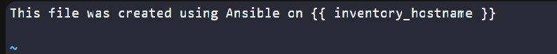
</div>

Saved the file.

* * *

## Understanding the Template

The task specifically mentioned **not to hardcode** the server name.

Instead of writing:

```text
This file was created using Ansible on stapp03
```

I used:

```jinja2
{{ inventory_hostname }}
```

`inventory_hostname` is a built-in Ansible variable that automatically resolves to the hostname of the current managed host.

For App Server 3, the rendered file becomes:

```text
This file was created using Ansible on stapp03
```

This makes the template reusable for any server in the inventory.

* * *

## 5\. Updated the Role Tasks

Next, I edited the role's task file.

```bash
vi /home/thor/ansible/role/httpd/tasks/main.yml
```

<div style="border:1px solid #ccc; padding:10px; border-radius:10px; box-shadow:2px 2px 8px rgba(0,0,0,0.2); display:inline-block;">
  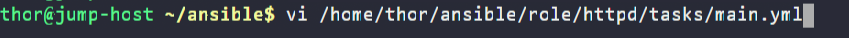
</div>

Added the following task:

```yaml
- name: copy template to server
  ansible.builtin.template:
    src: templates/index.html.j2
    dest: /var/www/html/index.html
    owner: "{{ ansible_user }}"
    group: "{{ ansible_user }}"
    mode: '0755'
```

* * *

### Final `main.yml`

```yaml
---
# tasks file for role/test

- name: install the latest version of HTTPD
  yum:
    name: httpd
    state: latest

- name: Start service httpd
  service:
    name: httpd
    state: started

- name: copy template to server
  ansible.builtin.template:
    src: templates/index.html.j2
    dest: /var/www/html/index.html
    owner: "{{ ansible_user }}"
    group: "{{ ansible_user }}"
    mode: '0755'
```
<div style="border:1px solid #ccc; padding:10px; border-radius:10px; box-shadow:2px 2px 8px rgba(0,0,0,0.2); display:inline-block;">
  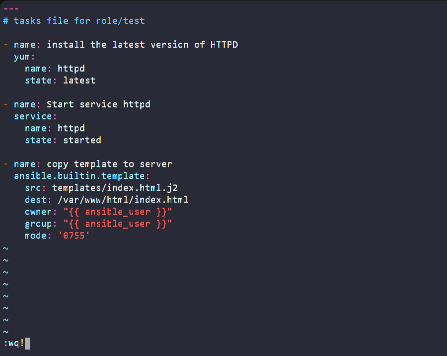
</div>

* * *

### Observation

The role already handled:

*   installing Apache
    
*   starting the Apache service
    

The only missing part was deploying the Jinja2 template.

Therefore, I only needed to append one additional task instead of modifying the existing ones.

* * *

## Understanding the Template Module

The **Template module** copies a Jinja2 template from the control node to the managed host after replacing any template variables.

In this task it:

*   reads `index.html.j2`
    
*   replaces `{{ inventory_hostname }}`
    
*   creates:
    

```text
/var/www/html/index.html
```

It also applies:

```yaml
owner: "{{ ansible_user }}"
group: "{{ ansible_user }}"
mode: "0755"
```

during deployment.

* * *

## 6\. Updated the Playbook

After completing the role, I updated the playbook.

```bash
vi playbook.yml
```
<div style="border:1px solid #ccc; padding:10px; border-radius:10px; box-shadow:2px 2px 8px rgba(0,0,0,0.2); display:inline-block;">
  
</div>

Final playbook:

```yaml
---
- hosts: stapp03
  become: yes
  become_user: root

  roles:
    - role/httpd
```
<div style="border:1px solid #ccc; padding:10px; border-radius:10px; box-shadow:2px 2px 8px rgba(0,0,0,0.2); display:inline-block;">
  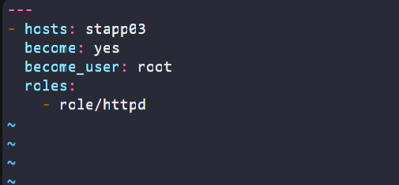
</div>

### Observation

Only one change was required.

I updated the **hosts** field so the role would execute on **App Server 3**.

* * *

## 7\. Executed the Playbook

I executed the playbook using the existing inventory.

```bash
ansible-playbook -i inventory playbook.yml
```
<div style="border:1px solid #ccc; padding:10px; border-radius:10px; box-shadow:2px 2px 8px rgba(0,0,0,0.2); display:inline-block;">
  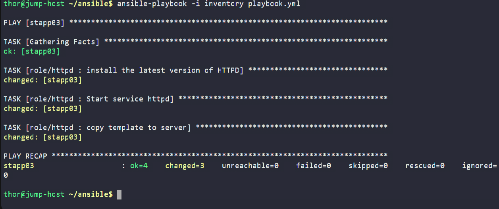
</div>

Output:

```text
PLAY [stapp03]

TASK [Gathering Facts]
ok: [stapp03]

TASK [role/httpd : install the latest version of HTTPD]
changed: [stapp03]

TASK [role/httpd : Start service httpd]
changed: [stapp03]

TASK [role/httpd : copy template to server]
changed: [stapp03]

PLAY RECAP

stapp03 : ok=4 changed=3 unreachable=0 failed=0 skipped=0 rescued=0 ignored=0
```

* * *

## 🔹 Understanding the Output

### Gathering Facts

Ansible first collected information about the managed host.

* * *

### HTTPD Installation

The existing role ensured the latest version of Apache HTTP Server was installed.

* * *

### Service Configuration

The Apache service was started successfully.

* * *

### Template Deployment

The Template module rendered:

```jinja2
{{ inventory_hostname }}
```

into:

```text
stapp03
```

and copied the generated file to:

```text
/var/www/html/index.html
```

with the required ownership and permissions.

* * *

### Play Recap

```text
ok=4
changed=3
failed=0
```

### Observation

The playbook executed successfully without any failures.

This confirmed that both the updated playbook and the modified role were configured correctly.

* * *

## 8\. Verified the Configuration

### Verified the Generated File

```bash
ansible stapp03 -i inventory -m shell -a "cat /var/www/html/index.html"
```

Output:

```text
This file was created using Ansible on stapp03
```
<div style="border:1px solid #ccc; padding:10px; border-radius:10px; box-shadow:2px 2px 8px rgba(0,0,0,0.2); display:inline-block;">
  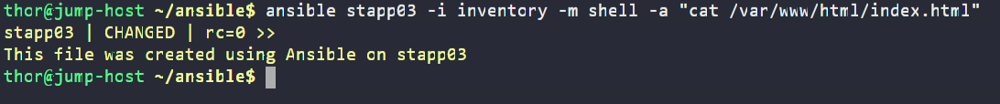
</div>

### Observation

The hostname was automatically inserted by the Jinja2 template, confirming that `inventory_hostname` was rendered correctly.

* * *

### Verified Through the Web Server

```bash
curl http://stapp03
```

Output:

```text
This file was created using Ansible on stapp03
```

<div style="border:1px solid #ccc; padding:10px; border-radius:10px; box-shadow:2px 2px 8px rgba(0,0,0,0.2); display:inline-block;">
  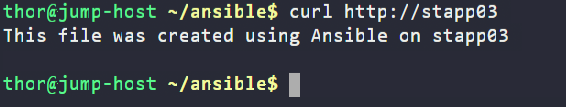
</div>

### Observation

The Apache web server was successfully serving the generated page.

* * *

### Verified Ownership and Permissions

```bash
ansible stapp03 -i inventory -m shell -a "ls -la /var/www/html/index.html"
```
<div style="border:1px solid #ccc; padding:10px; border-radius:10px; box-shadow:2px 2px 8px rgba(0,0,0,0.2); display:inline-block;">
  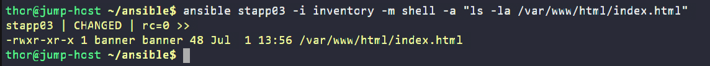
</div>

Output:

```text
-rwxr-xr-x 1 banner banner 48 Jul 1 13:56 /var/www/html/index.html
```

### Observation

The verification confirmed:

*   Owner = `banner`
    
*   Group = `banner`
    
*   Permissions = `0755`
    

This matched the task requirements because `banner` is the `ansible_user` defined for **stapp03** in the inventory.

* * *

# 🔹 Verification

✅ Updated the playbook to execute the **httpd** role on App Server 3

✅ Created the required Jinja2 template

✅ Used `inventory_hostname` instead of hardcoding the hostname

✅ Added the Template module task inside the role

✅ Deployed the template to `/var/www/html/index.html`

✅ Set the owner and group to the respective sudo user

✅ Set file permissions to `0755`

✅ Verified the generated page using `curl`

* * *

## 🔹 My Understanding

This task helped me understand how **Jinja2 templates** make Ansible roles more reusable by generating dynamic content during playbook execution. I also learned how the **Template module** deploys rendered templates while applying the required ownership and permissions.

* * *

## 🔹 What I Found Interesting

I found it interesting that a single Jinja2 template can work for multiple servers by simply using `{{ inventory_hostname }}`. This small change makes the role more flexible, reusable, and easier to maintain.

* * *

### Topics Covered

- ***Ansible***
- ***Ansible Inventory***
- ***Ansible Playbooks***
- ***Apache HTTP Server (httpd)***
- ***Ansible Roles***
- ***Jinja2 Templates***
- ***Ansible Template Module***
- ***Playbook Execution***
- ***Ansible Variables (inventory_hostname)***
- ***File Permissions and Ownership***

**Previous Task**: [ Day 91: Ansible Lineinfile Module](../Day_91/day_91.md)

**Next Task**: [Day 93: Using Ansible Conditionals ](../Day_93/day_93.md)
