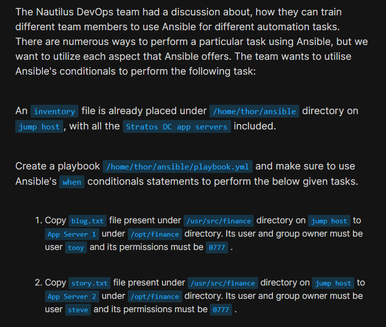
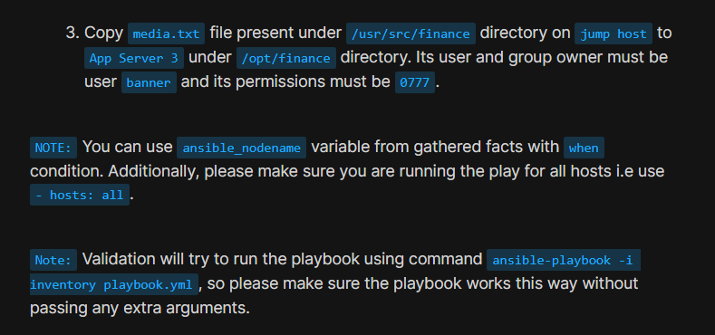
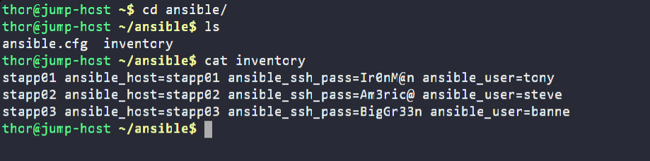
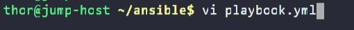
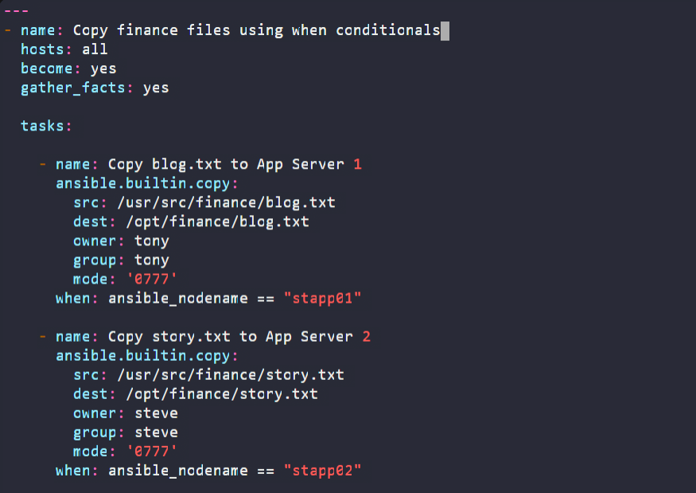
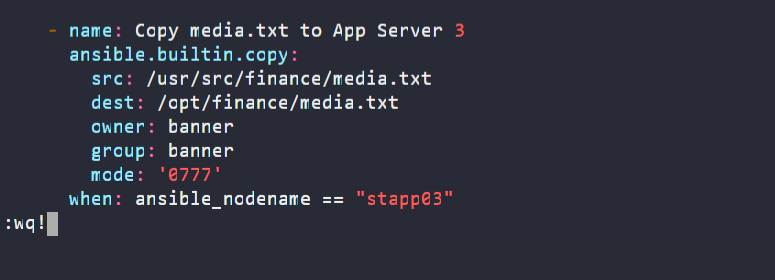
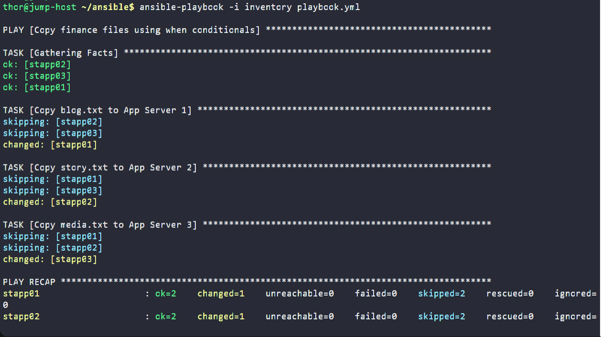
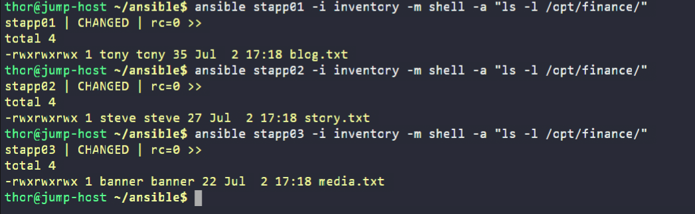

# Day 93: Using Ansible Conditionals

<div style="border:1px solid #ccc; padding:10px; border-radius:10px; box-shadow:2px 2px 8px rgba(0,0,0,0.2); display:inline-block;">
  
</div>

## Content

> Today I learned how to use **Ansible conditionals (**`when`**)** to execute different tasks on different managed hosts within a single playbook. Instead of creating separate playbooks for each server, I used the built-in `ansible_nodename` fact to determine which task should run on each host.

* * *

## 🔹 What I Learned

*   Using **Ansible** `when` **conditionals**
    
*   Understanding the `ansible_nodename` fact
    
*   Running a playbook against **all hosts**
    
*   Executing host-specific tasks within a single playbook
    
*   Using the **Copy module** to transfer files
    
*   Setting file ownership, group ownership, and permissions
    

* * *

## 🔹 Task Requirement

<div style="border:1px solid #ccc; padding:10px; border-radius:10px; box-shadow:2px 2px 8px rgba(0,0,0,0.2); display:inline-block;">
  
</div>

<div style="border:1px solid #ccc; padding:10px; border-radius:10px; box-shadow:2px 2px 8px rgba(0,0,0,0.2); display:inline-block;">
  
</div>

An inventory file was already available under:

```text
/home/thor/ansible/inventory
```

containing all three Stratos application servers.

I needed to create the following playbook:

```text
/home/thor/ansible/playbook.yml
```

using **Ansible** `when` **conditionals** to perform different tasks depending on the target server.

The requirements were:

### App Server 1

Copy:

```text
/usr/src/finance/blog.txt
```

to

```text
/opt/finance/blog.txt
```

with:

*   owner = `tony`
    
*   group = `tony`
    
*   permissions = `0777`
    

* * *

### App Server 2

Copy:

```text
/usr/src/finance/story.txt
```

to

```text
/opt/finance/story.txt
```

with:

*   owner = `steve`
    
*   group = `steve`
    
*   permissions = `0777`
    

* * *

### App Server 3

Copy:

```text
/usr/src/finance/media.txt
```

to

```text
/opt/finance/media.txt
```

with:

*   owner = `banner`
    
*   group = `banner`
    
*   permissions = `0777`
    

The playbook also had to:

*   run against **all hosts**
    
*   use `ansible_nodename` with `when`
    
*   execute successfully using:
    

```bash
ansible-playbook -i inventory playbook.yml
```

without passing any additional arguments.

* * *

# 🔹 Steps I Followed

## 1\. Navigated to the Ansible Working Directory

I first moved to the Ansible project directory.

```bash
cd ~/ansible
```

* * *

## 2\. Verified the Available Files

I checked the contents of the directory.

```bash
ls
```

Output:

```text
ansible.cfg
inventory
```

### Observation

The inventory file was already present, so only the playbook needed to be created.

* * *

## 3\. Examined the Inventory

Before writing the playbook, I verified the inventory configuration.

```bash
cat inventory
```
<div style="border:1px solid #ccc; padding:10px; border-radius:10px; box-shadow:2px 2px 8px rgba(0,0,0,0.2); display:inline-block;">
  
</div>

Output:

```ini
stapp01 ansible_host=stapp01 ansible_ssh_pass=Ir0nM@n ansible_user=tony
stapp02 ansible_host=stapp02 ansible_ssh_pass=Am3ric@ ansible_user=steve
stapp03 ansible_host=stapp03 ansible_ssh_pass=BigGr33n ansible_user=banner
```

### Observation

The inventory already contained all three application servers.

Each host had its own SSH login user:

*   `stapp01` → `tony`
    
*   `stapp02` → `steve`
    
*   `stapp03` → `banner`
    

The task, however, explicitly required assigning ownership to these users, so I specified the owner and group directly in each task.

* * *

## 4\. Created the Playbook

I created the playbook.

```bash
vi playbook.yml
```
<div style="border:1px solid #ccc; padding:10px; border-radius:10px; box-shadow:2px 2px 8px rgba(0,0,0,0.2); display:inline-block;">
  
</div>

Added the following content:

```yaml
---
- name: Copy finance files using when conditionals
  hosts: all
  become: yes
  gather_facts: yes

  tasks:

    - name: Copy blog.txt to App Server 1
      ansible.builtin.copy:
        src: /usr/src/finance/blog.txt
        dest: /opt/finance/blog.txt
        owner: tony
        group: tony
        mode: '0777'
      when: ansible_nodename == "stapp01"

    - name: Copy story.txt to App Server 2
      ansible.builtin.copy:
        src: /usr/src/finance/story.txt
        dest: /opt/finance/story.txt
        owner: steve
        group: steve
        mode: '0777'
      when: ansible_nodename == "stapp02"

    - name: Copy media.txt to App Server 3
      ansible.builtin.copy:
        src: /usr/src/finance/media.txt
        dest: /opt/finance/media.txt
        owner: banner
        group: banner
        mode: '0777'
      when: ansible_nodename == "stapp03"
```

Saved the file.

<div style="border:1px solid #ccc; padding:10px; border-radius:10px; box-shadow:2px 2px 8px rgba(0,0,0,0.2); display:inline-block;">
  
</div>

<div style="border:1px solid #ccc; padding:10px; border-radius:10px; box-shadow:2px 2px 8px rgba(0,0,0,0.2); display:inline-block;">
  
</div>

* * *

## Understanding the Playbook

The playbook runs against:

```yaml
hosts: all
```

This means every managed host participates in the play.

Instead of executing every task on every server, the `when` condition determines whether a task should run.

For example:

```yaml
when: ansible_nodename == "stapp01"
```

ensures that the task executes only on **App Server 1**.

If the current host is `stapp02` or `stapp03`, Ansible skips that task automatically.

* * *

## Understanding `ansible_nodename`

`ansible_nodename` is a fact collected during the **Gathering Facts** stage.

For each server, its value becomes:

| Server | ansible\_nodename |
| --- | --- |
| App Server 1 | `stapp01` |
| App Server 2 | `stapp02` |
| App Server 3 | `stapp03` |

Using this variable allows a single playbook to perform different operations on different hosts.

* * *

## Understanding the Copy Module

The **Copy module** transfers files from the Ansible control node to managed hosts.

For each task it:

*   copies the required file
    
*   creates the destination file
    
*   sets the owner
    
*   sets the group
    
*   applies the required permissions
    

For example:

```yaml
ansible.builtin.copy:
```

copies:

```text
/usr/src/finance/blog.txt
```

to

```text
/opt/finance/blog.txt
```

and applies:

```yaml
owner: tony
group: tony
mode: '0777'
```

during the copy operation.

* * *

## 5\. Executed the Playbook

After saving the playbook, I executed it.

```bash
ansible-playbook -i inventory playbook.yml
```
<div style="border:1px solid #ccc; padding:10px; border-radius:10px; box-shadow:2px 2px 8px rgba(0,0,0,0.2); display:inline-block;">
  
</div>

Output:

```text
PLAY [Copy finance files using when conditionals]

TASK [Gathering Facts]
ok: [stapp02]
ok: [stapp03]
ok: [stapp01]

TASK [Copy blog.txt to App Server 1]
skipping: [stapp02]
skipping: [stapp03]
changed: [stapp01]

TASK [Copy story.txt to App Server 2]
skipping: [stapp01]
skipping: [stapp03]
changed: [stapp02]

TASK [Copy media.txt to App Server 3]
skipping: [stapp01]
skipping: [stapp02]
changed: [stapp03]

PLAY RECAP

stapp01 : ok=2 changed=1 skipped=2
stapp02 : ok=2 changed=1 skipped=2
stapp03 : ok=2 changed=1 skipped=2
```

* * *

## 🔹 Understanding the Output

### Gathering Facts

Ansible first collected facts from every managed host.

These facts included `ansible_nodename`, which was later used by the `when` conditions.

* * *

### Conditional Execution

Only the matching task executed on each server.

For example:

On **stapp01**:

```text
changed: [stapp01]
```

while the other two tasks were skipped.

The same behavior occurred for the remaining servers.

This confirms that the `when` conditions worked correctly.

* * *

### Play Recap

```text
ok=2
changed=1
skipped=2
failed=0
```

for each server.

### Observation

Each server executed exactly one copy task while skipping the other two.

No failures occurred during execution.

* * *

## 6\. Verified the Configuration

<div style="border:1px solid #ccc; padding:10px; border-radius:10px; box-shadow:2px 2px 8px rgba(0,0,0,0.2); display:inline-block;">
  
</div>

### App Server 1

```bash
ansible stapp01 -i inventory -m shell -a "ls -l /opt/finance/"
```

Output:

```text
-rwxrwxrwx 1 tony tony 35 Jul 2 17:18 blog.txt
```

### Observation

Verified:

*   Owner = `tony`
    
*   Group = `tony`
    
*   Permissions = `0777`
    

* * *

### App Server 2

```bash
ansible stapp02 -i inventory -m shell -a "ls -l /opt/finance/"
```

Output:

```text
-rwxrwxrwx 1 steve steve 27 Jul 2 17:18 story.txt
```

### Observation

Verified:

*   Owner = `steve`
    
*   Group = `steve`
    
*   Permissions = `0777`
    

* * *

### App Server 3

```bash
ansible stapp03 -i inventory -m shell -a "ls -l /opt/finance/"
```

Output:

```text
-rwxrwxrwx 1 banner banner 22 Jul 2 17:18 media.txt
```

### Observation

Verified:

*   Owner = `banner`
    
*   Group = `banner`
    
*   Permissions = `0777`
    

All three servers matched the task requirements.

* * *

## 🔹 Verification

✅ Created the required playbook

✅ Executed the playbook on **all hosts**

✅ Used `when` **conditionals**

✅ Used `ansible_nodename` to identify each server

✅ Copied the correct file to each application server

✅ Set the correct owner and group

✅ Applied `0777` permissions

✅ Successfully verified all copied files

* * *

## 🔹 My Understanding

This task helped me understand how Ansible **conditionals** allow a single playbook to perform different actions on different hosts. By using `ansible_nodename` with the `when` statement, I could target specific tasks to individual servers while still running the playbook against all hosts. This approach keeps automation centralized, avoids duplicate playbooks, and makes managing host-specific operations much easier.

* * *

## 🔹 What I Found Interesting

I found it interesting that a single playbook can handle multiple servers with completely different tasks simply by using `when` conditions. Instead of maintaining separate playbooks for each host, Ansible evaluates the condition for every managed node and automatically skips tasks that do not apply. This makes playbooks cleaner, more scalable, and easier to maintain as infrastructure grows.

* * *

### Topics Covered

- ***Ansible***
- ***Ansible Inventory***
- ***Ansible Playbooks***
- ***Ansible Facts***
- ***Ansible Conditionals (when)***
- ***Ansible Copy Module***
- ***Conditional Task Execution***
- ***Ansible Variables (ansible_nodename)***
- ***Playbook Execution***
- ***File Permissions and Ownership***

**Previous Task**: [ Day 92: Managing Jinja2 Templates Using Ansible](../Day_92/day_92.md)

**Next Task**: [Day 94: Create VPC Using Terraform](../Day_94/day_94.md)
