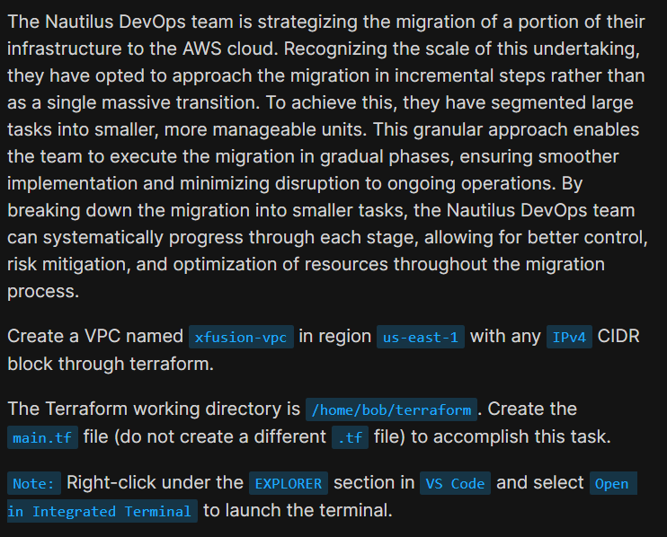
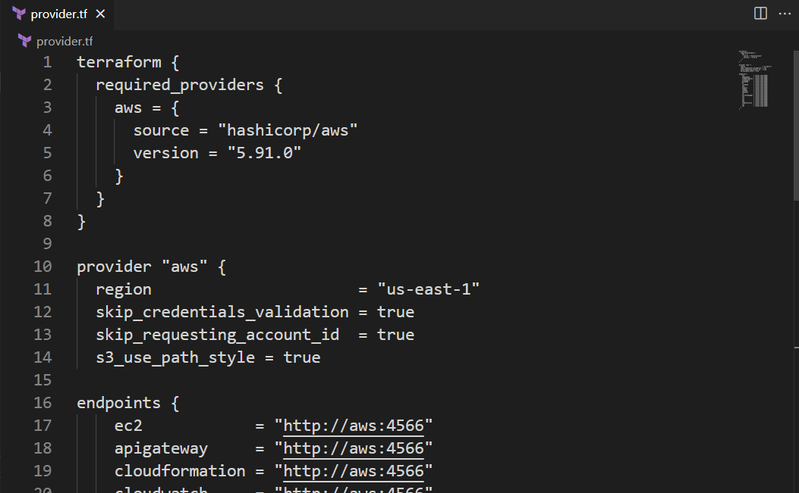
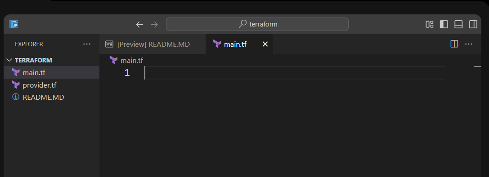
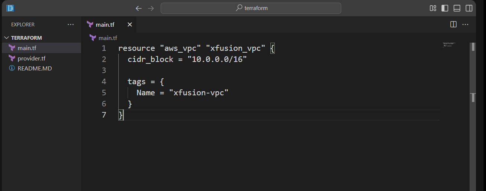
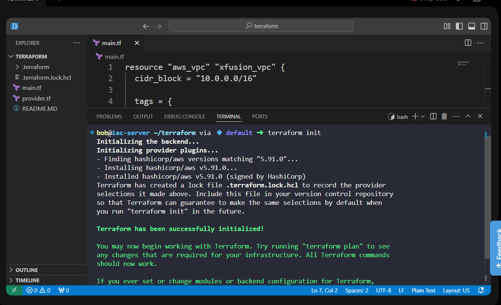
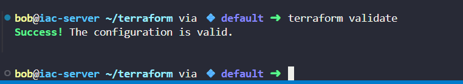
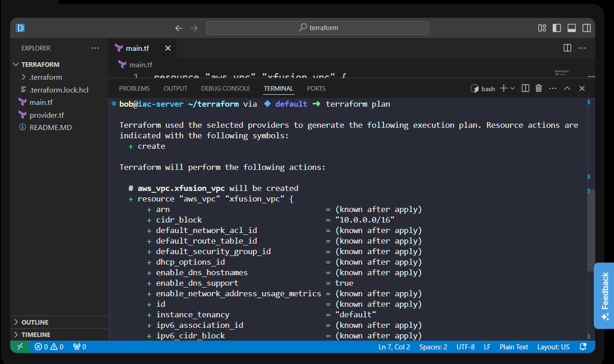
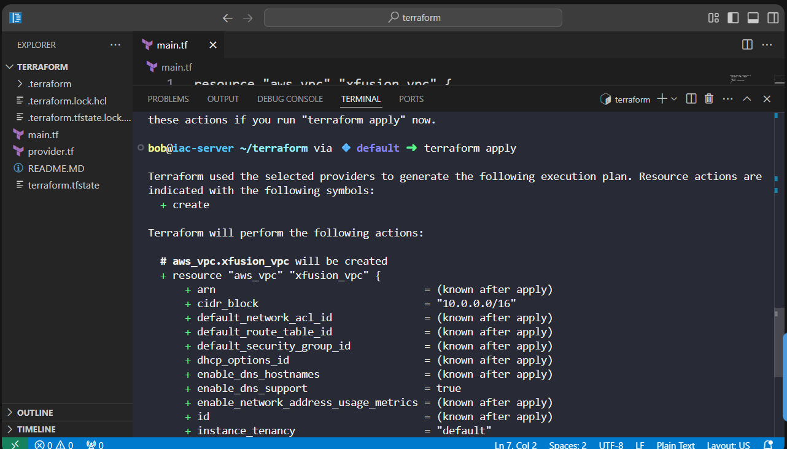
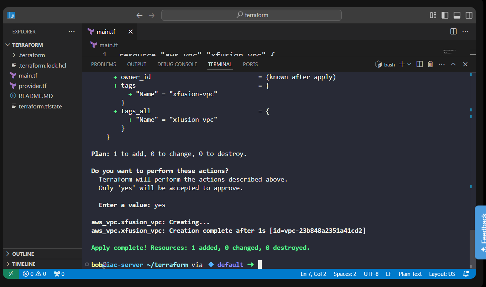

# Day 94: Create VPC Using Terraform

<div style="border:1px solid #ccc; padding:10px; border-radius:10px; box-shadow:2px 2px 8px rgba(0,0,0,0.2); display:inline-block;">
  
</div>

## Content

> Today I learned how to use **Terraform** to provision AWS infrastructure by creating a **Virtual Private Cloud (VPC)**. Instead of manually creating networking resources through the AWS Console, I defined the infrastructure as code using a simple Terraform configuration and deployed it with standard Terraform commands.

---

## 🔹 What I Learned

* Using the **AWS Terraform Provider**

* Creating an **AWS VPC** using Terraform

* Defining infrastructure as code in `main.tf`

* Using resource **tags** to assign a name

* Initializing a Terraform project with `terraform init`

* Validating Terraform configuration

* Previewing infrastructure changes with `terraform plan`

* Provisioning resources using `terraform apply`

---

## 🔹 Task Requirement

<div style="border:1px solid #ccc; padding:10px; border-radius:10px; box-shadow:2px 2px 8px rgba(0,0,0,0.2); display:inline-block;">
  
</div>

The Terraform working directory was already available at:

```text
/home/bob/terraform
```

A `provider.tf` file was already configured with:

* AWS Provider

* Region:

```text
us-east-1
```

* LocalStack endpoints

The task required creating:

```text
/home/bob/terraform/main.tf
```

to provision an AWS VPC with:

* Name:

```text
xfusion-vpc
```

* Any valid IPv4 CIDR block

The configuration also needed to execute successfully using Terraform commands.

---

# 🔹 Steps I Followed

## 1. Navigated to the Terraform Working Directory

The working directory was already opened in VS Code.

I verified that the existing provider configuration was available.

---

## 2. Reviewed the Existing Provider Configuration

The `provider.tf` file already contained the required AWS provider configuration.

<div style="border:1px solid #ccc; padding:10px; border-radius:10px; box-shadow:2px 2px 8px rgba(0,0,0,0.2); display:inline-block;">
  
</div>

```hcl
terraform {
  required_providers {
    aws = {
      source  = "hashicorp/aws"
      version = "5.91.0"
    }
  }
}

provider "aws" {
  region = "us-east-1"

  skip_credentials_validation = true
  skip_requesting_account_id  = true
  s3_use_path_style           = true

  endpoints {
    ec2 = "http://aws:4566"
    ...
  }
}
```

### Observation

The provider configuration was already complete.

The AWS region was already set to:

```text
us-east-1
```

Since the task only required creating the VPC, no modifications were needed in `provider.tf`.

---

## 3. Created the Terraform Configuration

I created the required file:

```text
main.tf
```
<div style="border:1px solid #ccc; padding:10px; border-radius:10px; box-shadow:2px 2px 8px rgba(0,0,0,0.2); display:inline-block;">
  
</div>

and added the following resource definition:

```hcl
resource "aws_vpc" "xfusion_vpc" {
  cidr_block = "10.0.0.0/16"

  tags = {
    Name = "xfusion-vpc"
  }
}
```

Saved the file.

<div style="border:1px solid #ccc; padding:10px; border-radius:10px; box-shadow:2px 2px 8px rgba(0,0,0,0.2); display:inline-block;">
  
</div>

---

## Understanding the Terraform Resource

The configuration defines a single AWS VPC resource.

```hcl
resource "aws_vpc" "xfusion_vpc"
```

where:

* `aws_vpc` is the AWS resource type.

* `xfusion_vpc` is Terraform's local resource name.

Terraform uses this block to create one Virtual Private Cloud.

---

## Understanding the CIDR Block

The VPC was assigned the IPv4 CIDR block:

```text
10.0.0.0/16
```

A `/16` network provides:

* 65,536 IP addresses

This satisfies the task requirement of using any valid IPv4 CIDR block.

---

## Understanding Resource Tags

The VPC was given a Name tag:

```hcl
tags = {
  Name = "xfusion-vpc"
}
```

Tags make AWS resources easier to identify and manage.

After deployment, the VPC appears with the name:

```text
xfusion-vpc
```

---

## 4. Initialized Terraform

I opened the integrated terminal and initialized the Terraform working directory.

```bash
terraform init
```

Output:

```text
Terraform has been successfully initialized!
```

<div style="border:1px solid #ccc; padding:10px; border-radius:10px; box-shadow:2px 2px 8px rgba(0,0,0,0.2); display:inline-block;">
  
</div>

### Observation

Terraform:

* downloaded the AWS provider

* created `.terraform.lock.hcl`

* initialized the working directory successfully

---

## 5. Validated the Configuration

Before provisioning the infrastructure, I validated the configuration.

```bash
terraform validate
```

Output:

```text
Success! The configuration is valid.
```

<div style="border:1px solid #ccc; padding:10px; border-radius:10px; box-shadow:2px 2px 8px rgba(0,0,0,0.2); display:inline-block;">
  
</div>

### Observation

Terraform confirmed that the syntax and configuration were correct.

---

## 6. Reviewed the Execution Plan

Next, I generated the execution plan.

```bash
terraform plan
```

Terraform displayed:

```text
Plan: 1 to add, 0 to change, 0 to destroy.
```
<div style="border:1px solid #ccc; padding:10px; border-radius:10px; box-shadow:2px 2px 8px rgba(0,0,0,0.2); display:inline-block;">
  
</div>

The plan showed:

* one VPC would be created

* CIDR block:

```text
10.0.0.0/16
```

* Name tag:

```text
xfusion-vpc
```

### Observation

The execution plan confirmed that only the required VPC would be created.

---

## Understanding `terraform plan`

The `terraform plan` command previews the infrastructure changes without creating any resources.

It allows verification of:

* resources to be created

* resource properties

* changes before deployment

This helps prevent unintended modifications.

---

## 7. Applied the Configuration

After verifying the plan, I deployed the infrastructure.

```bash
terraform apply
```
<div style="border:1px solid #ccc; padding:10px; border-radius:10px; box-shadow:2px 2px 8px rgba(0,0,0,0.2); display:inline-block;">
  
</div>

<div style="border:1px solid #ccc; padding:10px; border-radius:10px; box-shadow:2px 2px 8px rgba(0,0,0,0.2); display:inline-block;">
  
</div>


Terraform displayed the execution plan and requested confirmation.

I approved it by entering:

```text
yes
```

Output:

```text
aws_vpc.xfusion_vpc: Creation complete

Apply complete!
Resources: 1 added, 0 changed, 0 destroyed.
```

### Observation

Terraform successfully created the VPC.

---

## 🔹 Understanding the Output

### Initialization

Terraform initialized the working directory successfully and downloaded the required AWS provider.

---

### Validation

The configuration passed validation without any errors.

```text
Success! The configuration is valid.
```

---

### Planning

Terraform calculated the required infrastructure changes.

```text
Plan: 1 to add
```

This confirmed that exactly one resource would be created.

---

### Apply

Terraform provisioned the VPC successfully.

```text
Creation complete
```

followed by

```text
Resources: 1 added
```

No existing resources were modified or destroyed.

---

## 8. Verified the Deployment

The apply command completed successfully with:

```text
Apply complete!
Resources: 1 added, 0 changed, 0 destroyed.
```

### Observation

This confirmed that:

* the VPC was created successfully

* the Name tag was applied

* the Terraform configuration met the task requirements

---

## 🔹 Verification

✅ Used the existing AWS provider configuration

✅ Created the required `main.tf`

✅ Defined an AWS VPC resource

✅ Used a valid IPv4 CIDR block

✅ Assigned the Name tag `xfusion-vpc`

✅ Successfully initialized Terraform

✅ Validated the configuration

✅ Reviewed the execution plan

✅ Successfully created the VPC using `terraform apply`

---

## 🔹 My Understanding

This task introduced me to the basics of provisioning AWS infrastructure using Terraform. I learned that infrastructure can be defined declaratively in configuration files, allowing Terraform to automatically create resources in the desired state. By following the workflow of **init → validate → plan → apply**, I can safely deploy infrastructure while verifying every change before it is applied.

---

## 🔹 What I Found Interesting

I found it interesting that creating an AWS VPC required only a few lines of Terraform code. Terraform automatically handled the resource creation based on the configuration, and the `terraform plan` command provided a clear preview of what would happen before making any changes. This makes Infrastructure as Code reliable, repeatable, and much easier to manage than manual provisioning.

---


* * *

### Topics Covered

- ***Terraform***
- ***Terraform AWS Provider***
- ***Terraform Resources***
- ***AWS Virtual Private Cloud (VPC)***
- ***CIDR Blocks***
- ***Terraform Tags***
- ***Terraform Initialization (terraform init)***
- ***Terraform Validation (terraform validate)***
- ***Terraform Execution Plan (terraform plan)***
- ***Terraform Apply (terraform apply)***

**Previous Task**: [Day 93: Using Ansible Conditionals](../Day_93/day_93.md)

**Next Task**: [Day 95: Create Security Group Using Terraform](../Day_95/day_95.md)
