# Day 95: Create Security Group Using Terraform

<div style="border:1px solid #ccc; padding:10px; border-radius:10px; box-shadow:2px 2px 8px rgba(0,0,0,0.2); display:inline-block;">
  
</div>

## Content

> Today I learned how to use **Terraform** to create an **AWS Security Group** inside the **default VPC**. Instead of manually configuring firewall rules through the AWS Console, I defined the security group and its inbound rules as Infrastructure as Code (IaC) using Terraform. I also learned how to retrieve an existing AWS resource using a **data source** and attach new resources to it.

* * *

### 🔹 What I Learned

*   Retrieving an existing AWS resource using a **Terraform Data Source**
    
*   Creating an **AWS Security Group**
    
*   Creating multiple **Ingress Rules** using Terraform
    
*   Allowing **HTTP (80)** and **SSH (22)** access
    
*   Using the **default VPC** instead of creating a new VPC
    
*   Verifying deployed resources using `terraform state list`
    

* * *

### 🔹 Task Requirement
<div style="border:1px solid #ccc; padding:10px; border-radius:10px; box-shadow:2px 2px 8px rgba(0,0,0,0.2); display:inline-block;">
  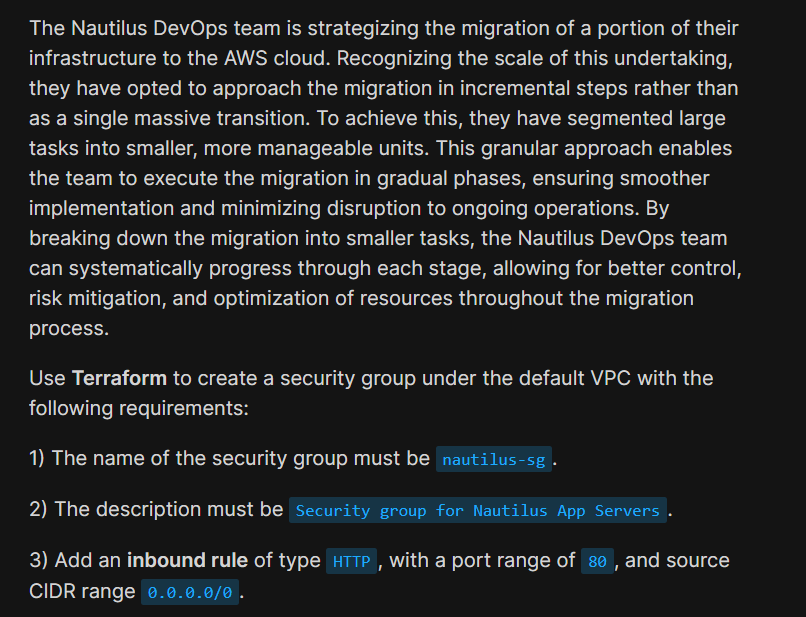
</div>
<div style="border:1px solid #ccc; padding:10px; border-radius:10px; box-shadow:2px 2px 8px rgba(0,0,0,0.2); display:inline-block;">
  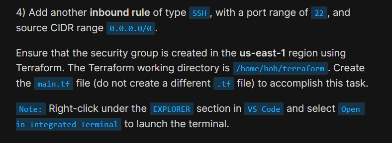
</div>

The Terraform working directory was already available at:

```text
/home/bob/terraform
```

A `provider.tf` file was already configured with:

*   AWS Provider
    
*   Region:
    

```text
us-east-1
```

*   LocalStack endpoints
    

The task required creating:

```text
/home/bob/terraform/main.tf
```

to provision an AWS Security Group with the following requirements:

*   Security Group Name:
    

```text
nautilus-sg
```

*   Description:
    

```text
Security group for Nautilus App Servers
```

*   Create the Security Group inside the **default VPC**
    
*   Add an inbound **HTTP** rule
    

```text
Port: 80
Source: 0.0.0.0/0
```

*   Add an inbound **SSH** rule
    

```text
Port: 22
Source: 0.0.0.0/0
```

The configuration also needed to execute successfully using Terraform commands.

* * *

## 🔹 Steps I Followed

### 1\. Navigated to the Terraform Working Directory

The Terraform working directory was already opened in VS Code.

I verified that the existing provider configuration was already available.

* * *

### 2\. Reviewed the Existing Provider Configuration

The `provider.tf` file already contained the required AWS provider configuration.

```hcl
terraform {
  required_providers {
    aws = {
      source  = "hashicorp/aws"
      version = "5.91.0"
    }
  }
}

provider "aws" {
  region = "us-east-1"

  skip_credentials_validation = true
  skip_requesting_account_id  = true
  s3_use_path_style           = true

  endpoints {
    ec2 = "http://aws:4566"
    ...
  }
}
```

<div style="border:1px solid #ccc; padding:10px; border-radius:10px; box-shadow:2px 2px 8px rgba(0,0,0,0.2); display:inline-block;">
  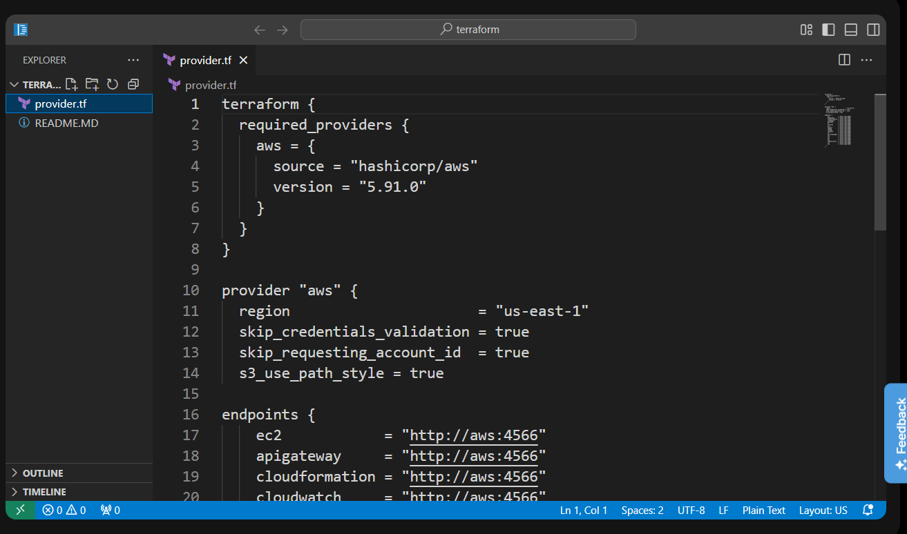
</div>

#### Observation

The provider configuration was already complete.

The AWS region was already set to:

```text
us-east-1
```

Since the task only required creating a Security Group, no modifications were needed in `provider.tf`.

* * *

### 3\. Created the Terraform Configuration

I created the required file:

```text
main.tf
```

and added the following configuration:

```hcl
# Fetch the default VPC available in the AWS region.
# The security group will be created inside this VPC.
data "aws_vpc" "default" {
  default = true
}

# Create a security group named "nautilus-sg"
# in the default VPC.
resource "aws_security_group" "nautilus_sg" {
  name        = "nautilus-sg"
  description = "Security group for Nautilus App Servers"
  vpc_id      = data.aws_vpc.default.id

  tags = {
    Name = "nautilus-sg"
  }
}

# Allow inbound HTTP (port 80)
resource "aws_vpc_security_group_ingress_rule" "http" {
  security_group_id = aws_security_group.nautilus_sg.id
  cidr_ipv4         = "0.0.0.0/0"
  from_port         = 80
  to_port           = 80
  ip_protocol       = "tcp"
}

# Allow inbound SSH (port 22)
resource "aws_vpc_security_group_ingress_rule" "ssh" {
  security_group_id = aws_security_group.nautilus_sg.id
  cidr_ipv4         = "0.0.0.0/0"
  from_port         = 22
  to_port           = 22
  ip_protocol       = "tcp"
}
```

Saved the file.

<div style="border:1px solid #ccc; padding:10px; border-radius:10px; box-shadow:2px 2px 8px rgba(0,0,0,0.2); display:inline-block;">
  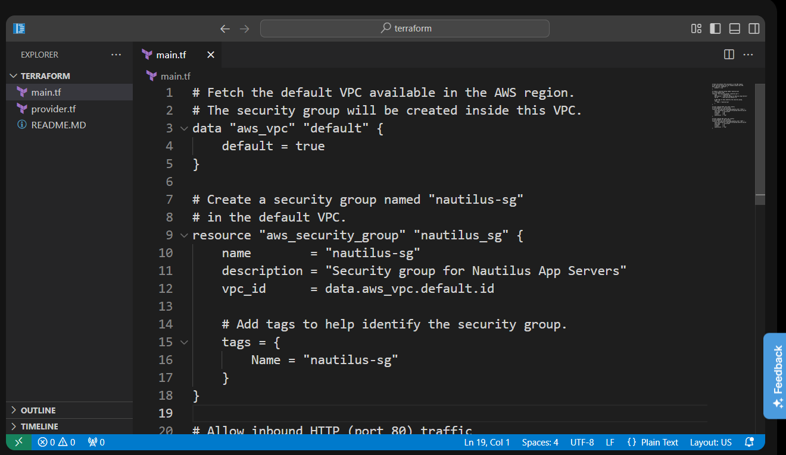
</div>
<div style="border:1px solid #ccc; padding:10px; border-radius:10px; box-shadow:2px 2px 8px rgba(0,0,0,0.2); display:inline-block;">
  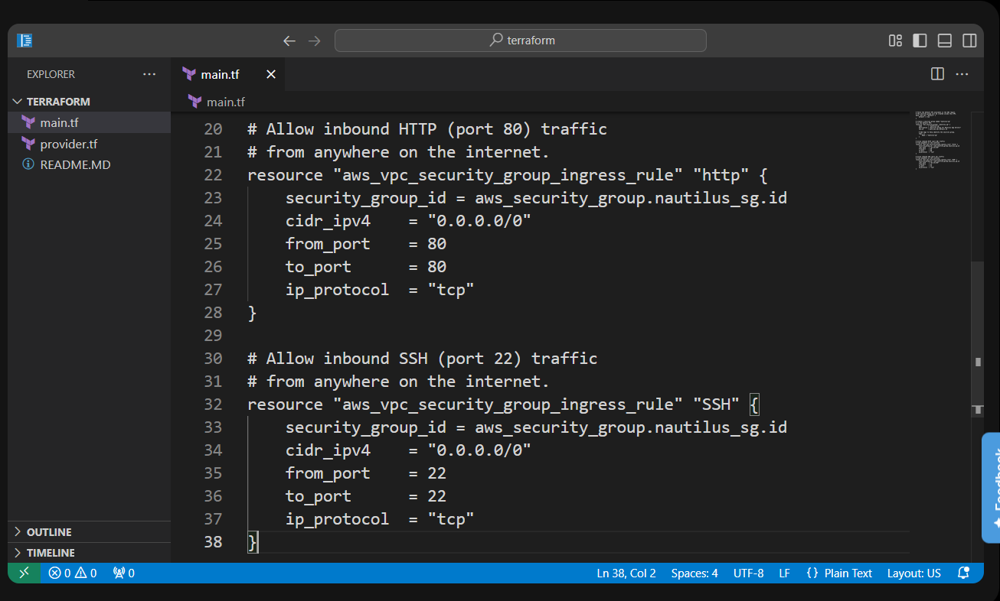
</div>

* * *

### Understanding the Terraform Data Source

The configuration first retrieves the existing default VPC.

```hcl
data "aws_vpc" "default" {
  default = true
}
```

#### What is a Data Source?

A Terraform **data source** allows Terraform to read information about an existing resource instead of creating a new one.

In this task, Terraform fetches the AWS default VPC and makes its ID available for use.

* * *

### Understanding the Security Group Resource

The following block creates the Security Group.

```hcl
resource "aws_security_group" "nautilus_sg"
```

where:

*   `aws_security_group` is the AWS resource type.
    
*   `nautilus_sg` is Terraform's local resource name.
    

The Security Group is created inside the default VPC.

```hcl
vpc_id = data.aws_vpc.default.id
```

* * *

### Understanding the Ingress Rules

Two separate ingress rule resources were created.

#### HTTP Rule

```text
Protocol : TCP
Port     : 80
Source   : 0.0.0.0/0
```

This allows inbound HTTP traffic from anywhere.

#### SSH Rule

```text
Protocol : TCP
Port     : 22
Source   : 0.0.0.0/0
```

This allows inbound SSH traffic from anywhere.

Each rule is managed independently, making the configuration cleaner and easier to maintain.

* * *

### Understanding Resource Tags

The Security Group was assigned a Name tag.

```hcl
tags = {
  Name = "nautilus-sg"
}
```

Tags help identify AWS resources more easily in the AWS Console and when managing infrastructure.

* * *

### 4\. Initialized Terraform

I opened the integrated terminal and initialized the Terraform working directory.

```bash
terraform init
```

Output:

```text
Terraform has been successfully initialized!
```

<div style="border:1px solid #ccc; padding:10px; border-radius:10px; box-shadow:2px 2px 8px rgba(0,0,0,0.2); display:inline-block;">
  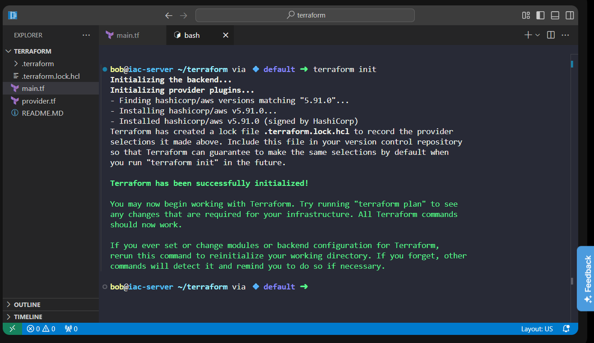
</div>

#### Observation

Terraform:

*   downloaded the AWS provider
    
*   created `.terraform.lock.hcl`
    
*   initialized the working directory successfully
    

* * *

### 5\. Validated the Configuration

Before provisioning the infrastructure, I validated the configuration.

```bash
terraform validate
```

Output:

```text
Success! The configuration is valid.
```

<div style="border:1px solid #ccc; padding:10px; border-radius:10px; box-shadow:2px 2px 8px rgba(0,0,0,0.2); display:inline-block;">
  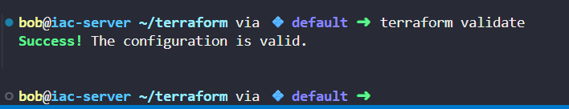
</div>

#### Observation

Terraform confirmed that the configuration syntax was correct and ready to deploy.

* * *

### 6\. Reviewed the Execution Plan

Next, I generated the execution plan.

```bash
terraform plan
```

Terraform displayed:

```text
Plan: 3 to add, 0 to change, 0 to destroy.
```
<div style="border:1px solid #ccc; padding:10px; border-radius:10px; box-shadow:2px 2px 8px rgba(0,0,0,0.2); display:inline-block;">
  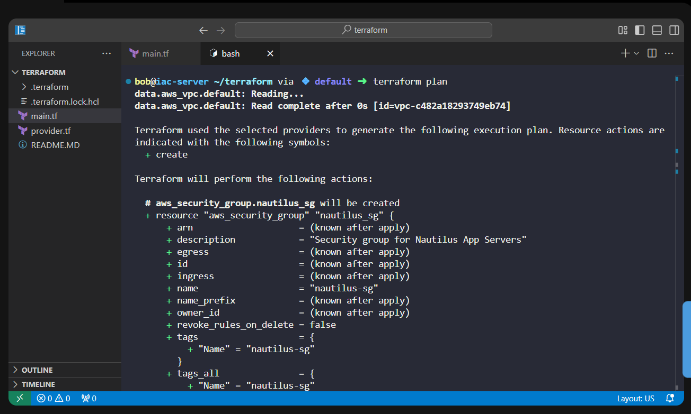
</div>
<div style="border:1px solid #ccc; padding:10px; border-radius:10px; box-shadow:2px 2px 8px rgba(0,0,0,0.2); display:inline-block;">
  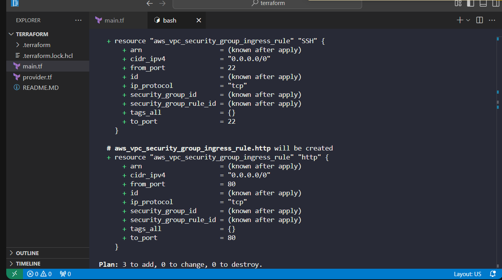
</div>

The plan showed:

*   one Security Group would be created
    
*   one HTTP ingress rule would be created
    
*   one SSH ingress rule would be created
    

### Observation

The execution plan confirmed that Terraform would create exactly the resources required by the task.

* * *

### 7\. Applied the Configuration

After verifying the execution plan, I deployed the infrastructure.

```bash
terraform apply -auto-approve
```

Output:

```text
Apply complete!
Resources: 3 added, 0 changed, 0 destroyed.
```

<div style="border:1px solid #ccc; padding:10px; border-radius:10px; box-shadow:2px 2px 8px rgba(0,0,0,0.2); display:inline-block;">
  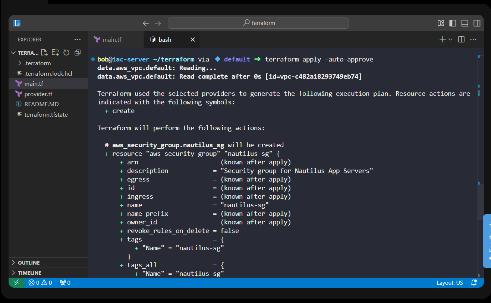
</div>
<div style="border:1px solid #ccc; padding:10px; border-radius:10px; box-shadow:2px 2px 8px rgba(0,0,0,0.2); display:inline-block;">
  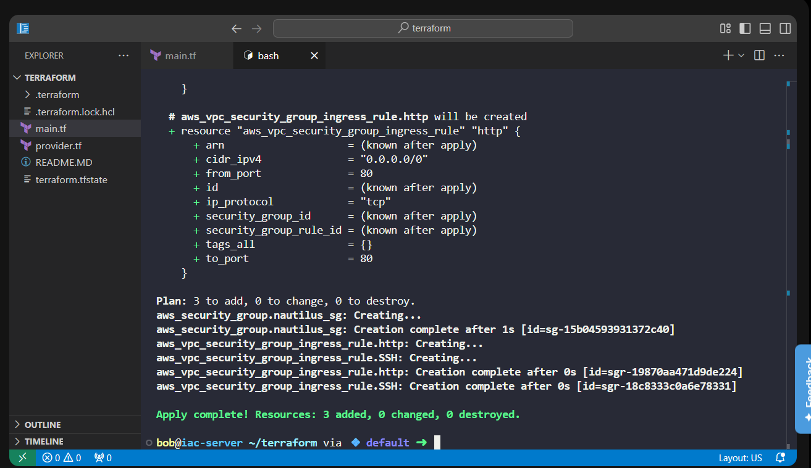
</div>

#### Observation

Terraform successfully created:

*   the Security Group
    
*   the HTTP ingress rule
    
*   the SSH ingress rule
    

* * *

### Understanding the Output

#### Initialization

Terraform initialized the working directory successfully and downloaded the required AWS provider.

* * *

#### Validation

The configuration passed validation without any errors.

```text
Success! The configuration is valid.
```

* * *

#### Planning

Terraform calculated the infrastructure changes.

```text
Plan: 3 to add
```

This confirmed that three resources would be created.


* * *

#### Apply

Terraform successfully provisioned all required resources.

```text
Resources: 3 added
```

No existing resources were modified or destroyed.

* * *

### 8\. Verified the Deployment

Finally, I verified the Terraform state.

```bash
terraform state list
```

Output:

```text
data.aws_vpc.default
aws_security_group.nautilus_sg
aws_vpc_security_group_ingress_rule.http
aws_vpc_security_group_ingress_rule.ssh
```

<div style="border:1px solid #ccc; padding:10px; border-radius:10px; box-shadow:2px 2px 8px rgba(0,0,0,0.2); display:inline-block;">
  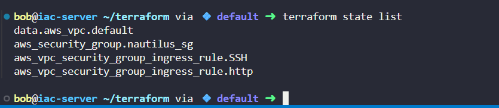
</div>

### **Reference Used**

**Terraform AWS Provider documentation for Security Group resources:**

[terraform\_docs\_security\_group](https://registry.terraform.io/providers/hashicorp/aws/latest/docs/resources/security_group.html)

### Observation

This confirmed that Terraform is now managing:

*   the default VPC data source
    
*   the Security Group
    
*   the HTTP ingress rule
    
*   the SSH ingress rule
    

* * *

### 🔹 Verification

✅ Used the existing AWS provider configuration

✅ Retrieved the default VPC using a Terraform data source

✅ Created the required `main.tf`

✅ Created an AWS Security Group

✅ Added HTTP (80) inbound rule

✅ Added SSH (22) inbound rule

✅ Assigned the Name tag `nautilus-sg`

✅ Successfully initialized Terraform

✅ Validated the configuration

✅ Reviewed the execution plan

✅ Successfully provisioned the Security Group using `terraform apply`

✅ Verified the deployed resources using `terraform state list`

* * *

### 🔹 My Understanding

This task helped me understand how Terraform can work with both **existing AWS resources** and **new infrastructure**. Instead of creating a new VPC, I used a Terraform data source to retrieve the default VPC and then attached a Security Group to it. I also learned that Terraform allows security group rules to be managed as separate resources, making the configuration modular, readable, and easier to maintain. Following the workflow of **init → validate → plan → apply → verify** ensures that infrastructure changes are predictable and reliable.

* * *

### 🔹 What I Found Interesting

I found it interesting that Terraform can reference existing cloud resources without recreating them. Using a **data source** to retrieve the default VPC and then attaching a Security Group to it demonstrates how Infrastructure as Code can integrate seamlessly with existing environments. I also liked how each ingress rule can be managed independently, making future updates simpler and reducing the risk of unintended changes.

* * *

### Topics Covered

- ***Terraform***
- ***Terraform AWS Provider***
- ***Terraform Resources***
- ***AWS Virtual Private Cloud (VPC)***
- ***CIDR Blocks***
- ***Terraform Tags***
- ***security groups***
- ***Terraform state (terraform state list)***


**Previous Task**: [Day 94: Create VPC Using Terraform](../Day_94/day_94.md)

**Next Task**: [Day 96: Create EC2 Instance Using Terraform](../Day_96/day_96.md)
