# Day 96: Create EC2 Instance Using Terraform

<div style="border:1px solid #ccc; padding:10px; border-radius:10px; box-shadow:2px 2px 8px rgba(0,0,0,0.2); display:inline-block;">
  
</div>

## Content

> Today I learned how to use **Terraform** to provision an **AWS EC2 instance** along with an **AWS Key Pair**. Instead of manually launching an EC2 instance through the AWS Console, I defined the infrastructure as code using Terraform. I also learned how Terraform can generate an RSA key locally, upload its public key to AWS, and use an existing Security Group through a **Terraform Data Source**.

---

### 🔹 What I Learned

* Creating an AWS EC2 Instance using Terraform

* Generating an RSA Key Pair using the Terraform TLS Provider

* Creating an AWS Key Pair from a generated public key

* Using an existing AWS Security Group through a Terraform Data Source

* Attaching a Key Pair and Security Group to an EC2 instance

---

### 🔹 Task Requirement
<div style="border:1px solid #ccc; padding:10px; border-radius:10px; box-shadow:2px 2px 8px rgba(0,0,0,0.2); display:inline-block;">
  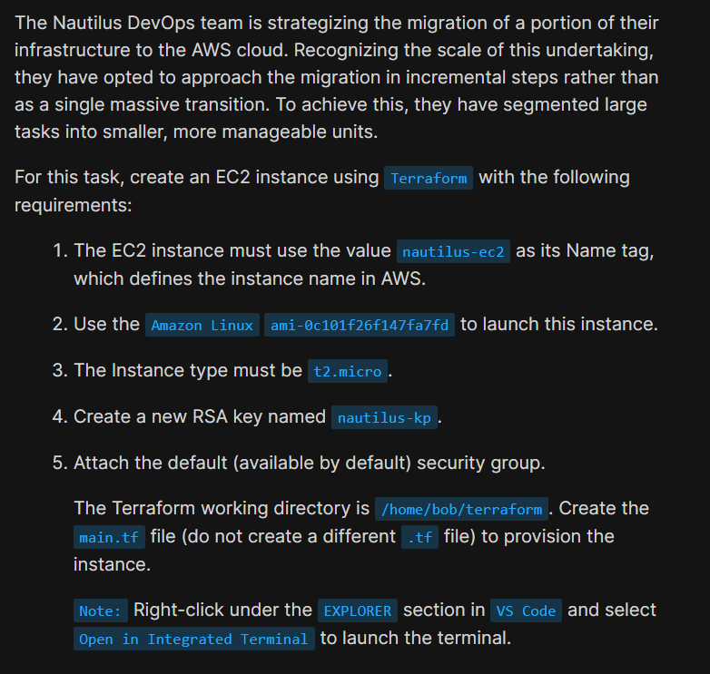
</div>

The Terraform working directory was already available at:

```text
/home/bob/terraform
```

A `provider.tf` file was already configured with:

* AWS Provider

* Region:

```text
us-east-1
```

* LocalStack endpoints

The task required creating:

```text
/home/bob/terraform/main.tf
```

to provision an EC2 instance with the following requirements:

* EC2 Name Tag

```text
nautilus-ec2
```

* Amazon Linux AMI

```text
ami-0c101f26f147fa7fd
```

* Instance Type

```text
t2.micro
```

* Create a new RSA Key Pair named

```text
nautilus-kp
```

* Attach the default Security Group

The configuration also needed to execute successfully using Terraform commands.

---

## 🔹 Steps I Followed

### 1. Navigated to the Terraform Working Directory

The Terraform working directory was already opened in VS Code.

I verified that the provider configuration was already available.

---

### 2. Reviewed the Existing Provider Configuration

The `provider.tf` file already contained the required AWS provider configuration.

```hcl
terraform {
  required_providers {
    aws = {
      source  = "hashicorp/aws"
      version = "5.91.0"
    }
  }
}

provider "aws" {
  region = "us-east-1"

  skip_credentials_validation = true
  skip_requesting_account_id  = true
  s3_use_path_style           = true

  endpoints {
    ec2 = "http://aws:4566"
    ...
  }
}
```
<div style="border:1px solid #ccc; padding:10px; border-radius:10px; box-shadow:2px 2px 8px rgba(0,0,0,0.2); display:inline-block;">
  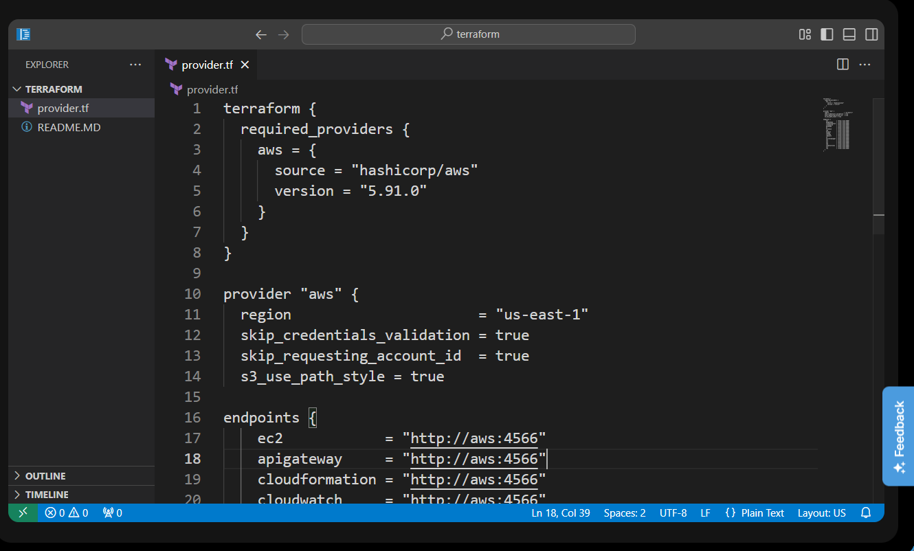
</div>

#### Observation

The provider configuration was already complete.

The AWS region was already configured as:

```text
us-east-1
```

Since the task only required provisioning an EC2 instance, no changes were needed in `provider.tf`.

---

### 3. Created the Terraform Configuration

I created the required file:

```text
main.tf
```

and added the following configuration:

```hcl
# Generate a new RSA key pair locally
resource "tls_private_key" "nautilus_key" {
  algorithm = "RSA"
  rsa_bits  = 2048
}

# Create an AWS Key Pair using the generated public key
resource "aws_key_pair" "nautilus_kp" {
  key_name   = "nautilus-kp"
  public_key = tls_private_key.nautilus_key.public_key_openssh
}

# Read the existing default Security Group
data "aws_security_group" "default" {
  name = "default"
}

# Create the EC2 instance
resource "aws_instance" "nautilus_ec2" {
  ami           = "ami-0c101f26f147fa7fd"
  instance_type = "t2.micro"

  key_name = aws_key_pair.nautilus_kp.key_name

  vpc_security_group_ids = [
    data.aws_security_group.default.id
  ]

  tags = {
    Name = "nautilus-ec2"
  }
}
```

Saved the file.

<div style="border:1px solid #ccc; padding:10px; border-radius:10px; box-shadow:2px 2px 8px rgba(0,0,0,0.2); display:inline-block;">
  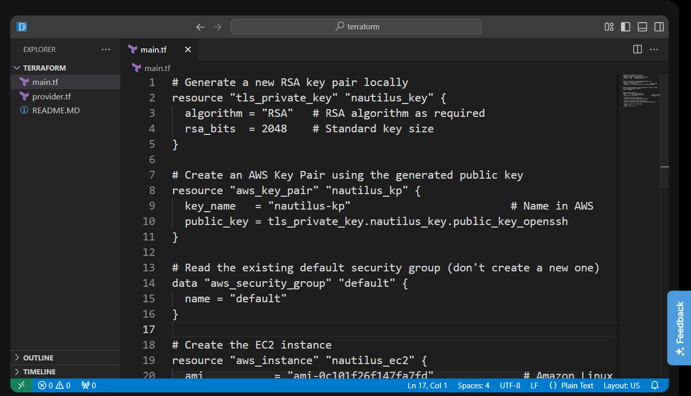
</div>
<div style="border:1px solid #ccc; padding:10px; border-radius:10px; box-shadow:2px 2px 8px rgba(0,0,0,0.2); display:inline-block;">
  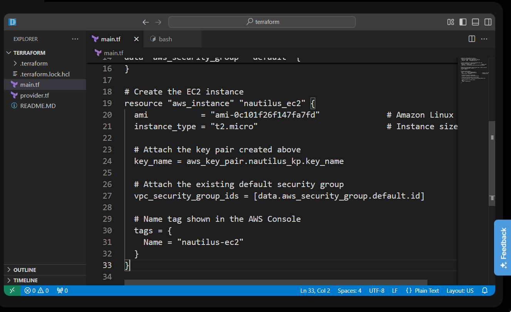
</div>

---

### Understanding the TLS Private Key Resource

The configuration first generates an RSA key pair.

```hcl
resource "tls_private_key" "nautilus_key"
```

#### What does it do?

This resource generates a new RSA public/private key pair locally.

The private key remains with Terraform, while the generated public key is later uploaded to AWS to create an AWS Key Pair.

The configuration uses:

```hcl
algorithm = "RSA"
rsa_bits  = 2048
```

to generate a standard 2048-bit RSA key.

---

### Understanding the AWS Key Pair Resource

The following block creates an AWS Key Pair.

```hcl
resource "aws_key_pair" "nautilus_kp"
```

where:

* `aws_key_pair` is the AWS resource type.

* `nautilus_kp` is Terraform's local resource name.

The generated public key is uploaded to AWS.

```hcl
public_key = tls_private_key.nautilus_key.public_key_openssh
```

This allows the EC2 instance to use the newly created Key Pair.

---

### Understanding the Security Group Data Source

The configuration retrieves the existing default Security Group.

```hcl
data "aws_security_group" "default" {
  name = "default"
}
```

#### What is a Data Source?

A Terraform **data source** allows Terraform to read an existing AWS resource rather than creating a new one.

In this task, Terraform retrieves the default Security Group so that it can be attached to the EC2 instance.

---

### Understanding the EC2 Instance Resource

The following block provisions the EC2 instance.

```hcl
resource "aws_instance" "nautilus_ec2"
```

The instance uses:

* Amazon Linux AMI

```text
ami-0c101f26f147fa7fd
```

* Instance type

```text
t2.micro
```

* The AWS Key Pair created earlier

```hcl
key_name = aws_key_pair.nautilus_kp.key_name
```

* The existing default Security Group

```hcl
vpc_security_group_ids = [
  data.aws_security_group.default.id
]
```

---

### Understanding Resource Tags

The EC2 instance was assigned a Name tag.

```hcl
tags = {
  Name = "nautilus-ec2"
}
```

Tags make AWS resources easier to identify and manage.

---

### 4. Initialized Terraform

I opened the integrated terminal and initialized the Terraform working directory.

```bash
terraform init
```

Output:

```text
Terraform has been successfully initialized!
```
<div style="border:1px solid #ccc; padding:10px; border-radius:10px; box-shadow:2px 2px 8px rgba(0,0,0,0.2); display:inline-block;">
  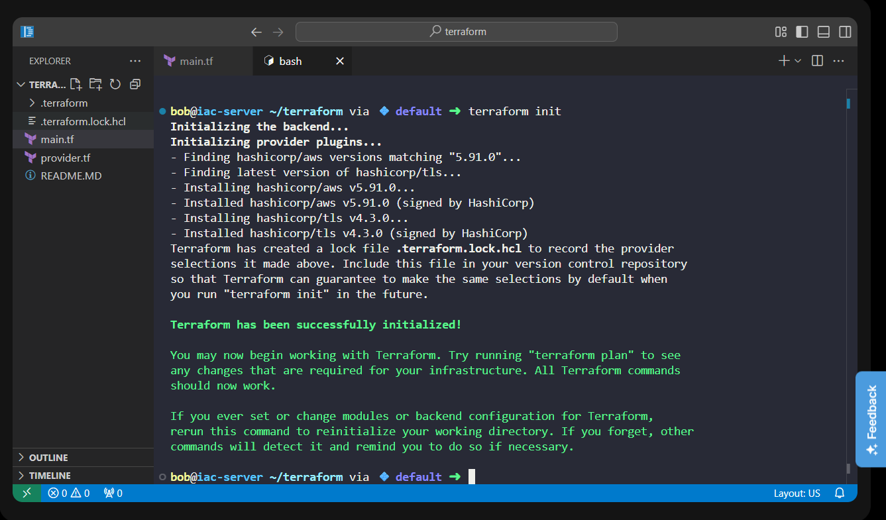
</div>

#### Observation

Terraform:

* downloaded the required AWS provider

* downloaded the TLS provider

* created `.terraform.lock.hcl`

* initialized the working directory successfully

---

### 5. Validated the Configuration

Before provisioning the infrastructure, I validated the configuration.

```bash
terraform validate
```

Output:

```text
Success! The configuration is valid.
```
<div style="border:1px solid #ccc; padding:10px; border-radius:10px; box-shadow:2px 2px 8px rgba(0,0,0,0.2); display:inline-block;">
  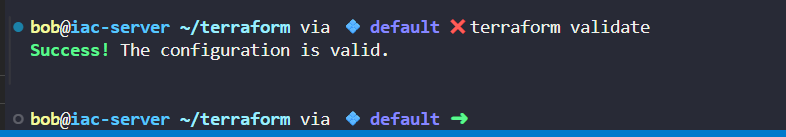
</div>

#### Observation

Terraform confirmed that the configuration syntax was correct and ready for deployment.

---

### 6. Reviewed the Execution Plan

Next, I generated the execution plan.

```bash
terraform plan
```

Terraform displayed:

```text
Plan: 3 to add, 0 to change, 0 to destroy.
```

The plan showed:

* one TLS private key would be generated

* one AWS Key Pair would be created

* one EC2 instance would be provisioned

<div style="border:1px solid #ccc; padding:10px; border-radius:10px; box-shadow:2px 2px 8px rgba(0,0,0,0.2); display:inline-block;">
  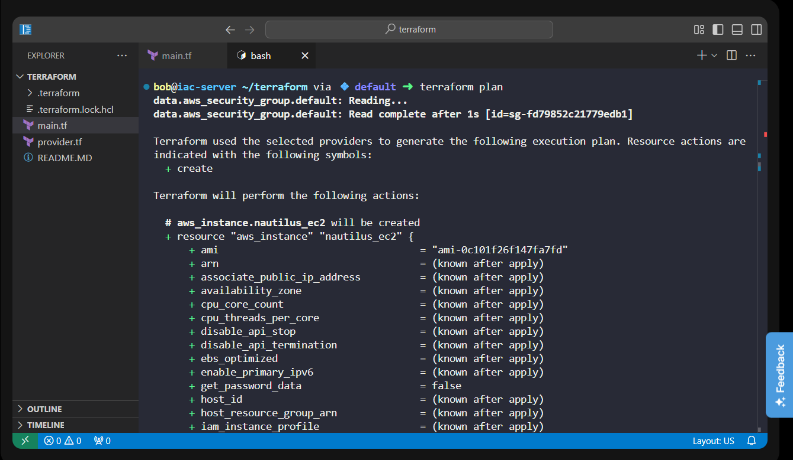
</div>
<div style="border:1px solid #ccc; padding:10px; border-radius:10px; box-shadow:2px 2px 8px rgba(0,0,0,0.2); display:inline-block;">
  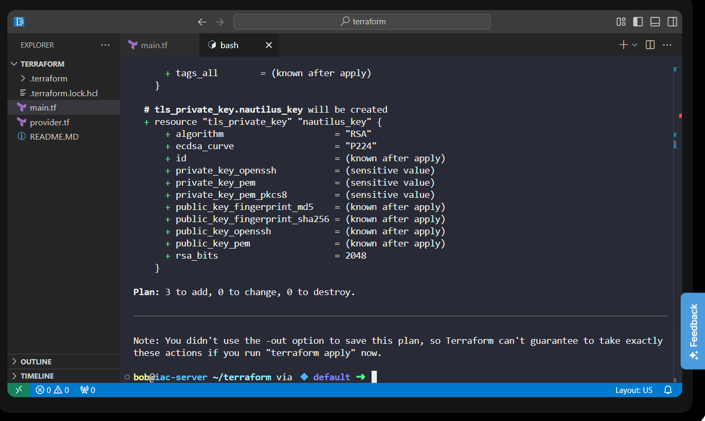
</div>

#### Observation

The execution plan confirmed that Terraform would create exactly the required resources.

---

### 7. Applied the Configuration

After reviewing the execution plan, I provisioned the infrastructure.

```bash
terraform apply -auto-approve
```

Output:

```text
Apply complete!
Resources: 3 added, 0 changed, 0 destroyed.
```

<div style="border:1px solid #ccc; padding:10px; border-radius:10px; box-shadow:2px 2px 8px rgba(0,0,0,0.2); display:inline-block;">
  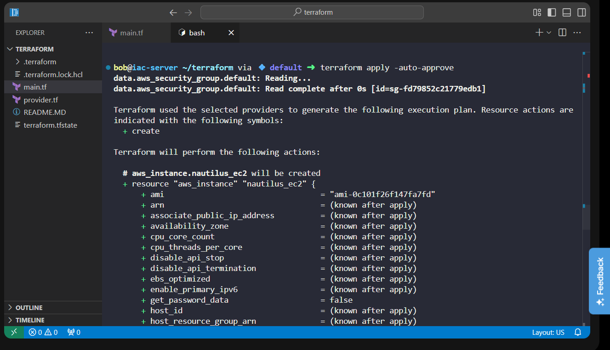
</div>
<div style="border:1px solid #ccc; padding:10px; border-radius:10px; box-shadow:2px 2px 8px rgba(0,0,0,0.2); display:inline-block;">
  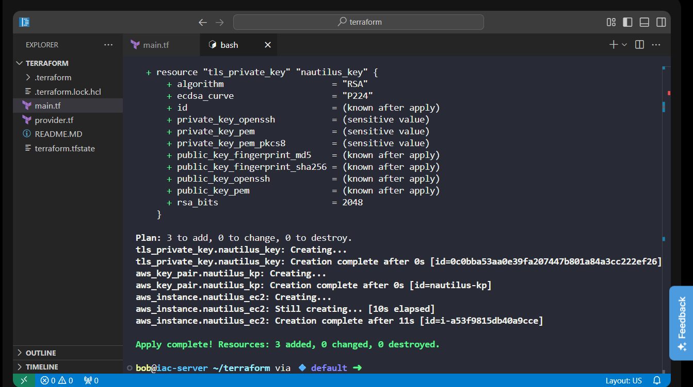
</div>

#### Observation

Terraform successfully:

* generated the RSA Key Pair

* created the AWS Key Pair

* launched the EC2 instance

---

### Understanding the Output

#### Initialization

Terraform initialized the working directory and downloaded the required providers.

---

#### Validation

Terraform confirmed the configuration was valid.

```text
Success! The configuration is valid.
```

---

#### Planning

Terraform calculated the required infrastructure changes.

```text
Plan: 3 to add
```

This confirmed that three resources would be created.

---

#### Apply

Terraform successfully provisioned all required resources.

```text
Resources: 3 added
```

No existing resources were modified or destroyed.

---

### 8. Verified the Deployment

Finally, I verified the Terraform state.

```bash
terraform state list
```

Output:

```text
data.aws_security_group.default
aws_instance.nautilus_ec2
aws_key_pair.nautilus_kp
tls_private_key.nautilus_key
```

<div style="border:1px solid #ccc; padding:10px; border-radius:10px; box-shadow:2px 2px 8px rgba(0,0,0,0.2); display:inline-block;">
  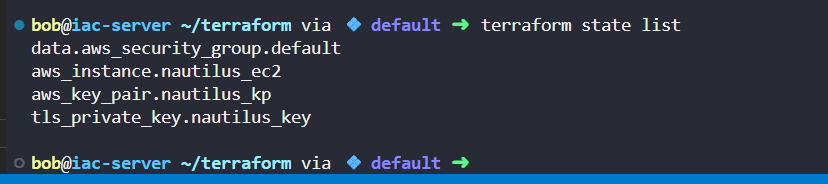
</div>

### **References Used**

**Terraform TLS Provider Documentation**

[https://registry.terraform.io/providers/hashicorp/tls/latest/docs/resources/private_key](https://registry.terraform.io/providers/hashicorp/tls/latest/docs/resources/private_key)

**Terraform AWS Provider - Key Pair**

[https://registry.terraform.io/providers/hashicorp/aws/latest/docs/resources/key_pair](https://registry.terraform.io/providers/hashicorp/aws/latest/docs/resources/key_pair)

**Terraform AWS EC2 Example**

[https://github.com/terraform-aws-modules/terraform-aws-ec2-instance/blob/master/examples/complete/main.tf](https://github.com/terraform-aws-modules/terraform-aws-ec2-instance/blob/master/examples/complete/main.tf)

#### Observation

This confirmed that Terraform is now managing:

* the default Security Group data source

* the generated TLS private key

* the AWS Key Pair

* the EC2 instance

---

### 🔹 Verification

✅ Used the existing AWS provider configuration

✅ Generated an RSA Key Pair using Terraform

✅ Created an AWS Key Pair named `nautilus-kp`

✅ Retrieved the existing default Security Group

✅ Created the required `main.tf`

✅ Provisioned an EC2 instance using the specified AMI

✅ Configured the instance type as `t2.micro`

✅ Assigned the Name tag `nautilus-ec2`

✅ Successfully provisioned the infrastructure using `terraform apply`

✅ Verified the deployed resources using `terraform state list`

---

### 🔹 My Understanding

I learned that Terraform can generate an RSA key locally, use its public key to create an AWS Key Pair, retrieve an existing Security Group using a data source, and combine all of these components to launch an EC2 instance. Following the workflow of **init → validate → plan → apply → verify** makes infrastructure deployments predictable, repeatable, and reliable.

---

### 🔹 What I Found Interesting

I found it interesting that Terraform can generate cryptographic keys without relying on external tools like `ssh-keygen`. The way Terraform automatically links resources together—using the generated public key to create an AWS Key Pair and then attaching that Key Pair and an existing Security Group to an EC2 instance—demonstrates the power of Infrastructure as Code. It makes provisioning cloud infrastructure both automated and reproducible.

---
* * *

### Topics Covered

- ***Terraform***
- ***Terraform AWS Provider***
- ***Terraform Resources***
- ***ec2-instance***
- ***data source***
- ***Terraform Tags***
- ***key pairs***
- ***RSA***


**Previous Task**: [Day 95: Create Security Group Using Terraform](../Day_95/day_95.md)

**Next Task**: [Day 97: Create IAM Policy Using Terraform](../Day_97/day_97.md)
