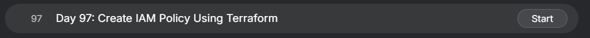
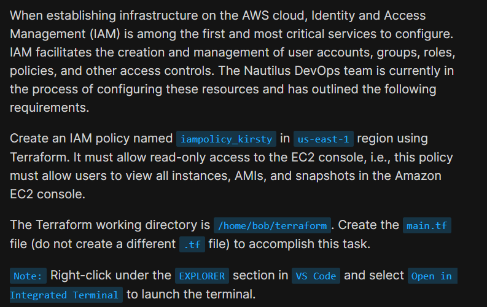
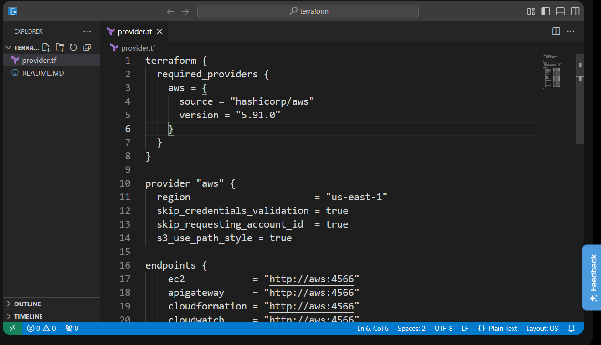
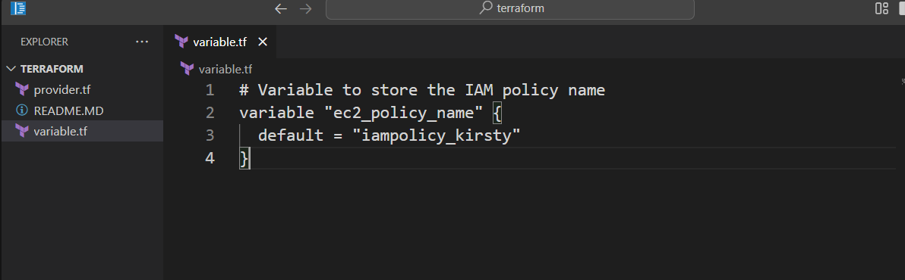
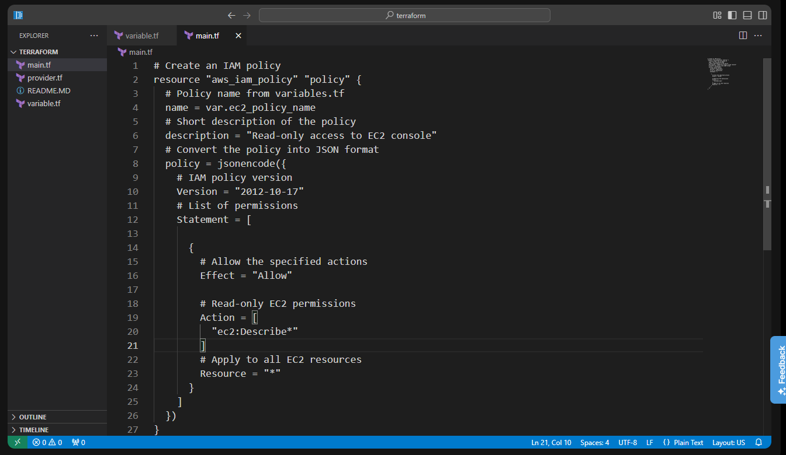
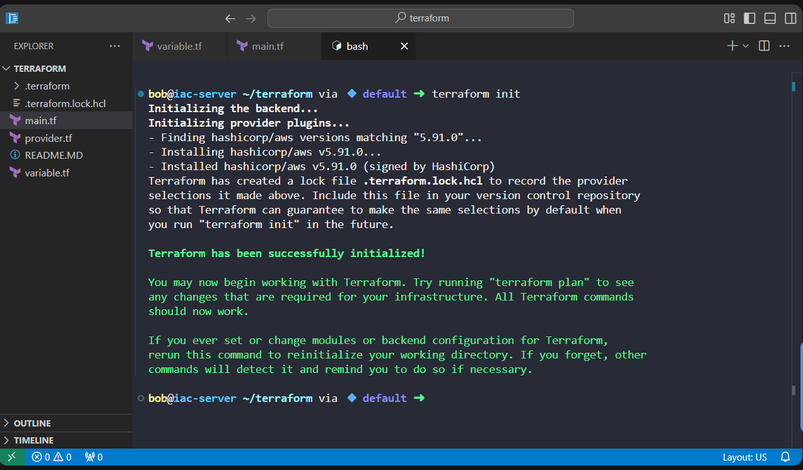
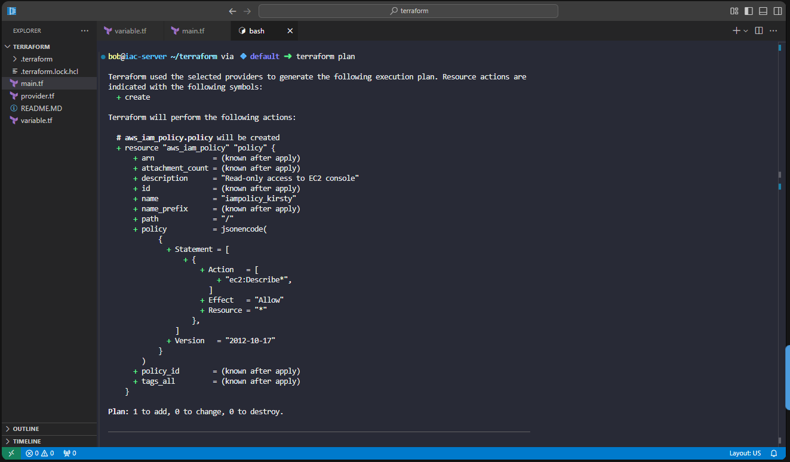
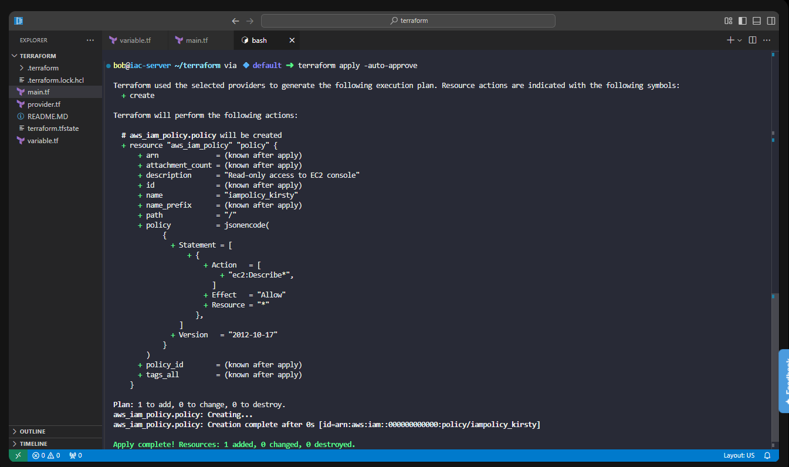
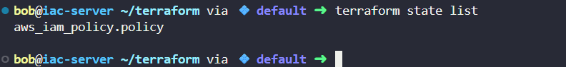

# Day 97: Create IAM Policy Using Terraform

<div style="border:1px solid #ccc; padding:10px; border-radius:10px; box-shadow:2px 2px 8px rgba(0,0,0,0.2); display:inline-block;">
  
</div>

## Content

> Today I learned how to create an **AWS IAM Policy** using **Terraform**. Instead of manually creating the policy through the AWS Console, I defined it as code using Terraform. I also learned how IAM policies are structured using **Version**, **Statement**, **Effect**, **Action**, and **Resource**, and how Terraform's `jsonencode()` function converts HCL into the JSON format required by AWS.

* * *

## 🔹 What I Learned

*   Creating an AWS IAM Policy using Terraform
    
*   Using Terraform variables to make configurations reusable
    
*   Writing IAM policies using `jsonencode()`
    
*   Understanding the components of an IAM Policy
    
*   Granting read-only access to Amazon EC2 using `ec2:Describe*`
    

* * *

## 🔹 Task Requirement
<div style="border:1px solid #ccc; padding:10px; border-radius:10px; box-shadow:2px 2px 8px rgba(0,0,0,0.2); display:inline-block;">
  
</div>

The Terraform working directory was already available at:

```text
/home/bob/terraform
```

A `provider.tf` file was already configured with:

*   AWS Provider
    
*   Region
    

```text
us-east-1
```

*   LocalStack endpoints
    

The task required creating:

```text
/home/bob/terraform/main.tf
```

to provision an IAM Policy with the following requirements:

*   Policy Name
    

```text
iampolicy_kirsty
```

*   Region
    

```text
us-east-1
```

*   Allow users to view EC2 resources including:
    
    *   Instances
        
    *   AMIs
        
    *   Snapshots
        

The policy needed to provide **read-only access** to the Amazon EC2 console.

* * *

# 🔹 Steps I Followed

## 1\. Navigated to the Terraform Working Directory

The Terraform working directory was already opened in VS Code.

I verified that the provider configuration was already available.

* * *

## 2\. Reviewed the Existing Provider Configuration

The `provider.tf` file already contained the required AWS provider configuration.

<div style="border:1px solid #ccc; padding:10px; border-radius:10px; box-shadow:2px 2px 8px rgba(0,0,0,0.2); display:inline-block;">
  
</div>

```hcl
terraform {
  required_providers {
    aws = {
      source  = "hashicorp/aws"
      version = "5.91.0"
    }
  }
}

provider "aws" {
  region = "us-east-1"

  skip_credentials_validation = true
  skip_requesting_account_id  = true
  s3_use_path_style           = true

  endpoints {
    iam = "http://aws:4566"
    ...
  }
}
```

### Observation

The provider configuration was already complete.

The AWS region was already configured as:

```text
us-east-1
```

Since the task only required creating an IAM policy, no changes were needed in `provider.tf`.

* * *

## 3\. Created a Variable

To avoid hardcoding the policy name, I created a variable in:

```text
variables.tf
```

```hcl
# Variable to store the IAM policy name
variable "ec2_policy_name" {
  default = "iampolicy_kirsty"
}
```

<div style="border:1px solid #ccc; padding:10px; border-radius:10px; box-shadow:2px 2px 8px rgba(0,0,0,0.2); display:inline-block;">
  
</div>

### Observation

Using variables makes the configuration easier to reuse. If the policy name changes later, only the variable value needs to be updated.

* * *

## 4\. Created the Terraform Configuration

I created the required file:

```text
main.tf
```

and added the following configuration:

```hcl
# Create an IAM policy
resource "aws_iam_policy" "policy" {

  # Policy name from variables.tf
  name = var.ec2_policy_name

  # Short description of the policy
  description = "Read-only access to EC2 console"

  # Convert the policy into JSON format
  policy = jsonencode({

    # IAM policy version
    Version = "2012-10-17"

    # List of permissions
    Statement = [

      {
        # Allow the specified actions
        Effect = "Allow"

        # Read-only EC2 permissions
        Action = [
          "ec2:Describe*"
        ]

        # Apply to all EC2 resources
        Resource = "*"
      }
    ]
  })
}
```

Saved the file.

<div style="border:1px solid #ccc; padding:10px; border-radius:10px; box-shadow:2px 2px 8px rgba(0,0,0,0.2); display:inline-block;">
  
</div>

* * *

## Understanding the Variable

The policy name is stored in a variable.

```hcl
variable "ec2_policy_name"
```

Instead of writing:

```hcl
name = "iampolicy_kirsty"
```

the configuration uses:

```hcl
name = var.ec2_policy_name
```

This makes the configuration reusable because only the variable value needs to be changed if a different policy name is required.

* * *

## Understanding the IAM Policy Resource

The following block creates an IAM Policy.

```hcl
resource "aws_iam_policy" "policy"
```

where:

*   `aws_iam_policy` is the AWS resource type.
    
*   `policy` is Terraform's local resource name.
    

The actual AWS policy name is defined by:

```hcl
name = var.ec2_policy_name
```

* * *

## Understanding `jsonencode()`

AWS expects IAM policies in **JSON** format.

Instead of writing raw JSON manually, Terraform allows the policy to be written using HCL.

```hcl
policy = jsonencode({...})
```

The `jsonencode()` function automatically converts the Terraform object into valid JSON before sending it to AWS.

* * *

## Understanding the IAM Policy Structure

Every IAM policy contains a version and one or more statements.

```hcl
Version = "2012-10-17"
```

This is the standard IAM policy language version used by AWS.

The permissions are defined inside:

```hcl
Statement = [
  ...
]
```

Each statement specifies:

*   Effect
    
*   Action
    
*   Resource
    

* * *

## Understanding Effect

```hcl
Effect = "Allow"
```

The **Effect** determines whether the listed actions are permitted or denied.

In this task:

```text
Allow
```

grants permission to perform the specified EC2 actions.

* * *

## Understanding Action

The policy grants:

```hcl
Action = [
  "ec2:Describe*"
]
```

The wildcard (`*`) includes every EC2 action that starts with **Describe**, such as:

*   DescribeInstances
    
*   DescribeImages
    
*   DescribeSnapshots
    
*   DescribeVolumes
    

These are read-only operations, allowing users to view EC2 resources without modifying them.

* * *

## Understanding Resource

The policy applies to:

```hcl
Resource = "*"
```

This means the permissions apply to all EC2 resources.

For most EC2 `Describe` actions, AWS requires:

```text
Resource = "*"
```

* * *

## 5\. Initialized Terraform

I opened the integrated terminal and initialized the Terraform working directory.

```bash
terraform init
```

Output:

```text
Terraform has been successfully initialized!
```
<div style="border:1px solid #ccc; padding:10px; border-radius:10px; box-shadow:2px 2px 8px rgba(0,0,0,0.2); display:inline-block;">
  
</div>

### Observation

Terraform:

*   downloaded the required AWS provider
    
*   created `.terraform.lock.hcl`
    
*   initialized the working directory successfully
    

* * *

## 6\. Reviewed the Execution Plan

Next, I generated the execution plan.

```bash
terraform plan
```

Terraform displayed:

```text
Plan: 1 to add, 0 to change, 0 to destroy.
```
<div style="border:1px solid #ccc; padding:10px; border-radius:10px; box-shadow:2px 2px 8px rgba(0,0,0,0.2); display:inline-block;">
  
</div>

The execution plan showed:

*   one IAM Policy would be created
    
*   the policy name would be `iampolicy_kirsty`
    
*   the policy would grant `ec2:Describe*` permissions
    

### Observation

The execution plan confirmed that Terraform would create exactly one IAM Policy with the required permissions.

* * *

## 7\. Applied the Configuration

After reviewing the execution plan, I provisioned the infrastructure.

```bash
terraform apply -auto-approve
```

Output:

```text
Apply complete!
Resources: 1 added, 0 changed, 0 destroyed.
```
<div style="border:1px solid #ccc; padding:10px; border-radius:10px; box-shadow:2px 2px 8px rgba(0,0,0,0.2); display:inline-block;">
  
</div>

### Observation

Terraform successfully created the IAM Policy.

* * *

## Understanding the Output

### Initialization

Terraform initialized the working directory and downloaded the required provider.

* * *

### Planning

Terraform calculated the infrastructure changes.

```text
Plan: 1 to add
```

This confirmed that one IAM Policy would be created.

* * *

### Apply

Terraform successfully provisioned the IAM Policy.

```text
Resources: 1 added
```

No existing resources were modified or destroyed.

* * *

## 8\. Verified the Deployment

Finally, I verified the Terraform state.

```bash
terraform state list
```

Output:

```text
aws_iam_policy.policy
```
<div style="border:1px solid #ccc; padding:10px; border-radius:10px; box-shadow:2px 2px 8px rgba(0,0,0,0.2); display:inline-block;">
  
</div>

### Observation

This confirmed that Terraform is now managing the IAM Policy.

* * *

## **References Used**

**Terraform AWS IAM Policy Resource**

[https://registry.terraform.io/providers/hashicorp/aws/latest/docs/resources/iam\_policy](https://registry.terraform.io/providers/hashicorp/aws/latest/docs/resources/iam_policy)

**AWS EC2 IAM Actions Reference**

[https://docs.aws.amazon.com/service-authorization/latest/reference/list\_amazonec2.html](https://docs.aws.amazon.com/service-authorization/latest/reference/list_amazonec2.html)

* * *

## 🔹 Verification

✅ Used the existing AWS provider configuration

✅ Created the required `main.tf`

✅ Used a Terraform variable for the IAM policy name

✅ Created an IAM Policy named `iampolicy_kirsty`

✅ Granted read-only EC2 permissions using `ec2:Describe*`

✅ Successfully provisioned the IAM Policy using `terraform apply`

✅ Verified the deployed resource using `terraform state list`

* * *

## 🔹 My Understanding

I learned that an IAM Policy defines what actions are allowed or denied on AWS resources. Using Terraform, I can define the entire policy as code, making it version-controlled and reusable. I also learned that `jsonencode()` simplifies writing IAM policies by converting Terraform syntax into the JSON format required by AWS. Following the workflow of **init → plan → apply → verify** makes infrastructure deployments predictable and repeatable.

* * *

## 🔹 What I Found Interesting

I found it interesting that a single permission like `ec2:Describe*` grants read-only access to many EC2 resources, including instances, AMIs, snapshots, and volumes. I also liked how Terraform's `jsonencode()` function removes the need to manually write JSON, making IAM policies cleaner and easier to maintain.

* * *

### Topics Covered

- ***Terraform***
- ***Terraform AWS Provider***
- ***Terraform Resources***
- ***AWS Identity and Access Management (IAM)***
- ***IAM Policies***
- ***Terraform Variables***
- ***jsonencode() Function***
- ***EC2 IAM Permissions (ec2:Describe*)***


**Previous Task**: [Day 96: Create EC2 Instance Using Terraform](../Day_96/day_96.md)

**Next Task**: [Day 98: Launch EC2 in Private VPC Subnet Using Terraform ](../Day_98/day_98.md)
