# Day 98: Launch EC2 in Private VPC Subnet Using Terraform

<div style="border:1px solid #ccc; padding:10px; border-radius:10px; box-shadow:2px 2px 8px rgba(0,0,0,0.2); display:inline-block;">
  
</div>

## Content

> Today I learned how to provision a **private AWS VPC**, **private subnet**, **Security Group**, and an **EC2 instance** using Terraform. Instead of manually creating the resources in AWS, I defined the complete infrastructure as code. I also learned how Terraform automatically creates resources in the correct order using resource dependencies.

---

## 🔹 What I Learned

* Creating an AWS VPC using Terraform
* Creating a private subnet inside a VPC
* Creating Security Groups using the latest Terraform resources
* Launching an EC2 instance inside a private subnet
* Using variables and outputs for reusable Terraform configurations

---

## 🔹 Task Requirement

<div style="border:1px solid #ccc; padding:10px; border-radius:10px; box-shadow:2px 2px 8px rgba(0,0,0,0.2); display:inline-block;">
  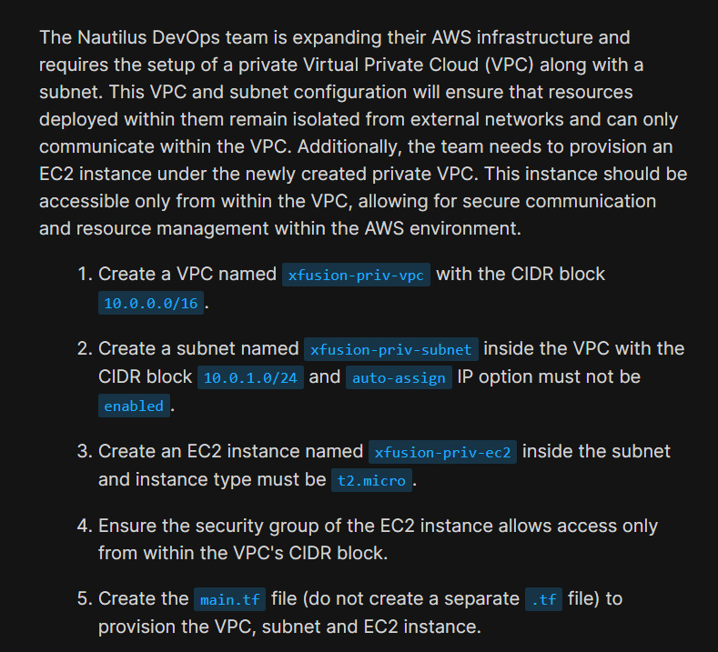
</div>

<div style="border:1px solid #ccc; padding:10px; border-radius:10px; box-shadow:2px 2px 8px rgba(0,0,0,0.2); display:inline-block;">
  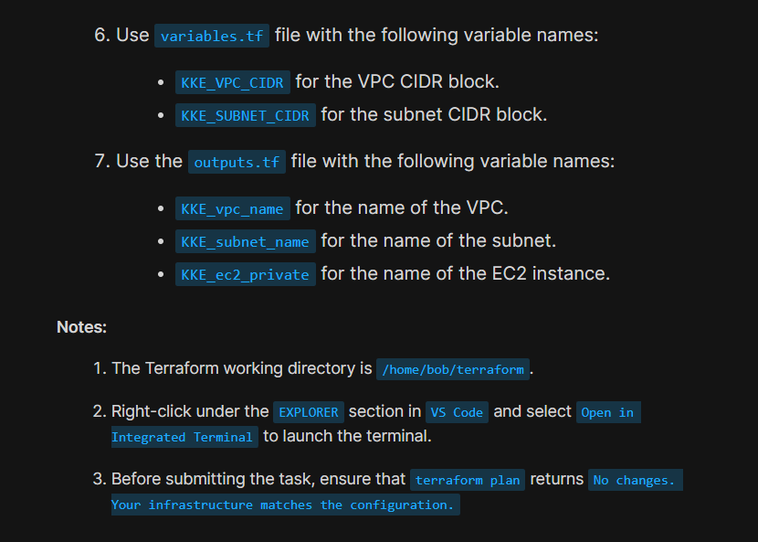
</div>

The Terraform working directory was already available at:

```text
/home/bob/terraform
```

A `provider.tf` file was already configured with:

* AWS Provider
* Region

```text
us-east-1
```

* LocalStack endpoints

The task required creating the following Terraform files:

```text
variables.tf
main.tf
outputs.tf
```

The infrastructure needed to provision:

* VPC

```text
xfusion-priv-vpc
```

* CIDR Block

```text
10.0.0.0/16
```

* Private Subnet

```text
xfusion-priv-subnet
```

* CIDR Block

```text
10.0.1.0/24
```

* Disable auto public IP assignment

* EC2 Instance

```text
xfusion-priv-ec2
```

* Instance Type

```text
t2.micro
```

* Security Group allowing traffic only from within the VPC CIDR.

---

# 🔹 Steps I Followed

## 1. Navigated to the Terraform Working Directory

The Terraform working directory was already opened in VS Code.

I verified that the provider configuration was already available.

---

## 2. Reviewed the Existing Provider Configuration

The `provider.tf` file already contained the required AWS provider configuration.

Since the provider was already configured, no changes were required.

<div style="border:1px solid #ccc; padding:10px; border-radius:10px; box-shadow:2px 2px 8px rgba(0,0,0,0.2); display:inline-block;">
  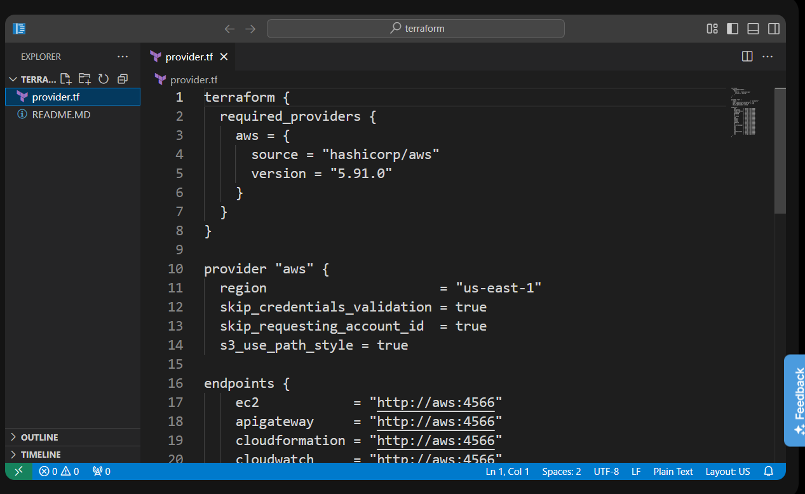
</div>

---

## 3. Created `variables.tf`

```hcl
variable "KKE_VPC_CIDR" {
  default = "10.0.0.0/16"
}

variable "KKE_SUBNET_CIDR" {
  default = "10.0.1.0/24"
}

variable "prefix" {
  default = "xfusion-priv"
}
```

<div style="border:1px solid #ccc; padding:10px; border-radius:10px; box-shadow:2px 2px 8px rgba(0,0,0,0.2); display:inline-block;">
  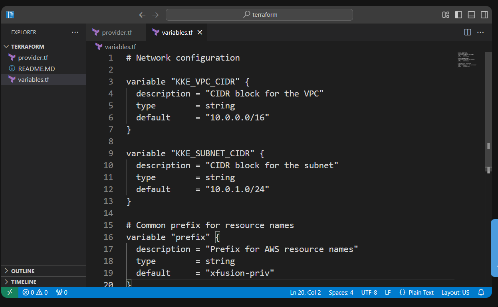
</div>

### Observation

Using variables avoids hardcoding values and makes the configuration reusable.

---

## 4. Created `main.tf`

```hcl
# Find the latest Amazon Linux AMI
data "aws_ami" "amazon_linux" {
  most_recent = true
  owners      = ["amazon"]

  filter {
    name   = "name"
    values = ["amzn2-ami-hvm-*-x86_64-ebs"]
  }
}

# Create VPC
resource "aws_vpc" "vpc" {
  cidr_block = var.KKE_VPC_CIDR

  tags = {
    Name = "${var.prefix}-vpc"
  }
}

# Create private subnet
resource "aws_subnet" "subnet" {
  vpc_id                  = aws_vpc.vpc.id
  cidr_block              = var.KKE_SUBNET_CIDR
  map_public_ip_on_launch = false

  tags = {
    Name = "${var.prefix}-subnet"
  }
}

# Create Security Group
resource "aws_security_group" "sg" {
  name        = "${var.prefix}-sg"
  description = "Security group for private EC2"
  vpc_id      = aws_vpc.vpc.id

  tags = {
    Name = "${var.prefix}-sg"
  }
}

# Allow traffic only from inside the VPC
resource "aws_vpc_security_group_ingress_rule" "allow_vpc" {
  security_group_id = aws_security_group.sg.id
  cidr_ipv4         = var.KKE_VPC_CIDR
  ip_protocol       = "-1"
}

# Allow all outbound traffic
resource "aws_vpc_security_group_egress_rule" "allow_all" {
  security_group_id = aws_security_group.sg.id
  cidr_ipv4         = "0.0.0.0/0"
  ip_protocol       = "-1"
}

# Launch EC2 instance
resource "aws_instance" "ec2" {
  ami                    = data.aws_ami.amazon_linux.id
  instance_type          = "t2.micro"
  subnet_id              = aws_subnet.subnet.id
  vpc_security_group_ids = [aws_security_group.sg.id]

  tags = {
    Name = "${var.prefix}-ec2"
  }
}
```

<div style="border:1px solid #ccc; padding:10px; border-radius:10px; box-shadow:2px 2px 8px rgba(0,0,0,0.2); display:inline-block;">
  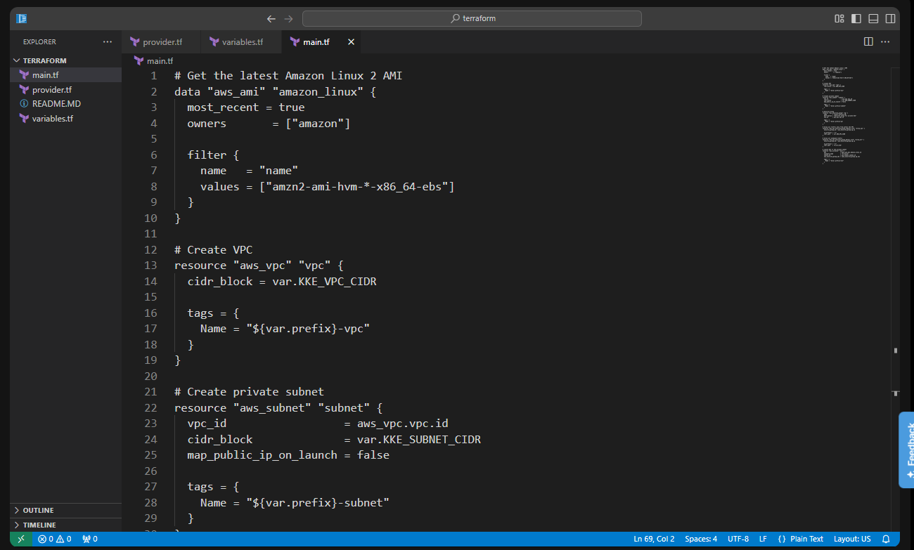
</div>

<div style="border:1px solid #ccc; padding:10px; border-radius:10px; box-shadow:2px 2px 8px rgba(0,0,0,0.2); display:inline-block;">
  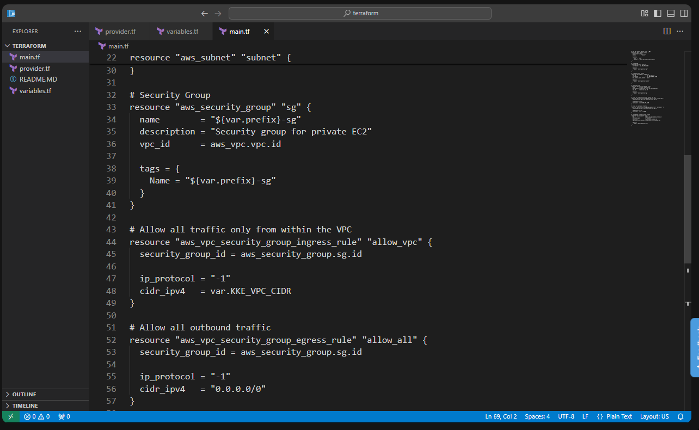
</div>

<div style="border:1px solid #ccc; padding:10px; border-radius:10px; box-shadow:2px 2px 8px rgba(0,0,0,0.2); display:inline-block;">
  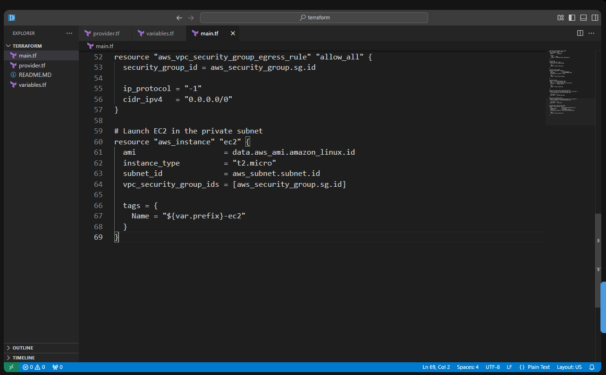
</div>

---

## 5. Created `outputs.tf`

```hcl
output "KKE_vpc_name" {
  value = aws_vpc.vpc.tags["Name"]
}

output "KKE_subnet_name" {
  value = aws_subnet.subnet.tags["Name"]
}

output "KKE_ec2_private" {
  value = aws_instance.ec2.tags["Name"]
}
```

<div style="border:1px solid #ccc; padding:10px; border-radius:10px; box-shadow:2px 2px 8px rgba(0,0,0,0.2); display:inline-block;">
  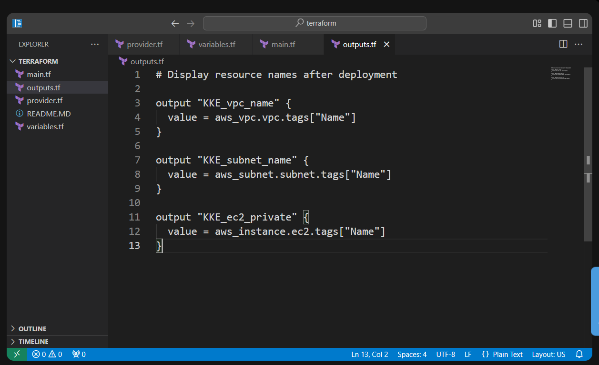
</div>

### Observation

Outputs display useful information after the infrastructure is created.

---

# 📘 Understanding the Code

### Variables

The VPC CIDR, subnet CIDR, and resource name prefix are stored in variables. This makes the configuration reusable without modifying the main code.

---

### Data Source

Terraform searches AWS and automatically selects the latest Amazon Linux AMI.

```hcl
data "aws_ami" "amazon_linux"
```

This avoids hardcoding an AMI ID.

---

### VPC

The VPC creates an isolated virtual network.

```text
10.0.0.0/16
```

All other resources are deployed inside this VPC.

---

### Private Subnet

The subnet is created inside the VPC.

```hcl
map_public_ip_on_launch = false
```

This ensures EC2 instances launched in the subnet do not automatically receive public IP addresses.

---

### Security Group

A Security Group acts as a virtual firewall.

The ingress rule allows traffic only from:

```text
10.0.0.0/16
```

which means only resources inside the VPC can communicate with the EC2 instance.

The egress rule allows outbound traffic to any destination.

---

### EC2 Instance

The EC2 instance uses:

* Latest Amazon Linux AMI
* Instance type `t2.micro`
* Private subnet
* Security Group created earlier

Terraform automatically creates the resources in the correct order because the EC2 instance references the subnet and Security Group.

---

### Outputs

The outputs display the names of the created:

* VPC
* Subnet
* EC2 instance

after `terraform apply` completes.

---

## 6. Initialized Terraform

```bash
terraform init
```
<div style="border:1px solid #ccc; padding:10px; border-radius:10px; box-shadow:2px 2px 8px rgba(0,0,0,0.2); display:inline-block;">
  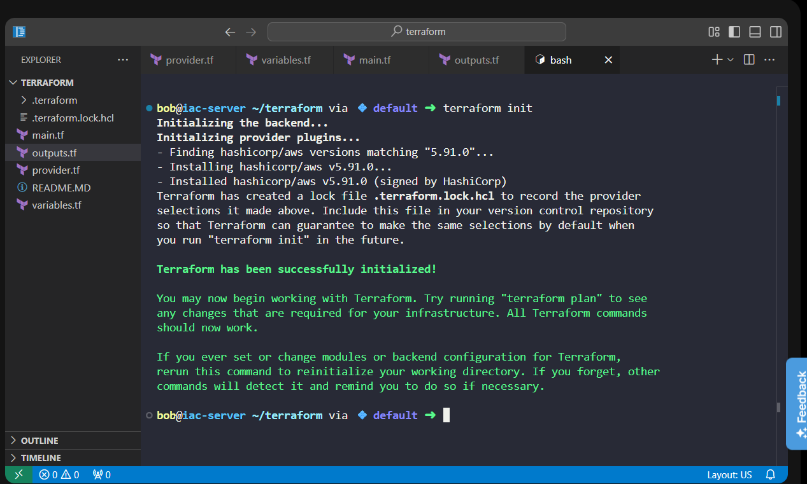
</div>

### Observation

Terraform initialized the working directory and downloaded the required provider plugins.

---

## 7. Validated the Configuration

```bash
terraform validate
```

Output

```text
Success! The configuration is valid.
```

<div style="border:1px solid #ccc; padding:10px; border-radius:10px; box-shadow:2px 2px 8px rgba(0,0,0,0.2); display:inline-block;">
  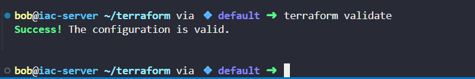
</div>

### Observation

Terraform confirmed that the configuration syntax was correct.

---

## 8. Reviewed the Execution Plan

```bash
terraform plan
```

Terraform displayed:

```text
Plan: 6 to add, 0 to change, 0 to destroy.
```

<div style="border:1px solid #ccc; padding:10px; border-radius:10px; box-shadow:2px 2px 8px rgba(0,0,0,0.2); display:inline-block;">
  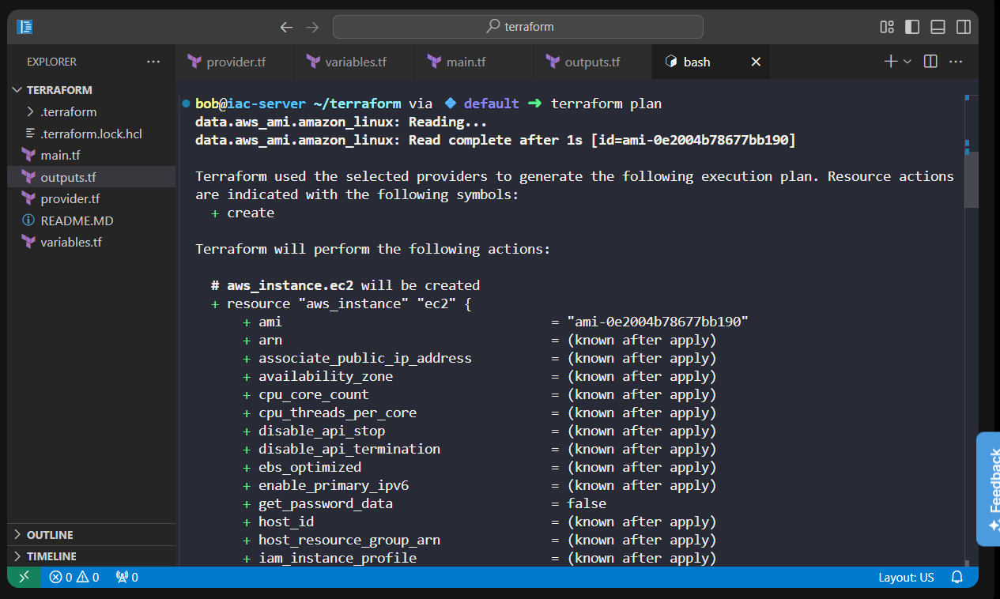
</div>

### Observation

Terraform planned to create:

* VPC
* Private Subnet
* Security Group
* Ingress Rule
* Egress Rule
* EC2 Instance

---

## 9. Applied the Configuration

```bash
terraform apply -auto-approve
```

Output

```text
Apply complete!
Resources: 6 added, 0 changed, 0 destroyed.
```

<div style="border:1px solid #ccc; padding:10px; border-radius:10px; box-shadow:2px 2px 8px rgba(0,0,0,0.2); display:inline-block;">
  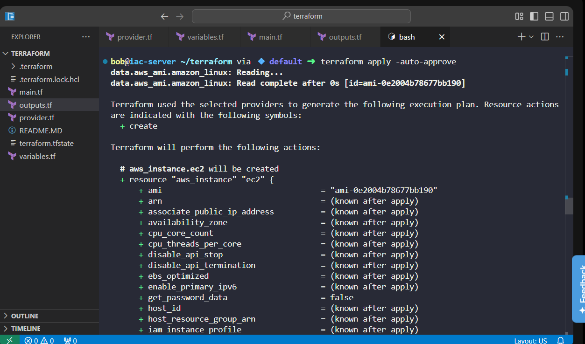
</div>

<div style="border:1px solid #ccc; padding:10px; border-radius:10px; box-shadow:2px 2px 8px rgba(0,0,0,0.2); display:inline-block;">
  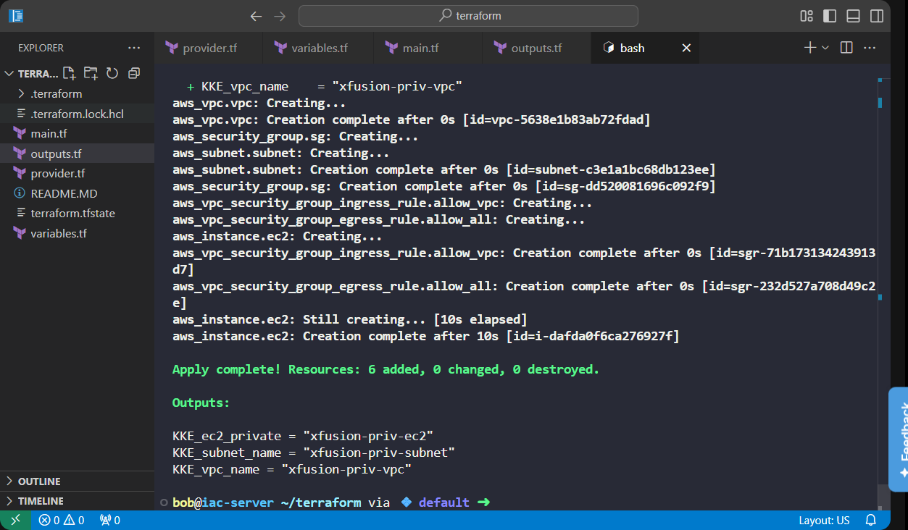
</div>

### Observation

Terraform successfully provisioned all required resources.

---

## 10. Verified the Deployment

```bash
terraform plan
```

Output

```text
No changes.
Your infrastructure matches the configuration.
```

<div style="border:1px solid #ccc; padding:10px; border-radius:10px; box-shadow:2px 2px 8px rgba(0,0,0,0.2); display:inline-block;">
  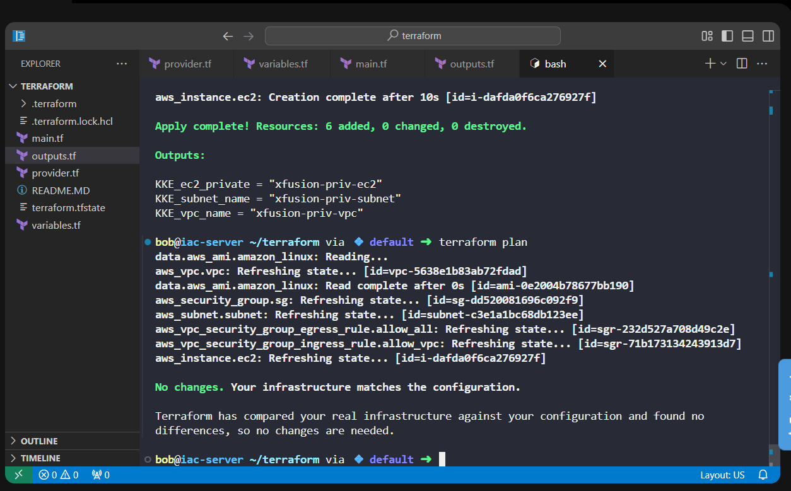
</div>

### Observation

This confirms that the deployed infrastructure matches the Terraform configuration.

---

## 📚 References Used

* Terraform AWS Provider – VPC
  [https://registry.terraform.io/providers/hashicorp/aws/latest/docs/resources/vpc](https://registry.terraform.io/providers/hashicorp/aws/latest/docs/resources/vpc)

* Terraform AWS Provider – EC2 Instance
  [https://registry.terraform.io/providers/hashicorp/aws/latest/docs/resources/instance](https://registry.terraform.io/providers/hashicorp/aws/latest/docs/resources/instance)

* Terraform AWS Provider – Security Group Rules
  [https://registry.terraform.io/providers/hashicorp/aws/latest/docs/resources/vpc_security_group_ingress_rule](https://registry.terraform.io/providers/hashicorp/aws/latest/docs/resources/vpc_security_group_ingress_rule)

---

## 🔹 Verification

* ✅ Used the existing AWS provider configuration
* ✅ Created `variables.tf`, `main.tf`, and `outputs.tf`
* ✅ Created a private VPC and subnet
* ✅ Disabled automatic public IP assignment
* ✅ Created a Security Group allowing traffic only from the VPC CIDR
* ✅ Launched an EC2 instance in the private subnet
* ✅ Successfully provisioned the infrastructure using `terraform apply`
* ✅ Verified the deployment using `terraform plan`

---

## 🔹 My Understanding

I learned how to build a complete private network in AWS using Terraform. By defining the VPC, subnet, Security Group, and EC2 instance as code, Terraform automatically handled the dependencies and created the resources in the correct order. I also learned how variables improve reusability and outputs make it easier to retrieve important information after deployment.

---

## 🔹 What I Found Interesting

I found it interesting that simply setting `map_public_ip_on_launch = false` makes a subnet private by preventing instances from automatically receiving public IP addresses. I also liked how Terraform automatically linked the VPC, subnet, Security Group, and EC2 instance without requiring me to manually specify the creation order.

---

* * *

### Topics Covered

- ***Terraform***
- ***Amazon VPC***
- ***Private Subnet***
- ***AWS Security Groups***
- ***Amazon EC2***
- ***Terraform Variables***
- ***Terraform Outputs***
- ***Infrastructure as Code (IaC)***


**Previous Task**: [Day 97: Create IAM Policy Using Terraform](../Day_97/day_97.md)

**Next Task**: [Day 99: Attach IAM Policy for DynamoDB Access Using Terraform](../Day_99/day_99.md)