# Day 99: Attach IAM Policy for DynamoDB Access Using Terraform
<div style="border:1px solid #ccc; padding:10px; border-radius:10px; box-shadow:2px 2px 8px rgba(0,0,0,0.2); display:inline-block;">
  
</div>

## Content

> Today I learned how to provision an **Amazon DynamoDB table**, create an **IAM Role**, and attach a **read-only IAM Policy** using **Terraform**. Instead of configuring these resources manually through the AWS Console, I defined the entire infrastructure as code. I also learned how to use Terraform variables and outputs to make the configuration reusable and how to restrict IAM permissions to a specific DynamoDB table by referencing its ARN.

* * *

## 🔹 What I Learned

*   Creating an Amazon DynamoDB table using Terraform
    
*   Creating an IAM Role with an Assume Role Policy
    
*   Restricting IAM permissions to a specific DynamoDB table
    
*   Attaching an IAM Policy to an IAM Role
    
*   Using Terraform variables and outputs for reusable configurations
    

* * *

## 🔹 Task Requirement

<div style="border:1px solid #ccc; padding:10px; border-radius:10px; box-shadow:2px 2px 8px rgba(0,0,0,0.2); display:inline-block;">
  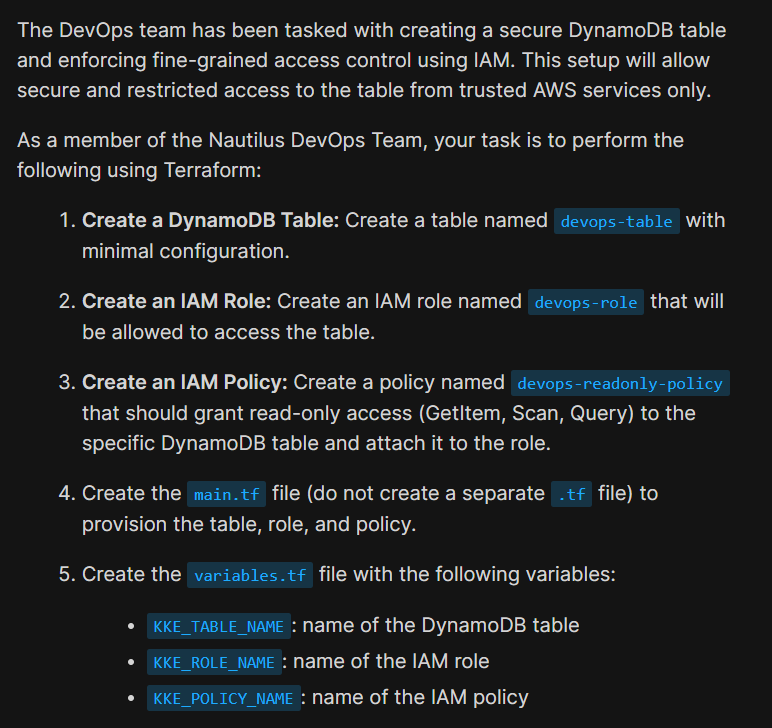
</div>

<div style="border:1px solid #ccc; padding:10px; border-radius:10px; box-shadow:2px 2px 8px rgba(0,0,0,0.2); display:inline-block;">
  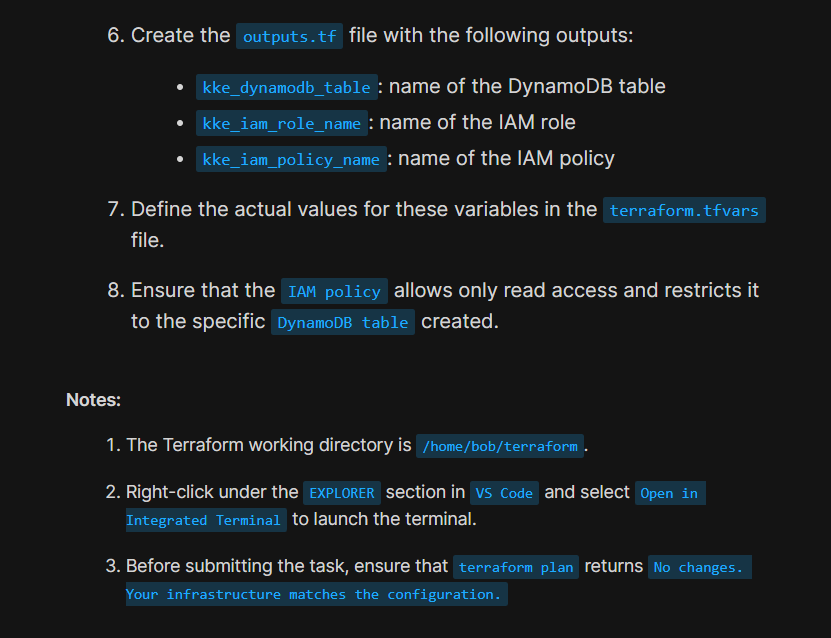
</div>

The Terraform working directory was already available at:

```text
/home/bob/terraform
```

A `provider.tf` file was already configured with:

*   AWS Provider
    
*   Region
    

```text
us-east-1
```

*   LocalStack endpoints
    

The task required creating the following Terraform files:

```text
main.tf
variables.tf
outputs.tf
terraform.tfvars
```

The infrastructure needed to provision:

*   A DynamoDB table named:
    

```text
devops-table
```

*   An IAM Role named:
    

```text
devops-role
```

*   An IAM Policy named:
    

```text
devops-readonly-policy
```

The IAM policy had to grant only the following read-only permissions on the created DynamoDB table:

*   GetItem
    
*   Scan
    
*   Query
    

The policy also needed to be attached to the IAM role.

* * *

# 🔹 Steps I Followed

## 1\. Navigated to the Terraform Working Directory

The Terraform working directory was already opened in VS Code.

I verified that the provider configuration was already available.

* * *

## 2\. Reviewed the Existing Provider Configuration

The `provider.tf` file already contained the required AWS provider configuration.

```hcl
terraform {
  required_providers {
    aws = {
      source  = "hashicorp/aws"
      version = "5.91.0"
    }
  }
}

provider "aws" {
  region = "us-east-1"

  skip_credentials_validation = true
  skip_requesting_account_id  = true
  s3_use_path_style           = true

  endpoints {
    dynamodb = "http://aws:4566"
    iam      = "http://aws:4566"
    ...
  }
}
```

### Observation

The provider configuration was already complete.

Since the task focused on creating AWS resources, no changes were required in `provider.tf`.

* * *

## 3\. Created Terraform Variables

To avoid hardcoding resource names, I created the following variables in:

```text
variables.tf
```

<div style="border:1px solid #ccc; padding:10px; border-radius:10px; box-shadow:2px 2px 8px rgba(0,0,0,0.2); display:inline-block;">
  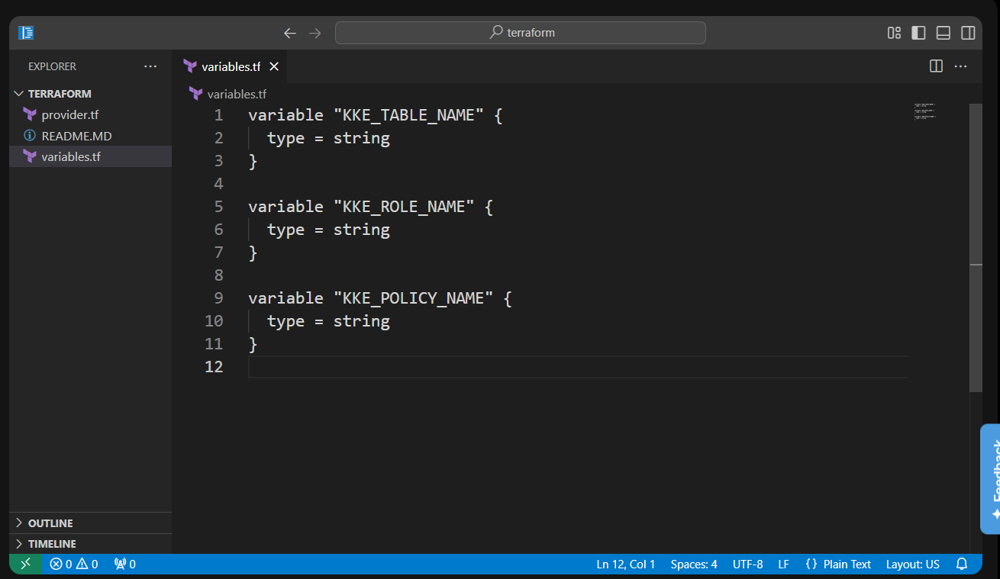
</div>

```hcl
# DynamoDB table name
variable "KKE_TABLE_NAME" {
  type = string
}

# IAM role name
variable "KKE_ROLE_NAME" {
  type = string
}

# IAM policy name
variable "KKE_POLICY_NAME" {
  type = string
}
```

Then, I defined their values in:

```text
terraform.tfvars
```

<div style="border:1px solid #ccc; padding:10px; border-radius:10px; box-shadow:2px 2px 8px rgba(0,0,0,0.2); display:inline-block;">
  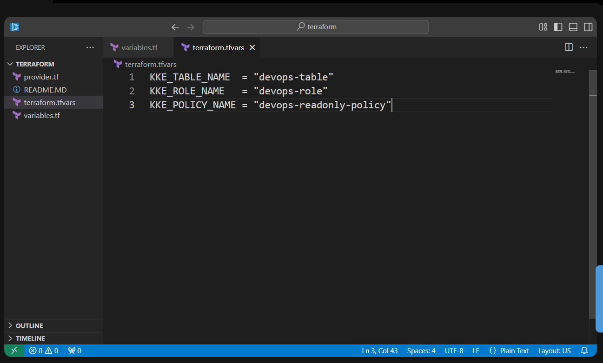
</div>

```hcl
# DynamoDB table name
KKE_TABLE_NAME = "devops-table"

# IAM role name
KKE_ROLE_NAME = "devops-role"

# IAM policy name
KKE_POLICY_NAME = "devops-readonly-policy"
```

### Observation

Using variables makes the configuration reusable. If the resource names change later, only the values in `terraform.tfvars` need to be updated.

* * *

## 4\. Created the Terraform Configuration

I created the required file:

```text
main.tf
```
<div style="border:1px solid #ccc; padding:10px; border-radius:10px; box-shadow:2px 2px 8px rgba(0,0,0,0.2); display:inline-block;">
  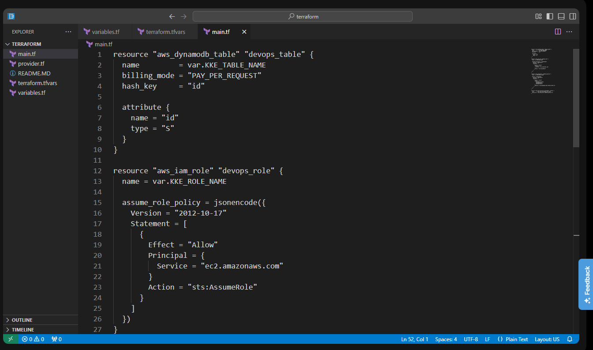
</div>

<div style="border:1px solid #ccc; padding:10px; border-radius:10px; box-shadow:2px 2px 8px rgba(0,0,0,0.2); display:inline-block;">
  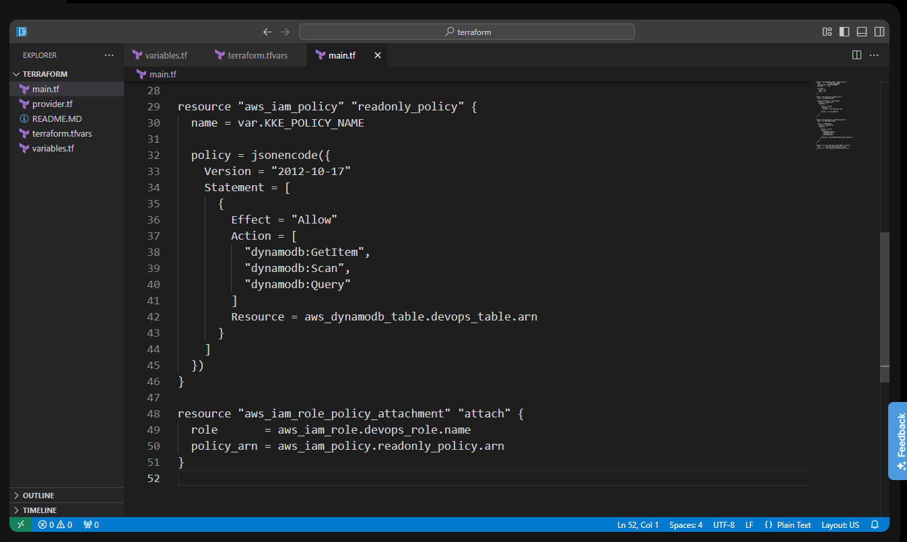
</div>

```hcl
# Create a DynamoDB table
resource "aws_dynamodb_table" "devops_table" {

  # Table name from variable
  name = var.KKE_TABLE_NAME

  # On-demand billing
  billing_mode = "PAY_PER_REQUEST"

  # Primary key
  hash_key = "id"

  # Define the primary key attribute
  attribute {
    name = "id"
    type = "S" # String type
  }
}

# Create an IAM role
resource "aws_iam_role" "devops_role" {

  # Role name from variable
  name = var.KKE_ROLE_NAME

  # Trust policy (EC2 can assume this role)
  assume_role_policy = jsonencode({
    Version = "2012-10-17"

    Statement = [
      {
        Effect = "Allow"

        Principal = {
          Service = "ec2.amazonaws.com"
        }

        Action = "sts:AssumeRole"
      }
    ]
  })
}

# Create an IAM policy with read-only permissions
resource "aws_iam_policy" "readonly_policy" {

  # Policy name from variable
  name = var.KKE_POLICY_NAME

  # Policy document
  policy = jsonencode({
    Version = "2012-10-17"

    Statement = [
      {
        Effect = "Allow"

        # Allowed read actions
        Action = [
          "dynamodb:GetItem",
          "dynamodb:Scan",
          "dynamodb:Query"
        ]

        # Allow access only to this table
        Resource = aws_dynamodb_table.devops_table.arn
      }
    ]
  })
}

# Attach the IAM policy to the IAM role
resource "aws_iam_role_policy_attachment" "attach" {

  # Role name
  role = aws_iam_role.devops_role.name

  # Policy ARN
  policy_arn = aws_iam_policy.readonly_policy.arn
}

``
and added the configuration to create:

*   DynamoDB Table
    
*   IAM Role
    
*   IAM Policy
    
*   IAM Role Policy Attachment
    

### DynamoDB Table

```hcl
resource "aws_dynamodb_table" "devops_table" {
  name         = var.KKE_TABLE_NAME
  billing_mode = "PAY_PER_REQUEST"
  hash_key     = "id"

  attribute {
    name = "id"
    type = "S"
  }
}
```

### IAM Role

```hcl
resource "aws_iam_role" "devops_role" {
  name = var.KKE_ROLE_NAME

  assume_role_policy = jsonencode({
    Version = "2012-10-17"

    Statement = [
      {
        Effect = "Allow"

        Principal = {
          Service = "ec2.amazonaws.com"
        }

        Action = "sts:AssumeRole"
      }
    ]
  })
}
```

### IAM Policy

```hcl
resource "aws_iam_policy" "readonly_policy" {

  name = var.KKE_POLICY_NAME

  policy = jsonencode({

    Version = "2012-10-17"

    Statement = [

      {
        Effect = "Allow"

        Action = [
          "dynamodb:GetItem",
          "dynamodb:Scan",
          "dynamodb:Query"
        ]

        Resource = aws_dynamodb_table.devops_table.arn
      }
    ]
  })
}
```

### Attach the Policy

```hcl
resource "aws_iam_role_policy_attachment" "attach" {

  role       = aws_iam_role.devops_role.name

  policy_arn = aws_iam_policy.readonly_policy.arn
}
```

Saved the file.

* * *

## Understanding the Variables

Instead of hardcoding resource names like:

```hcl
name = "devops-table"
```

the configuration uses variables:

```hcl
name = var.KKE_TABLE_NAME
```

Similarly,

```hcl
name = var.KKE_ROLE_NAME
```

and

```hcl
name = var.KKE_POLICY_NAME
```

This makes the Terraform configuration reusable for different environments.

* * *

## Understanding the DynamoDB Table Resource

The following block creates the DynamoDB table.

```hcl
resource "aws_dynamodb_table" "devops_table"
```

where:

*   `aws_dynamodb_table` is the AWS resource type.
    
*   `devops_table` is Terraform's local resource name.
    

The table uses:

```hcl
billing_mode = "PAY_PER_REQUEST"
```

which automatically scales capacity based on usage without requiring manual provisioning.

The partition key is defined as:

```hcl
hash_key = "id"
```

with a string attribute:

```hcl
attribute {
  name = "id"
  type = "S"
}
```

* * *

## Understanding the IAM Role

The IAM Role is created using:

```hcl
resource "aws_iam_role" "devops_role"
```

The Assume Role Policy allows an AWS service to assume the role.

```hcl
Principal = {
  Service = "ec2.amazonaws.com"
}
```

This means EC2 instances can use this IAM Role.

* * *

## Understanding `jsonencode()`

AWS IAM policies must be written in JSON.

Instead of manually writing JSON, Terraform allows writing policies in HCL.

```hcl
policy = jsonencode({...})
```

The `jsonencode()` function converts the Terraform object into valid JSON before sending it to AWS.

* * *

## Understanding the IAM Policy

The IAM policy contains:

```hcl
Version = "2012-10-17"
```

which specifies the IAM policy language version.

Permissions are defined inside:

```hcl
Statement = [
   ...
]
```

Each statement contains:

*   Effect
    
*   Action
    
*   Resource
    

* * *

## Understanding the Allowed Actions

The policy grants only three DynamoDB read operations.

```hcl
Action = [
  "dynamodb:GetItem",
  "dynamodb:Scan",
  "dynamodb:Query"
]
```

These actions allow applications to read data without modifying or deleting any items.

* * *

## Understanding the Resource Restriction

Instead of granting permissions on all DynamoDB tables,

```hcl
Resource = "*"
```

the policy uses:

```hcl
Resource = aws_dynamodb_table.devops_table.arn
```

This restricts access to only the DynamoDB table created by Terraform, following the principle of least privilege.

* * *

## Understanding the Policy Attachment

The following resource attaches the IAM policy to the IAM role.

```hcl
resource "aws_iam_role_policy_attachment" "attach"
```

It connects:

*   IAM Role
    

```hcl
aws_iam_role.devops_role.name
```

with

*   IAM Policy
    

```hcl
aws_iam_policy.readonly_policy.arn
```

After attachment, the role inherits the read-only permissions defined in the policy.

* * *

## 5\. Created Terraform Outputs

I created:

```text
outputs.tf
```
<div style="border:1px solid #ccc; padding:10px; border-radius:10px; box-shadow:2px 2px 8px rgba(0,0,0,0.2); display:inline-block;">
  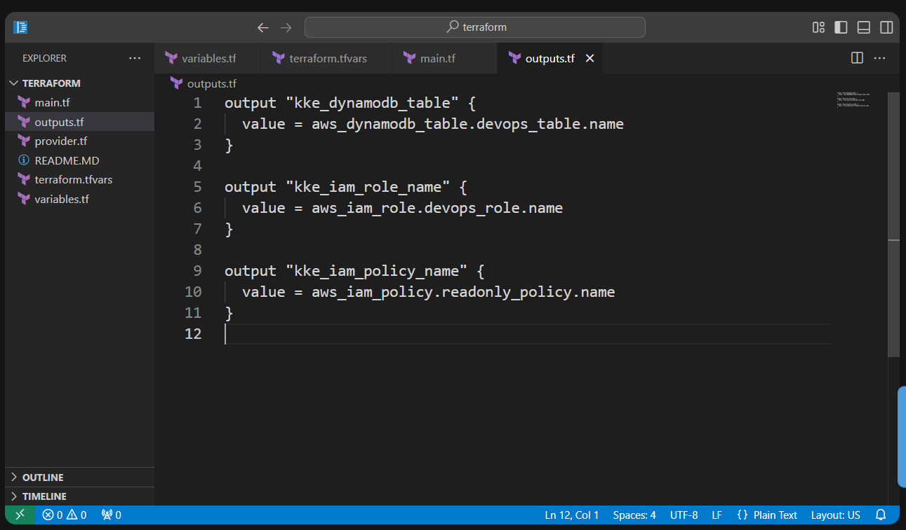
</div>

```hcl
# Output the DynamoDB table name
output "kke_dynamodb_table" {
  value = aws_dynamodb_table.devops_table.name
}

# Output the IAM role name
output "kke_iam_role_name" {
  value = aws_iam_role.devops_role.name
}

# Output the IAM policy name
output "kke_iam_policy_name" {
  value = aws_iam_policy.readonly_policy.name
}
```

### Observation

Outputs make it easy to view important resource information after Terraform completes.

* * *

## 6\. Initialized Terraform

I initialized the Terraform working directory.

```bash
terraform init
```
<div style="border:1px solid #ccc; padding:10px; border-radius:10px; box-shadow:2px 2px 8px rgba(0,0,0,0.2); display:inline-block;">
  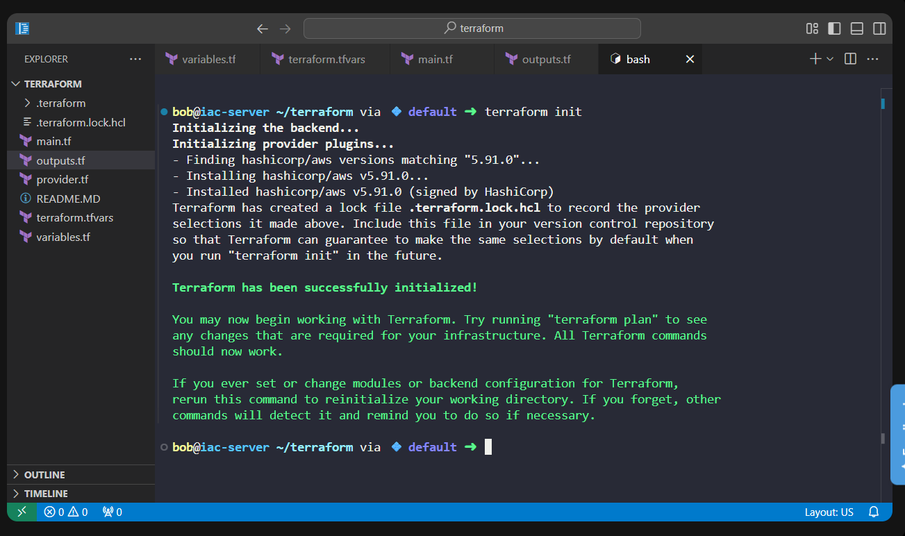
</div>

Output:

```text
Terraform has been successfully initialized!
```

### Observation

Terraform downloaded the required AWS provider and initialized the working directory.

* * *

## 7\. Reviewed the Execution Plan

Next, I generated the execution plan.

```bash
terraform plan
```

<div style="border:1px solid #ccc; padding:10px; border-radius:10px; box-shadow:2px 2px 8px rgba(0,0,0,0.2); display:inline-block;">
  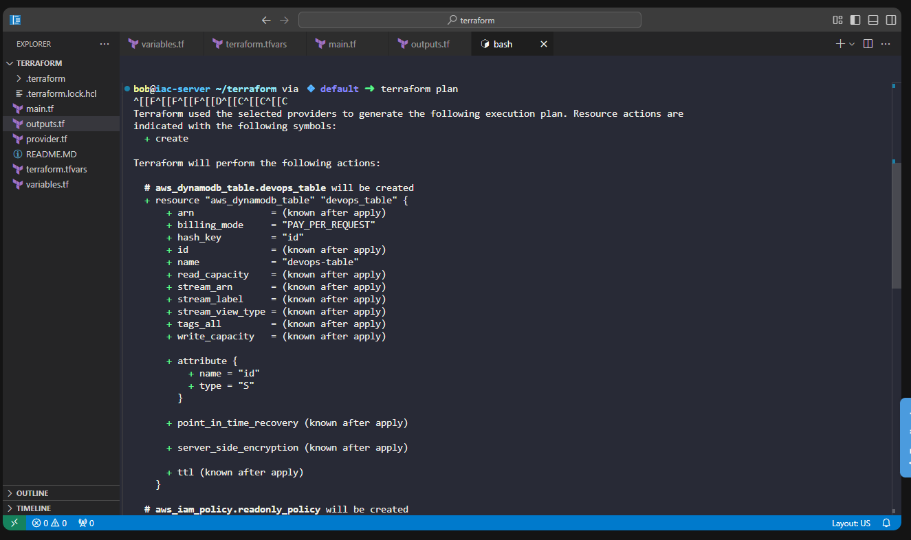
</div>

<div style="border:1px solid #ccc; padding:10px; border-radius:10px; box-shadow:2px 2px 8px rgba(0,0,0,0.2); display:inline-block;">
  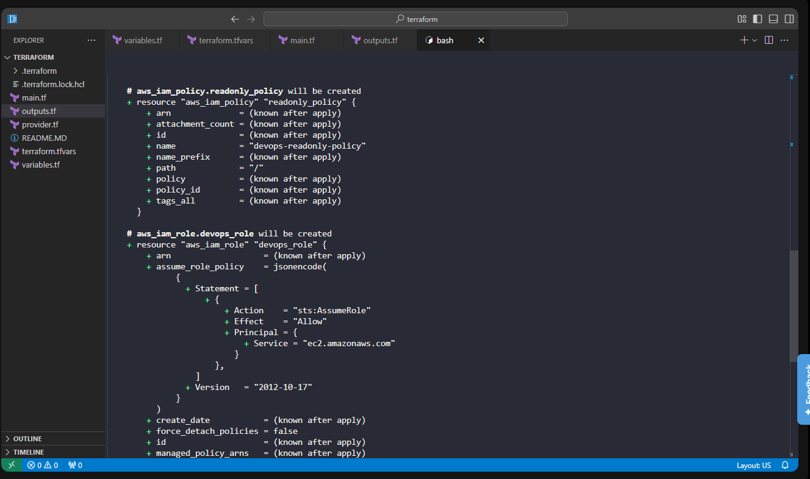
</div>

<div style="border:1px solid #ccc; padding:10px; border-radius:10px; box-shadow:2px 2px 8px rgba(0,0,0,0.2); display:inline-block;">
  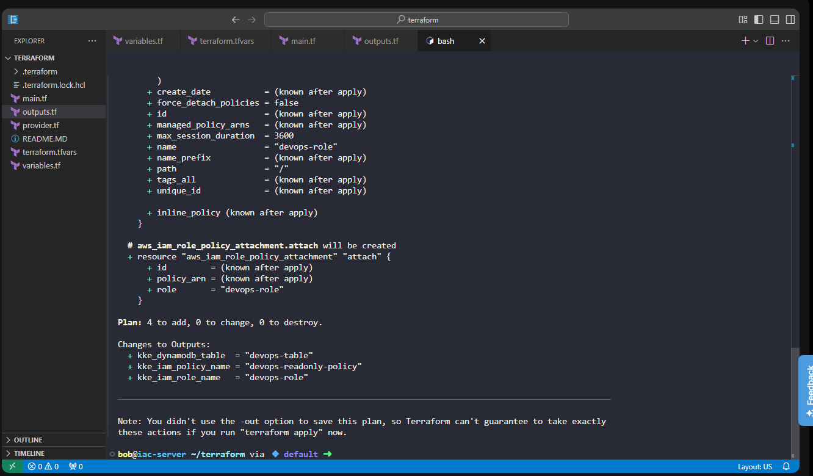
</div>


Terraform displayed:

```text
Plan: 4 to add, 0 to change, 0 to destroy.
```

The execution plan showed that Terraform would create:

*   DynamoDB Table
    
*   IAM Role
    
*   IAM Policy
    
*   IAM Role Policy Attachment
    

### Observation

The execution plan confirmed that exactly four AWS resources would be created.

* * *

## 8\. Applied the Configuration

After reviewing the execution plan, I provisioned the infrastructure.

```bash
terraform apply -auto-approve
```
<div style="border:1px solid #ccc; padding:10px; border-radius:10px; box-shadow:2px 2px 8px rgba(0,0,0,0.2); display:inline-block;">
  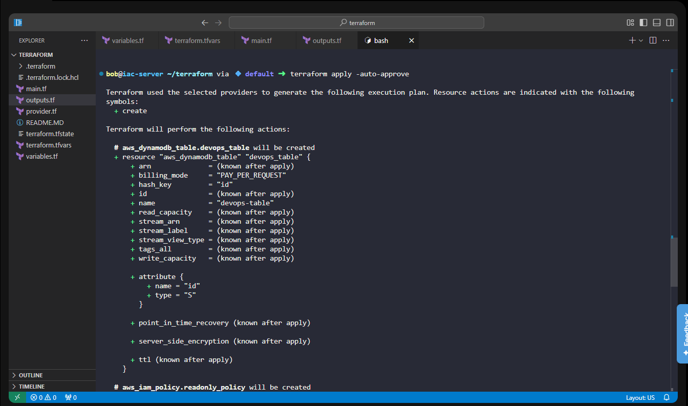
</div>
<div style="border:1px solid #ccc; padding:10px; border-radius:10px; box-shadow:2px 2px 8px rgba(0,0,0,0.2); display:inline-block;">
  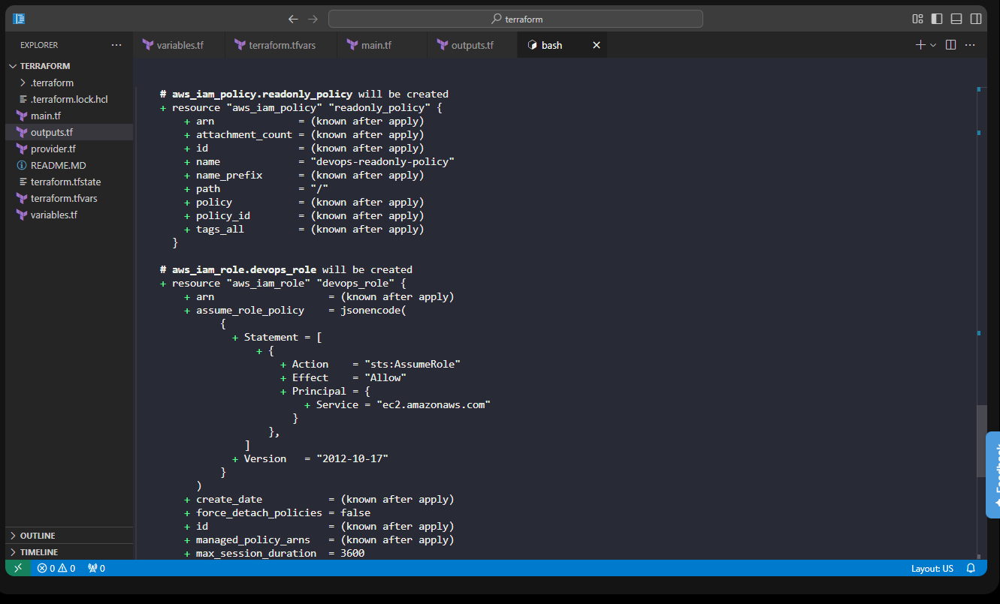
</div>
<div style="border:1px solid #ccc; padding:10px; border-radius:10px; box-shadow:2px 2px 8px rgba(0,0,0,0.2); display:inline-block;">
  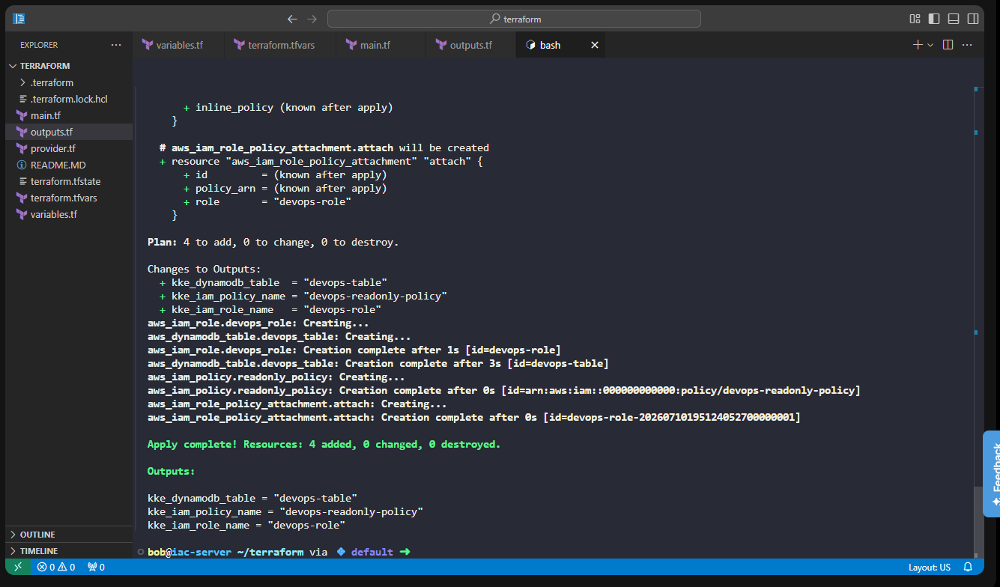
</div>

Output:

```text
Apply complete!
Resources: 4 added, 0 changed, 0 destroyed.
```

Terraform also displayed the outputs:

```text
kke_dynamodb_table = "devops-table"
kke_iam_role_name = "devops-role"
kke_iam_policy_name = "devops-readonly-policy"
```

### Observation

Terraform successfully created the DynamoDB table, IAM role, IAM policy, and attached the policy to the role.

* * *

## 9\. Verified the Deployment

To confirm that Terraform state matched the deployed infrastructure, I ran:

```bash
terraform plan
```
<div style="border:1px solid #ccc; padding:10px; border-radius:10px; box-shadow:2px 2px 8px rgba(0,0,0,0.2); display:inline-block;">
  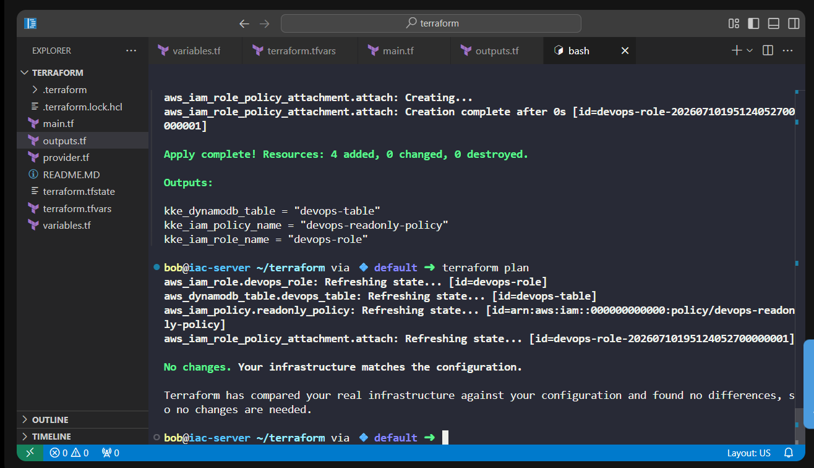
</div>

Output:

```text
No changes. Your infrastructure matches the configuration.
```

This confirmed that the deployed infrastructure exactly matched the Terraform configuration.

* * *

## 10\. Verified the Terraform State

Finally, I verified the managed resources.

```bash
terraform state list
```

<div style="border:1px solid #ccc; padding:10px; border-radius:10px; box-shadow:2px 2px 8px rgba(0,0,0,0.2); display:inline-block;">
  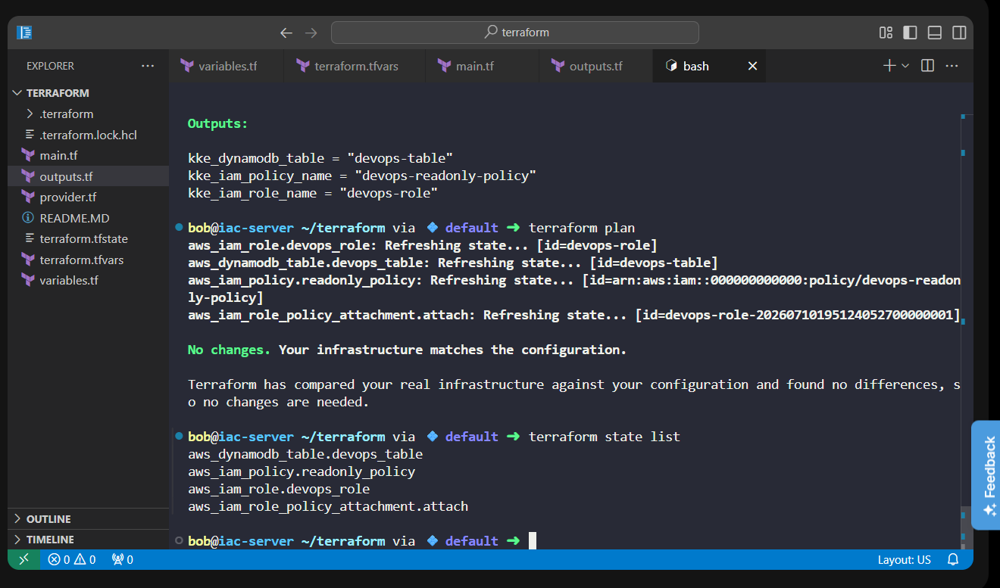
</div>

Output:

```text
aws_dynamodb_table.devops_table
aws_iam_policy.readonly_policy
aws_iam_role.devops_role
aws_iam_role_policy_attachment.attach
```

### Observation

This confirmed that Terraform was managing all four resources.

* * *

# **References Used**

**Terraform AWS DynamoDB Table Resource**

[https://registry.terraform.io/providers/hashicorp/aws/latest/docs/resources/dynamodb\_table](https://registry.terraform.io/providers/hashicorp/aws/latest/docs/resources/dynamodb_table)

**Terraform AWS IAM Role Resource**

[https://registry.terraform.io/providers/hashicorp/aws/latest/docs/resources/iam\_role](https://registry.terraform.io/providers/hashicorp/aws/latest/docs/resources/iam_role)

**Terraform AWS IAM Policy Resource**

[https://registry.terraform.io/providers/hashicorp/aws/latest/docs/resources/iam\_policy](https://registry.terraform.io/providers/hashicorp/aws/latest/docs/resources/iam_policy)

**Terraform AWS IAM Role Policy Attachment**

[https://registry.terraform.io/providers/hashicorp/aws/latest/docs/resources/iam\_role\_policy\_attachment](https://registry.terraform.io/providers/hashicorp/aws/latest/docs/resources/iam_role_policy_attachment)

**AWS IAM JSON Policy Reference**

[https://docs.aws.amazon.com/IAM/latest/UserGuide/reference\_policies\_elements.html](https://docs.aws.amazon.com/IAM/latest/UserGuide/reference_policies_elements.html)

* * *

## 🔹 Verification

✅ Used the existing AWS provider configuration

✅ Created `main.tf`, `variables.tf`, `outputs.tf`, and `terraform.tfvars`

✅ Created the DynamoDB table `devops-table`

✅ Created the IAM role `devops-role`

✅ Created the IAM policy `devops-readonly-policy`

✅ Granted only `GetItem`, `Scan`, and `Query` permissions

✅ Restricted the policy to the specific DynamoDB table ARN

✅ Attached the IAM policy to the IAM role

✅ Successfully provisioned all resources using `terraform apply`

✅ Verified that `terraform plan` returned **No changes**

✅ Verified the Terraform state using `terraform state list`

* * *

## 🔹 My Understanding

I learned how multiple AWS resources can work together in Terraform by referencing one another. The IAM policy uses the ARN of the DynamoDB table created in the same configuration, ensuring permissions are limited to that specific resource. I also learned how IAM roles and policy attachments combine to provide secure, reusable access for AWS services while following the principle of least privilege.

* * *

## 🔹 What I Found Interesting

I found it interesting that Terraform automatically handles dependencies between resources. Even though the IAM policy references the DynamoDB table's ARN and the policy attachment depends on both the IAM role and policy, Terraform determines the correct creation order without requiring explicit dependency definitions. This makes infrastructure provisioning both reliable and easier to manage.

* * *

* * *

### Topics Covered

- ***Terraform***
- ***Amazon DynamoDB***
- ***IAM Role***
- ***IAM Policy***
- ***Policy attachment***
- ***Terraform Variables***
- ***Terraform Outputs***
- ***Infrastructure as Code (IaC)***


**Previous Task**: [Day 98: Launch EC2 in Private VPC Subnet Using Terraform](../Day_98/day_98.md)

**Next Task**: [Day 100: Create and Configure Alarm Using CloudWatch Using Terraform](../Day_100/day_100.md)