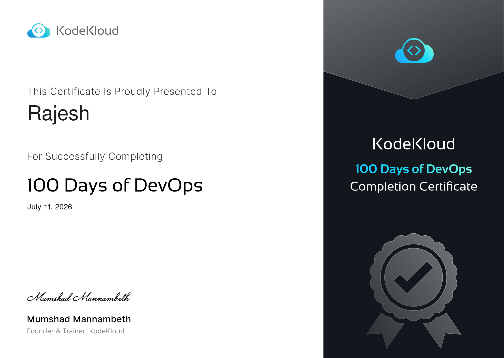

<h1 align="center">🚀 100 Days of DevOps Challenge</h1>

<p align="center">
  <b>From Linux to Terraform in 100 Days 💻☁️</b>
</p>

<p align="center">
Documenting my complete DevOps learning journey through hands-on labs, detailed notes, commands, troubleshooting guides, and technical blog posts as part of the <b>KodeKloud 100 Days of DevOps Challenge</b>.
</p>

<p align="center">


</p>

<p align="center">

</p>

---

## 🏆 Challenge Completion Certificate

<p align="center">
  <a href="resources/certificates/2210a5e4-156f-4f5f-9160-db6eb908dfc5.pdf">
    
  </a>
</p>

<p align="center">
  <b>🎉 Successfully completed the KodeKloud 100 Days of DevOps Challenge.</b><br>
  Click the certificate above to view the full PDF.
</p>

---

## 📖 About

This repository documents my complete **100 Days of DevOps** learning journey through the **KodeKloud DevOps Challenge**.

Every day focuses on solving real-world infrastructure and DevOps tasks using industry-standard tools.

Each day's folder includes:

- 📝 Notes & explanations
- 💻 Linux, Docker & Kubernetes commands
- 📸 Screenshots (where applicable)
- 🛠 Hands-on lab solutions
- 📚 Key takeaways & troubleshooting tips

The goal of this repository is not only to complete the challenge, but also to build a structured reference for future DevOps projects and interviews.

---

# 📊 Progress

```
████████████████████████░ 100%

✅ 100 / 100 Days Completed
```

---

# 🗺 Learning Roadmap

| Module | Days | Status |
|---------|------|--------|
| 🐧 Linux | 1–20 | ✅ |
| 🌿 Git & GitHub | 21–34 | ✅ |
| 🐳 Docker | 35–47 | ✅ |
| ☸ Kubernetes | 48–67 | ✅ |
| ⚙ Jenkins | 68–81 | ✅ |
| 🤖 Ansible | 82–93 | ✅ |
| 🌍 Terraform | 94–100 | ✅ |

---

# 📚 Daily Journal
## 🐧 Linux (Days 1–20)

| Day | Task |
|:---:|------|
| **Day 1** | 🔗 [Linux User Setup with Non-Interactive Shell](Days/Day_1/day_1.md) |
| **Day 2** | 🔗 [Temporary User Setup with Expiry](Days/Day_2/day_2.md) |
| **Day 3** | 🔗 [Secure Root SSH Access](Days/Day_3/day_3.md) |
| **Day 4** | 🔗 [Script Execution Permissions](Days/Day_4/day_4.md) |
| **Day 5** | 🔗 [SELinux Installation and Configuration](Days/Day_5/day_5.md) |
| **Day 6** | 🔗 [Create a Cron Job](Days/Day_6/day_6.md) |
| **Day 7** | 🔗 [Linux SSH Authentication](Days/Day_7/day_7.md) |
| **Day 8** | 🔗 [Install Ansible](Days/Day_8/day_8.md) |
| **Day 9** | 🔗 [MariaDB Troubleshooting](Days/Day_9/day_9.md) |
| **Day 10** | 🔗 [Linux Bash Scripts](Days/Day_10/day_10.md) |
| **Day 11** | 🔗 [Install and Configure Tomcat Server](Days/Day_11/day_11.md) |
| **Day 12** | 🔗 [Linux Network Services](Days/Day_12/day_12.md) |
| **Day 13** | 🔗 [IPtables Installation And Configuration](Days/Day_13/day_13.md) |
| **Day 14** | 🔗 [Linux Process Troubleshooting](Days/Day_14/day_14.md) |
| **Day 15** | 🔗 [Setup SSL for Nginx](Days/Day_15/day_15.md) |
| **Day 16** | 🔗 [Install and Configure Nginx as an LBR](Days/Day_16/day_16.md) |
| **Day 17** | 🔗 [Install and Configure PostgreSQL](Days/Day_17/day_17.md) |
| **Day 18** | 🔗 [Install and Configure DB Server](Days/Day_18/day_18.md) |
| **Day 19** | 🔗 [Install and Configure Web Application](Days/Day_19/day_19.md) |
| **Day 20** | 🔗 [Configure Nginx + PHP-FPM Using Unix Sock](Days/Day_20/day_20.md) |

## 🌿 Git & GitHub (Days 21–34)

| Day | Task |
|:---:|------|
| **Day 21** | [Set Up Git Repository on Storage Server](Days/Day_21/day_21.md) |
| **Day 22** | [Clone Git Repository on Storage Server](Days/Day_22/day_22.md) |
| **Day 23** | [Fork a Git Repository](Days/Day_23/day_23.md) |
| **Day 24** | [Git Create Branches](Days/Day_24/day_24.md) |
| **Day 25** | [Git Merge Branches](Days/Day_25/day_25.md) |
| **Day 26** | [Git Manage Remotes](Days/Day_26/day_26.md) |
| **Day 27** | [Git Revert Some Changes](Days/Day_27/day_27.md) |
| **Day 28** | [Git Cherry Pick](Days/Day_28/day_28.md) |
| **Day 29** | [Manage Git Pull Requests](Days/Day_29/day_29.md) |
| **Day 30** | [Git Hard Reset](Days/Day_30/day_30.md) |
| **Day 31** | [Git Stash](Days/Day_31/day_31.md) |
| **Day 32** | [Git Rebase](Days/Day_32/day_32.md) |
| **Day 33** | [Resolve Git Merge Conflicts](Days/Day_33/day_33.md) |
| **Day 34** | [Git Hook](Days/Day_34/day_34.md) |

---

## 🐳 Docker (Days 35–47)

| Day | Task |
|:---:|------|
| **Day 35** | [Install Docker Packages and Start Docker Service](Days/Day_35/day_35.md) |
| **Day 36** | [Deploy Nginx Container on Application Server](Days/Day_36/day_36.md) |
| **Day 37** | [Copy File to Docker Container](Days/Day_37/day_37.md) |
| **Day 38** | [Pull Docker Image](Days/Day_38/day_38.md) |
| **Day 39** | [Create a Docker Image From Container](Days/Day_39/day_39.md) |
| **Day 40** | [Docker EXEC Operations](Days/Day_40/day_40.md) |
| **Day 41** | [Write a Docker File](Days/Day_41/day_41.md) |
| **Day 42** | [Create a Docker Network](Days/Day_42/day_42.md) |
| **Day 43** | [Docker Ports Mapping](Days/Day_43/day_43.md) |
| **Day 44** | [Write a Docker Compose File](Days/Day_44/day_44.md) |
| **Day 45** | [Resolve Dockerfile Issues](Days/Day_45/day_45.md) |
| **Day 46** | [Deploy an App on Docker Containers](Days/Day_46/day_46.md) |
| **Day 47** | [Docker Python App](Days/Day_47/day_47.md) |

---

## ☸ Kubernetes (Days 48–67)

| Day | Task |
|:---:|------|
| **Day 48** | [Deploy Pods in Kubernetes Cluster](Days/Day_48/day_48.md) |
| **Day 49** | [Deploy Applications with Kubernetes Deployments](Days/Day_49/day_49.md) |
| **Day 50** | [Set Resource Limits in Kubernetes Pods](Days/Day_50/day_50.md) |
| **Day 51** | [Execute Rolling Updates in Kubernetes](Days/Day_51/day_51.md) |
| **Day 52** | [Revert Deployment to Previous Version in Kubernetes](Days/Day_52/day_52.md) |
| **Day 53** | [Resolve VolumeMounts Issue in Kubernetes](Days/Day_53/day_53.md) |
| **Day 54** | [Kubernetes Shared Volumes](Days/Day_54/day_54.md) |
| **Day 55** | [Kubernetes Sidecar Containers](Days/Day_55/day_55.md) |
| **Day 56** | [Deploy Nginx Web Server on Kubernetes Cluster](Days/Day_56/day_56.md) |
| **Day 57** | [Print Environment Variables](Days/Day_57/day_57.md) |
| **Day 58** | [Deploy Grafana on Kubernetes Cluster](Days/Day_58/day_58.md) |
| **Day 59** | [Troubleshoot Deployment Issues in Kubernetes](Days/Day_59/day_59.md) |
| **Day 60** | [Persistent Volumes in Kubernetes](Days/Day_60/day_60.md) |
| **Day 61** | [Init Containers in Kubernetes](Days/Day_61/day_61.md) |
| **Day 62** | [Manage Secrets in Kubernetes](Days/Day_62/day_62.md) |
| **Day 63** | [Deploy Iron Gallery App on Kubernetes](Days/Day_63/day_63.md) |
| **Day 64** | [Fix Python App Deployed on Kubernetes Cluster](Days/Day_64/day_64.md) |
| **Day 65** | [Deploy Redis Deployment on Kubernetes](Days/Day_65/day_65.md) |
| **Day 66** | [Deploy MySQL on Kubernetes](Days/Day_66/day_66.md) |
| **Day 67** | [Deploy Guest Book App on Kubernetes](Days/Day_67/day_67.md) |

## ⚙ Jenkins (Days 68–81)

| Day | Task |
|:---:|------|
| **Day 68** | [Set Up Jenkins Server](Days/Day_68/day_68.md) |
| **Day 69** | [Install Jenkins Plugins](Days/Day_69/day_69.md) |
| **Day 70** | [Configure Jenkins User Access](Days/Day_70/day_70.md) |
| **Day 71** | [Configure Jenkins Job for Package Installation](Days/Day_71/day_71.md) |
| **Day 72** | [Jenkins Parameterized Builds](Days/Day_72/day_72.md) |
| **Day 73** | [Jenkins Scheduled Jobs](Days/Day_73/day_73.md) |
| **Day 74** | [Jenkins Database Backup Job](Days/Day_74/day_74.md) |
| **Day 75** | [Jenkins Slave Nodes](Days/Day_75/day_75.md) |
| **Day 76** | [Jenkins Project Security](Days/Day_76/day_76.md) |
| **Day 77** | [Jenkins Deploy Pipeline](Days/Day_77/day_77.md) |
| **Day 78** | [Jenkins Conditional Pipeline](Days/Day_78/day_78.md) |
| **Day 79** | [Jenkins Deployment Job](Days/Day_79/day_79.md) |
| **Day 80** | [Jenkins Chained Builds](Days/Day_80/day_80.md) |
| **Day 81** | [Jenkins Multistage Pipeline](Days/Day_81/day_81.md) |

---

## 🤖 Ansible (Days 82–93)

| Day | Task |
|:---:|------|
| **Day 82** | [Create Ansible Inventory for App Server Testing](Days/Day_82/day_82.md) |
| **Day 83** | [Troubleshoot and Create Ansible Playbook](Days/Day_83/day_83.md) |
| **Day 84** | [Copy Data to App Servers using Ansible](Days/Day_84/day_84.md) |
| **Day 85** | [Create Files on App Servers using Ansible](Days/Day_85/day_85.md) |
| **Day 86** | [Ansible Ping Module Usage](Days/Day_86/day_86.md) |
| **Day 87** | [Ansible Install Package](Days/Day_87/day_87.md) |
| **Day 88** | [Ansible Blockinfile Module](Days/Day_88/day_88.md) |
| **Day 89** | [Ansible Manage Services](Days/Day_89/day_89.md) |
| **Day 90** | [Managing ACLs Using Ansible](Days/Day_90/day_90.md) |
| **Day 91** | [Ansible Lineinfile Module](Days/Day_91/day_91.md) |
| **Day 92** | [Managing Jinja2 Templates Using Ansible](Days/Day_92/day_92.md) |
| **Day 93** | [Using Ansible Conditionals](Days/Day_93/day_93.md) |

---

## 🌍 Terraform (Days 94–100)

| Day | Task |
|:---:|------|
| **Day 94** | [Create VPC Using Terraform](Days/Day_94/day_94.md) |
| **Day 95** | [Create Security Group Using Terraform](Days/Day_95/day_95.md) |
| **Day 96** | [Create EC2 Instance Using Terraform](Days/Day_96/day_96.md) |
| **Day 97** | [Create IAM Policy Using Terraform](Days/Day_97/day_97.md) |
| **Day 98** | [Launch EC2 in Private VPC Subnet Using Terraform](Days/Day_98/day_98.md) |
| **Day 99** | [Attach IAM Policy for DynamoDB Access Using Terraform](Days/Day_99/day_99.md) |
| **Day 100** | [Create and Configure Alarm Using CloudWatch Using Terraform](Days/Day_100/day_100.md) |

---

# 🚀 Projects

All hands-on projects created during this challenge can be found in the **Projects/** directory.

---

## 📚 Resources

This repository also contains:

- 📖 Personal Notes
- 📄 Command References
- 📸 Lab Screenshots
- 📝 Troubleshooting Guides
- 📂 Helpful Resources

---

## 🤝 Contributing

Contributions are always welcome!

If you have a better solution, a simpler approach, or would like to improve the documentation, feel free to contribute.

### How to Contribute

1. 🍴 Fork this repository.
2. 🌿 Create a new branch.

   ```bash
   git checkout -b feature/improvement
   ```

3. 💾 Commit your changes.

   ```bash
   git commit -m "Improve Day XX solution"
   ```

4. 🚀 Push your branch.

   ```bash
   git push origin feature/improvement
   ```

5. 🔄 Open a Pull Request.

Whether it's fixing a typo, improving an explanation, optimizing a command, or sharing an alternative solution, every contribution is appreciated.

---

# 🎯 Goal

By the end of this challenge, I aim to:

- ✅ Strengthen Linux administration skills
- ✅ Master Git and GitHub workflows
- ✅ Build and manage Docker containers
- ✅ Deploy and troubleshoot Kubernetes applications
- ✅ Automate CI/CD pipelines with Jenkins
- ✅ Manage infrastructure using Ansible
- ✅ Provision AWS infrastructure with Terraform
- ✅ Build a strong DevOps portfolio through consistent hands-on practice

---

## ⭐ Show Your Support

If you found this repository useful:

⭐ Star this repository

🍴 Fork it

📢 Share it with fellow DevOps learners

Every star motivates me to continue building and sharing more DevOps projects.

---

## 📄 License

This project is licensed under the **MIT License**. See the [LICENSE](LICENSE) file for more details.

---

## 📝 Follow My DevOps Journey

Alongside this repository, I'm documenting my learning experience with detailed articles, explanations, and insights on Hashnode.

📚 **100 Days of DevOps Blog Series**  
👉 https://devrajesh.hashnode.dev/

👨‍💻 **Hashnode Profile**  
👉 https://hashnode.com/@DevRajesh

Feel free to follow along, leave feedback, or connect with me through my articles.

---


## 📬 Connect With Me

- 💻 GitHub: https://github.com/Rajeshcoder10
- ✍️ Hashnode: https://hashnode.com/@DevRajesh
- 📚 DevOps Blog: https://devrajesh.hashnode.dev/
- 💼 LinkedIn: https://www.linkedin.com/in/rajesh-cloud-devops/

---

<p align="center">

### 🚀 Happy Learning!

> *"Consistency beats intensity. One day at a time."*

Made with ❤️, curiosity, and lots of terminal commands.

</p>
